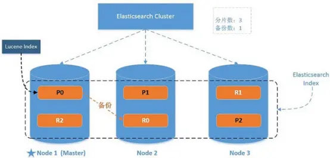
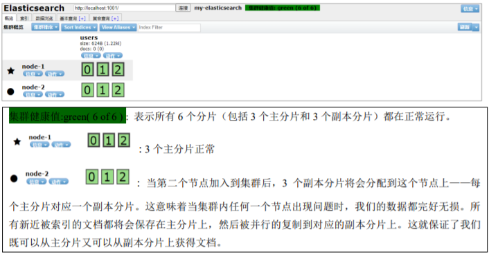
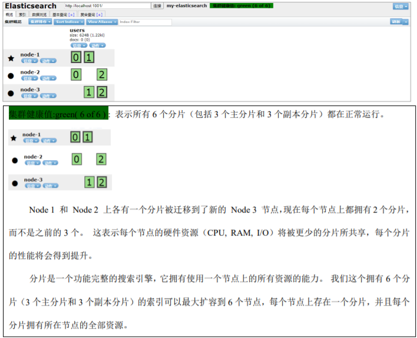
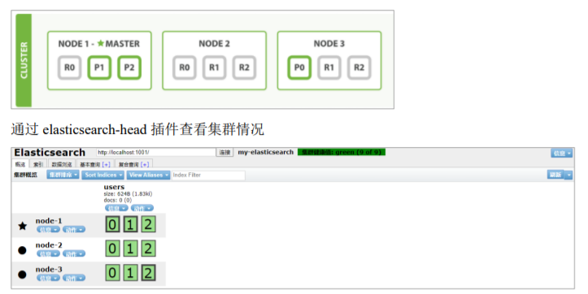

	es7.8已经移除type概念.

错误的创建索引语句

```
PUT /dangdang1
{
  "mappings": {
    "book":{  # 这里指定了类型type
      "properties": {
        "id": {
          "type": "integer"
        },
        "name": {
          "type": "keyword"
        },
        "price": {
          "type": "double"
        },
        "detail": {
          "type": "text"
        }
      }
    }
  }
}
```

正确的创建索引映射的语句

```
PUT /dangdang
{
  "mappings": {
      # 这里不再写类型
      "properties": {
        "id": {
          "type": "integer"
        },
        "name": {
          "type": "keyword"
        },
        "price": {
          "type": "double"
        },
        "detail": {
          "type": "text"
        }
      }
  }
}
```

# IK分词器安装

https://github.com/medcl/elasticsearch-analysis-ik/releases下载对应es版本的zip,解压到es/plugin/ik/下

```
ik分词器有两种分词模式：ik_max_word和ik_smart模式。
1、ik_max_word
会将文本做最细粒度的拆分，比如会将“中华人民共和国人民大会堂”拆分为“中华人民共和国、中华人民、中华、
华人、人民共和国、人民、共和国、大会堂、大会、会堂等词语。
2、ik_smart
会做最粗粒度的拆分，比如会将“中华人民共和国人民大会堂”拆分为中华人民共和国、人民大会堂。
```

# Elastic Stack

Elasticsearch Elasticsearch 基于java，是个开源分布式搜索引擎，它的特点有：分布式，零配置，自动发现，索引自动分片，索引 副本机制，restful风格接口，多数据源，自动搜索负载等。 

Logstash Logstash 基于java，是一个开源的用于收集,分析和存储日志的工具。 

Kibana Kibana 基于nodejs，也是一个开源和免费的工具，Kibana可以为 Logstash 和 ElasticSearch 提供的日志分析友好的 Web 界面，可以汇总、分析和搜索重要数据日志。 

Beats Beats是elastic公司开源的一款采集系统监控数据的代理agent，是在被监控服务器上以客户端形式运行的数据收集 器的统称，可以直接把数据发送给Elasticsearch或者通过Logstash发送给Elasticsearch，然后进行后续的数据分析活 动。 

Beats由如下组成: 

```
Packetbeat：是一个网络数据包分析器，用于监控、收集网络流量信息, Packetbeat嗅探服务器之间的流量， 解析应用层协议，并关联到消息的处理，其支 持ICMP (v4 and v6)、DNS、HTTP、Mysql、PostgreSQL、 Redis、MongoDB、Memcache等协议； 

Filebeat：用于监控、收集服务器日志文件，其已取代 logstash forwarder； 

Metricbeat：可定期获取外部系统的监控指标信息，其可以监控、收集 Apache、HAProxy、MongoDB MySQL、Nginx、PostgreSQL、Redis、System、Zookeeper等服务；

Winlogbeat：用于监控、收集Windows系统的日志信息；
```


# 基础操作

## 索引

```
#创建索引 相当与mysql创建表
put /shopping
#查看索引
get /shopping
#查看所有索引信息
get /_cat/indices?v
#删除索引
delete /shopping
```

## 创建修改文档

```
#创建文档(数据)
#自动生成id:如果没有指定数据唯一标识id,es服务器会随机生成
post /shopping/_doc
{
 "title":"小米手机",
 "category":"小米",
 "images":"http://www.gulixueyuan.com/xm.jpg",
 "price":3999.00
}
#手动指定id post
post /shopping/_doc/1
{
 "title":"华为手机",
 "category":"华为",
 "images":"http://www.teligen.com/xm.jpg",
 "price":3999.00
}
#如果增加数据时明确数据主键，那么请求方式也可以为 PUT
#手动指定id put
put /shopping/_doc/2
{
 "title":"金立手机",
 "category":"金立",
 "images":"http://www.teligen.com/xm.jpg",
 "price":3444.00
}
#创建文档也可以将_doc替换为_create
post /shopping/_doc/4
{
 "title":"vivo手机",
 "category":"vivo",
 "images":"http://www.tvivo.com/xm.jpg",
 "price":4444.00
}

#修改整个文档 与新增文档语法一样 覆盖 执行成功会返回版本和操作
#post或put
post /shopping/_doc/1
...
#修改某个字段  只能post
post /shopping/_update/1
{
 "doc":{
  "price":1000.00
 }
}
```

## 简单查询

```
#根据id查询单条
get /shopping/_doc/2
#查询索引下的所有数据
get /shopping/_search
```

## 删除

删除一个文档不会立即从磁盘上移除，它只是被标记成已删除（逻辑删除)

```
#根据id删除
delete /shopping/_doc/4
#根据条件删除
delete /shopping/_delete_by_query
{
  "query":{
 	"match":{
 	  "price":4000.00
     }
   }
}
```

# 查询

## 条件查询+分页+排序

```
#路径中  麻烦
get /shopping/_search?q=category:小米

#条件匹配查询
get /shopping/_search
{
  "query": {
    "match": {
      "category":"小米"
    }
  }
}

#全查询 数据量太大 通常分页
get /shopping/_search
{
  "query": {
    "match_all": {}
  }
}
#分页  from=(page-1)*size
get /shopping/_search
{
  "query": {
    "match_all": {}
  },
  "from":0,
  "size":2
}

#只显示某字段  或者在_source下通过includes和excludes来指定显示和部显示的字段
get /shopping/_search
{
  "query": {
    "match_all": {}
  },
  "_source":[
    "title"
  ]
}

#单字段排序
get /shopping/_search
{
  "query": {
    "match_all": {}
  },
  "sort":{
    "price":{
      "order":"desc"
    }
  }
}
#多字段排序
//假定我们想要结合使用 age 和 _score 进行查询，并且匹配的结果首先按照年龄排序，然后
按照相关性得分排序
get /shopping/_search
{
 "query": {
  "match_all": {}
  },
 "sort": [
  {
   "age": {
   "order": "desc"
  }
 },
 {
  "_score":{
   "order": "desc"
   }
  }
 ]
```

## 多字段匹配

```
//能查询出title或category包含米的文档
GET /shopping/_search
{
  "query": {
    "multi_match": {
      "query": "米",
      "fields": ["title","category"]
    }
 }
}
```

## 多条件组合查询

`bool`把各种其它查询通过`must`（必须 ）、`must_not`（必须不）、`should`（应该）的方 式进行组合

```
#与
get /shopping/_search
{
  "query": {
    "bool": {
      "must":[
        {
          "match":{
            "category":"小米"
           }
        },
        {
            "match":{
             "price":"1000.00"
           }
        }
      ]
    }
  }
}

#或  把must换成should
get /shopping/_search
{
  "query": {
    "bool": {
      "should":[
        {
          "match":{
            "category":"小米"
           }
        },
        {
            "match":{
             "category":"华为"
           }
        }
      ]
    }
  }
}
#must_not必须不
```

## 范围过滤

```
#条件匹配查询
get /student/_search
{
 "query": {
  "range": {
   "age": {
    "gte": 30,
    "lte": 35
    }
   }
  }
}

get /shopping/_search
{
  "query": {
    "bool": {
      "filter":{
        "range": {
          "price": {
            "gt": 3000
          }
        }
      }
    }
  }
}
```

## 精确匹配

```
#match_phrase  对比match
get /shopping/_search
{
  "query": {
    "match_phrase": {
      "category":"小华"
    }
  }
}
// 注意 term查询测试失败
//或使用term精确匹配,不对查询条件进行分词
GET /shopping/_search
{
   "query": {
     "term": {
      "category": {
       "value": "小华"
       }
     }
   }
}
//多关键字精确匹配(类似mysql的in)
GET /shopping/_search
{
   "query": {
     "terms": {
       "title": ["华为手机","米米手机"]
     }
   }
}
```

## 指定查询和显示字段

默认情况下，Elasticsearch 在搜索的结果中，会把文档中保存在 _source 的所有字段都返回。 如果我们只想获取其中的部分字段，我们可以添加 _source 的过滤

```
//指定查询字段
get /user/_search
{
 "_source": ["name","nickname"],
 "query": {
 "terms": {
 "nickname": ["zhangsan"]
 }
 }
}
//指定显示包括字段
get /user/_search
{
 "_source": {
 "includes": ["name","nickname"]
 },
 "query": {
 "terms": {
 "nickname": ["zhangsan"]
 }
 }
}
//排除字段
get /user/_search
{
 "_source": {
 "excludes": ["name","nickname"]
 },
 "query": {
 "terms": {
 "nickname": ["zhangsan"]
 }
 }
}

```


## 高亮显示字段

```
get /shopping/_search
{
  "query": {
    "match": {
      "category":"小米"
    }
  },
  "highlight":{
    "fields": {
      "category": {}
    }
  }
}
//可以通过pre_tags和post_tags自定义标签样式
{
 "query": {
  "match": {
   "name": "zhangsan"
  }
 },
 "highlight": {
  "pre_tags": "<font color='red'>",
  "post_tags": "</font>",
  "fields": {
   "name": {}
  }
 }
}
```

## 聚合查询(统计,分组)

```
//分组统计个数   支持同时分多组()
//price_group为自定义分组的名称   field指定分组的字段
get /shopping/_search
{
  "aggs":{
    "price_group":{
      "terms": {
        "field": "price"
      }
    }
  }
}
//上述查询除了显示统计的每组数据个数以外还显示了原始数据
//去除原始数据
get /shopping/_search
{
  "aggs":{
    "price_group":{
      "terms": {
        "field": "price"
      }
    }
  },
  "size":0
}
//对text类型字段进行分组需要将字段fielddata设置为true

//统计分组后的平均值(只有一个,不是每个分组的平均值),类似的还有max min sum count.
//stats聚合可对某个字段一次性返回上述五个指标的值
get /shopping/_search
{
  "aggs":{
    "price_avg":{
      "avg": {
        "field": "price"
      }
    }
  },
  "size":0
}
```

## 模糊查询

返回包含与搜索字词相似的字词的文档。 

编辑距离是将一个术语转换为另一个术语所需的一个字符更改的次数。这些更改可以包括： 

更改字符（box → fox） 

删除字符（black → lack）

插入字符（sic → sick） 

转置两个相邻字符（act → cat） 

为了找到相似的术语，fuzzy 查询会在指定的编辑距离内创建一组搜索词的所有可能的变体 或扩展。然后查询返回每个扩展的完全匹配。 通过 fuzziness 修改编辑距离。一般使用默认值 AUTO，根据术语的长度生成编辑距离。

```
{
   "query": {
     "fuzzy": {
       "title": {
         "value": "zhangsan"
       }
     }
   }
}
```

结果zhangsan2 ,  1zhangsan ,  shangsan 等都会被查出来.

指定fuzziness的模糊查询

```
{
 "query": {
  "fuzzy": {
   "title": {
    "value": "zhangsan",
    "fuzziness": 2
   }
  }
 }
}
```


# 映射(类似mysql表设计)

映射数据说明： 

1.字段名：任意填写，下面指定许多属性，例如：title、subtitle、images、price 

2.type：类型，Elasticsearch 中支持的数据类型非常丰富，说几个关键的： 

```
String 类型，又分两种： 
1)text：可分词 
2)keyword：不可分词，数据会作为完整字段进行匹配
Numerical：数值类型，分两类
1)基本数据类型：long、integer、short、byte、double、float、half_float 
2)浮点数的高精度类型：scaled_float 
Date：日期类型
Array：数组类型
Object：对象
```

3.index：是否索引，默认为 true，也就是说你不进行任何配置，所有字段都会被索引。 

true：字段会被索引，则可以用来进行搜索

 false：字段不会被索引，不能用来搜索 

4.store：是否将数据进行独立存储，默认为 false

 原始的文本会存储在_source 里面，默认情况下其他提取出来的字段都不是独立存储 的，是从_source 里面提取出来的。当然你也可以独立的存储某个字段，只要设置 "store": true 即可，获取独立存储的字段要比从_source 中解析快得多，但是也会占用 更多的空间，所以要根据实际业务需求来设置。 

5.analyzer：分词器，这里的 ik_max_word 即使用 ik 分词器,后面会有专门的章节学习

## 创建

```
//创建索引
put /user
//创建mapping
put /user/_mapping
{
 "properties": {
  "name":{
   "type": "text",
   "index": true
  },
  "sex":{
   "type": "keyword",
   "index": true
  },
  "tel":{
   "type": "keyword",
   "index": false
  }
 }
}
//查看映射
get /user/_mapping
//添加数据
put /user/_doc/1001
{
  "name":"张三",
  "sex":"男的",
  "tel":"11111"
}
```

## 测试

```
//可以查询到张三,text分词
get /user/_search
{
  "query": {
    "match": {
      "name":"三"
    }
  }
}
//不可以查询到张三,keyword全匹配
get /user/_search
{
  "query": {
    "match": {
      "sex":"男"
    }
  }
}
//报错,不能被查询
get /user/_search
{
  "query": {
    "match": {
      "tel":"11111"
    }
  }
}
```

# 索引模板

```
put /_template/template_1
```


```
index_patterns   插入匹配规则 如 idx_users*  一般后面接日期
aliases  	查询别名    使用该名字查询所有匹配的表
```


# java api

ES原生api有RestClient和RestHighLevelClient

二者都是根据`RestClientBuilder`生成的

```
//先生成RestClientBuilder  如果是集群 可传HttpHost数组
RestClientBuilder restClientBuilder = RestClient.builder(new HttpHost("localhost",9200 ,"http"));
//如果有密码,需要进行如下配置
CredentialsProvider credentialsProvider = new BasicCredentialsProvider();
Credentials credentials = new UsernamePasswordCredentials("username","password");
credentialsProvider.setCredentials(Auth.ANY, credentials);
restClientBuilder.setHttpClientConfigCallback((httpClientBuiler) -> 
	httpClientBuilder.setDefaultCredentialsProvider(credentialsProvider));

//创建RestClient
RestClient client = restClientBuilder.builder();
//创建RestHighLevelClient
RestHighLevelClient client = new RestHighLevelClient(restClientBuilder);
```

> 如果在Spring应用中要使用两者, 可通过创建两者共同的工厂对象, 提供二者的工厂方法

## RestClient

```
		<dependency>
            <groupId>org.elasticsearch</groupId>
            <artifactId>elasticsearch</artifactId>
            <version>7.8.0</version>
        </dependency>
```


## RestHighLevelClient

```
       
        <!-- elasticsearch 的客户端 -->
        <dependency>
            <groupId>org.elasticsearch.client</groupId>
            <artifactId>elasticsearch-rest-high-level-client</artifactId>
            <version>7.8.0</version>
        </dependency>
```

下面的操作都需要的client代码段

```
// 创建es客户端对象
RestHighLevelClient client = new RestHighLevelClient(
      RestClient.builder(new HttpHost("localhost", 9200, "http"))
);
client.close();
```

### 索引

```
// 创建索引 - 请求对象
CreateIndexRequest request = new CreateIndexRequest("student");
// 发送请求，获取响应
CreateIndexResponse response = client.indices().create(request,
RequestOptions.DEFAULT);
boolean acknowledged = response.isAcknowledged();
// 响应状态
System.out.println("操作状态 = " + acknowledged);
```

```
import org.elasticsearch.client.indices.CreateIndexRequest;
import org.elasticsearch.client.indices.CreateIndexResponse;
```

GET _cat/indices?v 可看到索引信息

正常日志也会显示响应内容

```
// 查询索引 - 请求对象
GetIndexRequest request = new GetIndexRequest("student");
// 发送请求，获取响应
GetIndexResponse response = client.indices().get(request,
      RequestOptions.DEFAULT);
System.out.println("aliases:"+response.getAliases());
System.out.println("mappings:"+response.getMappings());
System.out.println("settings:"+response.getSettings());
```

```
import org.elasticsearch.client.indices.GetIndexRequest;
import org.elasticsearch.client.indices.GetIndexResponse;
```

```
// 删除索引 - 请求对象
DeleteIndexRequest request = new DeleteIndexRequest("student");
// 发送请求，获取响应
AcknowledgedResponse response = client.indices().delete(request,
      RequestOptions.DEFAULT);
// 操作结果
System.out.println("操作结果 ： " + response.isAcknowledged());
```

### 文档

```
public class Student {
   private String name;
   private String sex;
   private Integer age;
   //..gettor settor
 }
```

```
import com.fasterxml.jackson.databind.ObjectMapper;
```

**新增**

```
// 新增文档 - 请求对象
IndexRequest request = new IndexRequest();
// 设置索引及唯一性标识
request.index("student").id("1001");
// 创建数据对象
Student stu = new Student();
stu.setName("zhangsan");
stu.setAge(30);
stu.setSex("男");
//必须将数据转换为json
ObjectMapper objectMapper = new ObjectMapper();
String productJson = objectMapper.writeValueAsString(stu);
// 添加文档数据，数据格式为 JSON 格式
request.source(productJson, XContentType.JSON);
// 客户端发送请求，获取响应对象
IndexResponse response = client.index(request, RequestOptions.DEFAULT);
//3.打印结果信息
System.out.println("_index:" + response.getIndex());
System.out.println("_id:" + response.getId());
System.out.println("_result:" + response.getResult());//CREATED
```

**更新**

```
// 修改文档 - 请求对象
UpdateRequest request = new UpdateRequest();
// 配置修改参数
request.index("student").id("1001");
// 设置请求体，对数据进行修改
request.doc(XContentType.JSON, "sex", "女");
// 客户端发送请求，获取响应对象
UpdateResponse response = client.update(request, RequestOptions.DEFAULT);
System.out.println("_index:" + response.getIndex());
System.out.println("_id:" + response.getId());
System.out.println("_result:" + response.getResult());
```

**删除**

```
//创建请求对象
DeleteRequest request = new DeleteRequest().index("student").id("1001");
//客户端发送请求，获取响应对象
DeleteResponse response = client.delete(request, RequestOptions.DEFAULT);
//打印信息
System.out.println(response.toString());
```

id**查询**

```
//1.创建请求对象
GetRequest request = new GetRequest().index("student").id("1001");
//2.客户端发送请求，获取响应对象
GetResponse response = client.get(request, RequestOptions.DEFAULT);
//3.打印结果信息
System.out.println("_index:" + response.getIndex());
System.out.println("_type:" + response.getType());
System.out.println("_id:" + response.getId());
System.out.println("source:" + response.getSourceAsString());
```

**批量**

```
//创建批量新增请求对象
      BulkRequest request = new BulkRequest();
      request.add(new
            IndexRequest().index("student").id("1002").source(XContentType.JSON, "name",
            "shunliu"));
      request.add(new IndexRequest().index("student").id("1003").source(XContentType.JSON, "name",
            "lisi"));
      request.add(new
            IndexRequest().index("student").id("1004").source(XContentType.JSON, "name",
            "wangwu"));
//客户端发送请求，获取响应对象
      BulkResponse responses = client.bulk(request, RequestOptions.DEFAULT);
//打印结果信息
      System.out.println("took:" + responses.getTook());
      System.out.println("items:" + responses.getItems());
```

其他批量该请求类型参数,如删除

```
request.add(new DeleteRequest().index("student").id("1005"));
request.add(new DeleteRequest().index("student").id("1006"));
request.add(new DeleteRequest().index("student").id("1006"));
```

### 高级查询

**全量匹配**

```
// 创建搜索请求对象
SearchRequest request = new SearchRequest();
request.indices("student");
// 构建查询的请求体
SearchSourceBuilder sourceBuilder = new SearchSourceBuilder();
// 查询所有数据
sourceBuilder.query(QueryBuilders.matchAllQuery());
request.source(sourceBuilder);
SearchResponse response = client.search(request, RequestOptions.DEFAULT);
// 查询匹配
SearchHits hits = response.getHits();
System.out.println("took:" + response.getTook());
System.out.println("timeout:" + response.isTimedOut());
System.out.println("total:" + hits.getTotalHits());
System.out.println("MaxScore:" + hits.getMaxScore());
System.out.println("hits========>>");
for (SearchHit hit : hits) {
//输出每条查询的结果信息
   System.out.println(hit.getSourceAsString());
}
System.out.println("<<========");
```

**条件精确匹配**term

```
// 创建搜索请求对象
SearchRequest request = new SearchRequest();
request.indices("student");
// 构建查询的请求体
SearchSourceBuilder sourceBuilder = new SearchSourceBuilder();
sourceBuilder.query(QueryBuilders.termQuery("name", "zhangsan"));
request.source(sourceBuilder);
SearchResponse response = client.search(request, RequestOptions.DEFAULT);
// 查询匹配
SearchHits hits = response.getHits();
System.out.println("took:" + response.getTook());
System.out.println("timeout:" + response.isTimedOut());
System.out.println("total:" + hits.getTotalHits());
System.out.println("MaxScore:" + hits.getMaxScore());
System.out.println("hits========>>");
for (SearchHit hit : hits) {
//输出每条查询的结果信息
    System.out.println(hit.getSourceAsString());
}
System.out.println("<<========");
```

**分页**

```
// 创建搜索请求对象
SearchRequest request = new SearchRequest();
request.indices("student");
// 构建查询的请求体
SearchSourceBuilder sourceBuilder = new SearchSourceBuilder();
sourceBuilder.query(QueryBuilders.matchAllQuery());
// 分页查询
// 当前页其实索引(第一条数据的顺序号)，from
sourceBuilder.from(0);
// 每页显示多少条 size
sourceBuilder.size(2);
request.source(sourceBuilder);
SearchResponse response = client.search(request, RequestOptions.DEFAULT);
```

**排序**

```
// 创建搜索请求对象
      SearchRequest request = new SearchRequest();
      // 构建查询的请求体
      SearchSourceBuilder sourceBuilder = new SearchSourceBuilder();
      sourceBuilder.query(QueryBuilders.matchAllQuery());
// 排序
      sourceBuilder.sort("age", SortOrder.ASC);
      request.source(sourceBuilder);
      SearchResponse response = client.search(request, RequestOptions.DEFAULT);
```

**过滤**

```
// 创建搜索请求对象
SearchRequest request = new SearchRequest();
request.indices("student");
// 构建查询的请求体
SearchSourceBuilder sourceBuilder = new SearchSourceBuilder();
sourceBuilder.query(QueryBuilders.matchAllQuery());
//查询字段过滤
String[] excludes = {};
String[] includes = {"name", "age"};
sourceBuilder.fetchSource(includes, excludes);
request.source(sourceBuilder);
SearchResponse response = client.search(request, RequestOptions.DEFAULT);
```

**组合条件**

```
// 创建搜索请求对象
SearchRequest request = new SearchRequest();
// 构建查询的请求体
SearchSourceBuilder sourceBuilder = new SearchSourceBuilder();
BoolQueryBuilder boolQueryBuilder = QueryBuilders.boolQuery();
// 必须包含
boolQueryBuilder.must(QueryBuilders.matchQuery("age", "30"));
// 一定不含
boolQueryBuilder.mustNot(QueryBuilders.matchQuery("name", "zhangsan"));
// 可能包含
boolQueryBuilder.should(QueryBuilders.matchQuery("sex", "男"));
sourceBuilder.query(boolQueryBuilder);
request.source(sourceBuilder);
SearchResponse response = client.search(request, RequestOptions.DEFAULT);
```

**范围查询**

```
// 创建搜索请求对象
SearchRequest request = new SearchRequest();
request.indices("student");
// 构建查询的请求体
SearchSourceBuilder sourceBuilder = new SearchSourceBuilder();
RangeQueryBuilder rangeQuery = QueryBuilders.rangeQuery("age");
// 大于等于
rangeQuery.gte("30");
// 小于等于
rangeQuery.lte("40");
sourceBuilder.query(rangeQuery);
request.source(sourceBuilder);
SearchResponse response = client.search(request, RequestOptions.DEFAULT);
```

**模糊查询**

```
Fuzziness.ONE表示可接受一个字符不同  多一个或者少一个
Fuzziness.TWO...
```

```
// 创建搜索请求对象
SearchRequest request = new SearchRequest();
request.indices("student");
// 构建查询的请求体
SearchSourceBuilder sourceBuilder = new SearchSourceBuilder();
sourceBuilder.query(QueryBuilders.fuzzyQuery("name","zhangsan").fuzziness(Fuzziness.ONE));
request.source(sourceBuilder);
SearchResponse response = client.search(request, RequestOptions.DEFAULT);
```

**高亮**

```
// 高亮查询
SearchRequest request = new SearchRequest().indices("student");
//2.创建查询请求体构建器
SearchSourceBuilder sourceBuilder = new SearchSourceBuilder();
//构建查询方式：高亮查询
TermsQueryBuilder termsQueryBuilder =
QueryBuilders.termsQuery("name","zhangsan");
//设置 查询方式
sourceBuilder.query(termsQueryBuilder);
//构建高亮字段
HighlightBuilder highlightBuilder = new HighlightBuilder();
highlightBuilder.preTags("<font color='red'>");//设置标签前缀
highlightBuilder.postTags("</font>");//设置标签后缀
highlightBuilder.field("name");//设置高亮字段
//设置高亮构建对象
sourceBuilder.highlighter(highlightBuilder);
//设置请求体
request.source(sourceBuilder);
//3.客户端发送请求，获取响应对象
SearchResponse response = client.search(request, RequestOptions.DEFAULT);
```

**聚合**,**分组**

最大年龄

```
// 高亮查询
SearchRequest request = new SearchRequest().indices("student");
SearchSourceBuilder sourceBuilder = new SearchSourceBuilder();
sourceBuilder.aggregation(AggregationBuilders.max("maxAge").field("age"));
//设置请求体
request.source(sourceBuilder);
//3.客户端发送请求，获取响应对象
SearchResponse response = client.search(request, RequestOptions.DEFAULT);
//4.打印响应结果
SearchHits hits = response.getHits();
System.out.println(response);
```

最后显示"aggregations":{"max#maxAge":{"value":52.0}}

分组

```
SearchRequest request = new SearchRequest().indices("student");
SearchSourceBuilder sourceBuilder = new SearchSourceBuilder();
sourceBuilder.aggregation(AggregationBuilders.terms("age_groupby").field("age"));
//设置请求体
request.source(sourceBuilder);
//3.客户端发送请求，获取响应对象
SearchResponse response = client.search(request, RequestOptions.DEFAULT);
//4.打印响应结果
SearchHits hits = response.getHits();
System.out.println(response);
```

## Jest

[官方文档](https://github.com/searchbox-io/Jest/tree/master/jest)


## Spring Data

```
<dependency>
    <groupId>org.springframework.boot</groupId>
    <artifactId>spring-boot-starter-data-elasticsearch</artifactId>
</dependency>
<dependency>
```

```
# es 服务地址
elasticsearch.host=127.0.0.1
# es 服务端口
elasticsearch.port=9200
# 配置日志级别,开启 debug 日志
logging.level.com.atguigu.es=debug
```

```
@SpringBootApplication
public class Application {
   public static void main(String[] args) {
      SpringApplication.run(Application.class,args);
   }
}
```

```
@Data
@NoArgsConstructor
@AllArgsConstructor
@ToString
@Document(indexName = "product", shards = 3, replicas = 1)
public class Product {
	@Id
	private Long id;//商品唯一标识
	@Field(type = FieldType.Text, analyzer = "ik_max_word")
	private String title;//商品名称
	@Field(type = FieldType.Keyword)
	private String category;//分类名称
	@Field(type = FieldType.Double)
	private Double price;//商品价格
	@Field(type = FieldType.Keyword, index = false)
	private String images;//图片地址
}
```

```
@ConfigurationProperties(prefix = "elasticsearch")
@Configuration
@Data
public class EsConfig   extends AbstractElasticsearchConfiguration {
   private String host ;
   private Integer port ;

	//注入 ElasticsearchRestTemplate
	//在新版的 spring-data-elasticsearch 中，ElasticsearchRestTemplate 代替了原来的 ElasticsearchTemplate
	//原因是 ElasticsearchTemplate 基于 TransportClient，TransportClient 即将在 8.x 以后的版本中移除。所以，我们推荐使用 ElasticsearchRestTemplate。
	//ElasticsearchRestTemplate 基 于 RestHighLevelClient 客户端的。需要自定义配置类，继承AbstractElasticsearchConfiguration，并实现 elasticsearchClient()抽象方法，创建 RestHighLevelClient 对象。
   @Override
   public RestHighLevelClient elasticsearchClient() {
      RestClientBuilder builder = RestClient.builder(new HttpHost(host, port));
      RestHighLevelClient restHighLevelClient = new
            RestHighLevelClient(builder);
      return restHighLevelClient;
   }
}
```

```
@Repository
public interface ProductDao extends ElasticsearchRepository<Product,Long> {
}
```

### 索引操作

```
@RunWith(SpringRunner.class)
@SpringBootTest
public class EsIndexTest {
   @Autowired
   private ElasticsearchRestTemplate elasticsearchRestTemplate;

   @Test
   public void createIndex(){
      //创建索引，系统初始化会自动创建索引
      System.out.println("创建索引");
      //创建完后可以查看es中
   }
   @Test
   public void deleteIndex(){
      boolean flg = elasticsearchRestTemplate.deleteIndex(Product.class);
      System.out.println("删除索引 = " + flg);
   }
}
```

### 文档操作

```
@RunWith(SpringRunner.class)
@SpringBootTest
public class EsDocTest {
   @Autowired
   private ProductDao productDao;
   //插入
   @Test
   public void save(){
      Product product = new Product();
      product.setId(4L);
      product.setTitle("vivo手机");
      product.setCategory("手机");
      product.setPrice(2663.0);
      product.setImages("http://www.vivo/vivo.jpg");
      productDao.save(product);
   }
   //修改
   @Test
   public void update(){
      Product product = new Product();
      product.setId(2L);
      product.setTitle("小米2");
      product.setCategory("手机");
      product.setPrice(9999.0);
      product.setImages("http://www.mi2/xm.jpg");
      productDao.save(product);
   }
   //根据 id 查询
   @Test
   public void findById(){
      Product product = productDao.findById(3L).get();
      System.out.println(product);
   }
   //查询所有
   @Test
   public void findAll(){
      Iterable<Product> products = productDao.findAll();
      for (Product product : products) {
         System.out.println(product);
      }
   }
   //删除
   @Test
   public void delete(){
      Product product = new Product();
      product.setId(1L);
      productDao.delete(product);
   }
   //批量新增
   @Test
   public void saveAll(){
      List<Product> productList = new ArrayList<>();
      for (int i = 0; i < 10; i++) {
         Product product = new Product();
         product.setId(Long.valueOf(i));
         product.setTitle("["+i+"]小米手机");
         product.setCategory("手机");
         product.setPrice(1999.0+i);
         product.setImages("http://www.atguigu/xm.jpg");
         productList.add(product);
      }
      productDao.saveAll(productList);
   }
   //分页查询
   @Test
   public void findByPageable(){
      //设置排序(排序方式，正序还是倒序，排序的 id)
      Sort sort = Sort.by(Sort.Direction.DESC,"id");
      int currentPage=0;//当前页，第一页从 0 开始，1 表示第二页
      int pageSize = 5;//每页显示多少条
      //设置查询分页
      PageRequest pageRequest = PageRequest.of(currentPage, pageSize,sort);
      //分页查询
      Page<Product> productPage = productDao.findAll(pageRequest);
      for (Product Product : productPage.getContent()) {
         System.out.println(Product);
      }
   }
}
```

### 查询操作

```
import org.elasticsearch.index.query.TermQueryBuilder;
```

```
@RunWith(SpringRunner.class)
@SpringBootTest
public class EsSearchTest {
   @Autowired
   private ProductDao productDao;
   /**
    * term 查询  全匹配
    * search(termQueryBuilder) 调用搜索方法，参数查询构建器对象
    */
   @Test
   public void termQuery(){
      TermQueryBuilder termQueryBuilder = QueryBuilders.termQuery("title", "金立手机");
      Iterable<Product> products = productDao.search(termQueryBuilder);
      for (Product product : products) {
         System.out.println(product);
      }
   }
   /**
    * term 查询加分页
    */
   @Test
   public void termQueryByPage(){
      int currentPage= 0 ;
      int pageSize = 5;
      //设置查询分页
      PageRequest pageRequest = PageRequest.of(currentPage, pageSize);
      TermQueryBuilder termQueryBuilder = QueryBuilders.termQuery("title", "小米");
            Iterable<Product> products =
                  productDao.search(termQueryBuilder,pageRequest);
      for (Product product : products) {
         System.out.println(product);
      }
   }
}
```


# 集群

## win

1.创建 elasticsearch-cluster 文件夹，在内部复制三个 elasticsearch 服务

2.修改集群文件目录中每个节点的 config/elasticsearch.yml 配置文件

node1

```
#节点 1 的配置信息：
#集群名称，节点之间要保持一致
cluster.name: my-elasticsearch
#节点名称，集群内要唯一
node.name: node-1001
node.master: true
node.data: true
#ip 地址
network.host: localhost
#http 端口
http.port: 1001
#tcp 监听端口
transport.tcp.port: 9301
#discovery.seed_hosts: ["localhost:9301", "localhost:9302","localhost:9303"]
#discovery.zen.fd.ping_timeout: 1m
#discovery.zen.fd.ping_retries: 5
#集群内的可以被选为主节点的节点列表
#cluster.initial_master_nodes: ["node-1", "node-2","node-3"]
#跨域配置
#action.destructive_requires_name: true
http.cors.enabled: true
http.cors.allow-origin: "*"
```

node2

```
#节点 2 的配置信息：
#集群名称，节点之间要保持一致
cluster.name: my-elasticsearch
#节点名称，集群内要唯一
node.name: node-1002
node.master: true
node.data: true
#ip 地址
network.host: localhost
#http 端口
http.port: 1002
#tcp 监听端口
transport.tcp.port: 9302
discovery.seed_hosts: ["localhost:9301"]
discovery.zen.fd.ping_timeout: 1m
discovery.zen.fd.ping_retries: 5
#集群内的可以被选为主节点的节点列表
#cluster.initial_master_nodes: ["node-1", "node-2","node-3"]
#跨域配置
#action.destructive_requires_name: true
http.cors.enabled: true
http.cors.allow-origin: "*"
```

node3

```
#节点 3 的配置信息：
#集群名称，节点之间要保持一致
cluster.name: my-elasticsearch
#节点名称，集群内要唯一
node.name: node-1003
node.master: true
node.data: true
#ip 地址
network.host: localhost
#http 端口
http.port: 1003
#tcp 监听端口
transport.tcp.port: 9303
#候选主节点的地址，在开启服务后可以被选为主节点
discovery.seed_hosts: ["localhost:9301", "localhost:9302"]
discovery.zen.fd.ping_timeout: 1m
discovery.zen.fd.ping_retries: 5
#集群内的可以被选为主节点的节点列表
#cluster.initial_master_nodes: ["node-1", "node-2","node-3"]
#跨域配置
#action.destructive_requires_name: true
http.cors.enabled: true
http.cors.allow-origin: "*"
```

3.启动前先删除每个节点中的 data 目录中所有内容（如果存在）

4.分别双击执行 bin/elasticsearch.bat, 启动节点服务器，启动后，会自动加入指定名称的 集群

使用get /_cluster/health查看每台节点

向1001增加索引

在1002查询索引

## linux

```
# 解压缩
tar -zxvf elasticsearch-7.8.0-linux-x86_64.tar.gz -C /opt/module
# 改名
mv elasticsearch-7.8.0 es

#创建用户  因为es不支持root用户运行
useradd es #新增 es 用户  
passwd es #为 es 用户设置密码
userdel -r es #如果错了，可以删除再加
chown -R es:es /opt/module/es #文件夹所有者

#修改配置文件
#修改/opt/module/es/config/elasticsearch.yml 文件 并分发
# 加入如下配置
#集群名称
cluster.name: cluster-es
#节点名称，每个节点的名称不能重复
node.name: node-1
#ip 地址，每个节点的地址不能重复
network.host: linux1
#是不是有资格主节点
node.master: true
node.data: true
http.port: 9200
# head 插件需要这打开这两个配置
http.cors.allow-origin: "*"
http.cors.enabled: true
http.max_content_length: 200mb
#es7.x 之后新增的配置，初始化一个新的集群时需要此配置来选举 master
cluster.initial_master_nodes: ["node-1"]
#es7.x 之后新增的配置，节点发现
discovery.seed_hosts: ["linux1:9300","linux2:9300","linux3:9300"]
gateway.recover_after_nodes: 2
network.tcp.keep_alive: true
network.tcp.no_delay: true
transport.tcp.compress: true
#集群内同时启动的数据任务个数，默认是 2 个
cluster.routing.allocation.cluster_concurrent_rebalance: 16
#添加或删除节点及负载均衡时并发恢复的线程个数，默认 4 个
cluster.routing.allocation.node_concurrent_recoveries: 16
#初始化数据恢复时，并发恢复线程的个数，默认 4 个
cluster.routing.allocation.node_initial_primaries_recoveries: 16


#修改/etc/security/limits.conf 
# 在文件末尾中增加下面内容
# 每个进程可以打开的文件数的限制
es soft nofile 65536
es hard nofile 65536
#修改/etc/security/limits.d/20-nproc.conf
# 在文件末尾中增加下面内容
# 每个进程可以打开的文件数的限制
es soft nofile 65536
es hard nofile 65536
# 操作系统级别对每个用户创建的进程数的限制
* hard nproc 4096
# 注：* 带表 Linux 所有用户名称
#修改/etc/sysctl.conf
# 在文件中增加下面内容
# 一个进程可以拥有的 VMA(虚拟内存区域)的数量,默认值为 65536
vm.max_map_count=655360


#重新加载使配置生效
sysctl -p

cd /opt/module/es/
#启动
bin/elasticsearch
#后台启动
bin/elasticsearch -d
```

# 概念

**索引（Index）** 

一个索引就是一个拥有几分相似特征的文档的集合。 Elasticsearch 索引的精髓：一切设计都是为了提高搜索的性能。 

**文档（Document**） 

一个文档是一个可被索引的基础信息单元，也就是一条数据 

**字段（Field）** 

相当于是数据表的字段，对文档数据根据不同属性进行的分类标识

**映射（Mapping）** 

mapping 是处理数据的方式和规则方面做一些限制，如：某个字段的数据类型、默认值、 分析器、是否被索引等等。这些都是映射里面可以设置的，其它就是处理 ES 里面数据的一 些使用规则设置也叫做映射，按着最优规则处理数据对性能提高很大，因此才需要建立映射， 并且需要思考如何建立映射才能对性能更好。

**分片（Shards）** 

一个索引可以存储超出单个节点硬件限制的大量数据。每个分 片本身也是一个功能完善并且独立的“索引”，这个“索引”可以被放置到集群中的任何节点 上。

分片很重要，主要有两方面的原因： 

1）允许你水平分割 / 扩展你的内容容量。 

2）允许你在分片之上进行分布式的、并行的操作，进而提高性能/吞吐量。 

至于一个分片怎样分布，它的文档怎样聚合和搜索请求，是完全由 Elasticsearch 管理的， 对于作为用户的你来说，这些都是透明的，无需过分关心。

被混淆的概念是，一个 Lucene 索引在 Elasticsearch 称作 分片 。 一个 Elasticsearch 索引 是分片的集合。 当 Elasticsearch 在索引中搜索的时候， 他发送查询 到每一个属于索引的分片(Lucene 索引)，然后合并每个分片的结果到一个全局的结果集。

**副本（Replicas）**  

1.在分片/节点失败的情况下，提供了高可用性。 

2.扩展吞吐量，因为搜索可以在所有的副本上并行运行。

**分配（Allocation）** 

将分片分配给某个节点的过程，包括分配主分片或者副本。如果是副本，还包含从主分 片复制数据的过程。这个过程是由 master 节点完成的。

## 系统架构



一个运行中的 Elasticsearch 实例称为一个节点，而集群是由一个或者多个拥有相同 cluster.name 配置的节点组成， 它们共同承担数据和负载的压力。

​	当有节点加入集群中或者 从集群中移除节点时，集群将会重新平均分布所有的数据。 当一个节点被选举成为主节点时， 它将负责管理集群范围内的所有变更，例如增加、 删除索引，或者增加、删除节点等。 而主节点并不需要涉及到文档级别的变更和搜索等操 作，所以当集群只拥有一个主节点的情况下，即使流量的增加它也不会成为瓶颈。 任何节 点都可以成为主节点。我们的示例集群就只有一个节点，所以它同时也成为了主节点。 

​	作为用户，我们可以将请求发送到集群中的任何节点 ，包括主节点。 每个节点都知道 任意文档所处的位置，并且能够将我们的请求直接转发到存储我们所需文档的节点。 无论 我们将请求发送到哪个节点，它都能负责从各个包含我们所需文档的节点收集回数据，并将 最终结果返回給客户端。 Elasticsearch 对这一切的管理都是透明的。

### 指定分片与副本

```
//3个分片1个副本
put /users
{
 "settings" : {
 "number_of_shards" : 3,
 "number_of_replicas" : 1
 }
}
```

GET _cat/indices?v 查看 与其他比较

如果当前是单节点集群,则3个主分片都在单节点上.

但是如果通过head插件查看集群情况时会发现健康值是yellow

3 个主分片正常

 3 个副本分片都是 Unassigned —— 它们都没有被分配到任何节点。 在同 一个节点上既保存原始数据又保存副本是没有意义的，因为一旦失去了那个节点，我们也将丢失该节点 上的所有副本数据。

启动两个节点就都会变成绿色.

如果无法分配副本则可以尝试将

cluster.routing.allocation.disk.threshold_enable: false



### 水平扩容

3个节点的集群1个副本



但是如果我们想要扩容超过 6 个节点怎么办呢？ 

  主分片的数目在索引创建时就已经确定了下来。实际上，这个数目定义了这个索引能够 存储 的最大数据量。（实际大小取决于你的数据、硬件和使用场景。） 但是，读操作—— 搜索和返回数据——可以同时被主分片 或 副本分片所处理，所以当你拥有越多的副本分片 时，也将拥有越高的吞吐量。 

  在运行中的集群上是可以动态调整副本分片数目的，我们可以按需伸缩集群。让我们把 副本数从默认的 1 增加到 2

{ "number_of_replicas" : 2 }

users 索引现在拥有 9 个分片：3 个主分片和 6 个副本分片。 这意味着我们可以将集群 扩容到 9 个节点，每个节点上一个分片。相比原来 3 个节点时，集群搜索性能可以提升 3 倍。



当然，如果只是在相同节点数目的集群上增加更多的副本分片并不能提高性能，因为每 个分片从节点上获得的资源会变少。 你需要增加更多的硬件资源来提升吞吐量。 但是更多的副本分片数提高了数据冗余量：按照上面的节点配置，我们可以在失去 2 个节点 的情况下不丢失任何数据。

## 路由计算

  当索引一个文档的时候，文档会被存储到一个主分片中。 Elasticsearch 如何知道一个 文档应该存放到哪个分片中呢？当我们创建文档时，它如何决定这个文档应当被存储在分片 1 还是分片 2 中呢？首先这肯定不会是随机的，否则将来要获取文档的时候我们就不知道 从何处寻找了。实际上，这个过程是根据下面这个公式决定的：

shard = hash(routing) % number_of_primary_shards

  routing 是一个可变值，默认是文档的 _id ，也可以设置成一个自定义的值。 routing 通过 hash 函数生成一个数字，然后这个数字再除以 number_of_primary_shards （主分片的数量）后得到余数 。这个分布在 0 到 number_of_primary_shards-1 之间的余数，就是我们所寻求 的文档所在分片的位置。

  这就解释了为什么我们要在创建索引的时候就确定好主分片的数量 并且永远不会改变 这个数量：因为如果数量变化了，那么所有之前路由的值都会无效，文档也再也找不到了。 

  所有的文档 API（ get 、 index 、 delete 、 bulk 、 update 以及 mget ）都接受一 个叫做 routing 的路由参数 ，通过这个参数我们可以自定义文档到分片的映射。一个自定 义的路由参数可以用来确保所有相关的文档——例如所有属于同一个用户的文档——都被 存储到同一个分片中。

# 分片控制

我们可以发送请求到集群中的任一节点。 每个节点都有能力处理任意请求。 每个节点都知 道集群中任一文档位置，所以可以直接将请求转发到需要的节点上。 在下面的例子中，将 所有的请求发送到 Node 1，我们将其称为 协调节点(coordinating node) 。

## 写流程

1.客户端向 Node 1 发送新建、索引或者删除请求。 

2.节点使用文档的 _id 确定文档属于分片 0 。请求会被转发到 Node 3，因为分片 0 的 主分片目前被分配在 Node 3 上。

3.Node 3 在主分片上面执行请求。如果成功了，它将请求并行转发到 Node 1 和 Node 2 的副本分片上。一旦所有的副本分片都报告成功, Node 3 将向协调节点报告成功，协调 节点向客户端报告成功。

在客户端收到成功响应时，文档变更已经在主分片和所有副本分片执行完成，变更是安全的。 有一些可选的请求参数允许您影响这个过程，可能以数据安全为代价提升性能。这些选项很 少使用，因为 Elasticsearch 已经很快，但是为了完整起见，可设置以下参数：

**consistency:**

consistency，即一致性。在默认设置下，即使仅仅是在试图执行一个_写_操作之 前，主分片都会要求 必须要有 规定数量(quorum)（或者换种说法，也即必须要 有大多数）的分片副本处于活跃可用状态，才会去执行_写_操作(其中分片副本 可以是主分片或者副本分片)。这是为了避免在发生网络分区故障（network partition）的时候进行_写_操作，进而导致数据不一致。_规定数量_即：

 int( (primary + number_of_replicas) / 2 ) + 1 

consistency 参数的值可以设为 one （只要主分片状态 ok 就允许执行_写_操 作）,all（必须要主分片和所有副本分片的状态没问题才允许执行_写_操作）, 或 quorum 。默认值为 quorum , 即大多数的分片副本状态没问题就允许执行_写_ 操作。 

注意，规定数量 的计算公式中 number_of_replicas 指的是在索引设置中的设定 副本分片数，而不是指当前处理活动状态的副本分片数。如果你的索引设置中指定了当前索引拥有三个副本分片，那规定数量的计算结果即： 

int( (primary + 3 replicas) / 2 ) + 1 = 3 

如果此时你只启动两个节点，那么处于活跃状态的分片副本数量就达不到规定数 量，也因此您将无法索引和删除任何文档。

**timeout** :

如果没有足够的副本分片会发生什么？ Elasticsearch 会等待，希望更多的分片出 现。默认情况下，它最多等待 1 分钟。 如果你需要，你可以使用 timeout 参数 使它更早终止： 100 100 毫秒，30s 是 30 秒。

## 读流程(轮询)

1.客户端向 Node 1 发送获取请求。

2.节点使用文档的 _id 来确定文档属于分片 0 。分片 0 的副本分片存在于所有的三个 节点上。 在这种情况下，它将请求转发到 Node 2 。 

3..Node 2 将文档返回给 Node 1 ，然后将文档返回给客户端。 

在处理读取请求时，协调结点在每次请求的时候都会通过轮询所有的副本分片来达到负载均 衡。在文档被检索时，已经被索引的文档可能已经存在于主分片上但是还没有复制到副本分 片。 在这种情况下，副本分片可能会报告文档不存在，但是主分片可能成功返回文档。 一 旦索引请求成功返回给用户，文档在主分片和副本分片都是可用的。

# 多文档操作流程

mget 和 bulk API 的模式类似于单文档模式。区别在于协调节点知道每个文档存在于 哪个分片中。它将整个多文档请求分解成 每个分片 的多文档请求，并且将这些请求并行转 发到每个参与节点。

 协调节点一旦收到来自每个节点的应答，就将每个节点的响应收集整理成单个响应，返 回给客户端

**用单个 mget 请求取回多个文档所需的步骤顺序:**

1. 客户端向 Node 1 发送 mget 请求。

2. Node 1 为每个分片构建多文档获取请求，然后并行转发这些请求到托管在每个所需的 主分片或者副本分片的节点上。一旦收到所有答复， Node 1 构建响应并将其返回给客 户端。

   可以对 docs 数组中每个文档设置 routing 参数。


bulk API， 允许在单个批量请求中执行多个创建、索引、删除和更新请求。

**bulk API 按如下步骤顺序执行：**

1.客户端向 Node 1 发送 bulk 请求。 

2.Node 1 为每个节点创建一个批量请求，并将这些请求并行转发到每个包含主分片的节 点主机。

3.主分片一个接一个按顺序执行每个操作。当每个操作成功时，主分片并行转发新文档（或 删除）到副本分片，然后执行下一个操作。 一旦所有的副本分片报告所有操作成功， 该节点将向协调节点报告成功，协调节点将这些响应收集整理并返回给客户端。

# 分片原理

分片是 Elasticsearch 最小的工作单元。但是究竟什么是一个分片，它是如何工作的？ 

传统的数据库每个字段存储单个值，但这对全文检索并不够。文本字段中的每个单词需 要被搜索，对数据库意味着需要单个字段有索引多值的能力。最好的支持是一个字段多个值 需求的数据结构是倒排索引。

## 倒排索引

Elasticsearch 使用一种称为倒排索引的结构，它适用于快速的全文搜索。 

见其名，知其意，有倒排索引，肯定会对应有正向索引。正向索引（forward index）， 反向索引（inverted index）更熟悉的名字是倒排索引。 

所谓的正向索引，就是搜索引擎会将待搜索的文件都对应一个文件 ID，搜索时将这个 ID 和搜索关键字进行对应，形成 K-V 对，然后对关键字进行统计计数

但是互联网上收录在搜索引擎中的文档的数目是个天文数字，这样的索引结构根本无法满足 实时返回排名结果的要求。所以，搜索引擎会将正向索引重新构建为倒排索引，即把文件 ID对应到关键词的映射转换为关键词到文件ID的映射，每个关键词都对应着一系列的文件， 这些文件中都出现这个关键词。

一个倒排索引由文档中所有不重复词的列表构成，对于其中每个词，有一个包含它的文 档列表。

早期的全文检索会为整个文档集合建立一个很大的倒排索引并将其写入到磁盘。 一旦 新的索引就绪，旧的就会被其替换，这样最近的变化便可以被检索到。 

倒排索引被写入磁盘后是 不可改变 的:它永远不会修改。 

不变性有重要的价值： 

1.不需要锁。如果你从来不更新索引，你就不需要担心多进程同时修改数据的问题。 

2.一旦索引被读入内核的文件系统缓存，便会留在哪里，由于其不变性。只要文件系统缓存中还有足够 的空间，那么大部分读请求会直接请求内存，而不会命中磁盘。这提供了很大的性能提升。 

3.其它缓存(像 filter 缓存)，在索引的生命周期内始终有效。它们不需要在每次数据改变时被重建，因为 数据不会变化。 

4.写入单个大的倒排索引允许数据被压缩，减少磁盘 I/O 和 需要被缓存到内存的索引的使用量。

当然，一个不变的索引也有不好的地方。主要事实是它是不可变的! 你不能修改它。如 果你需要让一个新的文档 可被搜索，你需要重建整个索引。这要么对一个索引所能包含的 数据量造成了很大的限制，要么对索引可被更新的频率造成了很大的限制。


**如何在保留不变性的前提下实现倒排索引的更新？**

答案是: 用更多的索引。通过增加新的补充索引来反映新近的修改，而不是直接重写整 个倒排索引。每一个倒排索引都会被轮流查询到，从最早的开始查询完后再对结果进行合并。 

Elasticsearch 基于 Lucene, 这个 java 库引入了按段搜索的概念。 每一 段 本身都是一 个倒排索引， 但索引在 Lucene 中除表示所有段的集合外， 还增加了提交点的概念 — 一 个列出了所有已知段的文件

按段搜索会以如下流程执行：

1.新文档被收集到内存索引缓存

2.不时地, 缓存被 提交 

(1) 一个新的段—一个追加的倒排索引—被写入磁盘。 

(2) 一个新的包含新段名字的 提交点 被写入磁盘 

(3) 磁盘进行 同步 — 所有在文件系统缓存中等待的写入都刷新到磁盘，以确保它们 被写入物理文件

3.新的段被开启，让它包含的文档可见以被搜索

4.内存缓存被清空，等待接收新的文档

当一个查询被触发，所有已知的段按顺序被查询。词项统计会对所有段的结果进行聚合，以 保证每个词和每个文档的关联都被准确计算。 这种方式可以用相对较低的成本将新文档添 加到索引。

段是不可改变的，所以既不能从把文档从旧的段中移除，也不能修改旧的段来进行反映文档 的更新。 取而代之的是，每个提交点会包含一个 .del 文件，文件中会列出这些被删除文档 的段信息。 

当一个文档被 “删除” 时，它实际上只是在 .del 文件中被 标记 删除。一个被标记删除的文档仍然可以被查询匹配到， 但它会在最终结果被返回前从结果集中移除。 

文档更新也是类似的操作方式：当一个文档被更新时，旧版本文档被标记删除，文档的新版 本被索引到一个新的段中。 可能两个版本的文档都会被一个查询匹配到，但被删除的那个 旧版本文档在结果集返回前就已经被移除。

# 文档分析

分析 包含下面的过程： 

1.将一块文本分成适合于倒排索引的独立的 词条 

2.将这些词条统一化为标准格式以提高它们的“可搜索性”，或者 recall 分析器执行上面的工作。

分析器实际上是将三个功能封装到了一个包里： 

1)字符过滤器 

首先，字符串按顺序通过每个 字符过滤器 。他们的任务是在分词前整理字符串。一个 字符过滤器可以用来去掉 HTML，或者将 & 转化成 and。 

2)分词器 

其次，字符串被 分词器 分为单个的词条。一个简单的分词器遇到空格和标点的时候， 可能会将文本拆分成词条。 

3)Token 过滤器

最后，词条按顺序通过每个 token 过滤器 。这个过程可能会改变词条（例如，小写化 Quick ），删除词条（例如， 像 a， and， the 等无用词），或者增加词条（例如，像 jump 和 leap 这种同义词）

## 内置分析器

Elasticsearch 还附带了可以直接使用的预包装的分析器。接下来我们会列出最重要的分 析器。为了证明它们的差异，我们看看每个分析器会从下面的字符串得到哪些词条：

"Set the shape to semi-transparent by calling set_trans(5)"

1.标准分析器 

标准分析器是 Elasticsearch 默认使用的分析器。它是分析各种语言文本最常用的选择。 它根据 Unicode 联盟 定义的 单词边界 划分文本。删除绝大部分标点。最后，将词条小写。 

它会产生： set, the, shape, to, semi, transparent, by, calling, set_trans, 5

2.简单分析器 

简单分析器在任何不是字母的地方分隔文本，将词条小写。

它会产生： set, the, shape, to, semi, transparent, by, calling, set, trans

3.空格分析器 

空格分析器在空格的地方划分文本。

它会产生： Set, the, shape, to, semi-transparent, by, calling, set_trans(5)

4.语言分析器

 特定语言分析器可用于 很多语言。它们可以考虑指定语言的特点。例如， 英语 分析 器附带了一组英语无用词（常用单词，例如 and 或者 the ，它们对相关性没有多少影响）， 它们会被删除。 由于理解英语语法的规则，这个分词器可以提取英语单词的 词干 。

英语 分词器会产生下面的词条： set, shape, semi, transpar, call, set_tran, 5

 注意看 transparent、 calling 和 set_trans 已经变为词根格式
