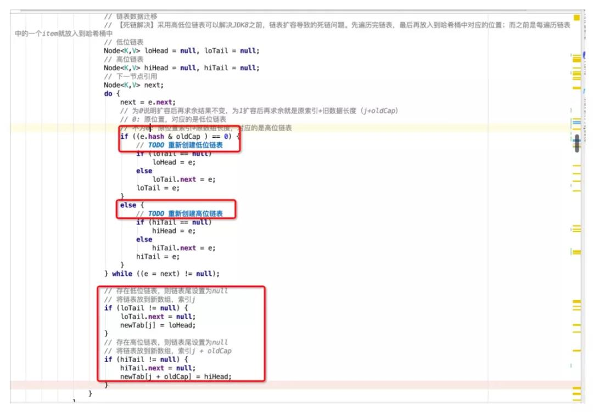
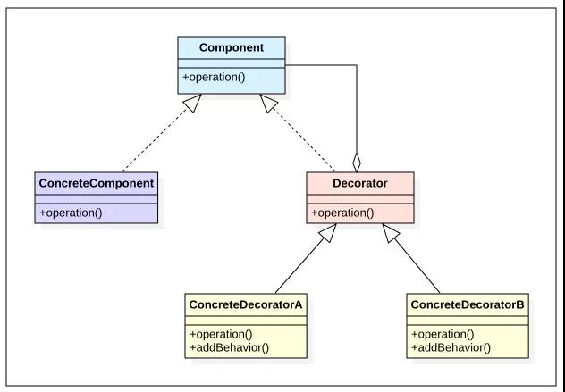
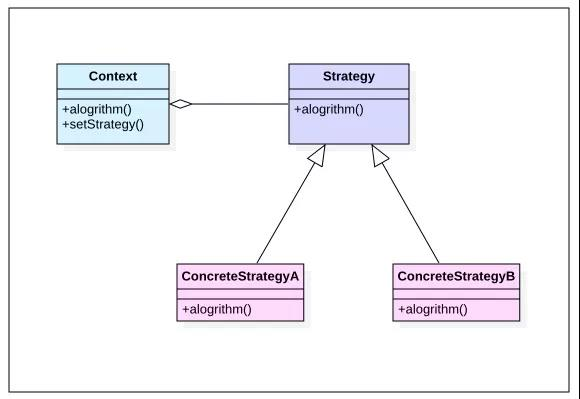
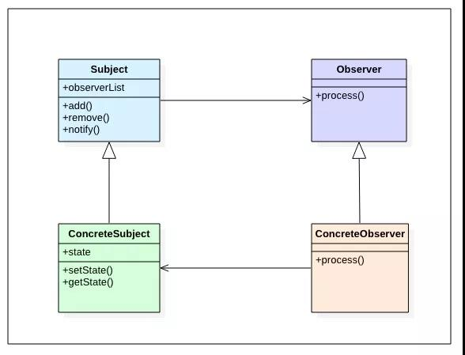

# Java

## 集合

### ArrarList

- toArray 返回的是新数组,通过Arrays.copyOf方法生成;
- 大量调用native方法System.arraycopy,如指定插入位置的add方法,remove方法,Arrays.copyOf方法其实也是调用了arraycopy方法.类似C语言操作数组;
- ensureCapacity方法在ArrayList内部没有被调用过,是给用户使用的,最好在 add 大量元素之前用 ensureCapacity 方法，以减少增量重新分配的次数

### HashMap

 JDK1.8 以后的 `HashMap` 在解决哈希冲突时有了较大的变化，当链表长度大于阈值（默认为 8,这个阈值为表示链表或红黑树大小的阈值,是常量）（将链表转换成红黑树前会判断，如果当前数组的长度小于 64，那么会选择先进行数组扩容，而不是转换为红黑树）时，将链表转化为红黑树，以减少搜索时间.

| 名称            | 用途                                                         |
| --------------- | ------------------------------------------------------------ |
| initialCapacity | HashMap 初始容量                                             |
| loadFactor      | 负载因子,控制数组存放数据的疏密程度                          |
| threshold       | 当前 HashMap 所能容纳键值对数量的最大值，超过这个值，则需扩容 |

默认情况下，HashMap 初始容量是16，负载因子为 0.75.

`threshold = capacity * loadFactor`

> `HashMap` 可以存储 null 的 key 和 value，但 null 作为键只能有一个，null 作为值可以有多个

**自动扩容**

扩容发生在putVal方法的最后，即写入元素之后才会判断是否需要扩容操作，当自增后的size大于之前所计算好的阈值threshold，即执行resize操作。

在resize中, 通过位运算<<1进行容量扩充，即扩容1倍，同时新的阈值newThr也扩容为旧阈值的1倍。

扩容时，总共存在三种情况：

- 哈希桶数组中某个位置只有1个元素，即不存在哈希冲突时，则直接将该元素copy至新哈希桶数组的对应位置即可。

- 哈希桶数组中某个位置的节点为树节点时，则执行红黑树的扩容操作。

- 哈希桶数组中某个位置的节点为普通节点时，则执行链表扩容操作，在JDK1.8中，为了避免之前版本中并发扩容所导致的死链问题(头插法)，引入了高低位链表辅助进行扩容操作。

**初始化与懒加载**

初始化的时候只会设置默认的负载因子，并不会进行其他初始化的操作，在首次使用的时候才会进行初始化。

当new一个新的HashMap的时候，不会立即对哈希数组进行初始化，而是在首次put元素的时候，通过resize()方法进行初始化。

resize()中会设置默认的初始化容量DEFAULT_INITIAL_CAPACITY为16，扩容的阈值为0.75*16 = 12，即哈希桶数组中元素达到12个便进行扩容操作。

最后创建容量为16的Node数组，并赋值给成员变量哈希桶table，即完成了HashMap的初始化操作。

**哈希计算**

哈希表以哈希命名，足以说明哈希计算在该数据结构中的重要程度。而在实现中，JDK并没有直接使用Object的native方法返回的hashCode作为最终的哈希值，而是进行了二次加工。

该二次加工hash与ConcurrentHashMap有一点不同,  核心的计算逻辑相同，都是使用key对应的hashCode与其hashCode右移16位的结果进行异或操作。此处，将高16位与低16位进行异或的操作称之为扰动函数，目的是将高位的特征融入到低位之中，降低哈希冲突的概率。

举个例子来理解下扰动函数的作用：

```
hashCode(key1) = 0000 0000 0000 1111 0000 0000 0000 0010
hashCode(key2) = 0000 0000 0000 0000 0000 0000 0000 0010
```

若HashMap容量为4，在不使用扰动函数的情况下，key1与key2的hashCode注定会冲突（后两位相同，均为01）。

经过扰动函数处理后，可见key1与key2 hashcode的后两位不同，上述的哈希冲突也就避免了。

```
hashCode(key1) ^ (hashCode(key1) >>> 16)
0000 0000 0000 1111 0000 0000 0000 1101

hashCode(key2) ^ (hashCode(key2) >>> 16)
0000 0000 0000 0000 0000 0000 0000 0010
```

这种增益会随着HashMap容量的减少而增加。《An introduction to optimising a hashing strategy》文章中随机选取了哈希值不同的352个字符串，当HashMap的容量为2^9时，使用扰动函数可以减少10%的碰撞，可见扰动函数的必要性。

此外，ConcurrentHashMap中经过扰乱函数处理之后，需要与HASH_BITS做与运算，HASH_BITS为0x7ffffff，即只有最高位为0，这样运算的结果使hashCode永远为正数。在ConcurrentHashMap中，预定义了几个特殊节点的hashCode，如：MOVED、TREEBIN、RESERVED，它们的hashCode均定义为负值。因此，将普通节点的hashCode限定为正数，也就是为了防止与这些特殊节点的hashCode产生冲突。

> 通过哈希运算，可以将不同的输入值映射到指定的区间范围内，随之而来的是**哈希冲突**问题。考虑一个极端的case，假设所有的输入元素经过哈希运算之后，都映射到同一个哈希桶中，那么查询的复杂度将不再是O(1)，而是O(n)，相当于线性表的顺序遍历。因此，哈希冲突是影响哈希计算性能的重要因素之一。哈希冲突如何解决呢？主要从两个方面考虑，一方面是避免冲突，另一方面是在冲突时合理地解决冲突，尽可能提高查询效率。前者在上面的章节中已经进行介绍，即通过扰动函数来增加hashCode的随机性，避免冲突。针对后者，HashMap中给出了两种方案：拉链表与红黑树。

①**拉链表**

在JDK1.8之前，HashMap中是采用拉链表的方法来解决冲突，即当计算出的hashCode对应的桶上已经存在元素，但两者key不同时，会基于桶中已存在的元素拉出一条链表，将新元素链到已存在元素的前面。当查询存在冲突的哈希桶时，会顺序遍历冲突链上的元素。同一key的判断逻辑如下，先判断hash值是否相同，再比较key的地址或值是否相同。

```
if(p.hash == hash &&
	((k = p.key) == key || (key != null && key.equals(k))))
```

死链条:在JDK1.8之前，HashMap在并发场景下扩容时存在一个bug，形成死链，导致get该位置元素的时候，会死循环，使CPU利用率高居不下。这也说明了HashMap不适于用在高并发的场景，高并发应该优先考虑JUC中的ConcurrentHashMap。然而，精益求精的JDK开发者们并没有选择绕过问题，而是选择直面问题并解决它。在JDK1.8之中，引入了高低位链表（双端链表）。

什么是高低位链表呢？在扩容时，哈希桶数组buckets会扩容一倍，以容量为8的HashMap为例，原有容量8扩容至16，将[0, 7]称为低位，[8, 15]称为高位，低位对应loHead、loTail，高位对应hiHead、hiTail。

扩容时会依次遍历旧buckets数组的每一个位置上面的元素：

- 若不存在冲突，则重新进行hash取模，并copy到新buckets数组中的对应位置。
- 若存在冲突元素，则采用高低位链表进行处理。通过e.hash & oldCap来判断取模后是落在高位还是低位。举个例子：假设当前元素hashCode为0001（忽略高位），其运算结果等于0，说明扩容后结果不变，取模后还是落在低位[0, 7]，即0001 & 1000 = 0000，还是原位置，再用低位链表将这类的元素链接起来。假设当前元素的hashCode为1001， 其运算结果不为0，即1001 & 1000 = 1000 ，扩容后会落在高位，新的位置刚好是旧数组索引（1） + 旧数据长度（8） = 9，再用高位链表将这些元素链接起来。最后，将高低位链表的头节点分别放在扩容后数组newTab的指定位置上，即完成了扩容操作。这种实现降低了对共享资源newTab的访问频次，先组织冲突节点，最后再放入newTab的指定位置。避免了JDK1.8之前每遍历一个元素就放入newTab中，从而导致并发扩容下的死链问题。



②**红黑树**

在JDK1.8之中，HashMap引入了红黑树来处理哈希冲突问题，而不再是拉链表。那么为什么要引入红黑树来替代链表呢？虽然链表的插入性能是O(1)，但查询性能确是O(n)，当哈希冲突元素非常多时，这种查询性能是难以接受的。因此，在JDK1.8中，如果冲突链上的元素数量大于8，并且哈希桶数组的长度大于64时，会使用红黑树代替链表来解决哈希冲突，此时的节点会被封装成TreeNode而不再是Node（TreeNode其实继承了Node，以利用多态特性），使查询具备O(logn)的性能。

这里简单地回顾一下红黑树，它是一种平衡的二叉树搜索树，类似地还有AVL树。两者核心的区别是AVL树追求“绝对平衡”，在插入、删除节点时，成本要高于红黑树，但也因此拥有了更好的查询性能，适用于读多写少的场景。然而，对于HashMap而言，读写操作其实难分伯仲，因此选择红黑树也算是在读写性能上的一种折中。

**位运算相关**

①**为什么哈希桶数组的大小为大于等于给定值的最小2的整数次幂?**

tableSizeFor根据输入容量大小cap来计算最终哈希桶数组的容量大小，找到大于等于给定值cap的最小2的整数次幂。

```
static final int tableSizeFor(int cap){
	int n = cap -1;
	n |= n >>> 1;
	n |= n >>> 2;
	n |= n >>> 4;
	n |= n >>> 8;
	n |= n >>> 16;
	return (n < 0) ? 1 : (n >= MAXIMUM_CAPACITY) ? MAXIMUM_CAPACITY : n + 1;
}
```

> 整个过程是找到cap对应二进制中最高位的1，然后每次以2倍的步长（依次移位1、2、4、8、16）复制最高位1到后面的所有低位，把最高位1后面的所有位全部置为1，最后进行+1，即完成了进位。

为了提高计算与存储效率，使每个元素对应hash值能够准确落入哈希桶数组给定的范围区间内。确定数组下标采用的算法是 hash & (n - 1)，n即为哈希桶数组的大小。由于其总是2的整数次幂，这意味着n-1的二进制形式永远都是0000111111的形式，即从最低位开始，连续出现多个1，该二进制与任何值进行&运算都会使该值映射到指定区间[0, n-1]。比如：当n=8时，n-1对应的二进制为0111，任何与0111进行&运算都会落入[0,7]的范围内，即落入给定的8个哈希桶中，存储空间利用率100%。举个反例，当n=7，n-1对应的二进制为0110，任何与0110进行&运算会落入到第0、6、4、2个哈希桶，而不是[0,6]的区间范围内，少了1、3、5三个哈希桶，这导致存储空间利用率只有不到60%，同时也增加了哈希碰撞的几率。

②**ASHIFT偏移量计算**

ASHIFT用于获取给定值的最高有效位数（移位除了能够进行乘除运算，还能用于保留高、低位操作，右移保留高位，左移保留低位）。

ConcurrentHashMap中的ABASE+ASHIFT是用来计算哈希数组中某个元素在实际内存中的初始位置，ASHIFT采取的计算方式是31与scale前导0的数量做差，也就是scale的实际位数-1。scale就是哈希桶数组Node[]中每个元素的大小，通过((long)i << ASHIFT) + ABASE)进行计算，便可得到数组中第i个元素的起始内存地址。

前导0的数量是通过Integer的静态方法numberOfLeadingZeros计算出来的.

假设 i = 0000 0000 0000 0100 0000 0000 0000 0000，n = 1

```
i >>> 16  0000 0000 0000 0000 0000 0000 0000 0100   不为0
i >>> 24  0000 0000 0000 0000 0000 0000 0000 0000   等于0
```

右移了24位等于0，说明24位到31位之间肯定全为0，即n = 1 + 8 = 9，由于高8位全为0，并且已经将信息记录至n中，因此可以舍弃高8位，即 i <<= 8。此时，

```
i = 0000 0100 0000 0000 0000 0000 0000 0000
```

类似地，i >>> 28 也等于0，说明28位到31位全为0，n = 9 + 4 = 13，舍弃高4位。此时，

```
i = 0100 0000 0000 0000 0000 0000 0000 0000
```

继续运算，

```
i >>> 30  0000 0000 0000 0000 0000 0000 0000 0001   不为0
i >>> 31  0000 0000 0000 0000 0000 0000 0000 0000   等于0
```

最终可得出n = 13，即有13个前导0。n -= i  >>> 31是检查最高位31位是否是1，因为n初始化为1，如果最高位是1，则不存在前置0，即n = n - 1 = 0。

总结一下，以上的操作其实是基于二分法的思想来定位二进制中1的最高位，先看高16位，若为0，说明1存在于低16位；反之存在高16位。由此将搜索范围由32位（确切的说是31位）减少至16位，进而再一分为二，校验高8位与低8位，以此类推。

计算过程中校验的位数依次为16、8、4、2、1，加起来刚好为31。为什么是31不是32呢？因为前置0的数量为32的情况下i只能为0，在前面的if条件中已经进行过滤。这样一来，非0值的情况下，前置0只能出现在高31位，因此只需要校验高31位即可。最终，用总位数减去计算出来的前导0的数量，即可得出二进制的最高有效位数。代码中使用的是31 - Integer.numberOfLeadingZeros(scale)，而不是总位数32，这是为了能够得到哈希桶数组中第i个元素的起始内存地址，方便进行CAS等操作。

### BitSet(BitMap)

BitSet是JAVA中对BitMap的实现

**BitMap**，即位图，使用每个位表示某种状态，适合处理整型的海量数据。本质上是哈希表的一种应用实现，原理也很简单，给定一个int整型数据，将该int整数映射到对应的位上，并将该位由0改为1。

BitMap通常用来去重 & 取两个集合的交集或并集等.

比如, 对最大值43亿左右的所有QQ号去重, 即可采用BitMap:

一个char(1B)类型的数据可以标识0-7这8个整数是否存在与否;

一个int(4B)或四个char类型的数据可以标识0-31这32个整数的存在与否;

...

要对43亿QQ号进行去重, 需要总共至少43位的多个结构类型标识每个QQ号:
4300000000/8/1024/1024≈ 512MB .  即该大小足够标识所有QQ号存在与否.

## 设计模式

### 代理模式

**静态代理**

```java
public class SmsServiceImpl implements SmsService {
    public String send(String message) {
        System.out.println("send message:" + message);
        return message;
    }
}

public class SmsProxy implements SmsService {
    private final SmsService smsService;

    public SmsProxy(SmsService smsService) {
        this.smsService = smsService;
    }

    @Override
    public String send(String message) {
        //调用方法之前，我们可以添加自己的操作
        System.out.println("before method send()");
        smsService.send(message);
        //调用方法之后，我们同样可以添加自己的操作
        System.out.println("after method send()");
        return null;
    }
}

public class Main {
    public static void main(String[] args) {
        SmsService smsService = new SmsServiceImpl();
        SmsProxy smsProxy = new SmsProxy(smsService);
        smsProxy.send("java");
    }
}
```

**Proxy**

**JDK 动态代理最致命的问题是其只能代理实现了接口的类。**

```java
public class DebugInvocationHandler implements InvocationHandler {
    private final Object target;

    public DebugInvocationHandler(Object target) {
        this.target = target;
    }

    public Object invoke(Object proxy, Method method, Object[] args) throws InvocationTargetException, IllegalAccessException {
        //调用方法之前，我们可以添加自己的操作
        System.out.println("before method " + method.getName());
        Object result = method.invoke(target, args);
        //调用方法之后，我们同样可以添加自己的操作
        System.out.println("after method " + method.getName());
        return result;
    }
}
```

```java
public class JdkProxyFactory {
    public static Object getProxy(Object target) {
        return Proxy.newProxyInstance(
                target.getClass().getClassLoader(), // 目标类的类加载
                target.getClass().getInterfaces(),  // 代理需要实现的接口，可指定多个
                new DebugInvocationHandler(target)   // 代理对象对应的自定义 InvocationHandler
        );
    }
}
```

```java
SmsService smsService = (SmsService) JdkProxyFactory.getProxy(new SmsServiceImpl());
smsService.send("java");
```

jdk动态代理也可以不使用被代理对象, 直接对接口进行代理, 比如mybatis的dao接口

```java
public class OnlyInterfaceProxyTest {
    public static void main(String[] args) {
        MyMapper mapper = (MyMapper)Proxy.newProxyInstance(MyMapper.class.getClassLoader(), new Class[]{MyMapper.class}, new InvocationHandler() {
            @Override
            public Object invoke(Object proxy, Method method, Object[] args) throws Throwable {
                if (method.getName().equals("getCount")) {
                    return 100;
                } else {
                    return Arrays.asList("100","200");
                }
            }
        });
        System.out.println(mapper.getCount());
        System.out.println(mapper.getNames());
    }
}
interface MyMapper{
    int getCount();
    List<String> getNames();
}
```

**CGLIB**

```java
public class AliSmsService {
    public String send(String message) {
        System.out.println("send message:" + message);
        return message;
    }
}

public class DebugMethodInterceptor implements MethodInterceptor {
    /**
     * @param o           代理对象（增强的对象）
     * @param method      被拦截的方法（需要增强的方法）
     * @param args        方法入参
     * @param methodProxy 用于调用原始方法
     */
    @Override
    public Object intercept(Object o, Method method, Object[] args, MethodProxy methodProxy) throws Throwable {
        //调用方法之前，我们可以添加自己的操作
        System.out.println("before method " + method.getName());
        Object object = methodProxy.invokeSuper(o, args);
        //调用方法之后，我们同样可以添加自己的操作
        System.out.println("after method " + method.getName());
        return object;
    }
}

public class CglibProxyFactory {
    public static Object getProxy(Class<?> clazz) {
        // 创建动态代理增强类
        Enhancer enhancer = new Enhancer();
        // 设置类加载器
        enhancer.setClassLoader(clazz.getClassLoader());
        // 设置被代理类
        enhancer.setSuperclass(clazz);
        // 设置方法拦截器
        enhancer.setCallback(new DebugMethodInterceptor());
        // 创建代理类
        return enhancer.create();
    }
}

AliSmsService aliSmsService = (AliSmsService) CglibProxyFactory.getProxy(AliSmsService.class);
aliSmsService.send("java");
```

 **CGLIB 动态代理是通过生成一个被代理类的子类来拦截被代理类的方法调**用，因此不能代理声明为 final 类型的类和方法。

就二者的效率来说，大部分情况都是 JDK 动态代理更优秀，随着 JDK 版本的升级，这个优势更加明显。

### 单例模式

**懒汉式**

线程安全与线程不安全区别于synchironized锁 , 加锁导致很大的性能开销，并且加锁其实只需要在第一次初始化的时候用到，之后的调用都没必要再进行加锁。

```java
public class Singleton {  
    private static Singleton instance;  
    private Singleton (){}  
    public static (synchronized) Singleton getInstance() {  
    	if (instance == null) {  
        	instance = new Singleton();  
    	}  
    	return instance;  
    }  
}
```

**饿汉式**

```java
public class Singleton {  
    private static Singleton instance = new Singleton();  
    private Singleton (){}  
    public static Singleton getInstance() {  
    return instance;  
    }  
}
```

**双检索**

对饿汉式的优化:先判断对象是否已经被初始化，再决定要不要加锁。

```java
public class Singleton {  
    private volatile static Singleton singleton;  
    private Singleton (){}  
    public static Singleton getSingleton() {  
    if (singleton == null) {  
        synchronized (Singleton.class) {  
        	if (singleton == null) {  
           	 	singleton = new Singleton();  
        	}  
        }  
    }  
    return singleton;  
    }  
}
```

>  执行双重检查是因为，如果多个线程同时了通过了第一次判空检查，并且其中一个线程首先通过了第二次检查并实例化了对象，那么剩余通过了第一次检查的线程就不会再去实例化对象。

**静态内部类**

只有显式调用 getInstance 方法时，才会显式装载 SingletonHolder 类，从而实例化 instance

```java
public class Singleton {  
    private static class SingletonHolder {  
    	private static final Singleton INSTANCE = new Singleton();  
    }  
    private Singleton (){}  
    public static final Singleton getInstance() {  
    	return SingletonHolder.INSTANCE;  
    }  
}
```

**枚举**

结合了以上所有方式的优点 ,并且防止反序列化生成对象.

```java
public enum Singleton {  
    INSTANCE;  
    public void whateverMethod() {  
    }  
}
```

**为什么双检锁需要volatile**

问题出在` singleton = new Singleton(); `这一行, 其可以分为三个步骤:

1. 分配内存空间
2. 初始化对象
3. 将对象指向刚分配的内存空间

但是有些编译器为了性能的原因，可能会将第二步和第三步进行**重排序**，顺序就成了：

1. 分配内存空间
2. 将对象指向刚分配的内存空间
3. 初始化对象

重排序后，两个线程发生了以下调用：

| Time | Thread A                  | Thread B                                  |
| :--- | :------------------------ | :---------------------------------------- |
| T1   | 检查到`singleton`为空     |                                           |
| T2   | 获取锁                    |                                           |
| T3   | 再次检查到`singleton`为空 |                                           |
| T4   | 为`singleton`分配内存空间 |                                           |
| T5   | 将`singleton`指向内存空间 |                                           |
| T6   |                           | 检查到`singleton`不为空                   |
| T7   |                           | 访问`singleton`（此时对象还未完成初始化） |
| T8   | 初始化`singleton`         |                                           |

在这种情况下，T7时刻线程B对`uniqueSingleton`的访问，访问的是一个**初始化未完成**的对象。

### 工厂模式

角色

- 抽象产品角色(都有)
- 具体产品角色(都有)
- 抽象工厂角色(工厂方法模式和抽象工厂模式有)
- 具体工厂角色(都有)
- 上下文角色(都有)——调用工厂获取对象

**简单工厂模式**

抽象产品

```java
public interface Cpu {
    void calculate();
}
```

具体产品

```java
public class ACpu implements Cpu {
    @Override
    public void calculate() {
        System.out.println("this is A cpu");
    }
}

public class BCpu implements Cpu {
    @Override
    public void calculate() {
        System.out.println("this is B cpu");
    }
}
```

具体工厂

> 创建哪种具体产品类型代码在工厂内部逻辑，如果需要新增具体产品，需要修改工厂类方法, 不符合开-闭原则    

```java
public class CpuFactory {
    public static Cpu createCpu(Class classType) {
        if (classType.getName().equals(ACpu.class.getName())) {
            return new ACpu();
        } else if (classType.getName().equals(BCpu.class.getName())) {
            return new BCpu();
        }
        return null;
    }
}
```

**工厂方法模式**

> 具体的工厂负责创建具体的产品，工厂内部的逻辑只负责创建对应对象，决定生成什么产品的逻辑在外部客户端，客户端通过选择使用具体工厂，间接决定了生成什么产品。

抽象产品

```java
public interface Cpu {
    void calculate();
}
```

具体产品

```java
public class ACpu implements Cpu {
    @Override
    public void calculate() {
        System.out.println("this is A cpu");
    }
}

public class BCpu implements Cpu {
    @Override
    public void calculate() {
        System.out.println("this is B cpu");
    }
}
```

抽象工厂

```java
public interface CpuFactory {
    Cpu createCpu();
}
```

具体工厂

```java
public class ACpuFactory implements CpuFactory{
    @Override
    public  Cpu createCpu() {
        return new ACpu();
    }
}

public class BCpuFactory implements CpuFactory {
    @Override
    public Cpu createCpu() {
        return new BCpu();
    }
}
```

常见的数据库连接工厂，SqlSessionFactory，抽象产品是一个数据库连接，具体产品至于是oracle提供的，还是mysql提供的，我并不需要关心，因为都能让我通过sql来操作数据。

**抽象工厂模式**

抽象工厂模式下，以产品族维度来建厂，一个厂里有多个创建方法，每个创建方法负责创建一个产品线(产品族)

抽象产品

```java
public interface Cpu {
    void calculate();
}

public interface Mainboard {
    void installCpu();
}
```

具体产品

```java
public class ACpu implements Cpu {
    @Override
    public void calculate() {
        System.out.println("this is A cpu");
    }
}

public class BCpu implements Cpu {
    @Override
    public void calculate() {
        System.out.println("this is B cpu");
    }
}

public class AMainboard implements Mainboard {
    @Override
    public void installCpu() {
        System.out.println("this is A mainboard");
    }
}

public class BMainboard implements Mainboard {
    @Override
    public void installCpu() {
        System.out.println("this is B mainboard");
    }
}
```

抽象工厂

```java
public interface AbatractFactory {
    Cpu createCpu();
    Mainboard createMainboard();
}
```

具体工厂

```java
public class AFactory implements AbatractFactory {
    @Override
    public Cpu createCpu() {
        return new ACpu();
    }
    @Override
    public Mainboard createMainboard() {
        return new AMainboard();
    }
}

public class BFactory implements AbatractFactory {
    @Override
    public Cpu createCpu() {
        return new BCpu();
    }
    @Override
    public Mainboard createMainboard() {
        return new BMainboard();
    }
}
```

> 抽象工厂模式分离了接口和实现 , 并使得使切换产品族变得容易.
>
> 但缺点是不太容易扩展新的产品:  每给产品族添加新产品时，就要在抽象工厂中添加新产品创建方法，同时要给所有的具体工厂增加接口。

### 装饰模式



角色：

- Component：抽象构件
- ConcreteComponent：具体构件
- Decorator：抽象装饰类
- ConcreteDecorator：具体装饰类

> - 优点：比继承更加灵活（继承是耦合度很大的静态关系），可以动态的为对象增加职责，可以通过使用不同的装饰器组合为对象扩展N个新功能，而不会影响到对象本身。
>
> - 缺点：当一个对象的装饰器过多时，会产生很多的装饰类小对象和装饰组合策略，增加系统复杂度，增加代码的阅读理解成本。

> 适用场景:
>
> - 适合需要通过配置（如：diamond）来动态增减对象功能的场景。
>
> - 适合一个对象需要N种功能排列组合的场景（如果用继承，会使子类数量爆炸式增长）, 如InputStream.

> 注意: 一个装饰类的接口必须与被装饰类的接口保持相同，对于客户端来说无论是装饰之前的对象还是装饰之后的对象都可以一致对待。

抽象构件:

```java
interface  Component{
    public void operation();
}
```

具体构件:

```java
class ConcreteComponent implements Component{
    public ConcreteComponent(){
        System.out.println("创建具体构件角色");       
    }   
    public void operation(){
        System.out.println("调用具体构件角色的方法operation()");           
    }
}
```

抽象装饰(为抽象类, 需要通过构造函数传入被装饰类对象)

```java
class Decorator implements Component{
    private Component component;   
    public Decorator(Component component){
        this.component=component;
    }   
    public void operation(){
        component.operation();
    }
}
```

具体装饰

```java
class ConcreteDecorator extends Decorator{
    public ConcreteDecorator(Component component){
        super(component);
    }   
    public void operation(){
        super.operation();
        addBehavior();
    }
    public void addBehavior(){
        System.out.println("为具体构件角色增加额外的功能addBehavior()");           
    }
}
```

使用

```java
public static void main(String[] args){
    Component component = new ConcreteComponent();
    component.operation();
    System.out.println("---------------------------------");
    Component decorator = new ConcreteDecorator(component);
    decorator.operation();
}
```

> 与JDK动态代理类似.
>
> 区别: 代理模式的访问控制主要在于对目标可的透明访问, 而装饰模式由客户端对目标类对象进行增强.

### 策略模式



角色:

- Context: 环境类
- Strategy: 抽象策略类
- ConcreteStrategy: 具体策略类

> - 优点：策略模式提供了对“开闭原则”的完美支持，用户可以在不修改原有系统的基础上选择算法或行为。干掉复杂难看的if-else。
>
> - 缺点：调用时，必须提前知道都有哪些策略模式类，才能自行决定当前场景该使用何种策略。

> 适用场景: 一个系统需要动态地在几种可替换算法中选择一种。不希望使用者关心算法细节，将具体算法封装进策略类中。

抽象策略

```java
interface Strategy{   
    public void algorithm();    //策略方法
}
```

具体策略

```java
class ConcreteStrategyA implements Strategy{
    public void algorithm(){
        System.out.println("具体策略A的策略方法被访问！");
    }
}

class ConcreteStrategyB implements Strategy{
  public void algorithm(){
      System.out.println("具体策略B的策略方法被访问！");
  }
}
```

环境类

```java
class Context{
    private Strategy strategy;
    public Strategy getStrategy(){
        return strategy;
    }
    public void setStrategy(Strategy strategy){
        this.strategy=strategy;
    }
    public void algorithm(){
        strategy.algorithm();
    }
}
```

使用

```java
public static void main(String[] args){
    Context context = new Context();
    Strategy strategyA = new ConcreteStrategyA();
    context.setStrategy(strategyA);
    context.algorithm();
    System.out.println("-----------------");
    Strategy strategyB = new ConcreteStrategyB();
    context.setStrategy(strategyB);
    context.algorithm();
}
```

### 观察者模式



角色： 

- Subject：抽象目标
- ConcreteSubject：具体目标
- Observer：抽象观察者
- ConcreteObserver：具体观察者

> - 优点：将复杂的串行处理逻辑变为单元化的独立处理逻辑，被观察者只是按照自己的逻辑发出消息，不用关心谁来消费消息，每个观察者只处理自己关心的内容。逻辑相互隔离带来简单清爽的代码结构。
>
> - 缺点：观察者较多时，可能会花费一定的开销来发消息，但这个消息可能仅一个观察者消费。

> 适用场景: 适用于一对多的的业务场景，一个对象发生变更，会触发N个对象做相应处理的场景。例如：订单调度通知，任务状态变化等。

抽象目标

```java
abstract class Subject{
    protected List<Observer> observerList = new ArrayList<Observer>();   
    public void add(Observer observer){  		//增加观察者方法
        observers.add(observer);
    }    
    public void remove(Observer observer){   	//删除观察者方法
        observers.remove(observer);
    }   
    public abstract void notify(); 				//通知观察者方法
}
```

具体目标

```java
class ConcreteSubject extends Subject{
   private Integer state;
   public void setState(Integer state){
        this.state = state;  
        notify();				// 状态改变通知观察者
    }
    public void notify(){
        System.out.println("具体目标状态发生改变...");
        System.out.println("--------------");       
        for(Observer obs:observers){
            obs.process();
        }
    }          
}
```

抽象观察者

```
interface Observer{
    void process(); //具体的处理
}
```

具体观察者

```java
class ConcreteObserverA implements Observer{
    public void process(){
        System.out.println("具体观察者A处理！");
    }
}

class ConcreteObserverB implements Observer{
    public void process(){
        System.out.println("具体观察者B处理！");
    }
}
```

使用

```java
public static void main(String[] args){
    Subject subject = new ConcreteSubject();
    Observer obsA = new ConcreteObserverA();
    Observer obsb = new ConcreteObserverB();
    subject.add(obsA);
    subject.add(obsB);
    subject.setState(0);
}
```

## IO

**io模型**

为了保证操作系统的稳定性和安全性，一个进程的地址空间划分为 **用户空间（User space）** 和 **内核空间（Kernel space ）** 。

**用户空间的程序不能直接访问内核空间**。用户进程想要执行 IO 操作的话，必须通过 **系统调用** 来间接访问内核空间.(常有磁盘io和网络io)

我们的应用程序实际上只是发起了 IO 操作的调用而已，具体 IO 的执行是由操作系统的内核来完成的。

> 当应用程序发起 I/O 调用后，会经历两个步骤：
>
> 1. 内核等待 I/O 设备准备好数据
> 2. 内核将数据从内核空间拷贝到用户空间。

**BIO**

同步阻塞模型，一个客户端连接对应一个处理线程。在BIO中，accept和read方法都是阻塞操作，如果没有连接请求，accept方法阻塞；如果无数据可读取，read方法阻塞。

BIO是基于字节流和字符流进行操作的.

**NIO**

Java 中的 NIO 是 I/O 多路复用模型

1.**同步非阻塞 IO 模型**

同步非阻塞 IO 模型中，应用程序会一直发起 read 调用，等待数据从内核空间拷贝到用户空间的这段时间里，线程依然是阻塞的，直到在内核把数据拷贝到用户空间。相比于同步阻塞 IO 模型，通过轮询操作，避免了一直阻塞。

但是，这种 IO 模型同样存在问题：**应用程序不断进行 I/O 系统调用轮询数据是否已经准备好的过程是十分消耗 CPU 资源的。**

2.**I/O 多路复用模型** 

线程首先发起 select / poll / epoll 调用，询问内核数据是否准备就绪，等内核把数据准备好了，用户线程再发起 read 调用。read 调用的过程（数据从内核空间->用户空间）还是阻塞的。

**通过减少无效的系统调用，减少了对 CPU 资源的消耗。**

Java 的 NIO中 ，客户端发送的连接请求注册在多路复用器Selector上，服务端线程通过**轮询**多路复用器查看是否有IO请求，有则进行处理。

> Epoll是Linux下多路复用IO接口select/poll的增强版本，它能显著提高程序在大量并发连接中只有少量活跃的情况下的系统CPU利用率，获取事件的时候，它无须遍历整个被侦听的描述符集，只要遍历那些被内核IO事件异步唤醒而加入Ready队列的描述符集合就行了。

**AIO**

AIO 即 NIO 2。Java 7 中引入了 NIO 的改进版 NIO 2,它是异步 IO 模型。

异步 IO 是基于**事件和回调**机制实现的，也就是应用操作之后会直接返回，不会堵塞在那里，当后台处理完成，操作系统会通知相应的线程进行后续的操作。


### Java NIO

Java NIO三大组件: Channel,Buffer,Selector

Java NIO是基于Channel和Buffer进行操作的, 数据总是从channel读取到buffer, 或从buffer写入到channel, (每个channel对应一个buffer, buffer可读可写, 通过flip切换) , 并通过selector(单线程)监听多个channel事件, 根据不同的事件在各个channel上切换.

buffer为顶层抽象类, 其下有针对各种数据类型实现的具体类. 本质为一个可读可写的内存块, 底层为一个数组.

channel类似于流, 但channel是双向的. 它是一个接口, 场景的实现类有FileChannel用于文件数据读写(可通过文件流的getChannel获取), DatagramChannel用于UDP数据读写, ServerSocketChannel 和 SockelChannel用于TCP读写.

Selector为抽象类, 可通过register方法将从ServerSocketChannel得到的SocketChannel注册到Selector上, 并返回SelectionKey, 并通过SelectionKey判断当前channel是否有事件.

Java NIO实现非阻塞简单示例:

```java
// ------------------------服务端
ServerSocketChannel serverSocketChannel = ServerSocketChannel.open();
Selector selector = Selector.open();
serverSocketChannel.socket().bind(new InetSocketAddress(6666));
serverSocketChannel.configureBlocking(false); //设置为非阻塞
serverSocketChannel.register(selector, SelectionKey.OP_ACCEPT);	//注册channel关注accept事件
while (true) {								//循环等待客户端连接
	if(selector.select(1000) == 0) {		//没有事件发生
		System.out.println("服务器等待了1秒，无连接");
		continue;
	}
	Set<SelectionKey> selectionKeys = selector.selectedKeys();
	Iterator<SelectionKey> keyIterator = selectionKeys.iterator();
	while(keyIterator.hasNext()){
		SelectionKey key = keyIterator.next();
		if(key.isAcceptable()) { 			//发生accept事件,即有新的客户端连接
			SocketChannel socketChannel = serverSocketChannel.accept();
			socketChannel.configureBlocking(false);	//设置为非阻塞
            //注册channel,关注read事件,指定Buffer
			socketChannel.register(selector,SelectionKey.OP_READ,ByteBuffer.allocate(1024));
        if(key.isReadable())				//发生read事件,即内核数据准备就绪
			SocketChannel channel = (SocketChannel)key.channel();	
			ByteBuffer buffer = (ByteBuffer)key.attachment();		
			channel.read(buffer);
			System.out.println(new String(buffer.array()));
        }
       keyIterator.remove();			//手动移除selectionKey,防止重复操作
    }
}

//--------------------------客户端
SocketChannel socketChannel = SocketChannel.open();
socketChannel.configureBlocking(false);
InetSocketAddress inetSocketAddress = new InetSocketAddress("127.0.0.1", 6666);
if (!socketChannel.connect(inetSocketAddress)) {
	while (!socketChannel.finishConnect()) {
		//未连接, 不会阻塞，可以做其它工作 ..
    }
}
String str = "Hello World",
ByteBuffer buffer = ByteBuffer.wrap(str.getBytes());
socketChannel.write(buffer);
System.in.read();
```

**零拷贝**

零拷贝技术用来避免在读写操作时操作时cpu将内核态(磁盘对应页缓存, 网络对应Socket缓冲区)复制到用户态(用户空间缓存)的过程, 具体的实现有mmap 和 sendFile.

FileChannel的transfer方法底层使用零拷贝:

```java
//-------------------服务端
InetSocketAddress address = new InetSocketAddress(8000);
ServerSocketChannel serverSocketChannel = ServerSocketChannel.open();
ServerSocket serverSocket = serverSocketChannel.socket();
serverSocket.bind(address);
ByteBuffer byteBuffer = ByteBuffer.allocate(4096);
while (true) {
	SocketChannel socketChannel = serverSocketChannel.accept();
	int readcount = 0;
	while (-1 != readcount) {
		try {
			readcount = socketChannel.read(byteBuffer);
		}catch (Exception ex) {
			break;
		}
		byteBuffer.rewind(); //position = 0
    }
}

//-----------------客户端
SocketChannel socketChannel = SocketChannel.open();
socketChannel.connect(new InetSocketAddress("localhost", 8000));
String filename = "xxx.xx";
FileChannel fileChannel = new FileInputStream(filename).getChannel();
longstartTime=System.currentTimeMillis();
long transferCount = fileChannel.transferTo(0, fileChannel.size(), socketChannel);
System.out.println("发送的总的字节数=" + transferCount + " 耗时：" + (System.currentTimeMillis()-startTime));
fileChannel.close();
```

### Netty

Netty对Java NIO进行封装, 解决Java NIO存在的问题, 具有更好的性能和优化.

#### Reactor模式

Reactor模式思想为结合 I/O多路复用模型 与 线程池.

Reactor模式中核心成员为:

1.Reactor, 在一个单独的线程中运行, 负责监听和分发事件, 分发给适当的handler对IO事件进行处理.

2.Handlers, 执行I/O事件要完成的实际事件, 非阻塞式.

Netty基于Reactor模型根据Reactor的数量和线程的数量, 有3种实现:

1.单Reactor单线程

Reactor 对象通过 Select 监控客户端请求事件，收到事件后通过 Dispatch 进行分发;
如果是建立连接请求事件，则由 Acceptor 通过 Accept 处理连接请求，然后创建一个 Handler 对象处理连接完成后的后续业务处理;
如果不是建立连接事件，则 Reactor 会分发调用连接对应的 Handler 来响应;
Handler 会完成 Read→业务处理→Send 的完整业务流程.

优点：模型简单, 无线程通信竞争.
缺点：因为是单线程, 无法发挥多核CPU优势, Handler在处理某个连接上的业务时, 整个进程无法处理其他连接事件, 性能瓶颈显著;不可靠, 如果线程终止或死循环, 导致整个通信模块不可用.


2.单Reactor多线程

在单Reactor单线程基础上进行改进:

handler 只负责响应事件，不做具体的业务处理，通过read 读取数据后，会分发给worker线程池的某个线程处理业务;
worker 线程池会分配独立线程完成真正的业务，并将结果返回给handler;
handler 收到响应后，通过 send 将结果返回给 client.

优点：可以充分的利用多核 cpu 的处理能力.
缺点：需要处理多线程数据共享问题;  reactor 依旧以单线程方式处理所有的事件的监听和分发，在高并发场景容易出现性能瓶颈.


3.主从Reactor多线程.

在单Reactor多线程基础上进行改进:

Reactor主线程 MainReactor 对象通过select监听**连接**事件，收到事件后，通过Acceptor处理连接事件;
当Acceptor处理连接事件后，MainReactor将连接分配给SubReactor;
Subreactor 将连接加入到连接队列进行监听,并创建handler进行后续工作, 结果不经MainReactor直接返回给client.

优点：主从Reactor线程分工明确, 主只需要负责接收连接并将新连接传给子, 子负责业务处理(可以有多个); 
缺点：实现复杂.

应用场景广泛,  如Nginx主从Reactor多线程模型, Memcached主从多线程, Netty主从多线程模型.


#### **Netty模型**

Netty主要对主从Reactor多线程模型进行了改造:

抽象出线程池 BossGroup 和 WorkerGroup,  BossGroup负责接收客户端的连接, WorkerGroup负责网络的读写, 它们的类型都是NioEventLoopGroup;
NioEventLoopGroup 为一个事件循环组, 组中含有多个事件循环，每一个事件循环是 NioEventLoop;
NioEventLoop 表示一个不断循环的执行处理任务的线程， 每个NioEventLoop都有一个selector，用于监听绑定在其上的socket的网络通讯;
NioEventLoopGroup可以有多个线程,即可以含有多个NioEventLoop.

每个Boss NioEventLoop循环执行的步骤为轮询accept事件 -> 处理accept事件(创建NioSocketChannel并注册到某个Worker NioEventLoop中的Selector) --> 处理任务队列的任务(runAllTasks)

每个Worker NioEventLoop循环执行的步骤为轮询read/write事件 -> 处理I/O事件(通过pipeline) --> 处理任务队列的任务(runAllTasks)

Pipeline维护多个ChannelHandler处理I/O事件.

#### 组件

1.Bootstrap/ServerBootstrap

Netty客户端/服务端引导类, 引导Netty应用, 配置整个Netty程序, 串联各个组件. 

2.Future/ChannelFuture

监听Netty异步IO操作任务, 操作完成或失败自动触发监听事件.

3.Channel

Netty网络通信组件, 用于执行网络IO. 通过其可获取当前网络连接channel的状态和连接配置参数等.

异步网络IO操作返回一个ChannelFuture.

根据协议与阻塞类型的不同, 有不同的Channel:
NioSocketChannel，异步的客户端 TCP Socket 连接。
NioServerSocketChannel，异步的服务器端TCP Socket 连接。
NioDatagramChannel，异步的UDP连接。
NioSctpChannel，异步的客户端 Sctp 连接。
NioSctpServerChannel，异步的Sctp服务器端连接，这些通道涵盖了UDP和TCP网络IO以及文件IO。

> Channel支持关联IO操作与对应的Handler

> 一个Channel包含一个ChannelPipeline

4.Selector

Netty基于Selector来实现I/O多路复用, 一个线程监听多个连接的channel, 轮询channels是否存在就绪的I/O事件.

5.ChannelHandler

接口, 负责处理I/O事件(业务处理), 并转发到其所在的ChannelPipeline中下一个Handler.

> 通常我们可以通过继承ChannelHandler的子类来使用, 如ChannelInbountHandler/ChannelOutboundHandler.

6.ChannelPipeline

包含在Channel中, 维护一个ChannelHandlerContext双向链表, 每个ChannelHandlerContext包含一个ChannelHandler, 负责处理和拦截inbound(client -> server)和 outbound(server -> client) 事件与操作.

在链表中, Inbound事件从head向后传递到最后一个inbound handler,  outbound事件会从tail往前传递到最前一个outbound hander.

> 通过addFirst和addLast添加handler

7.ChannelHandlerContext

保存Channel上下文信息, 并关联一个ChannelHandler.

8.ChannelOption

Channel配置参数:

SO_BACKLOG: 等待处理的客户端连接请求大小

SO_KEEPALIVE: 一直保持连接活动状态

9.EventLoopGroup

抽象一组EventLoop, 每个EventLoop维护一个Selector. 实现类NioEventLoopGroup.

Boss EventLoopGroup通常为一个单线程的的EventLoop ( 主从Reactor中的MainReactor ), EventLoop维护一个注册了ServerSocketChannel的Selector.  通过不断轮询Selector将OP_ACCEPT事件分离出来交给 Wocker EventLoopGroup 进行IO处理.

Worker EventLoopGroup通过next方法可以按照一定规则获取一个EventLoop将SocketChannel注册到其维护的Selector中并处理后续IO事件.( 主从Reactor中的SubReactor)

10.Unpooled

操作缓冲区的工具类, 如copiedBuffer方法根据给定的数据和编码返回一个ByteBuf对象.

ByteBuf不同于NIO中的ByteBuffer对象, 其不需要通过flip反转, 底层维护了readerIndex和writerIndex.

结合capacity可将buffer分为:

0 -- readerIndex							已读区域

readerIndex -- writerIndex		  可读区域

writerIndex -- capacity 				 可写区域

> ByteBuf也支持零拷贝

## 序列化

目前springboot , springcloud下 ,都是默认使用基于HTTP的json作为序列化的首选方案.

而JDK内置的序列化却遭到抵制.

因为这是java 利用自带api生成序列化二进制流, 所以接收端只能强制使用java 开发才能识别, 失去了异构系统的跨平台性.

> JDK序列化可通过ByteArrayXXXputStream和ObjectXXXputStream实现

连java官方也说明:" 对不信任数据的反序列化 , 从本质上来说是危险的 , 应该予以避免" . 可见java序列化是不安全的.

比如在网络传输过程(网络安全由应用程序自己规定)中, 传输的序列化后的二进制流金额数据被注入攻击修改.

而基于HTTP的RESTFul风格传输的话, 数据采用json传递, 可使用https的SSL加密传输 ,可保证过程的安全.


另外,  还有NIO的ByteBuffer序列化方式(ObjectEn/Decoder) , 在序列化执行效率上面 , 与java序列化差距不大.

但json序列化执行效率比java序列化更高(长度和速度上) , 因为java序列化需要处理对象的引用等.

> 附上其他序列化方案 Dubbo内置的hessian 和 Google的Protocol Buffers

> 一些情况 如Spring session用Redis做session共享时 和 spring cache 用redis做缓存时  ,默认都是使用的jdk序列化

> 目前流行http + json 或 tcp + protobuf 方案

### Protobuf

Netty自带的编码解码器底层使用JDK序列化实现, 效率低. 因此采用Google Prototol Buffers(简称Protobuf), 因为其高效的结构化数据存储格式, 适合数据存储与RPC数据交换.

Protobuf以message方式来管理数据, 具有高性能和高可靠性以及跨平台和语言特点.

通过protobuf编译器编译类描述的.proto文件可以生成.java文件:

```protobuf
syntax = "proto3"; 								//版本
option java_outer_classname = "StudentPOJO"; 	//外部类名与文件名
message Student { 								//内部类 为真正发送的对象
int32 id = 1; // 属性 名字id 类型int32(protobuf类型) 1表示属性序号，不是值
string name =2;
}
```

最后通过protoc.exe --java_out=.Student.proto编译后便可直接使用.

## javaagent

### Aspectj-LoadTimeWeaver

Java中存在三种织入切面方式：编译期织入、类加载期织入和运行期织入。编译期织入是指在Java编译期，采用特殊的编译器，将切面织入到Java类中；而类加载期织入则指通过特殊的类加载器，在类字节码加载到JVM时，织入切面；运行期织入则是采用CGLib工具或JDK动态代理进行切面的织入。 

AspectJ提供了两种切面织入方式，第一种通过特殊编译器，在编译期，将AspectJ语言编写的切面类织入到Java类中，可以通过一个Ant或Maven任务来完成这个操作；第二种方式是类加载期织入，也简称为LTW（Load Time Weaving）。

LTW原理就是jvm会在类加载之前将class暴露给我们制定的类，允许我们在此时对类进行修改。aspectj便利用此机会根据我们的配置生成对应的满足需求的子类。 使用方式:

```
1.配置jvm参数javaagent, 指定代理类的jar包
-javaagent D:...\org\springframework\spring-agent\2.5.6.SEC03\spring-agent-2.5.6.SEC03.jar;里面包含类:
public class InstrumentationSavingAgent {
    private static volatile Instrumentation instrumentation;
    public static void premain(String agentArgs, Instrumentation inst) {
        instrumentation = inst;
    }
    public static Instrumentation getInstrumentation() {
        return instrumentation;
    }
} 
2.包下META-INF/MANIFEST.MF文件需要配置一行:
Premain-Class: org.springframework.instrument.InstrumentationSavingAge
```

这里把Instrumentation给暴露了出来，供其它的类使用, 通过其可修改已加载类的类库。
