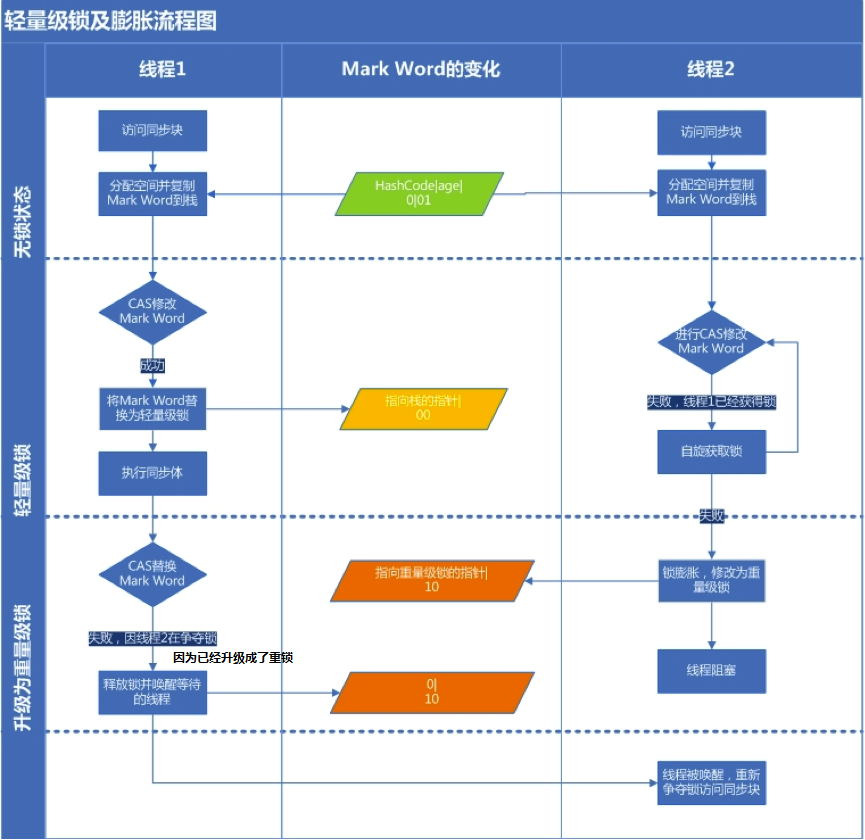
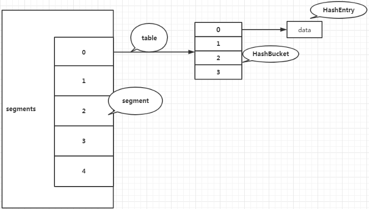
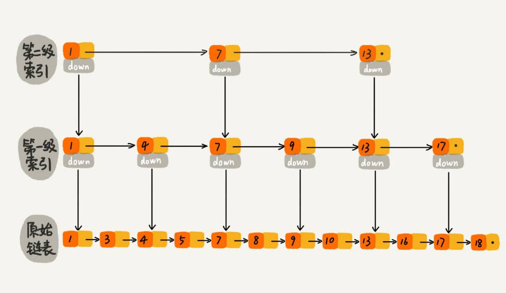
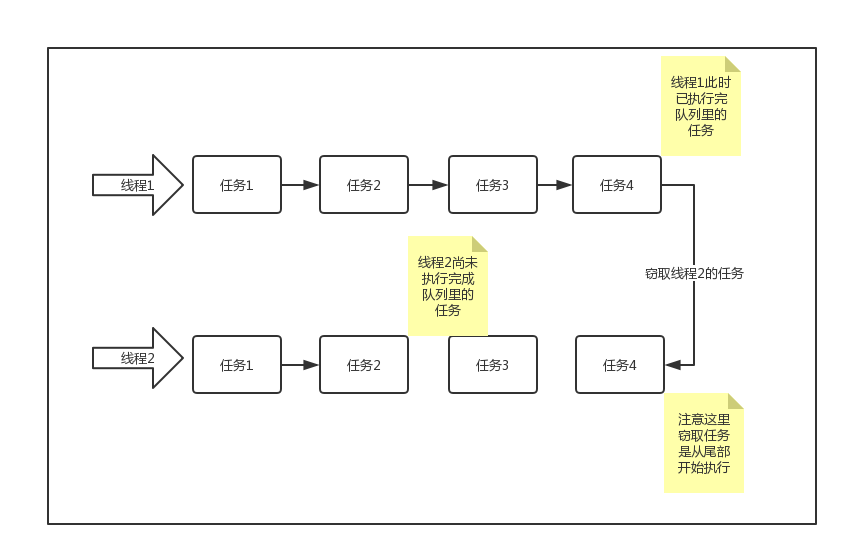
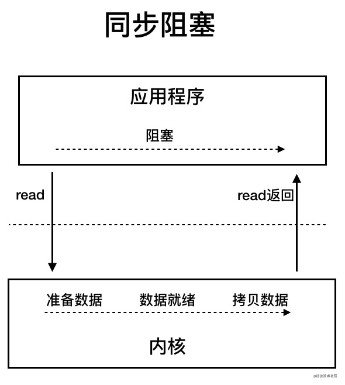

# 集合

## List

**ArrarList**

https://javaguide.cn/java/collection/arraylist-source-code/

```
toArray 返回的是新数组,通过Arrays.copyOf方法生成;
大量调用native方法System.arraycopy,如指定插入位置的add方法,remove方法,Arrays.copyOf方法其实也是调用了arraycopy方法.类似C语言操作数组;
ensureCapacity方法在ArrayList内部没有被调用过,是给用户使用的,最好在 add 大量元素之前用 ensureCapacity 方法，以减少增量重新分配的次数

```


## Map

**HashMap**

https://javaguide.cn/java/collection/hashmap-source-code/

 JDK1.8 以后的 `HashMap` 在解决哈希冲突时有了较大的变化，当链表长度大于阈值（默认为 8,这个阈值为表示链表或红黑树大小的阈值,是常量）（将链表转换成红黑树前会判断，如果当前数组的长度小于 64，那么会选择先进行数组扩容，而不是转换为红黑树）时，将链表转化为红黑树，以减少搜索时间.

| 名称            | 用途                                                         |
| --------------- | ------------------------------------------------------------ |
| initialCapacity | HashMap 初始容量                                             |
| loadFactor      | 负载因子,控制数组存放数据的疏密程度                          |
| threshold       | 当前 HashMap 所能容纳键值对数量的最大值，超过这个值，则需扩容 |

默认情况下，HashMap 初始容量是16，负载因子为 0.75.

`threshold = capacity * loadFactor`

> `HashMap` 可以存储 null 的 key 和 value，但 null 作为键只能有一个，null 作为值可以有多个

**CucurrentHashMap**

https://javaguide.cn/java/collection/concurrent-hash-map-source-code/

1.7以前为分段锁,1.8采用CAS和synchronized,只锁定当前链表或红黑二叉树的首节点，这样只要 hash 不冲突，就不会产生并发，效率又提升 N 倍。

# 并发

**进程和线程**

进程让操作系统的并发性成为了可能，而线程让进程的内部并发成为了可能。

本质的区别是是否单独占有内存地址空间及其它系统资源（比如I/O）.

进程是操作系统进行资源分配的基本单位，而线程是操作系统进行调度的基本单位]

**上下文切换**

上下文切换（有时也称做进程切换或任务切换）是指 CPU 从一个进程（或线程）切换到另一个进程（或线程）。上下文是指**某一时间点 CPU 寄存器和程序计数器的内容。**

**线程状态**

```
public enum State {
    NEW,
    RUNNABLE,  //可能在运行,可能在等待cpu分配资源
    BLOCKED,	//等待锁的释放,以进入同步区
    WAITING,	//等待其他线程唤醒
    TIMED_WAITING,
    TERMINATED;  //执行完毕
}
```

在操作系统中层面线程有 READY 和 RUNNING 状态，而在 JVM 层面只能看到 RUNNABLE 状态.

**为什么 JVM 没有区分这两种状态呢？**现在的**时分多任务**操作系统架构通常都是用所谓的“**时间分片**”方式进行**抢占式**轮转调度。这个时间分片通常是很小的，一个线程一次最多只能在 CPU 上运行比如 10-20ms 的时间（此时处于 running 状态），也即大概只有 0.01 秒这一量级，时间片用后就要被切换下来放入调度队列的末尾等待再次调度。（也即回到 ready 状态）。线程切换的如此之快，区分这两种状态就没什么意义了。

java 并发三特性:

```
原子性 : 一个的操作或者多次操作，要么所有的操作全部都得到执行并且不会收到任何因素的干扰而中断，要么所有的操作都执行，要么都不执行。synchronized 可以保证代码片段的原子性。 
可见性 ：当一个线程对共享变量进行了修改，那么另外的线程都是立即可以看到修改后的最新值。volatile 关键字可以保证共享变量的可见性。 
有序性 ：代码在执行的过程中的先后顺序，Java 在编译器以及运行期间的优化，代码的执行顺序未必就是编写代码时候的顺序。volatile 关键字可以禁止指令进行重排序优化
```

> 无法多次调用线程的start方法, 因为start方法内部首先会判断线程状态值为0(NEW)才执行后面逻辑,而线程开始执行后状态变为1(RUNNING), 执行完成后的状态变为2(TERMINATED)

**线程组**

Java中用ThreadGroup来表示线程组，我们可以使用线程组对线程进行批量控制。

ThreadGroup和Thread的关系就如同他们的字面意思一样简单粗暴，每个Thread必然存在于一个ThreadGroup中，Thread不能独立于ThreadGroup存在。如果在new Thread时没有显式指定，那么默认将父线程（当前执行new Thread的线程）线程组设置为自己的线程组。

ThreadGroup管理着它下面的Thread，ThreadGroup是一个标准的**向下引用**的树状结构，这样设计的原因是**防止"上级"线程被"下级"线程引用而无法有效地被GC回收**。

**线程中断**

在某些情况下，我们在线程启动后发现并不需要它继续执行下去时，需要中断线程。目前在Java里还没有安全直接的方法来停止线程，但是Java提供了线程中断机制来处理需要中断线程的情况。

线程中断机制是一种协作机制。需要注意，通过中断操作并不能直接终止一个线程，而是通知需要被中断的线程自行处理。

- Thread.interrupt()：中断线程。这里的中断线程并不会立即停止线程，而是设置线程的中断状态为true（默认是flase）；
- Thread.interrupted()：测试当前线程是否被中断。线程的中断状态受这个方法的影响，意思是调用一次使线程中断状态设置为true，连续调用两次会使得这个线程的中断状态重新转为false；
- Thread.isInterrupted()：测试当前线程是否被中断。与上面方法不同的是调用这个方法并不会影响线程的中断状态。


## JMM


java**使用的是共享内存并发模型**,java内存模型中堆中的变量就是共享变量.

> 内存可见性，指的是线程之间的可见性，当一个线程修改了共享变量时，另一个线程可以读取到这个修改后的值。

**既然堆是共享的,为什么会有内存不可见问题?**

在当前的 Java 内存模型下，每个线程都保存了一份该线程使用到的共享变量的副本在其**本地内存**（比如机器的寄存器,高速缓存）中.

如果线程A与线程B之间要通信的话:必须经历下面2个步骤：

1. 线程A将本地内存A中更新过的共享变量刷新到主内存中去;
2. 线程B到主内存中去读取线程A之前已经更新过的共享变量.

**所以，线程A无法直接访问线程B的工作内存，线程间通信必须经过主内存。**

> 根据JMM的规定,线程对共享变量的所有操作都必须在自己的本地内存中进行

那么怎么知道这个共享变量的被其他线程更新了呢？这就是JMM的功劳了，也是JMM存在的必要性之一。**JMM通过控制主内存与每个线程的本地内存之间的交互，来提供内存可见性保证**。

Java中的volatile关键字可以保证多线程操作共享变量的可见性以及禁止指令重排序，synchronized关键字不仅保证可见性，同时也保证了原子性（互斥性）。

在更底层，JMM通过内存屏障来实现内存的可见性以及禁止重排序。为了程序员的方便理解，提出了happens-before，它更加的简单易懂，从而避免了程序员为了理解内存可见性而去学习复杂的重排序规则以及这些规则的具体实现方法。

### 重排序

计算机在执行程序时，为了提高性能，编译器和处理器常常会对指令做重排。

**为什么指令重排序可以提高性能？**

每一个指令都会包含多个步骤，每个步骤可能使用不同的硬件。因此，**流水线技术**产生了，它的原理是指令1还没有执行完，就可以开始执行指令2，而不用等到指令1执行结束之后再执行指令2，这样就大大提高了效率。

但是，流水线技术最害怕**中断**，恢复中断的代价是比较大的，所以我们要想尽办法不让流水线中断。指令重排就是减少中断的一种技术。

**指令重排对于提高CPU处理性能十分必要。虽然由此带来了乱序的问题，但是这点牺牲是值得的。**

**指令重排可以保证串行语义一致，但是没有义务保证多线程间的语义也一致**。所以在多线程下，指令重排序可能会导致一些问题。


### volatile

所谓保存内存可见性,指的是:

当一个线程对`volatile`修饰的变量进行**写操作**（比如step 2）时，JMM会立即把该线程对应的本地内存中的共享变量的值刷新到主内存；

当一个线程对`volatile`修饰的变量进行**读操作**（比如step 3）时，JMM会把立即该线程对应的本地内存置为无效，从主内存中读取共享变量的值。

> volatile关键字能保证数据的可见性，但不能保证数据的原子性, `synchronized` 关键字两者都能保证。

> 在内存可见性这一点上，volatile与锁具有相同的内存效果，volatile变量的写和锁的释放具有相同的内存语义，volatile变量的读和锁的获取具有相同的内存语义。


volatile的内存语义:严格限制编译器和处理器对volatile变量与普通变量的重排序

编译器还好说，JVM是怎么还能限制处理器的重排序的呢？它是通过**内存屏障**来实现的。

什么是内存屏障？硬件层面，内存屏障分两种：读屏障（Load Barrier）和写屏障（Store Barrier）。内存屏障有两个作用：

1. 阻止屏障两侧的指令重排序；
2. 强制把写缓冲区/高速缓存中的脏数据等写回主内存，或者让缓存中相应的数据失效。

> 这里的缓存主要指的是CPU缓存，如L1，L2等

编译器在**生成字节码时**，会在指令序列中插入内存屏障来禁止特定类型的处理器重排序。编译器选择了一个**比较保守的JMM内存屏障插入策略**，这样可以保证在任何处理器平台，任何程序中都能得到正确的volatile内存语义。这个策略是：

- 在每个volatile写操作前插入一个StoreStore屏障；
- 在每个volatile写操作后插入一个StoreLoad屏障；
- 在每个volatile读操作后插入一个LoadLoad屏障；
- 在每个volatile读操作后再插入一个LoadStore屏障。


再逐个解释一下这几个屏障。注：下述Load代表读操作，Store代表写操作

**LoadLoad屏障**：对于这样的语句Load1; LoadLoad; Load2，在Load2及后续读取操作要读取的数据被访问前，保证Load1要读取的数据被读取完毕。
**StoreStore屏障**：对于这样的语句Store1; StoreStore; Store2，在Store2及后续写入操作执行前，这个屏障会把Store1强制刷新到内存，保证Store1的写入操作对其它处理器可见。
**LoadStore屏障**：对于这样的语句Load1; LoadStore; Store2，在Store2及后续写入操作被刷出前，保证Load1要读取的数据被读取完毕。
**StoreLoad屏障**：对于这样的语句Store1; StoreLoad; Load2，在Load2及后续所有读取操作执行前，保证Store1的写入对所有处理器可见。它的开销是四种屏障中最大的（冲刷写缓冲器，清空无效化队列）。在大多数处理器的实现中，这个屏障是个万能屏障，兼具其它三种内存屏障的功能.


再介绍一下volatile与普通变量的重排序规则:

1. 如果第一个操作是volatile读，那无论第二个操作是什么，都不能重排序；
2. 如果第二个操作是volatile写，那无论第一个操作是什么，都不能重排序；
3. 如果第一个操作是volatile写，第二个操作是volatile读，那不能重排序。

但如果是下列情况：第一个操作是普通变量读，第二个操作是volatile变量读，那是可以重排序的：

```java
// 声明变量
int a = 0; // 声明普通变量
volatile boolean flag = false; // 声明volatile变量

// 以下两个变量的读操作是可以重排序的
int i = a; // 普通变量读
boolean j = flag; // volatile变量读
```


用途

在禁止重排序这一点上，volatile也是非常有用的。比如我们熟悉的单例模式，其中有一种实现方式是“双重锁检查”，比如这样的代码：

```java
public class Singleton {

    private static Singleton instance; // 不使用volatile关键字

    // 双重锁检验
    public static Singleton getInstance() {
        if (instance == null) { // 第7行
            synchronized (Singleton.class) {
                if (instance == null) {
                    instance = new Singleton(); // 第10行
                }
            }
        }
        return instance;
    }
}
```

如果这里的变量声明不使用volatile关键字，是可能会发生错误的。它可能会被重排序：

```java
instance = new Singleton(); // 第10行

// 可以分解为以下三个步骤
1 memory=allocate();// 分配内存 相当于c的malloc
2 ctorInstanc(memory) //初始化对象
3 s=memory //设置s指向刚分配的地址

// 上述三个步骤可能会被重排序为 1-3-2，也就是：
1 memory=allocate();// 分配内存 相当于c的malloc
3 s=memory //设置s指向刚分配的地址
2 ctorInstanc(memory) //初始化对象
```

而一旦假设发生了这样的重排序，比如线程A在第10行执行了步骤1和步骤3，但是步骤2还没有执行完。这个时候另一个线程B执行到了第7行，它会判定instance不为空，然后直接返回了一个未初始化完成的instance！

## 锁

### synchronized

通过 JDK 自带的 `javap` 命令查看类的相关字节码信息

**同步语句块**

`synchronized` 同步语句块的实现使用的是 `monitorenter` 和 `monitorexit` 指令.

当执行 `monitorenter` 指令时，线程试图获取锁也就是获取 **对象监视器 `monitor`** 的持有权。

在执行`monitorenter`时，会尝试获取对象的锁，如果锁的计数器为 0 则表示锁可以被获取，获取后将锁计数器设为 1 也就是加 1。

在执行 `monitorexit` 指令后，将锁计数器设为 0，表明锁被释放。如果获取对象锁失败，那当前线程就要阻塞等待，直到锁被另外一个线程释放为止。

**修饰方法**

`synchronized` 修饰的方法并没有 `monitorenter` 指令和 `monitorexit` 指令，取得代之的确实是 `ACC_SYNCHRONIZED` 标识，该标识指明了该方法是一个同步方法。JVM 通过该 `ACC_SYNCHRONIZED` 访问标志来辨别一个方法是否声明为同步方法，从而执行相应的同步调用.

> 不过两者的本质都是对对象监视器 monitor 的获取。

#### 锁升级

[jdk6对该关键字的优化](https://www.cnblogs.com/wuqinglong/p/9945618.html)

Java 6 为了减少获得锁和释放锁带来的性能消耗，引入了“偏向锁”和“轻量级锁“。在Java 6 以前，所有的锁都是”重量级“锁。所以在Java 6 及其以后，一个对象其实有四种锁状态，它们级别由低到高依次是：

1. 无锁状态
2. 偏向锁状态
3. 轻量级锁状态
4. 重量级锁状态

几种锁会随着竞争情况逐渐升级，锁的升级很容易发生，但是锁降级发生的条件会比较苛刻，锁降级发生在Stop The World期间，当JVM进入安全点的时候，会检查是否有闲置的锁，然后进行降级。

> 不同于大部分文章说锁不能降级，实际上HotSpot JVM 是支持锁降级的

**java对象头**: 锁存放的地方

每个Java对象都有对象头。如果是非数组类型，则用2个字宽来存储对象头，如果是数组，则会用3个字宽来存储对象头。在32位处理器中，一个字宽是32位；在64位虚拟机中，一个字宽是64位。对象头的内容如下表：

| 长度     | 内容                   | 说明                         |
| -------- | ---------------------- | ---------------------------- |
| 32/64bit | Mark Word              | 存储对象的hashCode或锁信息等 |
| 32/64bit | Class Metadata Address | 存储到对象类型数据的指针     |
| 32/64bit | Array length           | 数组的长度（如果是数组）     |

我们主要来看看Mark Word的格式：

| 锁状态   | 29 bit 或 61 bit             | 1 bit 是否是偏向锁？       | 2 bit 锁标志位 |
| -------- | ---------------------------- | -------------------------- | -------------- |
| 无锁     |                              | 0                          | 01             |
| 偏向锁   | 线程ID                       | 1                          | 01             |
| 轻量级锁 | 指向栈中锁记录的指针         | 此时这一位不用于标识偏向锁 | 00             |
| 重量级锁 | 指向互斥量（重量级锁）的指针 | 此时这一位不用于标识偏向锁 | 10             |
| GC标记   |                              | 此时这一位不用于标识偏向锁 | 11             |

可以看到，当对象状态为偏向锁时，`Mark Word`存储的是偏向的线程ID；当状态为轻量级锁时，`Mark Word`存储的是指向线程栈中`Lock Record`的指针；当状态为重量级锁时，`Mark Word`为指向堆中的monitor对象的指针。


**偏向锁**

Hotspot的作者经过以往的研究发现大多数情况下**锁不仅不存在多线程竞争，而且总是由同一线程多次获得**，于是引入了偏向锁。

偏向锁会偏向于第一个访问锁的线程，如果在接下来的运行过程中，该锁没有被其他的线程访问，则持有偏向锁的线程将永远不需要触发同步。也就是说，**偏向锁在资源无竞争情况下消除了同步语句，连CAS操作都不做了，提高了程序的运行性能。**

> false，代表存在其他线程竞争资源，那么就会走后面的流程。

实现原理:

一个线程在第一次进入同步块时，会在对象头和栈帧中的锁记录里存储锁的偏向的线程ID。当下次该线程进入这个同步块时，会去检查锁的Mark Word里面是不是放的自己的线程ID。

如果是，表明该线程已经获得了锁，以后该线程在进入和退出同步块时不需要花费CAS操作来加锁和解锁 ；如果不是，就代表有另一个线程来竞争这个偏向锁。这个时候会尝试使用CAS来替换Mark Word里面的线程ID为新线程的ID，这个时候要分两种情况：

- 成功，表示之前的线程不存在了， Mark Word里面的线程ID为新线程的ID，锁不会升级，仍然为偏向锁；
- 失败，表示之前的线程仍然存在，那么暂停之前的线程，设置偏向锁标识为0，并设置锁标志位为00，升级为轻量级锁，会按照轻量级锁的方式进行竞争锁。

线程竞争偏向锁的过程如下:


图中涉及到了lock record指针指向当前堆栈中的最近一个lock record，是轻量级锁按照先来先服务的模式进行了轻量级锁的加锁。

撤销偏向锁:

偏向锁使用了一种**等到竞争出现才释放锁的机制**，所以当其他线程尝试竞争偏向锁时， 持有偏向锁的线程才会释放锁。

偏向锁升级成轻量级锁时，会暂停拥有偏向锁的线程，重置偏向锁标识，这个过程看起来容易，实则开销还是很大的，大概的过程如下：

1. 在一个安全点（在这个时间点上没有字节码正在执行）停止拥有锁的线程。
2. 遍历线程栈，如果存在锁记录的话，需要修复锁记录和Mark Word，使其变成无锁状态。
3. 唤醒被停止的线程，将当前锁升级成轻量级锁。

所以，如果应用程序里所有的锁通常处于竞争状态，那么偏向锁就会是一种累赘，对于这种情况，我们可以一开始就把偏向锁这个默认功能给关闭：

```java
-XX:UseBiasedLocking=false。
```

下面这个经典的图总结了偏向锁的获得和撤销：


**轻量级锁**

多个线程在不同时段获取同一把锁，即不存在锁竞争的情况，也就没有线程阻塞。针对这种情况，JVM采用轻量级锁来避免线程的阻塞与唤醒。

轻量级锁的加锁:

JVM会为每个线程在当前线程的栈帧中创建用于存储锁记录的空间，我们称为Displaced Mark Word。如果一个线程获得锁的时候发现是轻量级锁，会把锁的Mark Word复制到自己的Displaced Mark Word里面。

然后线程尝试用CAS将锁的Mark Word替换为指向锁记录的指针。如果成功，当前线程获得锁，如果失败，表示Mark Word已经被替换成了其他线程的锁记录，说明在与其它线程竞争锁，当前线程就尝试使用自旋来获取锁。

> 自旋：不断尝试去获取锁，一般用循环来实现。

自旋是需要消耗CPU的，如果一直获取不到锁的话，那该线程就一直处在自旋状态，白白浪费CPU资源。解决这个问题最简单的办法就是指定自旋的次数，例如让其循环10次，如果还没获取到锁就进入阻塞状态。

但是JDK采用了更聪明的方式——适应性自旋，简单来说就是线程如果自旋成功了，则下次自旋的次数会更多，如果自旋失败了，则自旋的次数就会减少。

自旋也不是一直进行下去的，如果自旋到一定程度（和JVM、操作系统相关），依然没有获取到锁，称为自旋失败，那么这个线程会阻塞。同时这个锁就会**升级成重量级锁**。

轻量级锁的释放：

在释放锁时，当前线程会使用CAS操作将Displaced Mark Word的内容复制回锁的Mark Word里面。如果没有发生竞争，那么这个复制的操作会成功。如果有其他线程因为自旋多次导致轻量级锁升级成了重量级锁，那么CAS操作会失败，此时会释放锁并唤醒被阻塞的线程。

一张图说明加锁和释放锁的过程：




**重量级锁**

重量级锁依赖于操作系统的互斥量（mutex） 实现的，而操作系统中线程间状态的转换需要相对比较长的时间，所以重量级锁效率很低，但被阻塞的线程不会消耗CPU。

前面说到，每一个对象都可以当做一个锁，当多个线程同时请求某个对象锁时，对象锁会设置几种状态用来区分请求的线程：

```
Contention List：所有请求锁的线程将被首先放置到该竞争队列
Entry List：Contention List中那些有资格成为候选人的线程被移到Entry List
Wait Set：那些调用wait方法被阻塞的线程被放置到Wait Set
OnDeck：任何时刻最多只能有一个线程正在竞争锁，该线程称为OnDeck
Owner：获得锁的线程称为Owner
!Owner：释放锁的线程
```

当一个线程尝试获得锁时，如果该锁已经被占用，则会将该线程封装成一个`ObjectWaiter`对象插入到Contention List的队列的队首，然后调用`park`函数挂起当前线程。

当线程释放锁时，会从Contention List或EntryList中挑选一个线程唤醒，被选中的线程叫做`Heir presumptive`即假定继承人，假定继承人被唤醒后会尝试获得锁，但`synchronized`是非公平的，所以假定继承人不一定能获得锁。这是因为对于重量级锁，线程先自旋尝试获得锁，这样做的目的是为了减少执行操作系统同步操作带来的开销。如果自旋不成功再进入等待队列。这对那些已经在等待队列中的线程来说，稍微显得不公平，还有一个不公平的地方是自旋线程可能会抢占了Ready线程的锁。

如果线程获得锁后调用`Object.wait`方法，则会将线程加入到WaitSet中，当被`Object.notify`唤醒后，会将线程从WaitSet移动到Contention List或EntryList中去。需要注意的是，当调用一个锁对象的`wait`或`notify`方法时，**如当前锁的状态是偏向锁或轻量级锁则会先膨胀成重量级锁**。


**总结流程:**

每一个线程在准备获取共享资源时： 第一步，检查MarkWord里面是不是放的自己的ThreadId ,如果是，表示当前线程是处于 “偏向锁” 。

第二步，如果MarkWord不是自己的ThreadId，锁升级，这时候，用CAS来执行切换，新的线程根据MarkWord里面现有的ThreadId，通知之前线程暂停，之前线程将Markword的内容置为空。

第三步，两个线程都把锁对象的HashCode复制到自己新建的用于存储锁的记录空间，接着开始通过CAS操作， 把锁对象的MarKword的内容修改为自己新建的记录空间的地址的方式竞争MarkWord。

第四步，第三步中成功执行CAS的获得资源，失败的则进入自旋 。

第五步，自旋的线程在自旋过程中，成功获得资源(即之前获的资源的线程执行完成并释放了共享资源)，则整个状态依然处于 轻量级锁的状态，如果自旋失败 。

第六步，进入重量级锁的状态，这个时候，自旋的线程进行阻塞，等待之前线程执行完成并唤醒自己。

| 锁       | 优点                                                         | 缺点                                             | 适用场景                             |
| -------- | ------------------------------------------------------------ | ------------------------------------------------ | ------------------------------------ |
| 偏向锁   | 加锁和解锁不需要额外的消耗，和执行非同步方法比仅存在纳秒级的差距。 | 如果线程间存在锁竞争，会带来额外的锁撤销的消耗。 | 适用于只有一个线程访问同步块场景。   |
| 轻量级锁 | 竞争的线程不会阻塞，提高了程序的响应速度。                   | 如果始终得不到锁竞争的线程使用自旋会消耗CPU。    | 追求响应时间。同步块执行速度非常快。 |
| 重量级锁 | 线程竞争不使用自旋，不会消耗CPU。                            | 线程阻塞，响应时间缓慢。                         | 追求吞吐量。同步块执行时间较长。     |


### locks

1. [Java并发编程：Lock](https://www.cnblogs.com/dolphin0520/p/3923167.html)
2. [Java多线程之Lock的使用（一）](https://juejin.im/post/582169d45bbb500059f6c241)
3. [Java锁之ReentrantReadWriteLock](https://juejin.im/post/5b7a834551882542c20f1985)
4. [Java锁之ReentrantLock（一）](https://juejin.im/post/5b6bf4a2e51d451c4e2a8886)
5. [Java并发（8）- 读写锁中的性能之王：StampedLock](https://juejin.im/post/5bacf523f265da0a951ee418)
6. [Java多线程Condition接口原理详解](https://blog.csdn.net/fuyuwei2015/article/details/72602182)
7. [Java中的Condition](https://blog.csdn.net/majinggogogo/article/details/80034585)

`synchronized`的不足之处

- 如果临界区是只读操作，其实可以多线程一起执行，但使用synchronized的话，**同一时间只能有一个线程执行**。
- synchronized无法知道线程有没有成功获取到锁
- 使用synchronized，如果临界区因为IO或者sleep方法等原因阻塞了，而当前线程又没有释放锁，就会导致**所有线程等待**。

而这些都是locks包下的锁可以解决的。`java.util.concurrent.locks`包为我们提供了几个关于锁的类和接口。它们有更强大的功能或更高的性能。

**锁的分类**

1.**可重入锁和非可重入锁**

所谓重入锁，顾名思义。就是支持重新进入的锁，也就是说这个锁支持一个**线程对资源重复加锁**。

synchronized就是使用的重入锁。比如说，你在一个synchronized实例方法里面调用另一个本实例的synchronized实例方法，它可以重新进入这个锁，不会出现任何异常。

如果我们自己在继承AQS实现同步器的时候，没有考虑到占有锁的线程再次获取锁的场景，可能就会导致线程阻塞，那这个就是一个“非可重入锁”。

`ReentrantLock`的中文意思就是可重入锁。也是本文后续要介绍的重点类。

2.**公平锁与非公平锁**

这里的“公平”，其实通俗意义来说就是“先来后到”，也就是FIFO。如果对一个锁来说，先对锁获取请求的线程一定会先被满足，后对锁获取请求的线程后被满足，那这个锁就是公平的。反之，那就是不公平的。

一般情况下，**非公平锁能提升一定的效率。但是非公平锁可能会发生线程饥饿（有一些线程长时间得不到锁）的情况**。所以要根据实际的需求来选择非公平锁和公平锁。

ReentrantLock支持非公平锁和公平锁两种。

3.**读写锁和排它锁**

synchronized和ReentrantLock都是“排它锁”。也就是说，这些锁在同一时刻只允许一个线程进行访问。

而读写锁可以在同一时刻允许多个读线程访问。Java提供了ReentrantReadWriteLock类作为读写锁的默认实现，内部维护了两个锁：一个读锁，一个写锁。通过分离读锁和写锁，使得在“读多写少”的环境下，大大地提高了性能。

> 注意，即使用读写锁，在写线程访问时，所有的读线程和其它写线程均被阻塞。

**可见，只是synchronized是远远不能满足多样化的业务对锁的要求的**。


JDK中有关锁的一些接口和类

众所周知，JDK中关于并发的类大多都在`java.util.concurrent`（以下简称juc）包下。而juc.locks包看名字就知道，是提供了一些并发锁的工具类的。AQS就是在这个包下

**抽象类AQS/AQLS/AOS**

这三个抽象类有一定的关系，所以这里放到一起讲。

首先我们看**AQS**（AbstractQueuedSynchronizer），它是在JDK 1.5 发布的，提供了一个“队列同步器”的基本功能实现。而AQS里面的“资源”是用一个`int`类型的数据来表示的，有时候我们的业务需求资源的数量超出了`int`的范围，所以在JDK 1.6 中，多了一个**AQLS**（AbstractQueuedLongSynchronizer）。它的代码跟AQS几乎一样，只是把资源的类型变成了`long`类型。

AQS和AQLS都继承了一个类叫**AOS**（AbstractOwnableSynchronizer）。这个类也是在JDK 1.6 中出现的。这个类只有几行简单的代码。从源码类上的注释可以知道，它是用于表示锁与持有者之间的关系（独占模式）。可以看一下它的主要方法：

```
// 独占模式，锁的持有者  
private transient Thread exclusiveOwnerThread;  

// 设置锁持有者  
protected final void setExclusiveOwnerThread(Thread t) {  
    exclusiveOwnerThread = t;  
}  

// 获取锁的持有线程  
protected final Thread getExclusiveOwnerThread() {  
    return exclusiveOwnerThread;  
}
```


**接口Condition/Lock/ReadWriteLock**

juc.locks包下共有三个接口：`Condition`、`Lock`、`ReadWriteLock`。其中，Lock和ReadWriteLock从名字就可以看得出来，分别是锁和读写锁的意思。Lock接口里面有一些获取锁和释放锁的方法声明，而ReadWriteLock里面只有两个方法，分别返回“读锁”和“写锁”：

```java
public interface ReadWriteLock {
    Lock readLock();
    Lock writeLock();
}
```

Lock接口中有一个方法是可以获得一个`Condition`:

```java
Condition newCondition();
```

#### Condition

每个对象都可以用继承自`Object`的**wait/notify**方法来实现**等待/通知机制**。而Condition接口也提供了类似Object监视器的方法，通过与**Lock**配合来实现等待/通知模式。

那为什么既然有Object的监视器方法了，还要用Condition呢？这里有一个二者简单的对比：

| 对比项                                         | Object监视器                  | Condition                                                   |
| ---------------------------------------------- | ----------------------------- | ----------------------------------------------------------- |
| 前置条件                                       | 获取对象的锁                  | 调用Lock.lock获取锁，调用Lock.newCondition获取Condition对象 |
| 调用方式                                       | 直接调用，比如object.notify() | 直接调用，比如condition.await()                             |
| 等待队列的个数                                 | 一个                          | 多个                                                        |
| 当前线程释放锁进入等待状态                     | 支持                          | 支持                                                        |
| 当前线程释放锁进入等待状态，在等待状态中不中断 | 不支持                        | 支持                                                        |
| 当前线程释放锁并进入超时等待状态               | 支持                          | 支持                                                        |
| 当前线程释放锁并进入等待状态直到将来的某个时间 | 不支持                        | 支持                                                        |
| 唤醒等待队列中的一个线程                       | 支持                          | 支持                                                        |
| 唤醒等待队列中的全部线程                       | 支持                          | 支持                                                        |

Condition和Object的wait/notify基本相似。其中，Condition的**await**方法对应的是Object的wait方法，而Condition的**signal/signalAll**方法则对应Object的notify/notifyAll()。但Condition类似于Object的等待/通知机制的加强版。我们来看看主要的方法：

| 方法名称               | 描述                                                         |
| ---------------------- | ------------------------------------------------------------ |
| await()                | 当前线程进入等待状态直到被通知（signal）或者中断；当前线程进入运行状态并从await()方法返回的场景包括：（1）其他线程调用相同Condition对象的signal/signalAll方法，并且当前线程被唤醒；（2）其他线程调用interrupt方法中断当前线程； |
| awaitUninterruptibly() | 当前线程进入等待状态直到被通知，在此过程中对中断信号不敏感，不支持中断当前线程 |
| awaitNanos(long)       | 当前线程进入等待状态，直到被通知、中断或者超时。如果返回值小于等于0，可以认定就是超时了 |
| awaitUntil(Date)       | 当前线程进入等待状态，直到被通知、中断或者超时。如果没到指定时间被通知，则返回true，否则返回false |
| signal()               | 唤醒一个等待在Condition上的线程，被唤醒的线程在方法返回前必须获得与Condition对象关联的锁 |
| signalAll()            | 唤醒所有等待在Condition上的线程，能够从await()等方法返回的线程必须先获得与Condition对象关联的锁 |


#### **ReentrantLock**

ReentrantLock是一个非抽象类，它是Lock接口的JDK默认实现，实现了锁的基本功能。从名字上看，它是一个”可重入“锁，从源码上看，它内部有一个抽象类`Sync`，是继承了AQS，自己实现的一个同步器。同时，ReentrantLock内部有两个非抽象类`NonfairSync`和`FairSync`，它们都继承了Sync。从名字上看得出，分别是”非公平同步器“和”公平同步器“的意思。这意味着ReentrantLock可以支持”公平锁“和”非公平锁“。

通过看这两个同步器的源码可以发现，它们的实现都是”独占“的。都调用了AOS的`setExclusiveOwnerThread`方法，所以ReentrantLock的锁是”独占“的，也就是说，它的锁都是”排他锁“，不能共享。

在ReentrantLock的构造方法里，可以传入一个`boolean`类型的参数，来指定它是否是一个公平锁，默认情况下是非公平的。这个参数一旦实例化后就不能修改，只能通过`isFair()`方法来查看。

与synchronized区别:

1.两者都是可重入锁;

**“可重入锁”** 指的是自己可以再次获取自己的内部锁。比如一个线程获得了某个对象的锁，此时这个对象锁还没有释放，当其再次想要获取这个对象的锁的时候还是可以获取的，**如果不可锁重入的话，就会造成死锁**。同一个线程每次获取锁，锁的计数器都自增 1，所以要等到锁的计数器下降为 0 时才能释放锁。 

2.synchronized 依赖于 JVM 而 ReentrantLock 依赖于 API;

`synchronized` 是依赖于 JVM 实现的，虚拟机团队在 JDK1.6 为 `synchronized` 关键字进行很多优化都是在虚拟机层面实现的，并没有直接暴露给我们。`ReentrantLock` 是 JDK 层面实现的（也就是 API 层面，需要 lock() 和 unlock() 方法配合 try/finally 语句块来完成），所以我们可以通过查看它的源代码，来看它是如何实现的

3.ReentrantLock 比 synchronized 增加了一些高级功能;

**等待可中断** : `ReentrantLock`提供了一种能够中断等待锁的线程的机制，通过 `lock.lockInterruptibly()` 来实现这个机制。也就是说正在等待的线程可以选择放弃等待，改为处理其他事情。

**可实现公平锁** : `ReentrantLock`可以指定是公平锁还是非公平锁。而`synchronized`只能是非公平锁。所谓的公平锁就是先等待的线程先获得锁。`ReentrantLock`默认情况是非公平的，可以通过 `ReentrantLock`类的`ReentrantLock(boolean fair)`构造方法来制定是否是公平的。

**可实现选择性通知（锁可以绑定多个条件）**: `synchronized`关键字与`wait()`和`notify()`/`notifyAll()`方法相结合可以实现等待/通知机制。`ReentrantLock`类当然也可以实现，但是需要借助于`Condition`接口与`newCondition()`方法。


#### StampedLock

先了解一下`ReentrantReadWriteLock`

这个类也是一个非抽象类，它是ReadWriteLock接口的JDK默认实现。它与ReentrantLock的功能类似，同样是可重入的，支持非公平锁和公平锁。不同的是，它还支持”读写锁“。

ReentrantReadWriteLock内部的结构大概是这样：

```java
// 内部结构
private final ReentrantReadWriteLock.ReadLock readerLock;
private final ReentrantReadWriteLock.WriteLock writerLock;
final Sync sync;
abstract static class Sync extends AbstractQueuedSynchronizer {
    // 具体实现
}
static final class NonfairSync extends Sync {
    // 具体实现
}
static final class FairSync extends Sync {
    // 具体实现
}
public static class ReadLock implements Lock, java.io.Serializable {
    private final Sync sync;
    protected ReadLock(ReentrantReadWriteLock lock) {
            sync = lock.sync;
    }
    // 具体实现
}
public static class WriteLock implements Lock, java.io.Serializable {
    private final Sync sync;
    protected WriteLock(ReentrantReadWriteLock lock) {
            sync = lock.sync;
    }
    // 具体实现
}

// 构造方法，初始化两个锁
public ReentrantReadWriteLock(boolean fair) {
    sync = fair ? new FairSync() : new NonfairSync();
    readerLock = new ReadLock(this);
    writerLock = new WriteLock(this);
}

// 获取读锁和写锁的方法
public ReentrantReadWriteLock.WriteLock writeLock() { return writerLock; }
public ReentrantReadWriteLock.ReadLock  readLock()  { return readerLock; }
```

可以看到，它同样是内部维护了两个同步器。且维护了两个Lock的实现类ReadLock和WriteLock。从源码可以发现，这两个内部类用的是外部类的同步器。

ReentrantReadWriteLock实现了读写锁，但它有一个小弊端，就是在“写”操作的时候，其它线程不能写也不能读。我们称这种现象为“写饥饿”, 将在后文的StampedLock类继续讨论这个问题。


**重头戏StampedLock**

`StampedLock`类是在Java 8 才发布的，也是Doug Lea大神所写，有人号称它为锁的性能之王。它没有实现Lock接口和ReadWriteLock接口，但它其实是实现了“读写锁”的功能，并且性能比ReentrantReadWriteLock更高。StampedLock还把读锁分为了“乐观读锁”和“悲观读锁”两种。

前面提到了ReentrantReadWriteLock会发生“写饥饿”的现象，但StampedLock不会。它是怎么做到的呢？它的核心思想在于，**在读的时候如果发生了写，应该通过重试的方式来获取新的值，而不应该阻塞写操作。这种模式也就是典型的无锁编程思想，和CAS自旋的思想一样**。这种操作方式决定了StampedLock在读线程非常多而写线程非常少的场景下非常适用，同时还避免了写饥饿情况的发生。

这里篇幅有限，就不介绍StampedLock的源码了，只是分析一下官方提供的用法（在JDK源码类声明的上方或Javadoc里可以找到）。

```java
class Point {
   private double x, y;
   private final StampedLock sl = new StampedLock();

   // 写锁的使用
   void move(double deltaX, double deltaY) {
     long stamp = sl.writeLock(); // 获取写锁
     try {
       x += deltaX;
       y += deltaY;
     } finally {
       sl.unlockWrite(stamp); // 释放写锁
     }
   }

   // 乐观读锁的使用
   double distanceFromOrigin() {
     long stamp = sl.tryOptimisticRead(); // 获取乐观读锁
     double currentX = x, currentY = y;
     if (!sl.validate(stamp)) { // //检查乐观读锁后是否有其他写锁发生，有则返回false
        stamp = sl.readLock(); // 获取一个悲观读锁
        try {
          currentX = x;
          currentY = y;
        } finally {
           sl.unlockRead(stamp); // 释放悲观读锁
        }
     }
     return Math.sqrt(currentX * currentX + currentY * currentY);
   }

   // 悲观读锁以及读锁升级写锁的使用
   void moveIfAtOrigin(double newX, double newY) {
     long stamp = sl.readLock(); // 悲观读锁
     try {
       while (x == 0.0 && y == 0.0) {
         // 读锁尝试转换为写锁：转换成功后相当于获取了写锁，转换失败相当于有写锁被占用
         long ws = sl.tryConvertToWriteLock(stamp); 

         if (ws != 0L) { // 如果转换成功
           stamp = ws; // 读锁的票据更新为写锁的
           x = newX;
           y = newY;
           break;
         }
         else { // 如果转换失败
           sl.unlockRead(stamp); // 释放读锁
           stamp = sl.writeLock(); // 强制获取写锁
         }
       }
     } finally {
       sl.unlock(stamp); // 释放所有锁
     }
   }
}
```

> 乐观读锁的意思就是先假定在这个锁获取期间，共享变量不会被改变，既然假定不会被改变，那就不需要上锁。在获取乐观读锁之后进行了一些操作，然后又调用了validate方法，这个方法就是用来验证tryOptimisticRead之后，是否有写操作执行过，如果有，则获取一个悲观读锁，这里的悲观读锁和ReentrantReadWriteLock中的读锁类似，也是个共享锁。

可以看到，StampedLock获取锁会返回一个`long`类型的变量，释放锁的时候再把这个变量传进去。简单看看源码：

```java
// 用于操作state后获取stamp的值
private static final int LG_READERS = 7;
private static final long RUNIT = 1L;               //0000 0000 0001
private static final long WBIT  = 1L << LG_READERS; //0000 1000 0000
private static final long RBITS = WBIT - 1L;        //0000 0111 1111
private static final long RFULL = RBITS - 1L;       //0000 0111 1110
private static final long ABITS = RBITS | WBIT;     //0000 1111 1111
private static final long SBITS = ~RBITS;           //1111 1000 0000

// 初始化时state的值
private static final long ORIGIN = WBIT << 1;       //0001 0000 0000

// 锁共享变量state
private transient volatile long state;
// 读锁溢出时用来存储多出的读锁
private transient int readerOverflow;
```

StampedLock用这个long类型的变量的前7位（LG_READERS）来表示读锁，每获取一个悲观读锁，就加1（RUNIT），每释放一个悲观读锁，就减1。而悲观读锁最多只能装128个（7位限制），很容易溢出，所以用一个int类型的变量来存储溢出的悲观读锁。

写锁用state变量剩下的位来表示，每次获取一个写锁，就加0000 1000 0000（WBIT）。需要注意的是，**写锁在释放的时候，并不是减WBIT，而是再加WBIT**。这是为了**让每次写锁都留下痕迹**，解决CAS中的ABA问题，也为**乐观锁检查变化**validate方法提供基础。

乐观读锁就比较简单了，并没有真正改变state的值，而是在获取锁的时候记录state的写状态，在操作完成后去检查state的写状态部分是否发生变化，上文提到了，每次写锁都会留下痕迹，也是为了这里乐观锁检查变化提供方便。

总的来说，StampedLock的性能是非常优异的，基本上可以取代ReentrantReadWriteLock的作用。


## ThreadLocal

[超详细](https://javaguide.cn/java/concurrent/threadlocal/ )

threadLocal初始化方式

```
private static final ThreadLocal<SimpleDateFormat> formatter = new ThreadLocal<SimpleDateFormat>(){
    @Override
    protected SimpleDateFormat initialValue(){
        return new SimpleDateFormat("yyyyMMdd HHmm");
    }
};
```

可以转换为lambda形式

```
private static final ThreadLocal<SimpleDateFormat> formatter = ThreadLocal.withInitial(() -> new SimpleDateFormat("yyyyMMdd HHmm"));
```

**原理**

```
public class Thread implements Runnable {
    //......
    //与此线程有关的ThreadLocal值。由ThreadLocal类维护
    ThreadLocal.ThreadLocalMap threadLocals = null;

    //与此线程有关的InheritableThreadLocal值。由InheritableThreadLocal类维护
    ThreadLocal.ThreadLocalMap inheritableThreadLocals = null;
    //......
}
```

ThreadLocalMap可理解为ThreadLocal 类实现的定制化的 entry数组.

默认情况下这两个变量都是 null，只有当前线程调用 `ThreadLocal` 类的 `set`或`get`方法时才创建它们，实际上调用这两个方法的时候，我们调用的是`ThreadLocalMap`类对应的 `get()`、`set()`方法。

`ThreadLocal`类的`set()`方法

```java
public void set(T value) {
    Thread t = Thread.currentThread();
    ThreadLocalMap map = getMap(t);
    if (map != null)
        map.set(this, value);
    else
        createMap(t, value);
}
ThreadLocalMap getMap(Thread t) {
    return t.threadLocals;
}
```

**每个`Thread`中都具备一个`ThreadLocalMap`，而`ThreadLocalMap`可以存储以`ThreadLocal`为 key ，Object 对象为 value 的键值对。**

如果在同一个线程中声明了两个 `ThreadLocal` 对象的话，会使用 `Thread`内部都是使用仅有那个`ThreadLocalMap` 存放数据的，`ThreadLocalMap`的 key 就是 `ThreadLocal`对象，value 就是 `ThreadLocal` 对象调用`set`方法设置的值。

**TheadLocal内存泄漏问题**

`ThreadLocalMap` 中使用的 key 为 `ThreadLocal` 的弱引用,而 value 是强引用。所以，如果 `ThreadLocal` 没有被外部强引用的情况下，在垃圾回收的时候，key 会被清理掉，而 value 不会被清理掉。这样一来，`ThreadLocalMap` 中就会出现 key 为 null 的 Entry。假如我们不做任何措施的话，value 永远无法被 GC 回收，这个时候就可能会产生内存泄露。ThreadLocalMap 实现中已经考虑了这种情况，在调用 `set()`、`get()`、`remove()` 方法的时候，会清理掉 key 为 null 的记录。使用完 `ThreadLocal`方法后 最好手动调用`remove()`方法 .

```
static class Entry extends WeakReference<ThreadLocal<?>> {
    /** The value associated with this ThreadLocal. */
    Object value;

    Entry(ThreadLocal<?> k, Object v) {
        super(k);
        value = v;
    }
}
```

## 线程池

1. 创建/销毁线程需要消耗系统资源，线程池可以**复用已创建的线程**。
2. **控制并发的数量**。并发数量过多，可能会导致资源消耗过多，从而造成服务器崩溃。（主要原因）
3. **可以对线程做统一管理**。

Java中的线程池顶层接口是`Executor`接口，`ThreadPoolExecutor`是这个接口的实现类。

**ThreadPoolExecutor** 

```
public ThreadPoolExecutor(int corePoolSize,
                      int maximumPoolSize,
                      long keepAliveTime,
                      TimeUnit unit,
                      BlockingQueue<Runnable> workQueue,
                      ThreadFactory threadFactory,
                      RejectedExecutionHandler handler) {
    if (corePoolSize < 0 ||
        maximumPoolSize <= 0 ||
        maximumPoolSize < corePoolSize ||
        keepAliveTime < 0)
            throw new IllegalArgumentException();
    if (workQueue == null || threadFactory == null || handler == null)
        throw new NullPointerException();
    this.corePoolSize = corePoolSize;
    this.maximumPoolSize = maximumPoolSize;
    this.workQueue = workQueue;
    this.keepAliveTime = unit.toNanos(keepAliveTime);
    this.threadFactory = threadFactory;
    this.handler = handler;
}
```

**`ThreadPoolExecutor` 3 个最重要的参数：**

- **`corePoolSize` :** 核心线程数定义了该线程池中**核心线程数最大值**。
- **`maximumPoolSize` :** 等于**核心线程数量 + 非核心线程数量**,  当队列中存放的任务达到队列容量的时候，当前可以同时运行的线程数量变为最大线程数 (非核心线程如果长时间的闲置，就会被销毁)。
- **`workQueue`:** 阻塞队列，维护着**等待执行的Runnable任务对象**。当新任务来的时候会先判断当前运行的线程数量是否达到核心线程数，如果达到的话，新任务就会被存放在队列中。

- **`keepAliveTime`**:**非核心线程闲置超时时长** 当线程池中的线程数量大于 `corePoolSize` 的时候，如果这时没有新的任务提交，核心线程外的线程不会立即销毁，而是会等待，直到等待的时间超过了 `keepAliveTime`才会被回收销毁；
- **`unit`** : `keepAliveTime` 参数的时间单位。

两个可选参数

1.**`threadFactory`** 创建线程的工厂 ，用于批量创建线程，统一在创建线程时设置一些参数，如是否守护线程、线程的优先级等。如果不指定，会新建一个默认的线程工厂。

```java
static class DefaultThreadFactory implements ThreadFactory {
    // 省略属性
    // 构造函数
    DefaultThreadFactory() {
        SecurityManager s = System.getSecurityManager();
        group = (s != null) ? s.getThreadGroup() :
        Thread.currentThread().getThreadGroup();
        namePrefix = "pool-" +
            poolNumber.getAndIncrement() +
            "-thread-";
    }

    // 省略
}
```

2.**`handler`** :饱和策略(拒绝策略),线程数量大于最大线程数就会采用拒绝处理策略。

拒绝策略:

```
ThreadPoolExecutor.AbortPolicy： 抛出 RejectedExecutionException来拒绝新任务的处理。 这是默认的拒绝策略
ThreadPoolExecutor.CallerRunsPolicy： 由调用线程处理该任务,如果执行程序已关闭，则会丢弃该任务。
ThreadPoolExecutor.DiscardPolicy： 不处理新任务，直接丢弃掉。 ThreadPoolExecutor.DiscardOldestPolicy： 此策略将丢弃最早的未处理的任务请求(队列头部)。
```

**线程池状态**

`ThreadPoolExecutor`类中使用了一些`final int`常量变量来表示线程池的状态 ，分别为RUNNING、SHUTDOWN、STOP、TIDYING 、TERMINATED。

```java
private static final int RUNNING    = -1 << COUNT_BITS;
private static final int SHUTDOWN   =  0 << COUNT_BITS;
private static final int STOP       =  1 << COUNT_BITS;
private static final int TIDYING    =  2 << COUNT_BITS;
private static final int TERMINATED =  3 << COUNT_BITS;
```

- 线程池创建后处于**RUNNING**状态。
- 调用shutdown()方法后处于**SHUTDOWN**状态，线程池不能接受新的任务，清除一些空闲worker,会等待阻塞队列的任务完成。
- 调用shutdownNow()方法后处于**STOP**状态，线程池不能接受新的任务，中断所有线程，阻塞队列中没有被执行的任务全部丢弃。此时，poolsize=0,阻塞队列的size也为0。
- 当所有的任务已终止，ctl记录的”任务数量”为0，线程池会变为**TIDYING**状态。接着会执行terminated()函数。

> ThreadPoolExecutor中有一个控制状态的属性叫`ctl`，它是一个AtomicInteger类型的变量。线程池状态就是通过AtomicInteger类型的成员变量`ctl`来获取的。

> 获取的`ctl`值传入`runStateOf`方法，与`~CAPACITY`位与运算(`CAPACITY`是低29位全1的int变量)。

> `~CAPACITY`在这里相当于掩码，用来获取ctl的高3位，表示线程池状态；而另外的低29位用于表示工作线程数

- 线程池处在TIDYING状态时，**执行完terminated()方法之后**，就会由 **TIDYING -> TERMINATED**， 线程池被设置为TERMINATED状态。


**ThreadPoolExecutor流程**

核心execute

```
public void execute(Runnable command) {
    if (command == null)
        throw new NullPointerException();   
    int c = ctl.get();
    // 1.当前线程数小于corePoolSize,则调用addWorker创建核心线程执行任务
    if (workerCountOf(c) < corePoolSize) {
       if (addWorker(command, true))
           return;
       c = ctl.get();
    }
    // 2.如果不小于corePoolSize，则将任务添加到workQueue队列。
    if (isRunning(c) && workQueue.offer(command)) {
        int recheck = ctl.get();
        // 2.1 如果isRunning返回false(状态检查)，则remove这个任务，然后执行拒绝策略。
        if (! isRunning(recheck) && remove(command))
            reject(command);
            // 2.2 线程池处于running状态，但是没有线程，则创建线程
        else if (workerCountOf(recheck) == 0)
            addWorker(null, false);
    }
    // 3.如果放入workQueue失败，则创建非核心线程执行任务，
    // 如果这时创建非核心线程失败(当前线程总数不小于maximumPoolSize时)，就会执行拒绝策略。
    else if (!addWorker(command, false))
         reject(command);
}
```

`ctl.get()`是获取线程池状态，用`int`类型表示。第二步中，入队前进行了一次`isRunning`判断，入队之后，又进行了一次`isRunning`判断。

**为什么要二次检查线程池的状态?**

在多线程的环境下，线程池的状态是时刻发生变化的。很有可能刚获取线程池状态后线程池状态就改变了。判断是否将`command`加入`workqueue`是线程池之前的状态。倘若没有二次检查，万一线程池处于非**RUNNING**状态（在多线程环境下很有可能发生），那么`command`永远不会执行。

**总结一下处理流程**

1. 线程总数量 < corePoolSize，无论线程是否空闲，都会直接新建一个核心线程执行任务（快速启动）。**注意，这一步需要获得全局锁。**
2. 线程总数量 >= corePoolSize时，新来的线程任务会进入任务队列中等待，然后空闲的核心线程会依次去缓存队列中取任务来执行（体现了**线程复用**）。
3. 当缓存队列满了，说明这个时候任务已经多到爆棚，需要一些“临时工”来执行这些任务了。于是会创建非核心线程去执行这个任务。**注意，这一步需要获得全局锁。**
4. 缓存队列满了， 且总线程数达到了maximumPoolSize，则会采取上面提到的拒绝策略进行处理。


**ThreadPoolExecutor线程复用**

ThreadPoolExecutor在创建线程时，会将线程封装成**工作线程worker**,并放入**工作线程组**中，然后这个worker反复从阻塞队列中拿任务去执行。

```java
private boolean addWorker(Runnable firstTask, boolean core) {
    retry:
    for (;;) {
        int c = ctl.get();
        int rs = runStateOf(c);

        // Check if queue empty only if necessary.
        if (rs >= SHUTDOWN &&
            ! (rs == SHUTDOWN &&
               firstTask == null &&
               ! workQueue.isEmpty()))
            return false;

        for (;;) {
            int wc = workerCountOf(c);
            if (wc >= CAPACITY ||
                // 1.如果core是ture,证明需要创建的线程为核心线程，则先判断当前线程是否大于核心线程
                // 如果core是false,证明需要创建的是非核心线程，则先判断当前线程数是否大于总线程数
                // 如果不小于，则返回false
                wc >= (core ? corePoolSize : maximumPoolSize))
                return false;
            if (compareAndIncrementWorkerCount(c))
                break retry;
            c = ctl.get();  // Re-read ctl
            if (runStateOf(c) != rs)
                continue retry;
            // else CAS failed due to workerCount change; retry inner loop
        }
    }
    //上半部分主要是判断线程数量是否超出阈值，超过了就返回false。
    boolean workerStarted = false;
    boolean workerAdded = false;
    Worker w = null;
    try {
        // 1.创建一个worker对象
        w = new Worker(firstTask);
        // 2.实例化一个Thread对象
        final Thread t = w.thread;
        if (t != null) {
            // 3.线程池全局锁
            final ReentrantLock mainLock = this.mainLock;
            mainLock.lock();
            try {
                // Recheck while holding lock.
                // Back out on ThreadFactory failure or if
                // shut down before lock acquired.
                int rs = runStateOf(ctl.get());

                if (rs < SHUTDOWN ||
                    (rs == SHUTDOWN && firstTask == null)) {
                    if (t.isAlive()) // precheck that t is startable
                        throw new IllegalThreadStateException();
                    workers.add(w);
                    int s = workers.size();
                    if (s > largestPoolSize)
                        largestPoolSize = s;
                    workerAdded = true;
                }
            } finally {
                mainLock.unlock();
            }
            if (workerAdded) {
                // 4.启动这个线程
                t.start();
                workerStarted = true;
            }
        }
    } finally {
        if (! workerStarted)
            addWorkerFailed(w);
    }
    return workerStarted;
}
```

创建`worker`对象，并初始化一个`Thread`对象，然后启动这个线程对象。

```java
// Worker类部分源码
private final class Worker extends AbstractQueuedSynchronizer implements Runnable{
    final Thread thread;
    Runnable firstTask;

    Worker(Runnable firstTask) {
        setState(-1); // inhibit interrupts until runWorker
        this.firstTask = firstTask;
        this.thread = getThreadFactory().newThread(this);
    }

    public void run() {
            runWorker(this);
    }
    //其余代码略...
}
```

`Worker`类实现了`Runnable`接口，所以`Worker`也是一个线程任务。在构造方法中，创建了一个线程，线程的任务就是自己。故`addWorker`方法调用addWorker方法源码下半部分中的第4步`t.start`，会触发`Worker`类的`run`方法被JVM调用。

再看看`runWorker`的逻辑：

```java
// Worker.runWorker方法源代码
final void runWorker(Worker w) {
    Thread wt = Thread.currentThread();
    Runnable task = w.firstTask;
    w.firstTask = null;
    // 1.线程启动之后，通过unlock方法释放锁
    w.unlock(); // allow interrupts
    boolean completedAbruptly = true;
    try {
        // 2.Worker执行firstTask或从workQueue中获取任务，如果getTask方法不返回null,循环不退出
        while (task != null || (task = getTask()) != null) {
            // 2.1进行加锁操作，保证thread不被其他线程中断（除非线程池被中断）
            w.lock();
            // If pool is stopping, ensure thread is interrupted;
            // if not, ensure thread is not interrupted.  This
            // requires a recheck in second case to deal with
            // shutdownNow race while clearing interrupt
            // 2.2检查线程池状态，倘若线程池处于中断状态，当前线程将中断。 
            if ((runStateAtLeast(ctl.get(), STOP) ||
                 (Thread.interrupted() &&
                  runStateAtLeast(ctl.get(), STOP))) &&
                !wt.isInterrupted())
                wt.interrupt();
            try {
                // 2.3执行beforeExecute 
                beforeExecute(wt, task);
                Throwable thrown = null;
                try {
                    // 2.4执行任务
                    task.run();
                } catch (RuntimeException x) {
                    thrown = x; throw x;
                } catch (Error x) {
                    thrown = x; throw x;
                } catch (Throwable x) {
                    thrown = x; throw new Error(x);
                } finally {
                    // 2.5执行afterExecute方法 
                    afterExecute(task, thrown);
                }
            } finally {
                task = null;
                w.completedTasks++;
                // 2.6解锁操作
                w.unlock();
            }
        }
        completedAbruptly = false;
    } finally {
        processWorkerExit(w, completedAbruptly);
    }
}
```

首先去执行创建这个worker时就有的任务，当执行完这个任务后，worker的生命周期并没有结束，在`while`循环中，worker会不断地调用`getTask`方法从**阻塞队列**中获取任务然后调用`task.run()`执行任务,从而达到**复用线程**的目的。只要`getTask`方法不返回`null`,此线程就不会退出。

当然，核心线程池中创建的线程想要拿到阻塞队列中的任务，先要判断线程池的状态，如果**STOP**或者**TERMINATED**，返回`null`。

最后看看`getTask`方法的实现:

```java
// Worker.getTask方法源码
private Runnable getTask() {
    boolean timedOut = false; // Did the last poll() time out?

    for (;;) {
        int c = ctl.get();
        int rs = runStateOf(c);

        // Check if queue empty only if necessary.
        if (rs >= SHUTDOWN && (rs >= STOP || workQueue.isEmpty())) {
            decrementWorkerCount();
            return null;
        }

        int wc = workerCountOf(c);

        // Are workers subject to culling?
        // 1.allowCoreThreadTimeOut变量默认是false,核心线程即使空闲也不会被销毁
        // 如果为true,核心线程在keepAliveTime内仍空闲则会被销毁。 
        boolean timed = allowCoreThreadTimeOut || wc > corePoolSize;
        // 2.如果运行线程数超过了最大线程数，但是缓存队列已经空了，这时递减worker数量。 
　　　　 // 如果有设置允许线程超时或者线程数量超过了核心线程数量，
        // 并且线程在规定时间内均未poll到任务且队列为空则递减worker数量
        if ((wc > maximumPoolSize || (timed && timedOut))
            && (wc > 1 || workQueue.isEmpty())) {
            if (compareAndDecrementWorkerCount(c))
                return null;
            continue;
        }

        try {
            // 3.如果timed为true(想想哪些情况下timed为true),则会调用workQueue的poll方法获取任务.
            // 超时时间是keepAliveTime。如果超过keepAliveTime时长，
            // poll返回了null，上边提到的while循序就会退出，线程也就执行完了。
            // 如果timed为false（allowCoreThreadTimeOut为falsefalse
            // 且wc > corePoolSize为false），则会调用workQueue的take方法阻塞在当前。
            // 队列中有任务加入时，线程被唤醒，take方法返回任务，并执行。
            Runnable r = timed ?
                workQueue.poll(keepAliveTime, TimeUnit.NANOSECONDS) :
                workQueue.take();
            if (r != null)
                return r;
            timedOut = true;
        } catch (InterruptedException retry) {
            timedOut = false;
        }
    }
}
```

核心线程的会一直卡在`workQueue.take`方法，被阻塞并挂起，不会占用CPU资源，直到拿到`Runnable` 然后返回（当然如果**allowCoreThreadTimeOut**设置为`true`,那么核心线程就会去调用`poll`方法，因为`poll`可能会返回`null`,所以这时候核心线程满足超时条件也会被销毁）。

非核心线程会workQueue.poll(keepAliveTime, TimeUnit.NANOSECONDS) ，如果超时还没有拿到，下一次循环判断**compareAndDecrementWorkerCount**就会返回`null`,Worker对象的`run()`方法循环体的判断为`null`,任务结束，然后线程被系统回收 。

源码解析完毕，你理解的源码是否和图中的处理流程一致？如果不一致，那么就多看两遍吧，加油。

## CAS+Atomic

**悲观锁：**

悲观锁就是我们常说的锁。对于悲观锁来说，它总是认为每次访问共享资源时会发生冲突，所以必须对每次数据操作加上锁，以保证临界区的程序同一时间只能有一个线程在执行。

**乐观锁：**

乐观锁又称为“无锁”，顾名思义，它是乐观派。乐观锁总是假设对共享资源的访问没有冲突，线程可以不停地执行，无需加锁也无需等待。而一旦多个线程发生冲突，乐观锁通常是使用一种称为CAS的技术来保证线程执行的安全性。

由于无锁操作中没有锁的存在，因此不可能出现死锁的情况，也就是说**乐观锁天生免疫死锁**。

乐观锁多用于“读多写少“的环境，避免频繁加锁影响性能；而悲观锁多用于”写多读少“的环境，避免频繁失败和重试影响性能。

**CAS**的全称是：比较并交换（Compare And Swap）。在CAS中，有这样三个值：

- V：要更新的变量(var)
- E：预期值(expected)
- N：新值(new)

比较并交换的过程如下：

判断V是否等于E，如果等于，将V的值设置为N；如果不等，说明已经有其它线程更新了V，则当前线程放弃更新，什么都不做。

所以这里的**预期值E本质上指的是“旧值”**。

那有没有可能我在判断了`i`为5之后，正准备更新它的新值的时候，被其它线程更改了`i`的值呢？

不会的。因为CAS是一种原子操作，它是一种系统原语，是一条CPU的原子指令，从CPU层面保证它的原子性

**当多个线程同时使用CAS操作一个变量时，只有一个会胜出，并成功更新，其余均会失败，但失败的线程并不会被挂起，仅是被告知失败，并且允许再次尝试，当然也允许失败的线程放弃操作。**

**JAVA实现CAS原理 - Unsafe类**

在Java中，如果一个方法是native的，那Java就不负责具体实现它，而是交给底层的JVM使用c或者c++去实现

sun.misc.Unsafe关于CAS的

```
boolean compareAndSwapObject(Object o, long offset,Object expected, Object x);
boolean compareAndSwapInt(Object o, long offset,int expected,int x);
boolean compareAndSwapLong(Object o, long offset,long expected,long x);
```

Unsafe中对CAS的实现是C++写的，它的具体实现和操作系统、CPU都有关系。

Linux的X86下主要是通过`cmpxchgl`这个指令在CPU级完成CAS操作的，但在多处理器情况下必须使用`lock`指令加锁来完成。当然不同的操作系统和处理器的实现会有所不同，大家可以自行了解。

当然，Unsafe类里面还有其它方法用于不同的用途。比如支持线程挂起和恢复的`park`和`unpark`， LockSupport类底层就是调用了这两个方法。还有支持反射操作的`allocateInstance()`方法。


**原子操作**

JAVA使用CAS三个方法来实现具体的原子操作为java.util.concurrent.atomic下的原子类

以`AtomicInteger`类的`getAndAdd(int delta)`方法为例

```
private static final jdk.internal.misc.Unsafe U = jdk.internal.misc.Unsafe.getUnsafe();

private static final long VALUE = U.objectFieldOffset(AtomicInteger.class, "value");

public final int getAndAdd(int delta) {
    return U.getAndAddInt(this, VALUE, delta);
}
```

`AtomicInteger`类的`getAndAdd(int delta)`方法是调用`Unsafe`类的`getAndAddInt`的方法来实现的.

对象`o`是`this`，也就是一个`AtomicInteger`对象. 

`offset`是一个常量`VALUE`, 这个常量是通过调用`Unsafe`类的`objectFieldOffset`方法获取的, 传入一个类对象和一个该类对象的字段名, **用于获取某个字段相对Java对象的“起始地址”的偏移量**。

>一个java对象可以看成是一段内存，各个字段都得按照一定的顺序放在这段内存里，同时考虑到对齐要求，可能这些字段不是连续放置的，

`delta` 为相加的参数

```
//Unsafe#getAndAddInt
@HotSpotIntrinsicCandidate
public final int getAndAddInt(Object o, long offset, int delta) {
    int v;
    do {
        v = getIntVolatile(o, offset);
    } while (!weakCompareAndSetInt(o, offset, v, v + delta));
    return v;
}
```

CAS是“无锁”的基础，它允许更新失败。所以经常会与while循环搭配，在失败后不断去重试。

从方法名为`getAndAddInt` ,这个方法应该返回原来的值, 所以这里用v来接收原来的值. 新的值为`v+delta`

**do-while循环**不多见，它的目的是**保证循环体内的语句至少会被执行一遍**。这样才能保证return 的值`v`是我们期望的值.

循环体的条件是一个CAS方法:

```
public final boolean weakCompareAndSetInt(Object o, long offset,
                                          int expected,
                                          int x) {
    return compareAndSetInt(o, offset, expected, x);
}

public final native boolean compareAndSetInt(Object o, long offset,
                                             int expected,
                                             int x);
```

再回到循环条件上来，可以看到它是在不断尝试去用CAS更新。如果更新失败，就继续重试。那为什么要把获取“旧值”v的操作放到循环体内呢？其实这也很好理解。前面我们说了，CAS如果旧值V不等于预期值E，它就会更新失败。说明旧的值发生了变化。那我们当然需要返回的是被其他线程改变之后的旧值了，因此放在了do循环体内。	


**CAS实现原子操作三大问题**

**1.ABA问题**

所谓ABA问题，就是一个值原来是A，变成了B，又变回了A。这个时候使用CAS是检查不出变化的，但实际上却被更新了两次。

ABA问题的解决思路是在变量前面追加上**版本号或者时间戳**。从JDK 1.5开始，JDK的atomic包里提供了一个类`AtomicStampedReference`类来解决ABA问题。

这个类的`compareAndSet`方法的作用是首先检查当前引用是否等于预期引用，并且检查当前标志是否等于预期标志，如果二者都相等，才使用CAS设置为新的值和标志。

```
public boolean compareAndSet(V   expectedReference,
                             V   newReference,
                             int expectedStamp,
                             int newStamp) {
    Pair<V> current = pair;
    return
        expectedReference == current.reference &&
        expectedStamp == current.stamp &&
        ((newReference == current.reference &&
          newStamp == current.stamp) ||
         casPair(current, Pair.of(newReference, newStamp)));
}
```

**2.循环时间长 开销大**

CAS多与自旋结合。如果自旋CAS长时间不成功，会占用大量的CPU资源。

解决思路是让JVM支持处理器提供的**pause指令**。

pause指令能让自旋失败时cpu睡眠一小段时间再继续自旋，从而使得读操作的频率低很多,为解决内存顺序冲突而导致的CPU流水线重排的代价也会小很多。

**3.只能保证一个共享变量的原子操作**

这个问题你可能已经知道怎么解决了。有两种解决方案：

1. 使用JDK 1.5开始就提供的`AtomicReference`类保证对象之间的原子性，把多个变量放到一个对象里面进行CAS操作；
2. 使用锁。锁内的临界区代码可以保证只有当前线程能操作。

## AQS

https://www.cnblogs.com/waterystone/p/4920797.html

https://www.cnblogs.com/chengxiao/archive/2017/07/24/7141160.html

[从ReentrantLock的实现来看AQS](https://javaguide.cn/java/concurrent/reentrantlock/)

[Java技术之AQS详解](https://www.jianshu.com/p/da9d051dcc3d)

[JDK源码之AQS源码剖析](https://www.cnblogs.com/showing/p/6858410.html)

[JUC解析-AQS(1)](https://juejin.im/post/5ab92f50518825558949d1a6)

**AQS**是`AbstractQueuedSynchronizer`的简称，即`抽象队列同步器`，从字面意思上理解:

- 抽象：抽象类，只实现一些主要逻辑，有些方法由子类实现；
- 队列：使用先进先出（FIFO）队列存储数据；
- 同步：实现了同步的功能。

`java.util.concurrent.locks.AbstractQueuedSynchronizer`

AQS 是一个用来构建锁和同步器的框架，使用 AQS 能简单且高效地构造出大量应用广泛的同步器，比如我们提到的 `ReentrantLock`，`Semaphore`，其他的诸如 `ReentrantReadWriteLock`，`SynchronousQueue`，`FutureTask` 等等皆是基于 AQS 的。当然，我们自己也能利用 AQS 非常轻松容易地构造出符合我们自己需求的同步器。只要子类实现它的几个`protected`方法就可以了.

**AQS的数据结构**

AQS内部使用了一个volatile的变量state来作为资源的标识。同时定义了几个获取和改变state的protected方法，子类可以覆盖这些方法来实现自己的逻辑：

```java
getState()
setState()
compareAndSetState()
```

这三种操作均是原子操作，其中compareAndSetState的实现依赖于Unsafe的compareAndSwapInt()方法。

而AQS类本身实现的是一些排队和阻塞的机制，比如具体线程等待队列的维护（如获取资源失败入队/唤醒出队等）。它内部使用了一个先进先出（FIFO）的双端队列，并使用了两个指针head和tail用于标识队列的头部和尾部。其数据结构如图：

> CLH(Craig,Landin and Hagersten)队列是一个虚拟的双向队列（虚拟的双向队列即不存在队列实例，仅存在结点之间的关联关系）。AQS 是将每条请求共享资源的线程封装成一个 CLH 锁队列的一个结点（Node）来实现锁的分配。


**资源共享模式**

资源有两种共享模式，或者说两种同步方式：

**Exclusive**（独占）：资源是独占的，一次只能一个线程获取。，如 `ReentrantLock`。又可分为公平锁和非公平锁：

- 公平锁：按照线程在队列中的排队顺序，先到者先拿到锁
- 非公平锁：当线程要获取锁时，无视队列顺序直接去抢锁，谁抢到就是谁的

**Share**（共享）：同时可以被多个线程获取，具体的资源个数可以通过参数指定，如`CountDownLatch`、`Semaphore`、 `CyclicBarrier`、`ReadWriteLock` 。

- `Semaphore`(信号量)-允许多个线程同时访问： `synchronized` 和 `ReentrantLock` 都是一次只允许一个线程访问某个资源，`Semaphore`(信号量)可以指定多个线程同时访问某个资源。
- `CountDownLatch`（倒计时器）： `CountDownLatch` 是一个同步工具类，用来协调多个线程之间的同步。这个工具通常用来控制线程等待，它可以让某一个线程等待直到倒计时结束，再开始执行。
- `CyclicBarrier`(循环栅栏)： `CyclicBarrier` 和 `CountDownLatch` 非常类似，它也可以实现线程间的技术等待，但是它的功能比 `CountDownLatch` 更加复杂和强大。主要应用场景和 `CountDownLatch` 类似。`CyclicBarrier` 的字面意思是可循环使用（`Cyclic`）的屏障（`Barrier`）。它要做的事情是，让一组线程到达一个屏障（也可以叫同步点）时被阻塞，直到最后一个线程到达屏障时，屏障才会开门，所有被屏障拦截的线程才会继续干活。`CyclicBarrier` 默认的构造方法是 `CyclicBarrier(int parties)`，其参数表示屏障拦截的线程数量，每个线程调用 `await()` 方法告诉 `CyclicBarrier` 我已经到达了屏障，然后当前线程被阻塞。

一般情况下，子类只需要根据需求实现其中一种模式，当然也有同时实现两种模式的同步类，如`ReadWriteLock`。

AQS中关于这两种资源共享模式的定义源码（均在内部类Node中）。我们来看看Node的结构：

```
static final class Node {
    // 标记一个结点（对应的线程）在共享模式下等待
    static final Node SHARED = new Node();
    // 标记一个结点（对应的线程）在独占模式下等待
    static final Node EXCLUSIVE = null; 

    // waitStatus的值，表示该结点（对应的线程）已被取消
    static final int CANCELLED = 1; 
    // waitStatus的值，表示后继结点（对应的线程）需要被唤醒
    static final int SIGNAL = -1;
    // waitStatus的值，表示该结点（对应的线程）在等待某一条件
    static final int CONDITION = -2;
    /*waitStatus的值，表示有资源可用，新head结点需要继续唤醒后继结点（共享模式下，多线程并发释放资源，而head唤醒其后继结点后，需要把多出来的资源留给后面的结点；设置新的head结点时，会继续唤醒其后继结点）*/
    static final int PROPAGATE = -3;

    // 等待状态，取值范围，-3，-2，-1，0，1
    volatile int waitStatus;
    volatile Node prev; // 前驱结点
    volatile Node next; // 后继结点
    volatile Thread thread; // 结点对应的线程
    Node nextWaiter; // 等待队列里下一个等待条件的结点


    // 判断共享模式的方法
    final boolean isShared() {
        return nextWaiter == SHARED;
    }

    Node(Thread thread, Node mode) {     // Used by addWaiter
        this.nextWaiter = mode;
        this.thread = thread;
    }

    // 其它方法忽略，可以参考具体的源码
}

// AQS里面的addWaiter私有方法
private Node addWaiter(Node mode) {
    // 使用了Node的这个构造函数
    Node node = new Node(Thread.currentThread(), mode);
    // 其它代码省略
}
```

> 注意：通过Node我们可以实现两个队列，一是通过prev和next实现CLH队列(线程同步队列,双向队列)，二是nextWaiter实现Condition条件上的等待线程队列(单向队列)，这个Condition主要用在ReentrantLock类中。


**AQS的主要方法解析**

AQS的设计是基于**模板方法模式**的，它有一些方法必须要子类去实现的，它们主要有：

- isHeldExclusively()：该线程是否正在独占资源。只有用到condition才需要去实现它。
- tryAcquire(int)：独占方式。尝试获取资源，成功则返回true，失败则返回false。
- tryRelease(int)：独占方式。尝试释放资源，成功则返回true，失败则返回false。
- tryAcquireShared(int)：共享方式。尝试获取资源。负数表示失败；0表示成功，但没有剩余可用资源；正数表示成功，且有剩余资源。
- tryReleaseShared(int)：共享方式。尝试释放资源，如果释放后允许唤醒后续等待结点返回true，否则返回false。

这些方法虽然都是`protected`方法，但是它们并没有在AQS具体实现，而是直接抛出异常（这里不使用抽象方法的目的是：避免强迫子类中把所有的抽象方法都实现一遍，减少无用功，这样子类只需要实现自己关心的抽象方法即可，比如 Semaphore 只需要实现 tryAcquire 方法而不用实现其余不需要用到的模版方法）：

```java
protected boolean tryAcquire(int arg) {
    throw new UnsupportedOperationException();
}
```

而AQS实现了一系列主要的逻辑。下面我们从源码来分析一下获取和释放资源的主要逻辑：

1.**获取资源**

获取资源的入口是acquire(int arg)方法。arg是要获取的资源的个数，在独占模式下始终为1。我们先来看看这个方法的逻辑：

```java
public final void acquire(int arg) {
    if (!tryAcquire(arg) &&
        acquireQueued(addWaiter(Node.EXCLUSIVE), arg))
        selfInterrupt();
}
```

首先调用tryAcquire(arg)尝试去获取资源。前面提到了这个方法是在子类具体实现的。

如果获取资源失败，就通过addWaiter(Node.EXCLUSIVE)方法把这个线程插入到等待队列中。其中传入的参数代表要插入的Node是独占式的。这个方法的具体实现：

```java
private Node addWaiter(Node mode) {
    // 生成该线程对应的Node节点
    Node node = new Node(Thread.currentThread(), mode);
    // 将Node插入队列中
    Node pred = tail;
    if (pred != null) {
        node.prev = pred;
        // 使用CAS尝试，如果成功就返回
        if (compareAndSetTail(pred, node)) {
            pred.next = node;
            return node;
        }
    }
    // 如果等待队列为空或者上述CAS失败，再自旋CAS插入
    enq(node);
    return node;
}

// 自旋CAS插入等待队列
private Node enq(final Node node) {
    for (;;) {
        Node t = tail;
        if (t == null) { // Must initialize
            if (compareAndSetHead(new Node()))
                tail = head;
        } else {
            node.prev = t;
            if (compareAndSetTail(t, node)) {
                t.next = node;
                return t;
            }
        }
    }
}
```

> 在队列的尾部插入新的Node节点，但是需要注意的是由于AQS中会存在多个线程同时争夺资源的情况，因此肯定会出现多个线程同时插入节点的操作，在这里是通过CAS自旋的方式保证了操作的线程安全性。

现在通过addWaiter方法，已经把一个Node放到等待队列尾部了。而处于等待队列的结点是从头结点一个一个去获取资源的。具体的实现我们来看看acquireQueued方法

```java
final boolean acquireQueued(final Node node, int arg) {
    boolean failed = true;
    try {
        boolean interrupted = false;
        // 自旋
        for (;;) {
            final Node p = node.predecessor();
            // 如果node的前驱结点p是head，表示node是第二个结点，就可以尝试去获取资源了
            if (p == head && tryAcquire(arg)) {
                // 拿到资源后，将head指向该结点。
                // 所以head所指的结点，就是当前获取到资源的那个结点或null。
                setHead(node); 
                p.next = null; // help GC
                failed = false;
                return interrupted;
            }
            // 如果自己可以休息了，就进入waiting状态，直到被unpark()
            if (shouldParkAfterFailedAcquire(p, node) &&
                parkAndCheckInterrupt())
                interrupted = true;
        }
    } finally {
        if (failed)
            cancelAcquire(node);
    }
}
```

>这里parkAndCheckInterrupt方法内部使用到了LockSupport.park(this)，顺便简单介绍一下park。

> LockSupport类是Java 6 引入的一个类，提供了基本的线程同步原语。LockSupport实际上是调用了Unsafe类里的函数，归结到Unsafe里，只有两个函数：
>
> - park(boolean isAbsolute, long time)：阻塞当前线程
> - unpark(Thread jthread)：使给定的线程停止阻塞

所以**结点进入等待队列后，是调用park使它进入阻塞状态的。只有头结点的线程是处于活跃状态的**。

当然，获取资源的方法除了acquire外，还有以下三个：

- acquireInterruptibly：申请可中断的资源（独占模式）
- acquireShared：申请共享模式的资源
- acquireSharedInterruptibly：申请可中断的资源（共享模式）

>  可中断的意思是，在线程中断时可能会抛出`InterruptedException`

总结图


2.**释放资源**

释放资源相比于获取资源来说，会简单许多。在AQS中只有一小段实现。源码：

```java
public final boolean release(int arg) {
    if (tryRelease(arg)) {
        Node h = head;
        if (h != null && h.waitStatus != 0)
            unparkSuccessor(h);
        return true;
    }
    return false;
}

private void unparkSuccessor(Node node) {
    // 如果状态是负数，尝试把它设置为0
    int ws = node.waitStatus;
    if (ws < 0)
        compareAndSetWaitStatus(node, ws, 0);
    // 得到头结点的后继结点head.next
    Node s = node.next;
    // 如果这个后继结点为空或者状态大于0
    // 通过前面的定义我们知道，大于0只有一种可能，就是这个结点已被取消
    if (s == null || s.waitStatus > 0) {
        s = null;
        // 等待队列中所有还有用的结点，都向前移动
        for (Node t = tail; t != null && t != node; t = t.prev)
            if (t.waitStatus <= 0)
                s = t;
    }
    // 如果后继结点不为空，
    if (s != null)
        LockSupport.unpark(s.thread);
}
```


## JUC

**同步容器和并发容器**

[同步容器与并发容器类简介](https://blog.csdn.net/u012777670/article/details/82313750)

java.util包下提供了一些容器类，而Vector和Hashtable是线程安全的容器类，但是这些容器实现同步的方式是通过对方法加锁(sychronized)方式实现的，这样读写均需要锁操作，导致性能低下。

而即使是Vector这样线程安全的类，在面对多线程下的复合操作的时候也是需要通过客户端加锁的方式保证原子性。如下面例子说明:

```java
public class TestVector {
    private Vector<String> vector;

    //方法一
    public  Object getLast(Vector vector) {
        int lastIndex = vector.size() - 1;
        return vector.get(lastIndex);
    }

    //方法二
    public  void deleteLast(Vector vector) {
        int lastIndex = vector.size() - 1;
        vector.remove(lastIndex);
    }

    //方法三
    public  Object getLastSysnchronized(Vector vector) {
        synchronized(vector){
            int lastIndex = vector.size() - 1;
            return vector.get(lastIndex);
        }
    }

    //方法四
    public  void deleteLastSysnchronized(Vector vector) {
        synchronized (vector){
            int lastIndex = vector.size() - 1;
            vector.remove(lastIndex);
        }
    }

}
```

如果方法一和方法二为一个组合的话。那么当方法一获取到了`vector`的size之后，方法二已经执行完毕，这样就导致程序的错误。

如果方法三与方法四组合的话。通过锁机制保证了在`vector`上的操作的原子性。

并发容器是Java 5 提供的在多线程编程下用于代替同步容器，针对不同的应用场景进行设计，提高容器的并发访问性，同时定义了线程安全的复合操作。


**注意**:

JDK并没有提供线程安全的List类，因为对List来说，**很难去开发一个通用并且没有并发瓶颈的线程安全的List**。因为即使简单的读操作，拿contains() 这样一个操作来说，很难想到搜索的时候如何避免锁住整个list。

所以退一步，JDK提供了对队列和双端队列的线程安全的类：ConcurrentLinkedQueue和ConcurrentLinkedDeque。因为队列相对于List来说，有更多的限制。这两个类是使用CAS来实现线程安全的(非阻塞队列)。


### Map

- [Java集合-ConcurrentHashMap原理分析](https://www.cnblogs.com/ITtangtang/p/3948786.html)
- [ConcurrentHashMap的put源码解析](https://yasinshaw.com/articles/27)
- [从ConcurrentHashMap能学到哪些并发编程技巧？](https://yasinshaw.com/articles/30)

**ConcurrentMap**

ConcurrentMap接口继承了Map接口，在Map接口的基础上又定义了四个方法：

```java
public interface ConcurrentMap<K, V> extends Map<K, V> {

    //插入元素
    V putIfAbsent(K key, V value);

    //移除元素
    boolean remove(Object key, Object value);

    //替换元素
    boolean replace(K key, V oldValue, V newValue);

    //替换元素
    V replace(K key, V value);

}
```

**putIfAbsent：**与原有put方法不同的是，putIfAbsent方法中如果插入的key相同，则不替换原有的value值；

**remove：**与原有remove方法不同的是，新remove方法中增加了对value的判断，如果要删除的key-value不能与Map中原有的key-value对应上，则不会删除该元素;

**replace(K,V,V)：**增加了对value值的判断，如果key-oldValue能与Map中原有的key-value对应上，才进行替换操作；

**replace(K,V)：**与上面的replace不同的是，此replace不会对Map中原有的key-value进行比较，如果key存在则直接替换；


**ConcurrentHashMap**

ConcurrentHashMap同HashMap一样也是基于散列表的map，但是它提供了一种与Hashtable完全不同的加锁策略，提供更高效的并发性和伸缩性。

ConcurrentHashMap在JDK 1.7 和JDK 1.8中有一些区别。这里我们分开介绍一下。

**JDK 1.7**

ConcurrentHashMap在JDK 1.7中，提供了一种粒度更细的加锁机制来实现在多线程下更高的性能，这种机制叫分段锁(Lock Striping)。

提供的优点是：在并发环境下将实现更高的吞吐量，而在单线程环境下只损失非常小的性能。

可以这样理解分段锁，就是**将数据分段，对每一段数据分配一把锁**。当一个线程占用锁访问其中一个段数据的时候，其他段的数据也能被其他线程访问。

有些方法需要跨段，比如size()、isEmpty()、containsValue()，它们可能需要锁定整个表而不仅仅是某个段，这需要按顺序锁定所有段，操作完毕后，又按顺序释放所有段的锁。如下图：

ConcurrentHashMap是由Segment数组结构和HashEntry数组结构组成。Segment是一种可重入锁ReentrantLock，HashEntry则用于存储键值对数据。

一个ConcurrentHashMap里包含一个Segment数组，Segment的结构和HashMap类似，是一种数组和链表结构， 一个Segment里包含一个HashEntry数组，每个HashEntry是一个链表结构的元素， 每个Segment守护着一个HashEntry数组里的元素，当对HashEntry数组的数据进行修改时，必须首先获得它对应的Segment锁。

**JDK 1.8**

而在JDK 1.8中，ConcurrentHashMap主要做了两个优化：

- 同HashMap一样，链表也会在长度达到8的时候转化为红黑树，这样可以提升大量冲突时候的查询效率；
- 以某个位置的头结点（链表的头结点或红黑树的root结点）为锁，配合自旋+CAS避免不必要的锁开销，进一步提升并发性能。


**ConcurrentNavigableMap接口与ConcurrentSkipListMap类**

```
跳表:
对于一个单链表，即使链表是有序的，如果我们想要在其中查找某个数据，也只能从头到尾遍历链表，这样效率自然就会很低，跳表就不一样了。跳表是一种可以用来快速查找的数据结构，有点类似于平衡树。它们都可以对元素进行快速的查找。但一个重要的区别是：对平衡树的插入和删除往往很可能导致平衡树进行一次全局的调整。而对跳表的插入和删除只需要对整个数据结构的局部进行操作即可。这样带来的好处是：在高并发的情况下，你会需要一个全局锁来保证整个平衡树的线程安全。而对于跳表，你只需要部分锁即可。这样，在高并发环境下，你就可以拥有更好的性能。而就查询的性能而言，跳表的时间复杂度也是 O(logn) 所以在并发数据结构中，JDK 使用跳表来实现一个 Map。
```

>跳表的本质是同时维护了多个链表，并且链表是分层的
>
>跳表是一种利用空间换时间的算法。

ConcurrentNavigableMap接口继承了NavigableMap接口，这个接口提供了针对给定搜索目标返回最接近匹配项的导航方法。

ConcurrentNavigableMap接口的主要实现类是ConcurrentSkipListMap类。从名字上来看，它的底层使用的是跳表（SkipList）的数据结构。关于跳表的数据结构这里不做太多介绍，它是一种”空间换时间“的数据结构，可以使用CAS来保证并发安全性。




**Set**

JDK提供了ConcurrentSkipListSet，是线程安全的有序的集合。底层是使用ConcurrentSkipListMap实现。

谷歌的guava框架实现了一个线程安全的ConcurrentHashSet：

```java
Set<String> s = Sets.newConcurrentHashSet();
```

### Queue

Java 提供的线程安全的 `Queue` 可以分为**阻塞队列**和**非阻塞队列**，其中阻塞队列的典型例子是 `BlockingQueue`，非阻塞队列的典型例子是 `ConcurrentLinkedQueue`，在实际应用中要根据实际需要选用阻塞队列或者非阻塞队列。 **阻塞队列可以通过加锁来实现，非阻塞队列可以通过 CAS 操作实现。** 

`ConcurrentLinkedQueue` 适合在对性能要求相对较高，同时对队列的读写存在多个线程同时进行的场景，即如果对队列加锁的成本较高则适合使用无锁的 `ConcurrentLinkedQueue` 来替代。

[ConcurrentLinkedQueue的实现原理分析](http://ifeve.com/concurrentlinkedqueue/)

**阻塞队列**

[解读BlockingQueue](https://javadoop.com/post/java-concurrent-queue)

阻塞队列来源于生产者-消费者模式.

BlockingQueue一般用于生产者-消费者模式和线程池，生产者是往队列里添加元素的线程，消费者是从队列里拿元素的线程。**BlockingQueue就是存放元素的容器**。

阻塞队列提供了四组不同的方法用于插入、移除、检查元素：

| 方法\处理方式 | 抛出异常  | 返回特殊值 |  一直阻塞  |      超时退出      |
| :-----------: | :-------: | :--------: | :--------: | :----------------: |
|   插入方法    |  add(e)   |  offer(e)  | **put(e)** | offer(e,time,unit) |
|   移除方法    | remove()  |   poll()   | **take()** |  poll(time,unit)   |
|   检查方法    | element() |   peek()   |     -      |         -          |

> 不能往阻塞队列中插入null,会抛出空指针异常。

> 可以访问阻塞队列中的任意元素，调用remove(o)可以将队列之中的特定对象移除，但并不高效，尽量避免使用。

1.**ArrayBlockingQueue**

由**数组**结构组成的**有界**阻塞队列。内部结构是数组，故具有数组的特性。

可以初始化队列大小， 且一旦初始化不能改变。构造方法中的fair表示控制对象的内部锁是否采用公平锁，默认是**非公平锁**。

2.**LinkedBlockingQueue**

由**链表**结构组成的**有界**阻塞队列。内部结构是链表，具有链表的特性。默认队列的大小是`Integer.MAX_VALUE`，也可以指定大小。此队列按照**先进先出**的原则对元素进行排序。

3.**DelayQueue**

该队列中的元素只有当其指定的延迟时间到了，才能够从队列中获取到该元素 。注入其中的元素必须实现 java.util.concurrent.Delayed 接口。 

DelayQueue是一个没有大小限制的队列，因此往队列中插入数据的操作（生产者）永远不会被阻塞，而只有获取数据的操作（消费者）才会被阻塞。 

4.**PriorityBlockingQueue**

基于优先级的无界阻塞队列（优先级的判断通过构造函数传入的Compator对象来决定），内部控制线程同步的锁采用的是非公平锁。

```java
public PriorityBlockingQueue(int initialCapacity,
                                  Comparator<? super E> comparator) {
         this.lock = new ReentrantLock(); //默认构造方法-非公平锁
         ...//其余代码略
     }
```

**注意**

**PriorityBlockingQueue**不会阻塞数据生产者（因为队列是无界的），而只会在没有可消费的数据时，阻塞数据的消费者。因此使用的时候要特别注意，**生产者生产数据的速度绝对不能快于消费者消费数据的速度，否则时间一长，会最终耗尽所有的可用堆内存空间。**对于使用默认大小的**LinkedBlockingQueue**也是一样的。

5.**SynchronousQueue**

这个队列比较特殊，**没有任何内部容量**，甚至连一个队列的容量都没有。并且每个 put 必须等待一个 take，反之亦然。

> 需要区别容量为1的ArrayBlockingQueue、LinkedBlockingQueue。

以下方法的返回值，可以帮助理解这个队列：

- iterator() 永远返回空，因为里面没有东西
- peek() 永远返回null
- put() 往queue放进去一个element以后就一直wait直到有其他thread进来把这个element取走。
- offer() 往queue里放一个element后立即返回，如果碰巧这个element被另一个thread取走了，offer方法返回true，认为offer成功；否则返回false。
- take() 取出并且remove掉queue里的element，取不到东西他会一直等。
- poll() 取出并且remove掉queue里的element，只有到碰巧另外一个线程正在往queue里offer数据或者put数据的时候，该方法才会取到东西。否则立即返回null。
- isEmpty() 永远返回true
- remove()&removeAll() 永远返回false


**ArrayBlockingQueue**分析

利用Lock锁的多条件（Condition）阻塞控制.

首先是构造器，除了初始化队列的大小和是否是公平锁之外，还对同一个锁（lock）初始化了两个监视器，分别是notEmpty和notFull。这两个监视器的作用目前可以简单理解为标记分组，当该线程是put操作时，给他加上监视器notFull,标记这个线程是一个生产者；当线程是take操作时，给他加上监视器notEmpty，标记这个线程是消费者。

```
//数据元素数组
final Object[] items;
//下一个待取出元素索引
int takeIndex;
//下一个待添加元素索引
int putIndex;
//元素个数
int count;
//内部锁
final ReentrantLock lock;
//消费者监视器
private final Condition notEmpty;
//生产者监视器
private final Condition notFull;  

public ArrayBlockingQueue(int capacity, boolean fair) {
    //..省略其他代码
    lock = new ReentrantLock(fair);
    notEmpty = lock.newCondition();
    notFull =  lock.newCondition();
}
```

**put操作**

```java
public void put(E e) throws InterruptedException {
    checkNotNull(e);
    final ReentrantLock lock = this.lock;
    // 1.自旋拿锁
    lock.lockInterruptibly();
    try {
        // 2.判断队列是否满了
        while (count == items.length)
            // 2.1如果满了，阻塞该线程，并标记为notFull线程，
            // 等待notFull的唤醒，唤醒之后继续执行while循环。
            notFull.await();
        // 3.如果没有满，则进入队列
        enqueue(e);
    } finally {
        lock.unlock();
    }
}
private void enqueue(E x) {
    // assert lock.getHoldCount() == 1;
    // assert items[putIndex] == null;
    final Object[] items = this.items;
    items[putIndex] = x;
    if (++putIndex == items.length)
        putIndex = 0;
    count++;
    // 4 唤醒一个等待的线程
    notEmpty.signal();
}
```

总结put的流程：

1. 所有执行put操作的线程竞争lock锁，拿到了lock锁的线程进入下一步，没有拿到lock锁的线程自旋竞争锁。
2. 判断阻塞队列是否满了，如果满了，则调用await方法阻塞这个线程，并标记为notFull（生产者）线程，同时释放lock锁,等待被消费者线程唤醒。
3. 如果没有满，则调用enqueue方法将元素put进阻塞队列。注意这一步的线程还有一种情况是第二步中阻塞的线程被唤醒且又拿到了lock锁的线程。
4. 唤醒一个标记为notEmpty（消费者）的线程。

**take操作**

```java
public E take() throws InterruptedException {
    final ReentrantLock lock = this.lock;
    lock.lockInterruptibly();
    try {
        while (count == 0)
            notEmpty.await();
        return dequeue();
    } finally {
        lock.unlock();
    }
}
private E dequeue() {
    // assert lock.getHoldCount() == 1;
    // assert items[takeIndex] != null;
    final Object[] items = this.items;
    @SuppressWarnings("unchecked")
    E x = (E) items[takeIndex];
    items[takeIndex] = null;
    if (++takeIndex == items.length)
        takeIndex = 0;
    count--;
    if (itrs != null)
        itrs.elementDequeued();
    notFull.signal();
    return x;
}
```

take操作和put操作的流程是类似的，总结一下take操作的流程：

1. 所有执行take操作的线程竞争lock锁，拿到了lock锁的线程进入下一步，没有拿到lock锁的线程自旋竞争锁。
2. 判断阻塞队列是否为空，如果是空，则调用await方法阻塞这个线程，并标记为notEmpty（消费者）线程，同时释放lock锁,等待被生产者线程唤醒。
3. 如果没有空，则调用dequeue方法。注意这一步的线程还有一种情况是第二步中阻塞的线程被唤醒且又拿到了lock锁的线程。
4. 唤醒一个标记为notFull（生产者）的线程。

**注意**

1. put和take操作都需要**先获取锁**，没有获取到锁的线程会被挡在第一道大门之外自旋拿锁，直到获取到锁。
2. 就算拿到锁了之后，也**不一定**会顺利进行put/take操作，需要判断**队列是否可用**（是否满/空），如果不可用，则会被阻塞，**并释放锁**。
3. 在第2点被阻塞的线程会被唤醒，但是在唤醒之后，**依然需要拿到锁**才能继续往下执行，否则，自旋拿锁，拿到锁了再while判断队列是否可用（这也是为什么不用if判断，而使用while判断的原因）。


### CopyOnWrite

CopyOnWrite是计算机设计领域中的一种优化策略，也是一种在并发场景下常用的设计思想——写入时复制思想。

CopyOnWrite容器即**写时复制的容器**,当我们往一个容器中添加元素的时候，不直接往容器中添加，而是将当前容器进行copy，复制出来一个新的容器，然后向新容器中添加我们需要的元素，最后将原容器的引用指向新容器。

这样做的好处在于，我们可以在并发的场景下对容器进行"读操作"而不需要"加锁"，从而达到读写分离的目的。从JDK 1.5 开始Java并发包里提供了两个使用CopyOnWrite机制实现的并发容器 ，分别是CopyOnWriteArrayList和CopyOnWriteArraySet 。

**CopyOnWriteArrayList**

**优点**： 

CopyOnWriteArrayList经常被用于“读多写少”的并发场景，是因为CopyOnWriteArrayList无需任何同步措施，大大增强了读的性能。在Java中遍历线程非安全的List(如：ArrayList和 LinkedList)的时候，若中途有别的线程对List容器进行修改，那么会抛出ConcurrentModificationException异常。CopyOnWriteArrayList由于其"读写分离"，遍历和修改操作分别作用在不同的List容器，所以在使用迭代器遍历的时候，则不会抛出异常。

**缺点**： 

第一个缺点是CopyOnWriteArrayList每次执行写操作都会将原容器进行拷贝一份，数据量大的时候，内存会存在较大的压力，可能会引起频繁Full GC（ZGC没有使用Full GC）。

第二个缺点是CopyOnWriteArrayList由于实现的原因，写和读分别作用在不同新老容器上，在写操作执行过程中，读不会阻塞，但读取到的却是老容器的数据。


与 `ReentrantReadWriteLock` 读写锁的思想读读共享、写写互斥、读写互斥、写读互斥相比。JUC中提供了 `CopyOnWriteArrayList` 类比相比于在读写锁的思想又更进一步。为了将读取的性能发挥到极致，`CopyOnWriteArrayList` 读取是完全不用加锁的，并且更厉害的是：写入也不会阻塞读取操作。只有写入和写入之间需要进行同步等待。这样一来，读操作的性能就会大幅度提升。****( 像 mysql 快照读)

**写操作:**

add逻辑很清晰，就是先把原容器进行copy，然后在新的副本上进行“写操作”，最后再切换引用，在此过程中是加了锁的。

```java
public boolean add(E e) {

    // ReentrantLock加锁，保证线程安全
    final ReentrantLock lock = this.lock;
    lock.lock();
    try {
        Object[] elements = getArray();
        int len = elements.length;
        // 拷贝原容器，长度为原容器长度加一
        Object[] newElements = Arrays.copyOf(elements, len + 1);
        // 在新副本上执行添加操作
        newElements[len] = e;
        // 将原容器引用指向新副本
        setArray(newElements);
        return true;
    } finally {
        // 解锁
        lock.unlock();
    }
}
```

remove的逻辑是将要remove元素之外的其他元素拷贝到新的副本中，然后再将原容器的引用指向新的副本中，因为remove操作也是“写操作”所以也是要加锁的。

```java
public E remove(int index) {

        // 加锁
        final ReentrantLock lock = this.lock;
        lock.lock();
        try {
            Object[] elements = getArray();
            int len = elements.length;
            E oldValue = get(elements, index);
            int numMoved = len - index - 1;
            if (numMoved == 0)
                // 如果要删除的是列表末端数据，拷贝前len-1个数据到新副本上，再切换引用
                setArray(Arrays.copyOf(elements, len - 1));
            else {
                // 否则，将要删除元素之外的其他元素拷贝到新副本中，并切换引用
                Object[] newElements = new Object[len - 1];
                System.arraycopy(elements, 0, newElements, 0, index);
                System.arraycopy(elements, index + 1, newElements, index,
                                 numMoved);
                setArray(newElements);
            }
            return oldValue;
        } finally {
            // 解锁
            lock.unlock();
        }
    }
```

再来看看CopyOnWriteArrayList效率最高的读操作的源码:没有加锁，直接读取

```java
public E get(int index) {
    return get(getArray(), index);
}
 private E get(Object[] a, int index) {
     return (E) a[index];
 }
```


**自己实现CopyOnWriteMap**

**场景：**假如我们有一个搜索的网站需要屏蔽一些“关键字”，“黑名单”**每晚**定时更新，每当用户搜索的时候，“黑名单”中的关键字不会出现在搜索结果当中，并且提示用户敏感字。满足读多写少,且对一致性要求不高.

```
public class CopyOnWriteMap<K, V> implements Map<K, V>, Cloneable {
    private volatile Map<K, V> internalMap;

    public CopyOnWriteMap() {
        internalMap = new HashMap<K, V>();
    }

    public V put(K key, V value) {
        synchronized (this) {
            Map<K, V> newMap = new HashMap<K, V>(internalMap);
            V val = newMap.put(key, value);
            internalMap = newMap;
            return val;
        }
    }

    public V get(Object key) {
        return internalMap.get(key);
    }

    public void putAll(Map<? extends K, ? extends V> newData) {
        synchronized (this) {
            Map<K, V> newMap = new HashMap<K, V>(internalMap);
            newMap.putAll(newData);
            internalMap = newMap;
        }
    }
}
```


## 通信工具类

| 类             | 作用                                       |
| -------------- | ------------------------------------------ |
| Semaphore      | 限制线程的数量                             |
| Exchanger      | 两个线程交换数据                           |
| CountDownLatch | 线程等待直到计数器减为0时开始工作          |
| CyclicBarrier  | 作用跟CountDownLatch类似，但是可以重复使用 |
| Phaser         | 增强的CyclicBarrier                        |

**Semaphore**

`synchronized` 和 `ReentrantLock` 都是一次只允许一个线程访问某个资源，`Semaphore`(信号量)可以指定多个线程同时访问某个资源。

> Semaphore翻译过来是信号的意思。顾名思义，这个工具类提供的功能就是多个线程彼此“打信号”。而这个“信号”是一个`int`类型的数据，也可以看成是一种“资源”。

可以在构造函数中传入初始资源总数，以及是否使用“公平”的同步器。默认情况下，是非公平的。

```java
// 默认情况下使用非公平
public Semaphore(int permits) {
    sync = new NonfairSync(permits);
}

public Semaphore(int permits, boolean fair) {
    sync = fair ? new FairSync(permits) : new NonfairSync(permits);
}
```

最主要的方法是acquire方法和release方法。acquire()方法会申请一个permit，而release方法会释放一个permit。当然，你也可以申请多个acquire(int permits)或者释放多个release(int permits)。

每次acquire，permits就会减少一个或者多个。如果减少到了0，再有其他线程来acquire，那就要阻塞这个线程直到有其它线程release permit为止。

```
public class SemaphoreExample1 {
  // 请求的数量
  private static final int threadCount = 550;

  public static void main(String[] args) throws InterruptedException {
    // 创建一个具有固定线程数量的线程池对象（如果这里线程池的线程数量给太少的话你会发现执行的很慢）
    ExecutorService threadPool = Executors.newFixedThreadPool(300);
    // 一次只能允许执行的线程数量。
    final Semaphore semaphore = new Semaphore(20);

    for (int i = 0; i < threadCount; i++) {
      final int threadnum = i;
      threadPool.execute(() -> {// Lambda 表达式的运用
        try {
          semaphore.acquire();// 获取一个许可，所以可运行线程数量为20/1=20
          test(threadnum);
          semaphore.release();// 释放一个许可
        } catch (InterruptedException e) {
          // TODO Auto-generated catch block
          e.printStackTrace();
        }

      });
    }
    threadPool.shutdown();
    System.out.println("finish");
  }

  public static void test(int threadnum) throws InterruptedException {
    Thread.sleep(1000);// 模拟请求的耗时操作
    System.out.println("threadnum:" + threadnum);
    Thread.sleep(1000);// 模拟请求的耗时操作
  }
}
```

 `Semaphore` 经常用于限制获取某种资源的线程数量。

当然，Semaphore默认的acquire方法是会让线程进入等待队列，且会抛出中断异常。但它还有一些方法可以忽略中断或不进入阻塞队列：

```java
// 忽略中断
public void acquireUninterruptibly()
public void acquireUninterruptibly(int permits)

// 不进入等待队列，底层使用CAS
public boolean tryAcquire
public boolean tryAcquire(int permits)
public boolean tryAcquire(int permits, long timeout, TimeUnit unit)
        throws InterruptedException
public boolean tryAcquire(long timeout, TimeUnit unit)
```

**Semaphore原理**

Semaphore内部有一个继承了AQS的同步器Sync，重写了`tryAcquireShared`方法。在这个方法里，会去尝试获取资源。

如果获取失败（想要的资源数量小于目前已有的资源数量），就会返回一个负数（代表尝试获取资源失败）。然后当前线程就会进入AQS的等待队列。


**Exchanger**

Exchanger类用于两个线程交换数据。它支持泛型，也就是说你可以在两个线程之间传送任何数据。

比如两个线程之间想要传送字符串：

```java
public class ExchangerDemo {
    public static void main(String[] args) throws InterruptedException {
        Exchanger<String> exchanger = new Exchanger<>();

        new Thread(() -> {
            try {
                System.out.println("这是线程A，得到了另一个线程的数据："
                        + exchanger.exchange("这是来自线程A的数据"));
            } catch (InterruptedException e) {
                e.printStackTrace();
            }
        }).start();

        System.out.println("这个时候线程A是阻塞的，在等待线程B的数据");
        Thread.sleep(1000);

        new Thread(() -> {
            try {
                System.out.println("这是线程B，得到了另一个线程的数据："
                        + exchanger.exchange("这是来自线程B的数据"));
            } catch (InterruptedException e) {
                e.printStackTrace();
            }
        }).start();
    }
}
```

输出：

> 这个时候线程A是阻塞的，在等待线程B的数据
> 这是线程B，得到了另一个线程的数据：这是来自线程A的数据
> 这是线程A，得到了另一个线程的数据：这是来自线程B的数据

可以看到，当一个线程调用exchange方法后，它是处于阻塞状态的，只有当另一个线程也调用了exchange方法，它才会继续向下执行。看源码可以发现它是使用park/unpark来实现等待状态的切换的，但是在使用park/unpark方法之前，使用了CAS检查，估计是为了提高性能。

Exchanger一般用于两个线程之间更方便地在内存中交换数据，因为其支持泛型，所以我们可以传输任何的数据，比如IO流或者IO缓存。根据JDK里面的注释的说法，可以总结为一下特性：

- 此类提供对外的操作是同步的；
- 用于成对出现的线程之间交换数据；
- 可以视作双向的同步队列；
- 可应用于基因算法、流水线设计等场景。

Exchanger类还有一个有超时参数的方法，如果在指定时间内没有另一个线程调用exchange，就会抛出一个超时异常。

```java
public V exchange(V x, long timeout, TimeUnit unit)
```

那么问题来了，Exchanger只能是两个线程交换数据吗？那三个调用同一个实例的exchange方法会发生什么呢？答案是只有前两个线程会交换数据，第三个线程会进入阻塞状态。

需要注意的是，exchange是可以重复使用的。也就是说。两个线程可以使用Exchanger在内存中不断地再交换数据。


**CountDownLatch**

CountDownLatch这个类的作用很贴合这个名字的意义，假设某个线程在执行任务之前，需要等待其它线程完成一些前置任务，必须等所有的前置任务都完成，才能开始执行本线程的任务。

CountDownLatch的方法也很简单，如下：

```java
// 构造方法：
public CountDownLatch(int count)

public void await() // 等待
public boolean await(long timeout, TimeUnit unit) // 超时等待
public void countDown() // count - 1
public long getCount() // 获取当前还有多少count
```

场景:玩游戏的时候，在游戏真正开始之前，一般会等待一些前置任务完成，比如“加载地图数据”，“加载人物模型”，“加载背景音乐”等等。只有当所有的东西都加载完成后，玩家才能真正进入游戏。

CountDownLatch类的原理内部同样是一个继承了AQS的实现类Sync，且实现起来还很简单，可能是JDK里面AQS的子类中最简单的实现了，

需要注意的是构造器中的**计数值（count）实际上就是闭锁需要等待的线程数量**。这个值只能被设置一次，而且CountDownLatch**没有提供任何机制去重新设置这个计数值**。


**CyclicBarrier**

CyclicBarrier拥有CountDownLatch的所有功能，还可以使用`reset()`方法重置屏障。

CyclicBarrier内部使用的是Lock + Condition实现的等待/通知模式。详情可以查看这个方法的源码：

```java
private int dowait(boolean timed, long nanos)
```

另外，`CyclicBarrier` 还提供一个更高级的构造函数 `CyclicBarrier(int parties, Runnable barrierAction)`，用于在线程到达屏障时，优先执行 `barrierAction`，再执行`await()`方法之后内容 , 方便处理更复杂的业务场景.

场景:使用CyclicBarrier来实现每个关卡的数据加载等待功能(重复利用)。

```java
public class CyclicBarrierDemo {
    static class PreTaskThread implements Runnable {

        private String task;
        private CyclicBarrier cyclicBarrier;

        public PreTaskThread(String task, CyclicBarrier cyclicBarrier) {
            this.task = task;
            this.cyclicBarrier = cyclicBarrier;
        }

        @Override
        public void run() {
            // 假设总共三个关卡
            for (int i = 1; i < 4; i++) {
                try {
                    Random random = new Random();
                    Thread.sleep(random.nextInt(1000));
                    System.out.println(String.format("关卡%d的任务%s完成", i, task));
                    cyclicBarrier.await();
                } catch (InterruptedException | BrokenBarrierException e) {
                    e.printStackTrace();
                }
                cyclicBarrier.reset(); // 重置屏障
            }
        }
    }

    public static void main(String[] args) {
        CyclicBarrier cyclicBarrier = new CyclicBarrier(3, () -> {
            System.out.println("本关卡所有前置任务完成，开始游戏...");
        });

        new Thread(new PreTaskThread("加载地图数据", cyclicBarrier)).start();
        new Thread(new PreTaskThread("加载人物模型", cyclicBarrier)).start();
        new Thread(new PreTaskThread("加载背景音乐", cyclicBarrier)).start();
    }
}
```


> CountDownLatch和CyclicBarrier区别
>
> `CountDownLatch` 是计数器，只能使用一次，而 `CyclicBarrier` 的计数器提供 `reset` 功能，可以多次使用。但是我不那么认为它们之间的区别仅仅就是这么简单的一点
>
> 对于 `CountDownLatch` 来说，重点是“一个线程（多个线程）等待”，而其他的 N 个线程在完成“某件事情”之后，可以终止，也可以等待。而对于 `CyclicBarrier`，重点是多个线程，在任意一个线程没有完成，所有的线程都必须等待.


**Phaser**

Phaser这个单词是“移相器，相位器”的意思。这个类是从JDK 1.7 中出现的。

Phaser类有点复杂，这里只介绍一些基本的用法和知识点。详情可以查看JDK文档，文档里有这个类非常详尽的介绍。

CyclicBarrier在构造方法里传入“任务总量”`parties`之后就不能修改这个值了，并且每次调用`await()`方法也只能消耗一个`parties`计数。但Phaser可以动态地调整任务总量！

名词解释:

- party：对应一个线程，数量可以通过register或者构造参数传入;
- arrive：对应一个party的状态，初始时是unarrived，当调用`arriveAndAwaitAdvance()`或者 `arriveAndDeregister()`进入arrive状态，可以通过`getUnarrivedParties()`获取当前未到达的数量;
- register：注册一个party，每一阶段必须所有注册的party都到达才能进入下一阶段;
- deRegister：减少一个party。
- phase：阶段，当所有注册的party都arrive之后，将会调用Phaser的`onAdvance()`方法来判断是否要进入下一阶段。

Phaser终止的两种途径，Phaser维护的线程执行完毕或者`onAdvance()`返回`true` 此外Phaser还能维护一个树状的层级关系，构造的时候new Phaser(parentPhaser)，对于Task执行时间短的场景（竞争激烈），也就是说有大量的**party**, 那可以把每个Phaser的任务量设置较小，多个Phaser共同继承一个父Phaser。

> 如果有大量的party，那许多线程可能同步的竞争成本比较高。所以可以拆分成多个子Phaser共享一个共同的父Phaser。这可能会大大增加吞吐量，即使它会带来更多的每次操作开销。

场景:假设我们游戏有三个关卡，但只有第一个关卡有新手教程，需要加载新手教程模块。但后面的第二个关卡和第三个关卡都不需要。

```
public class PhaserDemo {
    static class PreTaskThread implements Runnable {

        private String task;
        private Phaser phaser;

        public PreTaskThread(String task, Phaser phaser) {
            this.task = task;
            this.phaser = phaser;
        }

        @Override
        public void run() {
            for (int i = 1; i < 4; i++) {
                try {
                    // 第二次关卡起不加载NPC，跳过
                    if (i >= 2 && "加载新手教程".equals(task)) {
                        continue;
                    }
                    Random random = new Random();
                    Thread.sleep(random.nextInt(1000));
                    System.out.println(String.format("关卡%d，需要加载%d个模块，当前模块【%s】",
                            i, phaser.getRegisteredParties(), task));

                    // 从第二个关卡起，不加载NPC
                    if (i == 1 && "加载新手教程".equals(task)) {
                        System.out.println("下次关卡移除加载【新手教程】模块");
                        phaser.arriveAndDeregister(); // 移除一个模块
                    } else {
                        phaser.arriveAndAwaitAdvance();
                    }
                } catch (InterruptedException e) {
                    e.printStackTrace();
                }
            }
        }
    }

    public static void main(String[] args) {
        Phaser phaser = new Phaser(4) {
            @Override
            protected boolean onAdvance(int phase, int registeredParties) {
                System.out.println(String.format("第%d次关卡准备完成", phase + 1));
                return phase == 3 || registeredParties == 0;
            }
        };

        new Thread(new PreTaskThread("加载地图数据", phaser)).start();
        new Thread(new PreTaskThread("加载人物模型", phaser)).start();
        new Thread(new PreTaskThread("加载背景音乐", phaser)).start();
        new Thread(new PreTaskThread("加载新手教程", phaser)).start();
    }
}
```

> 关卡1，需要加载4个模块，当前模块【加载背景音乐】
> 关卡1，需要加载4个模块，当前模块【加载新手教程】
> 下次关卡移除加载【新手教程】模块
> 关卡1，需要加载3个模块，当前模块【加载地图数据】
> 关卡1，需要加载3个模块，当前模块【加载人物模型】
> 第1次关卡准备完成
> 关卡2，需要加载3个模块，当前模块【加载地图数据】
> 关卡2，需要加载3个模块，当前模块【加载背景音乐】
> 关卡2，需要加载3个模块，当前模块【加载人物模型】
> 第2次关卡准备完成
> 关卡3，需要加载3个模块，当前模块【加载人物模型】
> 关卡3，需要加载3个模块，当前模块【加载地图数据】
> 关卡3，需要加载3个模块，当前模块【加载背景音乐】
> 第3次关卡准备完成

这里要注意关卡1的输出，在“加载新手教程”线程中调用了`arriveAndDeregister()`减少一个party之后，后面的线程使用`getRegisteredParties()`得到的是已经被修改后的parties了。但是当前这个阶段(phase)，仍然是需要4个parties都arrive才触发屏障的。从下一个阶段开始，才需要3个parties都arrive就触发屏障。

另外Phaser类用来控制某个阶段的线程数量很有用，但它并在意这个阶段具体有哪些线程arrive，只要达到它当前阶段的parties值，就触发屏障。所以我这里的案例虽然制定了特定的线程（加载新手教程）来更直观地表述Phaser的功能，但是其实Phaser是没有分辨具体是哪个线程的功能的，它在意的只是数量，这一点需要读者注意。

Phaser类的原理相比起来要复杂得多。它内部使用了两个基于Fork-Join框架的原子类辅助：

```java
private final AtomicReference<QNode> evenQ;
private final AtomicReference<QNode> oddQ;

static final class QNode implements ForkJoinPool.ManagedBlocker {
    // 实现代码
}
```

[Java7:理解Phaser](https://www.jianshu.com/p/a9a713cba61a)


## Fork/Join

Fork/Join框架是一个实现了ExecutorService接口的多线程处理器，它专为那些可以通过递归分解成更细小的任务而设计，最大化的利用多核处理器来提高应用程序的性能。

与其他ExecutorService相关的实现相同的是，Fork/Join框架会将任务分配给线程池中的线程。而与之不同的是，Fork/Join框架在执行任务时使用了**工作窃取算法**。

**fork**在英文里有分叉的意思，**join**在英文里连接、结合的意思。顾名思义，fork就是要使一个大任务分解成若干个小任务，而join就是最后将各个小任务的结果结合起来得到大任务的结果。

Fork/Join的运行流程大致如下所示：

**工作窃取算法**指的是在多线程执行不同任务队列的过程中，某个线程执行完自己队列的任务后从其他线程的任务队列里窃取任务来执行。

工作窃取算法流程:



值得注意的是，当一个线程窃取另一个线程的时候，为了减少两个任务线程之间的竞争，我们通常使用**双端队列**来存储任务。被窃取的任务线程都从双端队列的**头部**拿任务执行，而窃取其他任务的线程从双端队列的**尾部**执行任务。

另外，当一个线程在窃取任务时要是没有其他可用的任务了，这个线程会进入**阻塞状态**以等待再次“工作”。

简单来讲就是对任务的分割与子任务的合并，所以要实现这个框架，先得有**任务**。在Fork/Join框架里提供了抽象类`ForkJoinTask`来实现任务。

 **ForkJoinTask**

ForkJoinTask是一个类似普通线程的实体，但是比普通线程轻量得多。

**fork()方法**:使用线程池中的空闲线程异步提交任务

```java
public final ForkJoinTask<V> fork() {
    Thread t;
    // ForkJoinWorkerThread是执行ForkJoinTask的专有线程，由ForkJoinPool管理
    // 先判断当前线程是否是ForkJoin专有线程，如果是，则将任务push到当前线程所负责的队列里去
    if ((t = Thread.currentThread()) instanceof ForkJoinWorkerThread)
        ((ForkJoinWorkerThread)t).workQueue.push(this);
    else
         // 如果不是则将线程加入队列
        // 没有显式创建ForkJoinPool的时候走这里，提交任务到默认的common线程池中
        ForkJoinPool.common.externalPush(this);
    return this;
}
```

其实fork()只做了一件事，那就是**把任务推入当前工作线程的工作队列里**。

**join()方法**：等待处理任务的线程处理完毕，获得返回值。

```java
public final V join() {
    int s;
    // doJoin()方法来获取当前任务的执行状态
    if ((s = doJoin() & DONE_MASK) != NORMAL)
        // 任务异常，抛出异常
        reportException(s);
    // 任务正常完成，获取返回值
    return getRawResult();
}

/**
 * doJoin()方法用来返回当前任务的执行状态
 **/
private int doJoin() {
    int s; Thread t; ForkJoinWorkerThread wt; ForkJoinPool.WorkQueue w;
    // 先判断任务是否执行完毕，执行完毕直接返回结果（执行状态）
    return (s = status) < 0 ? s :
    // 如果没有执行完毕，先判断是否是ForkJoinWorkThread线程
    ((t = Thread.currentThread()) instanceof ForkJoinWorkerThread) ?
        // 如果是，先判断任务是否处于工作队列顶端（意味着下一个就执行它）
        // tryUnpush()方法判断任务是否处于当前工作队列顶端，是返回true
        // doExec()方法执行任务
        (w = (wt = (ForkJoinWorkerThread)t).workQueue).
        // 如果是处于顶端并且任务执行完毕，返回结果
        tryUnpush(this) && (s = doExec()) < 0 ? s :
        // 如果不在顶端或者在顶端却没未执行完毕，那就调用awitJoin()执行任务
        // awaitJoin()：使用自旋使任务执行完成，返回结果
        wt.pool.awaitJoin(w, this, 0L) :
    // 如果不是ForkJoinWorkThread线程，执行externalAwaitDone()返回任务结果
    externalAwaitDone();
}
```

之前介绍过说Thread.join()会使线程阻塞，而ForkJoinPool.join()会使线程免于阻塞，下面是ForkJoinPool.join()的流程图：


**RecursiveAction和RecursiveTask**

通常情况下，在创建任务的时候我们一般不直接继承ForkJoinTask，而是继承它的子类**RecursiveAction**和**RecursiveTask**。

两个都是ForkJoinTask的子类，**RecursiveAction可以看做是无返回值的ForkJoinTask，RecursiveTask是有返回值的ForkJoinTask**。

此外，两个子类都有执行主要计算的方法compute()，当然，RecursiveAction的compute()返回void，RecursiveTask的compute()有具体的返回值。


**ForkJoinPool**

ForkJoinPool是用于执行ForkJoinTask任务的执行（线程）池。

ForkJoinPool管理着执行池中的线程和任务队列，此外，执行池是否还接受任务，显示线程的运行状态也是在这里处理。

我们来大致看下ForkJoinPool的源码：

```java
@sun.misc.Contended
public class ForkJoinPool extends AbstractExecutorService {
    // 任务队列
    volatile WorkQueue[] workQueues;   

    // 线程的运行状态
    volatile int runState;  

    // 创建ForkJoinWorkerThread的默认工厂，可以通过构造函数重写
    public static final ForkJoinWorkerThreadFactory defaultForkJoinWorkerThreadFactory;

    // 公用的线程池，其运行状态不受shutdown()和shutdownNow()的影响
    static final ForkJoinPool common;

    // 私有构造方法，没有任何安全检查和参数校验，由makeCommonPool直接调用
    // 其他构造方法都是源自于此方法
    // parallelism: 并行度，
    // 默认调用java.lang.Runtime.availableProcessors() 方法返回可用处理器的数量
    private ForkJoinPool(int parallelism,
                         ForkJoinWorkerThreadFactory factory, // 工作线程工厂
                         UncaughtExceptionHandler handler, // 拒绝任务的handler
                         int mode, // 同步模式
                         String workerNamePrefix) { // 线程名prefix
        this.workerNamePrefix = workerNamePrefix;
        this.factory = factory;
        this.ueh = handler;
        this.config = (parallelism & SMASK) | mode;
        long np = (long)(-parallelism); // offset ctl counts
        this.ctl = ((np << AC_SHIFT) & AC_MASK) | ((np << TC_SHIFT) & TC_MASK);
    }

}
```

WorkQueue:

双端队列，ForkJoinTask存放在这里。

当工作线程在处理自己的工作队列时，会从队列首取任务来执行（FIFO）；如果是窃取其他队列的任务时，窃取的任务位于所属任务队列的队尾（LIFO）。

ForkJoinPool与传统线程池最显著的区别就是它维护了一个**工作队列数组**（volatile WorkQueue[] workQueues，ForkJoinPool中的**每个工作线程都维护着一个工作队列**）。

runState:

ForkJoinPool的运行状态。**SHUTDOWN**状态用负数表示，其他用2的幂次表示。


 **Fork/Join的使用**

说ForkJoinPool负责管理线程和任务，ForkJoinTask实现fork和join操作，所以要使用Fork/Join框架就离不开这两个类了，只是在实际开发中我们常用ForkJoinTask的子类RecursiveTask 和RecursiveAction来替代ForkJoinTask。

案例:计算斐波那契数列

```
public class FibonacciTest {

    class Fibonacci extends RecursiveTask<Integer> {

        int n;

        public Fibonacci(int n) {
            this.n = n;
        }

        // 主要的实现逻辑都在compute()里
        @Override
        protected Integer compute() {
            // 这里先假设 n >= 0
            if (n <= 1) {
                return n;
            } else {
                // f(n-1)
                Fibonacci f1 = new Fibonacci(n - 1);
                f1.fork();
                // f(n-2)
                Fibonacci f2 = new Fibonacci(n - 2);
                f2.fork();
                // f(n) = f(n-1) + f(n-2)
                return f1.join() + f2.join();
            }
        }
    }

    @Test
    public void testFib() throws ExecutionException, InterruptedException {
        ForkJoinPool forkJoinPool = new ForkJoinPool();
        System.out.println("CPU核数：" + Runtime.getRuntime().availableProcessors());
        long start = System.currentTimeMillis();
        Fibonacci fibonacci = new Fibonacci(40);
        Future<Integer> future = forkJoinPool.submit(fibonacci);
        System.out.println(future.get());
        long end = System.currentTimeMillis();
        System.out.println(String.format("耗时：%d millis", end - start));
    }
}
```

上面例子在本机的输出：

```
CPU核数：4
计算结果：102334155
耗时：9490 millis
```

需要注意的是，上述计算时间复杂度为`O(2^n)`，随着n的增长计算效率会越来越低，这也是上面的例子中n不敢取太大的原因。

此外，也并不是所有的任务都适合Fork/Join框架，比如上面的例子任务划分过于细小反而体现不出效率，下面我们试试用普通的递归来求f(n)的值，看看是不是要比使用Fork/Join快：

```java
// 普通递归，复杂度为O(2^n)
public int plainRecursion(int n) {
    if (n == 1 || n == 2) {
        return 1;
    } else {
        return plainRecursion(n -1) + plainRecursion(n - 2);
    }
}

@Test
public void testPlain() {
    long start = System.currentTimeMillis();
    int result = plainRecursion(40);
    long end = System.currentTimeMillis();
    System.out.println("计算结果:" + result);
    System.out.println(String.format("耗时：%d millis",  end -start));
}
```

普通递归的例子输出：

```
计算结果:102334155
耗时：436 millis
```

通过输出可以很明显的看出来，使用普通递归的效率都要比使用Fork/Join框架要高很多。

这里我们再用另一种思路来计算：

```java
// 通过循环来计算，复杂度为O(n)
private int computeFibonacci(int n) {
    // 假设n >= 0
    if (n <= 1) {
        return n;
    } else {
        int first = 1;
        int second = 1;
        int third = 0;
        for (int i = 3; i <= n; i ++) {
            // 第三个数是前两个数之和
            third = first + second;
            // 前两个数右移
            first = second;
            second = third;
        }
        return third;
    }
}

@Test
public void testComputeFibonacci() {
    long start = System.currentTimeMillis();
    int result = computeFibonacci(40);
    long end = System.currentTimeMillis();
    System.out.println("计算结果:" + result);
    System.out.println(String.format("耗时：%d millis",  end -start));
}
```

上面例子在笔者所用电脑的输出为：

```
计算结果:102334155
耗时：0 millis
```

这里耗时为0不代表没有耗时，是表明这里计算的耗时几乎可以忽略不计，大家可以在自己的电脑试试，即使是n取大很多量级的数据（注意int溢出的问题）耗时也是很短的，或者可以用System.nanoTime()统计纳秒的时间。

为什么在这里普通的递归或循环效率更快呢？因为Fork/Join是使用多个线程协作来计算的，所以会有线程通信和线程切换的开销。

如果要计算的任务比较简单（比如我们案例中的斐波那契数列），那当然是直接使用单线程会更快一些。但如果要计算的东西比较复杂，计算机又是多核的情况下，就可以充分利用多核CPU来提高计算速度。

另外，Java 8 Stream的并行操作底层就是用到了Fork/Join框架.

- [Wikipedia](https://en.wikipedia.org/wiki/Fork–join_model)
- [聊聊并发（八）——Fork/Join 框架介绍](https://www.infoq.cn/article/fork-join-introduction)
- [浅谈Java的Fork/Join并发框架](https://my.oschina.net/jack90john/blog/1501634)
- [Fork/Join 框架-设计与实现（翻译自论文《A Java Fork/Join Framework》原作者 Doug Lea）](https://www.cnblogs.com/suxuan/p/4970498.html)
- [Java 并发编程笔记：如何使用 ForkJoinPool 以及原理](http://blog.dyngr.com/blog/2016/09/15/java-forkjoinpool-internals/)
- [jdk1.8-ForkJoin框架剖析](https://www.jianshu.com/p/f777abb7b251)
- [Fork-Join 原理深入分析（二）](https://www.cnblogs.com/jinggod/p/8490573.html)


### Stream并行计算

单线程的stream

```
public class StreamDemo {
    public static void main(String[] args) {
        Stream.of(1, 2, 3, 4, 5, 6, 7, 8, 9)
                .reduce((a, b) -> {
                    System.out.println(String.format("%s: %d + %d = %d",
                            Thread.currentThread().getName(), a, b, a + b));
                    return a + b;
                })
                .ifPresent(System.out::println);
    }
}
```

>main: 1 + 2 = 3
>main: 3 + 3 = 6
>main: 6 + 4 = 10
>main: 10 + 5 = 15
>main: 15 + 6 = 21
>main: 21 + 7 = 28
>main: 28 + 8 = 36
>main: 36 + 9 = 45
>45

`reduce`方法这里做的是：从前两个元素开始，进行某种操作（我这里进行的是加法操作）后，返回一个结果，然后再拿这个结果跟第三个元素执行同样的操作，以此类推，直到最后的一个元素。

多线程Stream

```java
public class StreamParallelDemo {
    public static void main(String[] args) {
        Stream.of(1, 2, 3, 4, 5, 6, 7, 8, 9)
                .parallel()
                .reduce((a, b) -> {
                    System.out.println(String.format("%s: %d + %d = %d",
                            Thread.currentThread().getName(), a, b, a + b));
                    return a + b;
                })
                .ifPresent(System.out::println);
    }
}
```

>ForkJoinPool.commonPool-worker-1: 3 + 4 = 7
>ForkJoinPool.commonPool-worker-4: 8 + 9 = 17
>ForkJoinPool.commonPool-worker-2: 5 + 6 = 11
>ForkJoinPool.commonPool-worker-3: 1 + 2 = 3
>ForkJoinPool.commonPool-worker-4: 7 + 17 = 24
>ForkJoinPool.commonPool-worker-4: 11 + 24 = 35
>ForkJoinPool.commonPool-worker-3: 3 + 7 = 10
>ForkJoinPool.commonPool-worker-3: 10 + 35 = 45
>45

可以很明显地看到，它使用的线程是`ForkJoinPool`里面的`commonPool`里面的**worker**线程。并且它们是并行计算的，并不是串行计算的。但由于Fork/Join框架的作用，它最终能很好的协调计算结果，使得计算结果完全正确。

如果我们用Fork/Join代码去实现这样一个功能，那无疑是非常复杂的。但Java8提供了并行式的流式计算，大大简化了我们的代码量，使得我们只需要写很少很简单的代码就可以利用计算机底层的多核资源。

**原理**

`Stream.of`方法就不说了，它只是生成一个简单的Stream。先来看看`parallel()`方法的源码。这里由于我的数据是`int`类型的，所以它其实是使用的`BaseStream`接口的`parallel()`方法。而`BaseStream`接口的JDK唯一实现类是一个叫`AbstractPipeline`的类。下面我们来看看这个类的`parallel()`方法的代码：

```java
public final S parallel() {
    sourceStage.parallel = true;
    return (S) this;
}
```

这个方法很简单，就是把一个标识`sourceStage.parallel`设置为`true`。然后返回实例本身。

接着我们再来看`reduce`这个方法的内部实现。

Stream.reduce()方法的具体实现是交给了`ReferencePipeline`这个抽象类，它是继承了`AbstractPipeline`这个类的:

```java
// ReferencePipeline抽象类的reduce方法
@Override
public final Optional<P_OUT> reduce(BinaryOperator<P_OUT> accumulator) {
    // 调用evaluate方法
    return evaluate(ReduceOps.makeRef(accumulator));
}

final <R> R evaluate(TerminalOp<E_OUT, R> terminalOp) {
    assert getOutputShape() == terminalOp.inputShape();
    if (linkedOrConsumed)
        throw new IllegalStateException(MSG_STREAM_LINKED);
    linkedOrConsumed = true;

    return isParallel() // 调用isParallel()判断是否使用并行模式
        ? terminalOp.evaluateParallel(this, sourceSpliterator(terminalOp.getOpFlags()))
        : terminalOp.evaluateSequential(this, sourceSpliterator(terminalOp.getOpFlags()));
}

@Override
public final boolean isParallel() {
    // 根据之前在parallel()方法设置的那个flag来判断。
    return sourceStage.parallel;
}
```

从它的源码可以知道，reduce方法调用了evaluate方法，而evaluate方法会先去检查当前的flag，是否使用并行模式，如果是则会调用`evaluateParallel`方法执行并行计算，否则，会调用`evaluateSequential`方法执行串行计算。

这里我们再看看`TerminalOp`（注意这里是字母l O，而不是数字1 0）接口的`evaluateParallel`方法。`TerminalOp`接口的实现类有这样几个内部类：

- java.util.stream.FindOps.FindOp
- java.util.stream.ForEachOps.ForEachOp
- java.util.stream.MatchOps.MatchOp
- java.util.stream.ReduceOps.ReduceOp

可以看到，对应的是Stream的几种主要的计算操作。我们这里的示例代码使用的是reduce计算，那我们就看看ReduceOp类的这个方法的源码：

```java
// java.util.stream.ReduceOps.ReduceOp.evaluateParallel
@Override
public <P_IN> R evaluateParallel(PipelineHelper<T> helper,
                                 Spliterator<P_IN> spliterator) {
    return new ReduceTask<>(this, helper, spliterator).invoke().get();
}
```

evaluateParallel方法创建了一个新的ReduceTask实例，并且调用了invoke()方法后再调用get()方法，然后返回这个结果。那这个ReduceTask是什么呢？它的invoke方法内部又是什么呢？

追溯源码我们可以发现，ReduceTask类是ReduceOps类的一个内部类，它继承了AbstractTask类，而AbstractTask类又继承了CountedCompleter类，而CountedCompleter类又继承了ForkJoinTask类！

它们的继承关系如下：

> ReduceTask -> AbstractTask -> CountedCompleter -> ForkJoinTask

这里的ReduceTask的invoke方法，其实是调用的ForkJoinTask的invoke方法，中间三层继承并没有覆盖这个方法的实现。

所以这就从源码层面解释了Stream并行的底层原理是使用了Fork/Join框架。

需要注意的是，一个Java进程的Stream并行计算任务默认共享同一个线程池，如果随意的使用并行特性可能会导致方法的吞吐量下降。我们可以通过下面这种方式来让你的某个并行Stream使用自定义的ForkJoin线程池：

```java
ForkJoinPool customThreadPool = new ForkJoinPool(4);
long actualTotal = customThreadPool
  .submit(() -> roster.parallelStream().reduce(0, Integer::sum)).get();
```

- [Java8 Stream 并行计算实现的原理](https://blog.csdn.net/u013898617/article/details/79146389)


## CompletableFuture

jdk8引入 https://javaguide.cn/java/concurrent/completablefuture-intro/#

`CompletableFuture`可完成`CountDownLatch`相同功能

```
ompletableFuture<Void> task1 =
    CompletableFuture.supplyAsync(()->{
        //自定义业务操作
    });
......
CompletableFuture<Void> task6 =
    CompletableFuture.supplyAsync(()->{
    //自定义业务操作
    });
......
CompletableFuture<Void> headerFuture=CompletableFuture.allOf(task1,.....,task6);

try {
    headerFuture.join();
} catch (Exception ex) {
    //......
}
```


# IO

## io模型

为了保证操作系统的稳定性和安全性，一个进程的地址空间划分为 **用户空间（User space）** 和 **内核空间（Kernel space ）** 。

**用户空间的程序不能直接访问内核空间**。

用户进程想要执行 IO 操作的话，必须通过 **系统调用** 来间接访问内核空间.(常有磁盘io和网络io)

从应用程序的视角来看的话，我们的应用程序对操作系统的内核发起 IO 调用（系统调用），操作系统负责的内核执行具体的 IO 操作。也就是说，我们的应用程序实际上只是发起了 IO 操作的调用而已，具体 IO 的执行是由操作系统的内核来完成的。

> 当应用程序发起 I/O 调用后，会经历两个步骤：
>
> 1. 内核等待 I/O 设备准备好数据
> 2. 内核将数据从内核空间拷贝到用户空间。

### bio



### nio

Java 中的 NIO 是 **I/O 多路复用模型** 还是 同步非阻塞 IO 模型。

**同步非阻塞 IO 模型**


同步非阻塞 IO 模型中，应用程序会一直发起 read 调用，等待数据从内核空间拷贝到用户空间的这段时间里，线程依然是阻塞的，直到在内核把数据拷贝到用户空间。

相比于同步阻塞 IO 模型，同步非阻塞 IO 模型确实有了很大改进。通过轮询操作，避免了一直阻塞。

但是，这种 IO 模型同样存在问题：**应用程序不断进行 I/O 系统调用轮询数据是否已经准备好的过程是十分消耗 CPU 资源的。**

这个时候，**I/O 多路复用模型** 就上场了。


IO 多路复用模型中，线程首先发起 select 调用，询问内核数据是否准备就绪，等内核把数据准备好了，用户线程再发起 read 调用。read 调用的过程（数据从内核空间->用户空间）还是阻塞的。

**IO 多路复用模型，通过减少无效的系统调用，减少了对 CPU 资源的消耗。**

Java 中的 NIO ，有一个非常重要的**选择器 ( Selector )** 的概念，也可以被称为 **多路复用器**。通过它，只需要一个线程便可以管理多个客户端连接。当客户端数据到了之后，才会为其服务。


### aio

AIO 也就是 NIO 2。Java 7 中引入了 NIO 的改进版 NIO 2,它是异步 IO 模型。

异步 IO 是基于事件和回调机制实现的，也就是应用操作之后会直接返回，不会堵塞在那里，当后台处理完成，操作系统会通知相应的线程进行后续的操作。


# 设计模式

## 代理模式

**静态代理**

```
public class SmsServiceImpl implements SmsService {
    public String send(String message) {
        System.out.println("send message:" + message);
        return message;
    }
}

public class SmsProxy implements SmsService {
    private final SmsService smsService;

    public SmsProxy(SmsService smsService) {
        this.smsService = smsService;
    }

    @Override
    public String send(String message) {
        //调用方法之前，我们可以添加自己的操作
        System.out.println("before method send()");
        smsService.send(message);
        //调用方法之后，我们同样可以添加自己的操作
        System.out.println("after method send()");
        return null;
    }
}

public class Main {
    public static void main(String[] args) {
        SmsService smsService = new SmsServiceImpl();
        SmsProxy smsProxy = new SmsProxy(smsService);
        smsProxy.send("java");
    }
}
```

**Proxy**

**JDK 动态代理最致命的问题是其只能代理实现了接口的类。**

```
public class DebugInvocationHandler implements InvocationHandler {
    private final Object target;

    public DebugInvocationHandler(Object target) {
        this.target = target;
    }

    public Object invoke(Object proxy, Method method, Object[] args) throws InvocationTargetException, IllegalAccessException {
        //调用方法之前，我们可以添加自己的操作
        System.out.println("before method " + method.getName());
        Object result = method.invoke(target, args);
        //调用方法之后，我们同样可以添加自己的操作
        System.out.println("after method " + method.getName());
        return result;
    }
}
```

```
public class JdkProxyFactory {
    public static Object getProxy(Object target) {
        return Proxy.newProxyInstance(
                target.getClass().getClassLoader(), // 目标类的类加载
                target.getClass().getInterfaces(),  // 代理需要实现的接口，可指定多个
                new DebugInvocationHandler(target)   // 代理对象对应的自定义 InvocationHandler
        );
    }
}
```

```
SmsService smsService = (SmsService) JdkProxyFactory.getProxy(new SmsServiceImpl());
smsService.send("java");
```

jdk动态代理也可以不使用被代理对象, 直接对接口进行代理, 比如mybatis的dao接口

```
public class OnlyInterfaceProxyTest {
    public static void main(String[] args) {
        MyMapper mapper = (MyMapper)Proxy.newProxyInstance(MyMapper.class.getClassLoader(), new Class[]{MyMapper.class}, new InvocationHandler() {
            @Override
            public Object invoke(Object proxy, Method method, Object[] args) throws Throwable {
                if (method.getName().equals("getCount")) {
                    return 100;
                } else {
                    return Arrays.asList("100","200");
                }
            }
        });
        System.out.println(mapper.getCount());
        System.out.println(mapper.getNames());
    }
}
interface MyMapper{
    int getCount();
    List<String> getNames();
}
```

**CGLIB**

```
public class AliSmsService {
    public String send(String message) {
        System.out.println("send message:" + message);
        return message;
    }
}

public class DebugMethodInterceptor implements MethodInterceptor {
    /**
     * @param o           代理对象（增强的对象）
     * @param method      被拦截的方法（需要增强的方法）
     * @param args        方法入参
     * @param methodProxy 用于调用原始方法
     */
    @Override
    public Object intercept(Object o, Method method, Object[] args, MethodProxy methodProxy) throws Throwable {
        //调用方法之前，我们可以添加自己的操作
        System.out.println("before method " + method.getName());
        Object object = methodProxy.invokeSuper(o, args);
        //调用方法之后，我们同样可以添加自己的操作
        System.out.println("after method " + method.getName());
        return object;
    }
}

public class CglibProxyFactory {
    public static Object getProxy(Class<?> clazz) {
        // 创建动态代理增强类
        Enhancer enhancer = new Enhancer();
        // 设置类加载器
        enhancer.setClassLoader(clazz.getClassLoader());
        // 设置被代理类
        enhancer.setSuperclass(clazz);
        // 设置方法拦截器
        enhancer.setCallback(new DebugMethodInterceptor());
        // 创建代理类
        return enhancer.create();
    }
}

AliSmsService aliSmsService = (AliSmsService) CglibProxyFactory.getProxy(AliSmsService.class);
aliSmsService.send("java");
```

 **CGLIB 动态代理是通过生成一个被代理类的子类来拦截被代理类的方法调**用，因此不能代理声明为 final 类型的类和方法。

就二者的效率来说，大部分情况都是 JDK 动态代理更优秀，随着 JDK 版本的升级，这个优势更加明显。