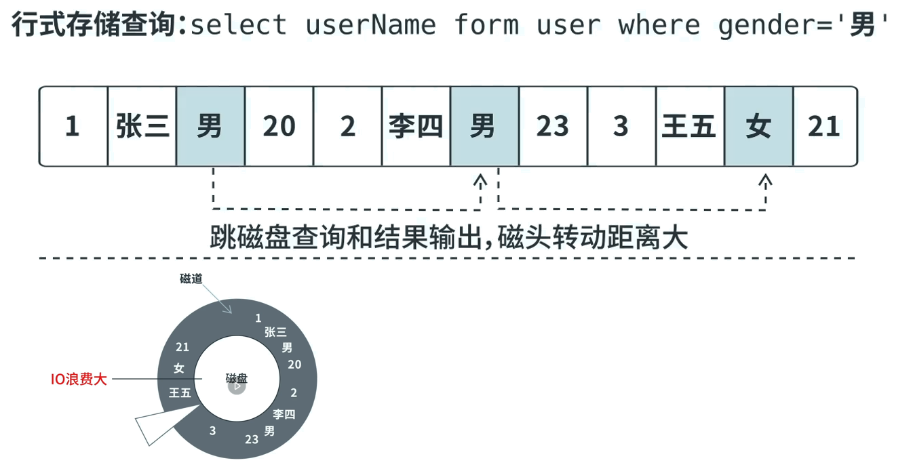

# 列式存储数据库

列式数据库应用在批量处理, 超大规模即使查询场景. 主要有两款产品:HBase和cassandra.

因为硬盘随机读与顺序读性能差异极大 ,  在传统机械硬盘(固态硬盘也存在该问题)下 , 对于行式存储:

查询需要对磁道进行旋转 , 而对数据的提取又要回到原始位置重新旋转.

而对于列式存储:

不读取无效数据: 只查询指定列上的数据 且 只返回指定列上的数据 ,磁盘io效率高.

数据压缩比大: 数据相关性大 , 数据压缩比高 , 利用Cache I/O

**列式存储遗留问题**

新增: 多个列族, 并发写磁盘(追加)

更新: 添加一个新版本号的数据(相当于对原始数据复制一份并修改追加到磁盘末尾, 然后赋予一个新版本号)

删除: 添加删除标记 keyType=Delete,  统一对数据进行删除.

# 日志收集

## 从ELK到KEFK过程

**EKL三剑客**

LogStash - 捡破烂的 : 集中 转换 存储数据.

ElasticSearch - 算数的 : 统计 分析 查询数据

Kibana - 给人看的 : 可视化数据展示

**方案1:标准ELK**

每一台应用服务器上安装部署Logstash , 收集日志处理发送给ES集群统计分析给kibana加载.  

优点：同一家公司开发, 集成度好 , 部署最简单组件使用最少.

缺点：由于 Logstash 同时兼顾了收集和解析的工作所以比较耗 CPU 和 内存资源，只适合服务器资源丰富的场景，否则容易容易造成性能下降甚至影响应用本身的正常工作.

**方案2：TCP推送**

使用Logback收集日志, 通过插件`LogstashTcpSocketAppender` 经TCP连接将日志发送给Logstash

优点：对比架构一各个应用服务器不需要额外部署其他组件(Logback仅收集发送)，减少了应用服务器的负载压力。

缺点：基于SDK开发，有代码入侵使应用与 Logstash 耦合了不易扩展。

**方案3：EFK**

将Logback替换为ELK公司开发的FileBeat组件, FileBeat是轻量级日志收集器, 通过监听日志文件, 收集并发送(像flume?).

优点：基于文件监听, 代码无入侵并且对应用服务器的资源占用少，是目前最常用的互联网应用日志架构

缺点：日志数据共享困难，FileBeat 只能配置一个 output 源

**方案4：KEFK**

加入kafka消息队列作为数据中转站, 其他组件只要订阅了kafka就能实现数据分发

优点：性能最好，而且消息队列易于共享数据

缺点：组件最多，维护成本大
