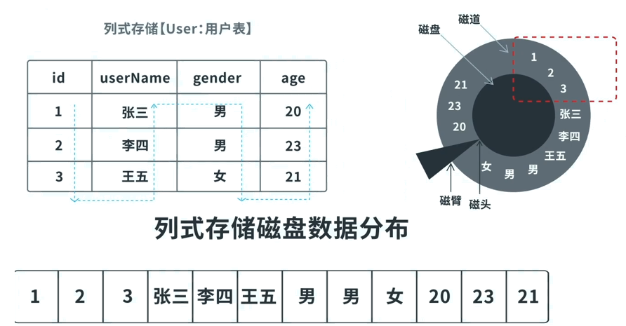

# 列式存储数据库

列式数据库应用在批量处理, 超大规模即使查询场景. 主要有两款产品:HBase和cassandra.

因为硬盘随机读与顺序读性能差异极大 ,  在传统机械硬盘(固态硬盘也存在该问题)下 , 对于行式存储:

查询需要对磁道进行旋转 , 而对数据的提取又要回到原始位置重新旋转.

而对于列式存储:

不读取无效数据: 只查询指定列上的数据 且 只返回指定列上的数据 ,磁盘io效率高.

数据压缩比大: 数据相关性大 , 数据压缩比高 , 利用Cache I/O

**列式存储遗留问题**

新增: 多个列族, 并发写磁盘(追加)

更新: 添加一个新版本号的数据(相当于对原始数据复制一份并修改追加到磁盘末尾, 然后赋予一个新版本号)

删除: 添加删除标记 keyType=Delete,  统一对数据进行删除.

