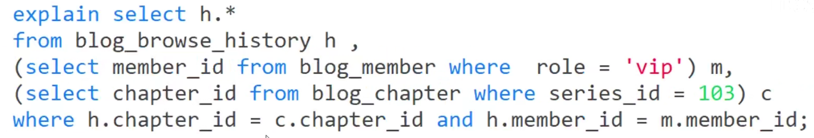
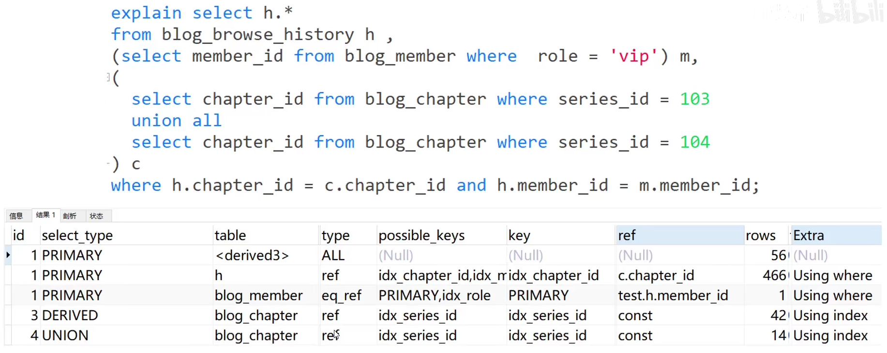
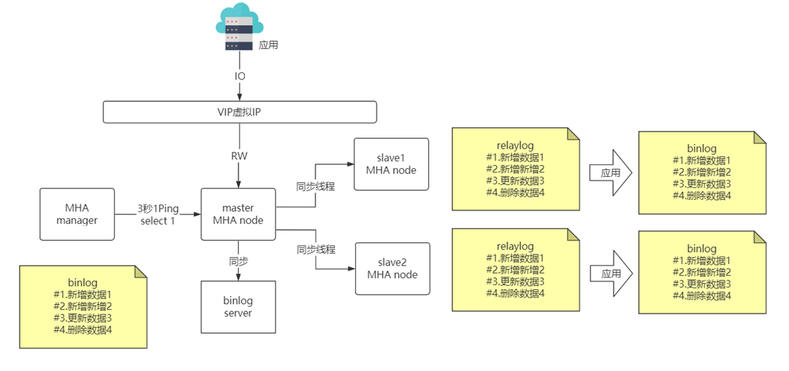
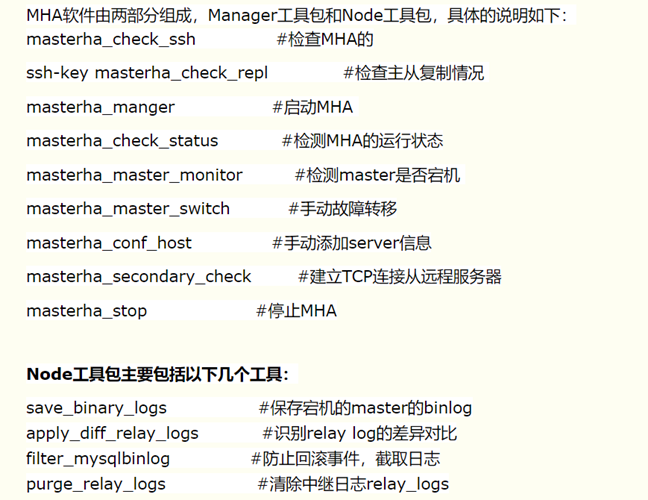
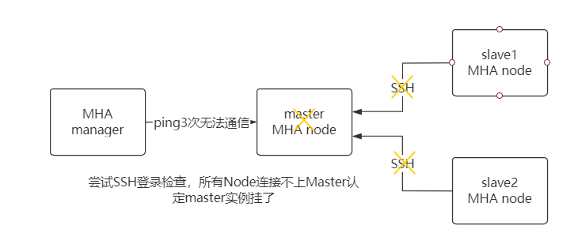

# MySQL应用

## 执行计划explain

explain关键字可以模拟MySQL优化器执行SQL语句，可以很好的分析SQL语句或表结构的性能 瓶颈。

> explain extended 可查看相关警告信息

```
mysql> explain select * from subject where id = 1
******************************************************
id: 1
select_type: SIMPLE
table: subject
partitions: NULL
type: const
possible_keys: PRIMARY
key: PRIMARY
key_len: 4
ref: const
rows: 1
filtered: 100.00
Extra: NULL
```

```
1. id                 //select查询的序列号，包含一组数字，表示查询中执行select子句或操作表的顺序
2. select_type         //查询类型 主要用于区别普通查询、联合查询、子查询等的复杂查询
3. table             //这个数据是基于哪张表的
4. partitions         //匹配的分区
5. type             //访问的类型
6. possible_keys     //与当前查询相关备选的索引有哪些, PRIMARY代表主键
7. key                 //代表当前实际使用的索引是哪个
8. key_len             //代表单个索引值的长度
9. ref                 //显示使用哪个列或常数与key一起从表中选择行
10. rows             //本次查询所扫描的行数, 不一定一致, 扫描行数越少越好
11. filtered         //查询的表行占表的百分比
12. Extra             //包含不适合在其它列中显示但十分重要的额外信息
```

**id字段**

```
1.id相同 : 执行顺序从上至下  (最上方的为驱动)
2.id不同 : 如果是子查询，id的序号会递增，id的值越大优先级越高，越先被执行
3.id相同又不同 : id如果相同，可以认为是一组，从上往下顺序执行 在所有组中，id值越大，优先级越高，越先执行
```

**select_type字段**(关键)

```
1.SIMPLE : 简单查询，不包含子查询或Union查询
2.PRIMARY : 查询中若包含任何复杂的子部分，最外层查询则被标记为主查询
3.SUBQUERY : 在select或where中包含子查询
4.DERIVED : 在FROM列表中包含的子查询被标记为DERIVED（衍生），MySQL 会递归执行这些子查询，把结果放在临时表中
            MySQL5.7+ 进行优化了，增加了derived_merge（派生合并），默认开启，可加快查询效率
5.UNION : 若第二个select出现在union之后，则被标记为UNION
6.UNION RESULT : 从UNION表获取结果的select (去重)
```

**type字段**(关键): 访问类型

```
1.NULL : 优化阶段分解查询语句，执行阶段不用再访问表或索引.
2.system : 表只有一行记录（等于系统表），const类型特列，
3.const : 常数引用访问
4.eq_ref :唯一性索引扫描
5.ref : 非唯一性索引扫描
6.ref_or_null : 类似ref, 但是可以搜索值为null的行
7.index_merge : 索引合并扫描
8.range : 范围扫描
9.index : Full index Scan
10.ALL : 全表扫描
```

**Extra字段**(关键)

```
1.Using filesort : 说明MySQL会对数据使用一个外部的索引排序，而不是按照表内的索引顺序进行读取 
    MySQL中无法利用索引完成的排序操作称为“文件排序”
    优化方式,给排序字段建索引，并使用where或limit激活
2.Using temporary : 使用了临时表保存中间结果，MySQL在对结果排序时使用临时表，常见于排序order by 和分组查询group by
    优化方式,给分组字段建索引
3.Using index : 使用了覆盖索引,不必回表
4.Using where : 从数据表中返回数据再过过滤
5.Using join buffer :使用了连接缓存 
    explain select student.*,teacher.*,subject.* from student,teacher,subject;
    explain select * from emp ,dept where emp.empno = dept.ceo ;
6.impossible where : where子句的值总是false，不能用来获取任何元组
7.distinct : 一旦mysql找到了与行相联合匹配的行，就不再搜索了, 如左连接里的右表
8.Select tables optimized away
    explain select * from emp ,dept where emp.empno = dept.ceo ;
    explain select min(id) from subject;
9.using MMR : 使用到了MMR,关于MMR见B+树索引-特性
```

### NLJ

 NLJ(Nested Loop Join 嵌套循环关联)

与编程中的二层嵌套类似,  驱动表中的每一条记录与被驱动表总的记录进行比较, 驱动表的选择决定了查询性能的高低.

> mysql会自动选择最优驱动表, 但是在多级关联情况下有可能会出现选择问题;
> 
> 可以使用STRAIGHT_JOIN让优化器按照指定的关联顺序查询, 通常不建议使用.

案例:

在mysql8多表关联查询语句下:


执行计划为:


按上下顺序, 最顶端的是驱动表, 此时未加索引, h表不幸被选中作为驱动表 , 进行全表关联, 效率极差.

此过程先对h表全表扫描576931行, 然后根据ref的关联在被驱动表中查询.

此时, 如果只给筛选条件的字段m.role和c.series_id加索引(小白做法):

```
create index idx_series_id on blog_chapter(series_id);
create index idx_role on blog_menber(role);
```

再查看执行计划, 会发现与没加索引结果一样.

> 结论:如果在多表关联时只在筛选条件上加字段索引, 没卵用.

此时, 再给关联条件的外键增加索引:

```
create index idx_chapter_id on blog_browse_history(chapter_id);      #新增
create index idx_menber_id on blog_browse_history(menber_id);        #新增
create index idx_series_id on blog_chapter(series_id);
create index idx_role on blog_menber(role);
```

再查看执行计划:


此时的驱动顺序为: c -> h -> m

先在驱动表c中通过对series_id进行const筛选(103),  这里的Using index表示通过series_id二级索引查询到主键chapter_id后并未回表, 直接使用主键与被驱动表关联.

然后h表根据c表查询出来的主键(chapter_id)通过外键关联进行查询(由于h表对外键chapter_id已建立索引, 所以查询效率高) , 这里的Using where表示通过二级索引chapter_id查询到h表的主键后进行回表.

再然后m表根据h表查询出来的外键(menber_id)直接进行主键查询. (但是不懂这里为什么Using where)

> 结论:只有正确的在外键上建立索引(关联的主键自带索引), 在关联表的索引才能生效, 查询优化器才能正确决定用哪个表作为驱动表是最优解

另外

1.在索引正确的情况下, 如果将多表关联改为where in 子查询,  在查询优化器的驱使执行计划不会改变, 仍然使用NLJ高效查询.


查看查询计划与上面结果一样.

2.在索引正确的情况下, 如果将多表关联改为from子句筛选, 在查询优化器的驱使执行计划不会改变, 仍然使用NLJ高效查询.



查看查询计划与上面结果一样.

3.例外:如果select包含子查询, 会出现DEPENDENT SUBQUERY, 代表依赖子查询, 也属于NLJ范畴


该方式在每查询出一条记录后,就将这条记录的某个属性拿去进行子查询.

### 其他执行计划

- DERIVED 子查询中出现多结果集运算

id越大的子查询越先执行:

id=4和id=3时: 通过两个根据series_id查询形成一个结果集

id相同时从上往下执行:

< derived3 >表示指向id为3的执行计划以及向后的延伸. 这里为id=4和id=3的结果集,

id=1的执行计划先以derived3为驱动表c,通过c表的chapter_id查询h表二级索引,然后回表获取h表数据,然后再根据h表的menber_id查询blog_menber表数据(没有走二级索引)

- UNION RESULT 少用UNION, 多用UNION ALL.


这里的UNION RESULT执行计划表示对union3和4进行去重, 通过类型可以看到这个操作为全表扫描 , 关键的是Using temporary

> UNION去重基于临时表, 临时表特性时如果缓存够使用内容, 缓存不够自动创建MyISAM引擎表(磁盘), IO效率变差

## 文件排序

当无法利用索引进行排序或使用索引时回表数据量大时, MySQL需要进行文件排序: 

如果需要排序的数据量小于排序缓冲区, 则使用内存进行快速排序;

如果内存不够, 则先将数据分块, 对每个块独立快排后保存到磁盘, 然后合并.

排序方式有两种:

1.两次传输排序: 读取行指针和需要排序的字段, 对其进行排序, 然后根据排序结果读取行.

该方式进行了两次数据读取, 并且第二次读取通过行指针进行了大量随机I/O.

2.单次传输排序: 读取查询所需要的所有列, 再根据指定列进行排序, 然后直接返回结果.

该方式只需一次顺序I/O读取数据, 在I/O密集应用中能显著提升效率.

> 两种方式各有千秋, MySQL默认需要查询的所有列总长度不超过max_len_for_sort_data时使用单次传输排序, 否则使用两次排序传输.

> 另外, 文件排序生成的临时表空间可能比数据实际存储空间大很多(如varchar分配定长空间)

当在关联查询中使用文件排序时,  如果order by中的所有列都来自关联的第一个表, 则会直接对第一个表进行文件排序后进行关联(Using filesort); 否则会将所有关联结果放到临时表中, 最后进行文件排序(Using temporary; Using filesort). 并且当查询中带有limit时, limit将在排序后执行, 当数据量大时效率差.

## 主从复制

MySQL binlog主要记录了 MySQL 数据库中数据的所有变化(数据库执行的所有 DDL 和 DML 语句)。根据主库的 MySQL binlog 日志就能够将主库的数据同步到从库中。 

1.Master 数据库只要发生变化，立马记录到Binary log 日志文件中
 2.Slave数据库启动一个I/O thread连接Master数据库，请求Master变化的二进制日志
 3.Slave I/O获取到的二进制日志，保存到自己的Relay log 日志文件中。
 4.Slave 有一个 SQL thread定时检查Realy log是否变化，变化那么就更新数据

MySQL主从同步方案有异步复制, 半同步复制(保证一台从节点同步), MHA, 全同步复制(mgr, 有许多限制)

除了主从复制之外，binlog 还能帮助我们实现数据恢复。

> 阿里开源的 canal 工具可以帮助实现 MySQL 和其他数据源比如 Elasticsearch 或者另外一台 MySQL 数据库之间的数据同步。这个工具的底层原理也依赖 binlog。

**读写分离主要是为了将对数据库的读写操作分散到不同的数据库节点上。** 小幅提升写性能，大幅提升读性能。

**实现读写分离**:

**1.代理方式**

我们可以在应用和数据中间加了一个代理层。应用程序所有的数据请求都交给代理层处理，代理层负责分离读写请求，将它们路由到对应的数据库中。

提供类似功能的中间件有 **MySQL Router**（官方）、**Atlas**（基于 MySQL Proxy）、**Maxscale**、**MyCat**。

**2.组件方式**

引入第三方组件来帮助我们读写请求

这种方式目前在各种互联网公司中用的最多的，相关的实际的案例也非常多。比如 `sharding-jdbc` ，直接引入 jar 包即可使用，非常方便。

> 主从复制中的slave默认不会进行写binlog, 但在master-slave-slave架构下, 需要设置`log-slave-update`参数开启slave的写binlog功能.

### 读写分离下的不一致

问题:**主从同步延迟**, 如往主库写完立马在从库查询, 但从库并没有来得及同步.

解决方案:

**1.强制将读请求路由到主库处理。**

虽然会增加主库的压力，但实现起来比较简单，适用于并发量高的场景.

比如 `Sharding-JDBC` 就是采用的这种方案。通过使用 Sharding-JDBC 的 `HintManager` 分片键值管理器，可以要求下一条SELECT查询强制使用主库。

```java
HintManager hintManager = HintManager.getInstance();
hintManager.setMasterRouteOnly();
```

**2.延迟读取**

适用于对于一些对数据比较敏感的场景，你可以在完成写请求之后，避免立即进行请求操作。比如你支付成功之后，跳转到一个支付成功的页面，当你点击返回之后才返回自己的账户。

难点在于无法估计预留时间, 多了浪费, 少了没用. 所以不推荐.

**3.MGR全同步复制**

强一致性, 没完成同步之前无法查询.

### MGR

MySQL 5.7.17插件, 支持故障检测以及多节点写入, 适用于金融交易等一致性要求高、读多写少的场景

1.强一致性: 原生复制 + Paxos协议 提供组复制技术(插件);

2.高容错性: 大多数节点可用即可工作, 自动检测机制, 当不同节点产生资源争用资源时,会先到先得原则处理, 并内置了自动化脑裂防护机制.

3.高扩展性: 新增删除节点会自动更新信息;

4.高灵活性: 单主模式下自动选主; 多主模式下所有节点都可处理更新操作.

MGR约束:

```
1、仅支持InnoDB表，并且每张表一定要有一个主键，用于做write set的冲突检测;2、必须打开GTID特性，二进制日志格式必须设置为ROW，用于选主与writeset；主从状态信息存于表中（--master-info-repository=TABLE)、--relay-log-info-repository=TABLE），--log-slave-updates打开3、MGR不支持大事务，事务大小最好不超过143MB，当事务过大，无法在5秒的时间内通过网络在组成员之间复制消息，则可能会怀疑成员失败了，然后将其驱逐出局4、目前一个MGR集群最多支持9个节点5、不支持外键于save point特性，无法做全局间的约束检测与部分事务回滚6、二进制日志不支持Binlog Event Checksum
```

### MHA高可用

MHA（Master HA）是一款开源的 MySQL 的高可用程序，它为 MySQL 主从复制架构提供了 automating master failover 功能。MHA 在监控到 master 节点故障时，会提升其中拥有最新数据的 slave 节点成为新的master 节点，在此期间，MHA 会通过于其它从节点获取额外信息来避免一致性方面的问题。MHA 还提供了 master 节点的在线切换功能，即按需切换 master/slave 节点。

在mysql主从同步基本实现中, 主服务器在数据处理以后生成binlog ,从服务器将binlog保存在relaylog中进行应用来保持同步. 

在当前实现下, 如果主服务器挂了, 从服务器是不会自动升级成主服务器的, mysql也没有提供解决方法, 只能人工进行主从切换工作, 而这段时间内业务不可用.

通过MHA ,在应用和主服务器之间增加一个VIP暴露给应用 , vip可以根据MHA来进行内部漂移.

MHA 服务有两种角色， MHA Manager(管理节点)和 MHA Node(数据节点)： 



这里binlog server是mysql提供的方案 ,同步主服务器的binlog , 主要起备份作用 ,一般不会挂.



**MHA故障发现**

MHA manager默认每3秒ping主节点(select 1), 如果3次ping无法通信,则认为主节点有问题, 但不能确定(因为有可能是中间网络问题).

所以MHA manager会通知所有从服务器使用数据库连接或者SSH的方式尝试连接主服务器, 如果所有从服务器也无法与主服务器进行通信, 则进行故障转移过程.



**MHA故障转移**

1.断开与主节点的所有连接.

2.MHA manager SSH抽取binlog 保存.

3.而从服务器之间也因为网络问题可能存在数据不同步的情况


4.MHA下达指令,从服务器之间进行数据检查比对, 通过relay log找到最新的从服务器 ,然后进行差异补全,保证所有从服务器数据同步(此时从服务器和MHA manager还没有完成同步).


5.MHA manager和从服务器进行数据检查比对, 然后发送相差数据进行补全, 到此所有从服务器与原主服务器数据完成同步.


6.选主阶段: 3种方案

7.选主后其他从服务器通过change master连接新主服务器


8.vip内部漂移 , 指向新的主服务器


E:当原主节点恢复后


而其他网络波动引发的问题或者故障时binlog server与主服务器没有同步等问题,需要结合具体的生产环境进行人工介入.

[binlog server配置](https://www.cnblogs.com/ywrj/p/9443215.html)

MHA缺点:

1.需要编写脚本或利用第三方工具来实现vip配置;

2.MHA启动后只监控主服务器是否可用,没法监控从服务器;

3.需要基于SSH免认证登录配置,存在安全隐患;

4.没有提供从服务器的读负载均衡功能;

## 分库分表


应用场景:

- 单表的数据达到千万级别以上，字段多,且包含超长的varchar ,clob,blob等,数据库读写速度比较缓慢（分表）。
- 数据库中的数据占用的空间越来越大，备份时间越来越长（分库）。
- 应用的并发量太大（分库）。

问题:

**跨节点join 操作** ; **分布式事务问题** ;**分布式唯一id** ;**跨节点排序分页问题**;**多数据与管理问题**

> 数据切分原则:
> 1.尽量不要切分
> 
> 2.如果一定要切分需要选择合适的切分规则, 提前规划好
> 
> 3.切分后尽量通过数据冗余或表分组来降低跨库Join问题
> 
> 4.由于各数据库中间件对join的实现各有优劣, 达到高性能难度极大, 所以业务读取尽量少使用join.
> 
> 《MyCat权威指南》

**水平分表**

单库多表: 有效缩小磁盘扫描范围

多库多表: 提供数据库并行处理能力

当单表数据大于1000w 或 单表数据文件大于20GB时需要考虑切分.

分片规则

**垂直分表**

因为innodb管理数据的单位为页(16k) , 在表设计时,要尽可能在页内多存储行数据,减少跨页检索.

通过将重要字段字段单独剥离小表,让每页容纳更多行数据,页减少后,缩小数据扫描范围达到提高执行效率的目的

垂直分表条件:

1.单表数据达千万;

2.字段超过20个,且包含varchar,clob,blob(存二进制数据)等.

字段分表依据:

1.小表:数据查询,排序时需要的字段,高频访问的小字段;

2.大表:低频访问的字段,大字段

### 分片规则(一致性HASH)

范围法,对分片键进行范围划分,mysql默认提供的特性(分区表) ,易扩展,适用于范围检索,但数据不均匀, 局部负载大,只适用于流水账应用(按时间分片)

hash法,对id取模,又分为取模 和 一致性hash(独特的环形算法). 数据分布均匀,扩展复杂,数据迁移难度大. 需要提前部署足够节点

**一致性hash**是为了解决数据量大时hash取模扩容难度大的问题:

算法上形成一个环状结构, 换上的点下标从0开始范围0到2^32-1.

每添加一台服务器根据对服务器唯一标识进行hash然后mod2^32找到环上对应的点(逻辑上).

对于每一条插入的数据,对id进行hash然后mod2^32找到环上对应的点, 如果点上存在服务器, 则插入该服务器; 否则**向顺时针方向**插入到最近的点对应的服务器.

如果摘除一个服务器节点, 只需要将该服务器上数据迁移到该服务器点向顺时针方向上最近的点对应的服务器上, 而**不会产生大规模调整**; 新增一个服务器节点的处理类似.

理想完美的服务器分布情况为在环上每个服务器之间的点间隔相同, 达到分摊效果.

但实际上通常不能保证各个服务器在环上均匀分布, 这就会造成数据倾斜.

所以需要引入**虚拟节点**方案解决数据倾斜问题:

通过另一个hash算法在环上逻辑分配若干虚拟节点, 并建立虚拟节点与真实节点的**映射表**, 每个虚拟节点映射一个真实节点. **虚拟节点越多, 真实节点数据分布越均匀**.

在虚拟节点方案下, 摘除和新增节点都需要根据映射关系进行迁移(迁移过程需要暂停服务防止新增数据带来的麻烦).

因为一致性Hash无具体落地方案, 所以带来的挑战有:

1.hash算法的编写(或三方);

2.无现成迁移组件;

3.需要开发数据校对程序;

4.集群节点不固定, 需要增加前置代理(ShardingProxy、ProxySQL)屏蔽数据访问细节, 允许路由规则灵活调整.

### 非主键查询问题

假如应用根据主键id进行分表或分库, 但是查询的时候需要通过其他字段如姓名过滤, 这时对于每个姓名需要依次到每个数据库查询, 这样显然是不合理的.

可以通过以下方式解决:

假如有**4个分片**的情况下:

1.基因法:

根据 `md5(username)转二进制取后两位` 决定查询哪个分片, id采用追加`md5(userid)转二进制取后两位`.

这样既能保证id规则分片,也能保证根据username分片.

优点:性能极好, 不需要额外的查询;

缺点:只有在2^n才能最大化资源利用; 无法数据迁移; 主键生成算法; 只能支持一个非主键字段对应.

2.倒排索引:

redis构建倒排索引

key为 字段名:字段值, value为 对应的数据库主键

优点:通用, 可对多个字段查询

缺点:多一次redis查询,性能有所降低; 对redis内存需求大(如果SSD性能好, 可使用InnoDB表代替); 需要维护一致性.

## 数据同步

**数据迁移方式**

1.**停机迁移**(脚本)

2.**双写方案**(针对不能停机迁移的场景)

我们对老库的更新操作（增删改），同时也要写入新库（双写）。如果操作的数据不存在于新库的话，需要插入到新库中。 这样就能保证，咱们新库里的数据是最新的。

在迁移过程，双写只会让被更新操作过的老库中的数据同步到新库，我们还需要自己写脚本将老库中的数据和新库的数据做比对。如果新库中没有，那咱们就把数据插入到新库。如果新库有，旧库没有，就把新库对应的数据删除（冗余数据清理）。

重复上一步的操作，直到老库和新库的数据一致为止。

可以借助canal做增量数据迁移.

**异构数据同步**

假如ES团队B需要同步MYSQL团队A的数据实现全文检索, 可通过团队A调用团队B的ES接口对数据进行同步.

这样做的问题是:

> 团队A与团队B的协作产生代码强耦合 . 团队A必须了解团队B提供的接口才可以实现 ,但本身这并不属于团队A的工作范畴

且扩展困难, 假如Mongodb团队C也要同步MySQL数据库难道要团队A又要改代码？

为了保证数据做到准实时同步还要团队之间解耦，团队A不再背锅, 可引入canal.

cacal通过**伪装成从库监听relaylog来获取增量数据日志**,再通过java代码调用其他模块接口可实现如es ,  mongodb的数据同步.

但是此时解耦还没有完成, 接口调用都是在团队A完成, 可以再引入消息队列MQ , 团队A部署canal监听mysql的修改操作发布到消息队列 ,团队B和团队C通过订阅消息队列 ,自己调用接口对数据进行同步. 之后再需要加入新的团队只需要订阅消息队列即可 ,与团队A无关了.


**canal**

> Canal是阿里巴巴旗下的一款开源项目，纯Java开发。基于数据库增量日志解析，提供增量数据订阅&消费，目前主要支持了MySQL（也支持mariaDB）。

先看mysql同步机制实现


canal实现mysql异构数据同步机制


> 另外, 为支持去IOE, 阿里针对oracle异构数据提出了yugong解决方案

## 分布式全局唯一id

在分库之后， 数据遍布在不同服务器上的数据库，数据库的自增主键已经没办法满足生成的主键唯一了。**我们如何为不同的数据节点生成全局唯一主键呢？**

ID生成规则部分硬性要求

全局唯一：不能出现重复的ID号，既然是唯一标识，这是最基本的要求

趋势递增：在MySQL的InnoDB引擎中使用的是聚集索引，由于多数RDBMS使用Btree的数据结构来存储索引数据，在主键的选择上面我们应该尽量使用有序的主键保证写入性能。

单调递增：保证下一个ID一定大于上一个ID，例如事务版本号、IM增量消息、排序等特殊需求

信息安全：如果ID是连续的，恶意用户的扒取工作就非常容易做了，直接按照顺序下载指定URL即可。如果是订单号就更危险了，竞对可以直接知道我们一天的单量。所以在一些应用场景下，需要ID无规则不规则，让竞争对手否好猜。

含时间戳：这样就能够在开发中快速了解这个分布式id的生成时间。

ID号生成系统的可用性要求

高可用：发一个获取分布式ID的请求，服务器就要保证99.999%的情况下给我创建一个唯一分布式ID。

低延迟：发一个获取分布式ID的请求，服务器就要快，极速。

高QPS：假如并发一口气10万个创建分布式ID请求同时杀过来，服务器要顶的住且一下子成功创建10万个分布式ID。

**方案1:UUID**

UUID(Universally Unique ldentifer)的标准型式包含32个16进制数字，以连了号分为五段，形式为8-4-4-4-12的36个字符， 示例：550e8400-e29b-41d4-a716-446655440000

性能非常高：本地生成，没有网络消耗

如果只是考虑唯一性，那就选用它吧

但是，入数据库性能差:

**方案2:数据库自增主键**

单机:数据库的自增ID机制的主要原理是：数据库自增ID和MySQL数据库的replace into实现的。

系统水平扩展比较困难;

数据库压力还是很大，每次获取ID都得读写一次数据库， 非常影响性能，不符合分布式ID里面的延迟低和要高QPS的规则（在高并发下，如果都去数据库里面获取id，那是非常影响性能的）

**方案3:基于Redis生成全局ID策略**

因为Redis是单线的天生保证原子性，可以使用原子操作INCR和INCRBY来实现

注意：在Redis集群情况下，同样和MySQL一样需要设置不同的增长步长，同时key一定要设置有效期可以使用Redis集群来获取更高的吞吐量。

假如一个集群中有5台Redis。可以初始化每台Redis的值分别是1,2,3,4,5，然后步长都是5。

各个Redis生成的ID为:

A：1, 6, 11, 16, 21
B：2, 7 , 12, 17, 22
C：3, 8, 13, 18, 23
D：4, 9, 14, 19, 24
E：5, 10, 15, 20, 25

> 如果是单机器下, 可以通过incrby一次加载多个id, 用完了再重新获取, 避免每次获取id都访问redis造成压力.

**方案4:Twitter的分布式自增ID算法snowflake**

百度一大把文档

**方案5:框架**

UidGenerator(百度) 18年起未维护

Leaf(美团) https://tech.meituan.com/2017/04/21/mt-leaf.html

Tinyid(滴滴) https://github.com/didi/tinyid/wiki/tinyid%E5%8E%9F%E7%90%86%E4%BB%8B%E7%BB%8D

**方案6:中间件**

比如zookeeper也可以生成唯一id

## MySQL时间格式选择

1.不要选择字符串存储日期;

```
字符串占用的空间更大！
字符串存储的日期效率比较低（逐个字符进行比对），无法用日期相关的 API 进行计算和比较。
```

2.Datetime 和 Timestamp

通常选择Timestamp,因为**Timestamp 和时区有关**。Timestamp 类型字段的值会随着服务器时区的变化而变化，自动换算成相应的时间，说简单点就是在不同时区，查询到同一个条记录此字段的值会不一样。且Timestamp 只需要使用 **4 个字节**的存储空间

而**DateTime 类型是没有时区信息的（时区无关）** ，DateTime 类型保存的时间都是当前会话所设置的时区对应的时间。这样就会有什么问题呢？当你的时区更换之后，比如你的服务器更换地址或者更换客户端连接时区设置的话，就会导致你从数据库中读出的时间错误。且DateTime 需要耗费 **8 个字节**的存储空间.

> Timestamp范围只有 1970-01-01 00:00:01 ~ 2037-12-31 23:59:59

> SELECT @@session.time_zone;  # 查看当前会话时区 
> 
> SET time_zone = "+00:00"; #设置当前会话时区
> 
> SELECT @@global.time_zone; # 全局时区
> 
> SET GLOBAL time_zone = '+8:00';

3.当需要存储比秒更小时间粒度的时间用BIGINT类型存储微妙级别的时间戳,或者使用double存储秒之后的小数部分.

时间戳不存在时区问题

## 笔记

> 来自个人实践与资料收集

- 将一个多表关联查询通过应用程序分解成一个个单表查询(相当于手动NLJ), 可更方便利用缓存, 避免随机关联查询冗余记录, 并减少锁竞争;(《高性能MySQL》)
- 使用UNION+LIMIT时在每个子局中使用LIMIT(UNION外还需要同样的LIMIT)减少临时表大小.
- 全表扫描可能导致缓冲池LRU列表被污染, 导致热点数据被冲刷.
- MySQL实例启动时, 会将自己进程ID写入到由`pid_file`指定的文件中, 默认为主机名.pid.
- MySQL中, 每个表和视图都存在一个对应的.frm表结构定义文件, 可直接查看.
- 通过`show processlist`可查询所有客户端状态, 常见的state字段有`sending to client`表示等待客户端接收结果, `sending data`表示查询语句执行阶段(包括锁等待).
- 对于简单的模糊查询, 可使用MySQL 5.7.6内置的ngram全文解析器.
- 创建索引的时候,要保证唯一的值足够多,这样才有意义,一般情况下是大于80%.
- 如果已经设置了主键为聚簇索引又希望再单独设置聚簇索引，必须先删除主键，然后添加我们想要的聚簇索引， 最后恢复设置主键即可.
