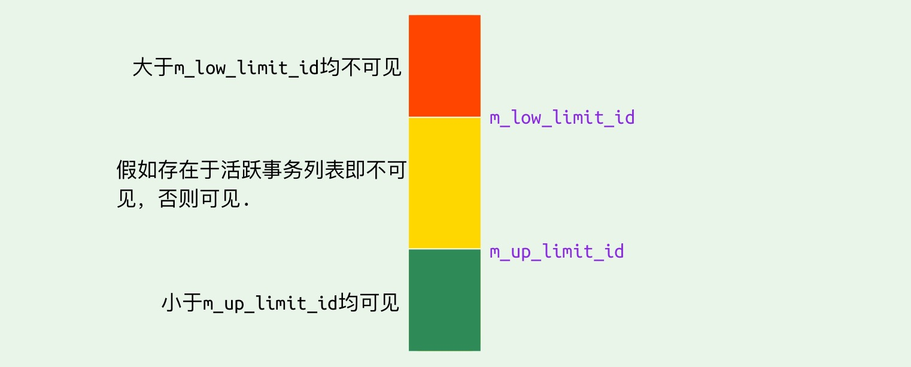
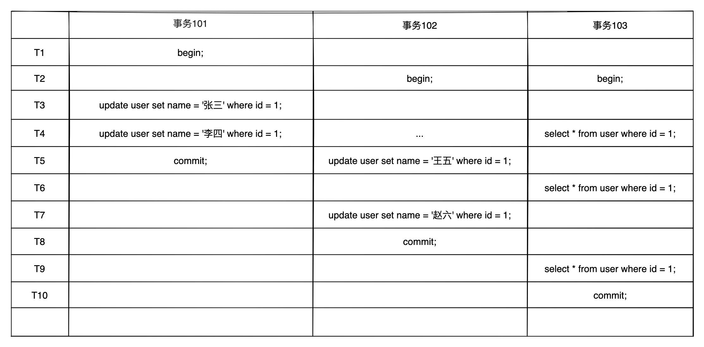
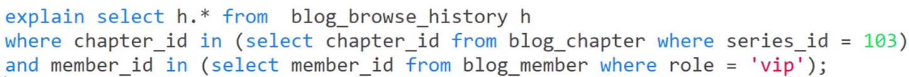
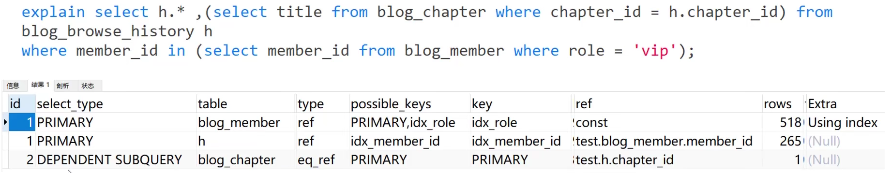
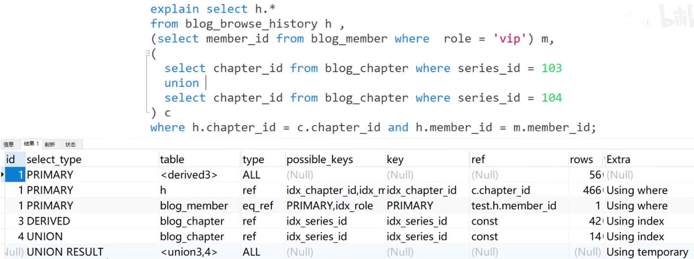
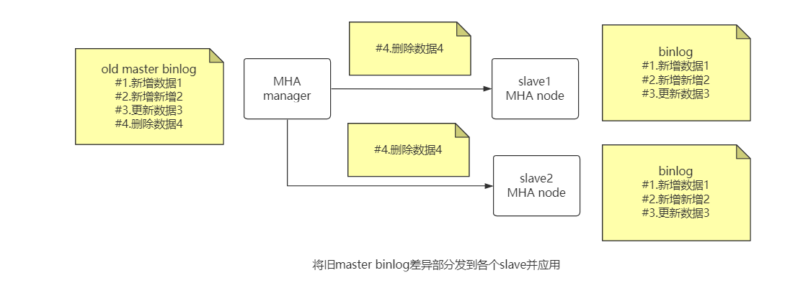

OLAP在线分析处理:

对海量的历史数据进行分析操作,要求产生决策性的影响,不要求在极短的时间内返回结果

 --> 数据仓库  如hive 采用 hash索引

--> clickhouse/druid/kylin

OLTP在线事务处理:

为了支撑业务系统的需要,必须在极短时间内返回对应的结果

-->关系型数据库

# MySQL


## InnoDB

前情提要: 

- MySQL 5.6 中InnoDB的版本为1.2
- InnoDB通过LSN(Log Sequence Number)来标记版本, 是一个8字节的数字, 单位是字节. 每个页有LSN, 重做日志也有LSN, Checkpoint也有LSN.

### 线程

1.Master Thread

异步线程, 负责将缓冲池数据刷盘, 如脏页刷新、 合并insert buffer、undo页回收等.

2.I/O Thread

负责通过AIO处理IO请求, 如主从同步时binlog读取. 包括4个I/O Thread:

1)write 2)read 3)insert buffer 4)log

不同的InnoDB版本其个数不相同, 可通过`show engine innodb status`的FILE I/O项查看I/O Thread;

3.Purge Thread

负责回收事务提交后对应的作废undolog, 在InnoDB 1.1开始可从Master Thread中独立出来, 默认不开启, 可通过innodb_purge_thread=1开启, InnoDb 1.2开始可支持多个Purge Thread加快undo页回收.

4.Page Cleaner Thread

负责脏页刷新, InnoDB 1.2开始从Master Thread中独立出来, 减轻其负担.

#### Master Thread

该线程负责了InnoDB主要的工作, 是个后台线程.

**InnoDB 1.0 之前**

Master Thread具有最高线程优先级别, 其内部由多个loop组成(循环), Master Thread会根据数据库运行状态在多个loop中切换:

①主循环 Loop : 负责大多数操作, 包括**每秒的操作和每10秒的操作**, 伪代码如下:

```c
void master_thread(){
	loop;
	for(int i=0; i<10; i++){
		do thing once per second
		sleep 1 second if necessary
	}
	do things once per ten seconds
	goto loop;
}
```

因为loop通过sleep实现, 所以每秒和每10秒操作时间并不精确(redis loop因为时间事件先于文件时间执行, 所以也会导致100ms的时间事件不精确).

其中每秒一次的操作包括:

- 将重做日志缓冲刷新到磁盘重做日志文件, 即使**该事务还没提交**, 为了防止大事务提交时间长的问题(总是);
- 根据当前一秒内发生的I/O次数是否小于5次, 决定是否合并插入缓冲(可能);
- 根据innodb_max_dirty_pages_pct设置的脏页比例, 至多刷新100个InnoDB的缓冲池中的脏页到磁盘(可能);
- 如果当前没有用户活动, 则切换到 background loop(可能).

其中每10秒一次的操作包括:

- 根据过去10秒内磁盘的IO操作是否小于200次, 决定是否刷新100个脏页到磁盘(可能);
- 合并至多5个插入缓冲(总是);
- 将重做日志缓冲刷新到磁盘重做日志文件(总是);
- full purge操作, 删除最多20个无用的undo页(总是);
- innodb_max_dirty_pages_pct大于70%刷新100个, 小于则刷新10个脏页到磁盘(总是).

②backgroud loop : 当没有用户活动时 或 数据库关闭时会切换到该循环

- 删除无用undo页(总是);
- 合并20个插入缓冲(总是);
- 跳回主循环Loop或flush loop

③flush loop : 不断刷新100个页直到符合条件, 然后跳转到suspend loop.

④suspend loop : 将Master Thread挂起, 等待事件发生.

**InnoDB 1.2之前**

因为1.0对缓冲池的刷盘IO做了限制(最多100页), 在写入密集的应用中(脏页和插入缓冲过多), 会导致主线程忙不过来, 如果发送宕机需要恢复时, 从重做日志恢复的时间需要更久.  因此InnoDB Plugin提供了innodb_io_capacity参数(默认200)控制刷新到磁盘的脏页的数量, 并且合并插入缓冲时的数量为innodb_io_capacity*5%.

> 若使用SSD或RAID时存储设备拥有更高的IO速度, 可将innodb_io_capacity设置得更高.

因为1.0之前innodb_max_dirty_pages_pct默认值为90, 而InnoDB在每秒刷新缓冲池和flush loop中都要判断脏页比例是否大于该值才决定刷盘, 在内存量大时增加了刷盘耗时. 所以在1.0之后变为了75, 即可以加快刷盘的频率, 又能保证磁盘IO的负载.

另外1.0新增了innodb_purge_batch_size参数控制每次full purge操作回收的undo页的数量, innodb_adaptive_flushing参数来根据产生重做日志的速度来决定最合适的刷新脏页数量.

通过show engine innodb status的INNODB MONITOR OUTPUT可查看MasterThread运行状态:

```
-----------
BACKGROUND THREAD
-----------
srv_master_thread loops: <每秒活动执行次数> 1_second, <sleep的次数> sleeps, <每10秒活动执行次数> 10_seconds, <background loop次数> background,<flush loop> flush次数
```

> 在服务器压力较小下, 可发现sleeps值等于1_second值,与理想伪代码中的实现一致; 
>
> 但在服务器压力很大时, 可发现sleeps值远小于1_second的值, 这是因为InnoDB对其进行了优化, 在压力大时并不总是等待1s. 因此也可通过两值反映服务器的负载压力.

**InnoDB 1.2**

将刷新脏页的操作分离到Page Cleaner Thread, 分工, 提供并发性.

### 内存

1.缓冲池

首次读取页时, 会先将页存放到缓冲池; 下次读取页时会先判断该页是否在缓冲池中, 若在则表示**命中**, 直接读取.

修改操作也将先在缓冲池修改, 然后通过**Checkpoint机制以一定的频率刷盘**.

缓冲池大小通过innodb_buffer_pool_size控制, 包括索引页、数据页、undo页、 插入缓冲、自适应哈希索引等, 其中索引页和数据页占多数.

InnoDB 1.0开始允许多个缓冲池实例存在, 每个页根据哈希值平摊到不同缓冲池实例, 可通过innodb_buffer_pool_instances设置, 同样可通过`show engine innodb status`的INDIVIDUAL BUFFER POOL INFO项查看, 并可通过如 ---buffer pool 0查看指定缓冲池实例.

MySQL5.6开始可通过information_schema.INNODB_POOL_STATS表查看缓冲池状态: 

```
select POOL_ID,POOL_SIZE,FREE_BUFFERS,DATABASE_PAGES from INNODB_POOL_STATS;
```

2.LRU List、Free List、Flush List

InnoDB通过LRU列表管理页的, 列表前面表示热点页; 新读取到的页并不是直接插入LRU列表首部, 而是插入到midpoint位置, 由innodb_old_blocks_pct参数控制, 默认为37, 即表示在链表的5/8处. midpoint前的列表为热点数据NEW区, 后面为OLD区. 

>  如果热点数据较多, 可通过减小innodb_old_blocks_pct的值将midpoint位置后移增大NEW区, 减少热点页被刷出的几率.

并且为了进一步防止热点数据被冲刷(当大数据量查询页时), InnoDB通过innodb_old_blocks_time参数控制在页加入到midpoint位置后需要等待多长时间才能被加入到LRU列表首部.

> 通过INNODB_BUFFER_PAGE_LRU表可以观察LRU列表每个页的具体信息, 其中TABLE_NAME列为NULL表示该页属于系统表空间.

Free列表记录缓冲池可用列表, 数据库刚启动时LRU列表为空, Free列表存放所有空闲页. 当需要分页时先从Free列表查询是否存在可用空闲页, 若有则从Free列表删除, 放入LRU列表; 否则LRU淘汰尾页, 然后分配给新页.

page made young 操作表示页从LRU列表的OLD区加入到NEW区;

page not made young 操作表示因为innodb_old_blocks_time限制导致页无法从OLD区加入到new区.

Flush列表记录脏页, LRU列表中被修改后与磁盘页不一致的页为脏页, MySQL通过checkpoint机制将脏页刷盘.

> 因为脏页同时存在于Flush列表和LRU列表, 所以可通过INNODB_BUFFER_PAGE_LRU表筛选查看Flush列表, 只需要添加过滤条件where OLDEST_MODIFICATION > 0即可.

通过`show engine innodb status`的INNODB MONITOR OUTPUT可查看缓冲池运行状态:

```
Buffer pool size <缓冲池总共的页数>
Free buffers <Free列表页的数量>
Database pages <LRU列表页的数量>
Old database pages <OLD区页数>
Modified db pages <脏页数>
Pages made young <页前移的次数>, not young <因iobt无法前移的次数>
youngs/s <每秒页前移次数>,non-youngs/s <每秒因iobt无法前移的次数>
...
Buffer pool hit rate <缓冲池命中率>
```

其中 LRU列表页数+Free列表页数≠缓冲池总页数 是因为页还会被分配给前面提到的其他页, 占绝少数; Buffer pool hit rate不应小于95%.

> INNODB_BUFFER_POOL同样可以查询上述信息.

另外, 因为InnoDB支持页压缩, 所以使用unzip_LRU列表管理非16KB的压缩页, 注意, 该列表的所有页同样在LRU列表中.

unzip_LRU列表对不同大小的压缩页分别管理, 并通过**伙伴算法**进行内存分配, 如需要从缓冲池申请4KB的页, 过程为:

```
1.检查4KB的unzip_LRU列表, 是存在可用的空闲页;
2.若有则直接使用;
3.否则,检查8KB的unzip_LRU列表;
3.若能得到8KB的unzip_LRU列表的空闲页,则将页分成2个4KB的页,存放到4KB的unzip_LRU列表并使用;
4.否则从LRU列表申请一个16KB的页,将该页分成1个8KB和2个4KB的页,分别存放到对应的unzip_LRU列表中.
```

> 因为unzip_LRU列表的所有页同样在LRU列表中, 所以可通过INNODB_BUFFER_PAGE_LRU表筛选查看unzip_LRU列表, 只需要添加过滤条件where COMPRESSED_SIZE <> 0即可.

3.重做日志缓冲

InnoDB内存区中独立与缓冲池之外, InnoDB先将重做日志信息放入重做日志缓冲, 然后再以一定频率刷新到重做日志文件. 重做日志缓冲一般较小, 只需要容纳每秒产生的事务量即可, 可通过innodb_log_buffer_size配置, 默认8MB. 

在以下三种情况时, 重做日志缓冲将刷新到磁盘的重做日志文件:

①Master Thread每秒刷新;

②每个事务提交时(默认);

> 通过 `innodb_flush_log_at_trx_commit` 选择事务提交时的刷盘策略：
>
> 0：表示每次事务提交时不进行刷盘操作 (有丢失风险)
>
> 1：表示每次事务提交时都将进行刷盘操作（默认值, 包括写入文件系统page cache + fsync真正刷盘, 这也是为了保证事务的持久性必须的选项）
>
> 2：表示每次事务提交时都只把 redo log buffer 内容写入 page cache (有丢失风险, 仅MySQL宕机除外)

③当重做日志缓冲池剩余空闲小于1/2时.

4.额外的内存池

???

### Checkpoint

checkpoint技术主要解决以下问题:

1.缩短数据恢复时间:

当数据库宕机时, 不需要重做所有日志, checkpoint之前的页都已经完成刷盘, 只需对checkpoint之后的重做日志进行恢复.

2.缓冲池执行LRU时尾页为脏页: 

当缓冲池不够用时, LRU将溢出尾页, 若此页尾脏页, 则需要强制执行checkpoint将脏页刷回磁盘.

3.重做日志不可用时:

重做日志的设计为固定大小循环使用(重做日志文件组), 对checkpoint之前的部分进行覆盖重用, 若无法覆盖时, 需要强制执行checkpoint将缓冲池中的页至少刷新到当前重做日志的位置, 将checkpoint位置后推.

InnoDB存在4种checkpoint情况:

①Master Thread Checkpoint:

Master Thread以每秒或每十秒的速度从缓冲池的脏页列表中刷新一定比例的页回磁盘(异步).

②FLUSH_LRU_LIST Checkpoint:

当执行LRU时, 如果尾页为脏页, 则执行checkpoint.(对应问题2)

> InnoDB需要保证LRU中需要存在大约100个空闲页可供使用, 否则需要执行LRU.
>
> 在InnoDB 1.2以前, 检查空闲页的工作发生在用户查询线程, 会阻塞用户操作;
>
> 在InnoDB 1.2开始, 由Page Cleaner Thread进行检查, 避免用户线程阻塞.

③Async/Sync Flush Checkpoint:

当重做日志文件不可用时, 强制刷盘(对应问题3) , 以保证重做日志循环使用.

在重做日志中, 若将已写入到重做日志最新页的[LSN记](#InnoDB)为redo_lsn, 将已经刷盘的最新页的LSN记为checkpoint_lsn, 且:

checkpoint_age = redo_lsn - checkpoint_lsn

async_water_mark = 75% * total_redo_log_file_size (所有重做日志文件总大小)

sync_water_mark = 90% * total_redo_log_file_size

则:

```
1)当checkpoint_age < async_water_mark时, 不需要刷新任何脏页到磁盘;
2)当 async_water_mark < checkpoint_age < sync_water_mark时, 执行Async Flush Checkpoint, 从Flush列表中刷新足够的脏页到磁盘, 使满足1;
3)当checkpoint_age > sync_water_mark时,  执行Sync Flush Checkpoint,  从Flush列表中刷新足够的脏页到磁盘, 使满足1, 该情况较少发生, 除非重做日志设置得太小且进行类似LOAD DATA的BUCK INSERT操作.
```

> InnoDB 1.2以前, Async Flush Checkpoint 会阻塞发现问题的用户查询线程, Sync Flush Checkpoint 会阻塞索引的用户查询线程;
>
> InnoDB 1.2之后, 两个刷新操作都由Page Cleaner Thread完成, 故不会阻塞用户查询线程.

④Dirty Page too much Checkpoint:

脏页数量太多导致checkpoint, 比例由Innodb_max_dirty_pages_pct控制, 默认75, 表示脏页占比75%时执行checkpoint.

### 关键特性

1.插入缓冲;

2.两次写;

3.自适应哈希索引:

B+树高度一般为3或4, 即需要3-4次查询, InnoDB会监控对表上各索引页的查询, 如果观察到建立哈希索引可以带来速度提升, 则**自动**会为某些热点页建立自适应哈希索引AHI. AHI通过缓冲池的页构造而来, 建立速度很快, 且不需要对整张表构建哈希索引.

通过`show engine innodb status`的INNODB MONITOR OUTPUT可查看AHI的大小和使用情况, 在INSERT BUFFER AND ADAPTIVE HASH INDEX下.

> 自适应哈希索引只能在等值查询下生效

4.异步IO:

用户在发出一个IO请求后立即再发出另一个IO请求, 当全部IO请求发送完毕后, 等待所有IO操作完成.

AIO还可以进行IO Merge, 通过多个页的(space,page_no)判断是否连续, 将多个IO合并为一个IO.

5.刷新临接页:

Flush Neighbor Page, 当刷新一个脏页时, 会检测该页所在区(extent, 64个页为一个区)的所有页, 如果存在脏页, 则一并刷新. 只在传统机械硬盘下该功能效果显著, 对于固态硬盘(较高IOPS性能), 建议innodb_flush_neighbors设置为0关闭此特性.

#### 插入缓冲

**Insert Buffer**

在对于带有自增主键的聚簇索引插入因为顺序插入速度非常快, 但二级索引因为其离散型导致插入性能下降(并不是所有, 如时间二级索引).

InnoDB中, 对于满足**不是唯一索引**条件的二级索引的插入或更新操作, 先判断插入的非聚簇索引页是否存在于缓冲池(并不是直接插入到索引页), 若存在则直接插入; 否则, 先存入Insert Buffer中, 然后再以一定的频率和情况(读取时)进行Insert Buffer和索引页的merge操作. 因为将多个插入合并到对一个索引页的操作, 提高了对二级索引的插入性能.

> 对于唯一二级索引, 在插入时会去查找索引页判断插入的唯一性, 而Insert Buffer的目的是为了将多个对索引页的操作合并为一个而减少离散读取, 唯一索引的检查将导致Insert Buffer失去意义.

> Insert Buffer也有redo保护, 在使用InnoDB时的大量插入操作, 若发送了服务器宕机, 因为有大量Insert Buffer没有合并到二级索引,  导致恢复时间较长. ----回答自《InnoDB技术内幕》作者

通过`show engine innodb status`可查看Insert Buffer信息:

```
-----------------------------------
INSERT BUFFER AND ADAPTIVE HASH INDEX
-----------------------------------
Ibuf:size <合并的索引页数量>,free list <空闲列表长度>, seg size <插入缓冲的大小>,
<插入的记录数> inserts, <合并的插入记录数> merged recs, <合并的次数> merges
```

其中, merges/merged recs越小, 说明插入缓冲对二级索引页的离散IO量越少.

> 如果写操作密集, 插入缓冲将占用过多的缓冲池内存空间, 默认最大可达1/2.

**Change Buffer**

Insert Buffer的升级, InnoDB 1.0加入, 可对INSERT、DELETE、UPDATE进行缓冲, 与Insert Buffer功能类似, 在缓冲区中不存在要修改的索引页时, 进行缓冲.

可通过innodb_change_buffering指定要开启的缓冲类型, 默认开启所有. InnoDB 1.2后可通过innodb_change_buffer_max_size控制Change Buffer最大使用内存, 默认25表示最多使用1/4的缓冲池内存空间.

**实现**

Insert Buffer的数据结构为一棵全局B+树(MySQL4.1之前每张表都有一棵), 负责存储所有表的二级索引的插入缓冲, 存放在共享表空间ibdata1文件中.(Insert Buffer的redo机制?)

> 不能通过独立表空间idb文件恢复表数据, 因为表的二级索引数据可能还在Insert Buffer中, 需要通过其来重建二级索引.

B+树的非叶子节点为search key(9字节), 包含表示待插入记录所在表空间id(InnoDB中每个表都有一个唯一的表空间id)的space项, 用来兼容老版的marker项, 表示页所在偏移量的page_no项. 根据(space,page_no)可定位一个页.

当一个二级索引要插入到页(space,page_no)时, 若页不存在与缓冲池, 则会创建一个search key, 然后将记录插入到叶子节点中.

叶子节点除了包含非叶子节点的项之外, 还包含metadata项(4字节) 和 二级索引记录.

另外为保证每次merge成功, 使用`Insert Buffer Bitmap`页来记录每个二级索引页的可用空间.

合并Insert Buffer发生在以下情况:

- 二级索引页需要被读到缓冲池时(如select), 需要检查该页是否有记录存在于Insert Buffer B+树中, 若有, 则先将B+树中该页的所有待插入的记录合并到二级索引中;
- 当Insert Buffer Bitmap页追踪到该二级索引页可用空间小于1/32页时, 强制将B+树中该页的所有记录合并到二级索引中;
- Master Thread每秒或每10秒一次合并操作.

#### 两次写

部分写失效: 服务器宕机时, InnoDB可能正在写入某个页到表中, 这时会存在没写完的部分而导致数据丢失.

> 部分写失效会导致页损坏, 是无法通过重做日志进行恢复的, 因为重做日志记录的是对页的物理操作(在某个数据页上做什么修改).

doublewrite的思想为: 在重做日志操作前, 建立一个页的副本, 当写入页失效时, 通过副本还原该页, 再进行重做.

doublewrite由 内存中2MB的doublewrite buffer 和 磁盘上共享表空间(ibdata1)中连续的128个页(也是2MB) 组成. 

在对缓冲池脏页进行刷新时, 不直接写盘, 先通过memcpy函数将脏页复制到内存的doublewrite buffer中, 然后从doublewrite buffer中分两次**顺序写入**到磁盘共享表空间中连续的页, 每次1MB, 最后马上调用fsync函数同步磁盘各个表空间文件(.idb)(**离散写**).

此时如果服务器在页写入磁盘时发生故障, 在恢复过程中, InnoDB可以从共享表空间中的doublewrite中找到该页的一个副本, 覆盖到表空间文件的失效页, 再应用重做日志.

### 表空间

InnoDB将**数据**按表空间进行存储,  默认将存在一个初始大小为10MB的idbata1的默认表空间文件, 可通过`innodb_data_file_path`进行设置, 并可通过该将多个文件组成一个表空间, 如下列配置表示两个2000MB的文件, 并且满了时允许自动扩展:

```
innodb_data_file_path = /db/ibdata1:2000M;/db/ibdata2:2000M;autoextend
```

> 可将多个表空间文件设置在不同的磁盘上, 以达到负载均衡的效果提高性能.

若开启`innodb_file_per_table`( MySQL8.0默认开启), 则每个InnoDB表将产生一个独立的表空间, 文件名为 表名.idb; 否则将数据记录到`innodb_data_file_path`指定的共享表空间中. 注意: 即使开启了独立的表空间, 每张表的表空间存放的也只有数据、索引和Insert Buffer Bitmap, 其他数据( 如undo信息、插入缓冲索引页、二次写缓冲 )仍存放在共享表空间中, 即仍会不断增大( 可通过对事务不断写但不提交来堆积undo信息来验证 ).

表空间由段、区、页组成.

**段Segment**: InnoDB由索引组织, 数据即索引、索引即数据, 而数据段为B+树的叶子节点`Leaf node segment`,  索引段为B+树的非叶子节点`Non-leaf node segment`. 另外还包括回滚段.

**区Extent**: 固定1MB, 由连续页组成, InnoDB申请磁盘空间通常也是以区为单位. 在16KB的页大小下, 一个区有64个连续页, 如果设置了压缩页( key_block_size)或者页大小, 则页数会相应增加.

**页Page**: InnoDB磁盘管理的最小单位, 可通过`innodb_page_size`修改页大小. 包括数据页、undo页、系统页、事务数据页、插入缓冲位图页、插入缓冲空闲列表页、未压缩的二进制大对象页、压缩的二进制大对象页等.

### 行记录

> 数据库作用之一就是读取页中存放的行记录, 若用户知道页中行记录的组织规则, 则可自行读取其中记录

InnoDB以行的形式存储记录, 包括Compact(new style)和Redundant(old style)两种格式, 可通过`show table status like <表名>`的row_format列查看表的行记录结构类型.

**Compact**:(MySQL 5.0引入)

```
1.变长字段长度列表:按列的顺序逆序放置变长字段长度列表,若列的长度小于255字节,用1字节(2^8-1)表示,若大于255个字节,用2字节表示(varchar最大长度限制65535=2^16-1吗?不是,见行记录溢出);
2.NULL标志位:1字节,标识该行是否有NULL值,有则1;
3.记录头信息:5字节,记录了包括标记该行是否已被删除等信息,具体自行百度;
4.各个列的数据:NULL不占该部分空间
```

> 隐藏列: 事务ID和回滚指针 ( 见MVCC ); 若无主键和唯一非空索引, 还会增加rowid

**Redundant**:(用于兼容5.0以前的行记录格式) 略.

**行记录溢出**:

表示InnoDB将行记录中的某些数据存储在数据页之外, 如BLOB、LOB类型的大对象.

但主角还是得用的较多的VARCHAR, MySQL官方定义VARCHAR的65535字节长度( 实际为65532, 若创建一个VARCHAR列超过该值的表, 将报错或转换为TEXT类型 )为**所有VARCHAR列字符长度的总和**, 如相比单字节的latin1字符类型, UTF8需要三倍的字符长度(一个字符三个字节).

InnoDB页默认16KB = 16384B  < 65532B,  当行记录溢出时, 溢出部分数据存放到Uncompress BLOB页(未压缩的二进制大对象页)中.

> 而对于InnoDB 1.0提供的Barracuda文件类型, 使用Compressed( 可对行数据以zlib算法进行压缩 )和Dynamic行记录格式, 采用完全行溢出方式, 对于溢出列只在数据页存放20个字节的指针, 实际溢出的数据存放在off page中

**CHAR**

MySQL4.1开始, CHAR(n)中n指的是字符的长度, 而不是之前的字节长度. 比如对于CHARSET为UTF8下的CHAR(10)列,  其最小可以存储10字节的字符,  最大可以存储30字节字符.  因此对于多字节字符编码的CHAR数据类型的存储, InnoDB会将其视为变长字符类型, 这就意味着在变长字段长度列表中将会记录CHAR数据类型长度.

> 可通过`CHAR_LENGTH`函数查看字符长度, `LENGTH`函数查看字节长度.  注意, UTF8为变长编码, ascii字符只占一个字节


## 日志

日志文件记录了影响MySQL数据库的各种类型活动.

有`error log`、`binlog`、`slow query log`、`log`(查询日志)

物理日志:存储了数据被修改的值, 如`redo log`

逻辑日志:存储了逻辑sql修改语句, 如`binlog`(statement)

### binlog

> 查询最近记录binlog的事件:
>
> ```
> mysql>show master status;
> # 根据返回的第一行的File列的值,发起下一步查询
> mysql>show binlog events in 'xxx';
> ```

`binlog`会记录所有涉及更新数据的逻辑操作，用于恢复、复制与审计. 

binlog文件名由`log-bin`参数指定, 默认为主机名, 后缀为binlog的序列号, binlog路径为数据库所在目录(datadir参数控制). 另外, 还会存在一个同名但后缀为.index的文件, 用于存储binlog的序号.

`max_binlog_size`指定单个binlog文件最大大小, 若超过该值则生成新文件, 并且后缀名的序列号加一, 然后记录到.index文件. 默认1G.

事务中所有未提交的binlog将写入binlog cache, binlog cache是基于session的( 也可认为是基于thread的 ), 如果一个事务的记录大于`binlog_cache_size`, 则会写入到一个临时文件.

> binlog_cache_size默认32K, 其既不能太大也不能太小, 可通过
>
> `show global status`查看以下参数决定是否增加binlog_cache_size:
>
> binlog_cache_use: 记录使用binlog cache次数;
>
> binlog_cache_disk_use: 记录使用临时文件次数, 如果该值为0或很小, 表示当前binlog cache已经够用.

`sync_binlog`参数可设置刷盘时机, 表示在多少次事务提交时写入到磁盘(write page cache + fsync), 当数据库宕机时将丢失最近N此事务的记录; 如果为0表示由操作系统负责刷盘.

> `binlog_do-db`和`binlog_ignore-db`可用来控制写入或忽略哪些库的日志, 默认为空即全部写入.

**二进制日志格式**

- statement : 记录逻辑SQL语句, 即SQL原文
- row : 记录行更改情况 ( 比statement大很多很多, 增加了磁盘和网络的要求, 但可为数据的恢复和复制带来更好的可靠性  )
- mixed : 二者混合, 默认使用更小的statement, 但在使用了如UUID函数的情况下将使用row.

> 因为binlog为二进制文件格式, 所以不能像其他如慢查询日志一样直接查看, 必须通过mysqlbinlog工具查看, 如`mysqlbinlog --start-position=<pos> <文件名>`, 两个参数都可通过`show master status获得`.  row格式需要加-v或-vv参数查看.

### Redo log

前提: 重做日志先写入redo log buffer , 可见InnoDB -> [内存](#内存).

InnoDB数据目录下默认存在的的ib_logfile0和ib_logfile1即重做日志文件 ( 也叫InnoDB存储引擎的日志文件,  这点可从设置参数上看出 ),用于实例故障时数据的恢复, 保证数据完整性.

> Write Ahead Log: 事务提交时, 先写重做日志, 再修改页. 当宕机时, 可通过重做日志完成数据恢复.

InnoDB至少需要一个重做日志文件组, 每个文件组至少需要两个重做日志文件. 每个重做日志文件**大小一致, 循环写入**.

> 重做日志文件组中会记录当前写入的位置和当前(与磁盘)同步的位置

`innodb_log_file_size`指定每个重做日志文件大小, `innodb_log_file_in_group`指定日志文件组中重做日志文件的数量(默认2), `innodb_mirrored_log_groups`指定日志镜像文件组的数量(默认1), `innodb_log_group_home_dir`表示日志文件组所在路径(默认./)

> `innodb_mirrored_log_groups`默认1表示只存在一个日志文件组, 没有镜像. 实际中可设置该值>1开启日志镜像, 提高重做日志的高可用. 若磁盘本身已经进行了高可用, 可不开启镜像

若重做日志文件大小设置的太大, 则会导致恢复时间过长; 若重做日志大小设置的太小, 会因为文件很快就满了而频繁触发async checkpoint对脏页刷盘.

不同的操作有不同的重做日志类型, 基本格式为:

`redo_log_type(1B, 类型) +  space(表空间id) + page_no(页偏移量) + 内容 `

### 二阶段提交

在执行更新语句过程，会记录`redo log`与`binlog`两块日志，以基本的事务为单位，`redo log`在事务执行过程中可以不断写入，而`binlog`只有在提交事务时才写入，所以`redo log`与`binlog`的写入时机不一样。

如果`redo log`与`binlog`两份日志之间的逻辑不一致，会出现什么问题？

我们以`update`语句为例，假设`id=2`的记录，字段`c`值是`0`，把字段`c`值更新成`1`，`SQL`语句为`update T set c=1 where id=2`。

**假设执行过程中写完`redo log`日志后，`binlog`日志写期间发生了异常**

由于`binlog`没写完就异常，这时候`binlog`里面没有对应的修改记录。因此，之后用`binlog`日志恢复数据时(从库同步)，就会少这一次更新，恢复出来的这一行`c`值是`0`，而原库因为`redo log`日志恢复，这一行`c`值是`1`，最终数据不一致。

为了解决两份日志之间的逻辑一致问题，`InnoDB`存储引擎使用**两阶段提交**方案。

原理很简单，将`redo log`的写入拆成了两个步骤`prepare`和`commit`，这就是**两阶段提交**。

使用**两阶段提交**后，写入`binlog`时发生异常也不会有影响，因为`MySQL`根据`redo log`日志恢复数据时，发现`redo log`还处于`prepare`阶段，并且没有对应`binlog`日志，就会回滚该事务。

**假如`redo log`设置`commit`阶段发生异常**

并不会回滚事务，它会执行上图框住的逻辑，虽然`redo log`是处于`prepare`阶段，但是能通过事务`id`找到对应的`binlog`日志，所以`MySQL`认为是完整的，就会提交事务恢复数据。


### undolog(回滚日志)

保证事务的**原子性**。

对表进行修改时, 原先的行被标记为删除, 但一致性定读需要暴露这些行的版本信息.

所有事务进行的修改都会先记录到**回滚日志**中，然后再执行相关的操作。如果执行过程中遇到异常的话，我们直接利用 **回滚日志** 中的信息将数据回滚到修改之前的样子即可！并且，回滚日志会先于数据持久化到磁盘上。这样就保证了即使遇到数据库突然宕机等情况，当用户再次启动数据库的时候，数据库还能够通过查询回滚日志来回滚将之前未完成的事务。

另外，`MVCC` 的实现依赖于：**隐藏字段、Read View、undo log**。

## 分区表

> 提示: 分区表实用性较差, 通常也只用在OLAP下的亿行级别大表以及使用range分区以提高大数据量查询;  对于OLTP应用, 通常只需要通过B+树返回几条数据即可, 而分区与否B+树通常也就2~3层, 因此最多也只能减少一次IO.
>
> 并且**因为分区时如果存在非分区的索引列, 也会为每个分区数据创建单独的索引**. 如果要根据该列查询, 因为无法根据该列定位分区, 只能每个分区去查询, IO次数为partitions*IO次数, 相比单表性能差了很多. 因此, 分区表不推荐创建索引.

分区功能非存储引擎层提供, MySQL 5.1提供了对分区的支持, 对一个表或索引进行分解, 逻辑上还是一个但物理上由多个分区组成. MySQL仅支持水平分区, 并且一个分区中即存放数据又存放索引(局部分区索引). 

> 通过`show variables like '%partition%'`或`show plugins`可查看当前数据库是否开启分区功能

分区需要指定分区列, **如果表中存在主键或唯一索引, 则分区列必须是他们的一个组成部分**; 如果没有, 则可以指定任一分区列. 分区有四种类型:

> 可通过infomation_schema.PARTITIONS表查看分区信息

1.range, 连续范围方式分区, 通常用于日期列的分区, 如下表示根据年进行范围分区:

```sql
partition by range (YEAR(date))(
partition p08 values less than (2009),
partition p09 values less than (2010));
```

范围分区的好处包括以分区为单位进行删除:`alter table sales drop partition p08`而不需要手动指定日期范围; 如果按分区列进行范围查询, **MySQL优化器会自动去搜索范围所在的分区而不会搜索所有分区**. 但主要注意的是优化器只能对YEAR、TO_DAYS、TO_SECONDS、UNIX_TIMESTAMP进行优化选择, 因此如要按月份进行分区且支持优化不能使用`partition by range (YEAR(date)*100+MOUTH(date))`, 而可以使用`partition by range(TO_DAYS(date))`.

启用分区之后, 表空间文件将分为各个分区的表空间idb文件(根据分区名命名). 试图插入一个分区外的值将报错, 因此可以通过`less than maxvalue`指定最后一个分区.

2.list, 离散值列表分区, 如:

```sql
partition by list (xxx)(
partition p0 values in (1,3,5,7,9),
partition p1 values in (0,2,4,6,8));
```

> 因为range和list为手动指定分区, 可能存在插入分区未定义的情况. 若批量插入多行时遇到分区未定义的情况, MyISAM在遇到出错行时开始停止插入, 但前面已插入的不会回滚; InnoDB则会将整个插入视为一个事务, 若遇出错全体回滚

3.hash, 哈希分区, 需要为分区列指定一个列值或表达式(必须是整型)和分区数量, 由MySQL自动完成分区, 如下创建4个分区并根据年模除4进行分区:

```sql
partition by hash (YEAR(date))
partitions 4;
```

4.key, 与hash类似, 但无需指定hash函数, 使用MySQL自带hash函数:

```sql
partition by key (xxx)
partitions 4;
```

> 可在hash和key前添加linear关键字让以牺牲分区部分平衡性为代价让分区的动态变化更快捷.

5.columns, list和range分区的优化版, 可对包括非整型的多种类型列进行分区而不需要手动转换为整型, 并支持使用多个列分区:

```sql
partition by range columns (date)(
partition p0 values less than('2009-01-01'),
partition p1 values less than('2010-01-01'));

partition by range column (a,b)(
partition p0 values less than(20,'a'),
partition p0 values less than(50,'b')
partition p0 values less than(maxvalue,maxvalue);
```

**子分区**: 允许在range和list分区上进行的再分区操作, 总分区数为分区数*子分区数:

```sql
partition by range (YEAR(date))
subpartition by hash (TO_DAYS(date))
subpartitions 2 (
 partition p0 values less than (1999),
 partition p1 values less than maxvalue
);
```

也可以自己为每个分区的子分区指定名称:

```sql
partition p0 values less than (1999)(
 subpartition s0,
 subpartition s1
),
```

但需要保证每个分区的子分区数量相同, 名称不能重复.

> 另外, 其他某些存储引擎如MyISAM支持在每个子分区下分别指定其数据`data directory`和索引`index directory`存储的目录, 用于多磁盘的情况. 而InnoDB因为使用表空间自动管理数据和索引, 会忽略上述设置

**NULL值分区**: MySQL对NULL值进行分区与对NULL值进行order by操作一样, 即视NULL值小于任何一个非NULL值.

对于range分区, NULL值会放入最左边分区; 对于list分区, 如果要使用NULL值, 必须显式指定存放NULL的分区; hash和key分区时, 任何分区函数会将NULL值记录返回0.

> 最后, MySQL5.6支持表与分区之间交换数据, 具体自行查阅.

## B+树索引

链表:时间复杂度高,效率低;

hash表:需要优秀的hash算法;不支持顺序和范围查询;需要大量内存空间(哈希碰撞全部加载),memory使用hash索引,innodb支持自适应hash;

BST(二叉搜索树):数据不平衡时会退化成链表;

AVL(平衡二叉搜索树):为保证平衡经常需要左旋右旋操作,耗费性能;

红黑树(最长子树高度不超过最短子树两倍,减少了avl树旋转的次数):当插入的数据足够多的时候,树会变得很高(因为是二叉),io次数就会变多,查询变慢;

B树: 节点(一个磁盘块大小)中除了指向子节点的指针外,存储的数据占用节点大量空间,范围查询需要中序遍历;

B+树:所有数据存储在叶子节点,非叶子只存储指针和索引值,每个节点能索引的范围更大更精确. 叶节点增加的链指针,结合上层索引页加快范围访问.

> 每一个节点最多存储degree-1个数据,degree越大(datapagesize和索引大小决定),每个节点存储的数据越多,io次数越少
>
> datapagesize(16) / (索引大小+地址指针大小) = 每个节点存储索引的个数(degree -1) 

> 为了使b+树足够矮,尽量减少索引值的占用空间(比如varchar大于4B用int|使用前缀短索引), 通过千万级别数据3-4层足以

**B+树的插入操作:页分裂**

页分裂需要考虑上层节点: 如果数据叶子节点未满, 直接插入叶子节点即可; 如果叶子节点已满, 则分裂叶子节点页, 将中间key放入索引页(非叶子节点), 中间key左边指向小于中间key的分裂页, 右边指向大于等于中间key的分裂页; 中间如果索引页仍然已满, 需要继续向上进行分裂.

> 实际上的页分裂为了避免左分裂页空间浪费, 分裂点并不一定为中间key

**B+树的删除操作:页合并**

当删了一行记录时,  实际上记录并没有被物理删除,  记录被标记（flaged）为删除并且它的空间变得允许被其他记录声明使用.  当页中删除的记录达到`MERGE_THRESHOLD`（填充因子, 默认页体积的50%）, InnoDB会开始寻找最靠近的兄弟节点页（前或后）看看是否可以将两个页合并以优化空间使用.

**聚簇索引**

InnoDB使用索引组织表,使用聚簇索引按照"物理顺序"存放数据(来自文档), 但实际为逻辑上是顺序的, 因为顺序存放物理记录维护成本高(插入/删除), 且B+树的叶子节点通过双向链表连接保证页按照主键有序, 每个页中的记录也通过双向链表连接保证记录按照主键有序. 因此不论是页还是记录, 其物理存储都可不按照主键进行存储.

> 聚簇索引默认是主键,唯一非空索引,rowid., 非复合主键的情况下可通过`_rowid`查看主键列

**辅助索引**

InnoDB中的非聚簇索引, 叶子节点存储主键; MyISAM中堆表使用的索引.

> MyISAM使用堆表存储数据, 即行数据根据插入顺序存放, 因此索引只能是非聚簇的辅助索引, 叶子节点存储**行标识符**

对于辅助索引的离散读, 堆表的索引比索引组织表的索引(回表)要快

> InnoDB表空间(数据+索引)文件:  `.idb`
>
> MyISAM数据+索引文件: `.myd` `.myi`

**管理**

通过`alter table`或`create/drop index`两种语法可创建和删除索引;

> MySQL 5.5之前创建辅助索引需要通过**创建临时表+数据导入+删除旧表+临时表改名**完成, 如果表数据量大, 则创建索引的时间很长且不可用, 且如果临时表(tmpdir路径)无法创建则会无法创建索引; 在InnoDB 1.0.x开始支持Fast Index Creation, 通过对表加S锁实现辅助索引的创建而不需要重建表, 因为是S锁, x锁操作同样不可用, 不过MySQL 5.6的Online DDL可支持创建辅助索引时的DDL操作.

通过`show index from <表名>`可查看索引信息,  其中最重要的为**Cardinality**字段, 表示索引中唯一值的数目估计值, 该值越接近行数越好, 优化器也会根据该值决定是否使用索引(索引选择性). 如果该值较实际行数小很多, 可选择删除索引.

> 因为统计Cardinality值在数据量大时很耗时,  所以MySQL是通过**采样**的方式来完成统计, 因此该值并不一定是最新的, 可通过`analyze table <表名>`手动更新该值. 而对该值的统计是在存储引擎层完成, 因此不同存储引擎有不同其自己的更新策略.
>
> 关于InnoDB更新Cardinality策略可查阅《InnoDB技术内幕》相关章节

### 特性

**索引覆盖** : 解决回表效率不高问题, 减少IO. MySQL 5.0支持.

在id为主键的情况下, 可对name建立索引:

```
select id,name from table where name=zhangsan;
```

可对(name,age)作为复合索引:

```
select id,name,age from table where name=zhangsan;
```

利用索引覆盖进行统计: 如果要统计的表上存在辅助索引, InnoDB不会选择通过查询聚簇索引进行统计, 而是会走辅助索引. 

并且在某些情况下, 如果直接使用复合索引右侧条件查询进行统计, 优化器可能会跳过最左匹配前缀原则使用索引覆盖统计:

```
select count(*) from table where age>10 and age <20
```

还可以利用索引覆盖排序:

```
select id,age FROM table WHERE name=zhangsan order by age;
```

**索引失效**

1.OR  (可使用union all 或 union 代替);

2.复合索引不符合最左匹配;

3.like以%开头;

4.索引列上做计算,函数,类型转换;

5.如果优化器觉得全表扫描更快时, 如表数据较少优化器觉得没必要走辅助索引, 或者辅助索引条件数据量太多(超过20%)导致大量回表离散读而直接全表扫描(回表起码是顺序读);

> 如果是SSD, 因为其随机读较快, 可通过FORCE INDEX强制走索引

**最左匹配原则**

复合索引遇到>、<、between、 like就停止匹配.

对于复合索引(name,age):

```
select * from table where name=?   √
select * from table where name=? and age=?  √
select * from table where age=> and  name=?   
select * from table where age=?  ×
```

对于第三种情况, 在优化器组件的作用下通过调整顺序来匹配索引.

**最左匹配原则在MySQL索引覆盖优化下可能不会生效**

对于字段id,a,b,c ,主键索引id和复合索引(a,b,c);

```
select * from table where b=2 and c=3;
可能会走复合索引,因为走索引可以达到索引覆盖
```

而对于字段id,a,b,c,d ,主键索引id和复合索引(a,b,c);

```
select * from table where b=2 and c=3;
可能不会走复合索引,因为走索引要回表
```

> 利用IN可消除前缀, 如对于索引(sex, country, age),
>
> where sex in ('男','女') and ...
>
> 但是当in中的条件过多时且多处使用in消除前缀, mysql相当于进行了所有IN条件个数相乘次查询, 影响效率

### Multi-Range Read

**Multi-Range Read 优化**(MySQL 5.7): 减少随机访问, 将随机访问转化为较为顺序的数据访问, 以减少缓冲池中页被替换的次数(实测效果显著)

MRR优化通过`optimizer_switch`参数中的标记开启, mrr标记是否启用MRR, mrr_cost_based标记是否通过cost based方式来选择是否启用mrr.

MRR优化针对range、ref、eq_ref类型的查询, 支持InnoDB和MyISAM.

先将根据辅助索引查询到的值存放到缓冲中, 然后对缓冲中的值进行排序(如果是InnoDB 则根据主键排序;如果是MyISAM则根据行标识符); 最后根据排序后的主键或行标识符访问数据.

MRR还能在复合索引下对范围查询进行拆分, 拆分成一个个固定组合条件避免最左匹配失效, 如对于索引(a,b):

```
select * from table where a>1000 and a<2000 and b=10
```

在不使用MRR下, 因为最左匹配前缀原因(不会去匹配b), 优化器会将a条件范围内的数据全部取出, 如果有大量不满足b条件的数据, 将导致缓冲池页被大量替换.

若使用MRR, 优化器会将查询条件拆分为(1001,10),(1002,10)......这样将走索引查询到所有主键或行标识符, 存入缓冲排序完再访问真实数据.

> MRR中使用的暂存缓冲大小可通过read_rnd_buffer_size控制

### Index Condition Pushdown

**索引下推优化**(MySQL 5.7): 将where的部分条件过滤操作放在存储引擎层, 减少服务层对记录的索取(fetch), 以提高数据库整体性能

> 当不使用ICP时,存储引擎通过(辅助)索引查询数据返回给服务器，服务器再进行where过滤

ICP优化针对range、ref、eq_ref、ref_of_null类型的查询, 支持InnoDB和MyISAM.

**注意**: 索引下推的前提条件为where可以过滤的条件是当前走的所有能够覆盖到的范围, 这隐含的前提就是必须在使用复合索引下发生了最左匹配前缀失效!!! ( 不知道为什么所有资料都不说清楚 )

> 在MySQL 5.7以后默认开启, 配合MRR, 查询效率能得到极大提升

## 锁

不同的存储引擎支持不同的锁机制。 InnoDB支持行锁(与Oracle实现类似, 且支持一致性的非锁定读), 但不需要锁升级, 可能死锁; MyISAM只支持表锁, 并发写下性能较差.

InnoDB实现了共享锁(s锁,读锁)和排他锁(x锁,写锁)两种行级锁:

- 共享锁允许事务读一行数据;
- 排他锁允许事务删除或更新一行数据.

> InnoDB锁与其他数据库不同的是不存在锁升级, 这是因为大多数数据库根据每个记录产生行锁, 行锁较多时将产生巨大开销, 因此需要升级为页锁甚至表锁; 而InnoDB根据每个页采用位图的方式对锁进行管理, 无论一个页中存在多少行锁, 其开销都是一样且占用空间很小

InnoDB通过意向锁(Intention Lock)来支持多粒度锁定, 允许事务的行锁和表锁同时存在. InnoDB中的意向锁为表锁, 分为意向共享锁(IS锁)和意向排他锁(IX锁):

- 意向共享锁表示事务想要获得一张表中某几行的共享锁, 即在给行加共享锁前必须获取该表的意向共享锁;
- 意向排他锁表示事务想要获得一张表中某几行的排他锁, 即在给行加排他锁前必须获取该表的意向排他锁.

意向锁之前不会冲突(即一个表上可同时存在IS和IX), 但意向锁与行锁存在一定互斥:

|               | 表意向共享锁（IS） | 表意向排他锁（IX） |
| ------------- | ------------------ | ------------------ |
| 表共享锁（S） | 兼容               | 互斥               |
| 表排他锁（X） | 互斥               | 互斥               |

对于意向锁的应用解释:

```sql
# 事务A获取了某一行的排他锁，并未提交
begin;	
SELECT * FROM table WHERE id=28 FOR UPDATE;
# 此时事务A持有表上的ix锁与id为28的数据行上的x锁

# 事务B想要获取表的s锁:
begin;
LOCK TABLE table READ;
# 因为s锁与x锁互斥，所以事务B在对表加s锁时必须保证
# 1.当前没有其他事务持有表的x锁
# 2.当前没有其他事务持有表中任意一行的x锁
# 检测第一个条件容易,重点在于检测第二个条件
# 如果没有意向锁:事务B必须遍历表中的每一行是否存在x锁
# 如果存在意向锁:事务B只需要检测事务A是否持有表的ix锁，就可以得知事务A必然持有该表中某些数据行的x锁

# 事务C想要获取表中某一行的排他锁:
begin;	
SELECT * FROM table WHERE id = 31 FOR UPDATE;
# 因为意向锁之间并不互斥，所以事务C获取到了表的ix锁
# 因为id为31的数据行上不存在任何x锁，事务C获取锁成功
```

> 通过`show engine innodb status`的TARNSACTIONS可查看当前锁请求信息, 包括锁等待的SQL语句、锁住的资源等

InnoDB1.0开始可通过INFORMATION_SCHEMA架构下的INNODB_TRX、INNODB_LOCKS、INNODB_LOCK_WAITS三张表监控事务及其锁信息:

INNODB_TRX表的trx_state列可查看事务的运行状态, 如LOCK WAIT表示锁等待; 通过trx_query可查看运行的SQL语句; 该表只能获取事务信息, 包括事务id.

INNODB_LOCKS表可查看所有锁信息, 如锁的事务id, 锁的类型, 锁的表等. 可认为判断锁等待情况, 但在事务量大时比较麻烦.

INNODB_LOCK_WAIT表可查看事务阻塞信息, 每一行记录哪一个事务阻塞了另一个事务, 里面只存了事务id和锁id, 有了id再去上面的表获取事务和锁信息即可.

> InnoDB通过各事务的互斥锁构造一个`wait-for graph`(等待图)并判断是否存在回路(深度优先)来自动检测死锁并回滚undo量最小的事务.
>
> 也可以通过innodb_lock_wait_timeout参数设置超时时间来解决死锁问题

**其他锁**

1.记录锁(Record Locks)

InnoDB的行锁是通过对**索引项加锁**实现的，这表示只有通过索引查询记录时才会使用行锁，如果不走索引查询数据将使用表锁，则性能会大打折扣.

2.间隙锁(Gap Locks)

间隙锁是一种区间锁。锁加在不存在的空闲空间上，或者两个索引记录之间，或者第一个索引记录之前，或者最后一个索引之后的空间，用来表示只锁住一段范围(一般在进行范围查询时且隔离级别在RR或Serializable时).

3.Next-key Locks

记录锁与间隙锁的组合, 指加在某条记录以及这条记录的间隙上的锁.

4.MDL锁

MySQL 5.5引入了meta data lock，简称MDL锁，用于保证表中元数据 的信息  ,系统级的锁无法主动控制。主要是为了在并发环境下对DDL、DML同时操作下保持元数据的一致性。

在事务A中，开启了表查询事务，会自动获得一个MDL锁，

事务B就不可以执行任何DDL语句，比如为表中添加字段 ,删除表.

1. 对表中的记录进行增删改查（DML操作）的时候，自动加MDL读锁；
2. 对表的结构（DDL操作）进行修改的时候，自动加MDL写锁。

根据MDL锁的粒度和模式,MDL锁还分成了很多种类

5.插入意向锁(Insert Intention)

为提高普通间隙锁并发能力, 在插入一行记录操作之前设置的一种特殊的间隙锁, 当多个事务在相同的索引间隙插入时如果不是插入间隙中相同的位置, 就不需要等待.

### 一致性非锁定读

consistent nonlocking read指InnoDB存储引擎通过行多版本控制（multi versioning）的方式来读取当前执行时间数据库中运行的数据.  

如果读取的行正在执行DELETE或UPDATE等操作(x锁), 读取操作不会因此阻塞, 而是会读取该行的一个快照数据(快照读). 

快照数据即该行历史版本的数据, 通过undo页实现. 而undo页本来是用在事务中用于回滚数据的, 因此实现快照数据本身并没有额外的开销.

> 多版本控制可通过加一个版本号或者时间戳字段实现: 在更新数据的同时版本号 + 1 或者更新时间戳. 查询时, 将当前可见的版本号与对应记录的版本号进行比对, 如果记录的版本小于可见版本, 则表示该记录可见

默认情况下, InnoDB的SELECT操作使用一致性**非锁定读**, 但不同事务隔离级别对快照数据的定义是不同的:

在 `Read Committed` 下, 对于快照数据, CNR总是读取被锁定行的最新版本快照数据;

> 如果有中间有其他事务执行DML操作, 则会存在不可重复读问题(包括幻读:insert/delete)

在 `Repeatable Read` 下, 对于快照数据, CNR总是读取事务开始时的行数据版本.

> 解决了不可重复读和部分幻读问题

但在 `Repeatable Read` 下, 若事务中使用了多次**锁定读**(当前读), 且在中间有其他事务插入/删除记录, 将导致幻读产生, 即多次锁定读的数据并不相同. **InnoDB采用Next-Key Lock解决锁定读下的幻读问题**.

>  锁定读, 读取数据的最新版本并加锁:
>
> `select ... lock in share mode`, s锁
>
> `select ... for update`, x锁
>
> `insert`、`update`、`delete` 操作, x锁

因此MVCC+Next-Key Lock下, 可解决**部分**非锁定读和锁定读下的幻读问题.

> 实验特例: 如果在事务1(先begin)的两次快照读中, 修改(当前读)了事务2(后begin)insert(当前读)的记录(这里事务1会阻塞直到事务2提交, 因为insert为x锁),  会重新生成ReadView ,  导致出现幻读. 
>
> 结论: 当前读会重置Read View的生成, 尽管隔离级别为RR. 如果事务在两个快照读中的当前读覆盖了其他事务新增的数据, 将会产生幻读
>
> 文章https://blog.csdn.net/rsjssc/article/details/123465816对RR级别下幻读情况进行了列举

#### MVCC实现

Multi-Version Concurrency Control ，即多版本并发控制, 是InnoDB在一致性非锁定读下的具体落地实现, 依赖隐藏字段、Read View、undo log实现.

**隐藏字段**

- `DB_TRX_ID（6B）`：表示最后一次插入或更新该行的事务 id。其中`delete` 操作在内部被视为更新，只不过会在记录头 `Record header` 中的 `deleted_flag` 字段将其标记为已删除
- `DB_ROLL_PTR（7B）` 回滚指针，指向该行的 `undo log` , 如果该行未被更新，则为空
- `DB_ROW_ID（6字节）`：如果没有设置主键且该表没有唯一非空索引时，`InnoDB` 会使用该列来生成聚簇索引

**undo log**

undo log主要有两个作用：

- 当事务回滚时用于将数据恢复到修改前的样子
-  MVCC中 ，当读取记录时，若该记录被其他事务占用或当前版本对该事务不可见，则可以通过 `undo log` 读取之前的版本数据，以此实现非锁定读

在 `InnoDB` 存储引擎中 `undo log` 分为:  `insert undo log` 和 `update undo log`:

`insert undo log` : 指在 insert 操作中产生的 undo log. 因为 insert操作的记录只对事务本身可见，对其他事务不可见, 所以该 `undo log` 可以在事务提交后直接删除, 并且不需要进行 `purge` 操作

`update undo log` : update或delete操作中产生的undo log. 该 undo log可能需要提供 MVCC机制, 因此不能在事务提交时就进行删除。提交时放入 `undo log` 链表，等待Purge Thread在确保该版本不再使用后进行删除.

**多版本具体实现方式**: 不同事务或者相同事务的对同一记录行的修改, 会使该记录行的 undo log 成为一条链表, 链首就是最新的记录, 链尾就是最早的旧记录:


**Read View**: 记录了当前处于活跃状态的事务ID列表, 配合`DB_TRX_ID`用来做可见性判断

```c++
class ReadView {
	private:  
    	/* 大于等于这个 ID 的事务均不可见 */  
		trx_id_t m_low_limit_id;
    	/* 小于这个 ID 的事务均可见 */  
		trx_id_t m_up_limit_id;  
    	/* 创建该 Read View 的事务ID */  
		trx_id_t m_creator_trx_id;   
    	/* 事务 Number, 小于该 Number 的 Undo Logs 均可以被 Purge */ 
		trx_id_t m_low_limit_no;    
    	/* 创建 Read View 时的活跃事务列表 */  
		ids_t m_ids;            
    	/* 标记 Read View 是否 close */
		m_closed;                     			
}
```

- `m_low_limit_id`：目前出现过的最大的事务 ID+1，即下一个将被分配的事务 ID。大于等于这个 ID 的数据版本均不可见
- `m_up_limit_id`：活跃事务列表 `m_ids` 中最小的事务 ID，如果 `m_ids` 为空，则 `m_up_limit_id` 为 `m_low_limit_id`。小于这个 ID 的数据版本均可见
- `m_ids`：`Read View` 创建时其他未提交的活跃事务 ID 列表。创建 `Read View`时，将当前未提交事务 ID 记录下来，后续即使它们修改了记录行的值，对于当前事务也是不可见的。`m_ids` 不包括当前事务自己和已提交的事务
- `m_creator_trx_id`：创建该 `Read View` 的事务 ID



**数据可见性算法**

> 源码解析[Link](https://leviathan.vip/2019/03/20/InnoDB%E7%9A%84%E4%BA%8B%E5%8A%A1%E5%88%86%E6%9E%90-MVCC/#MVCC-1)

在创建一个新事务后, 该事务:

- 在 RC 隔离级别下的**每次select**查询前都生成一个Read View
- 在 RR 隔离级别下只在**第一次select**数据前生成一个Read View

在事务中要读取某个记录行的时候, InnoDB会将该记录行的DB_TRX_ID与Read View中的一些变量及当前事务ID进行比较, 判断是否满足可见性条件:

```c
// 判断是否可见, 若可见返回true
bool changes_visible(trx_id_t id, const table_name_t &name) const
      MY_ATTRIBUTE((warn_unused_result)) {
    ut_ad(id > 0);
		
    /* 假如 trx_id 小于 Read View 限制的最小活跃事务ID m_up_limit_id 或者等于正在创建的事务ID
     * m_creator_trx_id 即满足事务的可见性. */
    if (id < m_up_limit_id || id == m_creator_trx_id) {
      /* 可见. */
      return (true);
    }

    /* 检查 trx_id 是否有效. */
    check_trx_id_sanity(id, name);
		
    if (id >= m_low_limit_id) {
      /* 假如 trx_id 大于等于最大活跃的事务ID m_low_limit_id, 即不可见. */
      return (false);
    } else if (m_ids.empty()) {
      /* 假如目前不存在活跃的事务，即可见. */
      return (true);
    }

    const ids_t::value_type *p = m_ids.data();

    /* 利用二分查找搜索活跃事务列表, 当 trx_id 在 m_up_limit_id 和 m_low_limit_id 之间
     * 如果 id 在 m_ids 数组中, 表明 ReadView 创建时候，事务处于活跃状态，因此记录不可见. */
    return (!std::binary_search(p, p + m_ids.size(), id));
  }
```

1. 如果记录 DB_TRX_ID < m_up_limit_id，那么表明最新修改该行的事务（DB_TRX_ID）在当前事务创建快照之前就提交了，所以该记录行的值对当前事务是可见的
2. 如果 DB_TRX_ID >= m_low_limit_id，那么表明最新修改该行的事务（DB_TRX_ID）在当前事务创建快照之后才修改该行，所以该记录行的值对当前事务不可见。跳到步骤 5
3. m_ids 为空，则表明在当前事务创建快照之前，修改该行的事务就已经提交了，所以该记录行的值对当前事务是可见的
4. 如果 m_up_limit_id <= DB_TRX_ID < m_low_limit_id，表明最新修改该行的事务（DB_TRX_ID）在当前事务创建快照的时候可能处于“活动状态”或者“已提交状态”；所以就要对活跃事务列表 m_ids 进行查找（二分查找）
   - 如果在活跃事务列表 m_ids 中能找到 DB_TRX_ID，表明：① 在当前事务创建快照前，该记录行的值被事务 ID 为 DB_TRX_ID 的事务修改了，但没有提交；或者 ② 在当前事务创建快照后，该记录行的值被事务 ID 为 DB_TRX_ID 的事务修改了。这些情况下，这个记录行的值对当前事务都是不可见的。跳到步骤 5
   - 在活跃事务列表中找不到，则表明“id 为 trx_id 的事务”在修改“该记录行的值”后，在“当前事务”创建快照前就已经提交了，所以记录行对当前事务可见
5. 在该记录行的 DB_ROLL_PTR 指针所指向的 `undo log` 取出快照记录，用快照记录的 DB_TRX_ID 跳到步骤 1 重新开始判断，直到找到满足的快照版本或返回空


**MVCC 解决不可重复读问题**

虽然 RC 和 RR 都通过 `MVCC` 来读取快照数据，但由于 **生成 Read View 时机不同**，从而在 RR 级别下实现可重复读

举个例子：



  

**RC 下 ReadView 生成情况**

1.**`假设时间线来到 T4 ，那么此时数据行 id = 1 的版本链为`：**


由于 RC 级别下每次查询都会生成`Read View` ，并且事务 101、102 并未提交，此时 `103` 事务生成的 `Read View` 中活跃的事务 **`m_ids` 为：[101,102]** ，`m_low_limit_id`为：104，`m_up_limit_id`为：101，`m_creator_trx_id` 为：103

- 此时最新记录的 `DB_TRX_ID` 为 101，m_up_limit_id <= 101 < m_low_limit_id，所以要在 `m_ids` 列表中查找，发现 `DB_TRX_ID` 存在列表中，那么这个记录不可见
- 根据 `DB_ROLL_PTR` 找到 `undo log` 中的上一版本记录，上一条记录的 `DB_TRX_ID` 还是 101，不可见
- 继续找上一条 `DB_TRX_ID`为 1，满足 1 < m_up_limit_id，可见，所以事务 103 查询到数据为 `name = 菜花`

2.**`时间线来到 T6 ，数据的版本链为`：**


因为在 RC 级别下，重新生成 `Read View`，这时事务 101 已经提交，102 并未提交，所以此时 `Read View` 中活跃的事务 **`m_ids`：[102]** ，`m_low_limit_id`为：104，`m_up_limit_id`为：102，`m_creator_trx_id`为：103

- 此时最新记录的 `DB_TRX_ID` 为 102，m_up_limit_id <= 102 < m_low_limit_id，所以要在 `m_ids` 列表中查找，发现 `DB_TRX_ID` 存在列表中，那么这个记录不可见
- 根据 `DB_ROLL_PTR` 找到 `undo log` 中的上一版本记录，上一条记录的 `DB_TRX_ID` 为 101，满足 101 < m_up_limit_id，记录可见，所以在 `T6` 时间点查询到数据为 `name = 李四`，与时间 T4 查询到的结果不一致，不可重复读！

3.**`时间线来到 T9 ，数据的版本链为`：**


重新生成 `Read View`， 这时事务 101 和 102 都已经提交，所以 **m_ids** 为空，则 m_up_limit_id = m_low_limit_id = 104，最新版本事务 ID 为 102，满足 102 < m_low_limit_id，可见，查询结果为 `name = 赵六`

> **总结：** **在 RC 隔离级别下，事务在每次查询开始时都会生成并设置新的 Read View，所以导致不可重复读**


**在 RR 下 ReadView 生成情况**

1. **`在 T4 情况下的版本链为`：**


在当前执行 `select` 语句时生成一个 `Read View`，此时 **`m_ids`：[101,102]** ，`m_low_limit_id`为：104，`m_up_limit_id`为：101，`m_creator_trx_id` 为：103

此时和 RC 级别下一样：

- 最新记录的 `DB_TRX_ID` 为 101，m_up_limit_id <= 101 < m_low_limit_id，所以要在 `m_ids` 列表中查找，发现 `DB_TRX_ID` 存在列表中，那么这个记录不可见
- 根据 `DB_ROLL_PTR` 找到 `undo log` 中的上一版本记录，上一条记录的 `DB_TRX_ID` 还是 101，不可见
- 继续找上一条 `DB_TRX_ID`为 1，满足 1 < m_up_limit_id，可见，所以事务 103 查询到数据为 `name = 菜花`

1. **`时间点 T6 情况下`：**

   

   在 RR 级别下只会生成一次`Read View`，所以此时依然沿用 **`m_ids` ：[101,102]** ，`m_low_limit_id`为：104，`m_up_limit_id`为：101，`m_creator_trx_id` 为：103

- 最新记录的 `DB_TRX_ID` 为 102，m_up_limit_id <= 102 < m_low_limit_id，所以要在 `m_ids` 列表中查找，发现 `DB_TRX_ID` 存在列表中，那么这个记录不可见
- 根据 `DB_ROLL_PTR` 找到 `undo log` 中的上一版本记录，上一条记录的 `DB_TRX_ID` 为 101，不可见
- 继续根据 `DB_ROLL_PTR` 找到 `undo log` 中的上一版本记录，上一条记录的 `DB_TRX_ID` 还是 101，不可见
- 继续找上一条 `DB_TRX_ID`为 1，满足 1 < m_up_limit_id，可见，所以事务 103 查询到数据为 `name = 菜花`

1. **时间点 T9 情况下：**


此时情况跟 T6 完全一样，由于已经生成了 `Read View`，此时依然沿用 **`m_ids` ：[101,102]** ，所以查询结果依然是 `name = 菜花`

> 总结: 连续多次快照读，ReadView会产生复用，没有幻读问题.
>

### 自增长锁

在InnoDB中，针对每个自增长的字段都设置了一个自增长的计数器, 可以执行下面的语句来得到这个计数器的当前值：

```
select max(自增长列) from table;
```

插入操作会根据该值加1赋予自增长列, 这个操作为auto-inc Locking(自增长锁),  采用特殊的表锁机制, 在一个事务中, 在自增长插入操作完成之后立即释放, 而不是等待事务提交.

自增长插入分类:

| 插入类型           | 解释                                                         |
| ------------------ | ------------------------------------------------------------ |
| insert-like        | 指下面所有插入语句                                           |
| simple inserts     | 指在插入前就能确定插入行数的语句,如insert、replace等         |
| bulk inserts       | 指在插入前不能确定插入行数的语句,如insert...select、replace...select、load data |
| mixed-mode inserts | 指插入中存在自增长,也存在指定值(指定NULL表示使用自增长); 或者如insert...on duplicate key等. |

虽然自增长锁在插入后就立马释放的机制一定程度上提高了并发插入性能, 但因为在高并发插入特别是insert...select、load data等大数据量插入下仍然会存在性能瓶颈.

MySQL 5.1.22时InnoDB提供了`innodb_autoinc_lock_mode`根据不同自增长插入类型控制自增长模式, 并提供了轻量级互斥量机制大大提高了自增长值插入的性能.

| innodb_autoinc_lock_mode | 解释                                                         |
| ------------------------ | ------------------------------------------------------------ |
| 0                        | 使用传统的基于表锁的自增长锁方式, 淘汰                       |
| 1 默认值                 | 对于simple inserts, 使用互斥量对内存中的计数器进行累加; 对于bulk inserts, 使用使用传统的基于表锁的自增长锁方式 |
| 2                        | 对于insert-like即所有自增长值都使用互斥量, 性能最高, 但存在并发问题 |


## 事务

**原子性**（`Atomicity`） ： 事务是最小的执行单位，不允许分割。事务的原子性确保动作要么全部完成，要么完全不起作用；

**一致性**（`Consistency`）： 执行事务前后，数据保持一致，例如转账业务中，无论事务是否成功，转账者和收款人的总额应该是不变的；

**隔离性**（`Isolation`）： 并发访问数据库时，一个用户的事务不被其他事务所干扰，各并发事务之间数据库是独立的；

**持久性**（`Durability`）： 一个事务被提交之后。它对数据库中数据的改变是持久的，即使数据库发生故障也不应该对其有任何影响。

并发事务问题:

**脏读**（`Dirty read`）: 脏读是指事务读取到其他事务没提交的数据

**丢失修改**（`Lost to modify`）: 指在一个事务读取一个数据时, 另外一个事务也访问了该数据, 那么在第一个事务中修改了这个数据后, 第二个事务也修改了这个数据. 这样第一个事务内的修改结果就被丢失因此称为丢失修改. 

> InnoDB RR级别会对DML操作上x锁, 不允许多个事务同时修改, 因此能防止丢失修改问题.
>
> 注意: 通常业务代码是先查询到保存为内存vo, 在内存中更新然后更新到数据库, 如果同时存在多个事务执行此操作同样会导致丢失更新, 对于该情况只能对查询语句加x锁(for update). 

**不可重复读**（`Unrepeatable read`）: 不可重复读是指在同一次事务中前后查询不一致的问题

**幻读**（`Phantom read`）: 幻读是一次事务中前后数据量发生变化用户产生不可预料的问题

**不可重复读和幻读区别：**

不可重复读的重点是修改比如多次读取一条记录发现其中某些列的值被修改,幻读的重点在于新增或者删除比如多次读取一条记录发现记录增多或减少了(伤害不大).

**隔离级别**

**READ-UNCOMMITTED**:  最低的隔离级别, 允许读取其他事务尚未提交的数据变更, 可能会导致脏读、幻读或不可重复读.

**READ-COMMITTED**: 允许读取并发事务已经提交的数据, 可以阻止脏读，但是幻读或不可重复读仍有可能发生.

**REPEATABLE-READ**: 对同一字段的多次读取结果都是一致的，除非数据是被本身事务自己所修改，可以阻止脏读和不可重复读**，**但幻读仍有可能发生。

**SERIALIZABLE**: 最高的隔离级别，完全服从 ACID 的隔离级别。所有的事务依次逐个执行，这样事务之间就完全不可能产生干扰，也就是说，该级别可以防止脏读、不可重复读以及幻读。此隔离级别是唯一使用加锁读的方式的隔离级别.

## 执行计划explain

explain关键字可以模拟MySQL优化器执行SQL语句，可以很好的分析SQL语句或表结构的性能 瓶颈。

> explain extended 可查看相关警告信息

```
mysql> explain select * from subject where id = 1
******************************************************
id: 1
select_type: SIMPLE
table: subject
partitions: NULL
type: const
possible_keys: PRIMARY
key: PRIMARY
key_len: 4
ref: const
rows: 1
filtered: 100.00
Extra: NULL
```

```
1. id 				//select查询的序列号，包含一组数字，表示查询中执行select子句或操作表的顺序
2. select_type 		//查询类型 主要用于区别普通查询、联合查询、子查询等的复杂查询
3. table 			//这个数据是基于哪张表的
4. partitions 		//匹配的分区
5. type 			//访问的类型
6. possible_keys 	//与当前查询相关备选的索引有哪些, PRIMARY代表主键
7. key 				//代表当前实际使用的索引是哪个
8. key_len 			//代表单个索引值的长度
9. ref 				//显示使用哪个列或常数与key一起从表中选择行
10. rows 			//本次查询所扫描的行数, 不一定一致, 扫描行数越少越好
11. filtered 		//查询的表行占表的百分比
12. Extra 			//包含不适合在其它列中显示但十分重要的额外信息
```

**id字段**

```
1.id相同 : 执行顺序从上至下  (最上方的为驱动)
2.id不同 : 如果是子查询，id的序号会递增，id的值越大优先级越高，越先被执行
3.id相同又不同 : id如果相同，可以认为是一组，从上往下顺序执行 在所有组中，id值越大，优先级越高，越先执行
```

**select_type字段**(关键)

```
1.SIMPLE : 简单查询，不包含子查询或Union查询
2.PRIMARY : 查询中若包含任何复杂的子部分，最外层查询则被标记为主查询
3.SUBQUERY : 在select或where中包含子查询
4.DERIVED : 在FROM列表中包含的子查询被标记为DERIVED（衍生），MySQL 会递归执行这些子查询，把结果放在临时表中
			MySQL5.7+ 进行优化了，增加了derived_merge（派生合并），默认开启，可加快查询效率
5.UNION : 若第二个select出现在union之后，则被标记为UNION
6.UNION RESULT : 从UNION表获取结果的select (去重)
```

**type字段**(关键): 访问类型

```
1.NULL : 优化阶段分解查询语句，执行阶段不用再访问表或索引.
2.system : 表只有一行记录（等于系统表），const类型特列，
3.const : 常数引用访问
4.eq_ref :唯一性索引扫描
5.ref : 非唯一性索引扫描
6.ref_or_null : 类似ref, 但是可以搜索值为null的行
7.index_merge : 索引合并扫描
8.range : 范围扫描
9.index : Full index Scan
10.ALL : 全表扫描
```

**Extra字段**(关键)

```
1.Using filesort : 说明MySQL会对数据使用一个外部的索引排序，而不是按照表内的索引顺序进行读取 
	MySQL中无法利用索引完成的排序操作称为“文件排序”
	优化方式,给排序字段建索引，并使用where或limit激活
2.Using temporary : 使用了临时表保存中间结果，MySQL在对结果排序时使用临时表，常见于排序order by 和分组查询group by
	优化方式,给分组字段建索引
3.Using index : 使用了覆盖索引,不必回表
4.Using where : 从数据表中返回数据再过过滤
5.Using join buffer :使用了连接缓存 
	explain select student.*,teacher.*,subject.* from student,teacher,subject;
	explain select * from emp ,dept where emp.empno = dept.ceo ;
6.impossible where : where子句的值总是false，不能用来获取任何元组
7.distinct : 一旦mysql找到了与行相联合匹配的行，就不再搜索了, 如左连接里的右表
8.Select tables optimized away
	explain select * from emp ,dept where emp.empno = dept.ceo ;
	explain select min(id) from subject;
9.using MMR : 使用到了MMR,关于MMR见B+树索引-特性
```

### NLJ

 NLJ(Nested Loop Join 嵌套循环关联)

与编程中的二层嵌套类似,  驱动表中的每一条记录与被驱动表总的记录进行比较, 驱动表的选择决定了查询性能的高低.

> mysql会自动选择最优驱动表, 但是在多级关联情况下有可能会出现选择问题;
>
> 可以使用STRAIGHT_JOIN让优化器按照指定的关联顺序查询, 通常不建议使用.

案例:

在mysql8多表关联查询语句下:


执行计划为:


按上下顺序, 最顶端的是驱动表, 此时未加索引, h表不幸被选中作为驱动表 , 进行全表关联, 效率极差.

此过程先对h表全表扫描576931行, 然后根据ref的关联在被驱动表中查询.

此时, 如果只给筛选条件的字段m.role和c.series_id加索引(小白做法):

```
create index idx_series_id on blog_chapter(series_id);
create index idx_role on blog_menber(role);
```

再查看执行计划, 会发现与没加索引结果一样.

> 结论:如果在多表关联时只在筛选条件上加字段索引, 没卵用.

此时, 再给关联条件的外键增加索引:

```
create index idx_chapter_id on blog_browse_history(chapter_id);  	#新增
create index idx_menber_id on blog_browse_history(menber_id);		#新增
create index idx_series_id on blog_chapter(series_id);
create index idx_role on blog_menber(role);
```

再查看执行计划:


此时的驱动顺序为: c -> h -> m

先在驱动表c中通过对series_id进行const筛选(103),  这里的Using index表示通过series_id二级索引查询到主键chapter_id后并未回表, 直接使用主键与被驱动表关联.

然后h表根据c表查询出来的主键(chapter_id)通过外键关联进行查询(由于h表对外键chapter_id已建立索引, 所以查询效率高) , 这里的Using where表示通过二级索引chapter_id查询到h表的主键后进行回表.

再然后m表根据h表查询出来的外键(menber_id)直接进行主键查询. (但是不懂这里为什么Using where)

> 结论:只有正确的在外键上建立索引(关联的主键自带索引), 在关联表的索引才能生效, 查询优化器才能正确决定用哪个表作为驱动表是最优解


另外

1.在索引正确的情况下, 如果将多表关联改为where in 子查询,  在查询优化器的驱使执行计划不会改变, 仍然使用NLJ高效查询.



查看查询计划与上面结果一样.

2.在索引正确的情况下, 如果将多表关联改为from子句筛选, 在查询优化器的驱使执行计划不会改变, 仍然使用NLJ高效查询.


查看查询计划与上面结果一样.


3.例外:如果select包含子查询, 会出现DEPENDENT SUBQUERY, 代表依赖子查询, 也属于NLJ范畴



该方式在每查询出一条记录后,就将这条记录的某个属性拿去进行子查询.

### 其他执行计划

- DERIVED 子查询中出现多结果集运算

id越大的子查询越先执行:

id=4和id=3时: 通过两个根据series_id查询形成一个结果集

id相同时从上往下执行:

< derived3 >表示指向id为3的执行计划以及向后的延伸. 这里为id=4和id=3的结果集,

id=1的执行计划先以derived3为驱动表c,通过c表的chapter_id查询h表二级索引,然后回表获取h表数据,然后再根据h表的menber_id查询blog_menber表数据(没有走二级索引)

- UNION RESULT 少用UNION, 多用UNION ALL.




这里的UNION RESULT执行计划表示对union3和4进行去重, 通过类型可以看到这个操作为全表扫描 , 关键的是Using temporary

> UNION去重基于临时表, 临时表特性时如果缓存够使用内容, 缓存不够自动创建MyISAM引擎表(磁盘), IO效率变差

## 文件排序

当无法利用索引进行排序或使用索引时回表数据量大时, MySQL需要进行文件排序: 

如果需要排序的数据量小于排序缓冲区, 则使用内存进行快速排序;

如果内存不够, 则先将数据分块, 对每个块独立快排后保存到磁盘, 然后合并.

排序方式有两种:

1.两次传输排序: 读取行指针和需要排序的字段, 对其进行排序, 然后根据排序结果读取行.

该方式进行了两次数据读取, 并且第二次读取通过行指针进行了大量随机I/O.

2.单次传输排序: 读取查询所需要的所有列, 再根据指定列进行排序, 然后直接返回结果.

该方式只需一次顺序I/O读取数据, 在I/O密集应用中能显著提升效率.

> 两种方式各有千秋, MySQL默认需要查询的所有列总长度不超过max_len_for_sort_data时使用单次传输排序, 否则使用两次排序传输.

> 另外, 文件排序生成的临时表空间可能比数据实际存储空间大很多(如varchar分配定长空间)

当在关联查询中使用文件排序时,  如果order by中的所有列都来自关联的第一个表, 则会直接对第一个表进行文件排序后进行关联(Using filesort); 否则会将所有关联结果放到临时表中, 最后进行文件排序(Using temporary; Using filesort). 并且当查询中带有limit时, limit将在排序后执行, 当数据量大时效率差.

## 主从复制

MySQL binlog主要记录了 MySQL 数据库中数据的所有变化(数据库执行的所有 DDL 和 DML 语句)。根据主库的 MySQL binlog 日志就能够将主库的数据同步到从库中。 


1.Master 数据库只要发生变化，立马记录到Binary log 日志文件中
 2.Slave数据库启动一个I/O thread连接Master数据库，请求Master变化的二进制日志
 3.Slave I/O获取到的二进制日志，保存到自己的Relay log 日志文件中。
 4.Slave 有一个 SQL thread定时检查Realy log是否变化，变化那么就更新数据

MySQL主从同步方案有异步复制, 半同步复制(保证一台从节点同步), MHA, 全同步复制(mgr, 有许多限制)

除了主从复制之外，binlog 还能帮助我们实现数据恢复。

> 阿里开源的 canal 工具可以帮助实现 MySQL 和其他数据源比如 Elasticsearch 或者另外一台 MySQL 数据库之间的数据同步。这个工具的底层原理也依赖 binlog。

**读写分离主要是为了将对数据库的读写操作分散到不同的数据库节点上。** 小幅提升写性能，大幅提升读性能。

**实现读写分离**:

**1.代理方式**

我们可以在应用和数据中间加了一个代理层。应用程序所有的数据请求都交给代理层处理，代理层负责分离读写请求，将它们路由到对应的数据库中。

提供类似功能的中间件有 **MySQL Router**（官方）、**Atlas**（基于 MySQL Proxy）、**Maxscale**、**MyCat**。

**2.组件方式**

引入第三方组件来帮助我们读写请求

这种方式目前在各种互联网公司中用的最多的，相关的实际的案例也非常多。比如 `sharding-jdbc` ，直接引入 jar 包即可使用，非常方便。

> 主从复制中的slave默认不会进行写binlog, 但在master-slave-slave架构下, 需要设置`log-slave-update`参数开启slave的写binlog功能.

### 读写分离下的不一致

问题:**主从同步延迟**, 如往主库写完立马在从库查询, 但从库并没有来得及同步.

解决方案:

**1.强制将读请求路由到主库处理。**

虽然会增加主库的压力，但实现起来比较简单，适用于并发量高的场景.

比如 `Sharding-JDBC` 就是采用的这种方案。通过使用 Sharding-JDBC 的 `HintManager` 分片键值管理器，可以要求下一条SELECT查询强制使用主库。

```java
HintManager hintManager = HintManager.getInstance();
hintManager.setMasterRouteOnly();
```

**2.延迟读取**

适用于对于一些对数据比较敏感的场景，你可以在完成写请求之后，避免立即进行请求操作。比如你支付成功之后，跳转到一个支付成功的页面，当你点击返回之后才返回自己的账户。

难点在于无法估计预留时间, 多了浪费, 少了没用. 所以不推荐.

**3.MGR全同步复制**

强一致性, 没完成同步之前无法查询.

### MGR

MySQL 5.7.17插件, 支持故障检测以及多节点写入, 适用于金融交易等一致性要求高、读多写少的场景

1.强一致性: 原生复制 + Paxos协议 提供组复制技术(插件);

2.高容错性: 大多数节点可用即可工作, 自动检测机制, 当不同节点产生资源争用资源时,会先到先得原则处理, 并内置了自动化脑裂防护机制.

3.高扩展性: 新增删除节点会自动更新信息;

4.高灵活性: 单主模式下自动选主; 多主模式下所有节点都可处理更新操作.

MGR约束:

```
1、仅支持InnoDB表，并且每张表一定要有一个主键，用于做write set的冲突检测;2、必须打开GTID特性，二进制日志格式必须设置为ROW，用于选主与writeset；主从状态信息存于表中（--master-info-repository=TABLE)、--relay-log-info-repository=TABLE），--log-slave-updates打开3、MGR不支持大事务，事务大小最好不超过143MB，当事务过大，无法在5秒的时间内通过网络在组成员之间复制消息，则可能会怀疑成员失败了，然后将其驱逐出局4、目前一个MGR集群最多支持9个节点5、不支持外键于save point特性，无法做全局间的约束检测与部分事务回滚6、二进制日志不支持Binlog Event Checksum
```


### MHA高可用

MHA（Master HA）是一款开源的 MySQL 的高可用程序，它为 MySQL 主从复制架构提供了 automating master failover 功能。MHA 在监控到 master 节点故障时，会提升其中拥有最新数据的 slave 节点成为新的master 节点，在此期间，MHA 会通过于其它从节点获取额外信息来避免一致性方面的问题。MHA 还提供了 master 节点的在线切换功能，即按需切换 master/slave 节点。

在mysql主从同步基本实现中, 主服务器在数据处理以后生成binlog ,从服务器将binlog保存在relaylog中进行应用来保持同步. 

在当前实现下, 如果主服务器挂了, 从服务器是不会自动升级成主服务器的, mysql也没有提供解决方法, 只能人工进行主从切换工作, 而这段时间内业务不可用.

通过MHA ,在应用和主服务器之间增加一个VIP暴露给应用 , vip可以根据MHA来进行内部漂移.

MHA 服务有两种角色， MHA Manager(管理节点)和 MHA Node(数据节点)： 


这里binlog server是mysql提供的方案 ,同步主服务器的binlog , 主要起备份作用 ,一般不会挂.


**MHA故障发现**

MHA manager默认每3秒ping主节点(select 1), 如果3次ping无法通信,则认为主节点有问题, 但不能确定(因为有可能是中间网络问题).

所以MHA manager会通知所有从服务器使用数据库连接或者SSH的方式尝试连接主服务器, 如果所有从服务器也无法与主服务器进行通信, 则进行故障转移过程.


**MHA故障转移**

1.断开与主节点的所有连接.

2.MHA manager SSH抽取binlog 保存.

3.而从服务器之间也因为网络问题可能存在数据不同步的情况


4.MHA下达指令,从服务器之间进行数据检查比对, 通过relay log找到最新的从服务器 ,然后进行差异补全,保证所有从服务器数据同步(此时从服务器和MHA manager还没有完成同步).


5.MHA manager和从服务器进行数据检查比对, 然后发送相差数据进行补全, 到此所有从服务器与原主服务器数据完成同步.



6.选主阶段: 3种方案

7.选主后其他从服务器通过change master连接新主服务器


8.vip内部漂移 , 指向新的主服务器


E:当原主节点恢复后


而其他网络波动引发的问题或者故障时binlog server与主服务器没有同步等问题,需要结合具体的生产环境进行人工介入.

[binlog server配置](https://www.cnblogs.com/ywrj/p/9443215.html)

MHA缺点:

1.需要编写脚本或利用第三方工具来实现vip配置;

2.MHA启动后只监控主服务器是否可用,没法监控从服务器;

3.需要基于SSH免认证登录配置,存在安全隐患;

4.没有提供从服务器的读负载均衡功能;


## 分库分表


应用场景:

- 单表的数据达到千万级别以上，字段多,且包含超长的varchar ,clob,blob等,数据库读写速度比较缓慢（分表）。
- 数据库中的数据占用的空间越来越大，备份时间越来越长（分库）。
- 应用的并发量太大（分库）。

问题:

**跨节点join 操作** ; **分布式事务问题** ;**分布式唯一id** ;**跨节点排序分页问题**;**多数据与管理问题**

> 数据切分原则:
> 1.尽量不要切分
>
> 2.如果一定要切分需要选择合适的切分规则, 提前规划好
>
> 3.切分后尽量通过数据冗余或表分组来降低跨库Join问题
>
> 4.由于各数据库中间件对join的实现各有优劣, 达到高性能难度极大, 所以业务读取尽量少使用join.
>
> 《MyCat权威指南》

**水平分表**

单库多表: 有效缩小磁盘扫描范围

多库多表: 提供数据库并行处理能力

当单表数据大于1000w 或 单表数据文件大于20GB时需要考虑切分.

分片规则

**垂直分表**

因为innodb管理数据的单位为页(16k) , 在表设计时,要尽可能在页内多存储行数据,减少跨页检索.

通过将重要字段字段单独剥离小表,让每页容纳更多行数据,页减少后,缩小数据扫描范围达到提高执行效率的目的

垂直分表条件:

1.单表数据达千万;

2.字段超过20个,且包含varchar,clob,blob(存二进制数据)等.

字段分表依据:

1.小表:数据查询,排序时需要的字段,高频访问的小字段;

2.大表:低频访问的字段,大字段

### 分片规则(一致性HASH)

范围法,对分片键进行范围划分,mysql默认提供的特性(分区表) ,易扩展,适用于范围检索,但数据不均匀, 局部负载大,只适用于流水账应用(按时间分片)

hash法,对id取模,又分为取模 和 一致性hash(独特的环形算法). 数据分布均匀,扩展复杂,数据迁移难度大. 需要提前部署足够节点

**一致性hash**是为了解决数据量大时hash取模扩容难度大的问题:

算法上形成一个环状结构, 换上的点下标从0开始范围0到2^32-1.

每添加一台服务器根据对服务器唯一标识进行hash然后mod2^32找到环上对应的点(逻辑上).

对于每一条插入的数据,对id进行hash然后mod2^32找到环上对应的点, 如果点上存在服务器, 则插入该服务器; 否则**向顺时针方向**插入到最近的点对应的服务器.

如果摘除一个服务器节点, 只需要将该服务器上数据迁移到该服务器点向顺时针方向上最近的点对应的服务器上, 而**不会产生大规模调整**; 新增一个服务器节点的处理类似.

理想完美的服务器分布情况为在环上每个服务器之间的点间隔相同, 达到分摊效果.

但实际上通常不能保证各个服务器在环上均匀分布, 这就会造成数据倾斜.

所以需要引入**虚拟节点**方案解决数据倾斜问题:

通过另一个hash算法在环上逻辑分配若干虚拟节点, 并建立虚拟节点与真实节点的**映射表**, 每个虚拟节点映射一个真实节点. **虚拟节点越多, 真实节点数据分布越均匀**.

在虚拟节点方案下, 摘除和新增节点都需要根据映射关系进行迁移(迁移过程需要暂停服务防止新增数据带来的麻烦).

因为一致性Hash无具体落地方案, 所以带来的挑战有:

1.hash算法的编写(或三方);

2.无现成迁移组件;

3.需要开发数据校对程序;

4.集群节点不固定, 需要增加前置代理(ShardingProxy、ProxySQL)屏蔽数据访问细节, 允许路由规则灵活调整.

### 非主键查询问题

假如应用根据主键id进行分表或分库, 但是查询的时候需要通过其他字段如姓名过滤, 这时对于每个姓名需要依次到每个数据库查询, 这样显然是不合理的.

可以通过以下方式解决:

假如有**4个分片**的情况下:

1.基因法:

根据 `md5(username)转二进制取后两位` 决定查询哪个分片, id采用追加`md5(userid)转二进制取后两位`.

这样既能保证id规则分片,也能保证根据username分片.

优点:性能极好, 不需要额外的查询;

缺点:只有在2^n才能最大化资源利用; 无法数据迁移; 主键生成算法; 只能支持一个非主键字段对应.

2.倒排索引:

redis构建倒排索引

key为 字段名:字段值, value为 对应的数据库主键

优点:通用, 可对多个字段查询

缺点:多一次redis查询,性能有所降低; 对redis内存需求大(如果SSD性能好, 可使用InnoDB表代替); 需要维护一致性.

## 异构数据同步

**数据迁移方式**

1.**停机迁移**(脚本)

2.**双写方案**(针对不能停机迁移的场景)

我们对老库的更新操作（增删改），同时也要写入新库（双写）。如果操作的数据不存在于新库的话，需要插入到新库中。 这样就能保证，咱们新库里的数据是最新的。

在迁移过程，双写只会让被更新操作过的老库中的数据同步到新库，我们还需要自己写脚本将老库中的数据和新库的数据做比对。如果新库中没有，那咱们就把数据插入到新库。如果新库有，旧库没有，就把新库对应的数据删除（冗余数据清理）。

重复上一步的操作，直到老库和新库的数据一致为止。

可以借助canal做增量数据迁移.


**异构数据同步**

假如ES团队B需要同步MYSQL团队A的数据实现全文检索, 可通过团队A调用团队B的ES接口对数据进行同步.

这样做的问题是:

> 团队A与团队B的协作产生代码强耦合 . 团队A必须了解团队B提供的接口才可以实现 ,但本身这并不属于团队A的工作范畴

且扩展困难, 假如Mongodb团队C也要同步MySQL数据库难道要团队A又要改代码？

为了保证数据做到准实时同步还要团队之间解耦，团队A不再背锅, 可引入canal.

cacal通过**伪装成从库监听relaylog来获取增量数据日志**,再通过java代码调用其他模块接口可实现如es ,  mongodb的数据同步.

但是此时解耦还没有完成, 接口调用都是在团队A完成, 可以再引入消息队列MQ , 团队A部署canal监听mysql的修改操作发布到消息队列 ,团队B和团队C通过订阅消息队列 ,自己调用接口对数据进行同步. 之后再需要加入新的团队只需要订阅消息队列即可 ,与团队A无关了.


**canal**

> Canal是阿里巴巴旗下的一款开源项目，纯Java开发。基于数据库增量日志解析，提供增量数据订阅&消费，目前主要支持了MySQL（也支持mariaDB）。

先看mysql同步机制实现


canal实现mysql异构数据同步机制


> 另外, 为支持去IOE, 阿里针对oracle异构数据提出了yugong解决方案


## 分布式全局唯一id

在分库之后， 数据遍布在不同服务器上的数据库，数据库的自增主键已经没办法满足生成的主键唯一了。**我们如何为不同的数据节点生成全局唯一主键呢？**

ID生成规则部分硬性要求

全局唯一：不能出现重复的ID号，既然是唯一标识，这是最基本的要求

趋势递增：在MySQL的InnoDB引擎中使用的是聚集索引，由于多数RDBMS使用Btree的数据结构来存储索引数据，在主键的选择上面我们应该尽量使用有序的主键保证写入性能。

单调递增：保证下一个ID一定大于上一个ID，例如事务版本号、IM增量消息、排序等特殊需求

信息安全：如果ID是连续的，恶意用户的扒取工作就非常容易做了，直接按照顺序下载指定URL即可。如果是订单号就更危险了，竞对可以直接知道我们一天的单量。所以在一些应用场景下，需要ID无规则不规则，让竞争对手否好猜。

含时间戳：这样就能够在开发中快速了解这个分布式id的生成时间。

ID号生成系统的可用性要求

高可用：发一个获取分布式ID的请求，服务器就要保证99.999%的情况下给我创建一个唯一分布式ID。

低延迟：发一个获取分布式ID的请求，服务器就要快，极速。

高QPS：假如并发一口气10万个创建分布式ID请求同时杀过来，服务器要顶的住且一下子成功创建10万个分布式ID。

**方案1:UUID**

UUID(Universally Unique ldentifer)的标准型式包含32个16进制数字，以连了号分为五段，形式为8-4-4-4-12的36个字符， 示例：550e8400-e29b-41d4-a716-446655440000

性能非常高：本地生成，没有网络消耗

如果只是考虑唯一性，那就选用它吧

但是，入数据库性能差:

**方案2:数据库自增主键**

单机:数据库的自增ID机制的主要原理是：数据库自增ID和MySQL数据库的replace into实现的。

系统水平扩展比较困难;

数据库压力还是很大，每次获取ID都得读写一次数据库， 非常影响性能，不符合分布式ID里面的延迟低和要高QPS的规则（在高并发下，如果都去数据库里面获取id，那是非常影响性能的）

**方案3:基于Redis生成全局ID策略**

因为Redis是单线的天生保证原子性，可以使用原子操作INCR和INCRBY来实现

注意：在Redis集群情况下，同样和MySQL一样需要设置不同的增长步长，同时key一定要设置有效期可以使用Redis集群来获取更高的吞吐量。

假如一个集群中有5台Redis。可以初始化每台Redis的值分别是1,2,3,4,5，然后步长都是5。

各个Redis生成的ID为:

A：1, 6, 11, 16, 21
B：2, 7 , 12, 17, 22
C：3, 8, 13, 18, 23
D：4, 9, 14, 19, 24
E：5, 10, 15, 20, 25

> 如果是单机器下, 可以通过incrby一次加载多个id, 用完了再重新获取, 避免每次获取id都访问redis造成压力.

**方案4:Twitter的分布式自增ID算法snowflake**

百度一大把文档

**方案5:框架**

UidGenerator(百度) 18年起未维护

Leaf(美团) https://tech.meituan.com/2017/04/21/mt-leaf.html

Tinyid(滴滴) https://github.com/didi/tinyid/wiki/tinyid%E5%8E%9F%E7%90%86%E4%BB%8B%E7%BB%8D

**方案6:中间件**

比如zookeeper也可以生成唯一id

## 笔记

> 来自个人实践与资料收集

- 将一个多表关联查询通过应用程序分解成一个个单表查询(相当于手动NLJ), 可更方便利用缓存, 避免随机关联查询冗余记录, 并减少锁竞争;(《高性能MySQL》)
- 使用UNION+LIMIT时在每个子局中使用LIMIT(UNION外还需要同样的LIMIT)减少临时表大小.
- 全表扫描可能导致缓冲池LRU列表被污染, 导致热点数据被冲刷.
- MySQL实例启动时, 会将自己进程ID写入到由`pid_file`指定的文件中, 默认为主机名.pid.
- MySQL中, 每个表和视图都存在一个对应的.frm表结构定义文件, 可直接查看.
- 通过`show processlist`可查询所有客户端状态, 常见的state字段有`sending to client`表示等待客户端接收结果, `sending data`表示查询语句执行阶段(包括锁等待).
- 对于简单的模糊查询, 可使用MySQL 5.7.6内置的ngram全文解析器.
- 创建索引的时候,要保证唯一的值足够多,这样才有意义,一般情况下是大于80%.
- 如果已经设置了主键为聚簇索引又希望再单独设置聚簇索引，必须先删除主键，然后添加我们想要的聚簇索引， 最后恢复设置主键即可.

