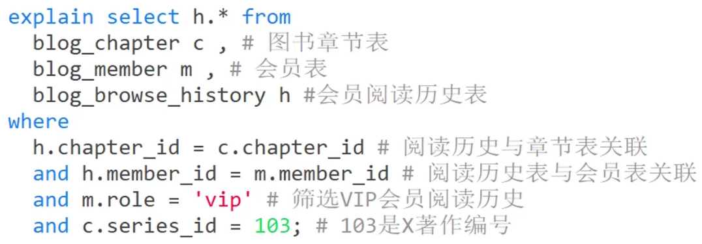
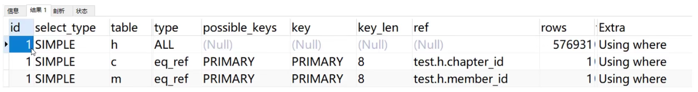
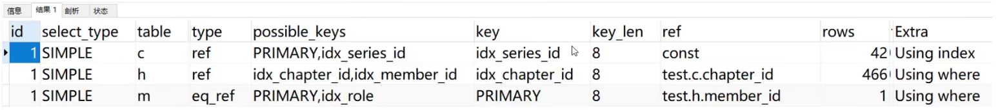
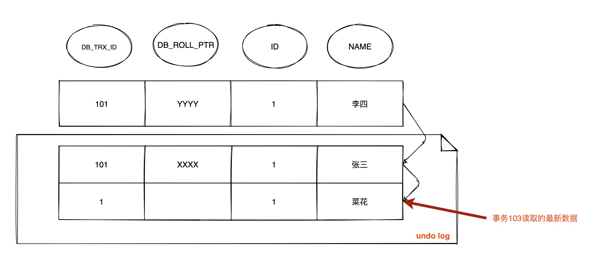
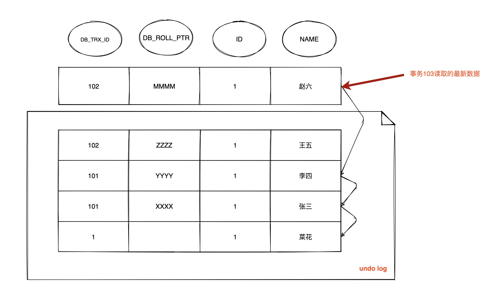
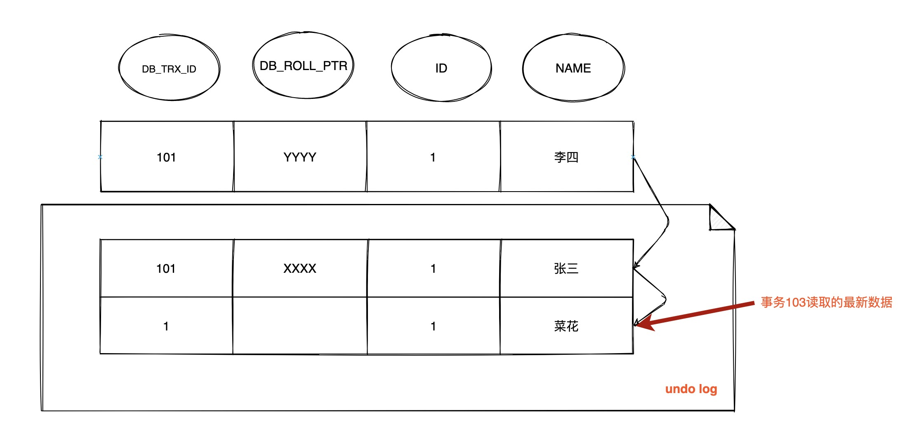
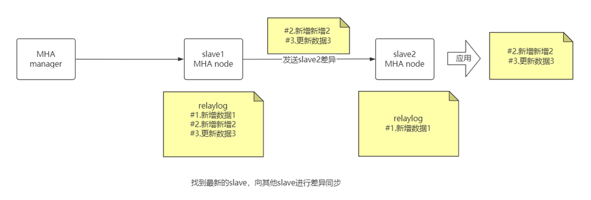
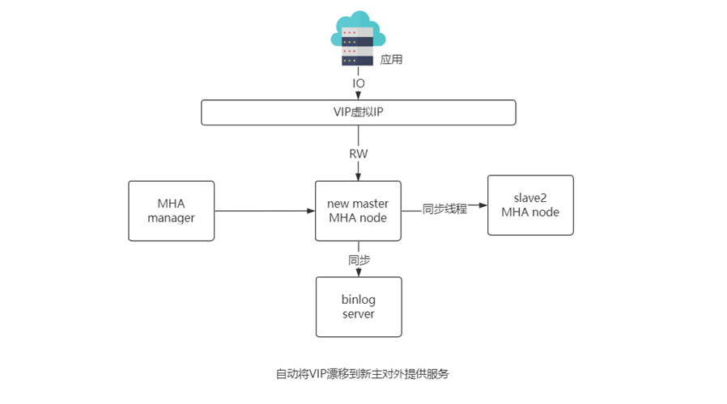
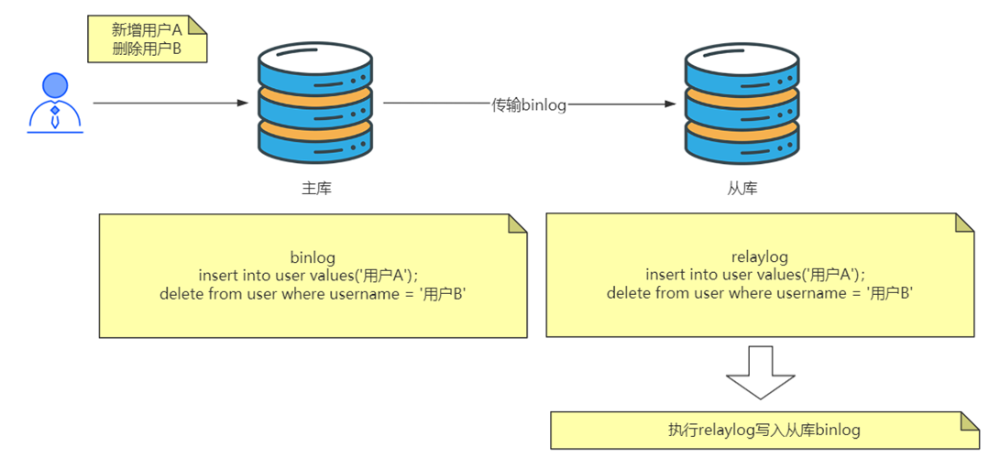

OLAP联机分析处理:

对海量的历史数据进行分析操作,要求产生决策性的影响,不要求在极短的时间内返回结果

 --> 数据仓库  如hive 采用 hash索引

--> clickhoust/druid/kylin

OLTP联机事务处理:

为了支撑业务系统的需要,必须在极短时间内返回对应的结果

-->关系型数据库

# mysql

**局部性原理**:之前被查询过的数据很可能再次被查询;

**磁盘预读:**在磁盘与内存进行交互的时候,有一个最小逻辑单元称之为页,datapage,与操作系统相关,一般为4k或8k,每次在进行数据交互的时候,一定读取的是页的整数倍.

mysql的innodb在进行数据读取的时候也是跟页相关的,datapagesize,默认情况下是16kb.,包括树的节点.

如innodb节点大小可通过:查看

```
show global status like 'Innodb_page_size' 
```

**mysql结构**


server中的查询缓存在mysql8版本之后失效:命中率低,查询一次清空.

简单来说 MySQL 主要分为 Server 层和存储引擎层：

**Server 层**：主要包括连接器、查询缓存、分析器、优化器、执行器等，所有跨存储引擎的功能都在这一层实现，比如存储过程、触发器、视图，函数等，还有一个通用的日志模块 binglog 日志模块。

**存储引擎**： 主要负责数据的存储和读取，采用可以替换的插件式架构，支持 InnoDB、MyISAM、Memory 等多个存储引擎，其中 InnoDB 引擎有自有的日志模块 redolog 模块。


## 索引

> 存储在磁盘中,但是会预先加载到内存中,而且在进行加载的时候是分页加载;

链表:时间复杂度高,效率低;

hash表:需要优秀的hash算法;不支持顺序和范围查询;需要大量内存空间(哈希碰撞全部加载),memory使用hash索引,innodb支持自适应hash;

BST(二叉搜索树):数据不平衡时会退化成链表;

AVL(平衡二叉搜索树):为保证平衡经常需要旋转操作,耗费性能;

红黑树(最长子树高度不超过最短子树两倍,减少了avl树旋转的次数):当插入的数据足够多的时候,树会变得很高(因为是二叉),io次数就会变多,查询变慢;

B树: 节点(一个磁盘块大小)中除了指向子节点的指针外,存储的数据占用节点大量空间,范围查询需要中序遍历;

B+树:所有数据存储在叶子节点,非叶子只存储指针和索引值,每个节点能索引的范围更大更精确. 叶节点增加的链指针,加强了区间访问性.

> 每一个节点最多存储degree-1个数据,degree越大(datapagesize和索引大小决定),每个节点存储的数据越多,io次数越少
>
> datapagesize(16) / (索引大小+地址指针大小) = 每个节点存储索引的个数(degree -1) 

> 为了使b+树足够矮,尽量减少索引值的占用空间(比如varchar大于4B用int|使用前缀短索引), 通过千万级别数据3-4层足以(结合datapagesize,数据量,索引大小由mysql确定).

> 复合索引的结构只是先计算左边的值然后再比较后面的值;
>
> 创建索引的时候,要保证唯一的值足够多,这样才有意义,一般情况下是80%
>
> 与其说是数据库只支持一条查询语句只使用一个索引，倒不如说N条独立索引同时在一条语句使用的消耗比只使用一个索引还要慢。
>
> 读取索引的时候一层一层的加载到内存.	

### 聚簇索引

聚簇索引具有唯一性, 表中行的物理顺序即聚簇索引中行的物理顺序;

聚簇索引默认是主键,唯一非空索引,rowid.

访问同一数据页(datapage)不同行记录时,都会在一次IO 操作中被读取到缓存中,下一次访问直接在内存操作. 如果出现行移动或页分裂仅需修改聚簇索引即可.

而MyISAM因为直接存储行号,数据随机存储,获取每条数据都要进行一次io. 并且如果出现行移动或者页分裂会导致更新所有二级索引存储的行地址都要更新.

> 如果已经设置了主键为聚簇索引又希望再单独设置聚簇索引，必须先删除主键，然后添加我们想要的聚簇索引， 最后恢复设置主键即可。

innode数据+索引文件:  `.idb`

myisam数据+索引: `.myd` `.myi`


### 索引维护

**页分裂**

当固定磁盘块的数据节点如[1,2,3,5]要插入一个4,需要进行页分裂,但是页分裂不仅仅是分裂叶子节点这么简单,其上面的上层节点也要进行维护(超出大小也要分裂).

所以自增id每次插在最后而不会影响之前产生的树.

**页合并**

当删了一行记录时，实际上记录并没有被物理删除，记录被标记（flaged）为删除并且它的空间变得允许被其他记录声明使用。当页中删除的记录达到`MERGE_THRESHOLD`（默认页体积的50%），InnoDB会开始寻找最靠近的页（前或后）看看是否可以将两个页合并以优化空间使用。

### 索引覆盖

回表效率不高;

在id为主键的情况下,对于

```
select id,name from table where name=zhangsan;
```

可对name建立索引达到索引覆盖

对于

```
select id,name,age from table where name=zhangsan;
```

可对(name,age)作为复合索引

因为索引是顺序存储的, 结合索引覆盖可达到排序效果而不需要orderby, 如:

```
# ag
select id,age FROM table WHERE age >10;
```


### 最左匹配原则

需要先匹配左边,再匹配右边,直到遇到范围查询(>、<、between、 like)就停止匹配.

如果我们创建了(area, age, salary)的复合索引，那么其实相当于创建了(area,age,salary)、(area,age)、(area)三个索引.  因此我们在创建复合索引时应该将最常用作限制条件的列放在最左边，依次递减。

对于复合索引(name,age)

```
select * from table where name=?   √
select * from table where name=? and age=?  √
select * from table where age=> and  name=?   
select * from table where age=?  ×
```

对于第三种情况, 在优化器组件的作用下通过调整顺序来匹配索引.

最左匹配原则在mysql优化下可能不会生效

对于字段id,a,b,c ,主键索引id和复合索引(a,b,c);

```
select * from table where b=2 and c=3;
可能会走复合索引,因为走索引可以达到索引覆盖
```

而对于字段id,a,b,c,d ,主键索引id和复合索引(a,b,c);

```
select * from table where b=2 and c=3;
可能不会走复合索引,因为走索引要回表
```

> 利用IN可消除前缀, 如对于索引(sex, country, age),
>
> where sex in ('男','女') and ...
>
> 但是当in中的条件过多时且多处使用in消除前缀, mysql相当于进行了所有条件个数相乘此查询, 影响效率

### 索引下推

- 索引条件下推(Index Condition Pushdown),简称ICP。MySQL5.6新添加，用于优化数据的查询。
- 当你不使用ICP,通过使用非主键索引（普通索引or二级索引）进行查询，存储引擎通过索引检索数据，然后返回给MySQL服务器，服务器再判断是否符合条件。
- 使用ICP，当存在索引的列做为判断条件时，MySQL服务器将这一部分判断条件传递给存储引擎，然后存储引擎通过判断索引是否符合MySQL服务器传递的条件，只有当索引符合条件时才会将数据检索出来返回给MySQL服务器。

```
select * from table where name like '%aa' and age=?
```

在没有索引下推之前,因为索引失效先根据name去存储引擎中拉取复合结果的数据,返回到server层,在server层中对age的条件进行过滤;

有了索引下推之后,根据name,age两个条件直接从存储引擎中拉去结果,不需要在server层做条件过滤;

在mysql5.7以后默认开启.

> mysql server端由连接器,分析器,优化器,执行器组成

查看 show variables like '%switch%'

index_condition_push=on

当使用explan进行分析时，如果使用了索引条件下推，Extra会显示**Using index condition**。

### 索引失效

1.OR  (可使用union all 或 union 代替);

2.复合索引不符合最左匹配;

3.like以%开头;

4.索引列上做计算,函数,类型转换;

5.如果mysql觉得全表扫描更快时（数据少）;


## 执行计划explain

explain关键字可以模拟MySQL优化器执行SQL语句，可以很好的分析SQL语句或表结构的性能 瓶颈。

> explain extended 可查看相关警告信息

```
mysql> explain select * from subject where id = 1
******************************************************
id: 1
select_type: SIMPLE
table: subject
partitions: NULL
type: const
possible_keys: PRIMARY
key: PRIMARY
key_len: 4
ref: const
rows: 1
filtered: 100.00
Extra: NULL
```

```
1. id 				//select查询的序列号，包含一组数字，表示查询中执行select子句或操作表的顺序
2. select_type 		//查询类型 主要用于区别普通查询、联合查询、子查询等的复杂查询
3. table 			//这个数据是基于哪张表的
4. partitions 		//匹配的分区
5. type 			//访问的类型
6. possible_keys 	//与当前查询相关备选的索引有哪些, PRIMARY代表主键
7. key 				//代表当前实际使用的索引是哪个
8. key_len 			//代表单个索引值的长度
9. ref 				//显示使用哪个列或常数与key一起从表中选择行
10. rows 			//本次查询所扫描的行数, 不一定一致, 扫描行数越少越好
11. filtered 		//查询的表行占表的百分比
12. Extra 			//包含不适合在其它列中显示但十分重要的额外信息
```

**id字段**

```
1.id相同 : 执行顺序从上至下  (最上方的为驱动)
2.id不同 : 如果是子查询，id的序号会递增，id的值越大优先级越高，越先被执行
3.id相同又不同 : id如果相同，可以认为是一组，从上往下顺序执行 在所有组中，id值越大，优先级越高，越先执行
```

**select_type字段**(关键)

```
1.SIMPLE : 简单查询，不包含子查询或Union查询
2.PRIMARY : 查询中若包含任何复杂的子部分，最外层查询则被标记为主查询
3.SUBQUERY : 在select或where中包含子查询
4.DERIVED : 在FROM列表中包含的子查询被标记为DERIVED（衍生），MySQL 会递归执行这些子查询，把结果放在临时表中
			MySQL5.7+ 进行优化了，增加了derived_merge（派生合并），默认开启，可加快查询效率
5.UNION : 若第二个select出现在union之后，则被标记为UNION
6.UNION RESULT : 从UNION表获取结果的select (去重)
```

**type字段**(关键): 访问类型

```
1.NULL : 优化阶段分解查询语句，执行阶段不用再访问表或索引.
2.system : 表只有一行记录（等于系统表），const类型特列，
3.const : 常数引用访问
4.eq_ref :唯一性索引扫描
5.ref : 非唯一性索引扫描
6.ref_or_null : 类似ref, 但是可以搜索值为null的行
7.index_merge : 索引合并扫描
8.range : 范围扫描
9.index : Full index Scan
10.ALL : 全表扫描
```

**Extra字段**(关键)

```
1.Using filesort : 说明MySQL会对数据使用一个外部的索引排序，而不是按照表内的索引顺序进行读取 
	MySQL中无法利用索引完成的排序操作称为“文件排序”
	优化方式,给排序字段建索引，并使用where或limit激活
2.Using temporary : 使用了临时表保存中间结果，MySQL在对结果排序时使用临时表，常见于排序order by 和分组查询group by
	优化方式,给分组字段建索引
3.Using index : 使用了覆盖索引,不必回表
4.Using where : 从数据表中返回数据再过过滤
5.Using join buffer :使用了连接缓存 
	explain select student.*,teacher.*,subject.* from student,teacher,subject;
	explain select * from emp ,dept where emp.empno = dept.ceo ;
6.impossible where : where子句的值总是false，不能用来获取任何元组
7.distinct : 一旦mysql找到了与行相联合匹配的行，就不再搜索了, 如左连接里的右表
8.Select tables optimized away
	explain select * from emp ,dept where emp.empno = dept.ceo ;
	explain select min(id) from subject;
9.using MMR : MMR(Multi Range Read), 当查询通过二级索引得到的主键值进行回表时,如果回表的主键值为二级索引的顺序,对应的主键就是乱序的, 回表的时候就需要进行大量随机IO; MRR则在内存中将二级索引中命中的主键值进行根据主键列进行排序后才进行回表,这样回表则是顺序IO,极大提高了性能.
```

### NLJ

 NLJ(Nested Loop Join 嵌套循环关联)

与编程中的二层嵌套类似,  驱动表中的每一条记录与被驱动表总的记录进行比较, 驱动表的选择决定了查询性能的高低.

> mysql会自动选择最优驱动表, 但是在多级关联情况下有可能会出现选择问题

案例:

在mysql8多表关联查询语句下:



执行计划为:



按上下顺序, 最顶端的是驱动表, 此时未加索引, h表不幸被选中作为驱动表 , 进行全表关联, 效率极差.

此过程先对h表全表扫描576931行, 然后根据ref的关联在被驱动表中查询.

此时, 如果只给筛选条件的字段m.role和c.series_id加索引(小白做法):

```
create index idx_series_id on blog_chapter(series_id);
create index idx_role on blog_menber(role);
```

再查看执行计划, 会发现与没加索引结果一样.

> 结论:如果在多表关联时只在筛选条件上加字段索引, 没卵用.

此时, 再给关联条件的外键增加索引:

```
create index idx_chapter_id on blog_browse_history(chapter_id);  	#新增
create index idx_menber_id on blog_browse_history(menber_id);		#新增
create index idx_series_id on blog_chapter(series_id);
create index idx_role on blog_menber(role);
```

再查看执行计划:



此时的驱动顺序为: c -> h -> m

先在驱动表c中通过对series_id进行const筛选(103),  这里的Using index表示通过series_id二级索引查询到主键chapter_id后并未回表, 直接使用主键与被驱动表关联.

然后h表根据c表查询出来的主键(chapter_id)通过外键关联进行查询(由于h表对外键chapter_id已建立索引, 所以查询效率高) , 这里的Using where表示通过二级索引chapter_id查询到h表的主键后进行回表.

再然后m表根据h表查询出来的外键(menber_id)直接进行主键查询. (但是不懂这里为什么Using where)

> 结论:只有正确的在外键上建立索引(关联的主键自带索引), 在关联表的索引才能生效, 查询优化器才能正确决定用哪个表作为驱动表是最优解


另外

1.在索引正确的情况下, 如果将多表关联改为where in 子查询,  在查询优化器的驱使执行计划不会改变, 仍然使用NLJ高效查询.


查看查询计划与上面结果一样.

2.在索引正确的情况下, 如果将多表关联改为from子句筛选, 在查询优化器的驱使执行计划不会改变, 仍然使用NLJ高效查询.


查看查询计划与上面结果一样.


3.例外:如果select包含子查询, 会出现DEPENDENT SUBQUERY, 代表依赖子查询, 也属于NLJ范畴


该方式在每查询出一条记录后,就将这条记录的某个属性拿去进行子查询.

### 其他执行计划

- DERIVED 子查询中出现多结果集运算

id越大的子查询越先执行:

id=4和id=3时: 通过两个根据series_id查询形成一个结果集

id相同时从上往下执行:

< derived3 >表示指向id为3的执行计划以及向后的延伸. 这里为id=4和id=3的结果集,

id=1的执行计划先以derived3为驱动表c,通过c表的chapter_id查询h表二级索引,然后回表获取h表数据,然后再根据h表的menber_id查询blog_menber表数据(没有走二级索引)

- UNION RESULT 少用UNION, 多用UNION ALL.


这里的UNION RESULT执行计划表示对union3和4进行去重, 通过类型可以看到这个操作为全表扫描 , 关键的是Using temporary

> UNION去重基于临时表, 临时表特性时如果缓存够使用内容, 缓存不够自动创建MyISAM引擎表(磁盘), IO效率变差.

## 锁分类

数据库锁机制用于保证数据的一致性

MySQL的锁机制比较简单最著的特点是不同的存储引擎支持不同的锁机制。 InnoDB支持行锁, MyISAM只支持表锁。

表锁 的特点就是开销小、加锁快，不会出现死锁。锁粒度大，发生锁冲突的概率小，并发度相对 低。

行锁 的特点就是开销大、加锁慢，会出现死锁。锁粒度小，发生锁冲突的概率高，并发度搞。

**全局锁**

对整个数据库实例加锁, 在全局锁下, 数据库处于只读状态, 阻塞对数据的增删改和DDL.

区分于`set global readonly=true`: 全局锁会在异常时自动释放, 用于做全库的逻辑备份.

```
#加锁
lock flush tables with read lock
#释放
unlock tables
```

**表锁**

由 MySQL服务器实现，所有都可以使用表锁。一般在执行 DDL 语句时，譬如 ALTER TABLE 时就会对整个表进行加锁。在执行 SQL 语句时，也可以明确对某个表加锁。

表锁分为表共享锁和表排他锁, 给表显式加锁语句为：

```
#加表读锁(共享锁)
lock table {tableName} read;
#释放表锁
unlock tables；
#查看表锁
show open table;
#加表写锁(排他锁)
lock table {tableName} write;
#释放表读锁
unlock tables；
```

> MYISAM引擎会对执行的sql语句自动进行加读或写锁.

**行锁(InnoDB)**

查看隔离级别

```
show variables like '%iso%';
```

注意:大多数数据库默认的事务隔离级别为读已提交RC , 而innoDB默认的事务隔离级别为可重复度RR

1.记录锁(Record Locks)

InnoDB的行锁是通过对**索引项加锁**实现的，这表示只有通过索引查询记录时才会使用行锁，如果不走索引查询数据将使用表锁，则性能会大打折扣.

2.间隙锁(Gap Locks)

间隙锁是一种区间锁。锁加在不存在的空闲空间上，或者两个索引记录之间，或者第一个索引记录之前，或者最后一个索引之后的空间，用来表示只锁住一段范围(一般在进行范围查询时且隔离级别在RR或Serializable隔时).

3.Next-key Locks

记录锁与间隙锁的组合, 指加在某条记录以及这条记录的间隙上的锁.

**根据模式分类**

1.读锁(共享锁,  shared lock,s锁)

一个事务获取了一个数据行的读锁，其他事务能获得该行对应的读锁但不能获得写锁，即一个事务在读取一个数据行时，其他事务也可以读，但不能对该数行增删改 的操作。

读锁有两种select方式的应用： 

1. 第一种是自动提交模式下的select查询语句，不需加任何锁,直接返回查询结果，这就是一致性非锁 定读。 
2. 第二种就是通过select.... lock in share mode被读取的行记录或行记录的范围上加一个读锁,让其 他事务可以读,但是要想申请加写锁,那就会被阻塞

**注意:**

```
在行（也就是记录）上加锁，并不是锁住该条记录，而是在记录对应的索引上加锁。如果where条件中不走索引，则会对所有的记录加锁。这里所说的读，是指当前读，快照读是无需加锁的。普通select读一般都是快照读，除了select...lock in share mode这样的显式加锁语句下会变成当前读，在InnoDB引擎的serializable级别下，普通select读也会变成当前读。
```

2.写锁(排他锁,Exclusive Lock ,x锁)

写锁，也叫排他锁，或者叫独占所，简称x锁。一个事务获取了一个数据行的写锁，其他事务就不能再 获取该行的其他锁与锁优先级最高。

写锁的应用就很简单了，有以下两种情况：

 (1) insert/update/delete语句，会自动在该条记录上加上写锁

如两个事务对同一行update;

 (2) 比较特殊的就是select for update，它会对读取的行记录上加一个写锁，那么其他任何事务戴不 能对被锁定的行上加任何锁了，要不然会被阻塞。

**注意:写锁也是加在索引上的**

**但是发现上述两种情况其他事务还能对该行读,这是因为mysql实现了MVCC模型**

3.MDL锁

MySQL 5.5引入了meta data lock，简称MDL锁，用于保证表中 元数据 的信息  ,系统级的锁无法主动控制。主要是为了在并发环境下对DDL、DML同时操作下保持元数据的一致性。

在事务A中，开启了表查询事务，会自动获得一个MDL锁，

事务B就不可以执行任何DDL语句，比如为表中添加字段 ,删除表.

1. 对表中的记录进行增删改查（DML操作）的时候，自动加MDL读锁；
2. 对表的结构（DDL操作）进行修改的时候，自动加MDL写锁。

根据MDL锁的粒度和模式,MDL锁还分成了很多种类

4.意向锁

在mysql的innodb引擎中，意向锁是表级锁，是一种不与行级锁冲突的表级锁，表示表中的记录所需要的锁(S锁或X锁)的类型（其实就是告诉你，这张表中已经存在了行锁（行锁的类型），所以叫意向锁）。InnoDB支持多种粒度的锁，允许行级锁和表级锁的共存。

意向锁有两种 

意向共享锁（IS） 是指在给一个数据行加共享锁前必须获取该表的意向共享锁

意向排它锁（IX） 是指在给一个数据行加排他锁前必须获取该表的意向排他锁

**意向锁与意向锁之间是不互斥的，但是意向锁与其他表锁之间存在一定的兼容互斥**

|               | 表意向共享锁（IS） | 表意向排他锁（IX） |
| ------------- | ------------------ | ------------------ |
| 表共享锁（S） | 兼容               | 互斥               |
| 表排他锁（X） | 互斥               | 互斥               |

比如:

```
事务 A 获取了某一行的排他锁，并未提交：begin;	SELECT * FROM test_user WHERE id = 28 FOR UPDATE;# 此时事务A获取了两把锁：test_user 表上的意向排他锁与 id 为 28 的数据行上的排他锁。事务 B 想要获取表的表共享锁；begin;LOCK TABLE test_user READ;# 因为共享锁与排他锁互斥，所以事务 B 在试图对 test_user 表加共享锁的时候，必须保证：1.当前没有其他事务持有 test_user 表的排他锁（表排他锁）。2.当前没有其他事务持有 test_user 表中任意一行的排他锁（行排他锁）。# 为了检测是否满足第二个条件，如果没有意向锁，事务 B 必须在确保 test_user表不存在任何排他锁的前提下，去检测表中的每一行是否存在排他锁；但是如果有了意向锁之后，事务 B 只需要检测事务 A 是否持有 test_user 表的意向排他锁，就可以得知事务 A 必然持有该表中某些数据行的排他锁，那么事务 B 对 test_users 表的加锁请求就会被排斥（阻塞），从而无需去检测表中的每一行数据是否存在排他锁。事务 C 也想获取表中某一行的排他锁：begin;	SELECT * FROM test_user WHERE id = 31 FOR UPDATE;# 因为意向锁之间并不互斥，所以事务C获取到了test_user的意向排他锁# 因为id 为 31 的数据行上不存在任何排他锁，最终事务 C 成功获取到了该数据行上的排他锁。
```

5.插入意向锁(Insert Intention)

为提高普通间隙锁并发能力, 在插入一行记录操作之前设置的一种特殊的间隙锁, 当多个事务在相同的索引间隙插入时如果不是插入间隙中相同的位置, 就不需要等待.

6.自增锁

在InnoDB存储引擎中，针对每个自增长的字段都设置了一个自增长的计数器。我们可以执行下面的语句来得到这个计数器的当前值：

```
select max(自增长列) from table;
```

当我们进行插入操作的时候，该操作会根据这个自增长的计数器的当前值进行+1操作，并赋予自增长的列，这个操作我们称之为auto-inc Locking，也就是自增长锁，这种锁其实采用的是特殊的表锁机制，如果insert操作出现在一个事务中，这个锁是在insert操作完成之后立即释放，而不是等待事务提交。

7.页级锁

MySQL中锁定粒度介于行级锁和表级锁中间的一种锁。表级锁速度快，但冲突多，行级冲突少，但速度慢。所以取了折衷的页级，一次锁定相邻的一组记录。不同的存储引擎支持不同的锁机制。

页级锁是MySQL中比较独特的一种锁定级别，**应用于BDB引擎**，并发度一般，页级锁定的特点是锁定颗粒度介于行级锁定与表级锁之间，所以获取锁定所需要的资源开销，以及所能提供的并发处理能力也同样是介于上面二者之间。另外，页级锁定和行级锁定一样，会发生死锁。

**乐观锁和悲观锁**

1.乐观锁

乐观锁大多是基于数据版本记录机制实现，一般是给数据库表增加一个"version"字段。读取数据时，将 此版本号一同读出，之后更新时，对此版本号加一。此时将提交数据的版本数据与数据库表对应记录的 当前版本信息进行比对，如果提交的数据版本号大于数据库表当前版本号，则予以更新，否则认为是过 期数据。

2.悲观锁

悲观锁依靠数据库提供的锁机制实现。MySQL中的共享锁和排它锁都是悲观锁。数据库的增删改操作默 认都会加排他锁，而查询不会加任何锁。此处不赘述

**锁等待和死锁**

锁等待是指一个事务过程中产生的锁，其他事务需要等待上一个事务释放它的锁，才能占用该资源。如 果该事务一直不释放，就需要持续等待下去，直到超过了锁等待时间，会报一个等待超时的错误。

MysQL中通过innodb_lock_wait_timeout参数控制,单位是秒。

死锁是指两个或两个以上的进程在执行过程中，因争夺资源而造成的一种互相等待的现象，就是所谓的 锁资源请求产生了回路现象，即死循环。

```
死锁的条件1. 两行记录，至少两个事务2. 事务A 操作 第n行数据，并加锁 update teacher set name = 'a' where id = 1;3. 事务B 操作 第m行数据，并加锁 update teacher set name = 'b' where id = 2;4. 事务A 操作 第m行数据 update teacher set name = 'c' where id = 2;5. 事务B 操作 第n行数据 update teacher set name = 'd' where id = 1;6. 形成死锁 Deadlock found when trying to get lock; try restartingtransaction
```

InnoDB引擎可以自动检测死锁并 回滚该事务 好不容易执行了一个业务给我回滚了，所以死锁尽量不要 出现。

## 事务

ACID特性

**原子性**（`Atomicity`） ： 事务是最小的执行单位，不允许分割。事务的原子性确保动作要么全部完成，要么完全不起作用；

**一致性**（`Consistency`）： 执行事务前后，数据保持一致，例如转账业务中，无论事务是否成功，转账者和收款人的总额应该是不变的；

**隔离性**（`Isolation`）： 并发访问数据库时，一个用户的事务不被其他事务所干扰，各并发事务之间数据库是独立的；

**持久性**（`Durability`）： 一个事务被提交之后。它对数据库中数据的改变是持久的，即使数据库发生故障也不应该对其有任何影响。


并发事务问题:

**脏读（Dirty read）:** 脏读是指事务读取到其他事务没提交的数据


**丢失修改（Lost to modify）:** 指在一个事务读取一个数据时，另外一个事务也访问了该数据，那么在第一个事务中修改了这个数据后，第二个事务也修改了这个数据。这样第一个事务内的修改结果就被丢失，因此称为丢失修改。 例如：事务 1 读取某表中的数据 A=20，事务 2 也读取 A=20，事务 1 修改 A=A-1，事务 2 也修改 A=A-1，最终结果 A=19，事务 1 的修改被丢失。

**不可重复读（Unrepeatable read）:** 不可重复读是指在同一次事务中前后查询不一致的问题


**幻读（Phantom read）:** 幻读是一次事务中前后数据量发生变化用户产生不可预料的问题


**不可重复读和幻读区别：**

不可重复读的重点是修改比如多次读取一条记录发现其中某些列的值被修改，幻读的重点在于新增或者删除比如多次读取一条记录发现记录增多或减少了(伤害不大)。


**隔离级别**

**READ-UNCOMMITTED(读取未提交)：** 最低的隔离级别，允许读取其他事务尚未提交的数据变更，**可能会导致脏读、幻读或不可重复读**。

**READ-COMMITTED(读取已提交)：** 允许读取并发事务已经提交的数据，**可以阻止脏读，但是幻读或不可重复读仍有可能发生**。

**REPEATABLE-READ(可重复读)：** 对同一字段的多次读取结果都是一致的，除非数据是被本身事务自己所修改，**可以阻止脏读和不可重复读，但幻读仍有可能发生**。

**SERIALIZABLE(可串行化)：** 最高的隔离级别，完全服从 ACID 的隔离级别。所有的事务依次逐个执行，这样事务之间就完全不可能产生干扰，也就是说，**该级别可以防止脏读、不可重复读以及幻读**。**此隔离级别是唯一使用加锁读的方式的隔离级别.**

> MySQL InnoDB 的 REPEATABLE-READ（可重读）可避免幻读，需要应用使用加锁读来保证。而这个加锁度使用到的机制就是 Next-Key Locks(MVCC)。

> 因为隔离级别越低，事务请求的锁越少，所以大部分数据库系统的隔离级别都是 **READ-COMMITTED(读取提交内容)** ，但是InnoDB 存储引擎默认使用 **REPEATABLE-READ（可重读）** 并不会有任何性能损失。

 InnoDB 存储引擎的默认支持的隔离级别是 **REPEATABLE-READ（可重读）**。

我们可以通过`SELECT @@tx_isolation;` 或者 `SHOW VARIABLES LIKE 'transaction_isolation';`查看

通过 `SET SESSION TRANSACTION ISOLATION LEVEL READ UNCOMMITTED;` 设置当前会话的隔离级别.

> 通常我们不需要修改mysql隔离级别

## MVCC

MVCC ，全称 Multi-Version Concurrency Control ，即多版本并发控制。MVCC是基于”数据版本”对并发事务进行访问.

一致性的非锁定行读（consistent nonlocking read，简称CNR）是指InnoDB存储引擎通过行多版本控制（multi versioning）的方式来读取当前执行时间数据库中运行的数据.  通常做法是加一个版本号或者时间戳字段，在更新数据的同时版本号 + 1 或者更新时间戳。查询时，将当前可见的版本号与对应记录的版本号进行比对，如果记录的版本小于可见版本，则表示该记录可见

在 `InnoDB` 存储引擎中，多版本控制 (multi versioning)) 就是对非锁定读的实现。如果读取的行正在执行 `DELETE` 或 `UPDATE` 操作，这时读取操作不会去等待行上锁的释放。相反地，`InnoDB` 存储引擎会去读取行的一个快照数据，对于这种读取历史数据的方式，我们叫它快照读 (snapshot read)

在 `Repeatable Read` 和 `Read Committed` 两个隔离级别下，如果是执行普通的 `select` 语句（不包括 `select ... lock in share mode` ,`select ... for update`）则会使用 `一致性非锁定读（MVCC）`。并且在 `Repeatable Read` 下 `MVCC` 实现了可重复读和防止部分幻读

**锁定读**

如果执行的是下列语句，就是锁定读（Locking Reads）

- `select ... lock in share mode`
- `select ... for update`
- `insert`、`update`、`delete` 操作

在锁定读下，读取的是数据的最新版本，这种读也被称为 `当前读（current read）`。锁定读会对读取到的记录加锁：

- `select ... lock in share mode`：对记录加 `S` 锁，其它事务也可以加`S`锁，如果加 `x` 锁则会被阻塞
- `select ... for update`、`insert`、`update`、`delete`：对记录加 `X` 锁，且其它事务不能加任何锁

在一致性非锁定读下，即使读取的记录已被其它事务加上 `X` 锁，这时记录也是可以被读取的，即读取的快照数据。上面说了，在 `Repeatable Read` 下 `MVCC` 防止了部分幻读，这边的 “部分” 是指在 `一致性非锁定读` 情况下，只能读取到第一次查询之前所插入的数据（根据 Read View 判断数据可见性，Read View 在第一次查询时生成）。但是！如果是 `当前读` ，每次读取的都是最新数据，这时如果两次查询中间有其它事务插入数据，就会产生幻读。所以， **`InnoDB` 在实现`Repeatable Read` 时，如果执行的是当前读，则会对读取的记录使用 `Next-key Lock` ，来防止其它事务在间隙间插入数据**.


**innodb对mvcc实现**

`MVCC` 的实现依赖于：**隐藏字段、Read View、undo log**。在内部实现中，`InnoDB` 通过数据行的 `DB_TRX_ID` 和 `Read View` 来判断数据的可见性，如不可见，则通过数据行的 `DB_ROLL_PTR` 找到 `undo log` 中的历史版本。每个事务读到的数据版本可能是不一样的，在同一个事务中，用户只能看到该事务创建 `Read View` 之前已经提交的修改和该事务本身做的修改..

**隐藏字段**

在内部，`InnoDB` 存储引擎为每行数据添加了三个 [隐藏字段  (opens new window)](https://dev.mysql.com/doc/refman/5.7/en/innodb-multi-versioning.html)：

- `DB_TRX_ID（6字节）`：表示最后一次插入或更新该行的事务 id。此外，`delete` 操作在内部被视为更新，只不过会在记录头 `Record header` 中的 `deleted_flag` 字段将其标记为已删除
- `DB_ROLL_PTR（7字节）` 回滚指针，指向该行的 `undo log` 。如果该行未被更新，则为空
- `DB_ROW_ID（6字节）`：如果没有设置主键且该表没有唯一非空索引时，`InnoDB` 会使用该 id 来生成聚簇索引


**Read view**

```c++
class ReadView {
	private:  
		trx_id_t m_low_limit_id;      			/* 大于等于这个 ID 的事务均不可见 */  
		trx_id_t m_up_limit_id;       			/* 小于这个 ID 的事务均可见 */  
		trx_id_t m_creator_trx_id;    			/* 创建该 Read View 的事务ID */  
		trx_id_t m_low_limit_no;      			/* 事务 Number, 小于该 Number 的 Undo Logs 均可以被 Purge */  
		ids_t m_ids;                  			/* 创建 Read View 时的活跃事务列表 */  
		m_closed;                     			/* 标记 Read View 是否 close */
}
```

[`Read View` ](https://github.com/facebook/mysql-8.0/blob/8.0/storage/innobase/include/read0types.h#L298) 主要是用来做可见性判断，里面保存了 “当前对本事务不可见的其他活跃事务”

主要有以下字段：

- `m_low_limit_id`：目前出现过的最大的事务 ID+1，即下一个将被分配的事务 ID。大于等于这个 ID 的数据版本均不可见
- `m_up_limit_id`：活跃事务列表 `m_ids` 中最小的事务 ID，如果 `m_ids` 为空，则 `m_up_limit_id` 为 `m_low_limit_id`。小于这个 ID 的数据版本均可见
- `m_ids`：`Read View` 创建时其他未提交的活跃事务 ID 列表。创建 `Read View`时，将当前未提交事务 ID 记录下来，后续即使它们修改了记录行的值，对于当前事务也是不可见的。`m_ids` 不包括当前事务自己和已提交的事务
- `m_creator_trx_id`：创建该 `Read View` 的事务 ID


**undo log**

`undo log` 主要有两个作用：

- 当事务回滚时用于将数据恢复到修改前的样子
- 另一个作用是 `MVCC` ，当读取记录时，若该记录被其他事务占用或当前版本对该事务不可见，则可以通过 `undo log` 读取之前的版本数据，以此实现非锁定读

**在 `InnoDB` 存储引擎中 `undo log` 分为两种： `insert undo log` 和 `update undo log`：**

1. **`insert undo log`** ：指在 `insert` 操作中产生的 `undo log`。因为 `insert` 操作的记录只对事务本身可见，对其他事务不可见，故该 `undo log` 可以在事务提交后直接删除。不需要进行 `purge` 操作

**`insert` 时的数据初始状态：**


2.**`update undo log`** ：`update` 或 `delete` 操作中产生的 `undo log`。该 `undo log`可能需要提供 `MVCC` 机制，因此不能在事务提交时就进行删除。提交时放入 `undo log` 链表，等待 `purge线程` 进行最后的删除.

**数据第一次被修改时：**


**数据第二次被修改时：**


不同事务或者相同事务的对同一记录行的修改，会使该记录行的 `undo log` 成为一条链表，链首就是最新的记录，链尾就是最早的旧记录。

> mysql确保UNDO_LOG版本链数据不再被“引用”后再进行删除。


**数据可见性算法**

在 `InnoDB` 存储引擎中，创建一个新事务后，执行每个 `select` 语句前，都会创建一个快照（Read View），**快照中保存了当前数据库系统中正处于活跃（没有 commit）的事务的 ID 号**。其实简单的说保存的是系统中当前不应该被本事务看到的其他事务 ID 列表（即 m_ids）。当用户在这个事务中要读取某个记录行的时候，`InnoDB` 会将该记录行的 `DB_TRX_ID` 与 `Read View` 中的一些变量及当前事务 ID 进行比较，判断是否满足可见性条件

[具体的比较算法](https://github.com/facebook/mysql-8.0/blob/8.0/storage/innobase/include/read0types.h#L161)如下：[图源](https://leviathan.vip/2019/03/20/InnoDB的事务分析-MVCC/#MVCC-1)


1. 如果记录 DB_TRX_ID < m_up_limit_id，那么表明最新修改该行的事务（DB_TRX_ID）在当前事务创建快照之前就提交了，所以该记录行的值对当前事务是可见的
2. 如果 DB_TRX_ID >= m_low_limit_id，那么表明最新修改该行的事务（DB_TRX_ID）在当前事务创建快照之后才修改该行，所以该记录行的值对当前事务不可见。跳到步骤 5
3. m_ids 为空，则表明在当前事务创建快照之前，修改该行的事务就已经提交了，所以该记录行的值对当前事务是可见的
4. 如果 m_up_limit_id <= DB_TRX_ID < m_low_limit_id，表明最新修改该行的事务（DB_TRX_ID）在当前事务创建快照的时候可能处于“活动状态”或者“已提交状态”；所以就要对活跃事务列表 m_ids 进行查找（源码中是用的二分查找，因为是有序的）
   - 如果在活跃事务列表 m_ids 中能找到 DB_TRX_ID，表明：① 在当前事务创建快照前，该记录行的值被事务 ID 为 DB_TRX_ID 的事务修改了，但没有提交；或者 ② 在当前事务创建快照后，该记录行的值被事务 ID 为 DB_TRX_ID 的事务修改了。这些情况下，这个记录行的值对当前事务都是不可见的。跳到步骤 5
   - 在活跃事务列表中找不到，则表明“id 为 trx_id 的事务”在修改“该记录行的值”后，在“当前事务”创建快照前就已经提交了，所以记录行对当前事务可见
5. 在该记录行的 DB_ROLL_PTR 指针所指向的 `undo log` 取出快照记录，用快照记录的 DB_TRX_ID 跳到步骤 1 重新开始判断，直到找到满足的快照版本或返回空


**RC 和 RR 隔离级别下 MVCC 的差异**

在事务隔离级别 `RC` 和 `RR` （InnoDB 存储引擎的默认事务隔离级别）下，`InnoDB` 存储引擎使用 `MVCC`（非锁定一致性读），但它们生成 `Read View` 的时机却不同

- 在 RC 隔离级别下的 **`每次select`** 查询前都生成一个`Read View` (m_ids 列表)
- 在 RR 隔离级别下只在事务开始后 **`第一次select`** 数据前生成一个`Read View`（m_ids 列表）


**MVCC 解决不可重复读问题**

虽然 RC 和 RR 都通过 `MVCC` 来读取快照数据，但由于 **生成 Read View 时机不同**，从而在 RR 级别下实现可重复读

举个例子：


  

**RC 下 ReadView 生成情况**

1.**`假设时间线来到 T4 ，那么此时数据行 id = 1 的版本链为`：**



由于 RC 级别下每次查询都会生成`Read View` ，并且事务 101、102 并未提交，此时 `103` 事务生成的 `Read View` 中活跃的事务 **`m_ids` 为：[101,102]** ，`m_low_limit_id`为：104，`m_up_limit_id`为：101，`m_creator_trx_id` 为：103

- 此时最新记录的 `DB_TRX_ID` 为 101，m_up_limit_id <= 101 < m_low_limit_id，所以要在 `m_ids` 列表中查找，发现 `DB_TRX_ID` 存在列表中，那么这个记录不可见
- 根据 `DB_ROLL_PTR` 找到 `undo log` 中的上一版本记录，上一条记录的 `DB_TRX_ID` 还是 101，不可见
- 继续找上一条 `DB_TRX_ID`为 1，满足 1 < m_up_limit_id，可见，所以事务 103 查询到数据为 `name = 菜花`

2.**`时间线来到 T6 ，数据的版本链为`：**


因为在 RC 级别下，重新生成 `Read View`，这时事务 101 已经提交，102 并未提交，所以此时 `Read View` 中活跃的事务 **`m_ids`：[102]** ，`m_low_limit_id`为：104，`m_up_limit_id`为：102，`m_creator_trx_id`为：103

- 此时最新记录的 `DB_TRX_ID` 为 102，m_up_limit_id <= 102 < m_low_limit_id，所以要在 `m_ids` 列表中查找，发现 `DB_TRX_ID` 存在列表中，那么这个记录不可见
- 根据 `DB_ROLL_PTR` 找到 `undo log` 中的上一版本记录，上一条记录的 `DB_TRX_ID` 为 101，满足 101 < m_up_limit_id，记录可见，所以在 `T6` 时间点查询到数据为 `name = 李四`，与时间 T4 查询到的结果不一致，不可重复读！

3.**`时间线来到 T9 ，数据的版本链为`：**



重新生成 `Read View`， 这时事务 101 和 102 都已经提交，所以 **m_ids** 为空，则 m_up_limit_id = m_low_limit_id = 104，最新版本事务 ID 为 102，满足 102 < m_low_limit_id，可见，查询结果为 `name = 赵六`

> **总结：** **在 RC 隔离级别下，事务在每次查询开始时都会生成并设置新的 Read View，所以导致不可重复读**


**在 RR 下 ReadView 生成情况**

**在可重复读级别下，只会在事务开始后第一次读取数据时生成一个 Read View（m_ids 列表）**

1. **`在 T4 情况下的版本链为`：**



在当前执行 `select` 语句时生成一个 `Read View`，此时 **`m_ids`：[101,102]** ，`m_low_limit_id`为：104，`m_up_limit_id`为：101，`m_creator_trx_id` 为：103

此时和 RC 级别下一样：

- 最新记录的 `DB_TRX_ID` 为 101，m_up_limit_id <= 101 < m_low_limit_id，所以要在 `m_ids` 列表中查找，发现 `DB_TRX_ID` 存在列表中，那么这个记录不可见
- 根据 `DB_ROLL_PTR` 找到 `undo log` 中的上一版本记录，上一条记录的 `DB_TRX_ID` 还是 101，不可见
- 继续找上一条 `DB_TRX_ID`为 1，满足 1 < m_up_limit_id，可见，所以事务 103 查询到数据为 `name = 菜花`

1. **`时间点 T6 情况下`：**

   

   在 RR 级别下只会生成一次`Read View`，所以此时依然沿用 **`m_ids` ：[101,102]** ，`m_low_limit_id`为：104，`m_up_limit_id`为：101，`m_creator_trx_id` 为：103

- 最新记录的 `DB_TRX_ID` 为 102，m_up_limit_id <= 102 < m_low_limit_id，所以要在 `m_ids` 列表中查找，发现 `DB_TRX_ID` 存在列表中，那么这个记录不可见
- 根据 `DB_ROLL_PTR` 找到 `undo log` 中的上一版本记录，上一条记录的 `DB_TRX_ID` 为 101，不可见
- 继续根据 `DB_ROLL_PTR` 找到 `undo log` 中的上一版本记录，上一条记录的 `DB_TRX_ID` 还是 101，不可见
- 继续找上一条 `DB_TRX_ID`为 1，满足 1 < m_up_limit_id，可见，所以事务 103 查询到数据为 `name = 菜花`

1. **时间点 T9 情况下：**


此时情况跟 T6 完全一样，由于已经生成了 `Read View`，此时依然沿用 **`m_ids` ：[101,102]** ，所以查询结果依然是 `name = 菜花`

> 连续多次快照读，ReadView会产生复用，没有幻读问题.
>
> 特例: 如果事务中两次快照读中出现了修改其他事务新增的当前读,  会重新生成ReadView ,  导致出现幻读.


**MVCC➕Next-key-Lock 防止幻读**

`InnoDB`存储引擎在 RR 级别下通过 `MVCC`和 `Next-key Lock` 来解决幻读问题：

**1、执行普通 `select`，此时会以 `MVCC` 快照读的方式读取数据**

在快照读的情况下，RR 隔离级别只会在事务开启后的第一次查询生成 `Read View` ，并使用至事务提交。所以在生成 `Read View` 之后其它事务所做的更新、插入记录版本对当前事务并不可见，实现了可重复读和防止快照读下的 “幻读”

**2、执行 select...for update/lock in share mode、insert、update、delete 等当前读**

在当前读下，读取的都是最新的数据，如果其它事务有插入新的记录，并且刚好在当前事务查询范围内，就会产生幻读！`InnoDB` 使用 [Next-key Lock  (opens new window)](https://dev.mysql.com/doc/refman/5.7/en/innodb-locking.html#innodb-next-key-locks) 来防止这种情况。当执行当前读时，会锁定读取到的记录的同时，锁定它们的间隙，防止其它事务在查询范围内插入数据。只要我不让你插入，就不会发生幻读


## 日志

1.日志类型

物理日志:存储了数据被修改的值

逻辑日志:存储了逻辑sql修改语句

`redo log` 它是物理日志，记录内容是“在某个数据页上做了什么修改”，属于 `InnoDB` 存储引擎，恢复速度远快于逻辑日志。让`InnoDB`存储引擎拥有了崩溃恢复能力。

`binlog` 是逻辑日志，记录内容是语句的原始逻辑，类似于“给 ID=2 这一行的 c 字段加 1”，属于`MySQL Server` 层。不管用什么存储引擎，只要发生了表数据更新，都会产生 `binlog` 日志。保证了`MySQL`集群架构的数据一致性。


### binlog(归档日志)

`MySQL`数据库的**数据备份、主备、主主、主从**都离不开`binlog`，需要依靠`binlog`来同步数据，保证数据一致性。

`binlog`会记录所有涉及更新数据的逻辑操作，并且是顺序写。

**记录格式**

`binlog` 日志有三种格式，可以通过`binlog_format`参数指定。

- **statement**

记录的内容是`SQL`语句原文，比如执行一条`update T set update_time=now() where id=1`.


同步数据时，会执行记录的`SQL`语句，但是有个问题，`update_time=now()`这里会获取当前系统时间，直接执行会导致与原库的数据不一致。

- **row**

为了解决`statement`存在的问题，我们需要指定为`row`，记录的内容不再是简单的`SQL`语句了，还包含操作的具体数据


`row`格式记录的内容看不到详细信息，要通过`mysqlbinlog`工具解析出来。

`update_time=now()`变成了具体的时间`update_time=1627112756247`，条件后面的@1、@2、@3 都是该行数据第 1 个~3 个字段的原始值（**假设这张表只有 3 个字段**）。

这样就能保证同步数据的一致性，通常情况下都是指定为`row`，这样可以为数据库的恢复与同步带来更好的可靠性。

但是这种格式，需要更大的容量来记录，比较占用空间，恢复与同步时会更消耗`IO`资源，影响执行速度。

- **mixed**

`statement`和`row`的折中方案,

`MySQL`会判断这条`SQL`语句是否可能引起数据不一致，如果是，就用`row`格式，否则就用`statement`格式。


**写入机制**

事务执行过程中，先把日志写到`binlog cache`，事务提交的时候，再把`binlog cache`写到`binlog`文件中。

因为一个事务的`binlog`不能被拆开，无论这个事务多大，也要确保一次性写入，所以系统会给每个线程分配一个块内存作为`binlog cache`。

我们可以通过`binlog_cache_size`参数控制单个线程 binlog cache 大小，如果存储内容超过了这个参数，就要暂存到磁盘（`Swap`）。


- **上图的 write，是指把日志写入到文件系统的 page cache，并没有把数据持久化到磁盘，所以速度比较快**
- **上图的 fsync，才是将数据持久化到磁盘的操作**

`write`和`fsync`的时机，可以由参数`sync_binlog`控制，默认是`0`。表示每次提交事务都只`write`，由系统自行判断什么时候执行`fsync`。


虽然性能得到提升，但是机器宕机，`page cache`里面的 binglog 会丢失。

为了安全起见，可以设置为`1`，表示每次提交事务都会执行`fsync`，就如同**binlog 日志刷盘流程**一样。

最后还有一种折中方式，可以设置为`N(N>1)`，表示每次提交事务都`write`，但累积`N`个事务后才`fsync`。


在出现`IO`瓶颈的场景里，将`sync_binlog`设置成一个比较大的值，可以提升性能。

同样的，如果机器宕机，会丢失最近`N`个事务的`binlog`日志。


### redolog(重做日志)

 保证事务的**持久性**

InnoDB内存可用来保存更新的结果, 再配合redolog, 避免随机写盘. 其内存的数据页在Buffer Pool中进行管理. 如当我们想要修改DB上某一行数据的时候， InnoDB是把**数据页(16KB)从磁盘读取到内存的Buffer Pool**上进行修改。

> Buffer Pool hit pool表示Buffer Pool命中率, 通常一个响应时间符合要求的服务端, 命中率要在99%以上. 可通过`show engine innodb status`查看.
>
> Buffer Pool可通过innodb_buffer_pool_size修改大小.

因为数据在内存中被修改，与磁盘中相比就存在 了差异，我们称这种有差异的数据为脏页。**InnoDB对脏页的处理不是每次生成脏页就将脏页刷新回磁盘，这样会产生海量的随机IO操作，严重影响InnoDB的处理性能**。

既然脏页与磁盘中的数据存在差异，那么如果在这期间DB 出现故障就会造成数据的丢失。为了解决这个问题，redo log就应运而生了。innodb把每次更新的数据写入redo log buffer(还在innodb中,没有持久化到磁盘), 之后对该数据页的查询走内存即可.


>每条 redo 记录由“表空间号+数据页号+偏移量+修改数据长度+具体修改的数据”组成

**刷盘时机**(避免随机写)

`InnoDB` 存储引擎为 `redo log` 的刷盘策略提供了 `innodb_flush_log_at_trx_commit` 参数，它支持三种策略：

- **0** ：设置为 0 的时候，表示每次事务提交时不进行刷盘操作
- **1** ：设置为 1 的时候，表示每次事务提交时都将进行刷盘操作（默认值）
- **2** ：设置为 2 的时候，表示每次事务提交时都只把 redo log buffer 内容写入 page cache

`innodb_flush_log_at_trx_commit` 参数默认为 1 ，也就是说当事务提交时会调用 `fsync` 对 redo log 进行刷盘

`InnoDB` 存储引擎有一个后台线程(master thread)，每隔`1` 秒，就会把 `redo log buffer` 中的内容写到文件系统缓存（`page cache`），然后调用 `fsync` 刷盘。(所以一个没有提交事务的`redo log`记录,也可能会刷盘)


除了后台线程每秒`1`次的轮询操作，还有一种情况，当 `redo log buffer` 占用的空间即将达到 `innodb_log_buffer_size` 一半的时候，后台线程会主动刷盘。

在第一种刷盘策略0下 : 因为仅通过后台线程1s刷盘一次,如果宕机或mysql挂了(因为`redo log buffer属于innodb`),可能会丢失1s内的数据;

在第二种刷盘策略1下 :   只要事务提交成功，`redo log`记录就一定在硬盘里，不会有任何数据丢失。如果事务执行期间`MySQL`挂了或宕机，这部分日志丢了，但是事务并没有提交，所以日志丢了也不会有损失;

在第三种刷盘策略2下 : 只要事务提交成功，`redo log buffer`中的内容只写入文件系统缓存（`page cache`）。如果仅仅只是`MySQL`挂了不会有任何数据丢失，但是宕机可能会有`1`秒数据的丢失。

**日志文件组**

硬盘上存储的 `redo log` 日志文件不只一个，而是以一个**日志文件组**的形式出现的，每个的`redo`日志文件大小都是一样的。

比如可以配置为一组`4`个文件，每个文件的大小是 `1GB`，整个 `redo log` 日志文件组可以记录`4G`的内容。

它采用的是环形数组形式，从头开始写，写到末尾又回到头循环写，如下图所示。


在个**日志文件组**中还有两个重要的属性，分别是 `write pos、checkpoint`

- **write pos** 是当前记录的位置，一边写一边后移
- **checkpoint** 是当前要擦除的位置，也是往后推移

每次刷盘 `redo log` 记录到**日志文件组**中，`write pos` 位置就会后移更新。

每次 `MySQL` 加载**日志文件组**恢复数据时，会清空加载过的 `redo log` 记录，并把 `checkpoint` 后移更新。

`write pos前` 和 `checkpoint后` 之间的还空着的部分可以用来写入新的 `redo log` 记录。


如果 `write pos` 追上 `checkpoint` ，表示**日志文件组**满了，这时候不能再写入新的 `redo log` 记录，`MySQL` 得停下来，清空一些记录，把 `checkpoint` 推进一下。


### 二阶段提交

`redo log`（重做日志）让`InnoDB`存储引擎拥有了崩溃恢复能力。

`binlog`（归档日志）保证了`MySQL`集群架构的数据一致性。

虽然它们都属于持久化的保证，但是侧重点不同。

在执行更新语句过程，会记录`redo log`与`binlog`两块日志，以基本的事务为单位，`redo log`在事务执行过程中可以不断写入，而`binlog`只有在提交事务时才写入，所以`redo log`与`binlog`的写入时机不一样。


如果`redo log`与`binlog`两份日志之间的逻辑不一致，会出现什么问题？

我们以`update`语句为例，假设`id=2`的记录，字段`c`值是`0`，把字段`c`值更新成`1`，`SQL`语句为`update T set c=1 where id=2`。

**假设执行过程中写完`redo log`日志后，`binlog`日志写期间发生了异常**，会出现什么情况呢？


由于`binlog`没写完就异常，这时候`binlog`里面没有对应的修改记录。因此，之后用`binlog`日志恢复数据时(从库同步)，就会少这一次更新，恢复出来的这一行`c`值是`0`，而原库因为`redo log`日志恢复，这一行`c`值是`1`，最终数据不一致。


为了解决两份日志之间的逻辑一致问题，`InnoDB`存储引擎使用**两阶段提交**方案。

原理很简单，将`redo log`的写入拆成了两个步骤`prepare`和`commit`，这就是**两阶段提交**。


使用**两阶段提交**后，写入`binlog`时发生异常也不会有影响，因为`MySQL`根据`redo log`日志恢复数据时，发现`redo log`还处于`prepare`阶段，并且没有对应`binlog`日志，就会回滚该事务。

**假如`redo log`设置`commit`阶段发生异常**，那会不会回滚事务呢？

并不会回滚事务，它会执行上图框住的逻辑，虽然`redo log`是处于`prepare`阶段，但是能通过事务`id`找到对应的`binlog`日志，所以`MySQL`认为是完整的，就会提交事务恢复数据。


### undolog(回滚日志)

保证事务的**原子性**。

所有事务进行的修改都会先记录到**回滚日志**中，然后再执行相关的操作。如果执行过程中遇到异常的话，我们直接利用 **回滚日志** 中的信息将数据回滚到修改之前的样子即可！并且，回滚日志会先于数据持久化到磁盘上。这样就保证了即使遇到数据库突然宕机等情况，当用户再次启动数据库的时候，数据库还能够通过查询回滚日志来回滚将之前未完成的事务。

另外，`MVCC` 的实现依赖于：**隐藏字段、Read View、undo log**。

## Innodb buffer pool lru

为了保证buffer pool命中率, 不能采用原始LRU, 通过5:3将LRU链表分为New区和Old区

## 慢查询日志

为了定位sql的性能瓶颈, 我们需要开启mysql的慢查询日志, 把超过指定时间的sql语句, 单独记录下来, 方便以后分析和定位问题.

sql中慢查询阈值为long_query_time=10s, 即当sql执行时间大于10s就会被记录到慢sql日志中, 一般建议缩小到1s.

开启慢查询可通过 `set命令` 或 `my.cnf配置文件` 来设置下列属性:

```
show_query_log = ON
show_query_log_file = /usr/local/mysql/log/show.log
long_query_time = 2
```

## 客户端状态查询

`show processlist`可查询所有客户端状态

常见于查询相关的state有:

sending to client:表示等待客户端接收结果, 如客户端接收处理速度慢, 服务端net_buffer已满, 若长时间处于该状态, 表示需要优化查询结果

> 客户端将查询结果一行一行放到net_buffer, 写满再调用网络接口发送

sending data: 表示查询语句执行阶段, 包括锁等待

## ngram全文检索

对于需要模糊查询的情况, 通常使用like查询会导致索引失效而全文检索, 进而可以加入ElasticSearch(Canal异构同步订阅binlog).

但引入ES除了需要更高的成本外, 数据一致性需要保证, 高可用和维护工作需要保证.

MySQL折中方案:从 MySQL 5.7.6 开始，MySQL内置了[ngram全文解析器](https://www.cnblogs.com/miracle-luna/p/11147859.html)

允许对短文本进行全文检索查询，以替代like关键字 ( 分词效果不太行 )

>  对于复杂业务场景的全文检索查询，还是要用ES

# visual explain

MySQL Workbench:

添加MySQL连接

# 高可用高性能


## 主从复制

MySQL binlog主要记录了 MySQL 数据库中数据的所有变化(数据库执行的所有 DDL 和 DML 语句)。根据主库的 MySQL binlog 日志就能够将主库的数据同步到从库中。 


1.Master 数据库只要发生变化，立马记录到Binary log 日志文件中
 2.Slave数据库启动一个I/O thread连接Master数据库，请求Master变化的二进制日志
 3.Slave I/O获取到的二进制日志，保存到自己的Relay log 日志文件中。
 4.Slave 有一个 SQL thread定时检查Realy log是否变化，变化那么就更新数据

MySQL主从同步方案有异步复制, 半同步复制(保证一台从节点同步), MHA, 全同步复制(mgr, 有许多限制)

除了主从复制之外，binlog 还能帮助我们实现数据恢复。

> 阿里开源的 canal 工具可以帮助实现 MySQL 和其他数据源比如 Elasticsearch 或者另外一台 MySQL 数据库之间的数据同步。这个工具的底层原理也依赖 binlog。

**读写分离主要是为了将对数据库的读写操作分散到不同的数据库节点上。** 小幅提升写性能，大幅提升读性能。

**实现读写分离**:

**1.代理方式**

我们可以在应用和数据中间加了一个代理层。应用程序所有的数据请求都交给代理层处理，代理层负责分离读写请求，将它们路由到对应的数据库中。

提供类似功能的中间件有 **MySQL Router**（官方）、**Atlas**（基于 MySQL Proxy）、**Maxscale**、**MyCat**。

**2.组件方式**

引入第三方组件来帮助我们读写请求

这种方式目前在各种互联网公司中用的最多的，相关的实际的案例也非常多。比如 `sharding-jdbc` ，直接引入 jar 包即可使用，非常方便。

### 读写分离下的不一致

问题:**主从同步延迟**, 如往主库写完立马在从库查询, 但从库并没有来得及同步.

解决方案:

**1.强制将读请求路由到主库处理。**

虽然会增加主库的压力，但实现起来比较简单，适用于并发量高的场景.

比如 `Sharding-JDBC` 就是采用的这种方案。通过使用 Sharding-JDBC 的 `HintManager` 分片键值管理器，可以要求下一条SELECT查询强制使用主库。

```java
HintManager hintManager = HintManager.getInstance();
hintManager.setMasterRouteOnly();
```

**2.延迟读取**

适用于对于一些对数据比较敏感的场景，你可以在完成写请求之后，避免立即进行请求操作。比如你支付成功之后，跳转到一个支付成功的页面，当你点击返回之后才返回自己的账户。

难点在于无法估计预留时间, 多了浪费, 少了没用. 所以不推荐.

**3.MGR全同步复制**

强一致性, 没完成同步之前无法查询.

### MGR

MySQL 5.7.17插件, 支持故障检测以及多节点写入, 适用于金融交易等一致性要求高、读多写少的场景

1.强一致性: 原生复制 + Paxos协议 提供组复制技术(插件);

2.高容错性: 大多数节点可用即可工作, 自动检测机制, 当不同节点产生资源争用资源时,会先到先得原则处理, 并内置了自动化脑裂防护机制.

3.高扩展性: 新增删除节点会自动更新信息;

4.高灵活性: 单主模式下自动选主; 多主模式下所有节点都可处理更新操作.

MGR约束:

```
1、仅支持InnoDB表，并且每张表一定要有一个主键，用于做write set的冲突检测;
2、必须打开GTID特性，二进制日志格式必须设置为ROW，用于选主与writeset；主从状态信息存于表中（--master-info-repository=TABLE)、--relay-log-info-repository=TABLE），--log-slave-updates打开
3、MGR不支持大事务，事务大小最好不超过143MB，当事务过大，无法在5秒的时间内通过网络在组成员之间复制消息，则可能会怀疑成员失败了，然后将其驱逐出局
4、目前一个MGR集群最多支持9个节点
5、不支持外键于save point特性，无法做全局间的约束检测与部分事务回滚
6、二进制日志不支持Binlog Event Checksum
```


### MHA高可用

MHA（Master HA）是一款开源的 MySQL 的高可用程序，它为 MySQL 主从复制架构提供了 automating master failover 功能。MHA 在监控到 master 节点故障时，会提升其中拥有最新数据的 slave 节点成为新的master 节点，在此期间，MHA 会通过于其它从节点获取额外信息来避免一致性方面的问题。MHA 还提供了 master 节点的在线切换功能，即按需切换 master/slave 节点。

在mysql主从同步基本实现中, 主服务器在数据处理以后生成binlog ,从服务器将binlog保存在relaylog中进行应用来保持同步. 

在当前实现下, 如果主服务器挂了, 从服务器是不会自动升级成主服务器的, mysql也没有提供解决方法, 只能人工进行主从切换工作, 而这段时间内业务不可用.

通过MHA ,在应用和主服务器之间增加一个VIP暴露给应用 , vip可以根据MHA来进行内部漂移.

MHA 服务有两种角色， MHA Manager(管理节点)和 MHA Node(数据节点)： 


这里binlog server是mysql提供的方案 ,同步主服务器的binlog , 主要起备份作用 ,一般不会挂.


**MHA故障发现**

MHA manager默认每3秒ping主节点(select 1), 如果3次ping无法通信,则认为主节点有问题, 但不能确定(因为有可能是中间网络问题).

所以MHA manager会通知所有从服务器使用数据库连接或者SSH的方式尝试连接主服务器, 如果所有从服务器也无法与主服务器进行通信, 则进行故障转移过程.


**MHA故障转移**

1.断开与主节点的所有连接.

2.MHA manager SSH抽取binlog 保存.

3.而从服务器之间也因为网络问题可能存在数据不同步的情况


4.MHA下达指令,从服务器之间进行数据检查比对, 通过relay log找到最新的从服务器 ,然后进行差异补全,保证所有从服务器数据同步(此时从服务器和MHA manager还没有完成同步).



5.MHA manager和从服务器进行数据检查比对, 然后发送相差数据进行补全, 到此所有从服务器与原主服务器数据完成同步.


6.选主阶段: 3种方案

7.选主后其他从服务器通过change master连接新主服务器


8.vip内部漂移 , 指向新的主服务器



E:当原主节点恢复后


而其他网络波动引发的问题或者故障时binlog server与主服务器没有同步等问题,需要结合具体的生产环境进行人工介入.

[binlog server配置](https://www.cnblogs.com/ywrj/p/9443215.html)

MHA缺点:

1.需要编写脚本或利用第三方工具来实现vip配置;

2.MHA启动后只监控主服务器是否可用,没法监控从服务器;

3.需要基于SSH免认证登录配置,存在安全隐患;

4.没有提供从服务器的读负载均衡功能;


## 分库分表


应用场景:

- 单表的数据达到千万级别以上，字段多,且包含超长的varchar ,clob,blob等,数据库读写速度比较缓慢（分表）。
- 数据库中的数据占用的空间越来越大，备份时间越来越长（分库）。
- 应用的并发量太大（分库）。

问题:

**跨节点join 操作** ; **分布式事务问题** ;**分布式唯一id** ;**跨节点排序分页问题**;**多数据与管理问题**

> 数据切分原则:
> 1.尽量不要切分
>
> 2.如果一定要切分需要选择合适的切分规则, 提前规划好
>
> 3.切分后尽量通过数据冗余或表分组来降低跨库Join问题
>
> 4.由于各数据库中间件对join的实现各有优劣, 达到高性能难度极大, 所以业务读取尽量少使用join.
>
> 《MyCat权威指南》

**水平分表**

单库多表: 有效缩小磁盘扫描范围

多库多表: 提供数据库并行处理能力

当单表数据大于1000w 或 单表数据文件大于20GB时需要考虑切分.

分片规则

**垂直分表**

因为innodb管理数据的单位为页(16k) , 在表设计时,要尽可能在页内多存储行数据,减少跨页检索.

通过将重要字段字段单独剥离小表,让每页容纳更多行数据,页减少后,缩小数据扫描范围达到提高执行效率的目的

垂直分表条件:

1.单表数据达千万;

2.字段超过20个,且包含varchar,clob,blob(存二进制数据)等.

字段分表依据:

1.小表:数据查询,排序时需要的字段,高频访问的小字段;

2.大表:低频访问的字段,大字段

### 分片规则(一致性HASH)

范围法,对分片键进行范围划分,mysql默认提供的特性(分区表) ,易扩展,适用于范围检索,但数据不均匀, 局部负载大,只适用于流水账应用(按时间分片)

hash法,对id取模,又分为取模 和 一致性hash(独特的环形算法). 数据分布均匀,扩展复杂,数据迁移难度大. 需要提前部署足够节点

**一致性hash**是为了解决数据量大时hash取模扩容难度大的问题:

算法上形成一个环状结构, 换上的点下标从0开始范围0到2^32-1.

每添加一台服务器根据对服务器唯一标识进行hash然后mod2^32找到环上对应的点(逻辑上).

对于每一条插入的数据,对id进行hash然后mod2^32找到环上对应的点, 如果点上存在服务器, 则插入该服务器; 否则**向顺时针方向**插入到最近的点对应的服务器.

如果摘除一个服务器节点, 只需要将该服务器上数据迁移到该服务器点向顺时针方向上最近的点对应的服务器上, 而**不会产生大规模调整**; 新增一个服务器节点的处理类似.

理想完美的服务器分布情况为在环上每个服务器之间的点间隔相同, 达到分摊效果.

但实际上通常不能保证各个服务器在环上均匀分布, 这就会造成数据倾斜.

所以需要引入**虚拟节点**方案解决数据倾斜问题:

通过另一个hash算法在环上逻辑分配若干虚拟节点, 并建立虚拟节点与真实节点的**映射表**, 每个虚拟节点映射一个真实节点. **虚拟节点越多, 真实节点数据分布越均匀**.

在虚拟节点方案下, 摘除和新增节点都需要根据映射关系进行迁移(迁移过程需要暂停服务防止新增数据带来的麻烦).

因为一致性Hash无具体落地方案, 所以带来的挑战有:

1.hash算法的编写(或三方);

2.无现成迁移组件;

3.需要开发数据校对程序;

4.集群节点不固定, 需要增加前置代理(ShardingProxy、ProxySQL)屏蔽数据访问细节, 允许路由规则灵活调整.

### 非主键查询问题

假如应用根据主键id进行分表或分库, 但是查询的时候需要通过其他字段如姓名过滤, 这时对于每个姓名需要依次到每个数据库查询, 这样显然是不合理的.

可以通过以下方式解决:

假如有**4个分片**的情况下:

1.基因法:

根据 `md5(username)转二进制取后两位` 决定查询哪个分片, id采用追加`md5(userid)转二进制取后两位`.

这样既能保证id规则分片,也能保证根据username分片.

优点:性能极好, 不需要额外的查询;

缺点:只有在2^n才能最大化资源利用; 无法数据迁移; 主键生成算法; 只能支持一个非主键字段对应.

2.倒排索引:

redis构建倒排索引

key为 字段名:字段值, value为 对应的数据库主键

优点:通用, 可对多个字段查询

缺点:多一次redis查询,性能有所降低; 对redis内存需求大(如果SSD性能好, 可使用InnoDB表代替); 需要维护一致性.

## 数据迁移和异构数据同步

**数据迁移方式**

1.**停机迁移**(脚本)

2.**双写方案**(针对不能停机迁移的场景)

我们对老库的更新操作（增删改），同时也要写入新库（双写）。如果操作的数据不存在于新库的话，需要插入到新库中。 这样就能保证，咱们新库里的数据是最新的。

在迁移过程，双写只会让被更新操作过的老库中的数据同步到新库，我们还需要自己写脚本将老库中的数据和新库的数据做比对。如果新库中没有，那咱们就把数据插入到新库。如果新库有，旧库没有，就把新库对应的数据删除（冗余数据清理）。

重复上一步的操作，直到老库和新库的数据一致为止。

可以借助canal做增量数据迁移.


**异构数据同步**

假如ES团队B需要同步MYSQL团队A的数据实现全文检索, 可通过团队A调用团队B的ES接口对数据进行同步.

这样做的问题是:

> 团队A与团队B的协作产生代码强耦合 . 团队A必须了解团队B提供的接口才可以实现 ,但本身这并不属于团队A的工作范畴

且扩展困难, 假如Mongodb团队C也要同步MySQL数据库难道要团队A又要改代码？

为了保证数据做到准实时同步还要团队之间解耦，团队A不再背锅, 可引入canal.

cacal通过**伪装成从库监听relaylog来获取增量数据日志**,再通过java代码调用其他模块接口可实现如es ,  mongodb的数据同步.

但是此时解耦还没有完成, 接口调用都是在团队A完成, 可以再引入消息队列MQ , 团队A部署canal监听mysql的修改操作发布到消息队列 ,团队B和团队C通过订阅消息队列 ,自己调用接口对数据进行同步. 之后再需要加入新的团队只需要订阅消息队列即可 ,与团队A无关了.


**canal**

> Canal是阿里巴巴旗下的一款开源项目，纯Java开发。基于数据库增量日志解析，提供增量数据订阅&消费，目前主要支持了MySQL（也支持mariaDB）。

先看mysql同步机制实现



canal实现mysql异构数据同步机制


> 另外, 为支持去IOE, 阿里针对oracle异构数据提出了yugong解决方案


## 分布式全局唯一id

在分库之后， 数据遍布在不同服务器上的数据库，数据库的自增主键已经没办法满足生成的主键唯一了。**我们如何为不同的数据节点生成全局唯一主键呢？**

ID生成规则部分硬性要求

全局唯一：不能出现重复的ID号，既然是唯一标识，这是最基本的要求

趋势递增：在MySQL的InnoDB引擎中使用的是聚集索引，由于多数RDBMS使用Btree的数据结构来存储索引数据，在主键的选择上面我们应该尽量使用有序的主键保证写入性能。

单调递增：保证下一个ID一定大于上一个ID，例如事务版本号、IM增量消息、排序等特殊需求

信息安全：如果ID是连续的，恶意用户的扒取工作就非常容易做了，直接按照顺序下载指定URL即可。如果是订单号就更危险了，竞对可以直接知道我们一天的单量。所以在一些应用场景下，需要ID无规则不规则，让竞争对手否好猜。

含时间戳：这样就能够在开发中快速了解这个分布式id的生成时间。

ID号生成系统的可用性要求

高可用：发一个获取分布式ID的请求，服务器就要保证99.999%的情况下给我创建一个唯一分布式ID。

低延迟：发一个获取分布式ID的请求，服务器就要快，极速。

高QPS：假如并发一口气10万个创建分布式ID请求同时杀过来，服务器要顶的住且一下子成功创建10万个分布式ID。

**方案1:UUID**

UUID(Universally Unique ldentifer)的标准型式包含32个16进制数字，以连了号分为五段，形式为8-4-4-4-12的36个字符， 示例：550e8400-e29b-41d4-a716-446655440000

性能非常高：本地生成，没有网络消耗

如果只是考虑唯一性，那就选用它吧

但是，入数据库性能差:

**方案2:数据库自增主键**

单机:数据库的自增ID机制的主要原理是：数据库自增ID和MySQL数据库的replace into实现的。

系统水平扩展比较困难;

数据库压力还是很大，每次获取ID都得读写一次数据库， 非常影响性能，不符合分布式ID里面的延迟低和要高QPS的规则（在高并发下，如果都去数据库里面获取id，那是非常影响性能的）

**方案3:基于Redis生成全局ID策略**

因为Redis是单线的天生保证原子性，可以使用原子操作INCR和INCRBY来实现

注意：在Redis集群情况下，同样和MySQL一样需要设置不同的增长步长，同时key一定要设置有效期可以使用Redis集群来获取更高的吞吐量。

假如一个集群中有5台Redis。可以初始化每台Redis的值分别是1,2,3,4,5，然后步长都是5。

各个Redis生成的ID为:

A：1, 6, 11, 16, 21
B：2, 7 , 12, 17, 22
C：3, 8, 13, 18, 23
D：4, 9, 14, 19, 24
E：5, 10, 15, 20, 25

> 如果是单机器下, 可以通过incrby一次加载多个id, 用完了再重新获取, 避免每次获取id都访问redis造成压力.

**方案4:Twitter的分布式自增ID算法snowflake**

Twitter的snowflake解决了这种需求，最初Twitter把存储系统从MySQL迁移到Cassandra（由Facebook开发一套开源分布式NoSQL数据库系统）。因为Cassandra没有顺序ID生成机制，所以开发了这样一套全局唯一生成服务。

Twitter的分布式雪花算法SnowFlake ，经测试snowflake 每秒能够产生26万个自增可排序的ID

Twitter的SnowFlake生成ID能够按照时间有序生成。
SnowFlake算法生成ID的结果是一个64bit大小的整数， 为一个Long型（转换成字符串后长度最多19）。
分布式系统内不会产生ID碰撞（由datacenter和workerld作区分）并且效率较高。

雪花算法的几个核心组成部分：


实现雪花算法时需要注意时间回拨带来的影响

实现

```
/**
 * <p>名称：IdWorker.java</p>
 * <p>描述：分布式自增长ID</p>
 * <pre>
 *     Twitter的 Snowflake　JAVA实现方案
 * </pre>
 * 核心代码为其IdWorker这个类实现，其原理结构如下，我分别用一个0表示一位，用—分割开部分的作用：
 * 1||0---0000000000 0000000000 0000000000 0000000000 0 --- 00000 ---00000 ---000000000000
 * 在上面的字符串中，第一位为未使用（实际上也可作为long的符号位），接下来的41位为毫秒级时间，
 * 然后5位datacenter标识位，5位机器ID（并不算标识符，实际是为线程标识），
 * 然后12位该毫秒内的当前毫秒内的计数，加起来刚好64位，为一个Long型。
 * 这样的好处是，整体上按照时间自增排序，并且整个分布式系统内不会产生ID碰撞（由datacenter和机器ID作区分），
 * 并且效率较高，经测试，snowflake每秒能够产生26万ID左右，完全满足需要。
 * <p>
 * 64位ID (42(毫秒)+5(机器ID)+5(业务编码)+12(重复累加))
 *
 */
public class IdWorker {
    // 时间起始标记点，作为基准，一般取系统的最近时间（一旦确定不能变动）
    private final static long twepoch = 1288834974657L;
    // 机器标识位数
    private final static long workerIdBits = 5L;
    // 数据中心标识位数
    private final static long datacenterIdBits = 5L;
    // 机器ID最大值
    private final static long maxWorkerId = -1L ^ (-1L << workerIdBits);
    // 数据中心ID最大值
    private final static long maxDatacenterId = -1L ^ (-1L << datacenterIdBits);
    // 毫秒内自增位
    private final static long sequenceBits = 12L;
    // 机器ID偏左移12位
    private final static long workerIdShift = sequenceBits;
    // 数据中心ID左移17位
    private final static long datacenterIdShift = sequenceBits + workerIdBits;
    // 时间毫秒左移22位
    private final static long timestampLeftShift = sequenceBits + workerIdBits + datacenterIdBits;

    private final static long sequenceMask = -1L ^ (-1L << sequenceBits);
    /* 上次生产id时间戳 */
    private static long lastTimestamp = -1L;
    // 0，并发控制
    private long sequence = 0L;

    private final long workerId;
    // 数据标识id部分
    private final long datacenterId;

    public IdWorker(){
        this.datacenterId = getDatacenterId(maxDatacenterId);
        this.workerId = getMaxWorkerId(datacenterId, maxWorkerId);
    }
    /**
     * @param workerId
     *            工作机器ID
     * @param datacenterId
     *            序列号
     */
    public IdWorker(long workerId, long datacenterId) {
        if (workerId > maxWorkerId || workerId < 0) {
            throw new IllegalArgumentException(String.format("worker Id can't be greater than %d or less than 0", maxWorkerId));
        }
        if (datacenterId > maxDatacenterId || datacenterId < 0) {
            throw new IllegalArgumentException(String.format("datacenter Id can't be greater than %d or less than 0", maxDatacenterId));
        }
        this.workerId = workerId;
        this.datacenterId = datacenterId;
    }
    /**
     * 获取下一个ID
     *
     * @return
     */
    public synchronized long nextId() {
        long timestamp = timeGen();
        if (timestamp < lastTimestamp) {
            throw new RuntimeException(String.format("Clock moved backwards.  Refusing to generate id for %d milliseconds", lastTimestamp - timestamp));
        }

        if (lastTimestamp == timestamp) {
            // 当前毫秒内，则+1
            sequence = (sequence + 1) & sequenceMask;
            if (sequence == 0) {
                // 当前毫秒内计数满了，则等待下一秒
                timestamp = tilNextMillis(lastTimestamp);
            }
        } else {
            sequence = 0L;
        }
        lastTimestamp = timestamp;
        // ID偏移组合生成最终的ID，并返回ID
        long nextId = ((timestamp - twepoch) << timestampLeftShift)
                | (datacenterId << datacenterIdShift)
                | (workerId << workerIdShift) | sequence;

        return nextId;
    }

    private long tilNextMillis(final long lastTimestamp) {
        long timestamp = this.timeGen();
        while (timestamp <= lastTimestamp) {
            timestamp = this.timeGen();
        }
        return timestamp;
    }

    private long timeGen() {
        return System.currentTimeMillis();
    }

    /**
     * <p>
     * 获取 maxWorkerId
     * </p>
     */
    protected static long getMaxWorkerId(long datacenterId, long maxWorkerId) {
        StringBuffer mpid = new StringBuffer();
        mpid.append(datacenterId);
        String name = ManagementFactory.getRuntimeMXBean().getName();
        if (!name.isEmpty()) {
            /*
             * GET jvmPid
             */
            mpid.append(name.split("@")[0]);
        }
        /*
         * MAC + PID 的 hashcode 获取16个低位
         */
        return (mpid.toString().hashCode() & 0xffff) % (maxWorkerId + 1);
    }

    /**
     * <p>
     * 数据标识id部分
     * </p>
     */
    protected static long getDatacenterId(long maxDatacenterId) {
        long id = 0L;
        try {
            InetAddress ip = InetAddress.getLocalHost();
            NetworkInterface network = NetworkInterface.getByInetAddress(ip);
            if (network == null) {
                id = 1L;
            } else {
                byte[] mac = network.getHardwareAddress();
                id = ((0x000000FF & (long) mac[mac.length - 1])
                        | (0x0000FF00 & (((long) mac[mac.length - 2]) << 8))) >> 6;
                id = id % (maxDatacenterId + 1);
            }
        } catch (Exception e) {
            System.out.println(" getDatacenterId: " + e.getMessage());
        }
        return id;
    

}
```

**方案5:框架**

UidGenerator(百度) 18年起未维护

Leaf(美团) https://tech.meituan.com/2017/04/21/mt-leaf.html

Tinyid(滴滴) https://github.com/didi/tinyid/wiki/tinyid%E5%8E%9F%E7%90%86%E4%BB%8B%E7%BB%8D

**方案6:中间件**

比如zookeeper也可以生成唯一id


### 自增主键下的尾部热点

自增主键只能对应分布式集群下范围法的[分片策略](# 集群模式):

因为自增主键必须连续 ,所以只能采取范围分片形式,会产生**尾部热点**效应.

从第一个范围分片开始插入, 当前正在进行插入的分片压力大


