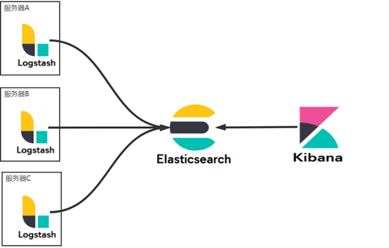
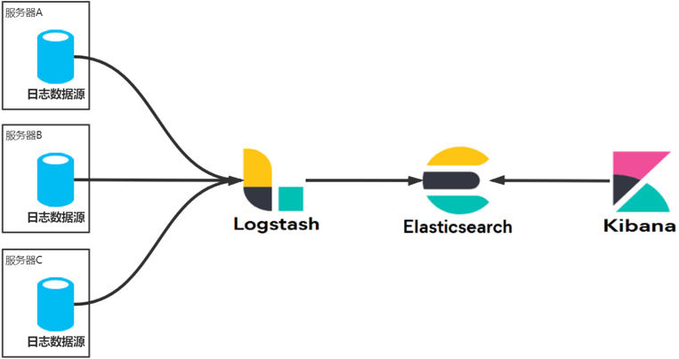
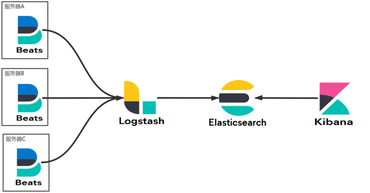
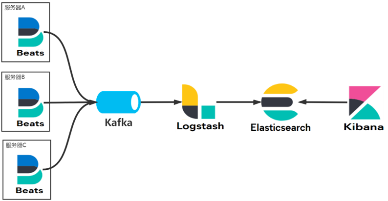

# 其他存储

## MongoDB

文档型非结构化数据库, 可直接存储json文档.

可动态添加新字段, 修改时应用和数据库均无需下线.

并且支持使用JSON Schema来规范数据模式. 在保证模式灵活动态的前提下 , 提供了数据治理能力.

全量存储, 不需要多表形式. 对一个文档进行的是顺序读取, 速度快.

程序API自然 , 开发迅速 , 比如直接插入json字符串 , 通过json字符串查询.

### 高可用

1.采用复制策略保证集群中多个节点数据同步, 支持2-50个集群成员.

> 建议采用3,5,7,9奇数 ,因为mongoDB采用选举策略

2.自恢复: 主从关系, 程序访问主库, 主从同步. 并自身提供了读写分离, 故障转移的功能.

3.多中心容灾能力.

4.滚动服务-最小化服务终端(更新不停用).

5.天然支持分布式(关系型数据库因为表关联, 分布式实现困难),  多分片集群 , 并提供多种数据分布策略.

6.轻松支持TB-PB数量级.

## 列式存储数据库

列式数据库应用在批量处理, 超大规模即使查询场景. 主要有两款产品:HBase和cassandra.

因为硬盘随机读与顺序读性能差异极大 , 在传统机械硬盘(固态硬盘也存在该问题)下 , 对于行式存储:

查询需要对磁道进行旋转 , 而对数据的提取又要回到原始位置重新旋转.

而对于列式存储:

不读取无效数据: 只查询指定列上的数据 且 只返回指定列上的数据 ,磁盘io效率高.

数据压缩比大: 数据相关性大 , 数据压缩比高 , 利用Cache I/O

**列式存储遗留问题**

新增: 多个列族, 并发写磁盘(追加)

更新: 添加一个新版本号的数据(相当于对原始数据复制一份并修改追加到磁盘末尾, 然后赋予一个新版本号)

删除: 添加删除标记 keyType=Delete, 统一对数据进行删除.

### HBase

HBase是建立在HDFS之上的分布式、面向列的数据库,

Hbase是一个稀疏、多维度、排序的映射表，这张表的索引是行键、列族、列限定符和时间戳。

- 每个值是一个未经解释的字符串，没有数据类型。用户在表中存储数据，每一行都有一个可排序的行键和任意多的列。
- 表在水平方向由一个或多个列族组成，一个列族中可以包含任意多个列，同一个列族里面的数据存储在一起。
- 列族支持动态扩展，可以很轻松地添加一个列族或列，无需预先定义列的数量以及类型，所有列均以字符串形式存储，用户需要自行进行数据类型转换。
- HBase中执行更新操作时，并不会删除数据旧的版本，而是生成一个新的版本，旧的版本仍然保留（这是和HDFS只允许追加不允许修改的特性相关的）

名词解释

表：HBase采用表来组织数据，表由行和列组成，列划分为若干列族。

行：每个HBase表都由若干行组成，每个行由行键（row key）来标识。

列族：一个HBase表被分组成许多“列族”（Column Family）的集合，它是基本的访问控制单元。

列限定符：列族里的数据通过限定符（或列）来定位。

单元格：在HBase表中，通过行、列族和列限定符确定一个“单元格”（cell），单元格中存储的数据没有数据类型，总被视为字节数组byte[]

时间戳：每个单元格都保存着同一份数据的多个版本，这些版本采用时间戳进行索引。

实现原理:

主服务器Master负责管理和维护Hbase表的分区信息，维护Region服务器列表，分配Region，负载均衡。

Region服务器负责存储和维护分配给自己的Region，处理来自客户端的读写请求。

客户端并不是直接从Master主服务器上读取数据，而是在获得Region的存储位置信息后，直接从Region服务器上读取数据。

客户端并不依赖Master，而是通过Zookeeper来获取Region位置信息，大多数客户端甚至从来不和Master通信，这种设计方式使得Master负载很小。

## ElasticSearch

Lucene穿了一件json的外套就是ElasticSearch, 相较于Solr, 内置了对分布式集群和分布式索引的管理.

### 原理

ES集群采用多shard多replica方式实现高可用, 集群中会自动选举一个master节点(可以不是数据节点), 负责维护索引元数据、切换primary shard和replica shard身份等. 如果一个非master节点宕机, master会将该宕机节点primary shard对应的replica shard切换为primary, 当宕机的节点恢复后, 不再是primary shard, 而是replica shard.

ES的写请求(任一的协调节点)将根据doc_id(hash)**转发**到对应的primary shard节点上进行写, 然后同步到所有replica shard节点, 待同步完成后, (协调节点)返回响应给客户端;

ES的读请求(任一的协调节点)将根据doc_id(hash), 并根据**随机轮询**策略, 在其primary shard和所有replica shard节点中随机选择一个完成读请求以实现负载均衡, 读请求完成之后返回doc给协调节点, 协调节点再返回给客户端. 若是范围查询需要对所有shard查询, 见深度分页.

ES的写操作先写内存buffer(非段, 无法查找), 同时将数据写入translog日志文件.

每一秒ES将buffer(或满时)中的数据refresh到操作系统文件缓存(段, 可查找), 之后需要等待操作系统fsync到一个新的segment file, 这也是为什么ES为准实时的, 即写入的数据等待1s之内才可以查找到. 也可以手动refresh到操作系统文件缓存.

translog类似redo log, 因为refresh前后数据存在于buffer和操作系统文件缓存都有可能丢失数据, translog可同于重启后数据的恢复. translog也是先经过操作系统文件缓存, 默认情况下每5s fsync到磁盘, 即可能会丢失5s的数据.

> 通过`index.translog.sync_interval` 可控制translog多久fsync到磁盘, 默认5s
> 
> 通过将`index.translog.durability` 设置为request, 让ES在每次更新请求都执行 fsync, 并且ES会等待刷盘完成后才会返回成功; 默认值为async, 即使用异步时间间隔方式刷盘.

当translog大到阈值(async)或默认每隔30分钟(request), 会触发commit操作将buffer的数据强行fsync到segment file.

ES的删除操作会生成.del文件, 将被删除的doc标识为deleted; 更新操作会将document标记为deleted后插入新数据. 因为在buffer每次refresh都会产生一个segement file( 默认情况下1s一个 ), ES会定期进行merge操作, merge的同时会将标识为deleted的doc给物理删除掉.

ES的更新相当于删除+添加.

### 深度分页

若分页查找n页m条数据, ES集群将在所有shard上查询1-n页的所有数据的doc_id(Query阶段); 再到协调节点上进行合并排序处理, 最后返回给客户端(Fetch阶段). 当页数大时会越来越慢, 合并后需要丢弃的数据也越多.

除了限制深度分页以外, 可通过以下两种方式进行深度分页

1.search_after方式使用前一页的结果来帮助检索下一页的数据 : 每次查询把from size变成排序列上一个固定值的条件, 返回常量size个. 不会随着页数增大缓存的数据条数递增.(若排序列不唯一会有问题)

2.scroll以游标的形式进行分页查询 : 仅在每个shard上完成Query阶段, 将结果集doc_id列表缓存, 之后每次来取都根据开始的size取数据集即可. (不适合实时)

### 分词与倒排索引

英文分词容易.

常见的中文分词算法有:

1.Ngram穷举 n=2: 中华|华人|人民|民共|共和|和国

2.语法分析+字典: 按中文动名词分析推测外加分词字典维护 (内网常用)

3.爬虫+大数据+AI分析: 根据语义分析(NLP) , 词频 , 上下文推测筛选 (互联网大厂使用)

正向索引是文本对分词的映射

倒排索引是分词对文本(位置)映射

es中的倒排索引不仅会记录出现的文本 , 还会记录出现的次数,

为了es存储分词的方式有 前缀+相差内容 , 对于数字 存储差值

## 日志收集

### 从ELK到KEFK过程

**EKL三剑客**

LogStash - 捡破烂的 : 集中 转换 存储数据.

ElasticSearch - 算数的 : 统计 分析 查询数据

Kibana - 给人看的 : 可视化数据展示

**方案1:标准ELK**

每一台应用服务器上安装部署Logstash , 收集日志处理发送给ES集群统计分析给kibana加载.

优点：同一家公司开发, 集成度好 , 部署最简单组件使用最少.

缺点：由于 Logstash 同时兼顾了收集和解析的工作所以比较耗 CPU 和 内存资源，只适合服务器资源丰富的场景，否则容易容易造成性能下降甚至影响应用本身的正常工作.

**方案2：TCP推送**

使用Logback收集日志, 通过插件`LogstashTcpSocketAppender` 经TCP连接将日志发送给Logstash

优点：对比架构一各个应用服务器不需要额外部署其他组件(Logback仅收集发送)，减少了应用服务器的负载压力。

缺点：基于SDK开发，有代码入侵使应用与 Logstash 耦合了不易扩展。

> Logstash还能起到限流缓冲的作用, 避免同时落入es的数据量过多

**方案3：EFK**

将Logback替换为ELK公司开发的FileBeat组件, FileBeat是轻量级日志收集器, 通过**监听日志文件**, 收集并发送(像flume?).

优点：基于文件监听, 代码无入侵并且对应用服务器的资源占用少，是目前最常用的互联网应用日志架构

缺点：日志数据共享困难，FileBeat 只能配置一个 output 源

**方案4：KEFK**

加入kafka消息队列作为数据中转站, 其他组件只要订阅了kafka就能实现数据分发

优点：性能最好，而且消息队列易于共享数据

缺点：组件最多，维护成本大

## Hadoop

### MapReduce

计算, 包括两个阶段:

Map:并行处理输入数据

Reduce: 对Map结果汇总

### HDFS

一种分布式文件管理系统, 通过目录树定位文件.

适合一次写入多次读取的场景.

具有高容错性: 数据自动保存多个副本, 当一个副本丢失, 会自动恢复.

NameNode负责管理HDFS名称空间, 配置副本策略, 处理客户端请求到数据块的映射.

DataNode存储实际的数据块, 负责执行数据库的读写操作.

当客户端进行文件上传的时候, 会切分成一个个Block进行上传, 从NameNode获取文件位置, 最后交给DataNode执行写.

> HDFS(2.x)文件块Block默认大小为128M

缺点: 较高的延时; **无法高效存储大量小文件**(占用大量NameNode内存来存储文件元数据信息); 不支持并发写入(只能写一个文件)与文件随机修改(只能追加).
