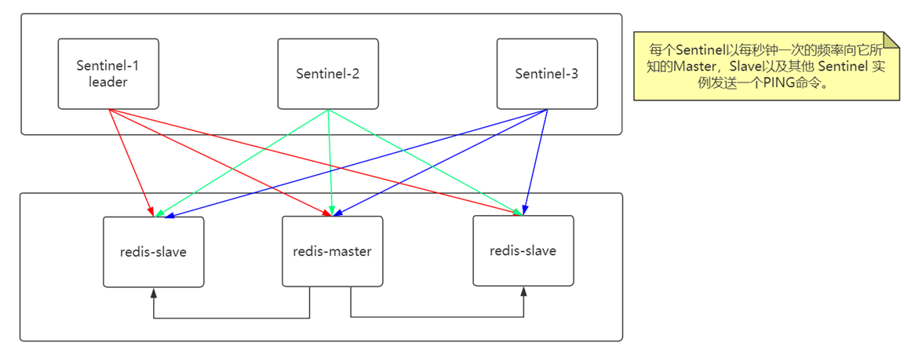

# Redis

> Redis一直都是多线程程序, 只是只有一个线程来执行用户命令, 其他线程执行后台任务. 即使6.0以后, 也仅增加了多线程的I/O读写.

Redis服务器所有数据库再redis.h的redisServer结构中, 每个数据库db为一个redis.h的redisDB结构:

```
struct redisServer{
	// ...
	redisDB *db;	//	数组, 指向所有数据库
	int dbnum;		// 	数据库数量
	//...
}

typedef struct redisDB{
	// ...
	dict *dict;		//	所有键值对,见数据类型
	//...
}redisDB;
```

**客户端**

Redis服务器为每个连接的客户端建立一个redis.h/redisClient结构, 保存客户端当前的状态信息, 如客户端的socket描述符, 客户端名字, 正在使用的数据库指针, 要执行的命令等, 输入输出缓冲区等:

```
struct redisServer{
	list *client; //链表,保存所以客户端状态
}
```

具体见《Redis设计与实现 13》

>  redis客户端通过对管道中的指令序列改变读写顺序减少I/O来回次数(因为read操作为主要IO耗时, 所以read操作等待一个网络来回开销), 大幅节省了IO时间. 具体见《Redis深度历险》- 管道

**服务器**

以一个客户端与服务器的命令执行流程为例:

1.客户端向服务器发送命令set key value

```
客户端将命令转换成协议格式, 通过连接到服务器的socket发送给服务器
```

2.服务器接收并处理客户端发来的命令请求set key value, 在数据库中进行操作, 并产生命令回复OK.

```
因为客户端对socket进行了写入, 所以对于服务端, socket变为readable, 将调用命令请求处理器执行以下操作:
① 读取socket中协议格式的命令请求, 保存到客户端状态的输入缓冲区中(就是一个sds);
② 对输入缓冲区中的命令进行分析, 提取出命令请求中的命令参数以及参数个数分别保存到客户端状态的argv(set key value一共三个参数)和argc属性里.
③ 调用命令执行器, 执行客户端指定的命令
```

3.服务器将命令回复OK发送给客户端

```
上一个步骤执行的命令实现函数会将命令的回复保存到客户端的输出缓冲区中, 并为客户端socket关联回复处理器, 当socket变为writable, 将调用命令回复处理器将缓冲区的命令回复发送给客户端, 发送完毕后回复处理器清空客户端状态的输出缓冲区
```

4.客户端接收服务器返回的命令回复OK, 并打印.

```
客户端接收到协议格式的命令回复后, 进行转换
```

**命令执行器**

在Redis服务器调用了命令执行器之后, 命令执行器的流程为:

1.查找命令实现

```
根据客户端状态的argv[0]参数, 在命令表中查找并保存到客户端状态的cmd属性里.
命令表为一个字典, 键为命令名字, 值为一个redisCommand结构, 用于记录一个命令的实现信息:
struct redisCommand{
	char* name; // 命令的名字
	redisCommandProc* proc; // 指向命令的实现函数
	int arity; //命令的参数个数
	char *sflags;	// 标识,记录命令的属性, 字符串形式
	int flags;	// sflags的二进制分析结构,自动生成, 服务器实际检验的是flags而不是sflags, 因为二进制检查通过&^~更方便
	long long calls; //服务器总共执行了多少次该命令
	long long milliseconds; //服务器执行该命令总耗时
	//...
}
```

2.执行预备操作

```
为了确保命令正确顺利执行, 服务器需要:
① 检查客户端状态的cmd指针是否为null, 是则下一步, 否则返回错误;
② 根据cmd指向的redisCommand结构的arity属性检查命令参数个数是否正确, 是则下一步, 否则返回错误;
③ 检查客户端是否通过身份验证, 未通过身份验证的客户端只能执行AUTH命令, 通过则下一步, 否则返回错误;
④ 如果服务器开启了maxmemory功能, 则检查服务器的内存是否需要回收, 以保证命令可以顺利执行. 如没开启或内存无须回收则下一步, 否则返回错误;
⑤ 如果服务器上次执行BGSAVE出错并且服务器打开了stop-writes-on-bgsave-error功能, 且将执行的命令为写命令, 则返回错误, 否则下一步;
⑥ 如果客户端当前正在用SUBSCRIBE命令订阅频道或PSUBSCRIBE命令订阅模式, 则只允许执行SUBSCRIBE、PSUBSCRIBE、UNSUBSCRIBE、PUNSUBSCRIBE命令, 其他命令拒绝;
⑦ 如果服务器正在进行数据载入, 则客户端发送的命令必须带有l标识(redisCommand的flags属性), 如INFO、SHUTDOWN、PUBLISH等才会执行, 否则拒绝;
⑧ 如果服务器因执行lua脚本超时并阻塞, 则只执行SHUTDOWN NOSAVE和SCRIPT KILL命令, 其他命令拒绝;
⑨ 如果客户端正在执行事务, 则只执行EXEC、DISCARD、MULTI、WATCH命令, 其他命令放入事务队列;
⑩ 如果服务器打开了监视器功能, 则将要执行的命令和参数等信息发送给监视器.
```

> 在集群模式下, 预备工作更多

3.调用命令的实现函数

```
// 执行以下语句即执行命令
client->cmd->proc(client)
// 实际参数已保存在client的argv中.
```

4.执行后续工作

```
① 如果服务器开启了慢查询日志, 则为刚执行的命令进行检查, 如果需要则添加一条日志;
② 根据命令执行时长, 更新redisCommand结构的milliseconds和calls计数器加一;
③ 如果服务器开启了AOF持久化, 则写入AOF缓冲区;
④ 如果有其他从服务器正在复制当前服务器,则将刚刚执行的命令传播给所有从服务器
```

**比较**

像 MySQL 这类的数据库的 QPS 大概都在 1w 左右（4 核 8g）, Redis虽然是单进程单线程模型，但是读写性能非常优异，单机可支持10wQPS，原因主要有以下几点：

1. 纯内存操作，避免了与磁盘的交互
2. 用全局hash table作为键空间，查找任意的key只需O(1)
3. 单线程，天生的队列模式，避免了因多线程竞争而导致的上下文切换和抢锁的开销
4. 事件机制，Redis服务器将所有处理的任务分为两类事件，一类是采用**I/O多路复用**处理客户端请求的网络事件；一类是处理定时任务的时间事件，包括更新统计信息、清理过期键、持久化(如更新save条件的serverCron函数)、主从同步等；

**分布式缓存的选择**

相比Memcached , redis优点:

Redis 支持更丰富的数据类型;

Redis 支持数据的持久化，可以将内存中的数据保持在磁盘中，重启的时候可以再次加载进行使用(也可以容灾),而 Memecache 把数据全部存在内存之中。

Redis 在服务器内存使用完之后，可以将不用的数据放到磁盘上。Memcached 在服务器内存使用完之后，就会直接报异常。

Memcached 没有原生的集群模式，需要依靠客户端来实现往集群中分片写入数据；但是 Redis 目前是原生支持 cluster 模式的。

Memcached 是多线程，非阻塞 IO 复用的网络模型；Redis 使用单线程的多路 IO 复用模型。 （Redis 6.0 引入了多线程 IO ）

Redis 支持发布订阅模型、Lua 脚本、事务等功能，而 Memcached 不支持。并且，Redis 支持更多的编程语言。

Memcached 过期数据的删除策略只用了惰性删除，而 Redis 同时使用了惰性删除与定期删除。

## 数据类型

redisObject通过encoding属性设置对象所使用的编码，type属性设置对象类型,  而不是为特定类型的对象关联一种固定的编码， 极大地提升了 Redis 的灵活性和效率.

执行命令前, Redis会先检查该key的值对象是否为执行命令锁需的类型, 如果是, 还会根据该key的值对象的编码来选择正确的命令实现(命令多态) 

```
typedef struct RedisObject {
 int4 type; // 4bits
 int4 encoding; // 4bits
 int24 lru; // 24bits
 int32 refcount; // 4bytes 
 void *ptr; // 8bytes，64-bit system
} robj;
```

**1.String**

> Redis键也是SDS

虽然 Redis 是用 C 语言写的，但并没有使用 C 的字符串表示，而是自己构建了一种 **简单动态字符串SDS**。

其数据结构为带容量和长度的**字节**数组(可以存储二进制数据->位数组)的结构体.

```
struct sdshdr{
	int len;//已使用的字节数
	int free;//未使用的字节数
	char buf[];//字节数组,保存字符串
};
```

SDS 遵循 C 字符串以空字符结尾的惯例是为了兼容部分C字符串函数, 但实际上SDS是使用len属性而不是空字符来判断字符串是否结束. 

> C语言通过遍历到结尾符获取字符串长度使用strlen函数, 复杂度O(n), 这对于单线程redis无法接受.

SDS是可以修改的字符串，内部结构实现上类似于 Java 的 ArrayList，采用预分配冗余空间的方式来减少内存的频繁分配, 避免C字符串API存在的溢出问题(SDS追加时先判断free空间是否足够)

如果是整数, 则使用int编码; 当Redis字符串的长度小于等于44时, 使用embstr编码; 当字符串长度超过44时, 使用raw编码存储. 因为内存分配器最多分配64字节空间, redisObject固定占用16字节, SDS固定属性占用3字节, 字符串结尾符占用1字节, 还剩下最多64-20=44字节, 超过44则为大字符串, 需要采用raw形式.

embstr与raw的区别为: embstr将 RedisObject 和 SDS 对 象连续存在一起，使用 malloc 方法一次分配。而 raw 存储形式不一样，它需要两次 malloc，两个对象结构在内存地址上一般是不连续的。

> 对于浮点数, redis会转换为字符串存储, 但计算时还是对浮点数操作, 如INCRBYFLOAT

> int和embstr编码在特定条件下回转换为raw, 另外embstr为只读不支持修改, 如果要修改embstr编码的字符串, 需要转换为raw

每次追加字符串前通过free属性判断是否需要扩容, 杜绝c字符串的缓冲区溢出问题.

扩容策略为: 在字符串长度小于1M之前, 扩容空间采用加倍策略, 即保留100%的冗余空间; 当超过1M之后, 为避免加倍后的冗余空间过大导致浪费, 每次扩容只会多分配1M的空间. (扩容必定N次变为了最多N次)

应用场景： 一般常用在需要计数的场景，比如用户的访问次数、热点文章的点赞转发数量等等。

相关命令: `set,get,strlen,exists,decr,incr,setex,setnx`

> Redis 中除了字符串类型有自己独有设置过期时间的命令 `setex` 外，其他方法都需要依靠 `expire` 命令来设置过期时间 。另外， `persist` 命令可以移除一个键的过期时间。

> 可通过object encoding key 查看该value的数据结构

**2.List**

类采用ziplist或linkedlist(双端队列)实现, 为优化存储和减少内存碎片,  后续版本被quicklist替换(ziplist和linkedlist的结合体)). 

linkedlist为一个双端队列, 默认情况下, 当list对象中所有字符串元素的长度都小于64字节且元素个数小于512时, 会采用ziplist编码, 可通过配置文件改变上限值.

ziplist有一个zltail属性记录尾结点偏移量, 每个节点通过previous_entry_length记录前一个节点的长度结合zltail来支持反向遍历, 每个节点通过encoding记录节点的content属性所保存的数据类型(字节数组或整数类型)以及长度.

> 因为前一节点长度小于254时previous_entry_length需要1字节记录, 大于等于254时previous_entry_length需要5字节记录, 所以ziplist在添加和删除元素时若存在多个连续长度介于250-253字节的节点将会导致连锁更新

应用场景:  发布与订阅或者说**异步消息队列**, 比如微博、朋友圈和公众号消息流(lpush)、慢查询。

> 将需要延后处理的任务结构体序列化成字符串塞进 Redis 的列表，另一个线程从这个列表中轮询数据进行处理。

相关命令: `rpush,lpop,lpush,rpop,lrange,llen,brpop(阻塞队列)`

其他慢操作命令:` lindex(通过索引获取值),ltrim(范围截取) `

> list存在索引, 正向索引从0开始, 反向索引从-1开始

**3.Hash**

hash 类似于 JDK1.8 前的 HashMap(数组 + 链表)。包括hashtable(字典)和ziplist两种实现.

字典dict采用渐进式rehash, 包含两个hash表指针,  在 rehash 的同时，保留新旧两个 hash 结构，查询时会同时查询两个 hash 结构，然后在后续的定时任务中以及 hash 的子指令中，循序渐进地将旧 hash 的内容 一点点迁移到新的 hash 结构中。

当hash对象中键值对的键和值字符串长度都小于64字节且键值对数量小于512个时, redis会采用ziplist实现hash.可通过配置文件改变上限值. 

ziplist插入键值对时先推入key到ziplist末尾, 再推入value到ziplist末尾. 因此同一键值对紧挨存储, 后添加的键值对放在尾部/

应用场景: 系统中对象数据的存储, 如电商购物车(用户id为key, 商品id为field, 商品数量为value)。

相关命令:`hset,hmset,hexists,hget,hgetall,hkeys,hvals`

> 同string一样, hash 结构中的单个子 key 也可以进行计数，它对应的指令是 hincrby， 和 incr 使用基本一样。

> 如何权衡string与hash?

**4.set**

类似 Java 中的 `HashSet` 。通过intse(如果只有整数且元素不超过512个)t或hashtable(值为null)实现.

intset可以通过判断新加入的元素长度动态扩展每个元素的空间: content数组为int8_t类型, encoding支持int16_t,int32_t和int64_t编码改变每个元素在content数组中的字节数, 只可升级不可降级.

应用场景:需要存放的数据不能重复以及需要获取多个数据源交集(将用户关注存到set,利用sinterstore实现共同关注)和并集等场景. 比如抽奖(srandmember key [count]/spop key [count] 随机抽取count个)、 点赞(可通过交集显示共同好友).

相关命令:`sadd,spop,smembers,sismember,scard,sinterstore,sunion`

**5.sorted set** 

增加了一个权重参数 score，元素按 score 排列，还可以通过 score 的范围来获取元素的列表。有ziplist和skiplist两种实现.

> 在zset元素个数小于128个且元素长度小于64字节时使用ziplist编码, 可修改

ziplist对每个zset元素紧挨存储, 元素存储在前面, 权重存储在后面, 集合元素按权重从小到大排序.

skiplist中每个节点通过链表连接, 并包含一个后退指针指向前面一个节点以支持反向遍历, 但不能跳跃.  每一层的跳表节点包含一个跨度值记录两个节点之间的记录, 将查询某个节点时的对沿途跨度进行累加用于score rank实现. 

另外, 为了提高查询效率, skiplist增加了从元素到分值的映射字典.

相关命令:`zadd,zcard,zscore,zrange,zrangebyscore,zrem`

应用场景:需要对数据根据某个权重进行排序的场景。比如在直播系统中，实时排行信息包含直播间在线用户列表，各种礼物排行榜，弹幕消息（可以理解为按消息维度的消息排行榜）等信息.

```
> zadd myZset 3.0 value1 2.0 value2 1.0 value3  #插入值和其权重
(integer) 3
> zcard myZset 									#查看元素数量
(integer) 3
> zscore myZset value1 							#查看某个值的权重
"3"
> zrange  myZset 0 -1         #顺序输出某个范围区间的元素，0 -1 表示输出所有元素
1) "value3"
2) "value2"
3) "value1"
> zrevrange  myZset 0 1 						#逆序输出
1) "value1"
2) "value2"
```

**6.bitmap**

 bitmap 存储的是连续的二进制数字（0 和 1），通过 bitmap, 只需要一个 bit 位来表示某个元素对应的值或者状态，key 就是对应元素本身 。

相关命令:`setbit,getbit,bitcount,bitop` 

```
# bitop 对一个或多个保存二进制位的字符串 key 进行位元操作，并将结果保存到 destkey 上。
# 支持 AND 、 OR 、 NOT 、 XOR 这四种操作中的任意一种参数
BITOP operation destkey key [key ...]
```

应用场景: 适合需要保存状态信息（比如是否签到、是否登录...）并需要进一步对这些信息进行分析的场景。比如用户签到情况、活跃用户情况、用户行为统计（比如是否点赞过某个视频）。

```
# setbit 会返回之前位的值（默认是 0）
> setbit mykey 7 1
(integer) 0
> bitcount mykey  #统计被被设置为 1 的位的数量
(integer) 1

#使用场景一：用户行为分析 很多网站为了分析你的喜好，需要研究你点赞过的内容。
# 记录你喜欢过 001 号小姐姐
127.0.0.1:6379> setbit beauty_girl_001 uid 1

#使用场景二：统计活跃用户
# 使用时间作为 redis key，然后用户ID为map key，如果当日活跃过就设1(暂且约定，统计时间内只要有一天在线就称为活跃)
127.0.0.1:6379> setbit 20210308 1 1
(integer) 0
127.0.0.1:6379> setbit 20210308 2 1
(integer) 0
127.0.0.1:6379> setbit 20210309 1 1
(integer) 0
//统计两天都活跃的人
127.0.0.1:6379> bitop and desk1 20210308 20210309
(integer) 1
127.0.0.1:6379> bitcount desk1
(integer) 1
//统计两天内活跃了的人
127.0.0.1:6379> bitop or desk2 20210308 20210309
(integer) 1
127.0.0.1:6379> bitcount desk2
(integer) 2
```

## 持久化

**Redis 的持久化方式有快照（snapshotting，RDB），和只追加文件（append-only file, AOF）**。

### RDB

RDB快照持久化是 Redis 默认采用的持久化方式，在 Redis.conf 配置文件中默认有此下配置：

```
save 900 1           #在900秒(15分钟)之后，如果至少有1个key发生变化，Redis就会自动触发BGSAVE命令创建快照。
save 300 10          #在300秒(5分钟)之后，如果至少有10个key发生变化，Redis就会自动触发BGSAVE命令创建快照。
save 60 10000        #在60秒(1分钟)之后，如果至少有10000个key发生变化，Redis就会自动触发BGSAVE命令创建快照
```

Redis服务器会根据save选项设置redisServer结构中的saveparams属性, 并且还提供dirty和lastsave属性分别记录距离上一次成功执行SAVE或BGSAVE后服务器进行了多少次修改 和 上一次执行的时间

```
struct redisServer{
	//...
	struct saveparam *saveparams; // save条件数组
	long long dirty;	// 计数器
	time_t lastsave;	// 上一次执行保存的时间
	//...
}
struct saveparam{
	time_t seconds;	// 秒数
	int changes;	// 修改数
}
```

如上面配置的情况下, saveparams数组为:

[{seconds:900,changes:1},{seconds:300,changes:10},{seconds:60,changes:10000}]

Redis服务器中的周期性操作函数serverCron默认每隔100ms执行一次检查save条件是否满足, 遍历saveparams数组所有条件, 任一满足则执行.

**触发机制**

1、save的条件满足的情况下

2、执行save, flushall 命令

3、退出redis

**恢复rdb文件** 

1、只需要将rdb文件放在我们redis启动目录就可以，redis启动的时候会自动检查dump.rdb 恢复其中的数据(阻塞载入)

**特点**

1、适合大规模的数据恢复 

2、对数据的完整性要不高. 如果redis意外宕机了，只能保留到最后一个的save的地方, 可能会丢失大量数据。

> Redis生成RDB文件有两个命令:
>
> 1.SAVE: 由服务器进程执行保存工作(会阻塞服务器)
>
> 2.BGSAVE:由子进程执行保存工作

通过创建快照来获得存储在内存里面的数据在某个时间点上的副本(全量), 是内存数据的**二进制**序列化形式，在存储上非常**紧凑**。

Redis定时自动保存会通过BGSAVE命令单独创建（fork）一个子进程来进行持久化，会先将数据写入到一个临时文件中，待持久化过程都结束了，再用这个临时文件替换上次持久化好的文件。整个过程中，主进程是不进行任何IO操作的。(写时复制思想?)

rdb保存的文件是dump.rdb, 一个完整RDB文件包含五个部分:

1.REDIS: 文件的开头, 是常量, 用于标识RDB文件, 5字节, 保存二进制的"REDIS"五个字符 

2.db_version: 文件的版本号, 4字节, 是一个字符串表示的整数

3.databases: 各个数据库中的键值对数据. 如果各个数据库没有内容, 则为空.

> databases部分中每个非空数据库又分为三个部分:
>
> 1.SELECTDB: 常量, 表示接下来的内容为数据库号码, 1字节
>
> 2.db_number: 数据库号码, 1/2/5字节, 服务器读入该部分后, 会调用SELECT命令切换数据库
>
> 3.key_value_pairs: 数据库中所有键值对数据, 如果key存在过期时间, 也会一同保存.
>
> 在不带过期时间下key_value_pairs由三部分组成:
>
> TYPE, key和value, 其中TYPE表示value的类型, 1字节. 
>
> 服务器读入rdb键值对时会根据TYPE来解析value.
>
> 如果带过期时间, 会在头部增加EXPIREIMTE_MS和ms. 前者标识接下来的内容为过期时间, 1字节; ms为8字节带符号整数, 毫秒UNIX时间戳, 为键值对的过期时间.
>
> 具体的不同类型value结构见《Redis设计与实现》

4.EOF: 常量, 标识文件正文内容(所有数据库的键值对)的结束, 1字节.

5.check_sum: 前面四部分计算后的校验和, 是8字节无符号整数. 务器在载入 RDB 文件时， 会将载入数据所计算出的校验和与 `check_sum` 所记录的校验和进行对比， 以此来检查 RDB 文件是否有出错或者损坏的情况出现。

> 可在Redis服务器执行flushall或save命令, 然后再执行od -c dump.rdb文件验证文件基本结构


### AOF

AOF持久化的实时性更好，因此已成为主流的持久化方案。默认情况下 Redis 没有开启 AOF（append only file）方式的持久化，可以通过 appendonly 参数开启：

```
appendonly yes
```

`AOF`以日志的形式来记录每个写操作，将Redis执行过的所有指令记录下来（读操作不记录），只许追加文件，但不可以改写文件。

> aof文件为纯文本格式, 可直接打开查看, 读者还可以看到如果执行修改操作命令前没有选择数据库, redis会自动添加一条SELECT 0命令.

aof保存的是 appendonly.aof 文件

AOF持久化功能分为三个阶段:

1.命令追加

如果一个事件循环中执行了写命令，Redis 就会将该命令写入到**内存缓存** `server.aof_buf` 中(redis单线程串行写入)，

```
struct redisServer{
	//...
	sdf aof_buf; 	//	aof缓冲区
	//...
}
```

然后再根据 `appendfsync` 配置来决定何时将其同步到硬盘中的 AOF 文件(fsync命令, 独立线程**异步**刷回, 真正的磁盘IO, 耗时!)。

> Redis服务器进程就是一个事件循环, 伪代码如下:
>
> ```
> def eventLoop():
>  while True:
>      # 处理文件事件，接收命令请求以及发送命令回复
>      # 处理命令请求时可能会有新内容被追加到 aof_buf 缓冲区中
>      processFileEvents()
>      # 处理时间事件
>      processTimeEvents()
>      # 考虑是否要将 aof_buf 中的内容写入和保存到 AOF 文件里面, 由appdendfsync选项决定
>      flushAppendOnlyFile()
> ```
>
> 

在 Redis 的配置文件中存在三种不同的 AOF 持久化方式，它们分别是：

```text
appendfsync always    #每个事件循环都会同步AOF文件,这样会严重降低Redis的速度
appendfsync everysec  #每个事件循环判断距离上次同步aof文件是否超过1s, 如果是, 则同步AOF文件
appendfsync no        #让操作系统决定何时进行同步
```

AOF 日志在长期的运行过程中会变的无比庞大，数据库**重启时(空的redis实例)需要加载 AOF 日志进行指令重放(顺序执行所有指令)**，这个时间就会无比漫长。 所以需要定期进行 AOF 重写，给 AOF 日志进行瘦身。

> AOF重写(瘦身):  bgrewriteaof 指令
>
> 其原理为**开辟一个子进程**对内存进行遍历转换成一系列 Redis 的操作指令，序列化到一个新的 AOF 日志文件中。 序列化完毕后再将操作期间发生的**增量 AOF 日志**(先写到AOF重写缓冲区)追加到这个新的 AOF 日志文件中，追加完毕后就立即原子覆盖旧的 AOF 文件。(减少冗余命令)

**Redis4.0混合持久化**

因为rdb重放会丢失大量数据, aof重放性能较慢, 所以引入了混合持久化, 将rdb和aof文件存在一起, 此时的aof日志不再是全量的追加日志, 而是rdb持久化开始到结束这段时间的追加日志(通常这部分aof日志很小).

当Redis 重启的时候先加载 rdb 的内容，再重放增量 AOF 日志就可以完全替代之前的 AOF 全量文件重放，重启效率因此大幅得到提升。

## 事件

Redis服务器为一个事件驱动程序, 分为文件事件与时间事件, 在一个事件处理循环函数中获取与处理.

> 单线程事件机制也是有缺陷的，所有的事件都是串行执行，一旦某个事件比较重就会阻塞其它事件，从而导致整个系统的吞吐率下降。比如某个客户端执行了一个比较重的lua函数、或者使用了诸如keys*、zrange(0,-1)、hgetall等全集合扫描的操作，又或者删除的过期键是个big key，又或者使用了较多内存的redis实例进行bgsave时，都会导致服务器一定程度的阻塞，一般伴随会有相应的慢日志。所以我们在实际使用redis的过程中，必须要给每一次的操作分配合理的时间片。

### 文件事件

Redis服务器通过socket与client连接, 文件事件就是服务器对socket操作的抽象: 服务器与客户端通信产生对应的文件事件, 服务器通过监听并处理这些时间完成网络通信操作.

文件事件由**基于Reactor模式的文件事件处理器**处理, 其由socket、 I/O多路复用程序、文件事件分发器 和 文件处理器 组成.

文件事件处理器使用I/O多路复用程序同时监听多个socker, 并根据socker目前执行的任务来经由文件事件分发器为socket关联不同的事件处理器(如accept、read、write、close等)来处理(在事件处理循环中).

> 多个事务处理器并不意味着redis会并行处理事件, I/O多路复用器会将所有事件的socker放到一个队列里面通过分发器发送. 只有当上一个socket产生的事件被处理完之后, 即该socket所关联的事件处理器执行完毕后, I/O多路复用程序才会继续向分发器传送下一个socket

**I/O多路复用器**

Redis通过分别对select、epoll、evport、kqueue等I/O多路复用函数库进行包装实现了多种I/O多路复用器, 对外提供响应API, 程序会在编译时自动选择(使用#include宏定义规则)系统中性能最高的库来使用.

**事件类型**

1.ae.h/AE_READABLE事件: 当socket可读(即客户端执行write或close操作)、新的可应答的socket出现(客户端对服务器监听connect操作)时产生;

2.ae.h/AE_WRITABLE事件: 当socket变为可写(即客户端执行read操作)时产生.

如果一个socket同时产生两种事件, 分发器会优先处理AE_READABLE事件

> 记住客户端与服务器同时对socket的操作正好相反

具体的事件处理器函数实现见《Redis设计与实现12.1.5》

### 时间事件

Redis服务器中的一些操作(如serverCron函数)需要在给定的时间点执行, 而时间事件就是服务器对这类定时操作的抽象.

时间事件分为定时事件(指定时间之后执行一次)与周期性事件(每隔指定事件执行一次)

每个时间事件由三个属性组成:

- id: 全局唯一标识号, 从小到大递增
- when: unix时间戳, 记录时间事件到达的时间
- timeProc: 时间事件处理器, 是一个函数. 当时间事件到达时调用.

一个时间事件是定时事件还是周期性事件取决于时间事件处理器的返回值, 如果返回ae.h/AE_NOMORE, 则为定时事件, 到达一次后进行删除; 如果返回非AE_NOMRE的整数值,  则为周期性事件, 返回的整数值代表周期性间隔, 用它来对when进行更新, 使之可再到达.

Redis服务器将所有时间事件存放在一个链表中(新时间事件从表头插入, when无序, id降序), 每当时间事件执行器运行时, 遍历链表查找到达的时间事件并调用对应的事件处理器(因为when无序, 所以需要遍历).

> 通常redis服务器只使用serverCron一个时间事件, 无序链表退化成指针, 不影响执行的性能

**serverCron**

用于对Redis服务器资源与状态进行检查与调整, 保证服务器长期文档运行. 其工作包括:

1.更新服务器的各类统计信息，比如时间、内存占用、数据库占用情况等。
2.清理数据库中的过期键值对。
3.关闭和清理连接失效的客户端。
4.尝试进行 AOF 或 RDB 持久化操作。
5.如果服务器是主服务器，那么对从服务器进行定期同步。
6.如果处于集群模式，对集群进行定期同步和连接测试。

默认情况下serverCron每100ms运行一次, 可通过hz选项调整.

> 因为事件的调度和执行,在一个时间处理循环中时间事件总是在文件事件后面处理(不存在抢占), 以及redis串行处理的原因, 所以时间事件的实际处理时间通常比到达时间稍晚

## 过期删除

**过期时间保存**

Redis 通过一个叫做过期字典（可以看作是 hash 表）来保存数据过期的时间。过期字典的键指向 Redis 数据库中的某个 key(键)，过期字典的值是一个 long long 类型的整数，这个整数保存了 key 所指向的数据库键的过期时间（毫秒精度的 UNIX 时间戳）。

过期字典是存储在 redisDb 这个结构里的：

```c
typedef struct redisDb {
    dict *dict;     //数据库键空间,保存着数据库中所有键值对
    dict *expires   //过期字典,保存着键的过期时间
    ...
} redisDb;
```

**过期数据删除策略**

**惰性删除** ：只会在取出 key 的时候才对数据进行过期检查。这样对 CPU 最友好，但是可能会造成太多过期 key 没有被删除。

**定期删除** ： 每隔一段时间抽取一批 key 执行删除过期 key 操作。并且，Redis 底层会通过限制删除操作执行的时长和频率来减少删除操作对 CPU 时间的影响。

定期删除对内存更加友好，惰性删除对 CPU 更加友好。两者各有千秋，所以 Redis 采用的是 **定期删除+惰性/懒汉式删除** 。

> redis的删除操作采用的是异步内存回收, 主线程将key从字典中摘除后, 将这个key的内存回收操作包装成一个任务塞进异步队列中后台清理.

但是，仅仅通过给 key 设置过期时间还是有问题的。因为还是可能存在定期删除和惰性删除漏掉了很多过期 key 的情况。这样就导致大量过期 key 堆积在内存里，然后就 Out of memory 了。 所以有了**内存淘汰机制**

> 如果同时有大量key过期的话，极可能导致主线程阻塞。一般可以通过做散列来优化处理。

## 内存淘汰

内存淘汰为当redis执行写操作时, 如果内存超出maxmemory就会执行一次内存淘汰算法.

https://redis.io/topics/lru-cache

Redis 提供 6 种数据淘汰策略：

1. **volatile-lru（least recently used）**：从已设置过期时间的数据集（server.db[i].expires）中挑选最近最少使用的数据淘汰
2. **volatile-ttl**：从已设置过期时间的数据集（server.db[i].expires）中挑选将要过期的数据淘汰
3. **volatile-random**：从已设置过期时间的数据集（server.db[i].expires）中任意选择数据淘汰
4. **allkeys-lru（least recently used）**：当内存不足以容纳新写入数据时，在键空间中，移除最近最少使用的 key（这个是最常用的）
5. **allkeys-random**：从数据集（server.db[i].dict）中任意选择数据淘汰
6. **no-eviction**：禁止驱逐数据，也就是说当内存不足以容纳新写入数据时，新写入操作会报错。这个应该没人使用吧！

4.0 版本后增加以下两种：

1. **volatile-lfu（least frequently used）**：从已设置过期时间的数据集（server.db[i].expires）中挑选最不经常使用的数据淘汰
2. **allkeys-lfu（least frequently used）**：当内存不足以容纳新写入数据时，在键空间中，移除最不经常使用的 key

> 如果redis服务器内存分配不足, 可能会导致热点数据覆盖度不足, 频繁触发LRU清除, 导致缓存穿透, 这样通常可通过扩大redis服务内存或更换key存储结构实现以提高QPS

### LRU

近似LRU:

在严格LRU下,  假设Redis当前有50W规模的key，先通过Keys 遍历获得所有Key，然后比对出空闲时间最长的某个key，最后执行淘汰,  非常耗时

在Redis中它采用了近似LRU的实现，它随机采样5个(可设置)Key，淘汰掉其中空闲时间最长的那个。近似LRU实现起来更简单、成本更低，在效果上接近严格LRU。它的缺点是存在一定的几率淘汰掉最近被访问的Key

> 样本数越多效果越接近严格LRU, 代价为一些额外的CPU开销
>
> Redis3.0使用10样本非常接近严格LRU

RedisObject的lru属性记录了对象最后一次被命令程序访问的时间, OBJECT IDLETIME 命令可以打印出给定键的空转时长， 空转时长就是通过将当前时间减去键的值对象的 `lru` 时间.  

> OBJECT IDLETIME 命令访问对象时不会修改lru属性.

**LRU简单代码**

```
//注意, Node需要保存key, 用于删除时
class Node {
	public int key, val;
	public Node next, prev;
	public Node(int k, int v) {
		this.key = k;
		this.val = v;
	}
}

class LRUCache {
	private HashMap<Integer, Node> map;
	private Queue<Node> cache;
	private int cap;
	public LRUCache(int capacity) {
		this.cap = capacity;
		map = new HashMap<>();
		cache = new LinkedList<>();
	}
	public int get(int key) {
		if (!map.containsKey(key))
			return -1;
		int val = map.get(key).val;
		// 利⽤ put ⽅法把该数据提前
		put(key, val);
		return val;
	}
	public void put(int key, int val) {
		// 先把新节点 x 做出来
		Node x = new Node(key, val);
		if (map.containsKey(key)) {
			// 删除旧的节点，新的插到头部
			cache.remove(map.get(key));
			cache.addFirst(x);
			// 更新 map 中对应的数据
			map.put(key, x);
		} else {
			if (cap == cache.size()) {
				// 删除链表最后⼀个数据
				Node last = cache.removeLast();
				map.remove(last.key);
			}
			// 直接添加到头部
			cache.addFirst(x);
			map.put(key, x);
		}
	}
}
```


## 缓存穿透

指请求缓存和数据库中都没有的数据

解决方案:

**1）缓存null值**

如果缓存和数据库都查不到某个 key 的数据就写一个到 Redis 中去并设置过期时间.

这种方式可以解决请求的 key 变化不频繁的情况，如果黑客恶意攻击，每次构建不同的请求 key，会导致 Redis 中缓存大量无效的 key 。很明显，这种方案并不能从根本上解决此问题。如果非要用这种方式来解决穿透问题的话，尽量将无效的 key 的过期时间设置短一点比如 1 分钟。

**2）布隆过滤器**

把所有可能存在的请求的值都存放在布隆过滤器中，当用户请求过来，先判断用户发来的请求的值是否存在于布隆过滤器中。不存在的话，直接返回请求参数错误信息给客户端，存在的话才会走后续的缓存至数据库流程。

### 布隆过滤器

**当一个元素加入布隆过滤器中的时候，会进行如下操作：**

1. 使用布隆过滤器中的哈希函数对元素值进行计算，得到哈希值（有几个哈希函数得到几个哈希值）。
2. 根据得到的哈希值，在位数组中把对应下标的值置为 1。

**当我们需要判断一个元素是否存在于布隆过滤器的时候，会进行如下操作：**

1. 对给定元素再次进行相同的哈希计算；
2. 得到值之后判断位数组中的每个元素是否都为 1，如果值都为 1，那么说明这个值在布隆过滤器中，如果存在一个值不为 1，说明该元素不在布隆过滤器中。

> 布隆过滤器说某个元素存在，小概率会误判。布隆过滤器说某个元素不在，那么这个元素一定不在

> 布隆过滤器只会误判没有遇见过的元素.

**应用场景**

判断给定数据是否存在：比如判断一个数字是否存在于包含大量数字的数字集中（数字集很大，5 亿以上！）、 防止缓存穿透（判断请求的数据是否有效避免直接绕过缓存请求数据库）、邮箱的垃圾邮件过滤、黑名单、内容推荐的历史记录(历史记录允许误判, 使用没误判的不存在)功能、爬虫系统记录已爬过的URL(错过少量URL)等等。

去重：比如爬给定网址的时候对已经爬取过的 URL 去重。

布隆过滤器在项目缓存中防止缓存穿透的使用流程:


**问题**:假如布隆过滤器初始化后的某个商品被删除了怎么办?

布隆过滤器因为某一位二进制可能被多个编号Hash引用,因此布隆过滤器无法直接处理删除数据的情况.

解决办法:

1.定时异步重建布隆过滤器.

2.计数Bloom Filter(记录该位被几个数据引用).


**实现**

1.BitSet

2.Guava BloomFilter

```
// 创建布隆过滤器对象,最多存放 1500 个整数的布隆过滤器，并且我们可以容忍误判的概率为百分之
BloomFilter<Integer> filter = BloomFilter.create(
    Funnels.integerFunnel(),
    1500,
    0.01);
// 判断指定元素是否存在
System.out.println(filter.mightContain(2));
// 将元素添加进布隆过滤器
filter.put(1);
//当 mightContain() 方法返回 true 时，我们可以 99％确定该元素在过滤器中，当过滤器返回 false 时，我们可以 100％确定该元素不存在于过滤器中。
```

3.Rdission

```
Config config = new Config();
config.useSingleServer().setAddress("redis://127.0.0.1:6379");
//构造Redisson
RedissonClient redisson = Redisson.create(config);
RBloomFilter<String> bloomFilter = redisson.getBloomFilter("bloom");
//初始化布隆过滤器：预计元素为1000000L,误判率为1%
bloomFilter.tryInit(1000000L,0.01);
bloomFilter.add("1"); //增加数据
//判断指定编号是否在布隆过滤器中
System.out.println(bloomFilter.contains("1")); //输出true
System.out.println(bloomFilter.contains("8888"));//输出false
```

4.RedisBloom

Redis v4.0 之后有了 Module（模块/插件） 功能，Redis Modules 让 Redis 可以使用外部模块扩展其功能 。布隆过滤器就是其中的 Module。布隆过滤 器作为一个插件加载到 Redis Server 中.

**命令**

1. **`BF.ADD`**：将元素添加到布隆过滤器中，如果该过滤器尚不存在，则创建该过滤器。格式：`BF.ADD {key} {item}`。
2. **`BF.MADD`** : 将一个或多个元素添加到“布隆过滤器”中，并创建一个尚不存在的过滤器。该命令的操作方式`BF.ADD`与之相同，只不过它允许多个输入并返回多个值。格式：`BF.MADD {key} {item} [item ...]` 。
3. **`BF.EXISTS`** : 确定元素是否在布隆过滤器中存在。格式：`BF.EXISTS {key} {item}`。
4. **`BF.MEXISTS`** ： 确定一个或者多个元素是否在布隆过滤器中存在格式：`BF.MEXISTS {key} {item} [item ...]`。

另外， `BF. RESERVE` 命令需要单独介绍一下：

这个命令的格式如下：

`BF. RESERVE {key} {error_rate} {capacity} [EXPANSION expansion]` 。

1. key：布隆过滤器的名称
2. error_rate : 期望的误报率。该值必须介于 0 到 1 之间。例如，对于期望的误报率 0.1％（1000 中为 1），error_rate 应该设置为 0.001。期望的错误率越低内存消耗越大，并且每个操作的 CPU 使用率越高。
3. capacity: 过滤器的容量。当实际存储的元素个数超过这个值之后，性能将开始下降, 误判率上升。

可选参数：

- expansion：如果创建了一个新的子过滤器，则其大小将是当前过滤器的大小乘以`expansion`。默认扩展值为 2。这意味着每个后续子过滤器将是前一个子过滤器的两倍。

## 缓存击穿

缓存击穿，是指一个key非常热点，在不停的扛着大并发，大并发集中对这一个点进行访问，当这个key在失效的瞬间，持续的大并发就穿破缓存，直接请求数据库，就像在一个屏障上凿开了一个洞。

为了防止缓存击穿, 可通过互斥锁, 在缓存不存在时, 阻塞其他线程只让一个线程去读取数据库;

### 缓存雪崩

**缓存在同一时间大面积的失效，后面的请求都直接落到了数据库上，造成数据库短时间内承受大量请求。** 

比如缓存服务宕机不可用, 可以	

1. 采用 Redis 集群，避免单机出现问题整个缓存服务都没办法使用。
2. 限流，避免同时处理大量的请求。

**有一些被大量访问数据（热点缓存）在某一时刻大面积失效，导致对应的请求直接落到了数据库上.**

比如秒杀开始 12 个小时之前，我们统一存放了一批商品到 Redis 中，设置的缓存过期时间也是 12 个小时，那么秒杀开始的时候，这些秒杀的商品的缓存直接就失效了。可以

1. 设置不同的失效时间比如随机设置缓存的失效时间。
2. 缓存永不失效

## 复制

客户端通过从服务器向主服务器发送SLAVEOF命令可让从服务器去复制主服务器, 如

```
127.0.0.1:12345> SLAVEOF 127.0.0.1 6379
# 12345为从
```

从服务器发起**SYNC**命令后，主服务器会生成最新的RDB文件发送给从服务器，并使用一个缓冲区来记录从此刻开始主服务器执行的所有写命令；**待RDB文件传输完之后，再将该缓冲区的数据再发送给从服务器**，这样就完成了复制。

完成复制之后, 主服务器继续向从服务器进行**命令传播**以保持同步


旧的Redis版本有个缺陷是: 如果在命令传播阶段网络中断，从服务器会继续发送SYNC重复步骤，因为旧版没有记录一个同步点, 而这个同步点即网络中断是前的数据是非必要重新同步的. 

而SYNC命令为一个非常耗费资源的操作:

1.主服务器执行BGSAVE生成RDB文件消耗大量CPU、内存和磁盘I/O资源.

2.主服务器发送RDB文件给从服务器耗费大量网络带宽与流量, 并影响主服务器响应其他命令的时间.

3.从服务器接收到RDB文件后载入期间为阻塞, 无法处理其他命令.

所以从2.8版本开始，使用PSYNC代替SYNC实现了部分重同步，通过主从服务器各维护一个复制偏移量来实现。

### PSYNC

**PSYNC**分为完整重同步与部分重同步

完整重同步用于处理初次复制的情况, 与SYNC命令的步骤完全一样.

部分重同步用于处理断线后重复制的情况, 在发送断线后主服务器只要将断线期间缺少的写命令发送给从服务器即可.

**部分重同步**通过复制偏移量, 复制积压缓冲区和服务器的运行ID来实现:

1.复制偏移量: 主从服务器根据同步进度分别维护一个复制偏移量(以字节为单位)

如果从服务器断线后重连主服务器, 会**发送PSYNC命令并携带从服务器的当前偏移量offset.**

2.复制积压缓冲区:由主服务维护的**定长先进先出队列**, 默认为1MB. 当入队元素大于队列长度时, 最先入队的元素将被弹出, 新元素入队.

当主服务器进行命令传播时, 不仅会将写命令发送给所有从服务器, **还会将写命令写入复制积压缓冲区中, 并为每个字节记录相应的复制偏移量**.

**如果offset之后的数据存在于复制积压缓冲区中**, 则主服务器将对从服务器执行部分重同步操作: 向从服务器发送`+CONTINUE`回复, 表示数据同步将以部分重同步模式来进行, 随后主服务器将复制积压缓冲区offset之后的所有数据都发送给从服务器. 而从服务器在接收到`+CONTINUE`回复后, 只要继续接收主服务器发来的数据完成同步.

> 复制积压缓冲区大小可根据从服务器重连主服务器的平均时间(秒)和主服务器平均每秒产生的写命令数据量决定, 缓冲区大小不能低于二者之和, 这样才能保证大部分断线情况都能用部分重同步来处理.
>
> 可通过配置repl-backlog-size选项修改

3.服务器运行ID: 自动生成.

当从服务器对主服务器进行初次复制时, 主服务器会将自己的运行ID发送给从服务器, 从服务器会将这个ID保存. 当从服务器断线后重连时, 会向连接的主服务器发送之前保存的运行ID.

主服务器对从服务器保存的运行ID和自己的运行ID比较, 如果相同, 则可执行部分重同步; 如果不同, 则执行完整重同步.

**PSYNC命令实现**

1.发送: 

如果从服务器之前没有进行过复制, 或执行过SLAVEOF no one, 则向主服务器发送`PSYNC ? -1`表示主动请求主服务器进行完整重同步;

否则发送`PSYNC <runid> <offset>`, 主服务器根据两个参数判断从服务器执行哪种同步, 其中runid为上一次复制的主服务器运行ID, offset为从服务器当前偏移量.

2.回复

如果主服务器返回`+FULLRESYNC <runid> <offset>`回复,  表示将执行完整重同步, 其中runid为此主服务器的运行ID, 让从服务器保存, offset为此主服务器的复制偏移量, 从服务器会将这个值最为自己的初始化偏移量.

如果主服务器返回`+CONTINUE`回复, 表示将执行部分重同步, 从服务器等待主服务器发送缺少的部分数据. 

若主服务器返回`-ERR`回复, 表示主服务器版本低于2.8, 不识别PSYNC命令, 从服务器只能向主服务器发送SYNC执行完整同步. 

### SLAVEOF

当客户端向从服务器发送`SLAVEOF ip port`命令时:

1.从服务器将ip和端口保存到redisServer的masterhost和masterport属性中.

```
struct redisServer{
	//...
	char *masterhost;
	int masterport;
}
```

SLAVEOF为异步命令, 设置完属性后, 从服务器向客户端返回OK, 实际的复制工作将在之后进行.

2.建立套接字连接

从服务器根据ip和端口, 创建与主服务器的socket连接, 如果连接成功, 则为这个socket关联一个用于处理复制工作的**文件事件处理器**, 用来接收RDB文件以及接收传播命令等.

主服务器接受从服务器的连接之后, 为该socket创建**客户端状态**, 所以, 从服务器也是主服务器的客户端.

3.发送PING命令

从服务器称为主服务器的客户端后, 首先就是向主服务器发送一个PING命令, 用来检查socket的读写状态是否正常, 确定主服务器是否能正常处理命令.

如果由于网络原因从服务器接收主服务器的命令回复超时, 或者主服务器因无法处理命令请求而直接向从服务器返回错误(比如主服务器正在执行一个超时的脚本)时, 从服务器将断开并重新创建与主服务器的连接.

如果从服务器接收到PONG回复, 则表示网络连接状态正常且主服务器可正常工作, 则执行下一步.

4.身份验证

从服务器接收到PONG之后, 下一步要决定是否进行身份验证.

如果从服务器设置了masterauth选项, 则进行身份验证: 从服务器向主服务器发送AUTH命令, 参数为masterauth选项的值; 如果没设置masterauth选项, 则不进行身份验证.

如果主服务器没有设置requirepass选项且从服务器也没有设置masterauth选项, 则主服务器将继续执行从服务器发送的命令, 复制工作继续;

如果主服务器requirepass选项的值和从服务器AUTH命令发送的值相同, 则主服务器将继续执行从服务器发送的命令, 复制工作继续; 如果不同, 则主服务返回`invalid password`错误;

如果主服务器设置了requirepass选项但从服务器没有设置masterauth选项, 则主服务返回`NOAUTH`错误;

如果主服务器没有设置requirepass但从服务器设置了masterauth选项, 则主服务器返回`no password is set`错误.

在所有错误情况下从服务器将终止操作并从第二步开始重试.

5.发送端口信息

身份验证通过后, 从服务器执行`REPLCONF listening-port <port-number>`向主服务器发送自己的监听端口.

主服务器接收到命令后, 将端口号保存在其对应客户端状态的slave_listening_port属性中

```
struct redisClient{
	//...
	int slave_listening_port;
}
```

该端口唯一的作用为在主服务器执行`INFO replication`命令时打印从服务器的端口号:

```
127.0.0.1:6379> INFO replication
# Replication
role:master
connected_slaves:1
slave0:ip=127.0.0.1,port=12345,status=online,offset=1289,lag=1
master_repl_offset:1289
repl_backlog_active:1
repl_backlog_size:1048576
repl_backlog_first_byte_offset:2
repl_backlog_histlen:1288
```

6.同步与命令传播

从服务器向主服务发送PSYNC命令, 执行同步与命令传播操作.

**因为同步操作时主服务器需要向从服务器发送写命令执行: 完整重同步时发送缓冲区与命令传播中的写命令; 部分重同步时发送复制积压缓冲区里的写命令.**所以主服务器也要成为从服务器的客户端. 因此此时双方各为对方的客户端.

### 心跳检测

在命令传播阶段，从服务器默认会以每秒一次的频率，向主服务器发送命令：
`REPLCONF ACK <replication_offset>`
其中replication_offset 是从服务器当前的复制偏移量。
发送REPLCONF ACK 命令对于主从服务器有三个作用：
1.检测主从服务器的网络连接状态

如果主服务器超过1s没有收到从服务器发来的命令, 则认为主从服务器连接异常. 可通过INFO replication命令lag栏看到从服务器最后向主服务器发送REPLCONF ACK命令距离现在过了多少秒.

slave0:ip=127.0.0.1,port=12345,status=online,offset=1289,**lag=1**

2.辅助实现min-slaves选项

比如主服务器有如下配置:

```
min-slaves-to-write 3
min-slaves-max-lag 10
```

表示在从服务器少于3个或三个从服务器lag延迟都大于等于10s时, 主服务器将拒绝执行写命令. **可防止主服务器在不安全的情况下执行写命令**([脑裂](#脑裂)).

3.检测命令丢失

如果因为网络故障, 主服务器传播给从服务器的写命令丢失, 则当从服务器向主服务器发送REPLCONF ACK时, **主服务器发现从服务器因写命令丢失而停滞的复制偏移量小于自己的复制偏移量时**, 会根据从服务器的复制偏移量在复制积压缓冲区里找到缺失数据补发给从服务器.

>补发与部分重同步原理非常类似, 但条件不同, 区别在于是否断线重连.

> 心跳检测也是2.8以后才新增的, 2.8以前传播过程中如果丢失命令, 主从服务器永远也不会注意到, 所以此举大大提高了主从数据一致性.

## Sentinel

Redis的高可用，主要通过主从复制机制以及Sentinel集群来实现

Sentinel 由一个或多个Sentinel实例组成的哨兵系统，可以监视任意多个主从服务器，并完成Failover的操作。Sentinal其实是一个运行在特殊模式下的Redis服务器，运行期间，会与各服务器建立网络连接，以检测服务器的状态；同时会与其它Sentinel服务器创建连接，完成信息交换，比如发现某个主服务器心跳异常时，会互相询问心跳结果，当超过一定数量时即可判定为客观下线；一旦主服务器被判定为客观下线状态，那么Sentinel集群会通过raft协议选举，选出一个Leader来执行故障转移Failover。

Failover 一般来说，会先选出优先级最高的从服务器，然后再从中选出复制偏移量最大的实例，作为新的主服务器；最后将其它从和旧的主都切换为新主的从。



**故障发现**:客观下线即认为其真正宕机.


> 通常设置为有N/2+1 个sentinel确认master主观下线时就标注master为客观下线

**故障转移**:先剔除无效slave, 再选出slave


当选举出slave后 , sentinel leader控制改变master.


> 为了防止应用实例重启以后之前的工作内容消失不见,所以所有redis节点在进行完主从迁移之后会自动对本地配置文件进行更新. 从而在重启后工作内容信息不会丢失.

因为sentinel相当重要,所以也需要有相应的高可用解决方案:

sentinel之间通过redis master 感知其他sentinel的存在


>  哨兵模式每个节点保留全量数据,且数据保持一致, 仅为单节点redis提供高可用 , 存在性能瓶颈

### 具体工作流程

1.启动与初始化

```
redis-sentinel /path/to/your/sentinel.conf
或
redis-server /path/to/your/sentinel.conf --sentinel
```

当一个Sentinel 启动时，它需要执行以下步骤：
1）初始化服务器。
2）将普通 Redis 服务器使用的代码替换成 Sentinel 专用代码。
3）初始化Sentinel状态。
4）根据给定的配置文件，初始化Sentinel的实例中监视masters列表(字典,键为ip:port, 值为实例结构)。
5）创建连向主服务器的网络连接。

2.获取主服务器信息

Sentinel默认每10s向被监视的主服务器发送INFO命令(不加参数会返回Server和Replication信息), 分析其信息更新master实例. 根据replication信息又更新master实例中监视slaves列表(字典,键为ip:port, 值为实例结构)

3.获取从服务器信息

Sentinel默认每10s向被监视的主服务器发送INFO命令(不加参数会返回Server和Replication信息), 分析其信息更新slave实例. 

4.向主从服务器发送信息

Sentinel默认每2s向每个被监视的主从服务器发送PUBLISH命令, 建立订阅连接

5.接收来自主从服务器的频道信息

当Sentinel与一个主或从服务器建立订阅连接后, Sentinel通过订阅连接向其发送SUBSCRIBE命令接收频道消息.

**对于监视同一个服务器的多个Sentinel, 一个Sentinel发送的信息会被其他Sentinel收到**, 用于更新其他Sentinel对发送信息的Sentinel的认知和对被监视服务器的认知,

①更新sentinels字典

Sentinel为主服务器创建的实例结构中的sentinels列表(字典)保存了所有监视该主服务器的Sentinel信息

当一个Sentinel接收到其他Sentinel发来的信息时, 目标Sentinel会从信息中分析提取与源Sentinel相关的参数和与原Sentinel正在监视的主服务器相关的参数. 然后根据自己的Sentinel状态的masters列表中查找对应的主服务器实例, 更新该主服务器实例的sentinels列表中对应的的源Sentinel实例(如果没有则新建)

②创建连向其他Sentinel的命令连接

当Sentinel通过频道发现一个新的Sentinel时, 不仅会为新的Sentinel在sentinels列表中创建实例, 还会创建一个连向新Sentinel的命令连接, 而新Sentinel也同样会创建连向这个Sentinel的命令连接, 最终监视同一主服务器的多个Sentinel将形成相互连接的网络.

> 注意Sentinel在连接主或从服务器时会同时创建命令连接和订阅连接, 但连接其他Sentinel时, 只会创建命令连接. 因为Sentinel需要通过接收主或从服务器发来的频道信息来发现新Sentinel所以才建立订阅连接

6.检测主观下线状态

Sentinel默认每秒向所有与它创建了命令连接的实例(主从服务器与其他Sentinel)发送PING命令, 并通过实例返回的PING命令回复来判断是否在线.

Sentinel配置文件中的down-after-milliseconds选项指定了Sentinel判断实例进入主观下线所需的时间长度, 如果再指定毫秒内实例向Sentinel返回无效回复, 则Sentinel会修改这个实例对应的结构, 标识其主观下线.

7.检测客观下线状态

当Sentinel将一个主服务器判断为主观下线之后, 会向同样监视这一主服务器的其他Sentinel询问该主服务器是否下线(is-master-down-by-addr命令), 其他Sentinel接收到询问后根据命令参数检查主服务器是否下线, 并向源Sentinel返回一个包含三个参数的Multi Bulk回复.

当Sentinel从其他Sentinel接收到足够数量的已下线判断后, 会将其标识为客观下线状态.

8.选举领头Sentinel

当一个主服务器被判断为客观下线时, 监视这个主服务器的各个Sentinel会选出一个Sentinel领头, 由其对下线主服务器执行故障转移. 选举规则如下(基于Raft):

①所有监视同一个主服务器的多个在线Sentinel都有被选为领头的资格;

②每次进行领头Sentinel选举之后，不论选举是否成功，所有Sentinel的配置纪元（configuration epoch）的值都会自增一次;
③在一个配置纪元里面，所有Sentinel都有一次将某个Sentinel设置为局部领头Sentinel的机会(投票);
④每个发现主服务器进人客观下线的Sentinel都会要求其他Sentinel将自己设置为局部领头 Sentinel(拉票)。当一个Sentinel（源Sentinel）向另一个Sentinel（目标Sentinel）发送SENTINELis-master-down-by-addr命令，并且命令中的runid参数不是*符号而是源Sentinel的运行ID时，这表示源Sentinel要求目标Sentinel将前者设置为后者的局部领头 Sentinel。
⑤Sentinel 设置局部领头 Sentinel 的规则是先到先得：最先向目标Sentinel 发送设置要求的源Sentinel将成为目标Sentinel的局部领头Sentinel，而之后接收到的所有设置要求都会被目标Sentinel拒绝。
⑥目标Sentinel在接收到SENTINEL is-master-down-by-addr命令之后，将向源Sentinel返回一条命令回复，回复中的 leader_runid 参数和 leader_epoch参数分别记录了目标Sentinel的局部领头Sentinel的运行ID和配置纪元。
⑦源Sentinel在接收到目标Sentinel返回的命令回复之后，会检查回复中leaderepoch参数的值和自己的配置纪元是否相同，如果相同的话，那么源Sentinel继续取出回复中的 leader_runid参数，如果 leader
runid 参数的值和源Sentinel的运行ID一致，那么表示目标Sentinel将源Sentinel设置成了局部领头Sentinel。
⑧如果有某个Sentinel被半数以上的Sentinel设置成了局部领头Sentinel，那么这个Sentinel 成为领头 Sentinel。(一个配置纪元里只会出现一个领头Sentinel)

9.故障转移

选举出领头Sentinel后, 领头Sentinel对已下线的主服务器执行故障转移:

①在已下线的主服务器属下的所有从服务器中挑选出一个状态良好, 数据完整的从服务器, 然后向其发送SLAVEOF no one将其转换为主服务器.

挑选新的主服务器步骤为:  领头Sentinel根据监视过滤掉状态异常的从服务器, 根据从服务器优先级, 复制偏移量, id(从小到大)进行选取.

选出新的主服务器之后, 领头Sentinel会每秒向新主服务器发送INFO命令, 观察其role信息, 如果从slave变为master则表示已完成升级.

②修改从服务器的复制目标

通过向从服务器发送SLAVEOF命令来实现即可

③将旧的主服务器变为从服务器

在旧主服务器重新上线时, Sentinel向他发送SLAVEOF命令即可

### 脑裂

在经典的1主2从三Sentinel下, 客户端通过Sentinel获取当前主节点, 再与主节点建立连接.

如果当前主节点与Sentinel的通信出现问题(并未宕机), 在满足客观下线条件下, 进行重新选举新主, 但客户端与旧主节点的连接在持续写人, 其他新的连接在新主节点上写入, 此时同时存在两个主节点, 称为脑裂.

脑裂会产生数据丢失: 

当旧主节点与Sentinel通信恢复后,  Sentinel发现集群中已存在主节点, 所以将旧主节点降级为从服务器, 与新主节点进行同步.

问题就出在旧节点与新主节点进行同步的时候, 旧节点作为从节点根据新主节点执行bgsave后产生的rdb文件进行同步-> 先flush清空再载入rdb文件.但之前因脑裂连接在在旧主节点上的写入都将丢失.

解决方案(不能完全避免):

min-slaves-to-write: 主库能进行数据同步的最少从库数量(主要).

min-slaves-max-lag: 主从库进行数据复制时, 从库给主库发送ACK消息的最大延迟(见[心跳检测](#心跳检测))


## Cluster

Redis Cluster是Redis分布式数据库方案：即Redis Cluster中有多个节点，每个节点都负责进行数据读写操作, 且每个节点之间会进行通信。

•Cluster模式是Redis3.0开始推出

•采用无中心结构，每个节点保存数据和整个集群状态, 每个节点都和其他所有节点连接

•官方要求：至少6个节点才可以保证高可用，即3主3从；扩展性强、更好做到高可用

•各个节点会互相通信，采用gossip协议交换节点元数据信息

•数据分散存储到各个节点上

**Cluster如何将数据分散存储?**

Redis Cluster 集群采用Hash Slot（哈希槽）分配

Redis集群预分好16384个槽，初始化集群时平均规划给每一台Redis Master

```
crc16(key)%16384
```

cluster模式集群中槽分配的元数据会不断的在集群中分发(gossip协议) ,以保证所有节点都知晓槽的分配情况.

**为什么时16384?**

主节点个数通常远远达不到16384 

> 16384即16k ,在发送心跳包时使用char进行bitmap压缩后是2k( 2 * 8 ( 8bit) * 1024 ( 1k ) = 16k) .

**构建配置**

redis-cluster.conf


**创建命令**

指定所有机器ip和端口 , 最后指定副本数, redis默认自动配置规则会将前面的3台作为主节点,

```
./src/redis-cli -a 123456 --cluster create 
192.168.31.102:6379 192.168.31.103:6379 192.168.31.104:6379  
192.168.31.110:6379 192.168.31.111:6379 192.168.31.112:6379 
--cluster-replicas 1
```

启动之后日志


操作结果中也会显示槽的定位转发


**故障日志**


如果一对主从都挂了 , 整个集群变为fail状态而不可用 . 所以redis规定最少一个副本 , 条件允许可以弄两个副本.

### 节点

客户端可通过向一个note发送`CLUSTER MEET <ip> <port>`命令用于与另一个node**握手**, 将其加入到当前集群. 通过`CLUSTER NODES`命令可以查看当前集群中的所有node(myself代表当前node)

Redis服务器启动时根据cluster-enable配置是否为yes决定是否开启集群模式.

集群节点除了继续使用单机模式下的服务器组件外, 新增了cluster.h/clusterNode、cluster.h/clusterLink和cluster.h/clusterState结构

**clusterNode** 保存一个节点的当前状态, 每个节点都使用一个clusterNode记录自己状态, 并为集群中所有其他节点(包括主从)都创建一个clusterNode:

```
struct clusterNode{
	mstime_t ctime;//创建节点的时间
	char name[REDIS_CLUSTER_NAMELEN];//节点名称
	int flags;//节点标识,标识角色(主从)与状态(在线下线)
	uint64_t configEpoch;//当前配置纪元,用于故障转移
	char ip[REDIS_IP_STR_LEN];//ip地址
	int port;//端口
	clusterLink *link;//连接节点所需的信息
	unsiged char slots[16384/8];//记录负责的槽
	int numslots;//记录负责的槽数量
	struct clusterNode *slaveof;//如果是从节点,则指向主节点
	int numslaves;//如果是主节点,则表示从节点数量
	struct clusterNode **slaves;//数组,如果是主节点,每个元素指向一个从节点
	list *fail_reports;//链表, 记录所有其他节点对该节点的下线报告
	//...
}
```

**clusterNode** 保存连接节点所需的有关信息, 如套接字描述符, 输入缓冲区和输出缓冲区:

```
typedef struct clusterLink{
	mstime_t ctime;//连接的创建时间
	int fd;//TCP 套接字描述符
	sds sdnbuf;//输出缓冲区,保存发送给其他节点的消息
	sds rcvbuf;//输入缓冲区,保存接收自其他节点的消息
	struct clusterNode *node;//与这个连接相关联的节点
}clusterLink;
```

**clustetState** 记录在当前节点的视角下集群目前的状态:

```
typedef struct clusterState{
	clusterNode *myself;//指向当前节点的指针
	uint64_t currentEpoch;//集群当前的配置纪元
	int state;//集群当前状态:在线下线
	int size;//集群中至少处理着一个槽的节点数量
	dict *nodes;//集群节点名单,包括myself节点,键为节点名称,值为键对应的节点的clusterNode结构
	clusterNode *slots[16384];//记录槽的指派信息
	zskiplist *slots_to_keys;//记录槽与键之间的关系
}
```

- CLUSTER MEET 实现, 假如客户端向A发送CLUSTER MEET让其将B添加到A所在集群:

①A为B创建一个clusterNode结构并添加到自己的clusterState.nodes字典;

②A根据CLUSTR MEET指定的IP和端口向B发送一条MEET消息;

③B接收到A发送的MEET消息,B为A创建一个clusterNode结构并添加到自己的clusterState.nodes字典;

④B向A返回一条PONG消息;

⑤A接收到B发送的PONG消息, 知道B已接收到自己的MEET消息;

⑥A向B发送一条PING消息;

⑦B接收到A发送的PING消息, 知道A已接收到自己的PONG消息. 完成握手(TCP三次握手?)

### 槽指派

集群将整个数据库分为16384个槽, 每个节点可以处理0-16384个槽, 数据库中每个键都属于一个槽. 当所有槽都有节点在处理时, 集群处于上线状态(ok), 否则下线状态(fail). 在完成握手连接后, 节点都没有在处理数据, 因此仍处于下线状态. 可通过`CLUSTER INFO`查看.

`CLUSTER ADDSLOTS`可将一个或多个槽指派给节点负责, 分配完可通过`CLUSTER NODES`确认, 将所有槽都分配完之后再查看`CLUSTER INFO`.

clusterNode结构中的slots和numslot属性(见[节点](#节点))记录了节点负责处理哪些槽, slots为一个二进制数组, 长度为16384/8 = 2048字节, 包含16384个二进制位, **根据索引对应的二进制位是否为1判断该索引对应的槽是否由当前节点处理**. numslots记录节点负责的槽的数量, 即slots数组中二进制1的数量.

一个节点除了记录自己负责处理的槽信息, 还要**将自己的slots数组通过消息发送给集群中其他节点**. 其他节点收到后会在自己的clusterState.nodes字典中查找对应该发送节点的clusterNode结构, 并对结构中的slots数组进行保存或者更新. 此时, 集群中每个节点都知道数据库中16384个槽分别被指派给了哪些节点, 但是如果要查询槽i被指派给了那个节点, 需要遍历clusterState.nodes字典的所有clusterNode结构的slots数组, 直到找到负责处理槽i的节点为止. (复杂度为O(N), N为clusterState.nodes的大小), 所以还需要一个类似hash的加快查询速度的属性:

clusterState结构中的slots是一个clusterNode数组,记录了集群中所有16384个槽的指派信息, slots[i]表示槽i已经指派给了clusterNode结构代表的节点, 如果为NULL, 则槽i未指派节点. 此时查询槽[i]负责的节点只需要O(1).

> 使用clusterNode.slot记录槽指派信信息是为了信息传播的方便, 并不多余, 否则每次节点传播指派信息给其他节点时都要遍历clusterState,slots数组, 查找自己负责的槽并发送.

**CLUSTER ADDSLOTS**实现伪代码:

```
def CLUSTER_ADDSLOTS(*all_input_slots)：
	# 遍历所有输入槽，检查它们是否都是未指派槽
	for i in all_input_slots：
		# 如果有哪怕一个槽已经被指派给了某个节点
		# 那么向客户端返回错误，并终止命令执行
	    if clusterstate.slots[i]！= NULL：
			reply_error()
			return
	# 如果所有输入槽都是未指派槽
	# 那么再次遍历所有输入槽，将这些槽指派给当前节点
	for i in all_input_slots:
		# 设置clusterState结构的slots数组
		# 将 slots[i]的指针指向代表当前节点的 clusterNode 结构
		clusterstate.slots[i] = clusterstate.myself
		# 访问代表当前节点的 clusterNode 结构的 slots 数组
		# 将数组在索引ⅰ上的二进制位设置为 1
		setslotBit(clusterState.myself.slots, i)
```

### 在集群中执行命令

在对数据库所有槽进行指派完后, 集群就进入了上线状态. 当客户端向节点发送命令时, 节点计算出要处理的数据库键属于哪个槽, 这个槽指派给了哪个节点.

> 节点通过`CRC16(key) & 16383`计算给定key属于哪个槽.

节点通过clusterState.slots[i]判断槽由哪个节点处理, 如果clusterState.slost[i] = clusterState.myself, 则当前节点直接执行命令; 否则根据clusterState.slots[i]指向的clusterNode所记录的节点ip和port向客户端返回MOVED错误, 指引客户端重定向到正确节点, 再次发送之前命令.

MOVED错误的格式为`MOVED <slot> <ip>:<port>`

集群模式的redis-cli通过会与集群中多个节点创建套接字连接, 而节点的重定向实际上是换一个套接字来发送命令. 如果未创建与重定向节点的连接, 则会先创建连接. 因此, 我们是看不到MOVED错误的, 客户端会自动转向而无需人工转向. 但单机模式的redis-cli因为无法识别MOVED错误, 只会直接打印.

> 集群模式与单机模式的区别为集群模式的节点只能使用0号数据库,

另外, clusterState结果中的slots_to_keys跳跃表用于保存槽与键之间的关系, scope为槽号, value为数据库键. 在往数据库新增键值对时在slots_to_keys中进行关联, 在删除数据库中键值对时在slots_to_keys中进行解除关联. 这是为了方便节点对属于某个或某些槽的所有数据库键进行批量操作. 如`CLUSTER GETKEYSINSLOT <slot> <count> `命令返回最多count个属于槽slot的数据库键.

### 重新分片

Redis 集群的重新分片操作可以将任意数量已经指派给某个节点（源节点）的槽改为指派给另一个节点（目标节点），并且相关槽所属的键值对也会从源节点被移动到目标节点。
重新分片操作可以在线进行，在重新分片的过程中，集群不需要下线，并且源节点和目标节点都可以继续处理命令请求。

Redis集群的重新分片由Redis集群管理软件redis-trib负责执行的. Redis提供了进行重新分片所需的所有命令, redis-trib通过向源节点和目标节点发送命令来执行重新分片操作:

①对目标节点发送`CLUSTER SETSLOT <slot> IMPORTING <source_id>`命令, 让目标节点准备好从源节点导入属于槽slot的键值对;

②对源节点发送`CLUSTER SETSLOT <slot> MIGRATING <target_id>`命令, 让源节点准备好将属于槽slot的键值对迁移至目标节点;

③对源节点发送`CLUSTER GETKEYSINSLOT <slot> <count>`命令, 获取最多count个属于槽slot的键值对的key;

④根据上一步获取的所有key, 向源节点发送`MIGRATE <target_ip> <target_port> <key_name> 0 <timeout>`命令, 将被选中的键**原子**地从源节点迁移至目标节点;

⑤重复执行步骤③和④, 直到源节点保存的所有属于槽slot的键值对都被迁移至目标节点为止;

⑥向集群中任一一个节点发送`CLUSTER SETSLOT <slot> NODE <target_id>`命令, 将槽slot指派给目标节点, 指派信息会通过消息发送至整个集群, 最终集群中所有节点都将知道槽slot已经指派给了目标节点.

> 上面步骤为对单个槽的重写分片, 通常一次重写分片涉及多个槽, 这时redis-trib只需要将所有槽分别执行上面步骤即可. (循序渐进)

**CLUSTER SETSLOT IMPORTING**命令实现:

clusterState结构的importing_slots_from数组记录了当前节点正在从其他节点导入的槽, 如果importing_slots_from[i]不为NULL, 则表示当前节点正在从其指向的clusterNode结构代表的节点导入槽i:

```
typedef struct clusterState{
	clusterNode *importing_slots_from[16384];
	//...
}
```

重新分片时向目标节点发送`CLUSTER SETSLOT <slot> IMPORTING <source_id>`命令, 表示将目标节点的clusterNode.importing_slots_from[i]设置为source_id所代表的节点的clusterNode结构.

**CLUSTER SETSLOT MIGRATING**命令实现:

clusterState结构的migrating_slots_to数组记录了当前节点正在迁移至其他节点的槽, 如果migrating_slots_to[i]不为NULL, 则表示当前节点正在将槽i迁移至其指向的clusterNode**结构代表的节点**:

```
typedef struct clusterState{
	clusterNode *migrating_slots_to[16384];
	//...
}
```

重新分片时向源节点发送`CLUSTER SETSLOT <slot> MIGRATING <target_id>`命令, 表示将源节点的clusterNode.migrating_slots_to[i]设置为target_id所代表的节点的clusterNode结构.

**ASK错误**

在重新分片迁移的**过程**中, 存在被迁移的槽一部分键值对保存在源节点还没被迁移, 另一部分保存在目标节点的情况. 当客户端向源节点访问该槽的键时, 源节点会先在自己的数据库里查找, 如果找到则执行命令; 否则查询自己对应的clusterState.migrating_slots_to[i], 找到正在迁移的目标节点,向客户端返回ASK错误`ASK <slot> <ip>:<port>`, 指引客户端重定向目标节点发送命令.

接收到ASK错误的客户端根据IP和端口转向目标节点, 先发送`ASKING`命令, 之后再重新发送以前的命令.

> 与MOVED错误类似, 集群模式的redis-cli在接收到ASK错误时也会自动根据错误提供的IP和端口进行转向, 单机模式的redis-cli才会打印命令.

**为什么要ASKING命令? 不多余吗?**

因为如果客户端不发送ASKING命令, 而直接发送想要执行的命令, 会被节点拒绝执行并返回MOVED错误:

如果客户端向节点发送关于槽[i]的命令但槽[i]没有指派给这个节点, 节点将返回MOVED错误, 这样源节点ASK错误且目标节点MOVED错误将导致无限被踢皮球; 但如果先发送命令ASKING, 该命令会打开客户端的REDIS_ASKING表示, 而节点发现发送命令的客户端带有REDIS_ASKING标识且clusterState.importing_slots_from[i]不为NULL, 则节点将破例执行槽[i]相关的命令.

**ASK与MOVED错误的区别**

①MOVED错误代表槽的负责权威其他节点, 客户端收到MOVED错误之后的每次关于该槽的请求都将直接发送到MOVED错误指向的目标节点.

②ASK错误只是两个节点在迁移槽时的一种临时措施, ASK错误代表的槽负责权还是属于源节点, 但键值对已经到了目标节点, 但目标节点目前还没有槽的负责权. ASK错误带来的重定向不会对客观的关于槽[i]的请求产生任何影响, 还是会发往负责该槽的源节点.

**什么时候被迁移的槽负责权由源节点变为目标节点**?

在第6步执行完CLUSTER SETSLOT命令之后, 重新分片真正完成时. 在这之后, 客户端发往源节点的被迁移的槽的命令才会返回MOVED, 并影响之后客户端的行为.

### 复制与故障转移

**复制**

Redis集群模式分为master和slave节点, slave节点复制master节点, 在master下线时替代.

客户端向节点发送`CLUSTER REPLICATE <node_id>`可让该节点称为node_id指定的节点的从节点, 并开始复制:

①接收到命令的节点在自己的clusterState.nodes字典中找到node_id对应的clusterNode结构, 并将自己的clusterState.myself.slaveof指针指向这个结构, 记录复制的主节点.

②接收到命令的节点修改自己的clusterState.myself.flags属性, 关闭原来的REDIS_NODE_MASTER标识, 打开REDIS_NODE_SLAVE标识, 表示该节点从主节点变为了从节点.

③接收到命令的节点调用复制代码, 并根据clusterState.myself.slaveof指向的clusterNode结构所保存的ip和端口对主节点进行复制. 相当于执行命令SLAVEOF.

此时, 该从节点复制某个主节点这一信息会通过消息发送给集群中其他节点, 而集群中所有节点都会在代表主节点的clusterNode结构的slaves和numslaves属性中更新从节点列表和个数.

**故障检测**

集群中每个节点定期向其他节点发送PING消息(传统复制模式为Sentinel发送), 如果没有在规定时间内接收到PONG消息, 则发送PING命令的节点在自己的clusterState.nodes字典中找到目标节点对于的clusterNode结构, 在其flags属性中打开REDIS_NODE_PFAIL标识, 表示此节点已进入疑似下线状态.

集群中各个节点会通过相互发送消息的方式交换集群中各个节点的状态信息: 当一个主节点A通过消息得知主节点B认为主节点C状态为疑似下线时, 主节点A为在自己的clusterState.ndoes字典中找到主节点C对于的clusterNode结构并将主节点B的下线报告添加到其fail_reports链表里.

每个下线报告由一个clusterNodeFailReport结构表示:

```
struct clusterNodeFailReport{
	struct clusterNode *node;//发送报告目标节点下线的节点
	mstime_t time;//最后一次上面节点收到下线报告的时间, 如果与当前时间相差太久将过期
} 
```

如果几个集群中半数以上负责处理槽的主节点都将某个主节点报告为疑似下线, 则该主节点将被标记为已下线(FAIL). 将该主节点标记为下线的节点会向集群广播一条该主节点下线的FAIL消息, 收到消息的节点立即将该主节点标记为已下线.

**故障转移** 

当一个从节点发现自己正在复制的主节点进入已下线的状态时, 从节点将开始对下线主节点进行故障转移:

①从已下线的主节点的所有从节点中选取一个从节点(基于Raft:一个配置纪元中, 每个负责处理槽的主节点具有一次投票机会);

②被选中的从节点执行SLAVEOF no one;

③新的主节点撤销所有对已下线主节点的槽指派, 并将这些槽指派给自己;

④新的主节点向集群广播一条PONG消息, 让其他节点知道自己从主变味了主节点, 并接管了槽;

⑤新的主节点开始接收和处理自己负责的槽相关的命令请求, 故障转移完成.

### 消息

集群中各个节点可通过发送和接收消息进行通信, 主要有以下五种:

①MEET消息：当发送者接到客户端发送的CLUSTER MEET命令时，发送者会向接收者发送MEET消息，请求接收者加人到发送者当前所处的集群里。
②PING 消息：集群里的每个节点默认每隔一秒钟就会从已知节点列表中随机选出五个节点，然后对这五个节点中最长时间没有发送过 PING 消息的节点发送 PING消息，以此来检测被选中的节点是否在线。为了防止节点A因为长时间没有随机选中节点B作为 PING 消息的发送对象而导致对节点B的信息更新滞后, 如果节点 A 最后一次收到节点B 发送的 PONG消息的时间，距离当前时间已经超过了节点A的cluster-node-timeout 选项设置时长的一半，那么节点A也会向节点B发送PING消息。
③PONG 消息：当接收者收到发送者发来的MEET消息或者PING消息时，为了向发送者确认这条MEET 消息或者PING消息已到达，接收者会向发送者返回一条PONG消息。另外，一个节点也可以通过向集群广播自己的 PONG 消息来让集群中的其他节点立即刷新关于这个节点的认知。
④FAIL消息：当一个主节点A判断另一个主节点B已经进人FAIL状态时，节点A会向集群广播一条关于节点 B 的 FAIL 消息，所有收到这条消息的节点都会立即将节点 B 标记为已下线。
⑤PUBLISH消息：当节点接收到一个PUBLISH命令时，节点会执行这个命令，并向集群广播一条 PUBLISH 消息，所有接收到这条 PUBLISH :
消息的节点都会执行相同的 PUBLISH 命令。

一个消息有一个cluster.h/clusterMsg结构表示, 接受者可根据currentEpoch、sender、myslots等记录发送者**节点信息的属性对自己的clusterState.nodes字典里对应的clusterNode结构进行更新**.其中clusterMsgData结构的data属性记录消息正文:

```
typedef struct {
	// 消息的长度（包括这个消息头的长度和消息正文的长度）
	uint32_t totlen;
	// 消息的类型
	uint16_t type;
	// 消息正文包含的节点信息数量
	// 只在发送MEET、PING、PONG这三种Gossip协议消息时使用
	uintl6_t count;
	// 发送者所处的配置纪元
	uint64_t currentEpoch;
	// 如果发送者是一个主节点，那么这里记录的是发送者的配置纪元
	// 如果发送者是一个从节点。那么这里记录的是发送者正在复制的主节点的配置纪元
	uint64_t configEpoch;
	// 发送者的名字（ID）
	char sender[REDIS_CLUSTER_NAMELEN];
	// 发送者目前的槽指派信息
	unsigned char myslots[REDIS_CLUSTER_SLOTS/8];
	// 如果发送者是一个从节点，那么这里记录的是发送者正在复制的主节点的名字
	// 如果发送者是一个主节点，那么这里记录的是REDIS_NODE_NULL_NAME
	//（一个40字节长，值全为0的字节数组）
	char slaveof[REDIS_CLUSTER_NAMELEN];
	// 发送者的端口号
	uint16_t port;
	// 发送者的标识值
	uint16_t flags;
	// 发送者所处集群的状态
	unsigned char state;
	// 消息的正文（或者说，内容）
	union clusterMsgData data;
} clusterMsg;
```

clusterMsg.data属性指向联合体cluster.h/clusterMsgData:

```
union clusterMsgData [
	// MEET、PING、PONG消息的正文
	struct {
		// 每条MEET、PING、PONG消息都包含两个
		// clusterMsgDataGossip结构
		clusterMsgDataGossip gossip[1;
	} ping;
	// FAIL消息的正文
	struct {
		clusterMsgDataFail about;
	} fail;
	// PUBLISH消息的正文
	struct {
		clusterMsgDataPublish msg;
	} publish;
	// 其他消息的正文消息的正文：
};
```

**MEET、PING、PONG消息的实现**

Redis集群的各个节点通过Gossip协议来交换各自关于不同节点的状态信息, Gossip协议又MEET、PING、PONG三种消息实现, 这三种消息的正文都由两个cluster.h/clusterMsgDataGossip结构组成, 因为三种消息都使用相同的结构, 所以需要在clusterMsg.type中指定消息类型.

每次发送消息时, 发送者从自己的已知节点列表中随机选出两个节点(主或从都可), 并将这两个被选中节点的信息分别保存到两个clusterMsgDataGossip结构中:

```
typedef struct {
	// 节点的名字
	char nodename [REDIS_CLUSTER_NAMELEN];
	// 最后一次向该节点发送PING消息的时间戮
	uint32_t ping_sent;
	// 最后一次从该节点接收到 PONG 消息的时间戳
	uint32_t pong_received;
	// 节点的IP地址
	char ip[16];
	// 节点的端口号
	uint16_t port;
	// 节点的标识值
	uintl6_t flags;
} clusterMsgDataGossip：
```

当接收者收到MEET、PING、PONG消息时，接收者会访问消息正文中的两个clusterMsgDataGossip结构，并根据自己是否认识clusterMsgDataGossip结构中记录的被选中节点来选择进行哪种操作：
如果被选中节点不存在于接收者的已知节点列表，那么说明接收者是第一次接触到被选中节点，接收者将根据结构中记录的 IP 地址和端口号等信息，与被选中节点进行握手。
如果被选中节点已经存在于接收者的已知节点列表，那么说明接收者之前已经与被选中节点进行过接触，接收者将根据 clusterMsgDataGossip 结构记录的信息，对被选中节点所对应的 clusterNode 结构进行更新。

> 因为Gossip协议中每次抽取两个已知节点的信息进行发送, 所以传播到整个集群具有一定延迟!

**FAIL消息的实现**

当集群中的主节点A将主节点B标记为已下线(FAIL)时. 主节点A会向集群广播一条关于主节点B的FAIL消息, 收到消息的节点立即将该主节点标记为已下线.

> 因为在集群的节点数量比较大时Gossip的延迟性, 而FAIL消息需要及时性, 所以没有采用Gossip协议.

FAIL消息正文由cluster.h/clusterMsgDataFail结构表示:

```
//只包含一个nodename属性记录已下线节点名称
typedef struct {
	char nodename[REDIS_CLUSTER_NAMELEN];
}clusterMsgDataFail;
```

**PUBLISH消息的实现**

当客户端向集群中某个节点发送命令`PUBLISH <channel> <message>`时, 节点不仅会向channel发送message, 还会向集群广播一条PUBLISH消息,  所有接收到这条PUBLISH消息的节点都会向channel发送message. 即向集群中某个节点发送`PUBLISH <channel> <message>`将导致集群中所有节点都向channel发送message.

PUBLISH消息正文由cluster.h/clusterMsgDataPublish结构表示:

```
typedef struct {
	uint32_t channel_len;	// channel参数长度
	uint32_t message_len;	// message参数长度
	// 8字节是为了对齐其他长度, 实际长度由内容决定
	// 保存了channel参数和message参数
	unsigned char bulk_data[8];
}
```


## Scan

keys命令用来查找key, 并支持正则, 但是其存在缺点:

1. 无法进行如limit、offset的限制, 不利于浏览;
2. 遍历算法, 复杂度O(n).
3. 阻塞redis server.

为了解决此问题, redis 2.8引入了scan指令, 采用游标的方式分步进行而不会阻塞线程, 并可限制最大返回数量.

如要在10000个key中查找key99开头的key:

```
# 第一次遍历cursor从0开始 最大返回1000条 将返回结果的第一个整数作为下一次遍历的cursor, 直到返回0
127.0.0.1:6379> scan 0 match key99* count 1000
1) "13976"
2) 	1) "key9911"
 	2) "key9974"
 	3) "key9994"
 	4) "key9910"
 	...
127.0.0.1:6379> scan 13976 match key99* count 1000
1) "1996"
2) 	1) "key9982"
 	2) "key9997"
 	3) "key9963"
 	4) "key996"
 	...
127.0.0.1:6379> scan 1996 match key99* count 1000
1) "12594"
2) 	1) "key9939"
 	2) "key9941"
 	3) "key9967"
 	...
127.0.0.1:6379> scan 11687 match key99* count 1000
1) "0"
```

> limit1000并不意味着会返回1000个key, 只是限定redis单词遍历的字典槽位数量, 在上面每1000个槽位返回10个左右的key

> 返回的结果可能重复, 所以客户端需要手动去重, 并且如果遍历的过程中有数据修改，改动后的数据能不能遍历到是不确定的.

**字典与游标**

在 Redis 中所有的 key 都存储在一个很大的字典中，这个字典的结构和 Java 中的 HashMap 一样，是一维数组 + 二维链表结构，第一维数组的大小总是 2^n(n>=0)，扩容一 次数组大小空间加倍，也就是 n++。

scan 指令返回的游标就是第一维数组的位置索引，我们将这个位置索引称为槽 (slot)。 如果不考虑字典的扩容缩容，直接按数组下标挨个遍历就行了。limit 参数就表示需要遍历的 槽位数，之所以返回的结果可能多可能少，是因为不是所有的槽位上都会挂接链表，有些槽 位可能是空的，还有些槽位上挂接的链表上的元素可能会有多个。每一次遍历都会将 limit 数量的槽位上挂接的所有链表元素进行模式匹配过滤后，一次性返回给客户端。

scan 的遍历顺序非常特别。它不是从第一维数组的第 0 位一直遍历到末尾，而是采用 了高位进位加法来遍历。之所以使用这样特殊的方式进行遍历，是考虑到字典的扩容和缩容 时避免槽位的遍历重复和遗漏。

详细见《Redis深度历险》

>  另外,scan命令可以用来扫描大key, 步骤为将scan扫描出来的每一个 key，使用 type 指令获得 key 的类型，然后使用相应数据结构的 size 或者 len 方法来得到 它的大小, 最后统计出大key.
>
>  上面这个过程需要编写脚本, 繁琐, redis-cli提供了对应的指令:
>
>  redis-cli -h 127.0.0.1 -p 7001 –-bigkeys

## 发布与订阅

**频道**

客户端通过SUBSCRIBE订阅一个或多个频道, 通过UNSUBSCRIBE命令退订一个或多个频道.

Redis将所有频道的订阅关系都保存在redisServer.pubsub_channels字典中, 键为被订阅的频道名, 值为记录所有订阅频道的客户端链表:

```
struct redisServer{
	dict *pubsub_channels;
	//...
}
```

当客户端执行SUBSCRIBE命令订阅频道时, 如果该频道已有订阅者, 则将客户端添加到该频道对应链表的末尾;否则在字典中为该频道创建一个键,值为一个空链表, 再将客户端添加到链表末尾.

当客户端执行UNSUBSCRIBE命令退订频道时, 服务器找到字典中该频道对应的链表, 遍历链表删除当前客户端. 如果删除后订阅者链表变为空链表, 则删除字典中该频道对应的键.

**模式**

客户端通过PSUBSCRIBE订阅一个或多个模式(支持正则的模糊匹配频道), 通过PUNSUBSCRIBE退订一个或多个模式.

Redis将所有模式的订阅关系都保存在redisServer.pubsub_patterns链表中, 每个节点包含一个pubsubPattern结构, 记录被订阅的模式和订阅该模式的客户端:

```
struct redisServer{
	list *pubsub_patterns;
	//...
};

typedef struct pubsubPattern{
	redisClient *client;
	robj *pattern;
}pubsubPattern;
```

当客户端执行PSUBSCRIBE命令订阅模式时, 服务器将为每个被订阅的模式新建一个pubsubPattern结构, pattern属性设置为被订阅的模式, client属性设置为订阅该模式的客户端; 并将新建的pubsubPattern结构添加到链表的末尾.

当客户端执行PUNSUBSCRIBE命令退订模式时, 服务器将在pubsub_patterns链表中查找并删除pattern属性为被退订模式且client属性为执行退订的客户端的pubsubPattern结构.

**发送消息**

当一个客户端执行`PUBLISH <channel> <message>`向channel频道发送消息message时, 服务器需要执行两个操作:

1.将消息message发送给channel频道的所有订阅者: 服务器根据channel从pubsub_channels字典中找到该频道的订阅者链表, 将消息发送给链表中所有客户端.

2.将消息message发送给匹配的模式订阅者: 服务器遍历整个pubsub_patterns链表, 查找属性与channel匹配的pubsubPattern结构, 并将消息发送给这些结构的client属性代表的客户端.

**查看订阅信息**

客户端执行PUBSUB命令可查看频道或模式的相关信息(Redis 2.8新增).

①PUBSUB CHANNELS [patterns] 子命令用于返回服务器当前被订阅的频道, patterns可选. 

该命令通过遍历pubsub_channels字典的所有键并返回符合条件的频道来实现.

②PUBSUB NUMSUB [channel-1 channel-2 ... channel-n] 子命令接收任一多个频道作为输入参数, 并返回这些频道的订阅者数量.

该命令通过查找pubsub_channels字典中对应频道的订阅者链表, 返回其长度

③PUBSUB NUMPAT 子命令用户返回服务器当前被订阅的模式的数量.

该命令通过返回pubsub_pattterns链表的长度来实现的.

## 事务

Redis 事务其实是一组命令的集合, 缓存在服务器的一个事务队列中, 收到exec指令才执行整个事务队列.

1.事务开始

MULTI命令的执行标志事务的开始, 服务器通过修改客户端状态的flags属性打开REDIS_MULTI标识将客户端从非事务状态切换到事务状态.

2.命令入队

客户端在非事务状态下, 发送的命令会立即被服务器执行;

而事务状态下, 服务器只会执行EXEC、DISCARD、WATCH、MUTIL四个命令, 其他命令则不会执行, 而是放入一个事务队列然后向客户端返回QUEUED.

**事务队列**

事务队列保存在每个客户端状态的mstate属性里; 事务状态包含一个事务队列和一个已入队命令的计数器; 事务队列为一个multiCmd类型的数组, 数组中每个multiCmd结构保存一个已入队命令相关信息, 包括指向命令实现函数的指针、命令的参数以及参数的数量:

```
typedef struct redisClient{
	multiState mstate;
	//...
}redisClient;

typedef struct multiState{
	multiCmd *commands;//事务队列 FIFO
	int count;//事务队列的长度
}multiState;

typedef struct multiCmd{
	robj **argv;//命令参数
	int argvc;//参数数量
	struct redisCommand *cmd;//命令实现函数指针
}multiCmd;
```

**在创建multiCmd结构对象入队过程中, 会对命令进行进行检验, 如果这个阶段出错, 则在EXEC时Redis将拒绝执行该事务**(2.6.5版本以后)

3.执行事务

当一个处于事务状态的客户端向服务器发送EXEC命令时, 服务器会遍历并执行该客户端状态的事务队列, 最后将执行结果全部返回给客户端.

> 可以通过 `DISCARD`命令取消一个事务，它会清空事务队列中保存的所有命令。

**WATCH**命令

WATCH命令是一个乐观锁, 可以在EXEC执行前监视任一数量的数据库键,  在EXEC执行时, 如果被监视的键至少有一个被修改过, 服务器将拒绝执行事务, 并返回客户端代表事务执行失败的空回复{nil}.

每个Redis数据库都保存着一个watched_keys字典, 键为某个被watch命令监视的数据库键, 值为一个记录了所有监视该键的客户端链表:

```
typedef struct redisDb{
	dict *watched_keys;
}redisDb;
```

通过WATCH命令客户端可以在watched_keys字典中与被监视的键进行关联.

执行了对数据库修改的命令后, 服务器会调用multi.c/touchWatchKey函数对watched_keys字典进行检查, 查看是否有客户端正在监视刚刚被命令修改过的数据库键, 如果有, 该函数还会将被修改键的客户端的REDIS_DISTY_CAS标识打开, 标识该客户端的事务安全性已经被破坏.

当服务器接收到到一个客户端发来的EXEC命令时, 会根据该客户端是否打开了REDIS_DISTY_CAS标识决定是否执行事务

**ACID**

Redis数据库具有原子性、一致性和隔离性. 并且在某种特定的持久化模式下也具有耐久性.

原子性Atomicity: 将事务的多个操作当做一个整体来执行,要么全部执行,要么都不执行. 

Redis满足, 但是如果事务队列中某个命令**执行出错**, Redis与传统数据库的区别是: **不支持回滚机制, 但整个事务也会继续执行下去**.(与我理解的原子性不一样?)

> 回滚与Redis追求简单高效的设计主旨不符, 且命令出错同都是开发环境下编程错误产生, 很少在实际生产环境出现.  --Redis作者

一致性Consistency: 如果数据库在执行事务前是一致的, 那么在事务执行之后, 无论事务是否执行成功, 数据库也应该仍然是一致的.

> 一致 指数据复合数据库本身的定义, 没有包含非法或无效的错误数据

Redis通过谨慎的错误检测和简单的设计来保证事务一致性(与我理解的一致性不一样?):

①入队错误: 事务在**入队命令时**出现了命令不存在或命令格式不正确等错误, Redis将拒绝执行该事务, 不会影响一致性;

②执行错误: 事务在执行时发生了(无法在入队时被发现的)错误, Redis不会中断事务的执行, 会继续执行事务中余下命令(最常见的为对键执行了错误类型的操作). 出错命令不会对数据库做任何修改, 所以不会影响一致性(???).

③服务器宕机: 如果服务器运行在无持久化状态, 重启之后数据库为空, 因此数据一致; 如果在RDB模式下, 事务中途服务器宕机, 但可根据RDB文件回复, 因此数据一致; AOF同理(Redis持久化方案有延迟, 应该有延迟就有不一致吧?).

隔离性Isolation: 即使数据库中多个事务并发执行, 各个事务之间也不会相互影响, 并且并发状态执行事务与串行执行的事务产生的结果相同.

Redis因为使用单线程串行方式运行事务, 总是具有隔离性

持久性Durability: 当一个事务执行完, 执行该事务所得的结果已经被保存到**永久性存储介质**里, 即使服务器执行完事务后停机, 事务结果也不会丢失.

Redis事务持久性只在AOF持久化模式下且appdenfsync为always时才具有持久性, 具体见[AOF](#AOF)

## Lua脚本

Redis从2.6开始支持Lua脚本, 通过在服务器嵌入Lua环境, Redis客户端可以使用Lua脚本, 原子地在服务器执行多个命令.

### 环境

Redis服务器创建并修改Lua环境的步骤:

1）创建一个基础的 Lua环境，之后的所有修改都是针对这个环境进行的。

服务器通过调用Lua的API函数lua_open创建一个新的Lua环境.

2）载入多个函数库到Lua环境里面，Lua脚本可以使用这些函数库来对执行Redis命令获得的数据进行数据操作, 载入的函数库包括:

```
1.基础库(base library):包含Lua的核心函数,如assert、error、pairs、tostring、pcall等.并删除库中loadfile函数防止用户从外部文件中引入不安全的代码.
2.表格库(table library):包含用于处理表格的通用函数,如table、concat、table.insert、table.remove、table.sort等.
3.字符串库(string library):包含处理字符串的通用函数,如string.find、string.format、string.len、string.reverse等.
4.数学库(math library):标准C语言数学库的接口,如math.abs、math.max、math.min、math.sqrt、math.log等.
5.调试库(debug libirary):包含对程序进行调试所需的函数,如debug.sethook(对程序设置钩子)、debug.gethook(获取钩子)、debug.getinfo(返回函数信息)、debug.setmetatable(设置对象元数据)、debug.getmetatable(获取对象元数据)等.
6.Lua CJSON库:用于处理UTF-8编码的JSON格式,其中cjson.decode函数将JSON字符串转换为Lua值,cjson.encode函数将Lua值序列化为JSON字符串.
7.Struct库:用于在Lua值和C结构体之间进行转换,其中struct.pack将多个Lua值打包成一个类结构字符串,struct.unpack从一个类结构字符串中解包出多个Lua值.
8.Lua cmsgpack库:用于处理MessagePack格式的数据,其中cmsgpack.pack将Lua值转换为MessagePack数据,cmsgpack.unpack将MessagePack数据转换为Lua值.
```

3）创建一个redis表格, 并将其设置为全局变量，这个表格包含了对Redis进行操作的函数, 如:

```
1.redis.call和redis.pcall用于执行redis命令(常用).
2.redis.log函数用于记录Redis日志,以及日志级别常量redis.LOG_DEBUG,redis.LOG_VERBOSE,redis.LOG_NOTICE,redis.LOG_WARNING.
3.redis.shalhex用于计算SHA1校验和.
4.redis.error_reply和redis.status_reply用于返回错误信息.
```

4）使用Redis自制的随机函数来替换Lua原有的带有副作用的随机函数，从而避免在脚本中引人副作用。

> 为保证相同的脚本在不同机器上产生相同结果, Redis要求所有传入服务器的Lua脚本和Lua环境中的函数都是无副作用的纯函数

在替换后, math.random**在相同的seed下**总是产生相同的随机数序列, 此时该函数是纯函数, 因此除非在脚本中使用math.randomseed显式修改seed, 否则每次运行脚本时Lua环境都使用固定的math.randomseed(0)语句来初始化seed, 保证无副作用.

5）创建排序辅助函数，Lua环境使用这个辅佐函数来对一部分 Redis 命令的结果进行排序，从而消除这些命令的不确定性:

比如集合set因为其元素无序排列, 所以即使两个集合set的元素完全相同, 同一个命令对他们的输出结果也可能不同, 带有不确定性的集合命令包括:SINTER、SUNION、SDIFF、SMEMBERS、SKEYS、SVALS、KEYS.

为消除他们的不确定性, 服务器为Lua环境创建一个排序辅助函数`__redis__compare__helper`, 当Lua脚本执行完一个带有不确定性命令后, 使用该函数作为对比函数, 自动调用table.sort函数对命令的返回值在做一次排序来保证相同的数据集总是产生相同的输出.

6）创建 redis .pcall 函数的错误报告辅助函数，这个函数可以提供更详细的出错信息:

服务器为Lua环境创建一个`__redis_err_handler`错误处理函数, 当脚本调用redis.pcall执行redis命令且被执行的命令出现错误时, 该函数会打印出错代码的来源和行数.

7）对Lua环境中的全局环境进行保护，防止用户在执行Lua脚本的过程中，因忘记使用local关键字而将额外的全局变量添加到 Lua 环境中:

在该保护下, 当一个脚本试图创建一个全局变量时, 服务器将报告一个错误. 另外, 试图获取一个不存在的全局变量也将报错.

> 但Redis貌似并未禁止用户修改已存在的全局变量

8）**将完成修改的Lua环境保存到服务器状态redisServer的 lua 属性中**，等待执行服务器传来的Lua脚本。

> 因为Redis使用串行化方式执行Redis命令, 所以在任何时间点, 最多只有一个脚本能够被放进Lua环境理运行.
>
> 这也是为什么只需要一个Lua环境即可.

**Lua环境协作组件**

1）伪客户端: 因为处理Redis命令必须有相应的客户端状态, 为了执行Lua脚本中包含的Redis命令, Redis服务器专门为Lua环境创建了一个伪客户端来处理脚本中的Redis命令.

当Lua脚本使用redis.call或redis.pcall函数执行一个Redis命令时:

```
1.Lua环境将被执行的命令传给伪客户端.
2.为客户端将命令传给命令执行器.
3.命令执行器执行伪客户端传给它的命令, 并将执行结果返回给伪客户端.
4.伪客户端接收到执行结果后将其返回给Lua环境.
5.Lua环境接收到执行结果后将其返回给函数.
6.函数接收到执行结果后将其作为返回值返回给脚本中的调用者.
```

2）lua_scripts字典: 键为某个Lua脚本的SHA1校验和, 值为SHA1校验和对应的Lua脚本, **用于实现SCRIPT EXISTS命令和脚本复制功能**.

```
struct redisServer{
	dict *lua_scripts;
	//...
};
```

Redis将所有被EVAL命令执行过的Lua脚本和索引被SCRIPT LOAD命令载入过的Lua脚本都保存到lua_scripts字典里.

### 命令

1.**脚本执行命令EVAL**

```
EVAL <script> <numkeys> [key ...] [arg ...]
```

该命令执行过程可分为三个步骤:

①当客户端向服务器发送EVAL命令时, 服务器根据客户端给定的Lua脚本, 在Lua环境中**定义一个与该脚本相应的Lua函数**. 其中, Lua函数的名字由`f_`加上脚本的SHA1校验和组成, 函数体为脚本本身.

> 使用函数来保存客户端传来的脚本的好处有:
>
> 一.执行脚本的步骤非常简单, 只需要调用与脚本向对于的函数即可.
>
> 二.利用函数的局部性来让Lua环境保存整洁, 减少垃圾回收的工作量, 避免了使用全局变量
>
> 三.EVALSHA通过脚本的SHA1校验和调用Lua函数来执行脚本.

②将脚本保存到lua_scripts字典(见[环境](#环境)), 键位SHA1校验和, 值为脚本本身.

③执行脚本函数:

```
1）将EVAL命令中传人的键名（key name）参数和脚本参数分别保存到KEYS数组和ARGV数组，然后将这两个数组作为全局变量传人到 Lua 环境里面。
2）为Lua环境装载超时处理钩子（hook），这个钩子可以在脚本出现超时运行情况时，让客户端通过SCRIPTKILL命令停止脚本，或者通过SHUTDOWN命令直接关闭服务器。
3）执行脚本函数。
4）移除之前装载的超时钩子。
5）将执行脚本函数所得的结果保存到客户端状态的输出缓冲区里面，等待服务器将结果返回给客户端。
6）对Lua环境执行垃圾回收操作。
```

> 注意这里执行的是脚本函数而不是lua_scripts值里的脚本本身, 该值唯一的作用仅用于脚本复制

最后服务器只需将保存在输出缓冲区中的执行结果返回给执行EVAL命令的客户端即可.

2.**脚本执行命令EVALSHA**

```
EVALSHA <sha1> <numkeys> [key ...] [arg ...]
```

原理: 只要脚本对应的函数在Lua环境中定义过, 即使不知道脚本的内容本身, 客户端也可根据脚本的SHA1校验和(加`f_`前缀)来调用脚本对应的函数, 从而达到执行脚本的目的.

3.**脚本管理命令SCRIPT FLUSH**

用于清除服务器中所有和Lua脚本有关的信息, 会释放lua_scripts字典并关闭现有Lua环境并重新创建一个新的Lua环境.

4.**脚本管理命令SCRIPT EXISITES**

根据输入的SHA1校验和, 检查校验和对应的脚本是否存在于服务器, 在lua_scripts的key中查找即可.

>  该命令一次可传入多个SHA1校验和

5.**脚本管理命令SCRIPT LOAD**

载入脚本, 相当于EVAL命令执行过程的前两步: 即为Lua脚本创建Lua函数, 并将SHA1校验和与脚本本身保存到lua_scripts字典中, 但不执行该脚本函数.最后向客户端返回SHA1校验和.

之后客户端就可以通过EVALSHA命令根据SHA1校验和执行被SCRIPT LOAD载入过的脚本了.

6.**脚本管理命令SCRIPT KILL**

如果服务器设置了`lua-time-limit`配置选项, 则在每次执行Lua脚本前(更具体为执行脚本函数前), 服务器都会在Lua环境里设置一个超时处理钩子, 在脚本运行期间定期检查其运行时间是否超过了`lua-time-limit`, 如果是, 钩子将定期在脚本运行的间隙中, 查看是否有`SCRIPT KILL`命令或`SHUTDOWN`命令到达服务器.

如果超时运行的脚本未执行过任何写操作, 则客户端可以通过SCRIPT KILL命令指示服务器停止执行该脚本, 并向执行该脚本的客户端返回一个错误回复. 处理完SCRIPT KILL命令之后, 服务器可继续运行.

如果超时运行的脚本执行过写入操作, 则客户端只能通过SHUTDOWN nosave来停止服务器, 以防止不合法的数据被写入数据库.

### 复制

在主从模式(而不是集群模式)下, 具有写行为的脚本命令也会被复制到从服务器,.

1.复制EVAL、SCRIPT FLUSH和SCRIPT LOAD命令

与常规复制一样, 当master执行三个命令中一个时,  会将被执行的命令传播给所有slave, 让所有服务器达到同一状态(包括Lua环境, lua_scripts字典).

2.复制EVALSHA命令

因为主从服务器载入Lua脚本的情况可能不同(出现脚本未找到的情况), 为了解决该问题, Redis要求master在传播EVALSHA命令的时候, **必须确保EVALSHA命令要执行的脚本已经被所有slave载入过**. 否则master会**将EVALSHA命令转换成一个等价的EVAL命令再传播**

master通过服务器状态的repl_scriptcache_dict字典记录自己已经将哪些脚本转播给了slave, 键为Lua脚本SHA1校验和, 值全部都为NULL:

```
struct redisServer{
	dict *repl_scriptcache_dict;
	//...
};
```

当一个校验和出现在repl_scriptcache_dict字典时, 说明该校验和对应的Lua脚本已经传播给了所有slave, 此时master可直接向从服务器传播带有该校验和的EVALSHA命令.

当一个校验和存在于lua_scripts字典, 但不存在与repl_scriptcache_dict字典时, 说明该校验和对应的Lua脚本已经被master载入, 但未传播给所有slave, 需要转换为等价的EVAL命令传播.

而通过EVALSHA命令指定的SHA1校验和sha1, 在lua_scripts字典中查找校验和对应的Lua脚本script, 最后将原来EVALSHA命令改写为EVAIL命令, 并且将sha1替换为script即可, 其他参数numkeys、key、arg不变.

每当master传播完EVAL命令(给所有slave)后, 会将被传播脚本的SHA1校验和(原EVALSHA命令指定的校验和)添加到repl_scriptcache_dict字典里.之后如果EVALSHA命令再次指定该校验和, 则master可直接传播EVALSHA而无需转换.

每当master添加一个新的slave时, master都会清空自己的repl_scriptcache_dict.

## 排序

SORT命令可对list、set和zset键进行排序.

SORT命令**为每个被排序的键都创建一个与键长度(元素个数)相同的数组**, 每个项都是一个redisSortObject, 根据SORT命令所携带的选项的不同, redisSortObject结构的方式也不同:

```
typedef struct _redisSortObject{
	robj *obj;//指向被排序键的值的元素
	union{ //权重
		double score;//排序数字值时使用
		robj *cmpobj;//排序带有BY选项的字符串值时使用
	}u;
}redisS
```

1.最简单的形式为`SORT <key>`, 可对一个包含数字值的key进行排序:

创建一个与该key元素长度相同的redisSortObject数组; 遍历数组, 将各个数组项的obj分别指向key值的各个元素; 再遍历数组, 将各个数组项的obj指向的元素转换为一个double类型的浮点数保存在数组项的u.score属性里; 然后根据数组项u.score属性的值对数组从小到大排序; 最后遍历数组, 将各个数组项的obj指向的元素有序返回给客户端.

> 因为数字值也是string类型, 尽管底层存储可能为int结构, 也有可能存在小数

2.`SORT <key> ALPHA`可对包含字符串值的键进行排序:

创建一个与该key元素长度相同的redisSortObject数组; 遍历数组, 将各个数组项的obj分别指向key值的各个元素; 然后根据obj指向的元素对数组进行字符串排序; 最后遍历数组, 将各个数组项的obj指向的元素有序返回给客户端.

3.在默认情况下SORT命令执行升序排序, `SORT <key> DESC`执行降序排序:

升序与降序都使用相同的快速排序算法执行, 区别在升序排序算法使用的对比函数产生升序对比结果; 降序排序算法使用的对比函数产生降序对比结果.

4.BY选项:

默认情况下SORT命令使用被排序key值包含的元素作为排序的依据, 即元素本身决定了元素在排序后所处的位置. 

但如果使用了BY选项, SORT命令可以指定某些string类型的键或hash类型的键所包含的某些域(field)来作为元素的权重, 对一个键进行排序. 如让水果集合根据多个水果价钱字符串键(权重键)进行排序:

```
redis> SADD fruits "apple" "banana" "cherry"
(integer)3
redis> MSET apple-price 8 banana-price 5.5 cherry-price 7
OK
redis> SORT fruits BY *-price
1)"banana"
2)"cherry"
3)"apple"
```

实现步骤为:

创建一个与长度fruits集合大小相同的redisSortObject数组; 遍历数组, 将各个数组项的obj分别指向fruits的各个元素; 再遍历数组, 根据各个数组项的obj指向的集合元素, 以及BY选项给定的模式(pattern), 查找相应的权重键; 将各个权重键对应的值转换为一个double类型的浮点数, 保存到相应数组项的u.score属性里; 然后以数组项u.score的值为权重对数组进行排序; 最后遍历数组, 将各个数组项的obj指向的元素有序返回给客户端.

5.带有ALPHA选项的BY选项:

BY选项默认权重值为数字值, 如果权重键保存的是字符串值的话, 需要在使用BY选项时配合使用ALPHA选项, 如使用水果的编号为权重,对水果进行排序:

```
redis> SADD fruits "apple" "banana" "cherry"
(integer)3
redis> MSET apple-id "FRUIT-25" banana-price "FRUIT-79" cherry-price "FRUIT-13"
OK
redis> SORT fruits BY *-id
1)"cherry"
2)"apple"
3)"banana"
```

实现步骤为:

创建一个与长度fruits集合大小相同的redisSortObject数组; 遍历数组, 将各个数组项的obj分别指向fruits的各个元素; 再遍历数组, 根据各个数组项的obj指向的集合元素, 以及BY选项给定的模式(pattern), 查找相应的权重键; 将各个数组项的u.cmpobj分别指向相应的权重键的值(StringObject对象); 以各个数组项的u.cmpobj的值为权重, 对数组指向字符串排序; 最后遍历数组, 将各个数组项的obj指向的元素有序返回给客户端.

6.LIMIT选项

默认情况下SORT将所有排序后的元素返回给客户端, 通过LIMIT选项可让SORT返回一部分已排序的元素:`LIMIT <offset> <count>`

如果SORT命令添加了LIMIT选项, 服务器将在对redisSortObject数组排序以后, 将指针移动到数组的索引offset上, 依次访问count个数组项, 并将各个数组项的obj指向的元素返回给客户端.

7.GET选项

默认情况下SORT在对键排序之后, 总是返回被排序键本身所包含的元素. 通过GET选项可让SORT命令在对键排序之后, 根据被排序的元素以及GET选项所指定的模式(pattern), 查找并返回某些键的值.

比如根据学生姓名排序, 再根据排序后的顺序查找并返回学生的全名:

```
redis> SADD students "peter" "jack" "tom"
(integer)3
redis> MSET peter-name "Peter White" jack-name "Jack Snow" tom-name "Tom Smith"
OK
redis> SORT students ALPHA GET *-name
1)"Jack Snow"
2)"Peter White"
3)"Tom Smith"
```

如果SORT命令添加了GET选项, 服务器将在对redisSortObject数组排序以后, 遍历数组, 根据数组项obj指向的元素, 以及GET选项指定的模式, 查找相应的键并返回给客户端.

> 一个SORT可添加多个GET选项, 返回结果时先处理完一个数组项再处理下一个.

8.STORE选项

默认情况下SORT命令只向客户端返回排序结果而不保存排序结果. 通过STORE选项可将排序结果保存在指定的列表键(list)里, 便于重用.

如果SORT命令添加了STORE选项,  服务器将在对redisSortObject数组排序以后, 检查STORE选项指定的键是否存在, 如果存在则删除; 然后设置该键为空白的列表键; 然后遍历数组, 将排序后的三个元素依次推入(RPUSH)该列表键末尾.

> 根据选项划分, SORT命令的执行顺序为: 排序 ->  LIMIT -> GET -> STORE -> 返回结果.

## 位数组

位数组就是二进制位数组, 偏移量从0开始, 每个二进制位的值可以是0或1.

Redis使用字符串对象来表示位数组, 因为其使用的SDS数据结构是二进制安全的, 所以Redis可直接使用SDS结构保存位数组并使用SDS结构的操作函数来处理位数组. 如对于一个SDS表示的1字节(8位)长的位数组:

```
redisObject.type=REDIS_STRING表示这是一个字符串对象;
redisObject.ptr指向一个sdshdr结构;
redisObject.ptr.len=1表示这个SDS保存了一个1字节长的位数组(字符串);
redisObject.ptr.buf[0]为位数组的内容;
redisObject.ptr.buf[1]为SDS末尾结束符.
```

> buf数组保存的位数组的顺序与二进制书写顺序是相反的, 这是为了setbit的实现更方便.

1.`GETBIT <bitarray> <offset>`用于获取位数组指定偏移量上的二进制位的值, 步骤为:

```
1)byte=offset/8 记录了offset指定的二进制位保存在哪个字节;
2)bit=(offset mod 8)+1 记录了offset指定的二进制位在byte字节的第几个二进制位;
3)根据byte和bit的值在bitarray中定位二进制位并返回.
```

2.`SETBIT <bitarray> <offset> <value>` 用于为位数组指定偏移量上的二进制位设置值, 并向客户端返回旧值, 步骤为:

```
1)len=(offset/8)+1 记录了保存offset指定二进制位至少需要的字节数;
2)检查bitarray键保存的位数组(SDS)的长度是否小len,如果是,则扩展至len字节,扩展空间的二进制位设置为0;
3)byte=offset/8 记录了offset指定的二进制位保存在哪个字节;
4)bit=(offset mod 8)+1 记录了offset指定的二进制位在byte字节的第几个二进制位;
5)根据byte和bit的值在bitarray中定位二进制位,先将旧值位保存到oldvalue变量.然后将value设置到该二进制位;
6)向客户端返回oldvalue值.
```

3.BITCOUNT 用于统计位数组里值为1的二进制位的数量, 二进制统计算法使用到了查表+variable-precision SWAR算法, 具体见《Redis设计与实现》.

4.BITOP 可对多个位数组进行按位于(and) 、按位或(or) 、按位异或(xor)运算以及取反(not)

```
BITOP AND and-result [bitarray1, bitarray2, bitarray3...]
BITOP OR or-result [bitarray1, bitarray2, bitarray3...]
BITOP XOR xor-result [bitarray1, bitarray2, bitarray3...]
BITOP NOT not-result bitarray
```

## 慢查询日志

慢查询日志用于记录执行时间超过给定时长的命令请求, 用户可通过该功能产生的日志监视和优化查询速度. 服务器关于慢查询日志相关的选项有两个:

①slowlog-log-slower-than 指定执行时间超过多少微秒的命令会被记录到日志上(1秒等于1000000微秒), 可通过设置为0记录最近执行的所有命令.

②slowlog-max-len 指定服务器最多保存多少条慢查询日志, 服务器采用FIFO方式保存慢查询日志, 当保存的日志数量超过选项值时, 在服务器添加一条新的慢查询日志之前会将最旧的一条日志删除.

服务器状态中与慢查询日志功能相关的属性有:

```
struct redisServer{
	// 下一条慢查询日志的id
	long long slowlog_entry_id;
	// 保存了所有慢查询日志的链表
	list *slowlog;
	// slowlog-log-slower-than选项的值
	long long slowlog_log_slower_than;
	// slowlog-max-len选项的值
	unsigned long slowlog_max_len;
	//...
};
```

slowlog_entry_id初始值为0, 没创建一条新的慢查询日志时, 该属性的值就赋给新日志的id, 然后对这个属性加一.

slowlog链表中每个节点保存一个slowlogEntry结构, 记录慢查询日志:

```
typedef struct slowlogEntry{
	long long id;// 唯一标识
	time_t time;// 命令执行时的时间,unix时间戳
	long long duration;// 执行命令消耗的时间,微秒
	robj **argv;// 命令与参数
	int argc;// 命令与参数的数量
}slowlogEntry;
```

添加新日志的伪代码如下:

```
# 记录执行命令前的时间
before = unixtime_now_in_us()
# 执行命令
execute_command(argv,argc,client)
# 记录执行命令后的时间
after = unixtime_now_in_us();
# 检查是否需要创建新的慢查询日志
slowlogPushEntryIfNeeded(argv, argc, before-after)
```

其中slowlogPushEntryIfNeeded函数需要根据执行时长是否超过slowlog-log-slower-than选项设置的值来判断是否添加日志, 并且需要根据慢查询日志的长度是否超过slowlog-max-len选项设置的值来判断是否删除旧日志:

```
void slowlogPushEntryIfNeeded(robj **argv, int argc, long long duration) (
	// 慢查询功能未开启，直接返回
	if (server.slowlog_log_slower_than < 0) return;
	// 如果执行时间超过服务器设置的上限，那么将命令添加到慢查询日志
	if (duration >= server.slowlog_log_slower_than)
		// 新日志添加到链表表头并将redisServer.slowlog_entry_id加一
		listAddNodeHead(server.slowlog,slowlogCreateEntry(argv,argc,duration));
		// 如果日志数量过多，那么进行删除
		while (listLength(server.slowlog) > server.slowlog_max_len)
			listDelNode(server.slowlog,listLast(server.slowlog));
```

**日志查阅命令SLOWLOG GET**

```
def SLOWLOG GET(number=None):
	# 用户没有给定number参数
	# 那么打印服务器包含的全部慢查询日志
	if number is None：
		number = SLOWLOG_LEN()
	# 遍历服务器中的慢查询日志
	for login redisServer.slowlog:
		if number <= 0:
			# 打印的日志数量已经足够，跳出循环
			break
		else:
			# 继续打印，将计数器的值减一
			number -= 1
		# 打印日志
		printLog(log)
```

**查看日志数量命令SLOWLOG LEN**

```
def SLOWLOG LEN():
	# slowlog 链表的长度就是慢查询日志的条目数量
	return len(redisServer.slowlog)
```

**清除慢查询日志命令SLOWLOG RESET**

```
def SLOWLOG_RESET():
	# 遍历服务器中的所有慢查询日志
	for log in redisServer.slowlog：
		# 删除日志
		deleteLog(log)
```

## 监视器

MONITOR命令可让客户端作为一个监视器实时接收并打印服务器当前处理的命令请求的相关信息. 

当一个客户端向服务器发送一条命令请求时, 服务器除了会处理这条命令请求之外, 还会将该命令请求的信息发给索引监视器.

客户端发送MONITOR命令后, 服务器将该客户端状态的flags属性的REDIS_MONITOR属性打开, 并将该客户端添加到redisServer.monitors链表尾部.

服务器每次处理命令请求之前, 都会调用replicationFeedMonitors函数将被处理的命令请求信息发送给各个监视器

## 大Key与热Key

通常我们会将含有较大数据或含有大量成员、列表数的Key称之为**大Key**.

 大Key带来的常见问题 

- Client发现Redis变慢；

- Redis内存不断变大引发OOM，或达到maxmemory设置值引发写阻塞或重要Key被逐出(LRU)；

- Redis Cluster中的某个node内存远超其余node，但因Redis Cluster的数据迁移最小粒度为Key而无法将node上的内存均衡化；

- 大Key上的读请求使Redis占用服务器全部带宽，自身变慢的同时影响到该服务器上的其它服务；

- 删除一个大Key造成主库较长时间的阻塞并引发同步中断或主从切换；

在某个Key接收到的访问次数、显著高于其它Key时，我们可以将其称之为**热Key**

热Key带来的常见问题

- 热Key占用大量的Redis CPU时间使其性能变差并影响其它请求；

- Redis Cluster中各node流量不均衡造成Redis Cluster的分布式优势无法被Client利用，一个分片负载很高而其它分片十分空闲从而产生读/写热点问题；

- 在抢购、秒杀活动中，由于商品对应库存Key的请求量过大超出Redis处理能力造成超卖；

- 热Key的请求压力数量超出Redis的承受能力造成缓存击穿，此时大量强求将直接指向后端存储将其打挂并影响到其它业务；

第一步:**找出大Key与热Key**

1 **使用Redis内置功能发现大Key及热Key**

①通过Redis内置命令对目标Key进行分析

可使用debug object命令对Key进行分析。该命令能够根据传入的Key进行分析并返回大量数据，其中serializedlength的值为该Key的序列化长度，你可能会选择通过该数据来判断对应Key是否符合你的大Key判定标准。

需要注意的是，Key的序列化长度并不等同于它在内存空间中的真实长度，此外，debug object属于调试命令，运行代价较大，并且在其运行时，进入Redis的其余请求将会被阻塞直到其执行完毕。而该命令的运行的时间长短取决于传入的Key序列化长度的大小，因此，在线上环境中并不推荐使用该命令来分析大Key，这可能引发故障。

Redis自4.0起提供了MEMORY USAGE命令来帮助分析Key的内存占用，相对debug object它的执行代价更低，但由于其时间复杂度为O(N)因此在分析大Key时仍有阻塞风险。

②通过Redis官方客户端redis-cli的bigkeys参数发现大Key

如果你并无明确的目标Key用于分析，而是希望通过工具找出整个Redis实例中的大Key，此时redis-cli的bigkeys参数能够方便的帮你实现这个目标。

Redis提供了bigkeys参数能够使redis-cli以遍历的方式分析整个Redis实例中的所有Key并汇总以报告的方式返回结果。该方案的优势在于方便及安全，而缺点也非常明显：分析结果不可定制化。

bigkeys仅能分别输出Redis六种数据结构中的最大Key，如果你想只分析STRING类型或是找出全部成员数量超过10的HASH Key，那么bigkeys在此类需求场景下将无能为力。

GitHub上有大量的开源项目能够实现bigkeys的加强版使结果能够按照配置定制化输出，另外你可也以动手使用SCAN + TYPE并配合上文表格中的命令自己实现一个Redis实例级的大Key分析工具。

同样，该方案的实现方式及返回结果使其不具备精确性与实时性，建议仅作为参考。

③通过Redis官方客户端redis-cli的hotkeys参数发现热Key

Redis自4.0起提供了hotkeys参数来方便用户进行实例级的热Key分析功，该参数能够返回所有Key的被访问次数，它的缺点同样为不可定制化输出报告，大量的信息会使你在分析结果时复杂度较大，另外，使用该方案的前提条件是将redis-server的maxmemory-policy参数设置为LFU。

④通过业务层定位热Key

指向Redis的每一次访问都来自业务层，因此我们可以通过在业务层增加相应的代码对Redis的访问进行记录并异步汇总分析。该方案的优势为能够准确并及时的分析出热Key的存在，缺点为业务代码复杂度的增加，同时可能会降低一些性能。

⑤使用monitor命令在紧急情况时找出热Key

Redis的monitor命令能够忠实的打印Redis中的所有请求，包括时间信息、Client信息、命令以及Key信息。在发生紧急情况时，我们可以通过短暂执行monitor命令并将输出重定向至文件，在关闭monitor命令后通过对文件中请求进行归类分析即可找出这段时间中的热Key。

由于monitor命令对Redis的CPU、内存、网络资源均有一定的占用。因此，对于一个已处于高压状态的Redis，monitor可能会起到雪上加霜的作用。同时，这种异步收集并分析的方案的时效性较差，并且由于分析的精确度取决于monitor的执行时间，因此在多数无法长时间执行该命令的线上场景中本方案的精确度也不够好。

2 **使用开源工具发现大Key**

Redis的高度流行使我们能够方便的找到大量开源方案来解决我们当前遇到的难题：在不影响线上服务的同时得到精确的分析报告。

①使用redis-rdb-tools工具以定制化方式找出大Key

如果你希望按照自己的标准精确的分析一个Redis实例中所有Key的真实内存占用并避免影响线上服务，在分析结束后得到一份简洁易懂的报告，redis-rdb-tools是非常好的选择。

该工具能够对Redis的RDB文件进行定制化的分析，但由于分析RDB文件为离线工作，因此对线上服务不会有任何影响，这是它的最大优点但同时也是它的最大缺点：离线分析代表着分析结果的较差时效性。对于一个较大的RDB文件，它的分析可能会持续很久很久。

@使用rdb_bigkeys工具找出大key

也是通过分析rdb文件.

**如何处理?**

1.**对于大Key**

①对大Key进行拆分;

如将一个含有数万成员的HASH Key拆分为多个HASH Key，并确保每个Key的成员数量在合理范围，在Redis Cluster结构中，大Key的拆分对node间的内存平衡能够起到显著作用。

②对大Key进行清理;

将不适合Redis能力的数据存放至其它存储，并在Redis中删除此类数据。需要注意的是，我们已在上文提到一个过大的Key可能引发Redis集群同步的中断，Redis自4.0起提供了UNLINK命令，该命令能够以非阻塞的方式缓慢逐步的清理传入的Key，通过UNLINK，你可以安全的删除大Key甚至特大Key。

③时刻监控Redis的内存水位

突然出现的大Key问题会让我们措手不及，因此，在大Key产生问题前发现它并进行处理是保持服务稳定的重要手段。我们可以通过监控系统并设置合理的Redis内存报警阈值来提醒我们此时可能有大Key正在产生，如：Redis内存使用率超过70%，Redis内存1小时内增长率超过20%等。

通过此类监控手段我们可以在问题发生前解决问题，如：LIST的消费程序故障造成对应Key的列表数量持续增长，将告警转变为预警从而避免故障的发生。

④对失效数据进行定期清理

例如我们会在HASH结构中以增量的形式不断写入大量数据而忽略了这些数据的时效性，这些大量堆积的失效数据会造成大Key的产生，可以通过定时任务的方式对失效数据进行清理。在此类场景中，建议使用HSCAN并配合HDEL对失效数据进行清理，这种方式能够在不阻塞的前提下清理无效数据。

⑤使用阿里云的Tair(Redis企业版)服务避开失效数据的清理工作

2.**对于热Key**

①在Redis Cluster结构中对热Key进行复制

在Redis Cluster中，热Key由于迁移粒度问题造成请求无法打散使单一node的压力无法下降。此时可以将对应热Key进行复制并迁移至其他node，例如为热Key foo复制出3个内容完全一样的Key并名为foo2，foo3，foo4，然后将这三个Key迁移到其他node来解决单一node的热Key压力。

该方案的缺点在于代码需要联动修改，同时，Key一变多带来了数据一致性挑战：由更新一个Key演变为需要同时更新多个Key，在很多时候，该方案仅建议用来临时解决当前的棘手问题。

②使用读写分离架构

如果热Key的产生来自于读请求，那么读写分离是一个很好的解决方案。在使用读写分离架构时可以通过不断的增加从节点来降低每个Redis实例中的读请求压力。

然而，读写分离架构在业务代码复杂度增加的同时，同样带来了Redis集群架构复杂度的增加：我们不仅要为多个从节点提供转发层（如Proxy，LVS等）来实现负载均衡，还要考虑从节点数量显著增加后带来的故障率增加的问题，Redis集群架构变更的同时为监控、运维、故障处理带来了更大的挑战。

③使用阿里云Tair的QueryCache特性

## Redis6实现客户端缓存

通过对key进行监听, 如果key被修改就通知客户端, 客户端通过自定义回调函数对本地缓存进行修改.