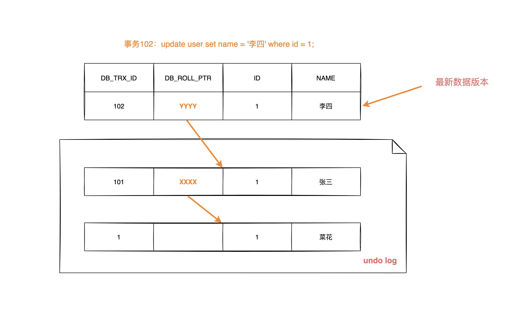

# mysql

**局部性原理**:之前被查询过的数据很可能再次被查询;

**磁盘预读:**在磁盘与内存进行交互的时候,有一个最小逻辑单元称之为页,datapage,与操作系统相关,一般为4k或8k,每次在进行数据交互的时候,一定读取的是页的整数倍.

mysql的innodb在进行数据读取的时候也是跟页相关的,datapagesize,默认情况下是16kb.,包括树的节点.

如innodb节点大小可通过:查看

```
show global status like 'Innodb_page_size' 
```

**mysql结构**


server中的查询缓存在mysql8版本之后失效:命中率低,查询一次清空.

简单来说 MySQL 主要分为 Server 层和存储引擎层：

**Server 层**：主要包括连接器、查询缓存、分析器、优化器、执行器等，所有跨存储引擎的功能都在这一层实现，比如存储过程、触发器、视图，函数等，还有一个通用的日志模块 binglog 日志模块。

**存储引擎**： 主要负责数据的存储和读取，采用可以替换的插件式架构，支持 InnoDB、MyISAM、Memory 等多个存储引擎，其中 InnoDB 引擎有自有的日志模块 redolog 模块。


## 索引

> 存储在磁盘中,但是会预先加载到内存中,而且在进行加载的时候是分页加载;

链表:时间复杂度高,效率低;

hash表:需要优秀的hash算法;不支持顺序和范围查询;需要大量内存空间(哈希碰撞全部加载),memory使用hash索引,innodb支持自适应hash;

BST(二叉搜索树):数据不平衡时会退化成链表;

AVL(平衡二叉搜索树):为保证平衡经常需要旋转操作,耗费性能;

红黑树(最长子树高度不超过最短子树两倍,减少了avl树旋转的次数):当插入的数据足够多的时候,树会变得很高(因为是二叉),io次数就会变多,查询变慢;

B树: 节点(一个磁盘块大小)中除了指向子节点的指针外,存储的数据占用节点大量空间,范围查询需要中序遍历;

B+树:所有数据存储在叶子节点,非叶子只存储指针和索引值,每个节点能索引的范围更大更精确. 叶节点增加的链指针,加强了区间访问性:

> 每一个节点最多存储degree-1个数据,degree越大(datapagesize和索引大小决定),每个节点存储的数据越多,io次数越少
>
> datapagesize(16) / (索引大小+地址指针大小) = 每个节点存储索引的个数(degree -1) 

> 为了使b+树足够矮,尽量减少索引值的占用空间(比如varchar大于4B用int|使用前缀短索引), 通过千万级别数据3-4层足以(结合datapagesize,数据量,索引大小由mysql确定).

> 复合索引的结构只是先计算左边的值然后再比较后面的值;
>
> 创建索引的时候,要保证唯一的值足够多,这样才有意义,一般情况下是80%
>
> 与其说是数据库只支持一条查询语句只使用一个索引，倒不如说N条独立索引同时在一条语句使用的消耗比只使用一个索引还要慢。
>
> 读取索引的时候一层一层的加载到内存.	

### 聚簇索引

聚簇索引具有唯一性, 表中行的物理顺序即聚簇索引中行的物理顺序;

聚簇索引默认是主键,唯一非空索引,rowid.

访问同一数据页(datapage)不同 行记录时,都会在一次IO 操作中被读取到缓存中,下一次访问直接在内存操作.

而MyISAM因为没有聚簇索引,数据随机存储,获取每条数据都要进行一次io

> 如果已经设置了主键为聚簇索引又希望再单独设置聚簇索引，必须先删除主键，然后添加我们想要的聚簇索引， 最后恢复设置主键即可。

innode数据+索引文件:  `.idb`

myisam数据+索引: `.myd` `.myi`


### 索引维护

**页分裂**

当固定磁盘块的数据节点如[1,2,3,5]要插入一个4,需要进行页分裂,但是页分裂不仅仅是分裂叶子节点这么简单,其上面的上层节点也要进行维护(超出大小也要分裂).

所以自增id每次插在最后而不会影响之前产生的树.

**页合并**

当删了一行记录时，实际上记录并没有被物理删除，记录被标记（flaged）为删除并且它的空间变得允许被其他记录声明使用。当页中删除的记录达到`MERGE_THRESHOLD`（默认页体积的50%），InnoDB会开始寻找最靠近的页（前或后）看看是否可以将两个页合并以优化空间使用。

### 索引覆盖

回表效率不高;

在id为主键的情况下,对于

```
select id,name from table where name=zhangsan;
```

可对name建立索引达到索引覆盖

对于

```
select id,name,age from table where name=zhangsan;
```

可对(name,age)作为复合索引

### 最左匹配原则

需要先匹配左边,再匹配右边,直到遇到范围查询(>、<、between、 like)就停止匹配.

如果我们创建了(area, age, salary)的复合索引，那么其实相当于创建了(area,age,salary)、(area,age)、(area)三个索引.  因此我们在创建复合索引时应该将最常用作限制条件的列放在最左边，依次递减。

对于复合索引(name,age)

```
select * from table where name=?   √
select * from table where name=? and age=?  √
select * from table where age=> and  name=?   
select * from table where age=?  ×
```

对于第三种情况, 在优化器组件的作用下通过调整顺序来匹配索引.


最左匹配原则在mysql优化下可能不会生效

对于字段id,a,b,c ,主键索引id和复合索引(a,b,c);

```
select * from table where b=2 and c=3;
可能会走复合索引,因为走索引可以达到索引覆盖
```

而对于字段id,a,b,c,d ,主键索引id和复合索引(a,b,c);

```
select * from table where b=2 and c=3;
可能不会走复合索引,因为走索引要回表
```


### 索引下推

- 索引条件下推(Index Condition Pushdown),简称ICP。MySQL5.6新添加，用于优化数据的查询。
- 当你不使用ICP,通过使用非主键索引（普通索引or二级索引）进行查询，存储引擎通过索引检索数据，然后返回给MySQL服务器，服务器再判断是否符合条件。
- 使用ICP，当存在索引的列做为判断条件时，MySQL服务器将这一部分判断条件传递给存储引擎，然后存储引擎通过判断索引是否符合MySQL服务器传递的条件，只有当索引符合条件时才会将数据检索出来返回给MySQL服务器。

```
select * from table where name like '%aa' and age=?
```

在没有索引下推之前,因为索引失效先根据name去存储引擎中拉取复合结果的数据,返回到server层,在server层中对age的条件进行过滤;

有了索引下推之后,根据name,age两个条件直接从存储引擎中拉去结果,不需要在server层做条件过滤;

在mysql5.7以后默认开启.

> mysql server端由连接器,分析器,优化器,执行器组成

查看 show variables like '%switch%'

index_condition_push=on

当使用explan进行分析时，如果使用了索引条件下推，Extra会显示**Using index condition**。

### 索引失效

1.OR  (可使用union all 或 union 代替);

2.复合索引不符合最左匹配;

3.like以%开头;

4.索引列上做计算,函数,类型转换;

5.如果mysql觉得全表扫描更快时（数据少）;

### OLAP OLTP

OLAP联机分析处理:

对海量的历史数据进行分析操作,要求产生决策性的影响,不要求在极短的时间内返回结果

 --> 数据仓库  如hive 采用 hash索引

OLTP联机事务处理:

为了支撑业务系统的需要,必须在极短时间内返回对应的结果

-->关系型数据库

## 锁

数据库锁机制简单来说，就是数据库为了保证数据的一致性，使各种 共享资源 在被访问时变得 有 序而设计 的一种规则。

MysQL的锁机制比较简单最著的特点是不同的存储引擎支持不同的锁机制。 InoDB支持行锁,(有时 也会升级为表锁）MyISAM只支持表锁。

表锁 的特点就是开销小、加锁快，不会出现死锁。锁粒度大，发生锁冲突的概率小，并发度相对 低。

行锁 的特点就是开销大、加锁慢，会出现死锁。锁粒度小，发生锁冲突的概率高，并发度搞。

**表锁**

表锁由 MySQL服务器实现，无论存储引擎是什么，都可以使用表锁。一般在执行 DDL 语句时，譬如 ALTER TABLE 时就会对整个表进行加锁。在执行 SQL 语句时，也可以明确对某个表加锁。

给表显式加锁语句为：

```
#加表读锁
lock table {tableName} read;

#释放表锁
unlock tables；

#查看表锁
show open table;

#加表写锁
lock table {tableName} write;

#释放表读锁
unlock tables；
```

在使用MYISAM引擎时，通常我们不需要手动加锁，因为MYISAM引擎会针对我们的sql语句自动进行加锁，整个过程不需要用户干预：

1. 查询语句（select）：会自动给涉及的表加读锁；
2. 更新语句（update、delete、insert）：会自动给涉及的表加写锁。

**InnoDB行锁种类**

查看隔离级别

```
show variables like '%iso%';
```

注意:大多数数据库默认的事务隔离级别为读已提交RC , 而innoDB默认的事务隔离级别为可重复度RR

1.记录锁

```
不加索引，两个事务修改同一行记录,不能同时;不加索引，两个事务修改同一表非同行记录,不能同时;锁的是表↑加索引，修改同一行记录，不能同时;加索引，修改同表的不同行，可以同时;锁的是行,证明行锁是加在索引上的，这是标准的行级锁。
```

InnoDB的行锁是通过对**索引项加锁**实现的，这表示只有通过索引查询记录时才会使用行锁，如果不走索引查询数据将使用表锁，则性能会大打折扣。

2.间隙锁(GPA锁)

间隙锁是一种区间锁。锁加在不存在的空闲空间上，或者两个索引记录之间，或者第一个索引记录，或者最后一个索引之后的空间，用来表示只锁住一段范围（一般在进行范围查询时且隔离级别在RR或Serializable隔时）。

一般在RR隔离级别下会使用到GAP锁。使用GAP锁，主要是为了防止幻读产生，在被GAP锁锁住的区间，不允许插入数据或者更新数据。

间隙锁区域定义：

```
根据检索条件向左寻找最靠近的值A，作为左区间，向右寻找最靠近的值B，作为右区间，间隙锁为（A，B）向左找不到最近的值A，也是就无穷小，作为左区间，向右寻找最靠近的值B，作为右区间，间隙锁为（无穷小，B）向左找到最近的值A，作为左区间，向右寻找不到最近的值B，也就是无穷大，作为右区间，间隙锁为（A，无穷大）
```

MYSQL的锁机制非常复杂，在实际的开发工作中，对于隔离级别的设置都需要非常谨慎，比如RR级别会比RC级别多出一个间隙锁，这就可能导致严重的性能问题。

3.组合

当InnoDb扫描索引时会先对索引记录加上记录锁，在对索记录两边加上间 隙锁。

**InnoDB锁类型**

1.读锁(共享锁,  shared lock,s锁)

一个事务获取了一个数据行的读锁，其他事务能获得该行对应 的读锁但不能获得写锁，即一个事务在读取一个数据行时，其他事务也可以读，但不能对该数行增删改 的操作。

**简而言之：就是可以多个事务读，但只能一个事务写。**

读锁有两种select方式的应用： 

1. 第一种是自动提交模式下的select查询语句，不需加任何锁,直接返回查询结果，这就是一致性非锁 定读。 
2. 第二种就是通过select.... lock in share mode被读取的行记录或行记录的范围上加一个读锁,让其 他事务可以读,但是要想申请加写锁,那就会被阻塞

**注意:**

```
在行（也就是记录）上加锁，并不是锁住该条记录，而是在记录对应的索引上加锁。如果where条件中不走索引，则会对所有的记录加锁。这里所说的读，是指当前读，快照读是无需加锁的。普通select读一般都是快照读，除了select...lock in share mode这样的显式加锁语句下会变成当前读，在InnoDB引擎的serializable级别下，普通select读也会变成当前读。
```

2.写锁(排他锁,Exclusive Lock ,x锁)

写锁，也叫排他锁，或者叫独占所，简称x锁。一个事务获取了一个数据行的写锁，其他事务就不能再 获取该行的其他锁与锁优先级最高。

**简而言之：就是只能有一个事务操作这个数据，别的事务都不行。**

写锁的应用就很简单了，有以下两种情况：

 (1) insert/update/delete语句，会自动在该条记录上加上写锁

如两个事务对同一行update;

 (2) 比较特殊的就是select for update，它会对读取的行记录上加一个写锁，那么其他任何事务戴不 能对被锁定的行上加任何锁了，要不然会被阻塞。

**注意:写锁也是加在索引上的**

**但是发现上述两种情况其他事务还能对该行读,这是因为mysql实现了MVCC模型**

3.MDL锁

MySQL 5.5引入了meta data lock，简称MDL锁，用于保证表中 元数据 的信息  ,系统级的锁无法主动控制。主要是为了在并发环境下对DDL、DML同时操作下保持元数据的一致性。

在事务A中，开启了表查询事务，会自动获得一个MDL锁，

事务B就不可以执行任何DDL语句，比如为表中添加字段 ,删除表.

1. 对表中的记录进行增删改查（DML操作）的时候，自动加MDL读锁；
2. 对表的结构（DDL操作）进行修改的时候，自动加MDL写锁。

根据MDL锁的粒度和模式,MDL锁还分成了很多种类

4.意向锁

在mysql的innodb引擎中，意向锁是表级锁，是一种不与行级锁冲突的表级锁，表示表中的记录所需要的锁(S锁或X锁)的类型（其实就是告诉你，这张表中已经存在了行锁（行锁的类型），所以叫意向锁）。InnoDB支持多种粒度的锁，允许行级锁和表级锁的共存。

意向锁有两种 

意向共享锁（IS） 是指在给一个数据行加共享锁前必须获取该表的意向共享锁

意向排它锁（IX） 是指在给一个数据行加排他锁前必须获取该表的意向排他锁

**意向锁与意向锁之间是不互斥的，但是意向锁与其他表锁之间存在一定的兼容互斥**

|               | 表意向共享锁（IS） | 表意向排他锁（IX） |
| ------------- | ------------------ | ------------------ |
| 表共享锁（S） | 兼容               | 互斥               |
| 表排他锁（X） | 互斥               | 互斥               |

比如:

```
事务 A 获取了某一行的排他锁，并未提交：begin;	SELECT * FROM test_user WHERE id = 28 FOR UPDATE;# 此时事务A获取了两把锁：test_user 表上的意向排他锁与 id 为 28 的数据行上的排他锁。事务 B 想要获取表的表共享锁；begin;LOCK TABLE test_user READ;# 因为共享锁与排他锁互斥，所以事务 B 在试图对 test_user 表加共享锁的时候，必须保证：1.当前没有其他事务持有 test_user 表的排他锁（表排他锁）。2.当前没有其他事务持有 test_user 表中任意一行的排他锁（行排他锁）。# 为了检测是否满足第二个条件，如果没有意向锁，事务 B 必须在确保 test_user表不存在任何排他锁的前提下，去检测表中的每一行是否存在排他锁；但是如果有了意向锁之后，事务 B 只需要检测事务 A 是否持有 test_user 表的意向排他锁，就可以得知事务 A 必然持有该表中某些数据行的排他锁，那么事务 B 对 test_users 表的加锁请求就会被排斥（阻塞），从而无需去检测表中的每一行数据是否存在排他锁。事务 C 也想获取表中某一行的排他锁：begin;	SELECT * FROM test_user WHERE id = 31 FOR UPDATE;# 因为意向锁之间并不互斥，所以事务C获取到了test_user的意向排他锁# 因为id 为 31 的数据行上不存在任何排他锁，最终事务 C 成功获取到了该数据行上的排他锁。
```

5.自增锁

在InnoDB存储引擎中，针对每个自增长的字段都设置了一个自增长的计数器。我们可以执行下面的语句来得到这个计数器的当前值：

```
select max(自增长列) from table;
```

当我们进行插入操作的时候，该操作会根据这个自增长的计数器的当前值进行+1操作，并赋予自增长的列，这个操作我们称之为auto-inc Locking，也就是自增长锁，这种锁其实采用的是特殊的表锁机制，如果insert操作出现在一个事务中，这个锁是在insert操作完成之后立即释放，而不是等待事务提交。

6.页级锁

MySQL中锁定粒度介于行级锁和表级锁中间的一种锁。表级锁速度快，但冲突多，行级冲突少，但速度慢。所以取了折衷的页级，一次锁定相邻的一组记录。不同的存储引擎支持不同的锁机制。

页级锁是MySQL中比较独特的一种锁定级别，**应用于BDB引擎**，并发度一般，页级锁定的特点是锁定颗粒度介于行级锁定与表级锁之间，所以获取锁定所需要的资源开销，以及所能提供的并发处理能力也同样是介于上面二者之间。另外，页级锁定和行级锁定一样，会发生死锁。

锁定粒度大小比较：表级锁 > 页级锁 > 行级锁

**乐观锁和悲观锁**

1.乐观锁

乐观锁大多是基于数据版本记录机制实现，一般是给数据库表增加一个"version"字段。读取数据时，将 此版本号一同读出，之后更新时，对此版本号加一。此时将提交数据的版本数据与数据库表对应记录的 当前版本信息进行比对，如果提交的数据版本号大于数据库表当前版本号，则予以更新，否则认为是过 期数据。

2.悲观锁

悲观锁依靠数据库提供的锁机制实现。MySQL中的共享锁和排它锁都是悲观锁。数据库的增删改操作默 认都会加排他锁，而查询不会加任何锁。此处不赘述

**锁等待和死锁**

锁等待是指一个事务过程中产生的锁，其他事务需要等待上一个事务释放它的锁，才能占用该资源。如 果该事务一直不释放，就需要持续等待下去，直到超过了锁等待时间，会报一个等待超时的错误。

MysQL中通过innodb_lock_wait_timeout参数控制,单位是秒。

死锁是指两个或两个以上的进程在执行过程中，因争夺资源而造成的一种互相等待的现象，就是所谓的 锁资源请求产生了回路现象，即死循环。

```
死锁的条件1. 两行记录，至少两个事务2. 事务A 操作 第n行数据，并加锁 update teacher set name = 'a' where id = 1;3. 事务B 操作 第m行数据，并加锁 update teacher set name = 'b' where id = 2;4. 事务A 操作 第m行数据 update teacher set name = 'c' where id = 2;5. 事务B 操作 第n行数据 update teacher set name = 'd' where id = 1;6. 形成死锁 Deadlock found when trying to get lock; try restartingtransaction
```

InnoDB引擎可以自动检测死锁并 回滚该事务 好不容易执行了一个业务给我回滚了，所以死锁尽量不要 出现。

## 事务

ACID特性

**原子性**（`Atomicity`） ： 事务是最小的执行单位，不允许分割。事务的原子性确保动作要么全部完成，要么完全不起作用；

**一致性**（`Consistency`）： 执行事务前后，数据保持一致，例如转账业务中，无论事务是否成功，转账者和收款人的总额应该是不变的；

**隔离性**（`Isolation`）： 并发访问数据库时，一个用户的事务不被其他事务所干扰，各并发事务之间数据库是独立的；

**持久性**（`Durability`）： 一个事务被提交之后。它对数据库中数据的改变是持久的，即使数据库发生故障也不应该对其有任何影响。


并发事务问题:

**脏读（Dirty read）:** 脏读是指事务读取到其他事务没提交的数据


**丢失修改（Lost to modify）:** 指在一个事务读取一个数据时，另外一个事务也访问了该数据，那么在第一个事务中修改了这个数据后，第二个事务也修改了这个数据。这样第一个事务内的修改结果就被丢失，因此称为丢失修改。 例如：事务 1 读取某表中的数据 A=20，事务 2 也读取 A=20，事务 1 修改 A=A-1，事务 2 也修改 A=A-1，最终结果 A=19，事务 1 的修改被丢失。

**不可重复读（Unrepeatable read）:** 不可重复读是指在同一次事务中前后查询不一致的问题


**幻读（Phantom read）:** 幻读是一次事务中前后数据量发生变化用户产生不可预料的问题


**不可重复读和幻读区别：**

不可重复读的重点是修改比如多次读取一条记录发现其中某些列的值被修改，幻读的重点在于新增或者删除比如多次读取一条记录发现记录增多或减少了(伤害不大)。


**隔离级别**

**READ-UNCOMMITTED(读取未提交)：** 最低的隔离级别，允许读取其他事务尚未提交的数据变更，**可能会导致脏读、幻读或不可重复读**。

**READ-COMMITTED(读取已提交)：** 允许读取并发事务已经提交的数据，**可以阻止脏读，但是幻读或不可重复读仍有可能发生**。

**REPEATABLE-READ(可重复读)：** 对同一字段的多次读取结果都是一致的，除非数据是被本身事务自己所修改，**可以阻止脏读和不可重复读，但幻读仍有可能发生**。

**SERIALIZABLE(可串行化)：** 最高的隔离级别，完全服从 ACID 的隔离级别。所有的事务依次逐个执行，这样事务之间就完全不可能产生干扰，也就是说，**该级别可以防止脏读、不可重复读以及幻读**。**此隔离级别是唯一使用加锁读的方式的隔离级别.**

> MySQL InnoDB 的 REPEATABLE-READ（可重读）可避免幻读，需要应用使用加锁读来保证。而这个加锁度使用到的机制就是 Next-Key Locks(MVCC)。

> 因为隔离级别越低，事务请求的锁越少，所以大部分数据库系统的隔离级别都是 **READ-COMMITTED(读取提交内容)** ，但是InnoDB 存储引擎默认使用 **REPEATABLE-READ（可重读）** 并不会有任何性能损失。

 InnoDB 存储引擎的默认支持的隔离级别是 **REPEATABLE-READ（可重读）**。

我们可以通过`SELECT @@tx_isolation;` 或者 `SHOW VARIABLES LIKE 'transaction_isolation';`查看

通过 `SET SESSION TRANSACTION ISOLATION LEVEL READ UNCOMMITTED;` 设置当前会话的隔离级别.

> 通常我们不需要修改mysql隔离级别

## MVCC

MVCC ，全称 Multi-Version Concurrency Control ，即多版本并发控制。MVCC是基于”数据版本”对并发事务进行访问.

一致性的非锁定行读（consistent nonlocking read，简称CNR）是指InnoDB存储引擎通过行多版本控制（multi versioning）的方式来读取当前执行时间数据库中运行的数据

https://www.cnblogs.com/xuwc/p/13873611.html

**一致性非锁定读**

对于 [一致性非锁定读（Consistent Nonlocking Reads）](https://dev.mysql.com/doc/refman/5.7/en/innodb-consistent-read.html)的实现，通常做法是加一个版本号或者时间戳字段，在更新数据的同时版本号 + 1 或者更新时间戳。查询时，将当前可见的版本号与对应记录的版本号进行比对，如果记录的版本小于可见版本，则表示该记录可见

在 `InnoDB` 存储引擎中，[多版本控制 (multi versioning)](https://dev.mysql.com/doc/refman/5.7/en/innodb-multi-versioning.html) 就是对非锁定读的实现。如果读取的行正在执行 `DELETE` 或 `UPDATE` 操作，这时读取操作不会去等待行上锁的释放。相反地，`InnoDB` 存储引擎会去读取行的一个快照数据，对于这种读取历史数据的方式，我们叫它快照读 (snapshot read)

在 `Repeatable Read` 和 `Read Committed` 两个隔离级别下，如果是执行普通的 `select` 语句（不包括 `select ... lock in share mode` ,`select ... for update`）则会使用 `一致性非锁定读（MVCC）`。并且在 `Repeatable Read` 下 `MVCC` 实现了可重复读和防止部分幻读

**锁定读**

如果执行的是下列语句，就是 [锁定读（Locking Reads）](https://dev.mysql.com/doc/refman/5.7/en/innodb-locking-reads.html)

- `select ... lock in share mode`
- `select ... for update`
- `insert`、`update`、`delete` 操作

在锁定读下，读取的是数据的最新版本，这种读也被称为 `当前读（current read）`。锁定读会对读取到的记录加锁：

- `select ... lock in share mode`：对记录加 `S` 锁，其它事务也可以加`S`锁，如果加 `x` 锁则会被阻塞
- `select ... for update`、`insert`、`update`、`delete`：对记录加 `X` 锁，且其它事务不能加任何锁

在一致性非锁定读下，即使读取的记录已被其它事务加上 `X` 锁，这时记录也是可以被读取的，即读取的快照数据。上面说了，在 `Repeatable Read` 下 `MVCC` 防止了部分幻读，这边的 “部分” 是指在 `一致性非锁定读` 情况下，只能读取到第一次查询之前所插入的数据（根据 Read View 判断数据可见性，Read View 在第一次查询时生成）。但是！如果是 `当前读` ，每次读取的都是最新数据，这时如果两次查询中间有其它事务插入数据，就会产生幻读。所以， **`InnoDB` 在实现`Repeatable Read` 时，如果执行的是当前读，则会对读取的记录使用 `Next-key Lock` ，来防止其它事务在间隙间插入数据**.


**innodb对mvcc实现**

`MVCC` 的实现依赖于：**隐藏字段、Read View、undo log**。在内部实现中，`InnoDB` 通过数据行的 `DB_TRX_ID` 和 `Read View` 来判断数据的可见性，如不可见，则通过数据行的 `DB_ROLL_PTR` 找到 `undo log` 中的历史版本。每个事务读到的数据版本可能是不一样的，在同一个事务中，用户只能看到该事务创建 `Read View` 之前已经提交的修改和该事务本身做的修改..

**隐藏字段**

在内部，`InnoDB` 存储引擎为每行数据添加了三个 [隐藏字段  (opens new window)](https://dev.mysql.com/doc/refman/5.7/en/innodb-multi-versioning.html)：

- `DB_TRX_ID（6字节）`：表示最后一次插入或更新该行的事务 id。此外，`delete` 操作在内部被视为更新，只不过会在记录头 `Record header` 中的 `deleted_flag` 字段将其标记为已删除
- `DB_ROLL_PTR（7字节）` 回滚指针，指向该行的 `undo log` 。如果该行未被更新，则为空
- `DB_ROW_ID（6字节）`：如果没有设置主键且该表没有唯一非空索引时，`InnoDB` 会使用该 id 来生成聚簇索引


**Read view**

```c++
class ReadView {
	private:  
		trx_id_t m_low_limit_id;      			/* 大于等于这个 ID 的事务均不可见 */  
		trx_id_t m_up_limit_id;       			/* 小于这个 ID 的事务均可见 */  
		trx_id_t m_creator_trx_id;    			/* 创建该 Read View 的事务ID */  
		trx_id_t m_low_limit_no;      			/* 事务 Number, 小于该 Number 的 Undo Logs 均可以被 Purge */  
		ids_t m_ids;                  			/* 创建 Read View 时的活跃事务列表 */  
		m_closed;                     			/* 标记 Read View 是否 close */
}
```

[`Read View` ](https://github.com/facebook/mysql-8.0/blob/8.0/storage/innobase/include/read0types.h#L298) 主要是用来做可见性判断，里面保存了 “当前对本事务不可见的其他活跃事务”

主要有以下字段：

- `m_low_limit_id`：目前出现过的最大的事务 ID+1，即下一个将被分配的事务 ID。大于等于这个 ID 的数据版本均不可见
- `m_up_limit_id`：活跃事务列表 `m_ids` 中最小的事务 ID，如果 `m_ids` 为空，则 `m_up_limit_id` 为 `m_low_limit_id`。小于这个 ID 的数据版本均可见
- `m_ids`：`Read View` 创建时其他未提交的活跃事务 ID 列表。创建 `Read View`时，将当前未提交事务 ID 记录下来，后续即使它们修改了记录行的值，对于当前事务也是不可见的。`m_ids` 不包括当前事务自己和已提交的事务
- `m_creator_trx_id`：创建该 `Read View` 的事务 ID


**undo log**

`undo log` 主要有两个作用：

- 当事务回滚时用于将数据恢复到修改前的样子
- 另一个作用是 `MVCC` ，当读取记录时，若该记录被其他事务占用或当前版本对该事务不可见，则可以通过 `undo log` 读取之前的版本数据，以此实现非锁定读

**在 `InnoDB` 存储引擎中 `undo log` 分为两种： `insert undo log` 和 `update undo log`：**

1. **`insert undo log`** ：指在 `insert` 操作中产生的 `undo log`。因为 `insert` 操作的记录只对事务本身可见，对其他事务不可见，故该 `undo log` 可以在事务提交后直接删除。不需要进行 `purge` 操作

**`insert` 时的数据初始状态：**


2.**`update undo log`** ：`update` 或 `delete` 操作中产生的 `undo log`。该 `undo log`可能需要提供 `MVCC` 机制，因此不能在事务提交时就进行删除。提交时放入 `undo log` 链表，等待 `purge线程` 进行最后的删除.

**数据第一次被修改时：**


**数据第二次被修改时：**



不同事务或者相同事务的对同一记录行的修改，会使该记录行的 `undo log` 成为一条链表，链首就是最新的记录，链尾就是最早的旧记录。

> mysql确保UNDO_LOG版本链数据不再被“引用”后再进行删除。


**数据可见性算法**

在 `InnoDB` 存储引擎中，创建一个新事务后，执行每个 `select` 语句前，都会创建一个快照（Read View），**快照中保存了当前数据库系统中正处于活跃（没有 commit）的事务的 ID 号**。其实简单的说保存的是系统中当前不应该被本事务看到的其他事务 ID 列表（即 m_ids）。当用户在这个事务中要读取某个记录行的时候，`InnoDB` 会将该记录行的 `DB_TRX_ID` 与 `Read View` 中的一些变量及当前事务 ID 进行比较，判断是否满足可见性条件

[具体的比较算法](https://github.com/facebook/mysql-8.0/blob/8.0/storage/innobase/include/read0types.h#L161)如下：[图源](https://leviathan.vip/2019/03/20/InnoDB的事务分析-MVCC/#MVCC-1)


1. 如果记录 DB_TRX_ID < m_up_limit_id，那么表明最新修改该行的事务（DB_TRX_ID）在当前事务创建快照之前就提交了，所以该记录行的值对当前事务是可见的
2. 如果 DB_TRX_ID >= m_low_limit_id，那么表明最新修改该行的事务（DB_TRX_ID）在当前事务创建快照之后才修改该行，所以该记录行的值对当前事务不可见。跳到步骤 5
3. m_ids 为空，则表明在当前事务创建快照之前，修改该行的事务就已经提交了，所以该记录行的值对当前事务是可见的
4. 如果 m_up_limit_id <= DB_TRX_ID < m_low_limit_id，表明最新修改该行的事务（DB_TRX_ID）在当前事务创建快照的时候可能处于“活动状态”或者“已提交状态”；所以就要对活跃事务列表 m_ids 进行查找（源码中是用的二分查找，因为是有序的）
   - 如果在活跃事务列表 m_ids 中能找到 DB_TRX_ID，表明：① 在当前事务创建快照前，该记录行的值被事务 ID 为 DB_TRX_ID 的事务修改了，但没有提交；或者 ② 在当前事务创建快照后，该记录行的值被事务 ID 为 DB_TRX_ID 的事务修改了。这些情况下，这个记录行的值对当前事务都是不可见的。跳到步骤 5
   - 在活跃事务列表中找不到，则表明“id 为 trx_id 的事务”在修改“该记录行的值”后，在“当前事务”创建快照前就已经提交了，所以记录行对当前事务可见
5. 在该记录行的 DB_ROLL_PTR 指针所指向的 `undo log` 取出快照记录，用快照记录的 DB_TRX_ID 跳到步骤 1 重新开始判断，直到找到满足的快照版本或返回空


**RC 和 RR 隔离级别下 MVCC 的差异**

在事务隔离级别 `RC` 和 `RR` （InnoDB 存储引擎的默认事务隔离级别）下，`InnoDB` 存储引擎使用 `MVCC`（非锁定一致性读），但它们生成 `Read View` 的时机却不同

- 在 RC 隔离级别下的 **`每次select`** 查询前都生成一个`Read View` (m_ids 列表)
- 在 RR 隔离级别下只在事务开始后 **`第一次select`** 数据前生成一个`Read View`（m_ids 列表）


**MVCC 解决不可重复读问题**

虽然 RC 和 RR 都通过 `MVCC` 来读取快照数据，但由于 **生成 Read View 时机不同**，从而在 RR 级别下实现可重复读

举个例子：


  

**RC 下 ReadView 生成情况**

1.**`假设时间线来到 T4 ，那么此时数据行 id = 1 的版本链为`：**


由于 RC 级别下每次查询都会生成`Read View` ，并且事务 101、102 并未提交，此时 `103` 事务生成的 `Read View` 中活跃的事务 **`m_ids` 为：[101,102]** ，`m_low_limit_id`为：104，`m_up_limit_id`为：101，`m_creator_trx_id` 为：103

- 此时最新记录的 `DB_TRX_ID` 为 101，m_up_limit_id <= 101 < m_low_limit_id，所以要在 `m_ids` 列表中查找，发现 `DB_TRX_ID` 存在列表中，那么这个记录不可见
- 根据 `DB_ROLL_PTR` 找到 `undo log` 中的上一版本记录，上一条记录的 `DB_TRX_ID` 还是 101，不可见
- 继续找上一条 `DB_TRX_ID`为 1，满足 1 < m_up_limit_id，可见，所以事务 103 查询到数据为 `name = 菜花`

2.**`时间线来到 T6 ，数据的版本链为`：**


因为在 RC 级别下，重新生成 `Read View`，这时事务 101 已经提交，102 并未提交，所以此时 `Read View` 中活跃的事务 **`m_ids`：[102]** ，`m_low_limit_id`为：104，`m_up_limit_id`为：102，`m_creator_trx_id`为：103

- 此时最新记录的 `DB_TRX_ID` 为 102，m_up_limit_id <= 102 < m_low_limit_id，所以要在 `m_ids` 列表中查找，发现 `DB_TRX_ID` 存在列表中，那么这个记录不可见
- 根据 `DB_ROLL_PTR` 找到 `undo log` 中的上一版本记录，上一条记录的 `DB_TRX_ID` 为 101，满足 101 < m_up_limit_id，记录可见，所以在 `T6` 时间点查询到数据为 `name = 李四`，与时间 T4 查询到的结果不一致，不可重复读！

3.**`时间线来到 T9 ，数据的版本链为`：**


重新生成 `Read View`， 这时事务 101 和 102 都已经提交，所以 **m_ids** 为空，则 m_up_limit_id = m_low_limit_id = 104，最新版本事务 ID 为 102，满足 102 < m_low_limit_id，可见，查询结果为 `name = 赵六`

> **总结：** **在 RC 隔离级别下，事务在每次查询开始时都会生成并设置新的 Read View，所以导致不可重复读**


**在 RR 下 ReadView 生成情况**

**在可重复读级别下，只会在事务开始后第一次读取数据时生成一个 Read View（m_ids 列表）**

1. **`在 T4 情况下的版本链为`：**


在当前执行 `select` 语句时生成一个 `Read View`，此时 **`m_ids`：[101,102]** ，`m_low_limit_id`为：104，`m_up_limit_id`为：101，`m_creator_trx_id` 为：103

此时和 RC 级别下一样：

- 最新记录的 `DB_TRX_ID` 为 101，m_up_limit_id <= 101 < m_low_limit_id，所以要在 `m_ids` 列表中查找，发现 `DB_TRX_ID` 存在列表中，那么这个记录不可见
- 根据 `DB_ROLL_PTR` 找到 `undo log` 中的上一版本记录，上一条记录的 `DB_TRX_ID` 还是 101，不可见
- 继续找上一条 `DB_TRX_ID`为 1，满足 1 < m_up_limit_id，可见，所以事务 103 查询到数据为 `name = 菜花`

1. **`时间点 T6 情况下`：**

   

   在 RR 级别下只会生成一次`Read View`，所以此时依然沿用 **`m_ids` ：[101,102]** ，`m_low_limit_id`为：104，`m_up_limit_id`为：101，`m_creator_trx_id` 为：103

- 最新记录的 `DB_TRX_ID` 为 102，m_up_limit_id <= 102 < m_low_limit_id，所以要在 `m_ids` 列表中查找，发现 `DB_TRX_ID` 存在列表中，那么这个记录不可见
- 根据 `DB_ROLL_PTR` 找到 `undo log` 中的上一版本记录，上一条记录的 `DB_TRX_ID` 为 101，不可见
- 继续根据 `DB_ROLL_PTR` 找到 `undo log` 中的上一版本记录，上一条记录的 `DB_TRX_ID` 还是 101，不可见
- 继续找上一条 `DB_TRX_ID`为 1，满足 1 < m_up_limit_id，可见，所以事务 103 查询到数据为 `name = 菜花`

1. **时间点 T9 情况下：**


此时情况跟 T6 完全一样，由于已经生成了 `Read View`，此时依然沿用 **`m_ids` ：[101,102]** ，所以查询结果依然是 `name = 菜花`

> 连续多次快照读，ReadView会产生复用，没有幻读问题.
>
> 特例: 如果事务中两次快照读中出现了修改其他事务新增的当前读,  会重新生成ReadView ,  导致出现幻读.


**MVCC➕Next-key-Lock 防止幻读**

`InnoDB`存储引擎在 RR 级别下通过 `MVCC`和 `Next-key Lock` 来解决幻读问题：

**1、执行普通 `select`，此时会以 `MVCC` 快照读的方式读取数据**

在快照读的情况下，RR 隔离级别只会在事务开启后的第一次查询生成 `Read View` ，并使用至事务提交。所以在生成 `Read View` 之后其它事务所做的更新、插入记录版本对当前事务并不可见，实现了可重复读和防止快照读下的 “幻读”

**2、执行 select...for update/lock in share mode、insert、update、delete 等当前读**

在当前读下，读取的都是最新的数据，如果其它事务有插入新的记录，并且刚好在当前事务查询范围内，就会产生幻读！`InnoDB` 使用 [Next-key Lock  (opens new window)](https://dev.mysql.com/doc/refman/5.7/en/innodb-locking.html#innodb-next-key-locks) 来防止这种情况。当执行当前读时，会锁定读取到的记录的同时，锁定它们的间隙，防止其它事务在查询范围内插入数据。只要我不让你插入，就不会发生幻读


## 日志

1.日志类型

物理日志:存储了数据被修改的值

逻辑日志:存储了逻辑sql修改语句

`redo log` 它是物理日志，记录内容是“在某个数据页上做了什么修改”，属于 `InnoDB` 存储引擎，恢复速度远快于逻辑日志。让`InnoDB`存储引擎拥有了崩溃恢复能力。

`binlog` 是逻辑日志，记录内容是语句的原始逻辑，类似于“给 ID=2 这一行的 c 字段加 1”，属于`MySQL Server` 层。不管用什么存储引擎，只要发生了表数据更新，都会产生 `binlog` 日志。保证了`MySQL`集群架构的数据一致性。


### binlog(归档日志)

`MySQL`数据库的**数据备份、主备、主主、主从**都离不开`binlog`，需要依靠`binlog`来同步数据，保证数据一致性。

`binlog`会记录所有涉及更新数据的逻辑操作，并且是顺序写。

**记录格式**

`binlog` 日志有三种格式，可以通过`binlog_format`参数指定。

- **statement**

记录的内容是`SQL`语句原文，比如执行一条`update T set update_time=now() where id=1`.


同步数据时，会执行记录的`SQL`语句，但是有个问题，`update_time=now()`这里会获取当前系统时间，直接执行会导致与原库的数据不一致。

- **row**

为了解决`statement`存在的问题，我们需要指定为`row`，记录的内容不再是简单的`SQL`语句了，还包含操作的具体数据


`row`格式记录的内容看不到详细信息，要通过`mysqlbinlog`工具解析出来。

`update_time=now()`变成了具体的时间`update_time=1627112756247`，条件后面的@1、@2、@3 都是该行数据第 1 个~3 个字段的原始值（**假设这张表只有 3 个字段**）。

这样就能保证同步数据的一致性，通常情况下都是指定为`row`，这样可以为数据库的恢复与同步带来更好的可靠性。

但是这种格式，需要更大的容量来记录，比较占用空间，恢复与同步时会更消耗`IO`资源，影响执行速度。

- **mixed**

`statement`和`row`的折中方案,

`MySQL`会判断这条`SQL`语句是否可能引起数据不一致，如果是，就用`row`格式，否则就用`statement`格式。


**写入机制**

事务执行过程中，先把日志写到`binlog cache`，事务提交的时候，再把`binlog cache`写到`binlog`文件中。

因为一个事务的`binlog`不能被拆开，无论这个事务多大，也要确保一次性写入，所以系统会给每个线程分配一个块内存作为`binlog cache`。

我们可以通过`binlog_cache_size`参数控制单个线程 binlog cache 大小，如果存储内容超过了这个参数，就要暂存到磁盘（`Swap`）。


- **上图的 write，是指把日志写入到文件系统的 page cache，并没有把数据持久化到磁盘，所以速度比较快**
- **上图的 fsync，才是将数据持久化到磁盘的操作**

`write`和`fsync`的时机，可以由参数`sync_binlog`控制，默认是`0`。表示每次提交事务都只`write`，由系统自行判断什么时候执行`fsync`。


虽然性能得到提升，但是机器宕机，`page cache`里面的 binglog 会丢失。

为了安全起见，可以设置为`1`，表示每次提交事务都会执行`fsync`，就如同**binlog 日志刷盘流程**一样。

最后还有一种折中方式，可以设置为`N(N>1)`，表示每次提交事务都`write`，但累积`N`个事务后才`fsync`。


在出现`IO`瓶颈的场景里，将`sync_binlog`设置成一个比较大的值，可以提升性能。

同样的，如果机器宕机，会丢失最近`N`个事务的`binlog`日志。


### redolog(重做日志)

 保证事务的**持久性**

InnoDB的修改数据的基本流程:  当我们想要修改DB上某一行数据的时候， InnoDB是把**数据页(16KB)从磁盘读取到内存的缓冲池**上进行修改。数据在内存中被修改，与磁盘中相比就存在 了差异，我们称这种有差异的数据为脏页。

**InnoDB对脏页的处理不是每次生成脏页就将脏页刷新回磁盘，这样会产生海量的IO操作，严重影响InnoDB的处理性能**。

既然脏页与磁盘中的数据存在差异，那么如果在这期间DB 出现故障就会造成数据的丢失。为了解决这个问题，redo log就应运而生了。innodb把每次更新的数据写入redo log buffer(还在innodb中,没有持久化到磁盘)


>每条 redo 记录由“表空间号+数据页号+偏移量+修改数据长度+具体修改的数据”组成

**刷盘时机**

`InnoDB` 存储引擎为 `redo log` 的刷盘策略提供了 `innodb_flush_log_at_trx_commit` 参数，它支持三种策略：

- **0** ：设置为 0 的时候，表示每次事务提交时不进行刷盘操作
- **1** ：设置为 1 的时候，表示每次事务提交时都将进行刷盘操作（默认值）
- **2** ：设置为 2 的时候，表示每次事务提交时都只把 redo log buffer 内容写入 page cache

`innodb_flush_log_at_trx_commit` 参数默认为 1 ，也就是说当事务提交时会调用 `fsync` 对 redo log 进行刷盘

`InnoDB` 存储引擎有一个后台线程(master thread)，每隔`1` 秒，就会把 `redo log buffer` 中的内容写到文件系统缓存（`page cache`），然后调用 `fsync` 刷盘。(所以一个没有提交事务的`redo log`记录,也可能会刷盘)


除了后台线程每秒`1`次的轮询操作，还有一种情况，当 `redo log buffer` 占用的空间即将达到 `innodb_log_buffer_size` 一半的时候，后台线程会主动刷盘。

在第一种刷盘策略0下 : 因为仅通过后台线程1s刷盘一次,如果宕机或mysql挂了(因为`redo log buffer属于innodb`),可能会丢失1s内的数据;

在第二种刷盘策略1下 :   只要事务提交成功，`redo log`记录就一定在硬盘里，不会有任何数据丢失。如果事务执行期间`MySQL`挂了或宕机，这部分日志丢了，但是事务并没有提交，所以日志丢了也不会有损失;

在第三种刷盘策略2下 : 只要事务提交成功，`redo log buffer`中的内容只写入文件系统缓存（`page cache`）。如果仅仅只是`MySQL`挂了不会有任何数据丢失，但是宕机可能会有`1`秒数据的丢失。

**日志文件组**

硬盘上存储的 `redo log` 日志文件不只一个，而是以一个**日志文件组**的形式出现的，每个的`redo`日志文件大小都是一样的。

比如可以配置为一组`4`个文件，每个文件的大小是 `1GB`，整个 `redo log` 日志文件组可以记录`4G`的内容。

它采用的是环形数组形式，从头开始写，写到末尾又回到头循环写，如下图所示。


在个**日志文件组**中还有两个重要的属性，分别是 `write pos、checkpoint`

- **write pos** 是当前记录的位置，一边写一边后移
- **checkpoint** 是当前要擦除的位置，也是往后推移

每次刷盘 `redo log` 记录到**日志文件组**中，`write pos` 位置就会后移更新。

每次 `MySQL` 加载**日志文件组**恢复数据时，会清空加载过的 `redo log` 记录，并把 `checkpoint` 后移更新。

`write pos前` 和 `checkpoint后` 之间的还空着的部分可以用来写入新的 `redo log` 记录。


如果 `write pos` 追上 `checkpoint` ，表示**日志文件组**满了，这时候不能再写入新的 `redo log` 记录，`MySQL` 得停下来，清空一些记录，把 `checkpoint` 推进一下。


### 二阶段提交

`redo log`（重做日志）让`InnoDB`存储引擎拥有了崩溃恢复能力。

`binlog`（归档日志）保证了`MySQL`集群架构的数据一致性。

虽然它们都属于持久化的保证，但是侧重点不同。

在执行更新语句过程，会记录`redo log`与`binlog`两块日志，以基本的事务为单位，`redo log`在事务执行过程中可以不断写入，而`binlog`只有在提交事务时才写入，所以`redo log`与`binlog`的写入时机不一样。


如果`redo log`与`binlog`两份日志之间的逻辑不一致，会出现什么问题？

我们以`update`语句为例，假设`id=2`的记录，字段`c`值是`0`，把字段`c`值更新成`1`，`SQL`语句为`update T set c=1 where id=2`。

**假设执行过程中写完`redo log`日志后，`binlog`日志写期间发生了异常**，会出现什么情况呢？


由于`binlog`没写完就异常，这时候`binlog`里面没有对应的修改记录。因此，之后用`binlog`日志恢复数据时(从库同步)，就会少这一次更新，恢复出来的这一行`c`值是`0`，而原库因为`redo log`日志恢复，这一行`c`值是`1`，最终数据不一致。


为了解决两份日志之间的逻辑一致问题，`InnoDB`存储引擎使用**两阶段提交**方案。

原理很简单，将`redo log`的写入拆成了两个步骤`prepare`和`commit`，这就是**两阶段提交**。


使用**两阶段提交**后，写入`binlog`时发生异常也不会有影响，因为`MySQL`根据`redo log`日志恢复数据时，发现`redo log`还处于`prepare`阶段，并且没有对应`binlog`日志，就会回滚该事务。

**假如`redo log`设置`commit`阶段发生异常**，那会不会回滚事务呢？

并不会回滚事务，它会执行上图框住的逻辑，虽然`redo log`是处于`prepare`阶段，但是能通过事务`id`找到对应的`binlog`日志，所以`MySQL`认为是完整的，就会提交事务恢复数据。


### undolog(回滚日志)

保证事务的**原子性**。

所有事务进行的修改都会先记录到**回滚日志**中，然后再执行相关的操作。如果执行过程中遇到异常的话，我们直接利用 **回滚日志** 中的信息将数据回滚到修改之前的样子即可！并且，回滚日志会先于数据持久化到磁盘上。这样就保证了即使遇到数据库突然宕机等情况，当用户再次启动数据库的时候，数据库还能够通过查询回滚日志来回滚将之前未完成的事务。

另外，`MVCC` 的实现依赖于：**隐藏字段、Read View、undo log**。


## 时间格式选择

1.不要选择字符串存储日期;

```
字符串占用的空间更大！
字符串存储的日期效率比较低（逐个字符进行比对），无法用日期相关的 API 进行计算和比较。
```

2.Datetime 和 Timestamp

通常选择Timestamp,因为**Timestamp 和时区有关**。Timestamp 类型字段的值会随着服务器时区的变化而变化，自动换算成相应的时间，说简单点就是在不同时区，查询到同一个条记录此字段的值会不一样。且Timestamp 只需要使用 **4 个字节**的存储空间

而**DateTime 类型是没有时区信息的（时区无关）** ，DateTime 类型保存的时间都是当前会话所设置的时区对应的时间。这样就会有什么问题呢？当你的时区更换之后，比如你的服务器更换地址或者更换客户端连接时区设置的话，就会导致你从数据库中读出的时间错误。且DateTime 需要耗费 **8 个字节**的存储空间.

> Timestamp范围只有 1970-01-01 00:00:01 ~ 2037-12-31 23:59:59

> SELECT @@session.time_zone;  # 查看当前会话时区 
>
> SET time_zone = "+00:00"; #设置当前会话时区
>
> SELECT @@global.time_zone; # 全局时区
>
> SET GLOBAL time_zone = '+8:00';

3.当需要存储比秒更小时间粒度的时间用BIGINT类型存储微妙级别的时间戳,或者使用double存储秒之后的小数部分.

时间戳不存在时区问题


# Redis

[redis模拟](https://try.redis.io/)

**Redis 是一个使用 C 语言开发的数据库**,**Redis 除了做缓存之外，也经常用来做分布式锁，甚至是消息队列。**

**分布式锁** ： 通过 Redis 来做分布式锁是一种比较常见的方式。通常情况下，我们都是基于 Redisson 来实现分布式锁。相关阅读：[《分布式锁中的王者方案 - Redisson》](https://mp.weixin.qq.com/s/CbnPRfvq4m1sqo2uKI6qQw)。

**限流** ：一般是通过 Redis + Lua 脚本的方式来实现限流。相关阅读：[《我司用了 6 年的 Redis 分布式限流器，可以说是非常厉害了！》 。

**消息队列** ：Redis 自带的 list 数据结构可以作为一个简单的队列使用。Redis5.0 中增加的 Stream 类型的数据结构更加适合用来做消息队列。它比较类似于 Kafka，有主题和消费组的概念，支持消息持久化以及 ACK 机制。

**复杂业务场景** ：通过 Redis 以及 Redis 扩展（比如 Redisson）提供的数据结构，我们可以很方便地完成很多复杂的业务场景比如通过 bitmap 统计活跃用户、通过 sorted set 维护排行榜。

**Redis 提供了多种数据类型来支持不同的业务场景。Redis 还支持事务 、持久化、Lua 脚本、多种集群方案。**

像 MySQL 这类的数据库的 QPS 大概都在 1w 左右（4 核 8g） ，但是使用 Redis 缓存之后很容易达到 10w+，甚至最高能达到 30w+（就单机 redis 的情况，redis 集群的话会更高）

> QPS（Query Per Second）：服务器每秒可以执行的查询次数；

**分布式缓存**

以前有Memcached

为什么选择redis:

**Redis 支持更丰富的数据类型（支持更复杂的应用场景）**。Redis 不仅仅支持简单的 k/v 类型的数据，同时还提供 list，set，zset，hash 等数据结构的存储。Memcached 只支持最简单的 k/v 数据类型。

**Redis 支持数据的持久化，可以将内存中的数据保持在磁盘中，重启的时候可以再次加载进行使用,而 Memecache 把数据全部存在内存之中。**

**Redis 有灾难恢复机制。** 因为可以把缓存中的数据持久化到磁盘上。

**Redis 在服务器内存使用完之后，可以将不用的数据放到磁盘上。但是，Memcached 在服务器内存使用完之后，就会直接报异常。**

**Memcached 没有原生的集群模式，需要依靠客户端来实现往集群中分片写入数据；但是 Redis 目前是原生支持 cluster 模式的。**

**Memcached 是多线程，非阻塞 IO 复用的网络模型；Redis 使用单线程的多路 IO 复用模型。** （Redis 6.0 引入了多线程 IO ）

**Redis 支持发布订阅模型、Lua 脚本、事务等功能，而 Memcached 不支持。并且，Redis 支持更多的编程语言。**

**Memcached 过期数据的删除策略只用了惰性删除，而 Redis 同时使用了惰性删除与定期删除。**

## 数据类型

**1.String**

简单的 key-value 类型。虽然 Redis 是用 C 语言写的，但是 Redis 并没有使用 C 的字符串表示，而是自己构建了一种 **简单动态字符串**（simple dynamic string，**SDS**）。

相比于 C 的原生字符串，Redis 的 SDS 不光可以保存文本数据还可以保存二进制数据，并且获取字符串长度复杂度为 O(1)（C 字符串为 O(N)）,除此之外，Redis 的 SDS API 是安全的，不会造成缓冲区溢出。

应用场景： 一般常用在需要计数的场景，比如用户的访问次数、热点文章的点赞转发数量等等。

相关命令: `set,get,strlen,exists,decr,incr,setex,setnx`

> Redis 中除了字符串类型有自己独有设置过期时间的命令 `setex` 外，其他方法都需要依靠 `expire` 命令来设置过期时间 。另外， `persist` 命令可以移除一个键的过期时间。

**2.List**

双向链表,支持反向查找和遍历，更方便操作，不过带来了部分额外的内存开销。

应用场景:  发布与订阅或者说消息队列、慢查询。

相关命令: `rpush,lpop,lpush,rpop,lrange,llen`

**3.Hash**

hash 类似于 JDK1.8 前的 HashMap，内部实现也差不多(数组 + 链表)。不过，Redis 的 hash 做了更多优化。另外，hash 是一个 string 类型的 field 和 value 的映射表，**特别适合用于存储对象**，后续操作的时候，你可以直接仅仅修改这个对象中的某个字段的值。 

应用场景: 系统中对象数据的存储。

相关命令:`hset,hmset,hexists,hget,hgetall,hkeys,hvals`

**4.set**

 set 类似于 Java 中的 `HashSet` 。Redis 中的 set 类型是一种无序集合，集合中的元素没有先后顺序。当你需要存储一个列表数据，又不希望出现重复数据时，set 是一个很好的选择.

并且 **set 提供了判断某个成员是否在一个 set 集合内的重要接口，这个也是 list 所不能提供的。**

应用场景:需要存放的数据不能重复以及需要获取多个数据源交集(将用户关注存到set,利用sinterstore实现共同关注)和并集等场景.

相关命令:`sadd,spop,smembers,sismember,scard,sinterstore,sunion`

**5.sorted set** 

 和 set 相比，sorted set 增加了一个权重参数 score，使得集合中的元素能够按 score 进行有序排列，还可以通过 score 的范围来获取元素的列表。有点像是 Java 中 HashMap 和 TreeSet 的结合体。

相关命令:`zadd,zcard,zscore,zrange,zrevrange,zrem`

应用场景:需要对数据根据某个权重进行排序的场景。比如在直播系统中，实时排行信息包含直播间在线用户列表，各种礼物排行榜，弹幕消息（可以理解为按消息维度的消息排行榜）等信息.

```
> zadd myZset 3.0 value1 2.0 value2 1.0 value3  #插入值和其权重
(integer) 3
> zcard myZset 									#查看元素数量
(integer) 3
> zscore myZset value1 							#查看某个值的权重
"3"
> zrange  myZset 0 -1         #顺序输出某个范围区间的元素，0 -1 表示输出所有元素
1) "value3"
2) "value2"
3) "value1"
> zrevrange  myZset 0 1 						#逆序输出
1) "value1"
2) "value2"
```

**6.bitmap**

 bitmap 存储的是连续的二进制数字（0 和 1），通过 bitmap, 只需要一个 bit 位来表示某个元素对应的值或者状态，key 就是对应元素本身 。

相关命令:`setbit,getbit,bitcount,bitop` 

```
# bitop 对一个或多个保存二进制位的字符串 key 进行位元操作，并将结果保存到 destkey 上。
# 支持 AND 、 OR 、 NOT 、 XOR 这四种操作中的任意一种参数
BITOP operation destkey key [key ...]
```

应用场景: 适合需要保存状态信息（比如是否签到、是否登录...）并需要进一步对这些信息进行分析的场景。比如用户签到情况、活跃用户情况、用户行为统计（比如是否点赞过某个视频）。

```
# setbit 会返回之前位的值（默认是 0）
> setbit mykey 7 1
(integer) 0
> bitcount mykey  #统计被被设置为 1 的位的数量
(integer) 1

#使用场景一：用户行为分析 很多网站为了分析你的喜好，需要研究你点赞过的内容。
# 记录你喜欢过 001 号小姐姐
127.0.0.1:6379> setbit beauty_girl_001 uid 1

#使用场景二：统计活跃用户
# 使用时间作为 redis key，然后用户ID为map key，如果当日活跃过就设1(暂且约定，统计时间内只要有一天在线就称为活跃)
127.0.0.1:6379> setbit 20210308 1 1
(integer) 0
127.0.0.1:6379> setbit 20210308 2 1
(integer) 0
127.0.0.1:6379> setbit 20210309 1 1
(integer) 0
//统计两天都活跃的人
127.0.0.1:6379> bitop and desk1 20210308 20210309
(integer) 1
127.0.0.1:6379> bitcount desk1
(integer) 1
//统计两天内活跃了的人
127.0.0.1:6379> bitop or desk2 20210308 20210309
(integer) 1
127.0.0.1:6379> bitcount desk2
(integer) 2
```

## 事务

Redis 事务其实是一组命令的集合！ 

一个事务中的所有命令都会被序列化，在事务执行过程的中，会按照顺序执行！ Redis事务没有没有隔 离级别的概念，和单线程也有关系！ 所有的命令在事务中，并没有直接被执行！只有发起执行命令的时 候才会执行！Exec 

Redis单条命令式保存原子性的，但是事务不保证原子性！ 

使用 `MULTI` 命令后可以输入多个命令。Redis 不会立即执行这些命令，而是将它们放到队列，当调用了 `EXEC` 

可以通过 `DISCARD`命令取消一个事务，它会清空事务队列中保存的所有命令。

`WATCH` 命令用于监听指定的键，当调用 `EXEC` 命令执行事务时，如果一个被 `WATCH` 命令监视的键被修改的话，整个事务都不会执行，直接返回失败。

你可以将 Redis 中的事务就理解为 ：**Redis 事务提供了一种将多个命令请求打包的功能。然后，再按顺序执行打包的所有命令，并且不会被中途打断。**

**Redis 事务是不支持 roll back 的，因而不满足原子性的（而且不满足持久性）。**

## 持久化

**Redis 的一种持久化方式叫快照（snapshotting，RDB），另一种方式是只追加文件（append-only file, AOF）**。

RDB快照持久化是 Redis 默认采用的持久化方式，在 Redis.conf 配置文件中默认有此下配置：

```
save 900 1           #在900秒(15分钟)之后，如果至少有1个key发生变化，Redis就会自动触发BGSAVE命令创建快照。
save 300 10          #在300秒(5分钟)之后，如果至少有10个key发生变化，Redis就会自动触发BGSAVE命令创建快照。
save 60 10000        #在60秒(1分钟)之后，如果至少有10000个key发生变化，Redis就会自动触发BGSAVE命令创建快照
```

AOF持久化的实时性更好，因此已成为主流的持久化方案。默认情况下 Redis 没有开启 AOF（append only file）方式的持久化，可以通过 appendonly 参数开启：

```
appendonly yes
```


**RDB**

通过创建快照来获得存储在内存里面的数据在某个时间点上的副本。Redis 创建快照之后，可以对快照进行备份，可以将快照复制到其他服务器从而创建具有相同数据的服务器副本（Redis 主从结构，主要用来提高 Redis 性能），还可以将快照留在原地以便重启服务器的时候使用。

Redis会单独创建（fork）一个子进程来进行持久化，会先将数据写入到一个临时文件中，待持久化过 程 都结束了，再用这个临时文件替换上次持久化好的文件。整个过程中，主进程是不进行任何IO操作 的。

rdb保存的文件是dump.rdb 都是在我们的配置文件中快照中进行配置的！

**触发机制**

1、save的规则满足的情况下，会自动触发rdb规则 

2、执行save, flushall 命令，也会触发我们的rdb规 则！ 

3、退出redis，也会产生 rdb 文件！  (shutdown)

备份就自动生成一个 dump.rdb

**恢复rdb文件** 

1、只需要将rdb文件放在我们redis启动目录就可以，redis启动的时候会自动检查dump.rdb 恢复其中 的数据！

 2、查看需要存在的位置 

优点： 1、适合大规模的数据恢复！ 2、对数据的完整性要不高！ 

缺点： 如果redis意外宕机了，这个 最后一次修改数据就没有的了！只能保留到最后一个的save的地方。

**AOF**

`AOF`以日志的形式来记录每个写操作，将Redis执行过的所有指令记录下来（读操作不记录），只许追加文 件，但不可以改写文件，redis启动之初会读取该文件重新构建数据，换言之，redis重启的话就根据日 志文件的内容将写指令从前到后执行一次以完成数据的恢复工作。 aof保存的是 appendonly.aof 文件

默认情况下 Redis 没有开启 AOF，可以通过 appendonly 参数开启：！ redis.conf

```
appendonly yes
```

开启 AOF 持久化后每执行一条会更改 Redis 中的数据的命令，Redis 就会将该命令写入到内存缓存 `server.aof_buf` 中，然后再根据 `appendfsync` 配置来决定何时将其同步到硬盘中的 AOF 文件。

AOF 文件的保存位置和 RDB 文件的位置相同，都是通过 dir 参数设置的，默认的文件名是 `appendonly.aof`。

在 Redis 的配置文件中存在三种不同的 AOF 持久化方式，它们分别是：

```text
appendfsync always    #每次有数据修改发生时都会写入AOF文件,这样会严重降低Redis的速度
appendfsync everysec  #每秒钟同步一次，显示地将多个写命令同步到硬盘
appendfsync no        #让操作系统决定何时进行同步
```

为了兼顾数据和写入性能，用户可以考虑 `appendfsync everysec` 选项 ，让 Redis 每秒同步一次 AOF 文件，Redis 性能几乎没受到任何影响。而且这样即使出现系统崩溃，用户最多只会丢失一秒之内产生的数据。当硬盘忙于执行写入操作的时候，Redis 还会优雅的放慢自己的速度以便适应硬盘的最大写入速度。

## 过期删除与数据淘汰

**过期删除**

**过期时间保存**

Redis 通过一个叫做过期字典（可以看作是 hash 表）来保存数据过期的时间。过期字典的键指向 Redis 数据库中的某个 key(键)，过期字典的值是一个 long long 类型的整数，这个整数保存了 key 所指向的数据库键的过期时间（毫秒精度的 UNIX 时间戳）。

过期字典是存储在 redisDb 这个结构里的：

```c
typedef struct redisDb {
    ...

    dict *dict;     //数据库键空间,保存着数据库中所有键值对
    dict *expires   // 过期字典,保存着键的过期时间
    ...
} redisDb;
```

**过期数据删除策略**

**惰性删除** ：只会在取出 key 的时候才对数据进行过期检查。这样对 CPU 最友好，但是可能会造成太多过期 key 没有被删除。

**定期删除** ： 每隔一段时间抽取一批 key 执行删除过期 key 操作。并且，Redis 底层会通过限制删除操作执行的时长和频率来减少删除操作对 CPU 时间的影响。

定期删除对内存更加友好，惰性删除对 CPU 更加友好。两者各有千秋，所以 Redis 采用的是 **定期删除+惰性/懒汉式删除** 。

但是，仅仅通过给 key 设置过期时间还是有问题的。因为还是可能存在定期删除和惰性删除漏掉了很多过期 key 的情况。这样就导致大量过期 key 堆积在内存里，然后就 Out of memory 了。 所以有了**内存淘汰机制**

### 内存淘汰

Redis 提供 6 种数据淘汰策略：

1. **volatile-lru（least recently used）**：从已设置过期时间的数据集（server.db[i].expires）中挑选最近最少使用的数据淘汰
2. **volatile-ttl**：从已设置过期时间的数据集（server.db[i].expires）中挑选将要过期的数据淘汰
3. **volatile-random**：从已设置过期时间的数据集（server.db[i].expires）中任意选择数据淘汰
4. **allkeys-lru（least recently used）**：当内存不足以容纳新写入数据时，在键空间中，移除最近最少使用的 key（这个是最常用的）
5. **allkeys-random**：从数据集（server.db[i].dict）中任意选择数据淘汰
6. **no-eviction**：禁止驱逐数据，也就是说当内存不足以容纳新写入数据时，新写入操作会报错。这个应该没人使用吧！

4.0 版本后增加以下两种：

1. **volatile-lfu（least frequently used）**：从已设置过期时间的数据集（server.db[i].expires）中挑选最不经常使用的数据淘汰
2. **allkeys-lfu（least frequently used）**：当内存不足以容纳新写入数据时，在键空间中，移除最不经常使用的 key

## 缓存穿透

大量请求的 key 根本不存在于缓存中，导致请求直接到了数据库上，根本没有经过缓存这一层。

举个例子：某个黑客故意制造我们缓存中不存在的 key 发起大量请求，导致大量请求落到数据库。

在先做好参数校验的情况下

解决方案:

**1）缓存无效 key**

如果缓存和数据库都查不到某个 key 的数据就写一个到 Redis 中去并设置过期时间.

这种方式可以解决请求的 key 变化不频繁的情况，如果黑客恶意攻击，每次构建不同的请求 key，会导致 Redis 中缓存大量无效的 key 。很明显，这种方案并不能从根本上解决此问题。如果非要用这种方式来解决穿透问题的话，尽量将无效的 key 的过期时间设置短一点比如 1 分钟。

**2）布隆过滤器**

把所有可能存在的请求的值都存放在布隆过滤器中，当用户请求过来，先判断用户发来的请求的值是否存在于布隆过滤器中。不存在的话，直接返回请求参数错误信息给客户端，存在的话才会走后续的流程。


### 布隆过滤器

**当一个元素加入布隆过滤器中的时候，会进行如下操作：**

1. 使用布隆过滤器中的哈希函数对元素值进行计算，得到哈希值（有几个哈希函数得到几个哈希值）。
2. 根据得到的哈希值，在位数组中把对应下标的值置为 1。

**当我们需要判断一个元素是否存在于布隆过滤器的时候，会进行如下操作：**

1. 对给定元素再次进行相同的哈希计算；
2. 得到值之后判断位数组中的每个元素是否都为 1，如果值都为 1，那么说明这个值在布隆过滤器中，如果存在一个值不为 1，说明该元素不在布隆过滤器中。

> 布隆过滤器说某个元素存在，小概率会误判。布隆过滤器说某个元素不在，那么这个元素一定不在

**应用场景**

判断给定数据是否存在：比如判断一个数字是否存在于包含大量数字的数字集中（数字集很大，5 亿以上！）、 防止缓存穿透（判断请求的数据是否有效避免直接绕过缓存请求数据库）等等、邮箱的垃圾邮件过滤、黑名单功能等等。

去重：比如爬给定网址的时候对已经爬取过的 URL 去重。

布隆过滤器在项目缓存中防止缓存穿透的使用流程:


**问题**:假如布隆过滤器初始化后的某个商品被删除了怎么办?

布隆过滤器因为某一位二进制可能被多个编号Hash引用,因此布隆过滤器无法直接处理删除数据的情况.

解决办法:

1.定时异步重建布隆过滤器.

2.计数Bloom Filter(记录该位被几个数据引用).


**实现**

1.BitSet

2.Guava BloomFilter

```
// 创建布隆过滤器对象,最多存放 1500 个整数的布隆过滤器，并且我们可以容忍误判的概率为百分之
BloomFilter<Integer> filter = BloomFilter.create(
    Funnels.integerFunnel(),
    1500,
    0.01);
// 判断指定元素是否存在
System.out.println(filter.mightContain(2));
// 将元素添加进布隆过滤器
filter.put(1);
//当 mightContain() 方法返回 true 时，我们可以 99％确定该元素在过滤器中，当过滤器返回 false 时，我们可以 100％确定该元素不存在于过滤器中。
```

3.Rdission

```
Config config = new Config();
config.useSingleServer().setAddress("redis://127.0.0.1:6379");
//构造Redisson
RedissonClient redisson = Redisson.create(config);
RBloomFilter<String> bloomFilter = redisson.getBloomFilter("bloom");
//初始化布隆过滤器：预计元素为1000000L,误判率为1%
bloomFilter.tryInit(1000000L,0.01);
bloomFilter.add("1"); //增加数据
//判断指定编号是否在布隆过滤器中
System.out.println(bloomFilter.contains("1")); //输出true
System.out.println(bloomFilter.contains("8888"));//输出false
```

4.RedisBloom

Redis v4.0 之后有了 Module（模块/插件） 功能，Redis Modules 让 Redis 可以使用外部模块扩展其功能 。布隆过滤器就是其中的 Module。详情可以查看 Redis 官方对 Redis Modules 的介绍 ：https://redis.io/modules 

官网推荐了一个 RedisBloom 作为 Redis 布隆过滤器的 Module，地址：https://github.com/RedisBloom/RedisBloom

**命令**

1. **`BF.ADD`**：将元素添加到布隆过滤器中，如果该过滤器尚不存在，则创建该过滤器。格式：`BF.ADD {key} {item}`。
2. **`BF.MADD`** : 将一个或多个元素添加到“布隆过滤器”中，并创建一个尚不存在的过滤器。该命令的操作方式`BF.ADD`与之相同，只不过它允许多个输入并返回多个值。格式：`BF.MADD {key} {item} [item ...]` 。
3. **`BF.EXISTS`** : 确定元素是否在布隆过滤器中存在。格式：`BF.EXISTS {key} {item}`。
4. **`BF.MEXISTS`** ： 确定一个或者多个元素是否在布隆过滤器中存在格式：`BF.MEXISTS {key} {item} [item ...]`。

另外， `BF. RESERVE` 命令需要单独介绍一下：

这个命令的格式如下：

`BF. RESERVE {key} {error_rate} {capacity} [EXPANSION expansion]` 。

下面简单介绍一下每个参数的具体含义：

1. key：布隆过滤器的名称
2. error_rate : 期望的误报率。该值必须介于 0 到 1 之间。例如，对于期望的误报率 0.1％（1000 中为 1），error_rate 应该设置为 0.001。该数字越接近零，则每个项目的内存消耗越大，并且每个操作的 CPU 使用率越高。
3. capacity: 过滤器的容量。当实际存储的元素个数超过这个值之后，性能将开始下降。实际的降级将取决于超出限制的程度。随着过滤器元素数量呈指数增长，性能将线性下降。

可选参数：

- expansion：如果创建了一个新的子过滤器，则其大小将是当前过滤器的大小乘以`expansion`。默认扩展值为 2。这意味着每个后续子过滤器将是前一个子过滤器的两倍。

```
127.0.0.1:6379> BF.ADD myFilter java(integer) 1127.0.0.1:6379> BF.ADD myFilter javaguide(integer) 1127.0.0.1:6379> BF.EXISTS myFilter java(integer) 1127.0.0.1:6379> BF.EXISTS myFilter javaguide(integer) 1127.0.0.1:6379> BF.EXISTS myFilter github(integer) 0
```


### 缓存雪崩

**缓存在同一时间大面积的失效，后面的请求都直接落到了数据库上，造成数据库短时间内承受大量请求。** 

比如缓存服务宕机不可用, 可以	

1. 采用 Redis 集群，避免单机出现问题整个缓存服务都没办法使用。
2. 限流，避免同时处理大量的请求。

**有一些被大量访问数据（热点缓存）在某一时刻大面积失效，导致对应的请求直接落到了数据库上.**

比如秒杀开始 12 个小时之前，我们统一存放了一批商品到 Redis 中，设置的缓存过期时间也是 12 个小时，那么秒杀开始的时候，这些秒杀的商品的缓存直接就失效了。可以

1. 设置不同的失效时间比如随机设置缓存的失效时间。
2. 缓存永不失效

## 缓存读写策略

1.**Cache Aside Pattern** 旁观缓存模式  适合读多写少场景

写: 

- 先更新 DB
- 然后直接删除 cache 。

读:

- 从 cache 中读取数据，读取到就直接返回
- cache中读取不到的话，就从 DB 中读取数据返回
- 再把数据放到 cache 中。

缺陷:

1.首次请求数据一定不在cache;

解决办法:将热点数据可以提前放入cache .

2.写操作频繁会导致cache中数据频繁删除, 存在不一致问题:

解决办法:

数据库和缓存数据强一致场景 ：更新DB的时候同样更新cache，不过我们需要加一个锁/分布式锁来保证更新cache的时候不存在线程安全问题。

可以短暂地允许数据库和缓存数据不一致的场景 ：更新DB的时候同样更新cache，但是给缓存加一个比较短的过期时间，这样的话就可以保证即使数据不一致的话影响也比较小。

**写数据的过程为什么不能先删除cache后更新db?**

会导致db与cache数据不一致.

比如线程1写A请求先删除cache, 线程2读A请求发现cache中不存在,就读db,并将读到的A缓存到cache, 然后线程2在db中写A. 之后所有访问A的请求都落到cache中,并且值与db不一致.

**先更新db,后删除cache也会出现不一致问题**,几率较小

比如在cache没有缓存A情况下,线程1写A请求走db,线程2读A请求走db(快照读),线程1先删除cache,线程2再写入cache.之后所有访问A的请求走的都是cache,缓存的是db中不存在的数据.  (缺陷2)


2.**Read/Write Through Pattern**(读写穿透)

Read/Write Through Pattern 中服务端把 cache 视为主要数据存储，从中读取数据并将数据写入其中。cache 服务负责将此数据读取和写入 DB，从而减轻了应用程序的职责。

这种缓存读写策略小伙伴们应该也发现了在平时在开发过程中非常少见。抛去性能方面的影响，大概率是因为我们经常使用的分布式缓存 Redis 并没有提供 cache 将数据写入DB的功能。

**写（Write Through）：**

- 先查 cache，cache 中不存在，直接更新 DB。
- cache 中存在，则先更新 cache，然后 cache 服务自己更新 DB（**同步更新 cache 和 DB**）。

**读(Read Through)：**

- 从 cache 中读取数据，读取到就直接返回 。
- 读取不到的话，先从 DB 加载，写入到 cache 后返回响应。

Read-Through Pattern 实际只是在 Cache-Aside Pattern 之上进行了封装。在 Cache-Aside Pattern 下，发生读请求的时候，如果 cache 中不存在对应的数据，是由客户端自己负责把数据写入 cache，而 Read Through Pattern 则是 cache 服务自己来写入缓存的，这对客户端是透明的。

和 Cache Aside Pattern 一样， Read-Through Pattern 也有首次请求数据一定不再 cache 的问题，对于热点数据可以提前放入缓存中。


3.**Write Behind Pattern**（异步缓存写入）

Write Behind Pattern 和 Read/Write Through Pattern 很相似，两者都是由 cache 服务来负责 cache 和 DB 的读写。

但是，两个又有很大的不同：**Read/Write Through 是同步更新 cache 和 DB，而 Write Behind Caching 则是只更新缓存，不直接更新 DB，而是改为异步批量的方式来更新 DB。**

很明显，这种方式对数据一致性带来了更大的挑战，比如cache数据可能还没异步更新DB的话，cache服务可能就就挂掉了。

这种策略在我们平时开发过程中也非常非常少见，但是不代表它的应用场景少，比如消息队列中消息的异步写入磁盘、MySQL 的 InnoDB Buffer Pool 机制都用到了这种策略。

Write Behind Pattern 下 DB 的写性能非常高，非常适合一些数据经常变化又对数据一致性要求没那么高的场景，比如浏览量、点赞量。

## 高可用

### sentinel

> 目前 Cluster可以完全用来替代Sentinel

**在redis主从同步方式下**


当主节点挂了,需要考虑可用性问题. 引入Sentinel (哨兵)


**故障发现**:客观下线即认为其真正宕机.


> 通常设置为有N/2+1 个sentinel确认master主观下线时就标注master为客观下线

**故障转移**:先剔除无效slave, 再选出slave


当选举出slave后 , sentinel leader控制改变master.


> 为了防止应用实例重启以后之前的工作内容消失不见,所以所有redis节点在进行完主从迁移之后会自动对本地配置文件进行更新. 从而在重启后工作内容信息不会丢失.

因为sentinel相当重要,所以也需要有相应的高可用解决方案:

sentinel之间通过redis master 感知其他sentinel的存在


>  哨兵模式每个节点保留全量数据,且数据保持一致, 仅为单节点redis提供高可用 , 存在性能瓶颈

### Cluster

Redis Cluster是分布式架构：即Redis Cluster中有多个节点，每个节点都负责进行数据读写操作, 且每个节点之间会进行通信。

> cluster利用多台服务器构建集群提高超大规模数据处理能力 ,同时提供高可用支持

•Cluster模式是Redis3.0开始推出

•采用无中心结构，每个节点保存数据和整个集群状态, 每个节点都和其他所有节点连接

•官方要求：至少6个节点才可以保证高可用，即3主3从；扩展性强、更好做到高可用

•各个节点会互相通信，采用gossip协议交换节点元数据信息

•数据分散存储到各个节点上

**Cluster如何将数据分散存储?**

Redis Cluster 集群采用Hash Slot（哈希槽）分配

Redis集群预分好16384个槽，初始化集群时平均规划给每一台Redis Master

```
crc16(key)%16384
```

cluster模式集群中槽分配的元数据会不断的在集群中分发(gossip协议) ,以保证所有节点都知晓槽的分配情况.

**为什么时16384?**

主节点个数通常远远达不到16384 

> 16384即16k ,在发送心跳包时使用char进行bitmap压缩后是2k( 2 * 8 ( 8bit) * 1024 ( 1k ) = 16k) .

**构建配置**

redis-cluster.conf


**创建命令**

指定所有机器ip和端口 , 最后指定副本数, redis默认自动配置规则会将前面的3台作为主节点,

```
./src/redis-cli -a 123456 --cluster create 
192.168.31.102:6379 192.168.31.103:6379 192.168.31.104:6379  
192.168.31.110:6379 192.168.31.111:6379 192.168.31.112:6379 
--cluster-replicas 1
```

启动之后日志


操作结果中也会显示槽的定位转发


**故障日志**


如果一对主从都挂了 , 整个集群变为fail状态而不可用 . 所以redis规定最少一个副本 , 条件允许可以弄两个副本.
