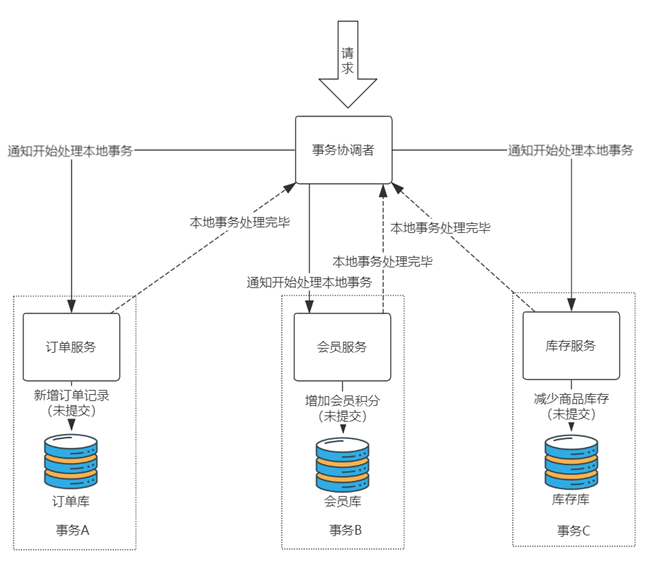
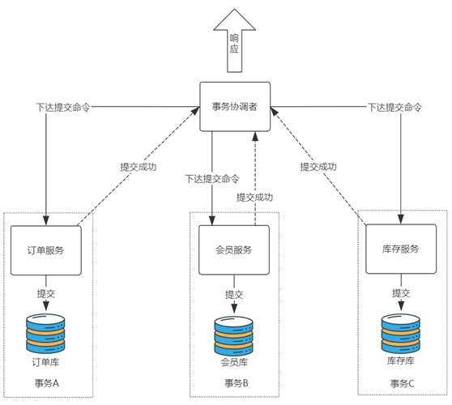
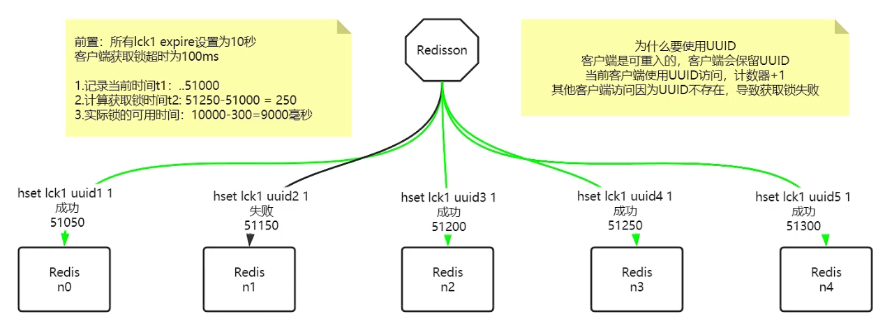
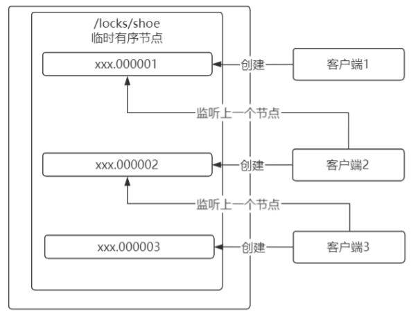
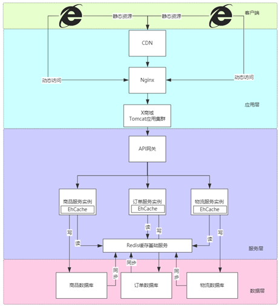
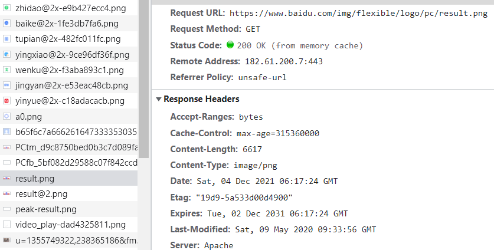
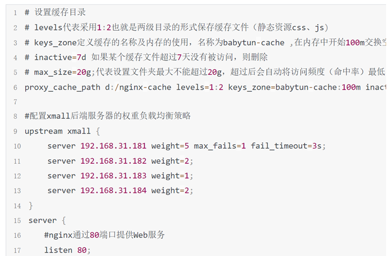
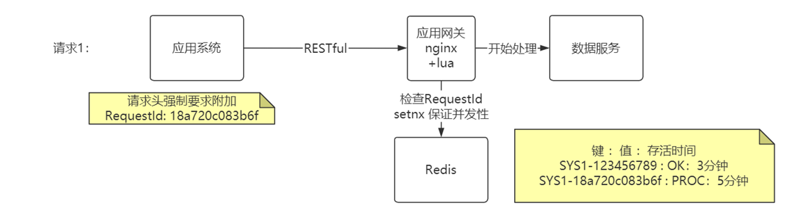
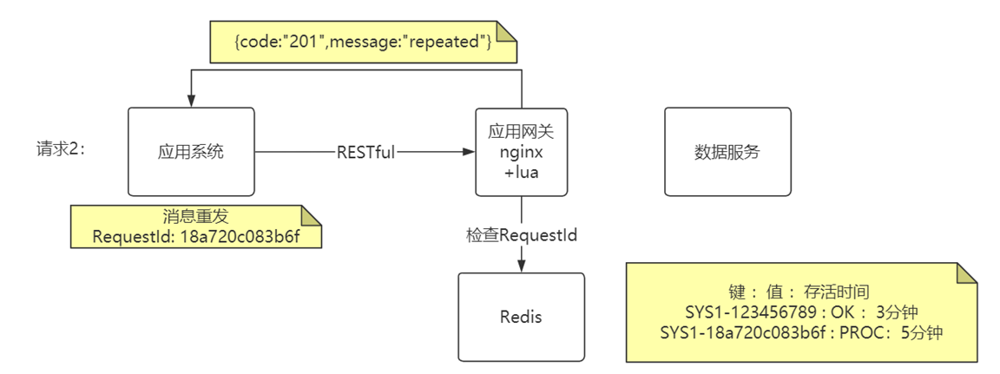
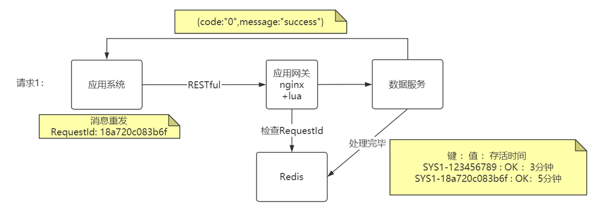

# 分布式理论

## CAP和BASE

**CAP**

当发生网络分区的时候, 如果要继续服务，强一致性和可用性只能2选1.

比如 ZooKeeper、HBase(使用zk选举主节点并保存集群元数据) 就是 CP 架构，Cassandra、Eureka 就是 AP 架构，Nacos 不仅支持 CP 架构也支持 AP 架构。

**BASE**

BASE为Basically Available（基本可用） 、Soft-state（软状态, 允许系统中的数据存在中间状态） 和 Eventually Consistent（最终一致性）

BASE 理论是对 CAP 中一致性 C 和可用性 A 权衡的结果, 是基于CAP定理逐步演化而来的, 大大降低了我们对系统的要求.

BASE 理论的核心思想: 即使无法做到强一致性，但每个应用都可以根据自身业务特点，采用适当的方式来使系统达到最终一致性。

> 保证最终一致性, 通常可通过重试(MQ) , 数据校对程序(可通过定时任务实现 , 本质还是重发, 金融业务使用较多) , APM链路监控系统人工介入

## Zookeeper

Zookeeper的数据存储结构就像一棵树, 由znode组成, 用户可自定义节点具体用途.

> IDEA的zoolytic插件可对znode可视化

**Znode**分为四种类型 :

持久节点 （PERSISTENT） 默认的节点类型。创建节点的客户端与zookeeper断开连接后，该节点依旧存在 ;

持久节点顺序节点（PERSISTENT_SEQUENTIAL） 在持久节点特性上, 按照访问时间的先后顺序进行顺序存储;

临时节点（EPHEMERAL） 和持久节点相反，当创建节点的客户端与zookeeper断开连接后，临时节点会被删除;

临时顺序节点（EPHEMERAL_SEQUENTIAL） 结合和临时节点和顺序节点的特点：在创建节点时，Zookeeper 根据创建的时间顺序给该节点名称进行编号；当创建节点的客户端与zookeeper断开连接(session)后，临时节点会被删除.

> znode通过乐观锁(版本号)机制对setData和delete进行限制防止并发环境下的更新问题.

### 主从架构应用

通常整个ZooKeeper的服务器集群管理着应用协作的关键数据, 而不适应用存储海量应用数据. 因此广泛运用于分布式系统中的主从架构, 如HBase主节点服务器（HMaster）负责跟踪区域服务器（HRegionServer）是否可用, 并分派区域到服务器. ZK在该架构下主要任务为**选举主节点, 跟踪有效的从节点, 维护应用元数据以及任务信息**.

为了避免过多无用的轮询, zk使用基于通知的机制, 使客户端对设置了watch的znode进行监听. zk提供了多种watch: 监控znode的数据变化、监控znode 子节点的变化、监控znode的创建或删除.

> 一个watch只能触发一次通知, 因此为了持续接收通知, 客户端需要在每次通知后设置新的watch. 并且zk通过在设置新的watch前读取zk节点状态避免了错过设置watch前节点的变化

1.**master**

每个集群服务器可通过创建临时节点/master尝试成为master, 并可设置节点内容为master主机信息. 如果已经有master创建了/master节点, slaves则无法创建/master节点, 但可通过监听/master节点获取master状态. 当master宕机时, slave将收到/master的NodeDeleted事件, 从节点因此可以再次尝试创建/master来成为master.

创建三个持久⽗节点/workers、/tasks和/assign, 它们不包含数据, 分别用于保存当前有效slave、当前需要分配的任务和当前任务分配信息. 创建完后master需要对这三个父节点设置watch.

2.**slave**

若尝试创建临时节点/master失败, 则该节点为slave. slave通过在/workers子节点下创建临时子节点来向master通知其可用, 子节点内容为slave主机信息, 创建完成后master将收到/workers的NodeChildrenChanged事件.

slave在/assgin下再创建一个父节点, 并对该父节点设置watch来接收任务分配.

3.**任务分配**

client向系统中添加任务: 在/tasks下创建顺序父节点(任务队列)表示任务, 然后client对该任务顺序节点设置watch.

任务节点创建完成后master将收到/tasks的NodeChildrenChanged事件, master对/tasks下的新任务进行检查后从/workers中获取slaves列表, 从中选取一个slave分配: 在/assign下该slave对应的父节点下创建与任务节点相同名称的节点.

被分配到任务的slave会收到/assign的NodeChildrenChanged事件, 在确认/assign下的任务属于自己后, 执行任务. 当任务执行完后slave会在/tasks下对应任务的顺序父节点下创建一个节点表示任务状态(status).

slave更新完任务状态后client将收到/tasks下对应任务顺序节点的NodeChildrenChanged事件, 获取该任务下的状态节点即可知晓任务执行结果.

### 原理与zab

1.**请求处理**

zk服务器会在本地处理只读请求直接返回给客户端, 包括exists、getData和getChildren; 而那些会改变zk状态的请求, 将被转发给leader.

> 因此zk在处理只读请求时, 性能很高

zk的leader负责对客户端发起的节点状态变更请求进行排序, 包括create、setData和delete操作, 将每个请求转换为一个事务发送给leader.

leader每产生一个事务会为其分配一个事务标识zxid, 用于确保整个集群按照leader确定的顺序接收并处理事务. 并且服务器在重新选举leader时需要交换zxid信息来获取状态同步进度.(顺序一致性)

> zxid为long型整数, 包括32位epoch和32为counter, 

事务为改变zk状态需要执行的步骤, 包括更新节点和更新版本号(不是增加), zk保证所有事务以原子方式执行且不会被干扰(无回滚机制). zk的事务具有幂等性.

> zk最开始以单线程方式来处理事务, 现在增加了多线程支持以提高处理速度

2.**leader选举**(zab)

每个服务器启动后进入loading状态, 向集群中每个服务器发送一个通知消息, 消息中的vote信息包含了服务器标识符sid(配置的myid?)和最近执行的事务zxid.

接收消息的服务器收到vote信息中的zxid与自己的zxid做比较: 若收到的vote信息中的zixd大于自己的zxid, 则将自己的vote信息替换为收到的vote信息重新发送; 若zixd相等但收到的vote信息中的sid大于自己的sid则替换为收到的vote信息重新发送; 其他情况维持自己的vote. 即拥有最新zxid的服务器将赢得选举.

当某个服务器得到`quorum`个投票时, 更新状态为leading; 其他服务器更新为following并尝试连接leader然后进行状态同步, 在同步完成之后才能进处理新的请求, 从而进入下面的广播模式.

3.**事务提交**(zab)

follower接收到写状态请求后会转发给leader, leader会为每个请求生成一个proposal进行广播, 在进行广播前leader会为该事务生成递增的唯一id(zxid), 过程类似2PC:

①leader向followers发送proposal消息;

②follower接收到消息后, 检查该proposal是否属于自己所追随的leader, 若是则响应leader一个ACK消息;

③当leader收到`querum`个(包括自己)ACK消息后, 向followers发送commit消息通知提交.

> zxid高32位为epoch纪元, 低32位是counter计数器, 

> ⼀个被选举的群首确保在提交完所有之前的时间戳内需要提交的事务, 之后才开始⼴播新的事务. 以此保证事务提交顺序.

## Raft

分布式一致性算法, 通过一切以领导者为准的方式, 实现一系列值的共识和各节点日志的一致.

现在流行的组件 Etcd、Consul、Nacos、RocketMQ、Redis Sentinel 底层都是采用Raft算法来确认集群中的主节点, 再通过主节点向其他节点下发指令.

**Raft选举过程**

1.初始状态

集群中所有节点都是跟随者的状态, Term为 0, 超时时间随机的特性(防止所有节点同一时间向其他节点发起投票)。

2.发起投票

若超时时间最短的A节点的超时时间到了后, 增加自己的Term编号, 并A推选自己成为候选者, 然后给自己投了一票(Vote Count = 1), 最后向其他节点发送请求投票的RPC消息.

3.成为领导者的过程

其他节点接收到节点 A 发送的请求投票的RPC消息后, 在编号为 1 的Term内, 还没有进行过投票, 就把选票投给节点 A, 并增加自己的任期编号.

若节点A(候选者)得到了大多数(n/2+1)的选票, 将成为本次Term的领导者.

> 如果一个节点发现自己的Term比其他节点小(如宕机恢复时), 会将自己变为跟随者, 并更新到大的Term, 等待该Term下的领导者的心跳消息; 
> 
> 若一个节点接收到小于自己的Term的消息, 将直接拒绝.
> 
> 以上通过日志项的任期编号来判断, 领导者通过日志复制RPC消息将日志项复制到其他节点上, 

领导者定时给跟随者发送心跳信息, 阻止他们发起选举.

4.触发新的一轮选举

若跟随者在其等待时间未收到领导者的心跳消息, 则超时的跟随者节点称为候选人, 重新发起投票选举.

## 数据一致性

分布式锁是解决并发时资源争抢的问题，分布式事务和本地事务是解决流程化提交问题。

### 分布式事务

分布式事务就是指事务的资源分别位于不同的分布式系统的不同节点之上的事务

#### 2PC

二阶段提交指为了使基于分布式系统架构下的所有节点在进行事务提交时保持一致性而设计的算法. 具体思路为: 参与者将操作成败通知协调者,再由协调者根据所有参与者的反馈情况决定各参与者是否要提交操作还是中止操作.

实现了XA规范(定义了TM和RM)

**准备阶段**: 事务协调者(事务管理器)给每个参与者(资源管理器)发送Prepare消息, 每个参与者要么直接返回失败,要么在本地执行事务并写本地redo和undo日志,但不提交,达到"万事俱备只欠东风"的状态.



**提交(回滚)阶段**:如果协调者收到了参与者的失败消息或者超时, 直接给每个参与者发送回滚消息; 否则发送提交消息. 参与者再根据协调者的指令执行提交或回滚操作, 释放所有事务处理过程中使用的锁资源 



缺点:

1.同步阻塞: 执行过程中,所有参与者节点都是事务阻塞型的.  当参与者占有公共资源时, 其他第三方节点访问公共资源不得不处于阻塞状态(本地事务排他锁),且占用数据库连接资源, 因为没有提交, 严重会导致崩溃.

2.单点故障: 因为协调者的重要性, 一旦其发送故障. 参与者会一直阻塞下去. 特别是在第二阶段的时候(选举新协调者通常也无法解决该问题).

3.数据不一致: 在二阶段提交的时候, 协调者向参与者发送commit请求后发生了局部网络异常或协调者中途出现故障, 会导致只有一部分参与者接收到commit请求执行操作, 整个系统出现数据不一致现象.

解决方案:  手动补偿(TCC)或脚本补偿.

#### 3PC

**CanCommit阶段**: 

1.事务询问: 协调者向参与者发送CanCommit请求, 询问是否可以执行事务提交操作, 然后等待参与者的响应.

2.响应反馈: 参与者接收到CanCommit请求后, 正常情况下如果其**认为**可以顺利执行事务, 则返回Yes响应, 并进入预备状态, 否则返回No.

**PreCommit阶段** : 

如果协调者从所有参与者获得的返回都是Yes响应, 那么就开始事务的预执行:

1.发送预提交请求: 协调者向参与者发送PreCommit请求, 并进入Prepared状态.

2.事务预提交:参与者接收到PreCommit请求后, 会执行事务操作, 并将undo和redo信息记录到事务日志中.

3.响应反馈: 如果参与者成功的执行了事务操作, 则返回ACK响应, 同时开始等待最终指令.

如果任何一个参与者向协调者发送了No响应, 或等待超时之后, 协调者都没有收到参与者的响应, 那么就执行事务的中断.

1.发送中断请求: 协调者向所有参与者发送abort请求.

2.中断事务: 参与者收到来自协调者的abort请求之后(或超时) , 执行事务的中断

**DoCommit阶段**

如果协调者从所有参与者获得的返回都是ACK响应, 执行**事务提交**:

1.发送提交请求: 协调者收到参与者发送的ACK响应后将从预提交状态进入提交状态. 并向所有参与者发送DoCommit请求.

2.事务提交: 参与者接收到doCommit请求之后, 执行正式的事务提交. 并在完成事务提交之后释放所有事务资源.

3.响应反馈: 事务提交完之后, 向协调者发送ACK响应.

4.完成事务: 协调者接收到所有参与者的ACK响应后, 完成事务.

如果协调者接收到参与者发送的响应不是ACK,或响应超时, 执行**中断事务**

1.发送中断请求:协调者向所有参与者发送abort请求.

2.事务回滚: 参与者收到abort请求(或超时)之后, 利用其在阶段二记录的undo信息执行事务的回滚操作, 并在完成回滚之后释放掉所有的事务资源.

3.反馈结果: 参与者完成事务回滚之后, 向协调者发送ACK消息.

4.中断事务: 协调者接收到参与者反馈的ACK响应后, 执行事务的中断.

**2PC与3PC的区别**:

1.3PC比2PC多了CanCommit阶段, 不占用资源只校验一下sql, 如果不能执行可直接中断, 进而减少了不必要的资源浪费.

2.3PC在PreCommit和DoCommit阶段对参与者增加了超时机制(防止阻塞), 而2PC只有协调者有超时机制.

> 虽然引入了参与者超时机制, 防止数据库长时间阻塞, 但会破坏一致性. 通常做法为异步补偿, 日终补偿, 完整性校验, 人工补录.

#### TCC

**Try-Confirm-Cancel**: 又称为二阶段补偿事务, 2PC的-prepare-commit-rollback对应TCC的try-confirm-cancel, 区别在于2PC对于开发者层面是无法感知的, 给数据库做资源操作; 而TCC是站在开发者层面的, 三个阶段对资源的操作需要开发者自己实现, 通常通过修改表结构增加字段实现. 

Try: 业务检查阶段, 主要进行业务校验和检查或者资源预留, 也可能是直接进行业务操作.

Confirm: 业务确认阶段, 对Try阶段校验过的业务或预留资源进行确认.

Cancel: 业务回滚阶段, 和Confirm是互斥的, 用于释放Try阶段预留资源业务.

**TCC如何解决一致性问题**?

比如在A给B转账100元的场景下的简单流程:

**Try阶段**
A: 余额减100, 冻结字段加100;
B: 冻结字段加100
**confirm阶段**
A: 冻结字段减100;
B:冻结字段减100, 余额加100
**cancel阶段**
A: 余额加100, 冻结字段减100;
B:冻结字段减100

在销售与库存业务中, 也可以升级为:

**Try阶段**
订单服务:修改订单的状态为**支付中**
账户服务:账户余额不变，可用余额减1，然后将1这个数字冻结在一个单独的字段里
库存服务:库存数量不变，可销售库存减1，然后将1这个数字冻结在一个单独的字段里
**confirm阶段**
订单服务:修改订单的状态为**支付完成**
账户服务:账户余额变为(当前值减冻结字段的值)，可用余额不变(Try阶段减过了),冻结字段清0。
库存服务:库存变为(当前值减冻结字段的值)，可销售库存不变(Try阶段减过了)，冻结字段清0。
**cancel阶段**
订单服务:修改订单的状态为**未支付**
账户服务:账户余额不变，可用余额变为(当前值加冻结字段的值)，冻结字段清0。
库存服务:库存不变，可销售库存变为(当前值加冻结字段的值)，冻结字段清0。

**TCC存在的问题**

**TCC空回滚**: 指的是没有调用TCC资源Try方法的情况下, 调用了二阶段的Cancel方法. 

比如当Try请求由于网络延迟或故障等原因, 没有对数据执行修改而返回异常, 这时如果Cancel进行了对数据的修改会导致数据不一致.

解决思路的关键是要识别出这个空回滚: 需要知道Try阶段是否执行, 如果执行了就正常回滚, 否则空回滚.

可通过分支**事务记录表**实现, 在第一阶段Try中会插入一条记录表示Try阶段执行了. Cancel中读取该记录, 如果存在, 则正常回滚, 否则空回滚.

**TCC悬挂问题**: 指的是二阶段Cancel比Try先执行.

出现的原因为调用分支事务Try时, 由于网络拥堵造成超时, TM就会通知RM回滚该事务, 在回滚完成后, Try请求才到达参与者执行完成.

对于这种情况下Try阶段预留的业务资源就再也没有人能处理了 , 所以称为空悬挂.

可通过**分支事务表**实现, 在执行Try前, 判断当前全局事务下是否有二阶段事务记录, 如果有则不执行Try.

**幂等性问题**: 当Try方法之后的Confirm或Cancel失败, 会触发Retry对其他们进行重试, 因此需要保证TCC下的二阶段Confirm和Cancel接口幂等性.

可通过**分支事务表**记录执行状态, 每次二阶段执行前查看该状态. 

> TCC设计之初就认为C/C一定会成功, 但事实并不如意. 可以将大部分工作放到try阶段, 尽量少的工作放到C/C阶段.

#### 消息事务

通过可靠消息服务实现最终一致性: 事务发起方执行完本地事务后, 发出一条消息, 事务参与方一定能够接收消息并可以成功处理自己的事务.

需要通过[本地消息表](./middleware#本地消息表保障最终一致性)保证事务一致性

### 分布式锁

适用于金融交易等数据一致性要求高但并发要求不高(不需要立即返回结果)的场合

在分布式系统下 ,由于每个服务部署在独立的机器, 运行的应用更是独立的进程, 传统的上锁因为只针对一个jvm中多个线程起到同步作用, 因此是无效的.

适用分布式锁有以下几个场景： 

数据价值大，必须要保证一致性的。例如：金融业务系统间的转账汇款等。 

> 为了减少分布式锁中间件的IO性能, 可以配合jvm锁同时使用, 减少落到分布式锁上的线程数.

> 分布式锁有两大类:
> 
> 1. 类似CAS自旋式分布式锁: mysql, redis
> 2. event事件通知: zk, etcd

#### 数据库

数据库方式通常都需要加入CAS自旋.

**MySQL**

①表增加唯一索引 

②加锁：执行insert语句，若报错，则表明加锁失败

③解锁：执行delete语句

**Redis**

基于redis的worker单线程的串行执行命令原理

①加锁：执行setnx，若成功再执行expire添加过期时间 (如果key到期但事务还未处理完需要考虑延期问题)

②解锁：执行delete命令

缺点:

1.setnx和expire分2步执行，非原子操作(2.6.12 set支持ex nx参数)；

2.如果key到期但事务还未处理完需要考虑延期问题;

3.delete命令误删除非当前线程持有的锁(如key到期后再delete删除了其他线程持有的锁), 需要通过唯一value解决, 先匹配再删除(原子问题又来了?);

4.不支持阻塞等待、不可重入 ;

5.主从同步可能出现锁丢失问题;

**MongoDB**

①加锁：执行findAndModify原子命令查找document，若不存在则新增

②解锁：删除document

缺点:

1.锁无超时自动失效机制，有死锁风险 

2.不支持锁重入，不支持阻塞等待

3.操作数据库开销大，性能不高

#### Redission

对Redis+Lua实现锁进行了封装, 并解决了原生Redis实现存在的多种问题.

```java
// 构造redisson实现分布式锁必要的Config
Config config = new Config();
config.useSingleServer().setAddress("redis://172.29.1.180:5379").setPassword("a123456").setDatabase(0);
// 构造RedissonClient
RedissonClient redissonClient = Redisson.create(config);
// 设置锁定资源名称
RLock disLock = redissonClient.getLock("DISLOCK");
boolean isLock;
try {
    //尝试获取分布式锁
    isLock = disLock.tryLock(500, 15000, TimeUnit.MILLISECONDS);
    if (isLock) {
        //TODO if get lock success, do something;
        Thread.sleep(15000);
    }
} catch (Exception e) {
} finally {
    // 无论如何, 最后都要解锁
    disLock.unlock();
}
```

实现为Lua脚本:

1.加锁

KEYS[1] : 锁名

ARGV[1] : 持有锁的有效时间,默认30s

ARGV[2] :  唯一标识, 防止误删

```lua
-- 若锁不存在：则新增锁，并设置锁重入计数为1、设置锁过期时间
if (redis.call('exists', KEYS[1]) == 0) then
    redis.call('hset', KEYS[1], ARGV[2], 1);
    redis.call('pexpire', KEYS[1], ARGV[1]);
    return nil;
end;

-- 若锁存在，且唯一标识也匹配：则表明当前加锁请求为锁重入请求，故锁重入计数+1，并再次设置锁过期时间
if (redis.call('hexists', KEYS[1], ARGV[2]) == 1) then
    redis.call('hincrby', KEYS[1], ARGV[2], 1);
    redis.call('pexpire', KEYS[1], ARGV[1]);
    return nil;
end;

-- 若锁存在，但唯一标识不匹配：表明锁是被其他线程占用，当前线程无权解他人的锁，直接返回锁剩余过期时间
return redis.call('pttl', KEYS[1]);
```

2.解锁

KEYS[1] : 锁名

KEYS[2] : 解锁消息PubSub频道

ARGV[1] : 重入数量 , 0标识解锁消息.    

ARGV[2] : 持有锁的有效时间

ARGV[3] : 唯一标识, set时设置的

```lua
-- 若锁不存在：则直接广播解锁消息，并返回1
if (redis.call('exists', KEYS[1]) == 0) then
    redis.call('publish', KEYS[2], ARGV[1]);
    return 1; 
end;

-- 若锁存在，但唯一标识不匹配：则表明锁被其他线程占用，当前线程不允许解锁其他线程持有的锁
if (redis.call('hexists', KEYS[1], ARGV[3]) == 0) then
    return nil;
end; 

-- 若锁存在，且唯一标识匹配：则先将锁重入计数减1
local counter = redis.call('hincrby', KEYS[1], ARGV[3], -1); 
if (counter > 0) then 
    -- 锁重入计数减1后还大于0：表明当前线程持有的锁还有重入，不能进行锁删除操作，帮忙设置下过期时期
    redis.call('pexpire', KEYS[1], ARGV[2]); 
    return 0; 
else 
    -- 锁重入计数已为0：间接表明锁已释放了。直接删除掉锁，并广播解锁消息，去唤醒那些争抢过锁但还处于阻塞中的线程
    redis.call('del', KEYS[1]); 
    redis.call('publish', KEYS[2], ARGV[1]); 
    return 1;
end;

return nil;
```

#### Redlock

为了解决Redis(或配合Lua)只能作用在一个Redis节点上, 即使通过sentinel保证高可用, 主从切换时也会出现锁丢失的情况(因为其异步复制),  Redis作者antirez基于分布式环境下提出了一种更高级的分布式锁的实现方式：RedLock

**该锁由Client实现而非Redis实现**.

具体实现为在redis分布式环境中,对于N个完全独立的节点:

1.依次尝试从N个节点使用相同的key和**具有唯一性的value**获取锁, 并**设置超时时间**(需要小于锁的失效时间);

2.当且仅当从**大多数的Redis节点**都取到锁, 锁才算获取成功,  当前时间减去开始获取锁的时间得到锁的使用时间。

Redisson对Redlock进行了实现:RedissonRedLock

```java
Config config1 = new Config();
config1.useSingleServer().setAddress("redis://172.29.1.180:5378")
        .setPassword("a123456").setDatabase(0);
RedissonClient redissonClient1 = Redisson.create(config1);

Config config2 = new Config();
config2.useSingleServer().setAddress("redis://172.29.1.180:5379")
        .setPassword("a123456").setDatabase(0);
RedissonClient redissonClient2 = Redisson.create(config2);

Config config3 = new Config();
config3.useSingleServer().setAddress("redis://172.29.1.180:5380")
        .setPassword("a123456").setDatabase(0);
RedissonClient redissonClient3 = Redisson.create(config3);

String resourceName = "REDLOCK";
RLock lock1 = redissonClient1.getLock(resourceName);
RLock lock2 = redissonClient2.getLock(resourceName);
RLock lock3 = redissonClient3.getLock(resourceName);

RedissonRedLock redLock = new RedissonRedLock(lock1, lock2, lock3);
boolean isLock;
try {
    isLock = redLock.tryLock(500, 30000, TimeUnit.MILLISECONDS);
    System.out.println("isLock = "+isLock);
    if (isLock) {
        //TODO if get lock success, do something;
        Thread.sleep(30000);
    }
} catch (Exception e) {
} finally {
    // 无论如何, 最后都要解锁
    System.out.println("");
    redLock.unlock();
}
```

**Watch Dog自动续租机制**

在上锁成功后，Redisson会调用renewExpiration()方法开启一个Watch Dog线程，为锁自动续期。每过1/3时间续一次，成功则继续下一次续期，失败取消续期操作:

```java
private void renewExpiration() {
    ExpirationEntry ee = EXPIRATION_RENEWAL_MAP.get(getEntryName());
    if (ee == null) {
        return;
    }

    Timeout task = commandExecutor.getConnectionManager().newTimeout(timeout -> {
        ExpirationEntry ent = EXPIRATION_RENEWAL_MAP.get(getEntryName());
        if (ent == null) {
            return;
        }
        Long threadId = ent.getFirstThreadId();
        if (threadId == null) {
            return;
        }

        RFuture<Boolean> future = renewExpirationAsync(threadId);
        future.onComplete((res, e) -> {
            if (e != null) {
                log.error("Can't update lock " + getRawName() + " expiration", e);
                EXPIRATION_RENEWAL_MAP.remove(getEntryName());
                return;
            }

            if (res) {
                // reschedule itself
                renewExpiration();
            } else {
                cancelExpirationRenewal(null);
            }
        });
    }, internalLockLeaseTime / 3, TimeUnit.MILLISECONDS);

    ee.setTimeout(task);
}
```

具体续租lua脚本:

```java
protected RFuture<Boolean> renewExpirationAsync(long threadId) {
    return evalWriteAsync(getRawName(), LongCodec.INSTANCE, RedisCommands.EVAL_BOOLEAN,
                          "if (redis.call('hexists', KEYS[1], ARGV[2]) == 1) then " +
                          "redis.call('pexpire', KEYS[1], ARGV[1]); " +
                          "return 1; " +
                          "end; " +
                          "return 0;",
                          Collections.singletonList(getRawName()),
                          internalLockLeaseTime, getLockName(threadId));
}
```

**底层原理**



若未超过半数节点获取到锁, 则删除已有锁.

手动释放锁时, 执行hincrby -1即可, 若计数器归零, 则删除key.

#### zookeeper

> zk本身并没有提供分布式锁的概念, 而是基于其节点特性提供的.
> 
> 临时顺序节点：在创建节点时，Zookeeper 根据创建的时间顺序给该节点名称进行编号；当创建节点的客户端与zookeeper断开连接(session)后，临时节点会被删除。

加锁：在/lock目录下创建临时有序节点，判断创建的节点序号是否最小。若是，则表示获取到锁；否则watch /lock目录下序号比自身小的前一个节点 .

解锁：删除节点

利用临时顺序节点以及watch可以避免“惊群效应”，当某一个客户端释放锁以后，其他客户端不会一 窝蜂的涌入争抢锁资源，而是按时间顺序一个一个来获取锁进行处理:



> 如果客户端与zk之间存在网络问题, session超时同样会断开导致锁释放而无法完全保证一致

Curator框架已原生支持分布式锁命令:

```xml
<dependency>
    <groupId>org.apache.curator</groupId>
    <artifactId>curator‐recipes</artifactId>
    <version>5.2.0</version>
</dependency>
```

模拟简单防止商品超卖, 强制将并行变为串行...

```java
import org.apache.curator.RetryPolicy;
import org.apache.curator.framework.CuratorFramework;
import org.apache.curator.framework.CuratorFrameworkFactory;
import org.apache.curator.framework.recipes.locks.InterProcessMutex;
import org.apache.curator.retry.ExponentialBackoffRetry;

@Service
public class WarehouseService {
    public static int shoe = 10;

    public int outOfWarehouseWithLock() throws Exception {
        //设置ZK客户端重试策略, 如果无法获取锁资源, 则每隔5秒重试一次，最多重试10次
        RetryPolicy policy = new ExponentialBackoffRetry(5000, 10);

        //创建ZK客户端，连接到Zookeeper服务器
        CuratorFramework client = CuratorFrameworkFactory.builder().connectString("192.168.31.103:2181").retryPolicy(policy).build();
        //创建与Zookeeper服务器的连接
        client.start();

        //声明锁对象，本质就是ZK顺序临时节点
        final InterProcessMutex mutex = new InterProcessMutex(client, "/locks/wh-shoe");
        try {
            //请求锁，创建锁
            mutex.acquire();
            //处理业务逻辑
            if (WarehouseService.shoe > 0) {
                Thread.sleep(1000);
                //扣减库存
                return --WarehouseService.shoe;
            } else {
                //库存不足
                throw new RuntimeException("运动鞋库存不足");
            }
        } finally {
            //释放锁
            mutex.release();
        }
    }
}
```

> 可通过jmeter+zoolytic(zk可视化插件)加入断点调试查看zk变化, 验证流程

## 缓存



### 客户端缓存

html中图片,css,js,字体等静态资源进行缓存.

以百度logo图为例,通过请求头Expires属性指定过期实现



status code后面可能为  

from memory cache  (不关闭浏览器多次访问)

或者 

from disk cache  (在访问过的前提下重启浏览器访问)

> 前端页面可以手动缓存到LocalStorage(h5) , 不过期, 可通过js封装有效期

可通过服务器进行设置:

```java
@Configuration
@EnableWebMvc
public class WebConfig implements WebMvcConfigurer {
     @Override
     public void addResourceHandlers(ResourceHandlerRegistry registry) {
         registry.addResourceHandler("/resources/**")
                 .addResourceLocations("/public", "classpath:/static/")
                 .setCacheControl(CacheControl.maxAge(Duration.ofDays(365)));
     }
}
```

### 应用层缓存

客户端缓存的Expires响应头的属性, 是在CDN内容分发网络中设置.

CDN是互联网静态资源分发的主要技术手段.

比如将北京的静态资源缓存到上海的服务器,上海的用户就近访问静态资源.

CDN的核心技术为**智能DNS**, 根据用户id自动访问就近CDN节点,如果就近节点不存在资源,则由就近CDN节点访问源节点抽取数据再返回(**回源**)

>  比如租用阿里云CDN服务,除了 缓存文件外,还可以在后台为其设置缓存的属性,如之前的Expires,Cache-Control.

>  Expires是指定具体某个时间点缓存到期, 而Cache-Control则代表缓存的有效期是多长时间.

另外Nginx是跨平台高性能web服务器, 比如后端的tomcat服务器可通过Nginx做前置的软负载均衡,为应用提供高可用性. 

但通常来自全国各地的访问用户对资源响应速度和带宽要求较高,所以通常选择CDN内容分发.

而在一些企业级应用中,用户分布在固定场所且并发度不高, 不需要部署CDN这样重量级解决方案,通常只需要单独部署一台nginx服务器,利用其自带的资源缓存能力以及压缩功能即可.

nginx设置静态资源缓存配置如下:



设置缓存之后,nginx在本地用一个个目录进行缓存.

### 服务器缓存

客户端缓存和应用层缓存都是对静态资源进行缓存

服务器缓存可分为

进程内(本地)缓存:本地开辟一块内容空间作为缓存, 如 hibernate,mybatis一二级缓存,springmvc页面缓存,ehcache;

进程外缓存:独立部署的分布式集中缓存,比如redis.

缓存对读写性能的提升:

- 读优化：当请求命中缓存后，可直接返回，从而略过IO读取，减小读的成本。
- 写优化：将写操作在缓冲中合并，让IO设备可以批量处理，减小写的成本(MySQL Insert Buffer)。

加缓存并不是简单的加一个分布式缓存即可, 这是不严谨的.  分布式缓存也将成为瓶颈，高频的QPS是一笔负担; 另外缓存驱逐以及网络抖动会影响系统的稳定性，此时引入本地缓存, 可以减轻分布式缓存的压力,  并减少网络以及序列化开销。

缓存策略需要按照 **先近到远，先快后慢逐级访问**

> 多级缓存策略可引入消息队列（MQ）的主动推送变更实例进行更新, 提供一致性.

多级缓存适用场景:
1、缓存数据稳定
2、可能产生高并发场景（12306）应用启动时进行预热处理，访问前将热点数据先缓存，减少后端压力
3、一定程度上允许数据不一致不重要的信息更新处理方式：T+1,ETL日终处理把数据进行补全.

### 缓存读写策略

**Cache Aside Pattern** 旁观缓存

写: 先更新 DB, 然后删除 Cache 

读: 从 Cache 中读取，若不存在从 DB 读再存到 Cache

> 如果采用"先删缓存, 再写库" , 在更新线程1删除id=1的cache后, 如果线程2来读取id=1,因为cache不存在, 线程2直接请求db然后写cache, 然后线程1最后写db , 这样就导致了cache与db数据不一致问题. 这种方式下的**不一致时间窗口为缓存过期或下一次删缓存**.
> 
> 如果采用“先写库，再删缓存”, 也存在不一致的情况, 在读取线程1查询id=1的数据, cache不存在直接查询db, 此时更新线程2先更新id=1的db数据,  这时线程1将cache设置为查询后的值, 然后线程2删除cache.  **整个过程存在极短的不一致时间窗口: 查询线程写cache后到更新线程删cache这段时间存在不一致**.
> 
> "先写库，再删缓存" , 也存在一种极端情况为 : 在上面的最后两个操作顺序调换, 即线程2先删除cache, 线程1再设置cache为查询后的值 这种情况的不一致时间窗口与"先删缓存, 再写库"一样.
> 
> 可通过**延迟双删**解决: 在更新db操作完成后,对cache删除后通过定时任务或MQ延迟消息, 在一定时间(1s-2s)之后再删除一次cache.  这样**不一致时间窗口限定在两次删除之间的时间间隔**.
> 
> Cache Aside Pattern + 延迟双删 可视为BASE的一种实现

**Read/Write Through Pattern** 读写穿透

写：先查 cache, 若不存在，则更新 DB; 若存在, 则同步更新 Cache 和 DB

读 :  从 cache 中读取 ; 若不存在, 则先从 DB 加载到 Cache, 再返回

>  Read-Through Pattern 特点为: 将 Cache 视为主要数据存储,  Cache负责对 DB 的读取和写入, 减轻应用程序的职责 ( Guava的LoadingCache? LoadingCache还保证了加载Cache的线程同时只有一个)

3.**Write Behind Pattern**异步缓存写入

与Read/Write Through Pattern类似, 将 Cache 视为主要数据存储,  区别在于写只更新缓存，不直接更新 DB，而是采用异步批量的方式来更新 DB. ( MySQL Insert Buffer, MQ异步写入磁盘)

> Write Behind Pattern 的写性能非常高，非常适合一些数据经常变化又对数据一致性要求不高且数据不重要(会丢失)的场景，比如浏览量、点赞量。

## 幂等性

**指的是发一次接口调用与发多次相同的接口消息都能得到与预期相符的结果**

在实际应用中 , 为了提高通信的可靠性,通信框架/MQ可能会向数据服务推送多条相同的信息 , 如

```
PUT https://xxxxx.com/employee/salary
{"id" : "1:,"incr_salary":500}
```

后台逻辑为

```
//典型的ORM做法
Employee employee = employeeService.selectById(1);
employee.setSalary(employee.getSalary() + incrSalary);
employeeService.update(employee)
```

问题在于每重复发送一次请求工资就会多500

解决办法:

1.代码前置判断

```
if(!员工已调薪){进行调薪}
```

缺点: 项目中需要前置判断的地方太多了，一不留神就漏了 , 这种技术问题不应该成为干扰程序员写业务代码的因素

所以需要一种无侵入的幂等解决方案.

2.**幂等表**

应用系统发送请求,



应用系统再次请求, redis中已经存在requestid



数据服务处理完更新,修改redis中value



> requestId可通过后端生成, 在每次访问应用中可能应发幂等性问题的页面时返回.
> 
> 如果提交表单中存在唯一约束,可以将该唯一约束缓存来替代requestId, 比如用户名唯一. 操作完对缓存进行及时删除.

**幂等失效**

如果请求并发访问，在首次请求完成修改服务端状态前，并发的其他请求和首次请求都通过了幂等判断，对数据库状态进行了多次修改。会导致幂等失效.

如果是新增数据, 可以通过数据库的唯一索引解决问题.

对于修改, 通过只能使用分布式锁来解决了.

## APM链路跟踪

指运行时通过某种方式记录下服务之间的调用过程, 在通过可视化的UI界面快速定位到出错点.

- 基于日志收集调用链路:Sleuth & Zipkin

Sleuth额外生成链路跟踪日志, 如

```
2021-01-01 15:00:31.441 INFO [a-serivce, 4f34v3c5545646,x234v543534,true]
```

该格式为OpenTracing规范, OpenTracing为一致的链路追踪日志规范与API接口, 格式为

```
[微服务ID,Trace ID,Span ID,导出标识]
```

比如下单业务需要经过订单服务->库存服务->账务服务, 这三个步骤的Trace ID相同, 每个步骤的Span ID不同; 

导出标识表示日志是否被发送给了日志收集组件(如Zipkin).

> Sleuth只需要导入springboot依赖即可产生该日志

侵入代码, Zipkin为推特开发的分布式链路追踪系统, Zipkin客户端收集Sleuth产生的日志发送到Zipkin服务端, Zipkin服务端采用可视化方式展示.

- 基于Agent(运行时二进制)收集调用链路:SkyWalking

```
java -javaagent:skywalking-agent.jar
-Dskywalking.agent.service_name=a-service
-Dskywalking.collector.backend_serivce=192.168.31.10:11800
-Dskywalking.logging.file_name=a-serivce-api.log
-jar a-service.jar 
```

不侵入, 但侵入程序运行过程, 监听代码执行过程进行, 对调用关系进行梳理. 其收集的指标比日志方式要多很多.

> 链路跟踪产品还有pinpoint,istio,cat,jeager等等
