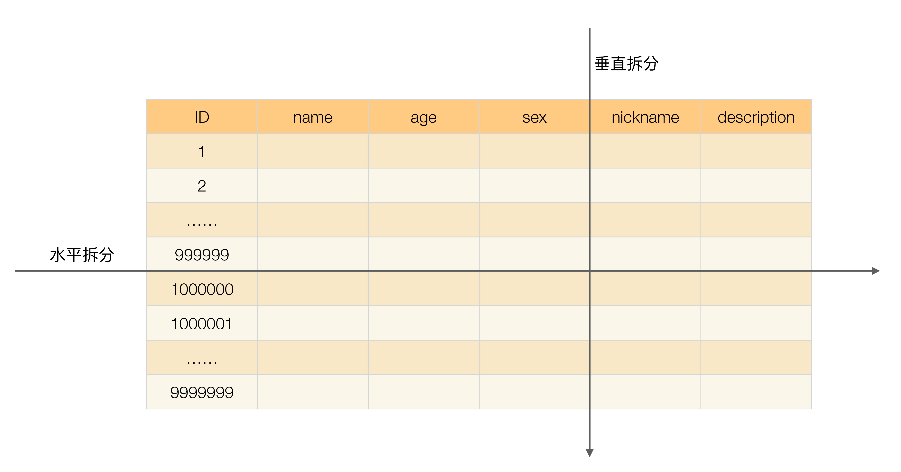

分布式或者说 SOA 分布式重要的就是面向服务，说简单的分布式就是我们把整个系统拆分成不同的服务然后将这些服务放在不同的服务器上减轻单体服务的压力提高并发量和性能。比如电商系统可以简单地拆分成订单系统、商品系统、登录系统等等，拆分之后的每个服务可以部署在不同的机器上，如果某一个服务的访问量比较大的话也可以将这个服务同时部署在多台机器上。

# CAP和BASE理论

**CAP**

当发生网络分区的时候，如果我们要继续服务，那么强一致性和可用性只能 2 选 1。也就是说当网络分区之后 P 是前提，决定了 P 之后才有 C 和 A 的选择。也就是说分区容错性（Partition tolerance）我们是必须要实现的。

**为啥不可能选择 CA 架构呢？** 举个例子：若系统出现“分区”，系统中的某个节点在进行写操作。为了保证 C， 必须要禁止其他节点的读写操作，这就和 A 发生冲突了。如果为了保证 A，其他节点的读写操作正常的话，那就和 C 发生冲突了。

**如果网络分区正常的话（系统在绝大部分时候所处的状态），也就说不需要保证 P 的时候，C 和 A 能够同时保证。**

比如 ZooKeeper、HBase 就是 CP 架构，Cassandra、Eureka 就是 AP 架构，Nacos 不仅支持 CP 架构也支持 AP 架构。


**BASE**

**BASE** 是 **Basically Available（基本可用）** 、**Soft-state（软状态）** 和 **Eventually Consistent（最终一致性）** 三个短语的缩写。BASE 理论是对 CAP 中一致性 C 和可用性 A 权衡的结果，其来源于对大规模互联网系统分布式实践的总结，是基于 CAP 定理逐步演化而来的，它大大降低了我们对系统的要求。

**BASE 理论的核心思想**

即使无法做到强一致性，但每个应用都可以根据自身业务特点，采用适当的方式来使系统达到最终一致性。

> 也就是牺牲数据的一致性来满足系统的高可用性，系统中一部分数据不可用或者不一致时，仍需要保持系统整体“主要可用”。

**BASE 理论本质上是对 CAP 的延伸和补充，更具体地说，是对 CAP 中 AP 方案的一个补充。**

AP 方案只是在系统发生分区故障的时候放弃一致性，而不是永远放弃一致性。在分区故障恢复后，系统应该达到最终一致性。这一点其实就是 BASE 理论延伸的地方。

1.基本可用

基本可用是指分布式系统在出现不可预知故障的时候，允许损失部分可用性。但是，这绝不等价于系统不可用。

什么叫允许损失部分可用性呢？

- 响应时间上的损失: 正常情况下，处理用户请求需要 0.5s 返回结果，但是由于系统出现故障，处理用户请求的时间变为 3 s。
- 系统功能上的损失：正常情况下，用户可以使用系统的全部功能，但是由于系统访问量突然剧增，系统的部分非核心功能无法使用。

2.软状态

软状态指允许系统中的数据存在中间状态（**CAP 理论中的数据不一致**），并认为该中间状态的存在不会影响系统的整体可用性，即允许系统在不同节点的数据副本之间进行数据同步的过程存在延时。

3.最终一致性

最终一致性强调的是系统中所有的数据副本，**在经过一段时间的同步后，最终能够达到一个一致的状态**。因此，最终一致性的本质是需要系统保证最终数据能够达到一致，而不需要实时保证系统数据的强一致性。

> 分布式一致性的 3 种级别：
>
> 1. **强一致性** ：系统写入了什么，读出来的就是什么。
> 2. **弱一致性** ：不一定可以读取到最新写入的值，也不保证多少时间之后读取到的数据是最新的，只是会尽量保证某个时刻达到数据一致的状态。
> 3. **最终一致性** ：弱一致性的升级版，系统会保证在一定时间内达到数据一致的状态。
>

Q:如何保证最终一致性?

A:重试(MQ) , 数据校对程序(可通过定时任务实现 , 本质还是重发, 金融业务使用较多) , APM链路监控系统人工介入

# 高可用

高可用描述的是一个系统在大部分时间都是可用的，可以为我们提供服务的。高可用代表系统即使在发生硬件故障或者系统升级的时候，服务仍然是可用的。

原因:

- 黑客攻击；
- 硬件故障，比如服务器坏掉。
- 并发量/用户请求量激增导致整个服务宕掉或者部分服务不可用。
- 代码中的坏味道导致内存泄漏或者其他问题导致程序挂掉。
- 网站架构某个重要的角色比如 Nginx 或者数据库突然不可用。
- 自然灾害或者人为破坏
- ...

提高办法:

- 注重代码质量,测试严格把关

比较常见的内存泄漏、循环依赖都是对系统可用性极大的损害

- 使用集群,减少单点故障
- 限流
- 超时和重试机制设置

一旦用户请求超过某个时间的得不到响应，就抛出异常。在读取第三方服务的时候，尤其适合设置超时和重试机制。一些 RPC 框架都自带的超时重试的配置。如果不进行超时设置可能会导致请求响应速度慢，甚至导致请求堆积进而让系统无法再处理请求。重试的次数一般设为 3 次，再多次的重试没有好处，反而会加重服务器压力（部分场景使用失败重试机制会不太适合）。 

- 熔断机制

超时和重试机制设置之外，熔断机制也是很重要的。 熔断机制说的是系统自动收集所依赖服务的资源使用情况和性能指标，当所依赖的服务恶化或者调用失败次数达到某个阈值的时候就迅速失败，让当前系统立即切换依赖其他备用服务。 比较常用的流量控制和熔断降级框架是 Netflix 的 Hystrix 和 alibaba 的 Sentinel。

- 异步调用

异步调用的话我们不需要关心最后的结果，这样我们就可以用户请求完成之后就立即返回结果.

- 使用缓存
- 容灾备份

容灾:将系统所产生的的所有重要数据多备份几份。

备份:在异地建立两个完全相同的系统。当某个地方的系统突然挂掉，整个应用系统可以切换到另一个，这样系统就可以正常提供服务了。


规避单点是高可用架构设计最基本的考量.(实际上总是无法避免)

## Keepalived+VIP

**Keepalive**是Linux轻量级别的高可用解决方案.

其主要通过虚拟路由冗余(VRRP) 来实现高可用功能, 其部署和使用非常简单, 所有配置只需要一个配置文件即可完成.

虚拟路由冗余协议(VRRP)是由IETF提出的解决局域网中配置静态网关出现单点失效现象的路由协议.

> Keepalived是基于VRRP（Virtual Router Redundancy Protocol，虚拟路由器冗余协议）协议的一款高可用软件。Keepailived有一台主服务器（master）和多台备份服务器（backup），在主服务器和备份服务器上面部署相同的服务配置，使用一个虚拟IP地址对外提供服务，当主服务器出现故障时，虚拟IP地址会自动漂移到备份服务器。

**VIP(虚拟IP)**与实际网卡绑定的ip地址不同, VIP在内网中被动态的映射到不同的MAC地址上, 也就是映射到不同的机器设备上 ,keepalive通过"心跳机制"检测服务器状态, Master主节点宕机则自动将"IP漂移"到Backup备用机上实现高可用.


在两台linux上配置keepalived.conf , 主备配置只有state和priority不同.

```
vrrp_instance VI_1 {
	state MASTER			#主服务器
	interface ens33			#绑定的网卡
	virtual_router_id 51	#虚拟路由编号 (用于分组)
	priority 100			#优先级，高优先级竞选为master
	advert_int 2			#每2秒发送一次心跳包
	authentication {		#设置认证
		auth_type PASS		#认证方式，类型主要有PASS、AH 两种
		auth_pass 123456	#认证密码
	}
	virtual_ipaddress {		#设置vip
		192.168.237.5/24
	}
}
# ---------------------
vrrp_instance VI_1 {
	state BACKUP			#备服务器
	interface ens33			#绑定的网卡
	virtual_router_id 51	#虚拟路由编号 (用于分组)
	priority 99			    #优先级，高优先级竞选为master
	advert_int 2			#每2秒发送一次心跳包
	authentication {		#设置认证
		auth_type PASS		#认证方式，类型主要有PASS、AH 两种
		auth_pass 123456	#认证密码
	}
	virtual_ipaddress {		#设置vip
		192.168.237.5/24
	}
}
```

设置完后master设置vip为237.5,  master的keepalived每两秒发送一次VRRP心跳包给backup, 让backup知道其还在工作 ,如果超时未接收到, 则需要keepalived进行vip漂移.

> 因为设置了优先级 , 所以即使master中途宕机,vip漂移到backup后,master恢复时, vip会自动漂移回原master, 新master自动降级回backup

### Nginx故障切换

在通常的一nginx多web服务器的架构下(反向代理+负载均衡) ,

为了实现nginx高可用, 可以再配置一台nginx , 并通过配置keepalived+VIP实现高可用.

当主服务器宕机, vip即可漂移到备服务器.

Q:如果当主服务器未宕机, 但其运行的nginx挂了,此时keepalived还是能发送心跳包所以不会发送漂移.

所以**keepalived如何观测nginx是否有效是故障切换的重点**.

通过给keepalived指定脚本观测nginx.

```conf
vrrp_script check_nginx{
	script "/etc/keepalived/nginx_check.sh"		#nginx服务器检查脚本
	interval 2 									#触发间隔
	weight 1									#权重
}
```

nginx_check.sh (手写脚本 , 有更好的方案 , pid文件不一定会消失)

```sh
#!/bin/bash
#检查nginx的pid文件是否存在 不存在时 killall keepalived VIP漂移
NGINXPID="/usr/install/nginx/logs/nginx.pid"
if [ ! -f $NGINXPID ];then
	killall keepalived
fi
```

效果就是如果发现nginx挂掉, 就kill keepalived进程, 自然不会发送心跳包了

### 互为主备+DNS轮询

上述情况下 , 在第一台nginx没挂之前, 第二台nginx都是闲置状态.

为了让另外一台nginx也投入使用,  可对两台nginx设置互为主备: 通过再加入一组VIP配置, vip为237.6

```
vrrp_instance VI_2 {  		#修改处1
	state BACKUP			#修改处2
	interface ens33			
	virtual_router_id 52	#修改处3
	priority 199			#修改处4
	advert_int 2			
	authentication {		
		auth_type PASS		
		auth_pass 123456	
	}
	virtual_ipaddress {		
		192.168.237.6/24	#修改处5
	}
}
//-------------------
vrrp_instance VI_2 {  		#修改处1
	state MASTER			#修改处2
	interface ens33			
	virtual_router_id 52	#修改处3
	priority 200			#修改处4
	advert_int 2			
	authentication {		
		auth_type PASS		
		auth_pass 123456	
	}
	virtual_ipaddress {		
		192.168.237.6/24	#修改处5
	}
}
```

Q:如何让两个vip都能被访问且负载均衡呢?

A:利用DNS轮询机制给一个域名绑定这两个VIP , 而任一nginx挂掉, 另一个nginx服务器都同时持有237.5和237.6的VIP , 都不影响使用.

DNS轮询缺点:

1.只负责IP轮询获取,不保证节点可用;

2.DNS IP列表更新有延迟;

3.外网IP占用严重(所以中间通过nginx转发);

4.安全性降低

### 其他问题

1. 每次在原master挂掉又恢复后, 都要进行来回两次VIP漂移, 节点会出现短暂不可提供.

Q:如何让原backup称为主以后干脆一直使用原backup作为主?

A:设置nopreempt非抢占模式 , 只需要加入一个配置即可

```
vrrp_instance VI_1 {
	state BACKUP			
	interface ens33			
	virtual_router_id 51	
	nopreempt			#非抢占模式
	priority 99			    
	advert_int 2			
	authentication {		
		auth_type PASS		
		auth_pass 123456	
	}
	virtual_ipaddress {		
		192.168.237.5/24
	}
}
```

2. 如果两台服务器中发送心跳的网络出现问题, 这种情况下backup因为接收不到master的心跳而提升为主, 从而出现两个相同的IP(脑裂)?

因为问题发生在网络, 所以首先需要提高局域网可用性.

禁止pkill -9 keepalived (强制关闭, keepalive不会回收VIP) ,使用pkill keepalived正常结束.

解决网络问题后, 在备机上需要 systemctl restart network 重启网络对ip重置 去掉VIP.

## 限流

### 限流算法

1. 固定窗口计数器算法;

 固定窗口计数器算法规定了我们单位时间处理的请求数量


**这种限流算法无法保证限流速率(临界问题, 比如前一个时间窗格的最后和后一个时间窗格的开始都处理了大量请求,虽然都没有超过阈值, 但在这两个时间点内请求数量却超过了阈值)，因而无法保证突然激增的流量。**

> 可通过redis的incr原子增加简单实现

2.滑动窗口计数器算法;

为了解决固定窗口计数器算法的临界值问题, TCP网络通信协议中就是采用该算法来解决网络拥堵问题。

滑动窗口计数器算法相比于固定窗口计数器算法的优化在于：**它把时间以一定比例分片** 。

滑动时间窗口将计数器中的实际周期切分为多个小的时间窗口, 分别在每个小时间窗口中记录访问次数, 然后根据时间将窗口往前滑动并删除过期的小时间窗口, 最终只需要统计滑动窗口范围内的小时间窗口的总的请求次数即可.

**当滑动窗口的小窗口划分的越多，滑动窗口的滚动就越平滑，限流的统计就会越精确。**

3.漏桶算法

我们可以把发请求的动作比作成注水到桶中，我们处理请求的过程可以比喻为漏桶漏水。我们往桶中以任意速率流入水，以一定速率流出水。当水超过桶流量则丢弃，因为桶容量是不变的，保证了整体的速率。

如果想要实现这个算法的话也很简单，准备一个队列用来保存请求，然后我们定期从队列中拿请求来执行就好了（和消息队列削峰/限流的思想是一样的）。

漏桶算法能强行限制数据的传输速率(漏水速度) , 所以**当系统在短时间内有突发的大流量时, 漏桶算法处理不了**

4.令牌桶算法

和漏桶算法算法一样，主角还是桶。不过现在桶里装的是令牌了，请求在被处理之前需要拿到一个令牌，请求处理完毕之后将这个令牌丢弃（删除）。我们**根据限流大小，按照一定的速率往桶里添加令牌**。如果桶装满了，就不能继续往里面继续添加令牌了(丢弃)。 


由于桶的作用, 该算法**可以处理短时间大流量的场景, 但不能超过桶的大小**.


### 限流工具

**单机限流工具**

单机限流可以直接使用 Google Guava 自带的限流工具类 `RateLimiter` 。 `RateLimiter` 基于令牌桶算法，可以应对突发流量。

除了最基本的令牌桶算法(平滑突发限流)实现之外，Guava 的`RateLimiter`还提供了 **平滑预热限流** 的算法实现。

平滑突发限流就是按照指定的速率放令牌到桶里，而平滑预热限流会有一段预热时间，预热时间之内，速率会逐渐提升到配置的速率。

```
<dependency>
    <groupId>com.google.guava</groupId>
    <artifactId>guava</artifactId>
    <version>31.0.1-jre</version>
</dependency>
```

```
 // 1s 放 5 个令牌到桶里也就是 0.2s 放 1个令牌到桶里
        RateLimiter rateLimiter = RateLimiter.create(5);
        for (int i = 0; i < 10; i++) {
            double sleepingTime = rateLimiter.acquire(1);
            System.out.printf("get 1 tokens: %ss%n", sleepingTime);
        }
//输出
get 1 tokens: 0.0s
get 1 tokens: 0.188413s
get 1 tokens: 0.197811s
get 1 tokens: 0.198316s
get 1 tokens: 0.19864s
get 1 tokens: 0.199363s
get 1 tokens: 0.193997s
get 1 tokens: 0.199623s
get 1 tokens: 0.199357s
get 1 tokens: 0.195676s
```

平滑预热限流

```
// 1s 放 5 个令牌到桶里也就是 0.2s 放 1个令牌到桶里
// 预热时间为3s,也就说刚开始的 3s 内发牌速率会逐渐提升到 0.2s 放 1 个令牌到桶里
        RateLimiter rateLimiter = RateLimiter.create(5, 3, TimeUnit.SECONDS);
        for (int i = 0; i < 20; i++) {
            double sleepingTime = rateLimiter.acquire(1);
            System.out.printf("get 1 tokens: %sds%n", sleepingTime);
        }
//输出
get 1 tokens: 0.0s
get 1 tokens: 0.561919s
get 1 tokens: 0.516931s
get 1 tokens: 0.463798s
get 1 tokens: 0.41286s
get 1 tokens: 0.356172s
get 1 tokens: 0.300489s
get 1 tokens: 0.252545s
get 1 tokens: 0.203996s
get 1 tokens: 0.198359s
```

单机限流工具还有Bucket4j和Resilience4j

Spring Cloud Gateway 中自带的单机限流的早期版本就是基于 Bucket4j 实现的。后来，替换成了Resilience4j .

Resilience4j 不仅提供限流，还提供了熔断、负载保护、自动重试等保障系统高可用开箱即用的功能。并且，Resilience4j 的生态也更好，很多网关都使用 Resilience4j 来做限流熔断的。


**分布式限流工具**

- 借助中间件限流: 如sentinel, 或使用redis手动实现(可配合lua脚本)限流逻辑
- 网关限流

netflix zuul

spring cloud gateway

kong

apisix

shenyu


## 降级&熔断

降级是从系统功能优先级的角度考虑如何应对系统故障。

服务降级指的是当服务器压力剧增的情况下，根据当前业务情况及流量对一些服务和页面有策略的降级，以此释放服务器资源以保证核心任务的正常运行。

熔断和降级是两个比较容易混淆的概念，两者的含义并不相同。

降级的目的在于应对系统自身的故障，而熔断的目的在于应对当前系统依赖的外部系统或者第三方系统的故障。

## Raft选举算法

Raft 算法是分布式系统开发首选的共识算法。 主要在分布式集群架构下进行领导者（主节点）的确认。

现在流行的组件 Etcd、Consul、Nacos、RocketMQ、Redis Sentinel 底层都是采用Raft算法来确 认集群中的主节点，再通过主节点向其他节点下发指令。

**Raft角色**

跟随者（Follower）：普通群众，默默接收和来自领导者的消息，当领导者心跳 信息超时的时候，就主动站出来，推荐自己当候选人。 

候选人（Candidate）：候选人将向其他节点请求投票 RPC 消息，通知其他节点来投票，如果赢得了大多数投票选票，就晋升当领导者。 

领导者（Leader）：霸道总裁，一切以我为准。处理写请求、管理日志复制和 不断地发送心跳信息，通知其他节点“我是领导者，我还活着，你们不要发起新的选举，不用找新领导来替代我”。

**Raft选举过程**

1.初始状态

初始状态下，集群中所有节点都是跟随者的状态 , 任期（Term）都为 0

Raft 算法实现了随机超时时间的特性，每个节点等待领导者节点心跳信息的超时时间间隔是随机的(防止所有节点同一时间向其他节点发起投票)。

比如 A 节点等待超时的时间间隔 150 ms，B 节点 200 ms，C 节点 175 ms。 那么 a 先超时，最先因为没有等到领导者的心跳信息，发生超时。

2.发起投票

当 A 节点的超时时间到了后，A 节点成为候选者，并增加自己的任期编号，Term 值从 0 更新为 1，并给自己投了一票( , Vote Count = 1 ).

3.成为领导者的简化过程

```
1. 节点 A 成为候选者后，向其他节点发送请求投票 RPC 信息，请它们选举自己为领导者。
2. 节点 B 和 节点 C 接收到节点 A 发送的请求投票信息后，在编号为 1 的这届任期内，还没有进行过投票，就把选票投给节点 A，并增加自己的任期编号(更新为1)。
3. 节点 A 收到 3 次投票，得到了大多数节点（n/2+1)的投票，从候选者成为本届任期内的新的领导者。
4. 节点 A 作为领导者，固定的时间间隔给 节点 B 和节点 C 发送心跳信息，告诉节点 B 和 C，我是领导者。
5. 节点 B 和节点 C 发送响应信息给节点 A，告诉节点 A 我是正常的。
```

4.领导者的任期解释

英文单词是 term，领导者是有任期的。

- 自动增加：跟随者在等待领导者心跳信息超时后，推荐自己为候选人，会增加自 己的任期号，如第二个过程时，节点 A 任期为 0，推举自己为候选人时，任期编号增加为 1。
- 更新为较大值：当节点发现自己的任期编号比其他节点小时，会更新到较大的编号值。比如节点 A 的任期为 1，请求投票，投票消息中包含了节点 A 的任期编号， 且编号为 1，节点 B 收到消息后，会将自己的任期编号更新为 1。 
- 恢复为跟随者：如果一个候选人或者领导者，发现自己的任期编号比其他节点 小，那么它会立即恢复成跟随者状态。这种场景出现在**分区错误恢复**后，任期为 3 的领导者受到任期编号为 4 的心跳消息，那么前者将立即恢复成跟随者状态。 
- 拒绝消息：如果一个节点接收到较小的任期编号值的请求，那么它会直接拒绝这 个请求，比如任期编号为 6 的节点 A，收到任期编号为 5 的节点 B 的请求投票 RPC 消息，那么节点 A 会拒绝这个消息。
- 一个任期内，领导者一直都会领导者，直到自身出现问题（如宕机），或者网络问题（延迟），其他节点发起一轮新的选举。

5.防止多个节点同时发起投票

为了防止多个节点同时发起投票，会给每个节点分配一个随机的选举超时时间。这个时间 内，节点不能成为候选者，只能等到超时。比如上述例子，节点 A 先超时，先成为了候选 者。这种巧妙的设计，在大多数情况下只有一个服务器节点先发起选举，而不是同时发起选 举，减少了因选票瓜分导致选举失败的情况。

6.触发新的一轮选举 如果领导者节点出现故障，则会触发新的一轮选举。当领导者节点 A 发生故 障，节点 B 和 节点 C 就会重新选举 Leader。

```
1. 节点 A 发生故障，节点 B 和节点 C 没有收到领导者节点 A 的心跳信息，等待超时。
2. 节点 C (175ms) 先发生超时，节点 C 成为候选人。
3. 节点 C 向节点 A 和 节点 B 发起请求投票信息。
4. 节点 C 响应投票，将票投给了 C，而节点 A 因为发生故障了，无法响应 C 的投票请求。
5. 节点 C 收到两票（大多数票数），成为领导者。
6. 节点 C 向节点 A 和 B 发送心跳信息，节点 B 响应心跳信息，节点 A 不响应心跳信息。
7. 节点 A 恢复后，收到节点 C 的高任期消息，自身将为跟随者，接收节点 C 的消息。
```


# 数据一致性

分布式锁是解决并发时资源争抢的问题，分布式事务和本地事务是解决流程化提交问题。

## 分布式事务

分布式事务就是指事务的资源分别位于不同的分布式系统的不同节点之上的事务

解决方案有:2PC  TCC 消息事务

### 二阶段提交 2PC

二阶段提交指为了使基于分布式系统架构下的所有节点在进行事务提交时保持一致性而设计的算法. 具体思路为: 参与者将操作成败通知协调者,再由协调者根据所有参与者的反馈情况决定各参与者是否要提交操作还是中止操作.

实现了XA规范(定义了TM和RM)

**准备阶段**: 事务协调者(事务管理器)给每个参与者(资源管理器)发送Prepare消息, 每个参与者要么直接返回失败,要么在本地执行事务并写本地redo和undo日志,但不提交,达到"万事俱备只欠东风"的状态.


**提交(回滚)阶段**:如果协调者收到了参与者的失败消息或者超时, 直接给每个参与者发送回滚消息; 否则发送提交消息. 参与者再根据协调者的指令执行提交或回滚操作, 释放所有事务处理过程中使用的锁资源 


缺点:

1.同步阻塞: 执行过程中,所有参与者节点都是事务阻塞型的.  当参与者占有公共资源时, 其他第三方节点访问公共资源不得不处于阻塞状态,且占用数据库连接资源, 因为没有提交.

2.单点故障: 因为协调者的重要性, 一旦其发送故障. 参与者会一直阻塞下去. 特别是在第二阶段的时候(选举新协调者通常也无法解决该问题).

3.数据不一致: 在二阶段提交的时候, 协调者向参与者发送commit请求后发生了局部网络异常或协调者中途出现故障, 会导致只有一部分参与者接收到commit请求执行操作, 整个系统出现数据不一致现象.

解决方案:  手动补偿(TCC)或脚本补偿.

### 三阶段提交 3PC

**CanCommit阶段**: 

1.事务询问: 协调者向参与者发送CanCommit请求, 询问是否可以执行事务提交操作, 然后等待参与者的响应.

2.响应反馈: 参与者接收到CanCommit请求后, 正常情况下如果其**认为**可以顺利执行事务, 则返回Yes响应, 并进入预备状态, 否则返回No.

**PreCommit阶段** : 

如果协调者从所有参与者获得的返回都是Yes响应, 那么就开始事务的预执行:

1.发送预提交请求: 协调者向参与者发送PreCommit请求, 并进入Prepared状态.

2.事务预提交:参与者接收到PreCommit请求后, 会执行事务操作, 并将undo和redo信息记录到事务日志中.

3.响应反馈: 如果参与者成功的执行了事务操作, 则返回ACK响应, 同时开始等待最终指令.

如果任何一个参与者向协调者发送了No响应, 或等待超时之后, 协调者都没有收到参与者的响应, 那么就执行事务的中断.

1.发送中断请求: 协调者向所有参与者发送abort请求.

2.中断事务: 参与者收到来自协调者的abort请求之后(或超时) , 执行事务的中断

**DoCommit阶段**

如果协调者从所有参与者获得的返回都是ACK响应, 执行**事务提交**:

1.发送提交请求: 协调者收到参与者发送的ACK响应后将从预提交状态进入提交状态. 并向所有参与者发送DoCommit请求.

2.事务提交: 参与者接收到doCommit请求之后, 执行正式的事务提交. 并在完成事务提交之后释放所有事务资源.

3.响应反馈: 事务提交完之后, 向协调者发送ACK响应.

4.完成事务: 协调者接收到所有参与者的ACK响应后, 完成事务.

如果协调者接收到参与者发送的响应不是ACK,或响应超时, 执行**中断事务**

1.发送中断请求:协调者向所有参与者发送abort请求.

2.事务回滚: 参与者收到abort请求(或超时)之后, 利用其在阶段二记录的undo信息执行事务的回滚操作, 并在完成回滚之后释放掉所有的事务资源.

3.反馈结果: 参与者完成事务回滚之后, 向协调者发送ACK消息.

4.中断事务: 协调者接收到参与者反馈的ACK响应后, 执行事务的中断.


**2PC与3PC的区别**:

1.3PC比2PC多了CanCommit阶段, 不占用资源只校验一下sql, 如果不能执行可直接中断, 进而减少了不必要的资源浪费.

2.3PC在PreCommit和DoCommit阶段对参与者增加了超时机制(防止阻塞), 而2PC只有协调者有超时机制.

### TCC

**Try-Confirm-Cancel**: 又称为二阶段补偿事务, 2PC的-prepare-commit-rollback对应TCC的try-confirm-cancel, 区别在于2PC对于开发者层面是无法感知的, 给数据库做资源操作; 而TCC是站在开发者层面的, 三个阶段对资源的操作需要开发者自己实现.

Try: 业务检查阶段, 主要进行业务校验和检查或者资源预留, 也可能是直接进行业务操作.

Confirm: 业务确认阶段, 对Try阶段校验过的业务或预留资源进行确认.

Cancel: 业务回滚阶段, 和Confirm是互斥的, 用于释放Try阶段预留资源业务.

比如在A给B转账100元的场景下的简单流程:

**Try阶段**
A: 余额减100, 冻结字段加100;
B: 冻结字段加100
**confirm阶段**
A: 冻结字段减100;
B:冻结字段减100, 余额加100
**cancel阶段**
A: 余额加100, 冻结字段减100;
B:冻结字段减100


在销售与库存业务中, 也可以升级为:

**Try阶段**
订单服务:修改订单的状态为**支付中**
账户服务:账户余额不变，可用余额减1，然后将1这个数字冻结在一个单独的字段里
库存服务:库存数量不变，可销售库存减1，然后将1这个数字冻结在一个单独的字段里
**confirm阶段**
订单服务:修改订单的状态为**支付完成**
账户服务:账户余额变为(当前值减冻结字段的值)，可用余额不变(Try阶段减过了),冻结字段清0。
库存服务:库存变为(当前值减冻结字段的值)，可销售库存不变(Try阶段减过了)，冻结字段清0。
**cancel阶段**
订单服务:修改订单的状态为**未支付**
账户服务:账户余额不变，可用余额变为(当前值加冻结字段的值)，冻结字段清0。
库存服务:库存不变，可销售库存变为(当前值加冻结字段的值)，冻结字段清0。


**TCC空回滚**: 指的是没有调用TCC资源Try方法的情况下, 调用了二阶段的Cancel方法. 

比如当Try请求由于网络延迟或故障等原因, 没有对数据执行修改而返回异常, 这时如果Cancel进行了对数据的修改会导致数据不一致.

解决思路的关键是要识别出这个空回滚: 需要知道Try阶段是否执行, 如果执行了就正常回滚, 否则空回滚.

可通过分支**事务记录表**实现, 在第一阶段Try中会插入一条记录表示Try阶段执行了. Cancel中读取该记录, 如果存在, 则正常回滚, 否则空回滚.

**TCC悬挂问题**: 指的是二阶段Cancel比Try先执行.

出现的原因为调用分支事务Try时, 由于网络拥堵造成超时, TM就会通知RM回滚该事务, 在回滚完成后, Try请求才到达参与者执行完成.

对于这种情况下Try阶段预留的业务资源就再也没有人能处理了 , 所以称为空悬挂.

可通过**分支事务表**实现, 在执行Try前, 判断当前全局事务下是否有二阶段事务记录, 如果有则不执行Try.

**幂等性问题**: 当Try方法之后的Confirm或Cancel失败, 会触发Retry对其他们进行重试, 因此需要保证TCC下的二阶段Confirm和Cancel接口幂等性.

可通过分支**事务记录表**记录执行状态, 每次二阶段执行前查看该状态. 


### 消息事务

通过可靠消息服务实现最终一致性: 事务发起方执行完本地事务后, 发出一条消息, 事务参与方一定能够接收消息并可以成功处理自己的事务.

需要通过[本地消息表](./middleware#本地消息表保障最终一致性)保证事务一致性

### Seata

seata的设计为分布式事务设计理念中的二阶段提交.


事务管理器（TM）：决定什么时候全局提交/回滚

事务协调者（TC）：负责通知命令的中间件Seata-Server

资源管理器（RM）：做具体事的工具人

1.通过添加seata核心注解@GlobalTransactional注解开启全局事务 , TM通知TC向下通达给RM开启本地事务


2.待本地事务都**提交**完成后,TM通过TC向RM下达全局事务处理结果.


Q:如果事务中间阶段出了问题, 而在RM处理本地子事务时,处理完成后是直接写表提交, 在TC下达分支结果时,是如何实现回滚的?

以主流的AT模式为例 , Seata AT模式下如何实现数据自动提交、回滚?

seata AT通过在所有数据库增加一张UNDO_LOG表.

> seata AT通过sql parser第三方jar包生成逆向sql , 存储在UNDO_LOG表中.  如:
>
> insert into 订单表 values(1,...);   -->  delete from 订单表 where id = 1; 
>
> update 会员积分表 set point = 50 where pid=1   --> update 会员积分表 set point = 40 where pid=1 

如果收到TC下达的分支提交, 则删掉UNDO_LOG中对于的记录即可;

如果收到TC下达的分支回滚, 执行UNDO_LOG中的**逆向SQL**,还原年数据.

Q: Seata如何避免并发场景的脏读与脏写?

利用**TC**自带的**分布式锁**完成:


Q: 怎么使用Seata框架，来保证事务的隔离性？

因seata一阶段本地事务已提交，为防止其他事务脏读脏写需要加强隔离。

1.脏读select语句加for update，代理方法增加@GlobalLock+@Transactional或@GlobalTransaction

2.脏写 必须使用@GlobalTransaction

注：如果你查询的业务的接口没有GlobalTransactional包裹，也就是这个方法上压根没有分布式事务的
需求，这时你可以在方法上标注@GlobalLock+@Transactional 注解，并且在查询语句上加 for update。
如果你查询的接口在事务链路上外层有GlobalTransactional注解，那么你查询的语句只要加for update就
行。设计这个注解的原因是在没有这个注解之前，需要查询分布式事务读已提交的数据，但业务本身不
需要分布式事务。若使用GlobalTransactional注解就会增加一些没用的额外的rpc开销比如begin返回
xid，提交事务等。GlobalLock简化了rpc过程，使其做到更高的性能。

## 分布式锁

在分布式系统下 ,由于每个服务部署在独立的机器, 运行的应用更是独立的进程, 传统的上锁因为只针对一个jvm中多个线程起到同步作用, 因此是无效的.

分布式锁的主要实现方案:

| 分类               | 方案                              | 实现原理                                                     | 优点                                                         | 缺点                                                         |
| ------------------ | --------------------------------- | ------------------------------------------------------------ | ------------------------------------------------------------ | ------------------------------------------------------------ |
| 基于数据库         | 基于mysql 表唯一索引              | 1.表增加唯一索引 2.加锁：执行insert语句，若报错，则表明加锁失败(多次插入--自旋) 3.解锁：执行delete语句 | 完全利用DB现有能力，实现简单                                 | 1.锁无超时自动失效机制，有死锁风险 2.不支持锁重入，不支持阻塞等待 3.操作数据库开销大，性能不高 |
|                    | 基于MongoDB findAndModify原子操作 | 1.加锁：执行findAndModify原子命令查找document，若不存在则新增 2.解锁：删除document | 实现也很容易，较基于MySQL唯一索引的方案，性能要好很多        | 1.大部分公司数据库用MySQL，可能缺乏相应的MongoDB运维、开发人员 2.锁无超时自动失效机制 |
| 基于分布式协调系统 | 基于ZooKeeper                     | 1.加锁：在/lock目录下创建临时有序节点，判断创建的节点序号是否最小。若是，则表示获取到锁；否则watch /lock目录下序号比自身小的前一个节点 2.解锁：删除节点 | 1.由zk保障系统高可用 2.Curator框架已原生支持系列分布式锁命令，使用简单 | 1.需单独维护一套zk集群，维保成本高 2.需要时间创建和释放节点保证强一致性, 浪费时间 3.如果客户端与zk之间存在网络问题, session超时同样会断开导致锁释放而无法完全保证一致 |
| 基于缓存           | 基于redis命令(worker单线程的串行) | 1. 加锁：执行setnx(若以存在,多次执行--自旋)，若成功再执行expire添加过期时间 (如果key到期但事务还未处理完需要考虑延期问题)2. 解锁：执行delete命令 | 实现简单性能好,通常单独一台用于锁的redis(可用性可以通过冗余设备:电源/网卡等)与业务redis分开 | 1.setnx和expire分2步执行，非原子操作；若setnx执行成功，但expire执行失败，就可能出现死锁 (现在有setnxex可避免该情况)2.delete命令存在误删除非当前线程持有的锁的可能 3.不支持阻塞等待、不可重入 4.主从同步(AP)可能出现锁丢失问题 |
|                    | 基于redis Lua脚本能力             | 1. 加锁：执行SET lock_name random_value EX seconds NX 命令  2. 解锁：执行Lua脚本，释放锁时验证random_value防止误解锁 (ARGV[1]为random_value, KEYS[1]为lock_name) if redis.call("get", KEYS[1]) == ARGV[1] then  return redis.call("del",KEYS[1])else  return 0 end | 加入随机value, 释放锁时进行验证, 防止误解锁.                 | 同上；实现逻辑上也更严谨，除了单点问题，生产环境采用用这种方案，问题也不大。不支持锁重入，不支持阻塞等待 |

适用分布式锁有以下几个场景： 

数据价值大，必须要保证一致性的。例如：金融业务系统间的转账汇款等。 

总结：重要的但对并发要求不高的系统可以使用分布式锁，对于并发量高、数据价值小、 对一致性要求没那么高的系统可以进行最终一致性(BASE)处理，保证并发的前提下通过重试、程序矫正、人工补录的方式进行处理。

> 为了减少分布式锁中间件的IO性能, 可以配合jvm锁同时使用, 减少落到分布式锁上的线程数.

> 分布式锁有两大类:
>
> 1. 类似CAS自旋式分布式锁: mysql, redis
> 2. event事件通知: zk, etcd
>
> 结合分布式情况下的IO性能问题, 第2种锁性能更高

> 实际中也要考虑网络通信对分布式锁的影响, 如多个云服务器的锁调用肯定比同一局域网中调用慢很多(上千倍).

### Redlock

在不管是redis命令还是redis+lua下, 这类琐最大的缺点就是它加锁时只作用在一个Redis节点上，即使Redis通过sentinel保证高可用，如果这个master节点由于某些原因发生了主从切换，那么就会出现锁丢失的情况

比如, 应用在Redis的master节点上拿到了锁, 但是这个加锁的key还没有同步到slave节点, 这时master故障，发生故障转移，slave节点升级为master节点, 从而导致锁丢失。

Redis作者antirez基于分布式环境下提出了一种更高级的分布式锁的实现方式：**Redlock**。

该锁由client实现而非redis实现.

具体实现为在redis分布式环境中,对于N个**完全独立**的节点:

1.依次尝试从N个节点使用相同的key和**具有唯一性的value**获取锁, 并**设置超时时间**;

2.当且仅当从**大多数的Redis节点**都取到锁，并且使用的时间小于锁失效时间时，锁才算获取成功。

>  redisson对redlock进行了实现:`RedissonRedLock`

### LUA

**加锁lua脚本**

KEYS[1] : 锁名

ARGV[1] : 持有锁的有效时间,默认30s

ARGV[2] : 唯一标识,获取锁时set的唯一值 , 客户端ID

```
-- 若锁不存在：则新增锁，并设置锁重入计数为1、设置锁过期时间
if (redis.call('exists', KEYS[1]) == 0) then
    redis.call('hset', KEYS[1], ARGV[2], 1);
    redis.call('pexpire', KEYS[1], ARGV[1]);
    return nil;
end;
 
-- 若锁存在，且唯一标识也匹配：则表明当前加锁请求为锁重入请求，故锁重入计数+1，并再次设置锁过期时间
if (redis.call('hexists', KEYS[1], ARGV[2]) == 1) then
    redis.call('hincrby', KEYS[1], ARGV[2], 1);
    redis.call('pexpire', KEYS[1], ARGV[1]);
    return nil;
end;
 
-- 若锁存在，但唯一标识不匹配：表明锁是被其他线程占用，当前线程无权解他人的锁，直接返回锁剩余过期时间
return redis.call('pttl', KEYS[1]);
```

**解锁lua脚本**

KEYS[1] : 锁名

KEYS[2] : 解锁消息PubSub频道

ARGV[1] : 重入数量 , 0标识解锁消息.	

ARGV[2] : 持有锁的有效时间,默认30s

ARGV[3] : 唯一标识,获取锁时set的唯一值 , 客户端ID

```
-- 若锁不存在：则直接广播解锁消息，并返回1
if (redis.call('exists', KEYS[1]) == 0) then
    redis.call('publish', KEYS[2], ARGV[1]);
    return 1; 
end;
 
-- 若锁存在，但唯一标识不匹配：则表明锁被其他线程占用，当前线程不允许解锁其他线程持有的锁
if (redis.call('hexists', KEYS[1], ARGV[3]) == 0) then
    return nil;
end; 
 
-- 若锁存在，且唯一标识匹配：则先将锁重入计数减1
local counter = redis.call('hincrby', KEYS[1], ARGV[3], -1); 
if (counter > 0) then 
    -- 锁重入计数减1后还大于0：表明当前线程持有的锁还有重入，不能进行锁删除操作，但可以友好地帮忙设置下过期时期
    redis.call('pexpire', KEYS[1], ARGV[2]); 
    return 0; 
else 
    -- 锁重入计数已为0：间接表明锁已释放了。直接删除掉锁，并广播解锁消息，去唤醒那些争抢过锁但还处于阻塞中的线程
    redis.call('del', KEYS[1]); 
    redis.call('publish', KEYS[2], ARGV[1]); 
    return 1;
end;
 
return nil;
```

### Redission

对redis实现锁进行了封装

单机模式:

```
// 构造redisson实现分布式锁必要的Config
Config config = new Config();
config.useSingleServer().setAddress("redis://172.29.1.180:5379").setPassword("a123456").setDatabase(0);
// 构造RedissonClient
RedissonClient redissonClient = Redisson.create(config);
// 设置锁定资源名称
RLock disLock = redissonClient.getLock("DISLOCK");
boolean isLock;
try {
    //尝试获取分布式锁
    isLock = disLock.tryLock(500, 15000, TimeUnit.MILLISECONDS);
    if (isLock) {
        //TODO if get lock success, do something;
        Thread.sleep(15000);
    }
} catch (Exception e) {
} finally {
    // 无论如何, 最后都要解锁
    disLock.unlock();
}
```

哨兵模式:

和单机模式几乎一样，唯一的不同就是Config的构造：

```
Config config = new Config();
config.useSentinelServers().addSentinelAddress(
        "redis://172.29.3.245:26378","redis://172.29.3.245:26379", "redis://172.29.3.245:26380")
        .setMasterName("mymaster")
        .setPassword("a123456").setDatabase(0);
```

集群模式:

```
Config config = new Config();
config.useClusterServers().addNodeAddress(
        "redis://172.29.3.245:6375","redis://172.29.3.245:6376", "redis://172.29.3.245:6377",
        "redis://172.29.3.245:6378","redis://172.29.3.245:6379", "redis://172.29.3.245:6380")
        .setPassword("a123456").setScanInterval(5000);
```

Redlock:

```
Config config1 = new Config();
config1.useSingleServer().setAddress("redis://172.29.1.180:5378")
        .setPassword("a123456").setDatabase(0);
RedissonClient redissonClient1 = Redisson.create(config1);

Config config2 = new Config();
config2.useSingleServer().setAddress("redis://172.29.1.180:5379")
        .setPassword("a123456").setDatabase(0);
RedissonClient redissonClient2 = Redisson.create(config2);

Config config3 = new Config();
config3.useSingleServer().setAddress("redis://172.29.1.180:5380")
        .setPassword("a123456").setDatabase(0);
RedissonClient redissonClient3 = Redisson.create(config3);

String resourceName = "REDLOCK";
RLock lock1 = redissonClient1.getLock(resourceName);
RLock lock2 = redissonClient2.getLock(resourceName);
RLock lock3 = redissonClient3.getLock(resourceName);

RedissonRedLock redLock = new RedissonRedLock(lock1, lock2, lock3);
boolean isLock;
try {
    isLock = redLock.tryLock(500, 30000, TimeUnit.MILLISECONDS);
    System.out.println("isLock = "+isLock);
    if (isLock) {
        //TODO if get lock success, do something;
        Thread.sleep(30000);
    }
} catch (Exception e) {
} finally {
    // 无论如何, 最后都要解锁
    System.out.println("");
    redLock.unlock();
}
```


### zookeeper

zk是一种提供配置管理、分布式协同以及命名的中心化服务.

zk本身并没有提供分布式锁的概念, 而是基于其节点特性提供的.

Zookeeper的数据存储结构就像一棵树，这棵树由节点组成，这种节点叫做Znode。至于这些节点具体干什么用, 是由开发人员自己定义的.

**Znode**分为四种类型 

持久节点 （PERSISTENT） 默认的节点类型。创建节点的客户端与zookeeper断开连接后，该节点依旧存在 ;

持久节点顺序节点（PERSISTENT_SEQUENTIAL） 在持久节点特性上, 按照访问时间的先后顺序进行顺序存储;

临时节点（EPHEMERAL） 和持久节点相反，当创建节点的客户端与zookeeper断开连接后，临时节点会被删除

**临时顺序节点**（EPHEMERAL_SEQUENTIAL） 结合和临时节点和顺序节点的特点：在创建节点时，Zookeeper 根据创建的时间顺序给该节点名称进行编号；**当创建节点的客户端与zookeeper断开连接(session)后，临时节点会被删除**。


Q:为什么是使用临时顺序节点？

A:利用临时顺序节点可以避免“惊群效应”，当某一个客户端释放锁以后，其他客户端不会一 窝蜂的涌入争抢锁资源，而是按时间顺序一个一个来获取锁进行处理。


- 每一个客户端在尝试获取锁时都自动由ZK创建该顺序节点的“子节点”，按0001、0002这样的编号标识访问顺序
- 从第二个客户端开始，ZK不但创建0002子节点，还会监听前一个0001节点。当客户端1处理完毕或者其他原因释放0001节点后，ZK会通过Watch监听机制通知客户端2进行后续处理，以此保证处理的有序性，避免“惊群效应”产生。


**通过`curator‐recipes`(Apache Curator:zk客户端框架)代码实现**

```
<dependency>
	<groupId>org.apache.curator</groupId>
	<artifactId>curator‐recipes</artifactId>
	<version>5.2.0</version>
</dependency>
```

模拟简单防止商品超卖, 强制将并行变为串行...(

```java
import org.apache.curator.RetryPolicy;
import org.apache.curator.framework.CuratorFramework;
import org.apache.curator.framework.CuratorFrameworkFactory;
import org.apache.curator.framework.recipes.locks.InterProcessMutex;
import org.apache.curator.retry.ExponentialBackoffRetry;
import org.springframework.stereotype.Service;

@Service
public class WarehouseService {
    public static int shoe = 10;

    public int outOfWarehouseWithLock() throws Exception {
        //设置ZK客户端重试策略, 如果无法获取锁资源, 则每隔5秒重试一次，最多重试10次
        RetryPolicy policy = new ExponentialBackoffRetry(5000, 10);

        //创建ZK客户端，连接到Zookeeper服务器
        CuratorFramework client = CuratorFrameworkFactory.builder().connectString("192.168.31.103:2181").retryPolicy(policy).build();
        //创建与Zookeeper服务器的连接
        client.start();

        //声明锁对象，本质就是ZK顺序临时节点
        final InterProcessMutex mutex = new InterProcessMutex(client, "/locks/wh-shoe");
        try {
            //请求锁，创建锁
            mutex.acquire();
            //处理业务逻辑
            if (WarehouseService.shoe > 0) {
                Thread.sleep(1000);
                //扣减库存
                return --WarehouseService.shoe;
            } else {
                //库存不足，
                throw new RuntimeException("运动鞋库存不足");
            }
        } finally {
            //释放锁
            mutex.release();
        }
    }

    public int outOfWarehouse() throws Exception {
        //处理业务逻辑
        if (WarehouseService.shoe > 0) {
            Thread.sleep(1000);
            //扣减库存
            return --WarehouseService.shoe;
        } else {
            throw new RuntimeException("运动鞋库存不足");
        }
    }
}
```

> 可通过jmeter+zoolytic加入断点调试查看zk变化, 验证流程

## **Paxos**选举算法

Paxos算法是Lamport宗师提出的一种基于消息传递的分布式一致性算法，使其获得2013年图灵奖。

在Zookeeper中，通过Paxos算法选举出主节点，同时保证集群数据的强一致性（CP)。

# 负载均衡

## Nginx

轮询策略(默认):每个请求按时间顺序逐一分配到不同的后端服务器，如果后端服务器down掉，能自动剔除。 

```
upstream backserver { 
server 192.168.0.14; 
server 192.168.0.15; 
} 
```

权重策略:指定轮询几率，weight和访问比率成正比，用于后端服务器性能不均的情况。 

```
upstream backserver { 
server 192.168.0.14 weight=8; 
server 192.168.0.15 weight=10; 
}
```

IP_HASH:每个请求按访问ip的hash结果分配，这样每个访客固定访问一个后端服务器，可以解决session的问题。

```
upstream backserver { 
ip_hash; 
server 192.168.0.14:88; 
server 192.168.0.15:80; 
} 
```

URL_HASH:按访问url的hash结果来分配请求，使每个url定向到同一个后端服务器，后端服务器为缓存时比较有效。 

```
upstream backserver { 
server squid1:3128; 
server squid2:3128; 
hash $request_uri; 
hash_method crc32; 
} 
```

FAIR:按后端服务器的响应时间来分配请求，响应时间短的优先分配。 
upstream backserver { 
server server1; 
server server2; 
fair; 
} 

# RPC

**RPC（Remote Procedure Call）** 即远程过程调用. 通过 RPC 可以帮助我们调用远程计算机上某个服务的方法，这个过程就像调用本地方法一样简单。并且！我们不需要了解底层网络编程的具体细节。

步骤:

- 服务消费端（client）以本地调用的方式调用远程服务；
- 客户端 Stub（client stub） 接收到调用后负责将方法、参数等组装成能够进行网络传输的消息体（序列化）：`RpcRequest`；
- 客户端 Stub（client stub） 找到远程服务的地址，并将消息发送到服务提供端；
- 服务端 Stub（桩）收到消息将消息反序列化为Java对象: `RpcRequest`；
- 服务端 Stub（桩）根据`RpcRequest`中的类、方法、方法参数等信息调用本地的方法；
- 服务端 Stub（桩）得到方法执行结果并将组装成能够进行网络传输的消息体：`RpcResponse`（序列化）发送至消费方；
- 客户端 Stub（client stub）接收到消息并将消息反序列化为Java对象:`RpcResponse`


## dubbo

https://dubbo.apache.org/zh/docs/v2.7/dev/design/

是一款高性能、轻量级的开源 Java RPC 框架。

Dubbo 提供了六大核心能力

1. 面向接口代理的高性能RPC调用。
2. 智能容错和负载均衡。
3. 服务自动注册和发现。
4. 高度可扩展能力。
5. 运行期流量调度。
6. 可视化的服务治理与运维。

另外，Dubbo 除了能够应用在分布式系统中，也可以应用在现在比较火的微服务系统中。不过，由于 Spring Cloud 在微服务中应用更加广泛，所以，我觉得一般我们提 Dubbo 的话，大部分是分布式系统的情况。


**Container：** 服务运行容器，负责加载、运行服务提供者。必须。

**Provider：** 暴露服务的服务提供方，会向注册中心注册自己提供的服务。必须。

**Consumer：** 调用远程服务的服务消费方，会向注册中心订阅自己所需的服务。必须。

**Registry：** 服务注册与发现的注册中心。注册中心会返回服务提供者地址列表给消费者。非必须。

**Monitor：** 统计服务的调用次数和调用时间的监控中心。服务消费者和提供者会定时发送统计数据到监控中心。


# 缓存


## 客户端缓存

html中图片,css,js,字体等静态资源进行缓存.

以百度logo图为例,通过请求头Expires属性指定过期实现


status code后面可能为  

from memory cache  (不关闭浏览器多次访问)

或者 

from disk cache  (在访问过的前提下重启浏览器访问)

> 前端页面可以手动缓存到LocalStorage(h5) , 不过期, 可通过js封装有效期

## 应用层缓存

客户端缓存的Expires响应头的属性, 是在CDN内容分发网络中设置.

CDN是互联网静态资源分发的主要技术手段.

比如将北京的静态资源缓存到上海的服务器,上海的用户就近访问静态资源.

CDN的核心技术为**智能DNS**, 根据用户id自动访问就近CDN节点,如果就近节点不存在资源,则由就近CDN节点访问源节点抽取数据再返回(**回源**)

>  比如租用阿里云CDN服务,除了 缓存文件外,还可以在后台为其设置缓存的属性,如之前的Expires,Cache-Control.

>  Expires是指定具体某个时间点缓存到期, 而Cache-Control则代表缓存的有效期是多长时间.


另外Nginx是跨平台高性能web服务器, 比如后端的tomcat服务器可通过nginx做前置的软负载均衡,为应用提供高可用性. 

但通常来自全国各地的访问用户对资源响应速度和带宽要求较高,所以通常选择CDN内容分发.

而在一些企业级应用中,用户分布在固定场所且并发度不高, 不需要部署CDN这样重量级解决方案,通常只需要单独部署一台nginx服务器,利用其自带的资源缓存能力以及压缩功能即可.

nginx设置静态资源缓存配置如下:


设置缓存之后,nginx在本地用一个个目录进行缓存.


## 服务器缓存

客户端缓存和应用层缓存都是对静态资源进行缓存

服务器缓存可分为

进程内(本地)缓存:本地开辟一块内容空间作为缓存, 如 hibernate,mybatis一二级缓存,springmvc页面缓存,ehcache;

进程外缓存:独立部署的分布式集中缓存,比如redis.

缓存对读写性能的提升:

- 读优化：当请求命中缓存后，可直接返回，从而略过IO读取，减小读的成本。
- 写优化：将写操作在缓冲中合并，让IO设备可以批量处理，减小写的成本。


加缓存并不是简单的加一个分布式缓存即可 ,这是不严谨的. 分布式缓存也成为了瓶颈，高频的QPS是一笔负担;另外缓存驱逐以及网络抖动会影响系统的稳定性，此时引入本地缓存, 可以减轻分布式缓存的压力，并减少网络以及序列化开销。

缓存策略需要按照 **先近到远，先快后慢逐级访问**

如: 商品秒杀，若无本地缓存，都保存在redis 每完成一笔交易，局域网会进行若干网络通信，可能存在网络异常不稳定因素且redis会承担所有节点的压力，当突发流量若超过容载上限redis会崩溃 .所以java的应用端也需要设计多级缓存.


通过进程内缓存和进程外缓存组合分担压力:


ehcache（进程内缓存）可以在缓存不存在时去redis进程外缓存进行读取，redis没有读取数据库 数据库再对ehcache，redis进行更新. 

但该设计如何保证一致性问题? 如果修改商品的价格,如何保证缓存同步更新?

可引入消息队列（MQ）的主动推送功能，对服务实例推送变更实例,

即在修改商品价格后，向MQ发送变更消息，MQ将消息推送到服务实例服务实例将原缓存数据先删除，再创建缓存. 


什么情况适用多级缓存架构
1、缓存数据稳定
2、可能产生高并发场景（12306）应用启动时进行预热处理，访问前将热点数据先缓存，减少后端压力
3、一定程度上允许数据不一致不重要的信息更新处理方式：T+1,ETL日终处理把数据进行补全.


> 服务端可通过设置Cache-control请求头(还有条件请求头如Last-Modified and Etag) 来配置http缓存.
>
> 通常还可以对静态资源进行设置:
>
> ```
> @Configuration
> @EnableWebMvc
> public class WebConfig implements WebMvcConfigurer {
> 
>     @Override
>     public void addResourceHandlers(ResourceHandlerRegistry registry) {
>         registry.addResourceHandler("/resources/**")
>                 .addResourceLocations("/public", "classpath:/static/")
>                 .setCacheControl(CacheControl.maxAge(Duration.ofDays(365)));
>     }
> }
> ```

## 缓存读写策略

1.**Cache Aside Pattern** 旁观缓存模式  适合读多写少场景

写: 

- 先更新 DB
- 然后直接删除 cache 。

读:

- 从 cache 中读取数据，读取到就直接返回
- cache中读取不到的话，就从 DB 中读取数据返回
- 再把数据放到 cache 中。

缺陷:

1.首次请求数据一定不在cache;

解决办法:将热点数据可以提前放入cache .

2.写操作频繁会导致cache中数据频繁删除, 存在不一致问题:

解决办法:

数据库和缓存数据强一致场景 ：更新DB的时候同样更新cache，不过我们需要加一个锁/分布式锁来保证更新cache的时候不存在线程安全问题。

可以短暂地允许数据库和缓存数据不一致的场景 ：更新DB的时候同样更新cache，但是给缓存加一个比较短的过期时间，这样的话就可以保证即使数据不一致的话影响也比较小。

**写数据的过程为什么不能先删除cache后更新db?**

会导致db与cache数据不一致.

比如线程1写A请求先删除cache, 线程2读A请求发现cache中不存在,就读db,并将读到的A缓存到cache, 然后线程2在db中写A. 之后所有访问A的请求都落到cache中,并且值与db不一致.

**先更新db,后删除cache也会出现不一致问题**,几率较小

比如在cache没有缓存A情况下,线程1写A请求走db,线程2读A请求走db(快照读),线程1先删除cache,线程2再写入cache.之后所有访问A的请求走的都是cache,缓存的是db中不存在的数据.  (缺陷2)


2.**Read/Write Through Pattern**(读写穿透)

Read/Write Through Pattern 中服务端把 cache 视为主要数据存储，从中读取数据并将数据写入其中。cache 服务负责将此数据读取和写入 DB，从而减轻了应用程序的职责。

这种缓存读写策略小伙伴们应该也发现了在平时在开发过程中非常少见。抛去性能方面的影响，大概率是因为我们经常使用的分布式缓存 Redis 并没有提供 cache 将数据写入DB的功能。

**写（Write Through）：**

- 先查 cache，cache 中不存在，直接更新 DB。
- cache 中存在，则先更新 cache，然后 cache 服务自己更新 DB（**同步更新 cache 和 DB**）。

**读(Read Through)：**

- 从 cache 中读取数据，读取到就直接返回 。
- 读取不到的话，先从 DB 加载，写入到 cache 后返回响应。

Read-Through Pattern 实际只是在 Cache-Aside Pattern 之上进行了封装。在 Cache-Aside Pattern 下，发生读请求的时候，如果 cache 中不存在对应的数据，是由客户端自己负责把数据写入 cache，而 Read Through Pattern 则是 cache 服务自己来写入缓存的，这对客户端是透明的。

和 Cache Aside Pattern 一样， Read-Through Pattern 也有首次请求数据一定不再 cache 的问题，对于热点数据可以提前放入缓存中。


3.**Write Behind Pattern**（异步缓存写入）

Write Behind Pattern 和 Read/Write Through Pattern 很相似，两者都是由 cache 服务来负责 cache 和 DB 的读写。

但是，两个又有很大的不同：**Read/Write Through 是同步更新 cache 和 DB，而 Write Behind Caching 则是只更新缓存，不直接更新 DB，而是改为异步批量的方式来更新 DB。**

很明显，这种方式对数据一致性带来了更大的挑战，比如cache数据可能还没异步更新DB的话，cache服务可能就就挂掉了。

这种策略在我们平时开发过程中也非常非常少见，但是不代表它的应用场景少，比如消息队列中消息的异步写入磁盘、MySQL 的 InnoDB Buffer Pool 机制都用到了这种策略。

Write Behind Pattern 下 DB 的写性能非常高，非常适合一些数据经常变化又对数据一致性要求没那么高的场景，比如浏览量、点赞量。

## 缓存一致性


### Cache Aside Pattern

> **不要考虑去update更新缓存** :无论是先更新缓存再写数据库还是先写数据库再更新缓存, 只要是更新, 都会引发一致性问题.

`Cache Aside Pattern`是经典的缓存一致性处理模式  ,本质是“先写库，再删缓存”


如果采用"先删缓存, 再写库" , 在更新线程1删除id=1的cache后, 如果线程2来读取id=1,因为cache不存在, 线程2直接请求db然后写cache, 然后线程1最后写db , 这样就导致了cache与db数据不一致问题. 这种方式下的**不一致时间窗口为缓存过期或下一次删缓存**.


如果采用“先写库，再删缓存”, 也存在不一致的情况, 在读取线程1查询id=1的数据, cache不存在直接查询db, 此时更新线程2先更新id=1的db数据,  这时线程1将cache设置为查询后的值, 然后线程2删除cache.  **整个过程存在极短的不一致时间窗口: 查询线程写cache后到更新线程删cache这段时间存在不一致**.


"先写库，再删缓存" , 也存在一种极端情况为 : 在上面的最后两个操作顺序调换, 即线程2先删除cache, 线程1再设置cache为查询后的值 这种情况的不一致时间窗口与"先删缓存, 再写库"一样.

**解决方案**: **延迟双删**

在更新db操作完成后,对cache删除后通过定时任务或MQ延迟消息, 在一定时间(1s-2s)之后再删除一次cache.  这样**不一致时间窗口限定在两次删除之间的时间间隔**

> `Cache Aside Pattern + 延迟双删` 无锁方案只能在保证并发的前提下尽可能减少不一致的可能, 这也是AP模式下**BASE**的一种技术实现.

> 如果是分布式缓存, 会由于中间件或网络的问题导致缓存删除失败

# 高并发下的mysql

**集群模式**

单库模式: 一个mysql承载所有相关数据

读写分离集群模式: 在原有的基础上增加中间层,与后端数据集构成读写分离的集群(互联网大多读多写少,如商城):

> mysql根据binlog日志实现主从同步 ,从原有主库派生从库1 从库2 ,主库负责写入,从库负责读取.可通过中间件处理crud请求来决定使用哪个库处理.

> 缺点,架构复杂度成本提高, ,适用于读多写少,可通过MHA中间件实现高可用:将某个从服务器提升为主服务器.

分库分表集群模式: 一个mysql数据库撑不住,可将数据库的数据分散到不同的节点数据库,需要中间件进行路由.**不具备高可用性**

> 范围法,对分片键进行范围划分,mysql默认提供的特性(分区表) ,易扩展,适用于范围检索,但数据不均匀, 局部负载大,适用于流水账应用(按时间分片)
>
> hash法,对id取模,又分为取模 和 一致性hash(独特的环形算法). 数据分布均匀,扩展复杂,数据迁移难度大. 需要提前部署足够节点

读写分离和分片的组合应用:


## 读写分离

**读写分离主要是为了将对数据库的读写操作分散到不同的数据库节点上。** 这样的话，就能够小幅提升写性能，大幅提升读性能。

一般情况下，我们都会选择一主多从，也就是一台主数据库负责写，其他的从数据库负责读。主库和从库之间会进行数据同步，以保证从库中数据的准确性。这样的架构实现起来比较简单，并且也符合系统的写少读多的特点。

问题:**主从同步延迟**

解决方案:

**1.强制将读请求路由到主库处理。**

既然你从库的数据过期了，那我就直接从主库读取嘛！这种方案虽然会增加主库的压力，但是，实现起来比较简单，

比如 `Sharding-JDBC` 就是采用的这种方案。通过使用 Sharding-JDBC 的 `HintManager` 分片键值管理器，我们可以强制使用主库。

```java
HintManager hintManager = HintManager.getInstance();
hintManager.setMasterRouteOnly();
```

对于这种方案，你可以将那些必须获取最新数据的读请求都交给主库处理。

**2.延迟读取**

适用于对于一些对数据比较敏感的场景，你可以在完成写请求之后，避免立即进行请求操作。比如你支付成功之后，跳转到一个支付成功的页面，当你点击返回之后才返回自己的账户。


**实现读写分离**:

**1.代理方式**

我们可以在应用和数据中间加了一个代理层。应用程序所有的数据请求都交给代理层处理，代理层负责分离读写请求，将它们路由到对应的数据库中。

提供类似功能的中间件有 **MySQL Router**（官方）、**Atlas**（基于 MySQL Proxy）、**Maxscale**、**MyCat**。

**2.组件方式**

引入第三方组件来帮助我们读写请求

这种方式目前在各种互联网公司中用的最多的，相关的实际的案例也非常多。比如 `sharding-jdbc` ，直接引入 jar 包即可使用，非常方便。

在读写分离下可以引出主从复制.

### 主从复制

MySQL binlog(binary log 即二进制日志文件) 主要记录了 MySQL 数据库中数据的所有变化(数据库执行的所有 DDL 和 DML 语句)。因此，我们根据主库的 MySQL binlog 日志就能够将主库的数据同步到从库中。 


当然，除了主从复制之外，binlog 还能帮助我们实现数据恢复。

> 阿里开源的 canal 工具可以帮助实现 MySQL 和其他数据源比如 Elasticsearch 或者另外一台 MySQL 数据库之间的数据同步。很显然，这个工具的底层原理肯定也是依赖 binlog。canal 的原理就是模拟 MySQL 主从复制的过程，解析 binlog 将数据同步到其他的数据源。

## 分库分表



应用场景:

- 单表的数据达到千万级别以上，字段多,且包含超长的varchar ,clob,blob等,数据库读写速度比较缓慢（分表）。
- 数据库中的数据占用的空间越来越大，备份时间越来越长（分库）。
- 应用的并发量太大（分库）。

问题:

**join 操作** ： 同一个数据库中的表分布在了不同的数据库中，导致无法使用 join 操作。这样就导致我们需要手动进行数据的封装，比如你在一个数据库中查询到一个数据之后，再根据这个数据去另外一个数据库中找对应的数据。

**事务问题** ：同一个数据库中的表分布在了不同的数据库中，如果单个操作涉及到多个数据库，那么数据库自带的事务就无法满足我们的要求了。

**分布式 id** ：分库之后， 数据遍布在不同服务器上的数据库，数据库的自增主键已经没办法满足生成的主键唯一了。我们如何为不同的数据节点生成全局唯一主键呢？这个时候，我们就需要为我们的系统引入分布式 id 了。


**分库分表方案**

ShardingSphere（包括 Sharding-JDBC、Sharding-Proxy 和 Sharding-Sidecar) ,除了支持读写分离和分库分表，还提供分布式事务、数据库治理等功能。

[《芋道 Spring Boot 分库分表入门》](https://mp.weixin.qq.com/s/A2MYOFT7SP-7kGOon8qJaw)


### 垂直分表

将一张大表按列拆分成多个小表.

因为innodb管理数据的单位为页(16k) , 在表设计时,要尽可能在页内多存储行数据,减少跨页检索.

通过将重要字段字段单独剥离小表,让每页容纳更多行数据,页减少后,缩小数据扫描范围达到提高执行效率的目的

垂直分表条件:

1.单表数据达千万;

2.字段超过20个,且包含varchar,clob,blob(存二进制数据)等.

字段分表依据:

1.小表:数据查询,排序时需要的字段,高频访问的小字段;

2.大表:低频访问的字段,大字段

## 数据迁移和异构数据同步

**数据迁移方式**

1.**停机迁移**(脚本)

2.**双写方案**(针对不能停机迁移的场景)

我们对老库的更新操作（增删改），同时也要写入新库（双写）。如果操作的数据不存在于新库的话，需要插入到新库中。 这样就能保证，咱们新库里的数据是最新的。

在迁移过程，双写只会让被更新操作过的老库中的数据同步到新库，我们还需要自己写脚本将老库中的数据和新库的数据做比对。如果新库中没有，那咱们就把数据插入到新库。如果新库有，旧库没有，就把新库对应的数据删除（冗余数据清理）。

重复上一步的操作，直到老库和新库的数据一致为止。

可以借助canal做增量数据迁移.


**异构数据同步**

假如ES团队B需要同步MYSQL团队A的数据实现全文检索, 可通过团队A调用团队B的ES接口对数据进行同步.

这样做的问题是:

> 团队A与团队B的协作产生代码强耦合 . 团队A必须了解团队B提供的接口才可以实现 ,但本身这并不属于团队A的工作范畴

且扩展困难, 假如Mongodb团队C也要同步MySQL数据库难道要团队A又要改代码？

为了保证数据做到准实时同步还要团队之间解耦，团队A不再背锅, 可引入canal.

cacal通过伪装成从库监听relaylog来获取增量数据日志,再通过java代码调用其他模块接口可实现如es ,  mongodb的数据同步.

但是此时解耦还没有完成, 接口调用都是在团队A完成, 可以再引入消息队列MQ , 团队A部署canal监听mysql的修改操作发布到消息队列 ,团队B和团队C通过订阅消息队列 ,自己调用接口对数据进行同步. 之后再需要加入新的团队只需要订阅消息队列即可 ,与团队A无关了.


**canal**

> Canal是阿里巴巴旗下的一款开源项目，纯Java开发。基于数据库增量日志解析，提供增量数据订阅&消费，目前主要支持了MySQL（也支持mariaDB）。

先看mysql同步机制实现


canal实现mysql异构数据同步机制


## MHA高可用

MHA（Master HA）是一款开源的 MySQL 的高可用程序，它为 MySQL 主从复制架构提供了 automating master failover 功能。MHA 在监控到 master 节点故障时，会提升其中拥有最新数据的 slave 节点成为新的master 节点，在此期间，MHA 会通过于其它从节点获取额外信息来避免一致性方面的问题。MHA 还提供了 master 节点的在线切换功能，即按需切换 master/slave 节点。


在mysql主从同步基本实现中, 主服务器在数据处理以后生成binlog ,从服务器将binlog保存在relaylog中进行应用来保持同步. 

在当前实现下, 如果主服务器挂了, 从服务器是不会自动升级成主服务器的, mysql也没有提供解决方法, 只能人工进行主从切换工作, 而这段时间内业务不可用.

通过MHA ,在应用和主服务器之间增加一个VIP暴露给应用 , vip可以根据MHA来进行内部漂移.

MHA 服务有两种角色， MHA Manager(管理节点)和 MHA Node(数据节点)： 


这里binlog server是mysql提供的方案 ,同步主服务器的binlog , 主要起备份作用 ,一般不会挂.


**MHA故障发现**

MHA manager默认每3秒ping主节点(select 1), 如果3次ping无法通信,则认为主节点有问题, 但不能确定(因为有可能是中间网络问题).

所以MHA manager会通知所有从服务器使用数据库连接或者SSH的方式尝试连接主服务器, 如果所有从服务器也无法与主服务器进行通信, 则进行故障转移过程.


**MHA故障转移**

1.断开与主节点的所有连接.

2.MHA manager SSH抽取binlog 保存.

3.而从服务器之间也因为网络问题可能存在数据不同步的情况


4.MHA下达指令,从服务器之间进行数据检查比对, 通过relay log找到最新的从服务器 ,然后进行差异补全,保证所有从服务器数据同步(此时从服务器和MHA manager还没有完成同步).


5.MHA manager和从服务器进行数据检查比对, 然后发送相差数据进行补全, 到此所有从服务器与原主服务器数据完成同步.


6.选主阶段: 3种方案

7.选主后其他从服务器通过change master连接新主服务器


8.vip内部漂移 , 指向新的主服务器


E:当原主节点恢复后


而其他网络波动引发的问题或者故障时binlog server与主服务器没有同步等问题,需要结合具体的生产环境进行人工介入.

[binlog server配置](https://www.cnblogs.com/ywrj/p/9443215.html)

MHA缺点:

1.需要编写脚本或利用第三方工具来实现vip配置;

2.MHA启动后只监控主服务器是否可用,没法监控从服务器;

3.需要基于SSH免认证登录配置,存在安全隐患;

4.没有提供从服务器的读负载均衡功能;


## 分布式全局唯一id

在分库之后， 数据遍布在不同服务器上的数据库，数据库的自增主键已经没办法满足生成的主键唯一了。**我们如何为不同的数据节点生成全局唯一主键呢？**

ID生成规则部分硬性要求

全局唯一：不能出现重复的ID号，既然是唯一标识，这是最基本的要求

趋势递增：在MySQL的InnoDB引擎中使用的是聚集索引，由于多数RDBMS使用Btree的数据结构来存储索引数据，在主键的选择上面我们应该尽量使用有序的主键保证写入性能。

单调递增：保证下一个ID一定大于上一个ID，例如事务版本号、IM增量消息、排序等特殊需求

信息安全：如果ID是连续的，恶意用户的扒取工作就非常容易做了，直接按照顺序下载指定URL即可。如果是订单号就更危险了，竞对可以直接知道我们一天的单量。所以在一些应用场景下，需要ID无规则不规则，让竞争对手否好猜。

含时间戳：这样就能够在开发中快速了解这个分布式id的生成时间。

ID号生成系统的可用性要求

高可用：发一个获取分布式ID的请求，服务器就要保证99.999%的情况下给我创建一个唯一分布式ID。

低延迟：发一个获取分布式ID的请求，服务器就要快，极速。

高QPS：假如并发一口气10万个创建分布式ID请求同时杀过来，服务器要顶的住且一下子成功创建10万个分布式ID。

**方案1:UUID**

UUID(Universally Unique ldentifer)的标准型式包含32个16进制数字，以连了号分为五段，形式为8-4-4-4-12的36个字符， 示例：550e8400-e29b-41d4-a716-446655440000

性能非常高：本地生成，没有网络消耗

如果只是考虑唯一性，那就选用它吧

但是，入数据库性能差:

**方案2:数据库自增主键**

单机:数据库的自增ID机制的主要原理是：数据库自增ID和MySQL数据库的replace into实现的。

系统水平扩展比较困难;

数据库压力还是很大，每次获取ID都得读写一次数据库， 非常影响性能，不符合分布式ID里面的延迟低和要高QPS的规则（在高并发下，如果都去数据库里面获取id，那是非常影响性能的）

**方案3:基于Redis生成全局ID策略**

因为Redis是单线的天生保证原子性，可以使用原子操作INCR和INCRBY来实现

注意：在Redis集群情况下，同样和MySQL一样需要设置不同的增长步长，同时key一定要设置有效期可以使用Redis集群来获取更高的吞吐量。

假如一个集群中有5台Redis。可以初始化每台Redis的值分别是1,2,3,4,5，然后步长都是5。

各个Redis生成的ID为:

A：1, 6, 11, 16, 21
B：2, 7 , 12, 17, 22
C：3, 8, 13, 18, 23
D：4, 9, 14, 19, 24
E：5, 10, 15, 20, 25

**方案4:Twitter的分布式自增ID算法snowflake**

Twitter的snowflake解决了这种需求，最初Twitter把存储系统从MySQL迁移到Cassandra（由Facebook开发一套开源分布式NoSQL数据库系统）。因为Cassandra没有顺序ID生成机制，所以开发了这样一套全局唯一生成服务。

Twitter的分布式雪花算法SnowFlake ，经测试snowflake 每秒能够产生26万个自增可排序的ID

Twitter的SnowFlake生成ID能够按照时间有序生成。
SnowFlake算法生成ID的结果是一个64bit大小的整数， 为一个Long型（转换成字符串后长度最多19）。
分布式系统内不会产生ID碰撞（由datacenter和workerld作区分）并且效率较高。

雪花算法的几个核心组成部分：


实现雪花算法时需要注意时间回拨带来的影响

实现

```
/**
 * <p>名称：IdWorker.java</p>
 * <p>描述：分布式自增长ID</p>
 * <pre>
 *     Twitter的 Snowflake　JAVA实现方案
 * </pre>
 * 核心代码为其IdWorker这个类实现，其原理结构如下，我分别用一个0表示一位，用—分割开部分的作用：
 * 1||0---0000000000 0000000000 0000000000 0000000000 0 --- 00000 ---00000 ---000000000000
 * 在上面的字符串中，第一位为未使用（实际上也可作为long的符号位），接下来的41位为毫秒级时间，
 * 然后5位datacenter标识位，5位机器ID（并不算标识符，实际是为线程标识），
 * 然后12位该毫秒内的当前毫秒内的计数，加起来刚好64位，为一个Long型。
 * 这样的好处是，整体上按照时间自增排序，并且整个分布式系统内不会产生ID碰撞（由datacenter和机器ID作区分），
 * 并且效率较高，经测试，snowflake每秒能够产生26万ID左右，完全满足需要。
 * <p>
 * 64位ID (42(毫秒)+5(机器ID)+5(业务编码)+12(重复累加))
 *
 */
public class IdWorker {
    // 时间起始标记点，作为基准，一般取系统的最近时间（一旦确定不能变动）
    private final static long twepoch = 1288834974657L;
    // 机器标识位数
    private final static long workerIdBits = 5L;
    // 数据中心标识位数
    private final static long datacenterIdBits = 5L;
    // 机器ID最大值
    private final static long maxWorkerId = -1L ^ (-1L << workerIdBits);
    // 数据中心ID最大值
    private final static long maxDatacenterId = -1L ^ (-1L << datacenterIdBits);
    // 毫秒内自增位
    private final static long sequenceBits = 12L;
    // 机器ID偏左移12位
    private final static long workerIdShift = sequenceBits;
    // 数据中心ID左移17位
    private final static long datacenterIdShift = sequenceBits + workerIdBits;
    // 时间毫秒左移22位
    private final static long timestampLeftShift = sequenceBits + workerIdBits + datacenterIdBits;

    private final static long sequenceMask = -1L ^ (-1L << sequenceBits);
    /* 上次生产id时间戳 */
    private static long lastTimestamp = -1L;
    // 0，并发控制
    private long sequence = 0L;

    private final long workerId;
    // 数据标识id部分
    private final long datacenterId;

    public IdWorker(){
        this.datacenterId = getDatacenterId(maxDatacenterId);
        this.workerId = getMaxWorkerId(datacenterId, maxWorkerId);
    }
    /**
     * @param workerId
     *            工作机器ID
     * @param datacenterId
     *            序列号
     */
    public IdWorker(long workerId, long datacenterId) {
        if (workerId > maxWorkerId || workerId < 0) {
            throw new IllegalArgumentException(String.format("worker Id can't be greater than %d or less than 0", maxWorkerId));
        }
        if (datacenterId > maxDatacenterId || datacenterId < 0) {
            throw new IllegalArgumentException(String.format("datacenter Id can't be greater than %d or less than 0", maxDatacenterId));
        }
        this.workerId = workerId;
        this.datacenterId = datacenterId;
    }
    /**
     * 获取下一个ID
     *
     * @return
     */
    public synchronized long nextId() {
        long timestamp = timeGen();
        if (timestamp < lastTimestamp) {
            throw new RuntimeException(String.format("Clock moved backwards.  Refusing to generate id for %d milliseconds", lastTimestamp - timestamp));
        }

        if (lastTimestamp == timestamp) {
            // 当前毫秒内，则+1
            sequence = (sequence + 1) & sequenceMask;
            if (sequence == 0) {
                // 当前毫秒内计数满了，则等待下一秒
                timestamp = tilNextMillis(lastTimestamp);
            }
        } else {
            sequence = 0L;
        }
        lastTimestamp = timestamp;
        // ID偏移组合生成最终的ID，并返回ID
        long nextId = ((timestamp - twepoch) << timestampLeftShift)
                | (datacenterId << datacenterIdShift)
                | (workerId << workerIdShift) | sequence;

        return nextId;
    }

    private long tilNextMillis(final long lastTimestamp) {
        long timestamp = this.timeGen();
        while (timestamp <= lastTimestamp) {
            timestamp = this.timeGen();
        }
        return timestamp;
    }

    private long timeGen() {
        return System.currentTimeMillis();
    }

    /**
     * <p>
     * 获取 maxWorkerId
     * </p>
     */
    protected static long getMaxWorkerId(long datacenterId, long maxWorkerId) {
        StringBuffer mpid = new StringBuffer();
        mpid.append(datacenterId);
        String name = ManagementFactory.getRuntimeMXBean().getName();
        if (!name.isEmpty()) {
            /*
             * GET jvmPid
             */
            mpid.append(name.split("@")[0]);
        }
        /*
         * MAC + PID 的 hashcode 获取16个低位
         */
        return (mpid.toString().hashCode() & 0xffff) % (maxWorkerId + 1);
    }

    /**
     * <p>
     * 数据标识id部分
     * </p>
     */
    protected static long getDatacenterId(long maxDatacenterId) {
        long id = 0L;
        try {
            InetAddress ip = InetAddress.getLocalHost();
            NetworkInterface network = NetworkInterface.getByInetAddress(ip);
            if (network == null) {
                id = 1L;
            } else {
                byte[] mac = network.getHardwareAddress();
                id = ((0x000000FF & (long) mac[mac.length - 1])
                        | (0x0000FF00 & (((long) mac[mac.length - 2]) << 8))) >> 6;
                id = id % (maxDatacenterId + 1);
            }
        } catch (Exception e) {
            System.out.println(" getDatacenterId: " + e.getMessage());
        }
        return id;
    

}
```

**方案5:框架**

UidGenerator(百度) 18年起未维护

Leaf(美团) https://tech.meituan.com/2017/04/21/mt-leaf.html

Tinyid(滴滴) https://github.com/didi/tinyid/wiki/tinyid%E5%8E%9F%E7%90%86%E4%BB%8B%E7%BB%8D

**方案6:中间件**

比如zookeeper也可以生成唯一id


### 自增主键下的尾部热点

自增主键只能对应分布式集群下范围法的[分片策略](# 集群模式):

因为自增主键必须连续 ,所以只能采取范围分片形式,会产生**尾部热点**效应.

从第一个范围分片开始插入, 当前正在进行插入的分片压力大


# 幂等性

**指的是发一次接口调用与发多次相同的接口消息都能得到与预期相符的结果**

在实际应用中 , 为了提高通信的可靠性,通信框架/MQ可能会向数据服务推送多条相同的信息 , 如

```
PUT https://xxxxx.com/employee/salary
{"id" : "1:,"incr_salary":500}
```

后台逻辑为

```
//典型的ORM做法
Employee employee = employeeService.selectById(1);
employee.setSalary(employee.getSalary() + incrSalary);
employeeService.update(employee)
```

问题在于每重复发送一次请求工资就会多500

解决办法:

1.代码前置判断

```
if(!员工已调薪){进行调薪}
```

缺点: 项目中需要前置判断的地方太多了，一不留神就漏了 , 这种技术问题不应该成为干扰程序员写业务代码的因素

所以大家需要一种无侵入的幂等解决方案.

2.**幂等表**

应用系统发送请求,


应用系统再次请求, redis中已经存在requestid


数据服务处理完更新,修改redis中value


> 也可以后台接口可通过AOP修改redis.
>
> requestId可通过后端生成, 在每次访问应用中可能应发幂等性问题的页面时返回.
>
> 如果提交表单中存在唯一约束,可以将该唯一约束缓存来替代requestId, 比如用户名唯一. 操作完对缓存进行及时删除.
