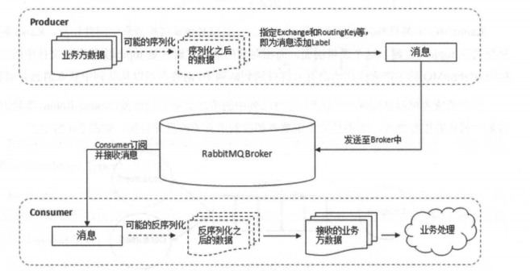

分布式或者说 SOA 分布式重要的就是面向服务，说简单的分布式就是我们把整个系统拆分成不同的服务然后将这些服务放在不同的服务器上减轻单体服务的压力提高并发量和性能。比如电商系统可以简单地拆分成订单系统、商品系统、登录系统等等，拆分之后的每个服务可以部署在不同的机器上，如果某一个服务的访问量比较大的话也可以将这个服务同时部署在多台机器上。

# CAP和BASE理论

**CAP**

当发生网络分区的时候，如果我们要继续服务，那么强一致性和可用性只能 2 选 1。也就是说当网络分区之后 P 是前提，决定了 P 之后才有 C 和 A 的选择。也就是说分区容错性（Partition tolerance）我们是必须要实现的。

**为啥不可能选择 CA 架构呢？** 举个例子：若系统出现“分区”，系统中的某个节点在进行写操作。为了保证 C， 必须要禁止其他节点的读写操作，这就和 A 发生冲突了。如果为了保证 A，其他节点的读写操作正常的话，那就和 C 发生冲突了。

**如果网络分区正常的话（系统在绝大部分时候所处的状态），也就说不需要保证 P 的时候，C 和 A 能够同时保证。**

比如 ZooKeeper、HBase 就是 CP 架构，Cassandra、Eureka 就是 AP 架构，Nacos 不仅支持 CP 架构也支持 AP 架构。


**BASE**

**BASE** 是 **Basically Available（基本可用）** 、**Soft-state（软状态）** 和 **Eventually Consistent（最终一致性）** 三个短语的缩写。BASE 理论是对 CAP 中一致性 C 和可用性 A 权衡的结果，其来源于对大规模互联网系统分布式实践的总结，是基于 CAP 定理逐步演化而来的，它大大降低了我们对系统的要求。

**BASE 理论的核心思想**

即使无法做到强一致性，但每个应用都可以根据自身业务特点，采用适当的方式来使系统达到最终一致性。

> 也就是牺牲数据的一致性来满足系统的高可用性，系统中一部分数据不可用或者不一致时，仍需要保持系统整体“主要可用”。

**BASE 理论本质上是对 CAP 的延伸和补充，更具体地说，是对 CAP 中 AP 方案的一个补充。**

AP 方案只是在系统发生分区的时候放弃一致性，而不是永远放弃一致性。在分区故障恢复后，系统应该达到最终一致性。这一点其实就是 BASE 理论延伸的地方。

1.基本可用

基本可用是指分布式系统在出现不可预知故障的时候，允许损失部分可用性。但是，这绝不等价于系统不可用。

**什么叫允许损失部分可用性呢？**

- **响应时间上的损失**: 正常情况下，处理用户请求需要 0.5s 返回结果，但是由于系统出现故障，处理用户请求的时间变为 3 s。
- **系统功能上的损失**：正常情况下，用户可以使用系统的全部功能，但是由于系统访问量突然剧增，系统的部分非核心功能无法使用。

2.软状态

软状态指允许系统中的数据存在中间状态（**CAP 理论中的数据不一致**），并认为该中间状态的存在不会影响系统的整体可用性，即允许系统在不同节点的数据副本之间进行数据同步的过程存在延时。

3.最终一致性

最终一致性强调的是系统中所有的数据副本，在经过一段时间的同步后，最终能够达到一个一致的状态。因此，最终一致性的本质是需要系统保证最终数据能够达到一致，而不需要实时保证系统数据的强一致性。

> 分布式一致性的 3 种级别：
>
> 1. **强一致性** ：系统写入了什么，读出来的就是什么。
> 2. **弱一致性** ：不一定可以读取到最新写入的值，也不保证多少时间之后读取到的数据是最新的，只是会尽量保证某个时刻达到数据一致的状态。
> 3. **最终一致性** ：弱一致性的升级版，系统会保证在一定时间内达到数据一致的状态。
>
> **业界比较推崇是最终一致性级别，但是某些对数据一致要求十分严格的场景比如银行转账还是要保证强一致性。**

那实现最终一致性的具体方式是什么呢? [《分布式协议与算法实战》](http://gk.link/a/10rZM) 中是这样介绍：

> - **读时修复** : 在读取数据时，检测数据的不一致，进行修复。比如 Cassandra 的 Read Repair 实现，具体来说，在向 Cassandra 系统查询数据的时候，如果检测到不同节点 的副本数据不一致，系统就自动修复数据。
> - **写时修复** : 在写入数据，检测数据的不一致时，进行修复。比如 Cassandra 的 Hinted Handoff 实现。具体来说，Cassandra 集群的节点之间远程写数据的时候，如果写失败 就将数据缓存下来，然后定时重传，修复数据的不一致性。
> - **异步修复** : 这个是最常用的方式，通过定时对账检测副本数据的一致性，并修复。

比较推荐 **写时修复**，这种方式对性能消耗比较低。

# 负载均衡

## Nginx

轮询策略(默认):每个请求按时间顺序逐一分配到不同的后端服务器，如果后端服务器down掉，能自动剔除。 

```
upstream backserver { 
server 192.168.0.14; 
server 192.168.0.15; 
} 
```

权重策略:指定轮询几率，weight和访问比率成正比，用于后端服务器性能不均的情况。 

```
upstream backserver { 
server 192.168.0.14 weight=8; 
server 192.168.0.15 weight=10; 
}
```

IP_HASH:每个请求按访问ip的hash结果分配，这样每个访客固定访问一个后端服务器，可以解决session的问题。

```
upstream backserver { 
ip_hash; 
server 192.168.0.14:88; 
server 192.168.0.15:80; 
} 
```

URL_HASH:按访问url的hash结果来分配请求，使每个url定向到同一个后端服务器，后端服务器为缓存时比较有效。 

```
upstream backserver { 
server squid1:3128; 
server squid2:3128; 
hash $request_uri; 
hash_method crc32; 
} 
```

FAIR:按后端服务器的响应时间来分配请求，响应时间短的优先分配。 
upstream backserver { 
server server1; 
server server2; 
fair; 
} 

# RPC

**RPC（Remote Procedure Call）** 即远程过程调用. 通过 RPC 可以帮助我们调用远程计算机上某个服务的方法，这个过程就像调用本地方法一样简单。并且！我们不需要了解底层网络编程的具体细节。

步骤:

- 服务消费端（client）以本地调用的方式调用远程服务；
- 客户端 Stub（client stub） 接收到调用后负责将方法、参数等组装成能够进行网络传输的消息体（序列化）：`RpcRequest`；
- 客户端 Stub（client stub） 找到远程服务的地址，并将消息发送到服务提供端；
- 服务端 Stub（桩）收到消息将消息反序列化为Java对象: `RpcRequest`；
- 服务端 Stub（桩）根据`RpcRequest`中的类、方法、方法参数等信息调用本地的方法；
- 服务端 Stub（桩）得到方法执行结果并将组装成能够进行网络传输的消息体：`RpcResponse`（序列化）发送至消费方；
- 客户端 Stub（client stub）接收到消息并将消息反序列化为Java对象:`RpcResponse`


## dubbo

https://dubbo.apache.org/zh/docs/v2.7/dev/design/

是一款高性能、轻量级的开源 Java RPC 框架。

Dubbo 提供了六大核心能力

1. 面向接口代理的高性能RPC调用。
2. 智能容错和负载均衡。
3. 服务自动注册和发现。
4. 高度可扩展能力。
5. 运行期流量调度。
6. 可视化的服务治理与运维。

另外，Dubbo 除了能够应用在分布式系统中，也可以应用在现在比较火的微服务系统中。不过，由于 Spring Cloud 在微服务中应用更加广泛，所以，我觉得一般我们提 Dubbo 的话，大部分是分布式系统的情况。


**Container：** 服务运行容器，负责加载、运行服务提供者。必须。

**Provider：** 暴露服务的服务提供方，会向注册中心注册自己提供的服务。必须。

**Consumer：** 调用远程服务的服务消费方，会向注册中心订阅自己所需的服务。必须。

**Registry：** 服务注册与发现的注册中心。注册中心会返回服务提供者地址列表给消费者。非必须。

**Monitor：** 统计服务的调用次数和调用时间的监控中心。服务消费者和提供者会定时发送统计数据到监控中心。

# Zookeeper

https://javaguide.cn/distributed-system/%E5%88%86%E5%B8%83%E5%BC%8F%E5%8D%8F%E8%B0%83/zookeeper/zookeeper-intro/#


# 缓存


## 客户端缓存

html中图片,css,js,字体等静态资源进行缓存.

以百度logo图为例,通过请求头Expires属性指定过期实现


status code后面可能为  

from memory cache  (不关闭浏览器多次访问)

或者 

from disk cache  (在访问过的前提下重启浏览器访问)


## 应用层缓存

客户端缓存的Expires响应头的属性, 是在CDN内容分发网络中设置.

CDN是互联网静态资源分发的主要技术手段.

比如将北京的静态资源缓存到上海的服务器,上海的用户就近访问静态资源.

CDN的核心技术为**智能DNS**, 根据用户id自动访问就近CDN节点,如果就近节点不存在资源,则由就近CDN节点访问源节点抽取数据再返回(**回源**)

比如租用阿里云CDN服务,除了 缓存文件外,还可以在后台为其设置缓存的属性,如之前的Expires,Cache-Control.

Expires是指定具体某个时间点缓存到期, 而Cache-Control则代表缓存的有效期是多长时间.


另外Nginx是跨平台高性能web服务器, 比如后端的tomcat服务器可通过nginx做前置的软负载均衡,为应用提供高可用性. 

但通常来自全国各地的访问用户对资源响应速度和带宽要求较高,所以通常选择CDN内容分发.

而在一些企业级应用中,用户分布在固定场所且并发度不高, 不需要部署CDN这样重量级解决方案,通常只需要单独部署一台nginx服务器,利用其自带的资源缓存能力以及压缩功能即可.

nginx设置静态资源缓存配置如下:


设置缓存之后,nginx在本地用一个个目录进行缓存.


## 服务器缓存

客户端缓存和应用层缓存都是对静态资源进行缓存

服务器缓存可分为

进程内缓存:本地开辟一块内容空间作为缓存, 如 hibernate,mybatis一二级缓存,springmvc页面缓存,ehcache;

进程外缓存:独立部署的分布式集中缓存,比如redis


加缓存并不是简单的加一个redis即可 ,这是不严谨的.

缓存策略需要按照 **先近到远，先快后慢逐级访问**

如: 商品秒杀，若无本地缓存，都保存在redis 每完成一笔交易，局域网会进行若干网络通信，可能存在网络异常不稳定因素且redis会承担所有节点的压力，当突发流量若超过容载上限redis会崩溃 .所以java的应用端也需要设计多级缓存


一般会通过进程内缓存和进程外缓存组合分担压力:


ehcache（进程内缓存）可以在缓存不存在时去redis进程外缓存进行读取，redis没有读取数据库 数据库再对ehcache，redis进行更新. 

但该设计如何保证一致性问题? 如果修改商品的价格,如何保证缓存同步更新?

可引入消息队列（MQ）的主动推送功能，对服务实例推送变更实例,

即在修改商品价格后，向MQ发送变更消息，MQ将消息推送到服务实例服务实例将原缓存数据先删除，再创建缓存. 


什么情况适用多级缓存架构
1、缓存数据稳定
2、可能产生高并发场景（12306）应用启动时进行预热处理，访问前将热点数据先缓存，减少后端压力
3、一定程度上允许数据不一致不重要的信息更新处理方式：T+1,ETL日中处理把数据进行补全.

# 高并发下的mysql

**集群模式**

单库模式: 一个mysql承载所有相关数据

读写分离集群模式: 在原有的基础上增加中间层,与后端数据集构成读写分离的集群(互联网大多读多写少,如商城):

> mysql根据binlog日志实现主从同步 ,从原有主库派生从库1 从库2 ,主库负责写入,从库负责读取.可通过中间件处理crud请求来决定使用哪个库处理.

> 缺点,架构复杂度成本提高, ,适用于读多写少,可通过MHA中间件实现高可用:将某个从服务器提升为主服务器.

分库分表集群模式: 一个mysql数据库撑不住,可将数据库的数据分散到不同的节点数据库,需要中间件进行路由.**不具备高可用性**

> 范围法,对分片键进行范围划分,mysql默认提供的特性(分区表) ,易扩展,适用于范围检索,但数据不均匀, 局部负载大,适用于流水账应用(按时间分片)
>
> hash法,对id取模,又分为取模 和 一致性hash(独特的环形算法). 数据分布均匀,扩展复杂,数据迁移难度大. 需要提前部署足够节点

读写分离和分片的组合应用:


## 读写分离

**读写分离主要是为了将对数据库的读写操作分散到不同的数据库节点上。** 这样的话，就能够小幅提升写性能，大幅提升读性能。

一般情况下，我们都会选择一主多从，也就是一台主数据库负责写，其他的从数据库负责读。主库和从库之间会进行数据同步，以保证从库中数据的准确性。这样的架构实现起来比较简单，并且也符合系统的写少读多的特点。

问题:**主从同步延迟**

解决方案:

**1.强制将读请求路由到主库处理。**

既然你从库的数据过期了，那我就直接从主库读取嘛！这种方案虽然会增加主库的压力，但是，实现起来比较简单，

比如 `Sharding-JDBC` 就是采用的这种方案。通过使用 Sharding-JDBC 的 `HintManager` 分片键值管理器，我们可以强制使用主库。

```java
HintManager hintManager = HintManager.getInstance();
hintManager.setMasterRouteOnly();
```

对于这种方案，你可以将那些必须获取最新数据的读请求都交给主库处理。

**2.延迟读取**

适用于对于一些对数据比较敏感的场景，你可以在完成写请求之后，避免立即进行请求操作。比如你支付成功之后，跳转到一个支付成功的页面，当你点击返回之后才返回自己的账户。


**实现读写分离**:

**1.代理方式**

我们可以在应用和数据中间加了一个代理层。应用程序所有的数据请求都交给代理层处理，代理层负责分离读写请求，将它们路由到对应的数据库中。

提供类似功能的中间件有 **MySQL Router**（官方）、**Atlas**（基于 MySQL Proxy）、**Maxscale**、**MyCat**。

**2.组件方式**

引入第三方组件来帮助我们读写请求

这种方式目前在各种互联网公司中用的最多的，相关的实际的案例也非常多。比如 `sharding-jdbc` ，直接引入 jar 包即可使用，非常方便。


### 主从复制

MySQL binlog(binary log 即二进制日志文件) 主要记录了 MySQL 数据库中数据的所有变化(数据库执行的所有 DDL 和 DML 语句)。因此，我们根据主库的 MySQL binlog 日志就能够将主库的数据同步到从库中。 

当然，除了主从复制之外，binlog 还能帮助我们实现数据恢复。

> 阿里开源的 canal 工具可以帮助实现 MySQL 和其他数据源比如 Elasticsearch 或者另外一台 MySQL 数据库之间的数据同步。很显然，这个工具的底层原理肯定也是依赖 binlog。canal 的原理就是模拟 MySQL 主从复制的过程，解析 binlog 将数据同步到其他的数据源。

## 分库分表


应用场景:

- 单表的数据达到千万级别以上，字段多,且包含超长的varchar ,clob,blob等,数据库读写速度比较缓慢（分表）。
- 数据库中的数据占用的空间越来越大，备份时间越来越长（分库）。
- 应用的并发量太大（分库）。

问题:

**join 操作** ： 同一个数据库中的表分布在了不同的数据库中，导致无法使用 join 操作。这样就导致我们需要手动进行数据的封装，比如你在一个数据库中查询到一个数据之后，再根据这个数据去另外一个数据库中找对应的数据。

**事务问题** ：同一个数据库中的表分布在了不同的数据库中，如果单个操作涉及到多个数据库，那么数据库自带的事务就无法满足我们的要求了。

**分布式 id** ：分库之后， 数据遍布在不同服务器上的数据库，数据库的自增主键已经没办法满足生成的主键唯一了。我们如何为不同的数据节点生成全局唯一主键呢？这个时候，我们就需要为我们的系统引入分布式 id 了。


**分库分表方案**

ShardingSphere（包括 Sharding-JDBC、Sharding-Proxy 和 Sharding-Sidecar) ,除了支持读写分离和分库分表，还提供分布式事务、数据库治理等功能。

[《芋道 Spring Boot 分库分表入门》](https://mp.weixin.qq.com/s/A2MYOFT7SP-7kGOon8qJaw)


### 垂直分表

将一张大表按列拆分成多个小表.

因为innodb管理数据的单位为页(16k) , 在表设计时,要尽可能在页内多存储行数据,减少跨页检索.

通过将重要字段字段单独剥离小表,让每页容纳更多行数据,页减少后,缩小数据扫描范围达到提高执行效率的目的

垂直分表条件:

1.单表数据达千万;

2.字段超过20个,且包含varchar,clob,blob(存二进制数据)等.

字段分表依据:

1.小表:数据查询,排序时需要的字段,高频访问的小字段;

2.大表:低频访问的字段,大字段

## 数据迁移和异构数据同步

**数据迁移方式**

1.**停机迁移**(脚本)

2.**双写方案**(针对不能停机迁移的场景)

我们对老库的更新操作（增删改），同时也要写入新库（双写）。如果操作的数据不存在于新库的话，需要插入到新库中。 这样就能保证，咱们新库里的数据是最新的。

在迁移过程，双写只会让被更新操作过的老库中的数据同步到新库，我们还需要自己写脚本将老库中的数据和新库的数据做比对。如果新库中没有，那咱们就把数据插入到新库。如果新库有，旧库没有，就把新库对应的数据删除（冗余数据清理）。

重复上一步的操作，直到老库和新库的数据一致为止。

可以借助canal做增量数据迁移.


**异构数据同步**

假如ES团队B需要同步MYSQL团队A的数据实现全文检索, 可通过团队A调用团队B的ES接口对数据进行同步.

这样做的问题是:

> 团队A与团队B的协作产生代码强耦合 . 团队A必须了解团队B提供的接口才可以实现 ,但本身这并不属于团队A的工作范畴

且扩展困难, 假如Mongodb团队C也要同步MySQL数据库难道要团队A又要改代码？

为了保证数据做到准实时同步还要团队之间解耦，团队A不再背锅, 可引入canal.

cacal通过伪装成从库监听relaylog来获取增量数据日志,再通过java代码调用其他模块接口可实现如es ,  mongodb的数据同步.

但是此时解耦还没有完成, 接口调用都是在团队A完成, 可以再引入消息队列MQ , 团队A部署canal监听mysql的修改操作发布到消息队列 ,团队B和团队C通过订阅消息队列 ,自己调用接口对数据进行同步. 之后再需要加入新的团队只需要订阅消息队列即可 ,与团队A无关了.


**canal**

> Canal是阿里巴巴旗下的一款开源项目，纯Java开发。基于数据库增量日志解析，提供增量数据订阅&消费，目前主要支持了MySQL（也支持mariaDB）。

先看mysql同步机制实现


canal实现mysql异构数据同步机制


## MHA高可用

MHA（Master HA）是一款开源的 MySQL 的高可用程序，它为 MySQL 主从复制架构提供了 automating master failover 功能。MHA 在监控到 master 节点故障时，会提升其中拥有最新数据的 slave 节点成为新的master 节点，在此期间，MHA 会通过于其它从节点获取额外信息来避免一致性方面的问题。MHA 还提供了 master 节点的在线切换功能，即按需切换 master/slave 节点。


在mysql主从同步基本实现中, 主服务器在数据处理以后生成binlog ,从服务器将binlog保存在relaylog中进行应用来保持同步. 

在当前实现下, 如果主服务器挂了, 从服务器是不会自动升级成主服务器的, mysql也没有提供解决方法, 只能人工进行主从切换工作, 而这段时间内业务不可用.

通过MHA ,在应用和主服务器之间增加一个VIP暴露给应用 , vip可以根据MHA来进行内部漂移.

MHA 服务有两种角色， MHA Manager(管理节点)和 MHA Node(数据节点)： 


这里binlog server是mysql提供的方案 ,同步主服务器的binlog , 主要起备份作用 ,一般不会挂.


**MHA故障发现**

MHA manager默认每3秒ping主节点(select 1), 如果3次ping无法通信,则认为主节点有问题, 但不能确定(因为有可能是中间网络问题).

所以MHA manager会通知所有从服务器使用数据库连接或者SSH的方式尝试连接主服务器, 如果所有从服务器也无法与主服务器进行通信, 则进行故障转移过程.


**MHA故障转移**

1.断开与主节点的所有连接.

2.MHA manager SSH抽取binlog 保存.

3.而从服务器之间也因为网络问题可能存在数据不同步的情况


4.MHA下达指令,从服务器之间进行数据检查比对, 通过relay log找到最新的从服务器 ,然后进行差异补全,保证所有从服务器数据同步(此时从服务器和MHA manager还没有完成同步).


5.MHA manager和从服务器进行数据检查比对, 然后发送相差数据进行补全, 到此所有从服务器与原主服务器数据完成同步.


6.选主阶段: 3种方案

7.选主后其他从服务器通过change master连接新主服务器


8.vip内部漂移 , 指向新的主服务器


E:当原主节点恢复后


而其他网络波动引发的问题或者故障时binlog server与主服务器没有同步等问题,需要结合具体的生产环境进行人工介入.

[binlog server配置](https://www.cnblogs.com/ywrj/p/9443215.html)

MHA缺点:

1.需要编写脚本或利用第三方工具来实现vip配置;

2.MHA启动后只监控主服务器是否可用,没法监控从服务器;

3.需要基于SSH免认证登录配置,存在安全隐患;

4.没有提供从服务器的读负载均衡功能;

## 自增主键下的尾部热点

自增主键只能对应分布式集群下范围法的[分片策略](# 集群模式):

因为自增主键必须连续 ,所以只能采取范围分片形式,会产生**尾部热点**效应.

从第一个范围分片开始插入, 当前正在进行插入的分片压力大


## 分布式全局唯一id

在分库之后， 数据遍布在不同服务器上的数据库，数据库的自增主键已经没办法满足生成的主键唯一了。**我们如何为不同的数据节点生成全局唯一主键呢？**

ID生成规则部分硬性要求

全局唯一：不能出现重复的ID号，既然是唯一标识，这是最基本的要求

趋势递增：在MySQL的InnoDB引擎中使用的是聚集索引，由于多数RDBMS使用Btree的数据结构来存储索引数据，在主键的选择上面我们应该尽量使用有序的主键保证写入性能。

单调递增：保证下一个ID一定大于上一个ID，例如事务版本号、IM增量消息、排序等特殊需求

信息安全：如果ID是连续的，恶意用户的扒取工作就非常容易做了，直接按照顺序下载指定URL即可。如果是订单号就更危险了，竞对可以直接知道我们一天的单量。所以在一些应用场景下，需要ID无规则不规则，让竞争对手否好猜。

含时间戳：这样就能够在开发中快速了解这个分布式id的生成时间。

ID号生成系统的可用性要求

高可用：发一个获取分布式ID的请求，服务器就要保证99.999%的情况下给我创建一个唯一分布式ID。

低延迟：发一个获取分布式ID的请求，服务器就要快，极速。

高QPS：假如并发一口气10万个创建分布式ID请求同时杀过来，服务器要顶的住且一下子成功创建10万个分布式ID。

**方案1:UUID**

UUID(Universally Unique ldentifer)的标准型式包含32个16进制数字，以连了号分为五段，形式为8-4-4-4-12的36个字符， 示例：550e8400-e29b-41d4-a716-446655440000

性能非常高：本地生成，没有网络消耗

如果只是考虑唯一性，那就选用它吧

但是，入数据库性能差:

**方案2:数据库自增主键**

单机:数据库的自增ID机制的主要原理是：数据库自增ID和MySQL数据库的replace into实现的。

系统水平扩展比较困难;

数据库压力还是很大，每次获取ID都得读写一次数据库， 非常影响性能，不符合分布式ID里面的延迟低和要高QPS的规则（在高并发下，如果都去数据库里面获取id，那是非常影响性能的）

**方案3:基于Redis生成全局ID策略**

因为Redis是单线的天生保证原子性，可以使用原子操作INCR和INCRBY来实现

注意：在Redis集群情况下，同样和MySQL一样需要设置不同的增长步长，同时key一定要设置有效期可以使用Redis集群来获取更高的吞吐量。

假如一个集群中有5台Redis。可以初始化每台Redis的值分别是1,2,3,4,5，然后步长都是5。

各个Redis生成的ID为:

A：1, 6, 11, 16, 21
B：2, 7 , 12, 17, 22
C：3, 8, 13, 18, 23
D：4, 9, 14, 19, 24
E：5, 10, 15, 20, 25

**方案4:Twitter的分布式自增ID算法snowflake**

Twitter的snowflake解决了这种需求，最初Twitter把存储系统从MySQL迁移到Cassandra（由Facebook开发一套开源分布式NoSQL数据库系统）。因为Cassandra没有顺序ID生成机制，所以开发了这样一套全局唯一生成服务。

Twitter的分布式雪花算法SnowFlake ，经测试snowflake 每秒能够产生26万个自增可排序的ID

Twitter的SnowFlake生成ID能够按照时间有序生成。
SnowFlake算法生成ID的结果是一个64bit大小的整数， 为一个Long型（转换成字符串后长度最多19）。
分布式系统内不会产生ID碰撞（由datacenter和workerld作区分）并且效率较高。

雪花算法的几个核心组成部分：


实现雪花算法时需要注意时间回拨带来的影响

实现

```
/**
 * <p>名称：IdWorker.java</p>
 * <p>描述：分布式自增长ID</p>
 * <pre>
 *     Twitter的 Snowflake　JAVA实现方案
 * </pre>
 * 核心代码为其IdWorker这个类实现，其原理结构如下，我分别用一个0表示一位，用—分割开部分的作用：
 * 1||0---0000000000 0000000000 0000000000 0000000000 0 --- 00000 ---00000 ---000000000000
 * 在上面的字符串中，第一位为未使用（实际上也可作为long的符号位），接下来的41位为毫秒级时间，
 * 然后5位datacenter标识位，5位机器ID（并不算标识符，实际是为线程标识），
 * 然后12位该毫秒内的当前毫秒内的计数，加起来刚好64位，为一个Long型。
 * 这样的好处是，整体上按照时间自增排序，并且整个分布式系统内不会产生ID碰撞（由datacenter和机器ID作区分），
 * 并且效率较高，经测试，snowflake每秒能够产生26万ID左右，完全满足需要。
 * <p>
 * 64位ID (42(毫秒)+5(机器ID)+5(业务编码)+12(重复累加))
 *
 */
public class IdWorker {
    // 时间起始标记点，作为基准，一般取系统的最近时间（一旦确定不能变动）
    private final static long twepoch = 1288834974657L;
    // 机器标识位数
    private final static long workerIdBits = 5L;
    // 数据中心标识位数
    private final static long datacenterIdBits = 5L;
    // 机器ID最大值
    private final static long maxWorkerId = -1L ^ (-1L << workerIdBits);
    // 数据中心ID最大值
    private final static long maxDatacenterId = -1L ^ (-1L << datacenterIdBits);
    // 毫秒内自增位
    private final static long sequenceBits = 12L;
    // 机器ID偏左移12位
    private final static long workerIdShift = sequenceBits;
    // 数据中心ID左移17位
    private final static long datacenterIdShift = sequenceBits + workerIdBits;
    // 时间毫秒左移22位
    private final static long timestampLeftShift = sequenceBits + workerIdBits + datacenterIdBits;

    private final static long sequenceMask = -1L ^ (-1L << sequenceBits);
    /* 上次生产id时间戳 */
    private static long lastTimestamp = -1L;
    // 0，并发控制
    private long sequence = 0L;

    private final long workerId;
    // 数据标识id部分
    private final long datacenterId;

    public IdWorker(){
        this.datacenterId = getDatacenterId(maxDatacenterId);
        this.workerId = getMaxWorkerId(datacenterId, maxWorkerId);
    }
    /**
     * @param workerId
     *            工作机器ID
     * @param datacenterId
     *            序列号
     */
    public IdWorker(long workerId, long datacenterId) {
        if (workerId > maxWorkerId || workerId < 0) {
            throw new IllegalArgumentException(String.format("worker Id can't be greater than %d or less than 0", maxWorkerId));
        }
        if (datacenterId > maxDatacenterId || datacenterId < 0) {
            throw new IllegalArgumentException(String.format("datacenter Id can't be greater than %d or less than 0", maxDatacenterId));
        }
        this.workerId = workerId;
        this.datacenterId = datacenterId;
    }
    /**
     * 获取下一个ID
     *
     * @return
     */
    public synchronized long nextId() {
        long timestamp = timeGen();
        if (timestamp < lastTimestamp) {
            throw new RuntimeException(String.format("Clock moved backwards.  Refusing to generate id for %d milliseconds", lastTimestamp - timestamp));
        }

        if (lastTimestamp == timestamp) {
            // 当前毫秒内，则+1
            sequence = (sequence + 1) & sequenceMask;
            if (sequence == 0) {
                // 当前毫秒内计数满了，则等待下一秒
                timestamp = tilNextMillis(lastTimestamp);
            }
        } else {
            sequence = 0L;
        }
        lastTimestamp = timestamp;
        // ID偏移组合生成最终的ID，并返回ID
        long nextId = ((timestamp - twepoch) << timestampLeftShift)
                | (datacenterId << datacenterIdShift)
                | (workerId << workerIdShift) | sequence;

        return nextId;
    }

    private long tilNextMillis(final long lastTimestamp) {
        long timestamp = this.timeGen();
        while (timestamp <= lastTimestamp) {
            timestamp = this.timeGen();
        }
        return timestamp;
    }

    private long timeGen() {
        return System.currentTimeMillis();
    }

    /**
     * <p>
     * 获取 maxWorkerId
     * </p>
     */
    protected static long getMaxWorkerId(long datacenterId, long maxWorkerId) {
        StringBuffer mpid = new StringBuffer();
        mpid.append(datacenterId);
        String name = ManagementFactory.getRuntimeMXBean().getName();
        if (!name.isEmpty()) {
            /*
             * GET jvmPid
             */
            mpid.append(name.split("@")[0]);
        }
        /*
         * MAC + PID 的 hashcode 获取16个低位
         */
        return (mpid.toString().hashCode() & 0xffff) % (maxWorkerId + 1);
    }

    /**
     * <p>
     * 数据标识id部分
     * </p>
     */
    protected static long getDatacenterId(long maxDatacenterId) {
        long id = 0L;
        try {
            InetAddress ip = InetAddress.getLocalHost();
            NetworkInterface network = NetworkInterface.getByInetAddress(ip);
            if (network == null) {
                id = 1L;
            } else {
                byte[] mac = network.getHardwareAddress();
                id = ((0x000000FF & (long) mac[mac.length - 1])
                        | (0x0000FF00 & (((long) mac[mac.length - 2]) << 8))) >> 6;
                id = id % (maxDatacenterId + 1);
            }
        } catch (Exception e) {
            System.out.println(" getDatacenterId: " + e.getMessage());
        }
        return id;
    

}
```

**方案5:框架**

UidGenerator(百度) 18年起未维护

Leaf(美团) https://tech.meituan.com/2017/04/21/mt-leaf.html

Tinyid(滴滴) https://github.com/didi/tinyid/wiki/tinyid%E5%8E%9F%E7%90%86%E4%BB%8B%E7%BB%8D

**方案6:中间件**

比如zookeeper也可以生成唯一id

# 消息队列

消息队列是分布式系统中重要的组件之一。

使用消息队列场景:

1.**通过异步处理提高系统性能**

将用户的请求数据存储到消息队列之后就立即返回结果。随后，系统再对消息进行消费。

因为用户请求数据写入消息队列之后就立即返回给用户了，但是请求数据在后续的业务校验、写数据库等操作中可能失败。因此，**使用消息队列进行异步处理之后，需要适当修改业务流程进行配合**，比如用户在提交订单之后，订单数据写入消息队列，不能立即返回用户订单提交成功，需要在消息队列的订单消费者进程真正处理完该订单之后，甚至出库后，再通过电子邮件或短信通知用户订单成功，以免交易纠纷。这就类似我们平时手机订火车票和电影票。

2.**削峰/限流**

先将短时间高并发产生的事务消息存储在消息队列中，然后后端服务再慢慢根据自己的能力去消费这些消息，这样就避免直接把后端服务打垮掉。

举例：在电子商务一些秒杀、促销活动中，合理使用消息队列可以有效抵御促销活动刚开始大量订单涌入对系统的冲击。如下图所示：


3.**降低系统耦合性**

如果模块之间不存在直接调用，那么新增模块或者修改模块就对其他模块影响较小.

生产者（客户端）发送消息到消息队列中去，接受者（服务端）处理消息，需要消费的系统直接去消息队列取消息进行消费即可而不需要和其他系统有耦合，这显然也提高了系统的扩展性。

另外，为了避免消息队列服务器宕机造成消息丢失，会将成功发送到消息队列的消息存储在消息生产者服务器上，等消息真正被消费者服务器处理后才删除消息。在消息队列服务器宕机后，生产者服务器会选择分布式消息队列服务器集群中的其他服务器发布消息。

**问题:**

**系统可用性降低：** 系统可用性在某种程度上降低，为什么这样说呢？在加入 MQ 之前，你不用考虑消息丢失或者说 MQ 挂掉等等的情况，但是，引入 MQ 之后你就需要去考虑了！

**系统复杂性提高：** 加入 MQ 之后，你需要保证消息没有被重复消费、处理消息丢失的情况、保证消息传递的顺序性等等问题！

**一致性问题：** 我上面讲了消息队列可以实现异步，消息队列带来的异步确实可以提高系统响应速度。但是，万一消息的真正消费者并没有正确消费消息怎么办？这样就会导致数据不一致的情况了!

| 特性                     | ActiveMQ                              | RabbitMQ                                           | RocketMQ                                                     | Kafka                                                        |
| ------------------------ | ------------------------------------- | -------------------------------------------------- | ------------------------------------------------------------ | ------------------------------------------------------------ |
| 单机吞吐量               | 万级，比 RocketMQ、Kafka 低一个数量级 | 同 ActiveMQ                                        | 10 万级，支撑高吞吐                                          | 10 万级，高吞吐，一般配合大数据类的系统来进行实时数据计算、日志采集等场景 |
| topic 数量对吞吐量的影响 |                                       |                                                    | topic 可以达到几百/几千的级别，吞吐量会有较小幅度的下降，这是 RocketMQ 的一大优势，在同等机器下，可以支撑大量的 topic | topic 从几十到几百个时候，吞吐量会大幅度下降，在同等机器下，Kafka 尽量保证 topic 数量不要过多，如果要支撑大规模的 topic，需要增加更多的机器资源 |
| 时效性                   | ms 级                                 | 微秒级，这是 RabbitMQ 的一大特点，延迟最低         | ms 级                                                        | 延迟在 ms 级以内                                             |
| 可用性                   | 高，基于主从架构实现高可用            | 同 ActiveMQ                                        | 非常高，分布式架构                                           | 非常高，分布式，一个数据多个副本，少数机器宕机，不会丢失数据，不会导致不可用 |
| 消息可靠性               | 有较低的概率丢失数据                  | 基本不丢                                           | 经过参数优化配置，可以做到 0 丢失                            | 同 RocketMQ                                                  |
| 功能支持                 | MQ 领域的功能极其完备                 | 基于 erlang 开发，并发能力很强，性能极好，延时很低 | MQ 功能较为完善，还是分布式的，扩展性好                      | 功能较为简单，主要支持简单的 MQ 功能，在大数据领域的实时计算以及日志采集被大规模使用 |

## 消息服务规范

**1.JMS**

JMS（JAVA Message Service,java 消息服务）是 java 的消息服务，JMS 的客户端之间可以通过 JMS 服务进行异步的消息传输。**JMS（JAVA Message Service，Java 消息服务）API 是一个消息服务的标准或者说是规范**，允许应用程序组件基于 JavaEE 平台创建、发送、接收和读取消息。它使分布式通信耦合度更低，消息服务更加可靠以及异步性。

比如ActiveMQ

**JMS两种消息模型**:

①**点到点（P2P）模型**

使用**队列（Queue）作为消息通信载体；满足生产者与消费者模式**，一条消息只能被一个消费者使用，未被消费的消息在队列中保留直到被消费或超时。

②**发布/订阅（Pub/Sub）模型**

发布订阅模型（Pub/Sub） 使用**主题（Topic）作为消息通信载体，类似于广播模式**；发布者发布一条消息，该消息通过主题传递给所有的订阅者，**在一条消息广播之后才订阅的用户则是收不到该条消息的**。


**JMS 五种不同的消息正文格式**:

StreamMessage -- Java 原始值的数据流

MapMessage --一套名称-值对

TextMessage --一个字符串对象

ObjectMessage --一个序列化的 Java 对象

BytesMessage --一个字节的数据流


**2.AMQP**

| 对比方向     | JMS                                     | AMQP                                                         |
| :----------- | :-------------------------------------- | :----------------------------------------------------------- |
| 定义         | Java API                                | 协议                                                         |
| 跨语言       | 否                                      | 是                                                           |
| 跨平台       | 否                                      | 是                                                           |
| 支持消息类型 | 提供两种消息模型：①Peer-2-Peer;②Pub/sub | 提供了五种消息模型：①direct exchange；②fanout exchange；③topic change；④headers exchange；⑤system exchange。本质来讲，后四种和 JMS 的 pub/sub 模型没有太大差别，仅是在路由机制上做了更详细的划分； |
| 支持消息类型 | 支持5种消息类型                         | byte[]（二进制）                                             |

AMQP 为消息定义了线路层（wire-level protocol）的协议，而 JMS 所定义的是 API 规范。在 Java 体系中，多个 client 均可以通过 JMS 进行交互，不需要应用修改代码，但是其对跨平台的支持较差。而 AMQP 天然具有跨平台、跨语言特性。

JMS 支持 TextMessage、MapMessage 等复杂的消息类型；而 AMQP 仅支持 byte[] 消息类型（复杂的类型可序列化后发送）。

由于 Exchange 提供的路由算法，AMQP 可以提供多样化的路由方式来传递消息到消息队列，而 JMS 仅支持 队列 和 主题/订阅 方式两种。


## Kafka

Kafka 将生产者发布的消息发送到 **Topic（主题）** 中，需要这些消息的消费者可以订阅这些 **Topic（主题）**


1. **Producer（生产者）** : 产生消息的一方。
2. **Consumer（消费者）** : 消费消息的一方。
3. **Broker（代理）** : 可以看作是一个独立的 Kafka 实例。多个 Kafka Broker 组成一个 Kafka Cluster。

每个 Broker 中又包含了 Topic 以及 Partition 这两个重要的概念：

- **Topic（主题）** : Producer 将消息发送到特定的主题，Consumer 通过订阅特定的 Topic(主题) 来消费消息。
- **Partition（分区）** : Partition 属于 Topic 的一部分。一个 Topic 可以有多个 Partition ，并且同一 Topic 下的 Partition 可以分布在不同的 Broker 上，这也就表明一个 Topic 可以横跨多个 Broker 。这正如我上面所画的图一样。

> Kafka 中的 Partition（分区） 实际上可以对应成为消息队列中的队列。这样是不是更好理解一点？


**多副本机制**

分区（Partition）中的多个副本(Replica)之间会有一个 leader ，其他副本称为 follower。发送的消息会被发送到 leader ，然后 follower 才能从 leader 中拉取消息进行同步。 

> 生产者和消费者只与 leader 交互。可理解为其他副本只是 leader 的拷贝，它们的存在只是为了保证消息存储的安全性。当 leader 发生故障时会从 follower 中选举出一个 leader,但是 follower 中如果有和 leader 同步程度达不到要求的参加不了 leader 的竞选。

Kafka引入多分区机制,各个 Partition 可以分布在不同的 Broker 上, 这样便能提供比较好的并发能力（负载均衡）

kafka引入多副本机制,这也极大地提高了消息存储的安全性, 提高了容灾能力，不过也相应的增加了所需要的存储空间。


**zk在kafka中的作用**

1.**Broker 注册** ：在 Zookeeper 上会有一个专门**用来进行 Broker 服务器列表记录**的节点。每个 Broker 在启动时，都会到 Zookeeper 上进行注册，即到 `/brokers/ids` 下创建属于自己的节点。每个 Broker 就会将自己的 IP 地址和端口等信息记录到该节点中去

2.**Topic 注册** ： 在 Kafka 中，同一个**Topic 的消息会被分成多个分区**并将其分布在多个 Broker 上，**这些分区信息及与 Broker 的对应关系**也都是由 Zookeeper 在维护。比如我创建了一个名字为 my-topic 的主题并且它有两个分区，对应到 zookeeper 中会创建这些文件夹：`/brokers/topics/my-topic/Partitions/0`、`/brokers/topics/my-topic/Partitions/1`

3.**负载均衡** ：上面也说过了 Kafka 通过给特定 Topic 指定多个 Partition, 而各个 Partition 可以分布在不同的 Broker 上, 这样便能提供比较好的并发能力。 对于同一个 Topic 的不同 Partition，Kafka 会尽力将这些 Partition 分布到不同的 Broker 服务器上。当生产者产生消息后也会尽量投递到不同 Broker 的 Partition 里面。当 Consumer 消费的时候，Zookeeper 可以根据当前的 Partition 数量以及 Consumer 数量来实现动态负载均衡。

......


**kafka如何保证消息的消费顺序?**

 Kafka 中 Partition(分区)是真正保存消息的地方，我们发送的消息都被放在了这里。而我们的 Partition(分区) 又存在于 Topic(主题) 这个概念中，并且我们可以给特定 Topic 指定多个 Partition。

每次添加消息到 Partition(分区) 的时候都会采用尾加法，如下图所示。 **Kafka 只能为我们保证 Partition(分区) 中的消息有序。**


所以，我们就有一种很简单的保证消息消费顺序的方法：**1 个 Topic 只对应一个 Partition**。这样当然可以解决问题，但是破坏了 Kafka 的设计初衷。

Kafka 中发送 1 条消息的时候，可以指定 topic, partition, key,data（数据） 4 个参数。如果你发送消息的时候指定了 Partition 的话，所有消息都会被发送到指定的 Partition。并且，同一个 key 的消息可以保证只发送到同一个 partition，这个我们可以采用表/对象的 id 来作为 key 。


**Kafka 如何保证消息不丢失**

1.对于生产者:生产者(Producer) 调用`send`方法发送消息之后，消息可能因为网络问题并没有发送过去。

我们不能默认在调用`send`方法发送消息之后消息发送成功了。为了确定消息是发送成功，我们要判断消息发送的结果。但是要注意的是  Kafka 生产者(Producer) 使用  `send` 方法发送消息实际上是异步的操作，可以通过 `get()`方法获取调用结果，但是这样也让它变为了同步操作.

```
SendResult<String, Object> sendResult = kafkaTemplate.send(topic, o).get();
if (sendResult.getRecordMetadata() != null) {
  logger.info("生产者成功发送消息到" + sendResult.getProducerRecord().topic() + "-> " + sendRe
              sult.getProducerRecord().value().toString());
}
```

但是一般不推荐这么做！可以采用为其添加回调函数的形式，

```
 ListenableFuture<SendResult<String, Object>> future = kafkaTemplate.send(topic, o);
        future.addCallback(result -> logger.info("生产者成功发送消息到topic:{} partition:{}的消息", result.getRecordMetadata().topic(), result.getRecordMetadata().partition()),
                ex -> logger.error("生产者发送消失败，原因：{}", ex.getMessage()));
```

> Producer 的`retries`（重试次数）可以设置一个比较合理的值，一般是 3 ，但是为了保证消息不丢失的话一般会设置比较大一点。设置完成之后，当出现网络问题之后能够自动重试消息发送，避免消息丢失。另外，建议还要设置重试间隔，因为间隔太小的话重试的效果就不明显了，网络波动一次你3次一下子就重试完了 


2.对于消费者

消息在被追加到 Partition(分区)的时候都会分配一个特定的偏移量（offset）。偏移量（offset)表示 Consumer 当前消费到的 Partition(分区)的所在的位置。Kafka 通过偏移量（offset）可以保证消息在分区内的顺序性。

当消费者拉取到了分区的某个消息之后，消费者会自动提交了 offset。自动提交的话会有一个问题，试想一下，当消费者刚拿到这个消息准备进行真正消费的时候，突然挂掉了，消息实际上并没有被消费，但是 offset 却被自动提交了。

**解决办法也比较粗暴，我们手动关闭自动提交 offset，每次在真正消费完消息之后再自己手动提交 offset 。** 但是，细心的朋友一定会发现，这样会带来消息被重新消费的问题。比如你刚刚消费完消息之后，还没提交 offset，结果自己挂掉了，那么这个消息理论上就会被消费两次。

3.对于kafka

假如 leader 副本所在的 broker 突然挂掉，那么就要从 follower 副本重新选出一个 leader ，但是 leader 的数据还有一些没有被 follower 副本的同步的话，就会造成消息丢失。

**设置 acks = all**

解决办法就是我们设置  **acks = all**。acks 是 Kafka 生产者(Producer)  很重要的一个参数。

acks 的默认值即为1，代表我们的消息被leader副本接收之后就算被成功发送。当我们配置 **acks = all** 代表则所有副本都要接收到该消息之后该消息才算真正成功被发送。

**设置 replication.factor >= 3**

为了保证 leader 副本能有 follower 副本能同步消息，我们一般会为 topic 设置 **replication.factor >= 3**。这样就可以保证每个 分区(partition) 至少有 3 个副本。虽然造成了数据冗余，但是带来了数据的安全性。

**设置 min.insync.replicas > 1**

一般情况下我们还需要设置 **min.insync.replicas> 1** ，这样配置代表消息至少要被写入到 2 个副本才算是被成功发送。**min.insync.replicas** 的默认值为 1 ，在实际生产中应尽量避免默认值 1。

但是，为了保证整个 Kafka 服务的高可用性，你需要确保 **replication.factor > min.insync.replicas** 。为什么呢？设想一下假如两者相等的话，只要是有一个副本挂掉，整个分区就无法正常工作了。这明显违反高可用性！一般推荐设置成 **replication.factor = min.insync.replicas + 1**。

**设置 unclean.leader.election.enable = false**

> **Kafka 0.11.0.0版本开始 unclean.leader.election.enable 参数的默认值由原来的true 改为false**

我们最开始也说了我们发送的消息会被发送到 leader 副本，然后 follower 副本才能从 leader 副本中拉取消息进行同步。多个 follower 副本之间的消息同步情况不一样，当我们配置了 **unclean.leader.election.enable = false**  的话，当 leader 副本发生故障时就不会从  follower 副本中和 leader 同步程度达不到要求的副本中选择出  leader ，这样降低了消息丢失的可能性。


**Kafka 如何保证消息不重复消费**

**kafka出现消息重复消费的原因：**

- 服务端侧已经消费的数据没有成功提交 offset（根本原因）。
- Kafka 侧 由于服务端处理业务时间长或者网络链接等等原因让 Kafka 认为服务假死，触发了分区 rebalance。

**解决方案：**

- 消费消息服务做幂等校验，比如 Redis 的set、MySQL 的主键等天然的幂等功能。这种方法最有效。

- 将 

  `enable.auto.commit`

   参数设置为 false，关闭自动提交，开发者在代码中手动提交 offset。那么这里会有个问题：

  什么时候提交offset合适？

  - 处理完消息再提交：依旧有消息重复消费的风险，和自动提交一样
  - 拉取到消息即提交：会有消息丢失的风险。允许消息延时的场景，一般会采用这种方式。然后，通过定时任务在业务不繁忙（比如凌晨）的时候做数据兜底。

## RocketMQ

[博客](https://mp.weixin.qq.com/s?__biz=Mzg2OTA0Njk0OA==&mid=2247485969&idx=1&sn=6bd53abde30d42a778d5a35ec104428c&chksm=cea245daf9d5cccce631f93115f0c2c4a7634e55f5bef9009fd03f5a0ffa55b745b5ef4f0530&token=294077121&lang=zh_CN#rd)


## RabbitMQ


**Exchange(交换机):**

在 RabbitMQ 中，消息并不是直接被投递到 **Queue(消息队列)** 中的，中间还必须经过 **Exchange(交换器)** 这一层，**Exchange(交换器)** 会把我们的消息分配到对应的 **Queue(消息队列)** 中。

**Exchange(交换器)** 用来接收生产者发送的消息并将这些消息路由给服务器中的队列中，如果路由不到，或许会返回给 **Producer(生产者)** ，或许会被直接丢弃掉 。这里可以将RabbitMQ中的交换器看作一个简单的实体。

**RabbitMQ 的 Exchange(交换器) 有4种类型，不同的类型对应着不同的路由策略**：**direct(默认)**，**fanout**, **topic**, 和 **headers**，不同类型的Exchange转发消息的策略有所区别。这个会在介绍 **Exchange Types(交换器类型)** 的时候介绍到。

生产者将消息发给交换器的时候，一般会指定一个 **RoutingKey(路由键)**，用来指定这个消息的路由规则，而这个 **RoutingKey 需要与交换器类型和绑定键(BindingKey)联合使用才能最终生效**。

RabbitMQ 中通过 **Binding(绑定)** 将 **Exchange(交换器)** 与 **Queue(消息队列)** 关联起来，在绑定的时候一般会指定一个 **BindingKey(绑定建)** ,这样 RabbitMQ 就知道如何正确将消息路由到队列了,如下图所示。一个绑定就是基于路由键将交换器和消息队列连接起来的路由规则，所以可以将交换器理解成一个由绑定构成的路由表。Exchange 和 Queue 的绑定可以是多对多的关系。

生产者将消息发送给交换器时，需要一个RoutingKey,当 BindingKey 和 RoutingKey 相匹配时，消息会被路由到对应的队列中。在绑定多个队列到同一个交换器的时候，这些绑定允许使用相同的 BindingKey。BindingKey 并不是在所有的情况下都生效，它依赖于交换器类型，比如fanout类型的交换器就会无视，而是将消息路由到所有绑定到该交换器的队列中。 


**Queue(消息队列)**

**Queue(消息队列)** 用来保存消息直到发送给消费者。它是消息的容器，也是消息的终点。一个消息可投入一个或多个队列。消息一直在队列里面，等待消费者连接到这个队列将其取走。

**RabbitMQ** 中消息只能存储在 **队列** 中，这一点和 **Kafka** 这种消息中间件相反。Kafka 将消息存储在 **topic（主题）** 这个逻辑层面，而相对应的队列逻辑只是topic实际存储文件中的位移标识。 RabbitMQ 的生产者生产消息并最终投递到队列中，消费者可以从队列中获取消息并消费。

**多个消费者可以订阅同一个队列**，这时队列中的消息会被平均分摊（Round-Robin，即轮询）给多个消费者进行处理，而不是每个消费者都收到所有的消息并处理，这样避免消息被重复消费。

**RabbitMQ** 不支持队列层面的广播消费,如果有广播消费的需求，需要在其上进行二次开发,这样会很麻烦，不建议这样做。


**Broker（消息中间件的服务节点）**

对于 RabbitMQ 来说，一个 RabbitMQ Broker 可以简单地看作一个 RabbitMQ 服务节点，或者RabbitMQ服务实例。大多数情况下也可以将一个 RabbitMQ Broker 看作一台 RabbitMQ 服务器。

下图展示了生产者将消息存入 RabbitMQ Broker,以及消费者从Broker中消费数据的整个流程。


 **Exchange Types(交换器类型)**

RabbitMQ 常用的 Exchange Type 有 **fanout**、**direct**、**topic**、**headers** 这四种（AMQP规范里还提到两种 Exchange Type，分别为 system 与 自定义，这里不予以描述）。

① fanout

fanout 类型的Exchange路由规则非常简单，它会把所有发送到该Exchange的消息路由到所有与它绑定的Queue中，不需要做任何判断操作，所以 fanout 类型是所有的交换机类型里面速度最快的。fanout 类型常用来广播消息。

② direct

direct 类型的Exchange路由规则也很简单，它会把消息路由到那些 Bindingkey 与 RoutingKey 完全匹配的 Queue 中。

以上图为例，如果发送消息的时候设置路由键为“warning”,那么消息会路由到 Queue1 和 Queue2。如果在发送消息的时候设置路由键为"Info”或者"debug”，消息只会路由到Queue2。如果以其他的路由键发送消息，则消息不会路由到这两个队列中。

direct 类型常用在处理有优先级的任务，根据任务的优先级把消息发送到对应的队列，这样可以指派更多的资源去处理高优先级的队列。

③ topic

前面讲到direct类型的交换器路由规则是完全匹配 BindingKey 和 RoutingKey ，但是这种严格的匹配方式在很多情况下不能满足实际业务的需求。topic类型的交换器在匹配规则上进行了扩展，它与 direct 类型的交换器相似，也是将消息路由到 BindingKey 和 RoutingKey 相匹配的队列中，但这里的匹配规则有些不同，它约定：

- RoutingKey 为一个点号“．”分隔的字符串（被点号“．”分隔开的每一段独立的字符串称为一个单词），如 “com.rabbitmq.client”、“java.util.concurrent”、“com.hidden.client”;
- BindingKey 和 RoutingKey 一样也是点号“．”分隔的字符串；
- BindingKey 中可以存在两种特殊字符串“*”和“#”，用于做模糊匹配，其中“*”用于匹配一个单词，“#”用于匹配多个单词(可以是零个)。

以上图为例：

- 路由键为 “com.rabbitmq.client” 的消息会同时路由到 Queue1 和 Queue2;
- 路由键为 “com.hidden.client” 的消息只会路由到 Queue2 中；
- 路由键为 “com.hidden.demo” 的消息只会路由到 Queue2 中；
- 路由键为 “java.rabbitmq.demo” 的消息只会路由到 Queue1 中；
- 路由键为 “java.util.concurrent” 的消息将会被丢弃或者返回给生产者（需要设置 mandatory 参数），因为它没有匹配任何路由键。

 ④ headers(不推荐)

headers 类型的交换器不依赖于路由键的匹配规则来路由消息，而是根据发送的消息内容中的 headers 属性进行匹配。在绑定队列和交换器时指定一组键值对，当发送消息到交换器时，RabbitMQ会获取到该消息的 headers（也是一个键值对的形式)，对比其中的键值对是否完全匹配队列和交换器绑定时指定的键值对，如果完全匹配则消息会路由到该队列，否则不会路由到该队列。headers 类型的交换器性能会很差，而且也不实用，基本上不会看到它的存在。


# 高可用

高可用描述的是一个系统在大部分时间都是可用的，可以为我们提供服务的。高可用代表系统即使在发生硬件故障或者系统升级的时候，服务仍然是可用的。

原因:

- 黑客攻击；
- 硬件故障，比如服务器坏掉。
- 并发量/用户请求量激增导致整个服务宕掉或者部分服务不可用。
- 代码中的坏味道导致内存泄漏或者其他问题导致程序挂掉。
- 网站架构某个重要的角色比如 Nginx 或者数据库突然不可用。
- 自然灾害或者人为破坏
- ...

提高办法:

- 注重代码质量,测试严格把关

比较常见的内存泄漏、循环依赖都是对系统可用性极大的损害

- 使用集群,减少单点故障
- 限流
- 超时和重试机制设置

一旦用户请求超过某个时间的得不到响应，就抛出异常。在读取第三方服务的时候，尤其适合设置超时和重试机制。一些 RPC 框架都自带的超时重试的配置。如果不进行超时设置可能会导致请求响应速度慢，甚至导致请求堆积进而让系统无法再处理请求。重试的次数一般设为 3 次，再多次的重试没有好处，反而会加重服务器压力（部分场景使用失败重试机制会不太适合）。 

- 熔断机制

超时和重试机制设置之外，熔断机制也是很重要的。 熔断机制说的是系统自动收集所依赖服务的资源使用情况和性能指标，当所依赖的服务恶化或者调用失败次数达到某个阈值的时候就迅速失败，让当前系统立即切换依赖其他备用服务。 比较常用的流量控制和熔断降级框架是 Netflix 的 Hystrix 和 alibaba 的 Sentinel。

- 异步调用

异步调用的话我们不需要关心最后的结果，这样我们就可以用户请求完成之后就立即返回结果.

- 使用缓存
- 容灾备份

容灾:将系统所产生的的所有重要数据多备份几份。

备份:在异地建立两个完全相同的系统。当某个地方的系统突然挂掉，整个应用系统可以切换到另一个，这样系统就可以正常提供服务了。

## 限流

**限流算法**

1. 固定窗口计数器算法;

 固定窗口计数器算法规定了我们单位时间处理的请求数量


**这种限流算法无法保证限流速率，因而无法保证突然激增的流量。**

2.滑动窗口计数器算法;

固定窗口计数器算法的升级版。

滑动窗口计数器算法相比于固定窗口计数器算法的优化在于：**它把时间以一定比例分片** 。

假设, 先把一分钟划分成6段! 也就是10s一个段!在第一段里,假如请求61次,那么直接触发了规则!肯定就过不去了!如果只请求了1次!则是正常的! 当时间走到第二个段里,即10s~20s这段范围里,我请求数不能超过总的限定条件,且当前段的请求数量 加上 之前段的总数量也不能超过总限定数量!

很显然， **当滑动窗口的格子划分的越多，滑动窗口的滚动就越平滑，限流的统计就会越精确。**

3.漏桶算法

我们可以把发请求的动作比作成注水到桶中，我们处理请求的过程可以比喻为漏桶漏水。我们往桶中以任意速率流入水，以一定速率流出水。当水超过桶流量则丢弃，因为桶容量是不变的，保证了整体的速率。

如果想要实现这个算法的话也很简单，准备一个队列用来保存请求，然后我们定期从队列中拿请求来执行就好了（和消息队列削峰/限流的思想是一样的）。

4.令牌桶算法

和漏桶算法算法一样，主角还是桶。不过现在桶里装的是令牌了，请求在被处理之前需要拿到一个令牌，请求处理完毕之后将这个令牌丢弃（删除）。我们根据限流大小，按照一定的速率往桶里添加令牌。如果桶装满了，就不能继续往里面继续添加令牌了。 


**单机限流工具**

单机限流可以直接使用 Google Guava 自带的限流工具类 `RateLimiter` 。 `RateLimiter` 基于令牌桶算法，可以应对突发流量。

除了最基本的令牌桶算法(平滑突发限流)实现之外，Guava 的`RateLimiter`还提供了 **平滑预热限流** 的算法实现。

平滑突发限流就是按照指定的速率放令牌到桶里，而平滑预热限流会有一段预热时间，预热时间之内，速率会逐渐提升到配置的速率。

```
<dependency>
    <groupId>com.google.guava</groupId>
    <artifactId>guava</artifactId>
    <version>31.0.1-jre</version>
</dependency>
```

```
 // 1s 放 5 个令牌到桶里也就是 0.2s 放 1个令牌到桶里
        RateLimiter rateLimiter = RateLimiter.create(5);
        for (int i = 0; i < 10; i++) {
            double sleepingTime = rateLimiter.acquire(1);
            System.out.printf("get 1 tokens: %ss%n", sleepingTime);
        }
//输出
get 1 tokens: 0.0s
get 1 tokens: 0.188413s
get 1 tokens: 0.197811s
get 1 tokens: 0.198316s
get 1 tokens: 0.19864s
get 1 tokens: 0.199363s
get 1 tokens: 0.193997s
get 1 tokens: 0.199623s
get 1 tokens: 0.199357s
get 1 tokens: 0.195676s
```

平滑预热限流

```
// 1s 放 5 个令牌到桶里也就是 0.2s 放 1个令牌到桶里
// 预热时间为3s,也就说刚开始的 3s 内发牌速率会逐渐提升到 0.2s 放 1 个令牌到桶里
        RateLimiter rateLimiter = RateLimiter.create(5, 3, TimeUnit.SECONDS);
        for (int i = 0; i < 20; i++) {
            double sleepingTime = rateLimiter.acquire(1);
            System.out.printf("get 1 tokens: %sds%n", sleepingTime);
        }
//输出
get 1 tokens: 0.0s
get 1 tokens: 0.561919s
get 1 tokens: 0.516931s
get 1 tokens: 0.463798s
get 1 tokens: 0.41286s
get 1 tokens: 0.356172s
get 1 tokens: 0.300489s
get 1 tokens: 0.252545s
get 1 tokens: 0.203996s
get 1 tokens: 0.198359s
```

单机限流工具还有Bucket4j和Resilience4j

Spring Cloud Gateway 中自带的单机限流的早期版本就是基于 Bucket4j 实现的。后来，替换成了Resilience4j .

Resilience4j 不仅提供限流，还提供了熔断、负载保护、自动重试等保障系统高可用开箱即用的功能。并且，Resilience4j 的生态也更好，很多网关都使用 Resilience4j 来做限流熔断的。


**分布式限流工具**

- 借助中间件限流: 如sentinel, 或使用redis手动实现(可配合lua脚本)限流逻辑
- 网关限流

netflix zuul

spring cloud gateway

kong

apisix

shenyu


## 熔断&降级

降级是从系统功能优先级的角度考虑如何应对系统故障。

服务降级指的是当服务器压力剧增的情况下，根据当前业务情况及流量对一些服务和页面有策略的降级，以此释放服务器资源以保证核心任务的正常运行。

熔断和降级是两个比较容易混淆的概念，两者的含义并不相同。

降级的目的在于应对系统自身的故障，而熔断的目的在于应对当前系统依赖的外部系统或者第三方系统的故障。


# 分布式事务

分布式事务通用设计理念包括有两个阶段(二阶段提交)


## Seata

事务管理器（TM）：决定什么时候全局提交/回滚

事务协调者（TC）：负责通知命令的中间件Seata-Server

资源管理器（RM）：做具体事的工具人

1.通过添加seata核心注解@GlobalTransactional注解开启全局事务 , TM通知TC向下通达给RM开启本地事务


2.待本地事务都**提交**完成后,TM通过TC向RM下达全局事务处理结果.


Q:如果事务中间阶段出了问题, 而在RM处理本地子事务时,处理完成后是直接写表提交, 在TC下达分支结果时,是如何实现回滚的?

以主流的AT模式为例 , Seata AT模式下如何实现数据自动提交、回滚?

seata AT通过在所有数据库增加一张UNDO_LOG表.

> seata AT通过sql parser第三方jar包生成逆向sql , 存储在UNDO_LOG表中.  如:
>
> insert into 订单表 values(1,...);   -->  delete from 订单表 where id = 1; 
>
> update 会员积分表 set point = 50 where pid=1   --> update 会员积分表 set point = 40 where pid=1 

如果收到TC下达的分支提交, 则删掉UNDO_LOG中对于的记录即可;

如果收到TC下达的分支回滚, 执行UNDO_LOG中的**逆向SQL**,还原年数据.

Q: Seata如何避免并发场景的脏读与脏写?

利用**TC**自带的**分布式锁**完成:


Q: 怎么使用Seata框架，来保证事务的隔离性？

因seata一阶段本地事务已提交，为防止其他事务脏读脏写需要加强隔离。

1.脏读select语句加for update，代理方法增加@GlobalLock+@Transactional或@GlobalTransaction

2.脏写 必须使用@GlobalTransaction

注：如果你查询的业务的接口没有GlobalTransactional包裹，也就是这个方法上压根没有分布式事务的
需求，这时你可以在方法上标注@GlobalLock+@Transactional 注解，并且在查询语句上加 for update。
如果你查询的接口在事务链路上外层有GlobalTransactional注解，那么你查询的语句只要加for update就
行。设计这个注解的原因是在没有这个注解之前，需要查询分布式事务读已提交的数据，但业务本身不
需要分布式事务。若使用GlobalTransactional注解就会增加一些没用的额外的rpc开销比如begin返回
xid，提交事务等。GlobalLock简化了rpc过程，使其做到更高的性能。

## Redission


> 
