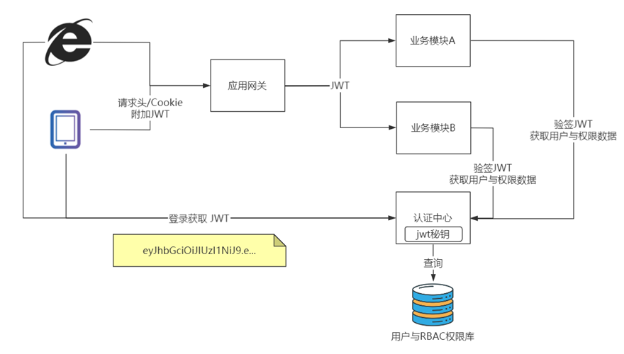
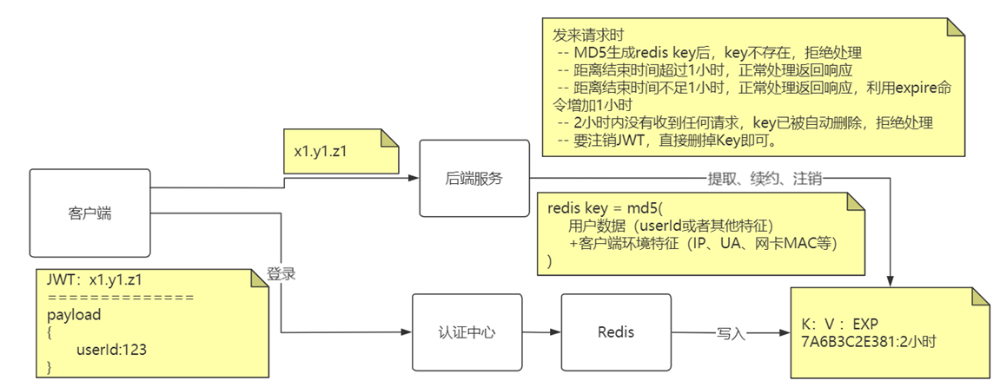
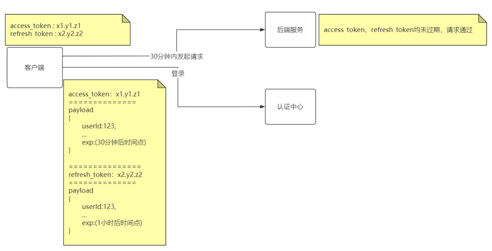
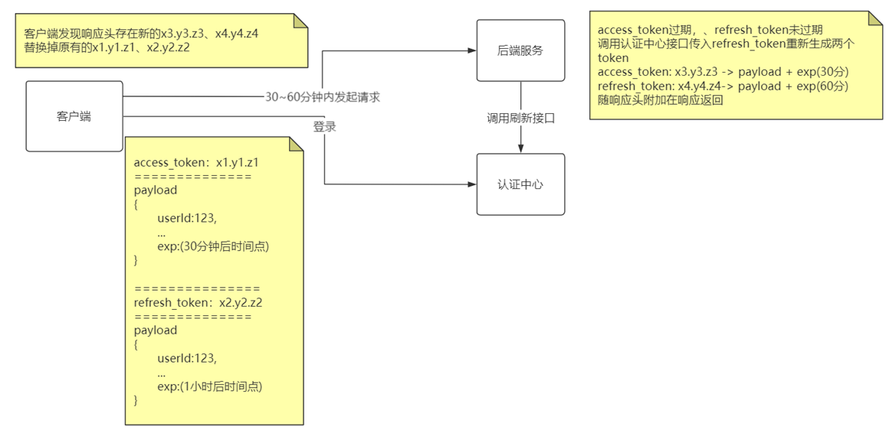
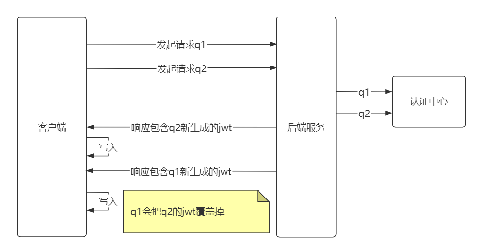
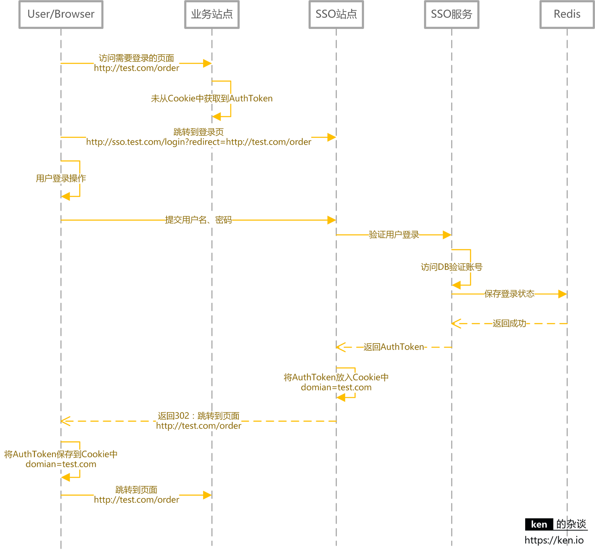

# Mybatis

## #{}与${}

1）#{}是预编译处理，$ {}是字符串替换。

2）MyBatis在处理#{}时，会将SQL中的#{}替换为?号，使用PreparedStatement的set方法来赋值；MyBatis在处理 $ { } 时，就是把 ${ } 替换成变量的值。

3）使用 #{} 可以有效的防止SQL注入，提高系统安全性。

> like语句不能使用 %#{xxx}% ,应使用concat;
>
> in语句不能使用 in (${ids}), 应使用foreach标签

> order by 不能使用 order by #{} ,因为order by后接列名,属于代码语义的一部分. 如果在语义分析部分没有确定下来就相当于执行 order by 空列名, 有语法 错误

## Dao与xml原理

Dao 接口的全限名，就是映射文件中的 namespace 的值，接口的方法名，就是映射文件中 `MappedStatement` 的 id 值，接口方法内的参数，就是传递给 sql 的参数。

MyBatis 将所有 Xml 配置信息都封装到 All-In-One 重量级对象 Configuration 内部。在 Xml 映射文件中， `<parameterMap>` 标签会被解析为 `ParameterMap` 对象，其每个子元素会被解析为 ParameterMapping 对象。 `<resultMap>` 标签会被解析为 `ResultMap` 对象，其每个子元素会被解析为 `ResultMapping` 对象。每一个 `<select>、<insert>、<update>、<delete>` 标签均会被解析为 `MappedStatement` 对象，标签内的 sql 会被解析为 BoundSql 对象。 

## 执行器

MyBatis 有三种基本的 Executor 执行器，** `SimpleExecutor` 、 `ReuseExecutor` 、 `BatchExecutor` 。**

** `SimpleExecutor` ：**每执行一次 update 或 select，就开启一个 Statement 对象，用完立刻关闭 Statement 对象。

** `ReuseExecutor` ：**执行 update 或 select，以 sql 作为 key 查找 Statement 对象，存在就使用，不存在就创建，用完后，不关闭 Statement 对象，而是放置于 Map<String, Statement>内，供下一次使用。简言之，就是重复使用 Statement 对象。

** `BatchExecutor` ：**执行 update（没有 select，JDBC 批处理不支持 select），将所有 sql 都添加到批处理中（addBatch()），等待统一执行（executeBatch()），它缓存了多个 Statement 对象，每个 Statement 对象都是 addBatch()完毕后，等待逐一执行 executeBatch()批处理。与 JDBC 批处理相同。

作用范围：Executor 的这些特点，都严格限制在 SqlSession 生命周期范围内。

## 分页

实现分页的方式

**(1)** MyBatis 使用 RowBounds 对象进行分页，它是针对 ResultSet 结果集执行的**内存分页**(查询出来再分页)，而非物理分页；

在dao接口传入一个RowBounds(int  offset , int limit);就可进行分页

**(2)** 可以在 sql 内直接书写带有物理分页的参数来完成物理分页功能，

**(3)** 也可以使用分页插件来完成物理分页。 

分页插件的基本原理是使用 MyBatis 提供的插件接口，实现自定义插件，在插件的拦截方法内拦截待执行的 sql，然后重写 sql，根据 dialect 方言，添加对应的物理分页语句和物理分页参数。

### 插件

mybatis插件就是对ParameterHandler、ResultSetHandler、StatementHandler、Executor这四个接口上的方法进行拦截，利用JDK动态代理机制，为这些接口的实现类创建代理对象，在执行方法时，先去执行代理对象的方法，从而执行自己编写的拦截逻辑，所以真正要用好mybatis插件，主要还是要熟悉这四个接口的方法以及这些方法上的参数的含义；

另外，如果配置了多个拦截器的话，会出现层层代理的情况，即代理对象代理了另外一个代理对象，形成一个代理链条，执行的时候，也是层层执行；

关于mybatis插件涉及到的设计模式和软件思想如下：

设计模式：代理模式、责任链模式；
 软件思想：AOP编程思想，降低模块间的耦合度，使业务模块更加独立；
 一些注意事项：

不要定义过多的插件，代理嵌套过多，执行方法的时候，比较耗性能；
 拦截器实现类的intercept方法里最后不要忘了执行invocation.proceed()方法，否则多个拦截器情况下，执行链条会断掉；

```java
import org.apache.ibatis.executor.statement.StatementHandler;
import org.apache.ibatis.mapping.BoundSql;
import org.apache.ibatis.plugin.*;
import org.slf4j.Logger;
import org.slf4j.LoggerFactory;

import java.sql.Connection;
import java.util.Properties;

@Intercepts({
        @Signature(type = StatementHandler.class, method = "prepare", args = {Connection.class, Integer.class})
})
public class MyPlugin implements Interceptor {
    private Logger logger = LoggerFactory.getLogger(MyPlugin.class);
    private long time;


    //方法拦截
    @Override
    public Object intercept(Invocation invocation) throws Throwable {
        //通过StatementHandler获取执行的sql
        StatementHandler statementHandler = (StatementHandler) invocation.getTarget();
        BoundSql boundSql = statementHandler.getBoundSql();
        String sql = boundSql.getSql();

        long start = System.currentTimeMillis();
        Object proceed = invocation.proceed();
        long end = System.currentTimeMillis();
        if ((end - start) > time) {
            logger.info("本次数据库操作是慢查询，sql是:" + sql);
        }
        return proceed;
    }

    //获取到拦截的对象，底层也是通过代理实现的，实际上是拿到一个目标代理对象
    @Override
    public Object plugin(Object target) {
        return Plugin.wrap(target, this);
    }

    //获取设置的阈值等参数
    @Override
    public void setProperties(Properties properties) {
        this.time = Long.parseLong(properties.getProperty("time"));
    }
}
```

在 springboot 那配置一下（我用的是 mybatisplus）


```java
import com.baomidou.mybatisplus.autoconfigure.ConfigurationCustomizer;
import com.baomidou.mybatisplus.core.MybatisConfiguration;
import org.springframework.context.annotation.Bean;
import org.springframework.context.annotation.Configuration;

import java.util.Properties;

@Configuration
public class MapperConfig {
    //将插件加入到mybatis插件拦截链中
    @Bean
    public ConfigurationCustomizer configurationCustomizer() {
        return new ConfigurationCustomizer() {
            @Override
            public void customize(MybatisConfiguration configuration) {
                //插件拦截链采用了责任链模式，执行顺序和加入连接链的顺序有关
                MyPlugin myPlugin = new MyPlugin();
                //设置参数，比如阈值等，可以在配置文件中配置，这里直接写死便于测试
                Properties properties = new Properties();
                //这里设置慢查询阈值为1毫秒，便于测试
                properties.setProperty("time", "1");
                myPlugin.setProperties(properties);
                configuration.addInterceptor(myPlugin);
            }
        };
    }
}
```

## 延迟加载

1. 延迟加载的条件：resultMap可以实现高级映射（使用association、collection实现一对一及一对多映射），association、collection具备延迟加载功能。
2. 延迟加载的好处：
   先从单表查询、需要时再从关联表去关联查询，大大提高 数据库性能，因为查询单表要比关联查询多张表速度要快。
3. 延迟加载的实例：
   如果查询订单并且关联查询用户信息。如果先查询订单信息即可满足要求，当我们需要查询用户信息时再查询用户信息。把对用户信息的按需去查询就是延迟加载。

在 MyBatis 配置文件中，可以配置是否启用延迟加载 `lazyLoadingEnabled=true|false。`

它的原理是，使用 `CGLIB` 创建目标对象的代理对象，当调用目标方法时，进入拦截器方法，比如调用 `a.getB().getName()` ，拦截器 `invoke()` 方法发现 `a.getB()` 是 null 值，那么就会单独发送事先保存好的查询关联 B 对象的 sql，把 B 查询上来，然后调用 a.setB(b)，于是 a 的对象 b 属性就有值了，接着完成 `a.getB().getName()` 方法的调用。这就是延迟加载的基本原理。

不光是 MyBatis，几乎所有的包括 Hibernate，支持延迟加载的原理都是一样的。

# Safe

## CSRF 与 XSS	

**CSRF（Cross Site Request Forgery）**一般被翻译为 **跨站请求伪造** 。

https://tech.meituan.com/2018/10/11/fe-security-csrf.html

流程:

```
受害者登录a.com，并保留了登录凭证（Cookie）。
攻击者引诱受害者访问了b.com。
b.com 向 a.com 发送了一个请求：a.com/act=xx。浏览器会默认携带a.com的Cookie。
a.com接收到请求后，对请求进行验证，并确认是受害者的凭证，误以为是受害者自己发送的请求。
a.com以受害者的名义执行了act=xx。
攻击完成，攻击者在受害者不知情的情况下，冒充受害者，让a.com执行了自己定义的操作。
```

举个简单的例子：

这一天，小明同学百无聊赖地刷着Gmail邮件。大部分都是没营养的通知、验证码、聊天记录之类。但有一封邮件引起了小明的注意：[甩卖比特币，一个只要998！！], 小明当然知道这种肯定是骗子，但还是抱着好奇的态度点了进去。果然，这只是一个什么都没有的空白页面，小明失望的关闭了页面。一切似乎什么都没有发生……但小明的Gmail中，被偷偷设置了一个过滤规则，这个规则使得所有的邮件都会被自动转发到黑客的邮箱。

```
<form method="POST" action="https://mail.google.com/mail/h/ewt1jmuj4ddv/?v=prf" enctype="multipart/form-data"> 
    <input type="hidden" name="cf2_emc" value="true"/> 
    <input type="hidden" name="cf2_email" value="hacker@hakermail.com"/> 
    .....
    <input type="hidden" name="irf" value="on"/> 
    <input type="hidden" name="nvp_bu_cftb" value="Create Filter"/> 
</form> 
<script> 
    document.forms[0].submit();
</script>
```

这个页面只要打开，就会向Gmail发送一个post请求。请求中，执行了“Create Filter”命令，将所有的邮件，转发到action指定的邮箱.  请求发送时，携带着小明的登录凭证（Cookie），Gmail的后台接收到请求，验证了确实有小明的登录凭证，于是成功给小明配置了过滤器。

小明由于刚刚就登陆了Gmail，所以这个请求发送时，携带着小明的登录凭证（Cookie），Gmail的后台接收到请求，验证了确实有小明的登录凭证，于是成功给小明配置了过滤器。

黑客可以查看小明的所有邮件，包括邮件里的域名验证码等隐私信息。拿到验证码之后，黑客就可以要求域名服务商把域名重置给自己。

服务器通过校验请求是否携带正确的Token，来把正常的请求和攻击的请求区分开，也可以防范CSRF的攻击。

但token和cookie都不能避免**跨站脚本攻击（Cross Site Scripting）XSS** ,XSS 中攻击者会用各种方式将恶意代码注入到其他用户的页面中


## JWT

**JWT(Json Web Token)**是一个经过加密的，包含用户信息的且具有时效性的固定格式字符串 


**Header (标头)  ** : 描述 JWT 的元数据，定义了生成签名的算法以及 `Token` 的类型。

```
标头Header   : eyJhbGciOiJIUzI1NiJ9
{
  "alg": "HS256",
  "typ": "JWT"
}
```

**Payload  (载荷)**  : 用来存放实际需要传递的数据

```
载荷Payload    :  eyJzdWIiOiJ7XCJ1c.....
{
  "sub": "1234567890",
  "name": "John Doe",
  "admin": true,
  "exp": "...",
  ...
}
```

**Signature（签名）** ：服务器通过`Payload`、`Header`(先base64编码)和一个后端提供的密钥(`secret`)使用 `Header` 里面指定的签名算法（默认是 HMAC SHA256）生成。

```
签名Sign    :  NT8QBdoK4S-....
HMACSHA256(base64UrlEncode(header) + "." +  base64UrlEncode(payload),  secret)
```

> 只有在传递的原始数据和签名相同的情况,才认为这个JWT是合规的

> jwt 只有最后签名部分时加密的, 因此签名两部分不能存放敏感信息(base64)

此外 jwt还支持设置过期时间.

[具体使用见](note/safe.md)

可以将 `Token` 保存在 Cookie 或者 localStorage 里面，以后客户端发出的所有请求都会携带这个令牌.

但通常更好的做法是放在 HTTP Header 的 Authorization 字段中：`Authorization: Bearer Token`。

### JWT认证

jwt根据验证签名的时机划分 , 认证方式有:

网关统一校验 :JWT校验无感知，验签过程无侵入，执行效率低，适用于低并发企业级应用(网关为瓶颈).


应用认证方案 :控制更加灵活，有一定代码侵入，代码可以灵活控制，适用于追求性能互联网应用



在应用认证中 , 如果后端请求只有部分需要认证 , 可通过AOP实现.

> 在两种方案中, 高并发环境下如何构建高可用的认证中心也是需要思考的问题

### 无状态的JWT如何实现续签

JWT不设置过期时间行不行？

不行，会留下”太空垃圾”，后患无穷 , JWT不建议设置长时有效期  ,续签JWT必须有退出机制

**在不允许改变Token令牌下实现续签**



> 该方案中, redis的value没有作用

> 为什么不直接将jwt存入redis key ,因为jwt占用空间大,  而加入客户端环境特征 , 可以避免认为盗取

> 缺陷: 将jwt相关信息存入redis 并设置过期时间 , 意味着jwt变为有状态的了


**允许前端改变Token令牌下实现续签**

登录后认证中心返回两个jwt , 后续请求时两个token都未过期才校验成功

1. 登录后30分钟内请求



2.30-60分钟中间访问,access_token过期, 后端服务将refresh_token传入认证中心刷新接口 , 认证中心根据payload重新生成两个token,前端接收到后进行替换



3. 60分钟之后访问直接认证失败.

>  此方案并没有在后台保存jwt相关信息 , 所以jwt保持了无状态特征

> 缺陷 : 客户端需要大量针对jwt续签的改造工作

存在重复生成JWT的问题, 两个access_token都过期且refresh_token都没过期的请求同时访问,会生成两组不同的JWT, 存在逻辑问题 , 但不影响使用.




## SSO

SSO(Single Sign On)即单点登录说的是用户登陆多个子系统的其中一个就有权访问与其相关的其他系统。举个例子我们在登陆了京东金融之后，我们同时也成功登陆京东的京东超市、京东国际、京东生鲜等子系统。



用户登录后AuthToken保存在Cookie中。 domain=test.com 浏览器会将domain设置成 .test.com， 这样访问所有*.test.com的web站点，都会将AuthToken携带到服务器端。 然后通过SSO服务，完成对用户状态的校验/用户登录信息的获取 ----- 著作权归Guide哥所有。 链接: https://javaguide.cn/system-design/security/sso-intro/#_3%E3%80%81%E7%94%A8%E6%88%B7%E7%99%BB%E5%BD%95-%E7%99%BB%E5%BD%95%E6%A0%A1%E9%AA%8C

## OAuth2

OAuth 是一个行业的标准授权协议，主要用来授权第三方应用获取有限的权限。

实际上它就是一种授权机制，它的最终目的是为第三方应用颁发一个有时效性的令牌 Token，使得第三方应用能够通过该令牌获取相关的资源。

OAuth 2.0 比较常用的场景就是第三方登录，当你的网站接入了第三方登录的时候一般就是使用的 OAuth 2.0 协议。

另外，现在 OAuth 2.0 也常见于支付场景（微信支付、支付宝支付）和开发平台（微信开放平台、阿里开放平台等等）。

[OAuth 2.0 的一个简单解释](http://www.ruanyifeng.com/blog/2019/04/oauth_design.html)

[10 分钟理解什么是 OAuth 2.0 协议](https://deepzz.com/post/what-is-oauth2-protocol.html)

[OAuth 2.0 的四种方式](http://www.ruanyifeng.com/blog/2019/04/oauth-grant-types.html)

[GitHub OAuth 第三方登录示例教程](http://www.ruanyifeng.com/blog/2019/04/github-oauth.html)

