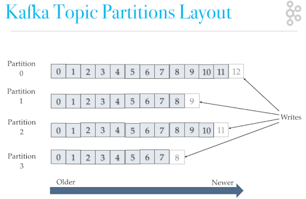

# 消息队列

使用消息队列场景:

1.**通过异步处理提高系统性能**

将用户的请求数据存储到消息队列之后就立即返回结果, 随后再对消息进行消费, 因为异步处理过程可能出现问题, 需要根据具体业务场景进行后续处理. 如火车购票.

2.**削峰/限流**

先将短时间高并发产生的事务消息存储在消息队列中，然后后端服务再慢慢根据自己的能力去消费这些消息，这样就避免直接把后端服务打垮掉. 如电商秒杀.

3.**降低系统耦合性**

如果模块之间不存在直接调用，那么新增模块或者修改模块就对其他模块影响较小.

生产者（客户端）发送消息到消息队列中去，消费者（服务端）处理消息，需要消费的系统直接去消息队列取消息进行消费即可而不需要和其他系统有耦合，这显然也提高了系统的扩展性。

另外，为了避免消息队列服务器宕机造成消息丢失，会将成功发送到消息队列的消息存储在消息生产者服务器上，等消息真正被消费者服务器处理后才删除消息。在消息队列服务器宕机后，生产者服务器会选择分布式消息队列服务器集群中的其他服务器发布消息。

**问题:**

1.**系统可用性降低：** 需要保证MQ的可靠性.

2.**系统复杂性提高：** 需要考虑消息重复消费、消息丢失、顺序消费等问题.

3.**一致性问题：**需要采用消息事务, 本地消息表等方式解决一致性问题.

| 特性       | RabbitMQ  | RocketMQ | Kafka   | Pulsar  |
| ---------- | --------- | -------- | ------- | ------- |
| 单机吞吐量 | 万级      | 10 万级  | 20 万级 | 100万级 |
| 消息可靠性 | 一般      | 很好     | 很好    | 很好    |
| 可用性     | 一般      | 高       | 高      | 高      |
| 持久化     | 内存/文件 | 磁盘     | 磁盘    | 磁盘    |
| 事务       | 支持      | 支持     | 支持    | 支持    |
| 功能丰富度 | 好        | 好       | 一般    | 一般    |
| 架构先进性 | 一般      | 好       | 好      | 很好    |
| 管理界面   | 好        | 好       | 一般    | 好      |
| 推出时间   | 2007      | 2012     | 2012    | 2016    |
| 文档       | 丰富      | 一般     | 丰富    | 一般    |
| 社区活跃度 | 活跃      | 一般     | 活跃    | 活跃    |

## 消息服务规范

1.JMS（JAVA Message Service,java 消息服务）

①点到点（P2P）模型

使用队列（Queue）作为消息通信载体；满足生产者与消费者模式，一条消息只能被一个消费者使用，未被消费的消息在队列中保留直到被消费或超时。

②发布/订阅（Pub/Sub）模型

发布订阅模型（Pub/Sub） 使用主题（Topic）作为消息通信载体，类似于广播模式；发布者发布一条消息，该消息通过主题传递给所有的订阅者，在一条消息广播之后才订阅的用户则是收不到该条消息的。

2.AMQP

AMQP 天然具有跨平台、跨语言特性。并AMQP 可以提供多样化的路由方式来传递消息到消息队列.

3.MQTT

## 消息传递

**服务质量标准**

MQTT协议中, 给出了三种传递消息时能够提供的服务质量标准,  服务质量从低到高依次是:

At most once: 至多一次. 即在消息传递时, 最多会被送达一次. 使用在允许消息丢失的场景.

At least once: 至少一次. 即在消息传递时, 至少会被送达一次. 不允许丢消息, 但允许少量重复消息出现.

Exactly once: 恰好一次. 即在消息传递时, 只会被送达一次. 不允许丢失不允许重复.

现在大部分mq提供的服务质量都是At least once, 很难保证不重复, 因此需要通过幂等性解决重复问题.

从系统的影响结果来说: At least once + 幂等消费 = Exactly once

**消息发送**

1. 同步发送

同步发送是指发送端在发送消息时，阻塞线程进行等待，直到服务器返回发送的结果。发送端如果需要保证消息的可靠性，防止消息发送失败，可以采用同步阻塞式的发送，然后同步检查Brocker返回的状态来判断消息是否持久化成功。如果发送超时或者失败，则需要重试(RocketMQ默认重试2次).

2. 异步发送

异步发送是指发送端在发送消息时，传入回调接口实现类，调用该发送接口后不会阻塞，发送方法会立即返回，回调任务会在另一个线程中执行，消息发送结果会回传给相应的回调函数。具体的业务实现可以根据发送的结果信息来判断是否需要重试来保证消息的可靠性。

3. 单向发送

单向发送是指发送端发送完成之后，调用该发送接口后立刻返回，并不返回发送的结果，业务方无法根据发送的状态来判断消息是否发送成功，单向发送相对前两种发送方式来说是一种不可靠的消息发送方式，因此要保证消息发送的可靠性，不推荐采用这种方式来发送消息。

### 可靠性投递

MQ如何实现可靠性投递?


•发送阶段，遇到高延迟，Producer会多次重发消息，直到Broker ack确认，过程中Broker会自动去重，超时Producer产生异常，应用进行捕获提示。

•存储阶段，Broker先刷盘再ack确认，即便ack失败消息不会丢失，多次重试直到Producer接收，会导致消息积压。

•消费阶段，Broker向Consumer发数据，一段时间未接收，自动重发，直到Consumer Ack确认，Consumer注意**幂等处理**。

在每个阶段的具体中, 每个mq也提供了具体的解决方案.

注意点:

> 考虑将 异步刷盘(NSYNC_FLUSH)，改同步刷盘  ,服务器宕机数据丢失

> 存储介质损坏，建议采用RAID10(保证单机存储)或分布式存储

> 不要启用Comsumer自动Ack，RabbitMQ存在此问题 ,后续无法重发

## Kafka

### 集群

Kafka通过zk维护成员关系, 每个broker都有唯一id(设置/自动生成), 启动时通过创建**临时节点**把id注册到zk的/brekers/ids路径. kafka组件订阅该路径, 当有broker加入或退出时, 可得到通知.

控制器负责分区的leader选举. 集群中第一个启动的broker会在zk创建一个临时节点/controller让自己成为控制器. 其他broker也会尝试创建, 但会创建失败, 然后会再该节点上创建watch对象, 监听该节点变更通知. 当控制器与zk断开连接时, 临时节点消失, 其他broker得到通知会重复开始的步骤选出新控制器.

> 为防止同时出现多个控制器(脑裂), 每个新控制器会通过zk的条件递增获取controller epoch. 其他broker会忽略旧epoch消息.

当控制器通过zk路径发现一个broker离开集群, 会为分区leader刚好在该broker上的分区副本选取新leader. 然后告诉那些包含了该分区(副本)的broker新leader和follower信息. 这时, **新leader开始处理请求, 新follower开始同步新leader;** 

> follower唯一作用为与leader保持一致, 如果leader(所在broker)崩溃, 提升其中一个为leader.

当控制器通过zk发现一个新的broker加入集群, 会通过broker id检查该broker是否包含现有分区的副本, 如果有, 控制器将变更同时发送给新加入的broker和其他broker, 新broker上的副本开始从leader处复制消息.

一个主题被分为多个分区, 分区可有多个副本保存在broker上.

为实现同步, follower向leader发送包含下一个同步偏移量(有序)数据的请求, leader根据每个follower的当前偏移量知道各自的同步进度. 如果follower在10s内没有任何请求消息, 或10s内没有请求最新的数据, 则认为该follower不同步. 在leader失效时, 不同步的follower无法参与新首领选举.

: 因为broker会拒绝分区leader在另一个broker(或不存在)的对特定分区的请求, 所以Kafka客户端需要自己通过元数据将请求发送到正确的broker. 客户端可通过向任一一个broker发送(每个都有缓存元数据信息)元数据请求, 获取客户端相关的topic列表信息, 包括这些topic所包含的分区、每个分区的副本、副本的首领信息. 并保证一定时间内刷新元数据.


在 Kafka 中，同一个**Topic 的消息会被分成多个分区**并将其分布在多个 Broker 上，**这些分区信息及与 Broker 的对应关系**也都是由 Zookeeper 在维护。比如我创建了一个名字为 my-topic 的主题并且它有两个分区，对应到 zookeeper 中会创建这些文件夹：`/brokers/topics/my-topic/Partitions/0`、`/brokers/topics/my-topic/Partitions/1`

**负载均衡** ：上面也说过了 Kafka 通过给特定 Topic 指定多个 Partition, 而各个 Partition 可以分布在不同的 Broker 上, 这样便能提供比较好的并发能力。 对于同一个 Topic 的不同 Partition，Kafka 会尽力将这些 Partition 分布到不同的 Broker 服务器上。当生产者产生消息后也会尽量投递到不同 Broker 的 Partition 里面。当 Consumer 消费的时候，Zookeeper 可以根据当前的 Partition 数量以及 Consumer 数量来实现动态负载均衡。

### 分区顺序消费

 Kafka 中 Partition(分区)是真正保存消息的地方,  而Partition又存在于 Topic中,  并且我们可以给特定 Topic 指定多个 Partition.

每次添加消息到 Partition的时候都会采用尾加法 . **Kafka 只能为我们保证 Partition(分区) 中的消息有序.**



所以要保证消息消费顺序,  可以**1 个 Topic 只对应一个 Partition**.  这样当然可以解决问题，但是破坏了 Kafka 的设计初衷.  

> Kafka 中的 Partition（分区） 实际上可以对应成为消息队列中的队列。这样是不是更好理解一点？

### 保证消息可靠性

1.对于生产者:生产者(Producer) 调用`send`方法发送消息之后，消息可能因为网络问题并没有发送过去。

我们不能默认在调用`send`方法发送消息之后消息发送成功了。为了确定消息是发送成功，我们要判断消息发送的结果。但是要注意的是  Kafka 生产者(Producer) 使用  `send` 方法发送消息实际上是异步的操作，可以通过 `get()`方法获取调用结果，但是这样也让它变为了同步操作.

```
SendResult<String, Object> sendResult = kafkaTemplate.send(topic, o).get();
if (sendResult.getRecordMetadata() != null) {
  logger.info("生产者成功发送消息到" + sendResult.getProducerRecord().topic() + "-> " + sendRe
              sult.getProducerRecord().value().toString());
}
```

但是一般不推荐这么做！可以采用为其添加回调函数的形式，

```
 ListenableFuture<SendResult<String, Object>> future = kafkaTemplate.send(topic, o);
        future.addCallback(result -> logger.info("生产者成功发送消息到topic:{} partition:{}的消息", result.getRecordMetadata().topic(), result.getRecordMetadata().partition()),
                ex -> logger.error("生产者发送消失败，原因：{}", ex.getMessage()));
```

> Producer 的`retries`（重试次数）可以设置一个比较合理的值，一般是 3 ，但是为了保证消息不丢失的话一般会设置比较大一点。设置完成之后，当出现网络问题之后能够自动重试消息发送，避免消息丢失。另外，建议还要设置重试间隔，因为间隔太小的话重试的效果就不明显了，网络波动一次你3次一下子就重试完了 


2.对于消费者

消息在被追加到 Partition(分区)的时候都会分配一个特定的偏移量（offset）。偏移量（offset)表示 Consumer 当前消费到的 Partition(分区)的所在的位置。Kafka 通过偏移量（offset）可以保证消息在分区内的顺序性。

当消费者拉取到了分区的某个消息之后，消费者会自动提交了 offset。自动提交的话会有一个问题，试想一下，当消费者刚拿到这个消息准备进行真正消费的时候，突然挂掉了，消息实际上并没有被消费，但是 offset 却被自动提交了。

**解决办法也比较粗暴，我们手动关闭自动提交 offset，每次在真正消费完消息之后再自己手动提交 offset 。** 但是，细心的朋友一定会发现，这样会带来消息被重新消费的问题。比如你刚刚消费完消息之后，还没提交 offset，结果自己挂掉了，那么这个消息理论上就会被消费两次。

3.对于kafka

假如 leader 副本所在的 broker 突然挂掉，那么就要从 follower 副本重新选出一个 leader ，但是 leader 的数据还有一些没有被 follower 副本的同步的话，就会造成消息丢失。

**设置 acks = all**

解决办法就是我们设置  **acks = all**。acks 是 Kafka 生产者(Producer)  很重要的一个参数。

acks 的默认值即为1，代表我们的消息被leader副本接收之后就算被成功发送。当我们配置 **acks = all** 代表则所有副本都要接收到该消息之后该消息才算真正成功被发送。

**设置 replication.factor >= 3**

为了保证 leader 副本能有 follower 副本能同步消息，我们一般会为 topic 设置 **replication.factor >= 3**。这样就可以保证每个 分区(partition) 至少有 3 个副本。虽然造成了数据冗余，但是带来了数据的安全性。

**设置 min.insync.replicas > 1**

一般情况下我们还需要设置 **min.insync.replicas> 1** ，这样配置代表消息至少要被写入到 2 个副本才算是被成功发送。**min.insync.replicas** 的默认值为 1 ，在实际生产中应尽量避免默认值 1。

但是，为了保证整个 Kafka 服务的高可用性，你需要确保 **replication.factor > min.insync.replicas** 。为什么呢？设想一下假如两者相等的话，只要是有一个副本挂掉，整个分区就无法正常工作了。这明显违反高可用性！一般推荐设置成 **replication.factor = min.insync.replicas + 1**。

**设置 unclean.leader.election.enable = false**

> **Kafka 0.11.0.0版本开始 unclean.leader.election.enable 参数的默认值由原来的true 改为false**

我们最开始也说了我们发送的消息会被发送到 leader 副本，然后 follower 副本才能从 leader 副本中拉取消息进行同步。多个 follower 副本之间的消息同步情况不一样，当我们配置了 **unclean.leader.election.enable = false**  的话，当 leader 副本发生故障时就不会从  follower 副本中和 leader 同步程度达不到要求的副本中选择出  leader ，这样降低了消息丢失的可能性。

### 磁盘顺序读写

大吞吐量, 天然支持Hadoop大数据生态

Kafka基于顺序读写实现高性能.

首先,无论是什么类型的硬盘, 硬盘随机读与顺序读性能差异极大:


kafka中的partition分区(类似其他MQ产品的消息队列) , 每个partition为一个单独的文件 ,所有新来的消息都是追加到文件末尾 , 所以每个partition一直处于持续递增状态. 

Q:但是partition中的数据被消费完后要删除不会破坏顺序关系吗?

A:kafka不实时删除数据 , 基于时间或分区大小等策略对数据统一批量删除 , 比起用完直接删效率高不少.


**页缓存**

Kafka避免使用JVM , 直接使用**操作系统的页缓存(内存)**特性提高处理速度, 进而避免了JVM GC带来的性能损耗.

Kafka采用字节(流)紧密存储，避免产生对象，这样可以进一步提高空间利用率

**零拷贝**

零拷贝表示不再产生内核态和用户态之间数据拷贝 .

通常kafka运行在Linux上 , linux要使用磁盘的数据 , 它会先加载到内核态的页缓存中(操作系统层面) ,  如果应用程序要对其进行管理 , 就需要把页缓存的数据复制到用户态中进行处理,  之后再把它放到Socket缓冲区发送.

而kafka在磁盘产生的数据加载到内核态中直接由内核态从页缓存发送到Socket缓冲区 , 不在设计用户态数据复制过程. 

**批量操作**

提供了大量批处理API , 可以让我们对数据进行统一压缩 与 合并, 通过更小的数据包以更快的方式发送 . 

## RocketMQ

[博客](https://mp.weixin.qq.com/s?__biz=Mzg2OTA0Njk0OA==&mid=2247485969&idx=1&sn=6bd53abde30d42a778d5a35ec104428c&chksm=cea245daf9d5cccce631f93115f0c2c4a7634e55f5bef9009fd03f5a0ffa55b745b5ef4f0530&token=294077121&lang=zh_CN#rd)


NameServer命名服务是RocketMQ特有(类似注册中心),用于

1.接收broker注册信息 , 完成主题与broker绑定;

2.每30秒, broker向NameServer上报心跳包;

> 消息在 Broker 端存储，如果是主备或者多副本，消息会在这个阶段被复制到其他的节点或者副本上。

### 高可用

生产高可用拓扑:NameServer 2-3个 , 采用多主多从方案.

对broker-a建立从broker-slave-a, 对broker-b建立从broker-slave-b , slave通过日志从master同步数据 , slave只提供读 ,master提供读写.

1.当a主挂了, a主停止写入服务, 此时:

Consumer到a从pull原来积压的数据 (RocketMQ不会自动进行主从切换);

Producer重试发送到b主, a主120秒后从NameServer摘除;

> 如果slave采用异步复制可能会丢失数据

2.当a主a从都挂了, 积压的数据都无法获取, 但不会丢失, 此时:

Producer将相同的消息重试发送给b主(同步到b从) 被Consumer消费;

a从恢复后, Comsumer继续消费;

3.a主b主都挂了, Producer无法发送消息, 此时:

Consumer多次重试后, 选择从提取积压数据;

数据不会丢失, 但无法产生新消息; 

4.NameServer挂, Producer/Consumer到NameServer List轮询, 从有效的NameServer获取broker信息

5.broker-a与NameServer2网络阻塞, 此时:

会导致两个NameServer状态不一致, 从而轮询到Consumer只能获取broker-b的数据(短板, 可手动摘除NameServer2) .

broker-a数据不会丢失, 但无法被消费, 直到网络a与NameServer2网络恢复.

### 主从复制

**同步复制**:阻塞,效率低,没有丢数风险.

Producer把消息发送给a主, a主在本地日志中写入后在a从同步前Producer都是阻塞的, 直到同步完成在返回响应.

如果出现断网则会导致消息失败而整体回滚, 保证主从一致.

**异步复制**:非阻塞,效率高,有丢数风险.

Producer把消息发送给a主, a主在本地日志中写入后就立即返回响应给Producer. 

而a从在响应过程中进行同步复制 , 加入在**响应后但未完成异步同步前主从断网**, a从会丢失数据, 从而主从不一致. 

### 保证消息可靠性

从消息发送、消息存储和消息消费三个阶段考虑可靠性.

**消费端**

RocketMQ架构模型中会有多个Borker为某个topic提供服务，一个topic下的消息分散存储在多个Broker存储端，它们是多对多关系。Broker会将其提供存储服务的topic的元数据信息上报到NameServer，对等NameServer节点组成的高可用服务会维护topic与Broker之间的映射关系，多对多的映射关系为消息可以重试发送到多个Broker端提供了前提与基础。

当发送端需要发送消息时，如果发送端中缓存了topic的路由信息，并包含了消息队列,则直接返回该路由信息,如果没有缓存或没有消息队列，则向NameServer查询该topic的路由信息，查询到路由消息之后，采用指定的队列选择策略选择相应的queue发送消息，默认是采用轮询策略，发送成功则返回, 收到异常则根据相应的策略进行重试，可以根据发送端感知到的Broker的时延、上次发送失败的Broker信息和发送端配置的是否重试不同Broker的参数以及发送端设置的最大超时时间等等策略来灵活地实现不同等级的消息发送可靠性保证。重试策略可以有效的保证消息发送成功的概率，最终提高消息发送的可靠性。


**MQ存储端**

在RocketMQ的消息存储结构中: 

- 消息队列存储的最小单位是消息Message。

- 同一个Topic下的消息映射成多个逻辑队列。

- 不同Topic的消息按照到达broker的先后顺序以Append的方式添加至CommitLog，顺序写，随机读。

目前RocketMQ存储模型使用本地磁盘进行存储，数据写入为producer -> direct memory -> pagecache -> 磁盘，数据读取如果pagecache有数据则直接从pagecache读，否则需要先从磁盘加载到pagecache中。

> Pagecache的刷盘策略有:
>
> **同步刷盘**: 
>
> ​	消息写入内存的 PageCache后，立刻通知刷盘线程刷盘，然后等待刷盘完成，刷盘线程执行完成后唤醒等待的线程，返回消息写成功的状态。这种方式可以保证数据绝对安全，但是吞吐量不大。
>
> **异步刷盘**（默认）
>
> ​	消息写入到内存的 PageCache中，就立刻给客户端返回写操作成功，当 PageCache中的消息积累到一定的量时，触发一次写操作，或者定时等策略将 PageCache中的消息写入到磁盘中。这种方式吞吐量大，性能高，但是 PageCache中的数据可能丢失，不能保证数据绝对的安全。
>
> 实际应用中要结合业务场景，合理设置刷盘方式，尤其是同步刷盘的方式，由于频繁的触发磁盘写动作，会明显降低性能。

Broker端CommitLog采用顺序写，可以大大提高写入效率，同时采用不同的刷盘模式提供不同的数据可靠性保证，此外采用了ConsumeQueue中间结构来存储偏移量信息，实现消息的分发。由于ConsumeQueue结构固定且大小有限，在实际情况中，大部分的ConsumeQueue 能够被全部读入内存，可以达到内存读取的速度。此外为了保证CommitLog和ConsumeQueue的一致性， CommitLog里存储了Consume Queues 、Message Key、Tag等所有信息，即使ConsumeQueue丢失，也可以通过 commitLog完全恢复出来，这样只要保证commitLog数据的可靠性，就可以保证Consume Queue的可靠性。

RocketMQ存储端采用本地磁盘进行CommitLog消息数据的存储，不可避免的就会带来存储可靠性的挑战，如何保证消息不丢失，RocketMQ消息服务一直在不断提高数据的可靠性。

解决单点故障可以采用增加Slave节点，主从异步复制仍然可能有极少量数据丢失，同步复制可以完全避免单点问题。

所以需要在性能和可靠性之间做出取舍，对于RocketMQ来说，Broker的可靠性主要由两个方面保障：

- 单机的刷盘机制
- 主从之间的数据复制

如果设置为每条消息都强制刷盘、主从复制，那么性能无疑会降低；如果不这样设置，就会有一定的可能性丢失消息。


**消费端**

RockerMQ默认提供了至少消费一次的消费语义来保证消息的可靠消费。

通常消费消息的确认机制一般分为两种思路：

1. 先提交后消费
2. 先消费，消费成功后再提交

思路1可以解决重复消费的问题但是会丢失消息，因此RocketMQ默认实现的是思路2，由各自consumer业务方保证幂等来解决重复消费问题。

1 消费重试

消费者从RocketMQ拉取到消息之后，需要返回消费成功来表示业务方正常消费完成。因此只有返回CONSUME_SUCCESS才算消费完成，如果返回CONSUME_LATER则会按照不同的messageDelayLevel时间进行再次消费，时间分级从秒到小时，最长时间为2个小时后再次进行消费重试，如果消费满16次之后还是未能消费成功，则不再重试，会将消息发送到死信队列，从而保证消息存储的可靠性。

2 死信队列

未能成功消费的消息，消息队列并不会立刻将消息丢弃，而是将消息发送到死信队列，其名称是在原队列名称前加%DLQ%，如果消息最终进入了死信队列，则可以通过RocketMQ提供的相关接口从死信队列获取到相应的消息，保证了消息消费的可靠性。

3 消息回溯

回溯消费是指Consumer已经消费成功的消息，或者之前消费业务逻辑有问题，现在需要重新消费。要支持此功能，则Broker存储端在向Consumer消费端投递成功消息后，消息仍然需要保留。重新消费一般是按照时间维度，例如由于Consumer系统故障，恢复后需要重新消费1小时前的数据。RocketMQ Broker提供了一种机制，可以按照时间维度来回退消费进度，这样就可以保证只要发送成功的消息，只要消息没有过期，消息始终是可以消费到的。


### 事务消息保证一致性

先写库还是先发消息?

1.先写库再发送消息, 在消息发送完提交事务, 如果消息发送失败, 则回滚. (通常的选择方案)

问题: 如果生产者发送消息时, 因为网络原因导致消息很久才返回结果, 这就意味着这段时间内数据库事务无法提交, 大量并发下, 数据库连接资源会在这段时间内迅速耗尽, 后续请求进入连接池等待状态, 最终导致系统终止响应.

2.先发送消息再写库, 在消息发送完收到成功返回后开始一次性写库提交.(问题更严重)

问题: 如果生产者发送完消息收到成功, 在执行写库的时候数据产生异常导致业务失败, 需要撤销已发送的消息. 这是只能再发送一个'撤销'的消息, 因为这样增加了额外的处理, 提高了要求与难度.

**RocketMQ的事务消息可保证应用本地事务与MQ最终一致性**

事务消息使用`TransactionMQProducer` 而不是默认的DefaultMQProducer, 并给Procucer绑定事务监听器`TransactionListener`(需要自己实现), 最后通过Producer的sendMessageInTransaction方法发送消息:

```
TransactionMQProducer producer = new TransactionMQProducer("transaction_producer_group");
//用于异步回查本地事务状态的线程
ExecutorService cachedThreadPool = Executors.newCachedThreadPool(new ThreadFactory(){
	@Override 	//指定ThreadFactory仅用于设置名称方便测试
	public Thread newThread(Runnable r){
		Thread thread = new Thread(r);
		thread.setName("check-thread");
		return thread;
	}
});
//绑定线程池
producer.setExecutorService(cachedThreadPool);
//绑定事务监听器, 用于执行代码
TransactionListener transactionListener = new OrderTransactionListenerImpl();
producer.setTransactionListener(transactionListener);
//启动生产者
producer.start();

//之后就可以发送消息交给RocketMQ事务消息自动处理啦~
//最主要的参数为第三个, 表示业务id
Message msg = new Message("order","order-1010","1010","模拟JSON数据".getBytes());
//使用sendMessageInTransaction发送消息 , 可指定附带参数
producer.sendMessageInTransaction(msg,null);
```

TransactionListener执行本地事务代码与回查代码:

```
public class OrderTransactionListenerImpl implements TransactionListener{
	//具体执行本地业务逻辑代码 msg.getkeys() 可获得业务id
	@Override
	public LocalTransactionState executeLocalTransaction(Message msg,Object arg){
		try{
			orderDao.insert(msg.getkeys(),xxx); //参数从消息和附带参数中获取
			orderDetailDao.insert(msg.getkeys(),xxx);
			//...
			connection.commit();  //提交;
			return LocalTransactionState.COMMIT_MESSAGE;   //提交消息
		}catch(Exception e){
			connection.rollback();  //回滚
			return LocalTransactionState.ROLLBACK_MESSAGE;	//回滚消息
		}
	}
	//回查逻辑 验证本地事务是否执行成功
	@Override
	public LocalTransactionState checkLocalTransaction(MessageExt msg){
		Order order = orderDao.selectById(msg.getkeys());
		OrderDetail orderDetail = orderDetailDao.selectById(msg.getkeys());
		if(order ! = null && orderDetail != null){
			return LocalTransactionState.COMMIT_MESSAGE;   //提交消息
		}else{
			return LocalTransactionState.ROLLBACK_MESSAGE;	//回滚消息
		}
	}
}
```

**正常流程**:

1.producer.sendMessageInTransaction(msg,null);执行成功

此时订单消息已经发送到MQ服务器(Broker), 不过该消息在Broker中的状态为"half-message",相当于存储在MQ中的临时消息, 此状态下的消息无法投递给消费者.

2.**生产者发送消息成功后自动触发监听器的executeLocalTransaction方法执行本地事务**.

当消息发送成功, 紧接着生产者向本地数据库写数据, 写入后commit事务, 同时executeLocalTransaction方法返回COMMIT_MESSAGE, 生产者会再次向MQ服务器发送一个commit提交消息, 此前在Broker中保存的订单消息状态就从"half-message"变为真正的已提交, 之后broker就可以将消息发送给下游的消费者.

**异常流程**:

1.producer.sendMessageInTransaction(msg,null);执行失败.

没有任何消息发出, 本地事务也不会执行, 仅报错.

2.在执行本地事务过程中发送异常,比如事务中的某一条insert语句报错.

本地事务执行rollback回滚, 数据库数据被撤销, 同时executeLocalTransaction方法返回ROLLBACK_MESSAGE代表消息回滚, 生产者再次向MQ服务器发送一个rollback消息, 将broker中保存的订单消息直接删除, 不会发送给消费者, 可以保证本地事务与MQ消息一致.

3.本地事务执行成功后executeLocalTransaction给broker返回COMMIT_MESSAGE时断网.

此时broker中的订单数据一直处于"half-message"状态被投递到消费者, 导致了本地事务与MQ消息的不一致性.

Rocket提供了**回查机制**解决此问题, 此时我们定义的监听器的checkLocalTransaction方法起到了作用~

**对于broker中的half-message, 每过一段时间就自动尝试与生产者通信, 试图调用回查方法确认之前的本地事务是否执行成功.**

如果在checkLocalTransaction方法中查询到了之前事务中插入的数据, 说明之前事务已经完成, 返回COMMIT_MESSAGE给MQ服务器, 这样Broker中的订单消息就可以被发送给消费者进行消费了. 

### 保证消息有序消费

1.生产者端要求按id等唯一标识分配消息队列, 按照该唯一标识顺序写入(比如商品的下单->减库存->发货三条消息标识相同顺序写入).

具体为实现MessageQueueSelector, 重写select方法根据消息唯一标识选择队列

2.消费者端采用专用的监听器保证对队列的单线程应用

具体为实现MessageListenerOrderly, 为每一个队列分配唯一的线程进行连接消费.

> MessageListenerOrderly只保证同一队列顺序消费, 不同队列不保证顺序消费
>
> 如果要实现消息全局顺序消费, 可在生产者端固定将所有消息发送到一个队列即可(全程单线程消费, 效率差)

> 有序消费只支持集群模式(clustering), 不支持广播模式(broadcasting: 一个队列所有消息分发给全部消费者)

## RabbitMQ


高级消息队列AMQ模型 定义的三个抽象组件:

1.Exchange: 用于把消息路由到队列;

2.Queue:负责存储接收到的消息, 然后顺序 投递

3.Binding: 用于告诉交换机消息应该被存储到哪个队列;

生产者将消息发给交换器的时候，一般会指定一个 **RoutingKey(路由键)**，用来指定这个消息的路由规则，而这个 **RoutingKey 需要与交换器类型和绑定键(BindingKey)联合使用才能最终生效**。

RabbitMQ 中通过 **Binding(绑定)** 将 **Exchange(交换器)** 与 **Queue(消息队列)** 关联起来，在绑定的时候一般会指定一个 **BindingKey(绑定建)** ,这样 RabbitMQ 就知道如何正确将消息路由到队列了,如下图所示。一个绑定就是基于路由键将交换器和消息队列连接起来的路由规则，所以可以将交换器理解成一个由绑定构成的路由表。Exchange 和 Queue 的绑定可以是多对多的关系。

生产者将消息发送给交换器时，需要一个RoutingKey,当 BindingKey 和 RoutingKey 相匹配时，消息会被路由到对应的队列中。在绑定多个队列到同一个交换器的时候，这些绑定允许使用相同的 BindingKey。BindingKey 并不是在所有的情况下都生效，它依赖于交换器类型，比如fanout类型的交换器就会无视，而是将消息路由到所有绑定到该交换器的队列中。 


**Broker（消息中间件的服务节点）**


 **Exchange Types(交换器类型)**

① fanout

把所有发送到该Exchange的消息路由到所有与它绑定的Queue中，不需要做任何判断操作，所以 fanout 类型是所有的交换机类型里面速度最快的。fanout 类型常用来广播消息。

② direct

把消息路由到那些 Bindingkey 与 RoutingKey 完全匹配的 Queue 中。

direct 类型常用在处理有优先级的任务，根据任务的优先级把消息发送到对应的队列，这样可以指派更多的资源去处理高优先级的队列。

③ topic

也是将消息路由到 BindingKey 和 RoutingKey 相匹配的队列中，但这里的匹配规则有些不同，它约定：

- RoutingKey 为一个点号“．”分隔的字符串（被点号“．”分隔开的每一段独立的字符串称为一个单词），如 “com.rabbitmq.client”、“java.util.concurrent”、“com.hidden.client”;
- BindingKey 和 RoutingKey 一样也是点号“．”分隔的字符串；
- BindingKey 中可以存在两种特殊字符串`*`和`#`，用于做模糊匹配，其中`*`用于匹配一个单词，`#`用于匹配多个单词(可以是零个)。
- 

 ④ headers(不推荐)

headers 类型的交换器不依赖于路由键的匹配规则来路由消息，而是根据发送的消息内容中的 headers 属性进行匹配。在绑定队列和交换器时指定一组键值对，当发送消息到交换器时，RabbitMQ会获取到该消息的 headers（也是一个键值对的形式)，对比其中的键值对是否完全匹配队列和交换器绑定时指定的键值对，如果完全匹配则消息会路由到该队列，否则不会路由到该队列。headers 类型的交换器性能会很差，而且也不实用，基本上不会看到它的存在。

### 工作模式

**工作队列模式**

在多个消息的情况下，Work Queue会将消息分派给不同的消费者，每个消费者都会接收到不同的消息，并且可以根据处理消息的速度来接收消息的数量，进而让消费者程序发挥最大性能。

Work Queue特别适合在集群环境中做异步处理，能最大程序发挥每一台服务器的性能。(**负载均衡**)

比如短信发送场景, 通过MQ将短信发送给多个短信服务实例


**发布订阅模式**

●发布/订阅模式中，生产者不再直接与队列绑定，而是将数据发送至“交换机Exchange”

●交换机Exchange用于将数据按某种规则送入与之绑定的队列，进而供消费者使用 (根据订阅者数量创建队列副本)。

●发布/订阅模式中，交换机将无差别的将所有消息送入与之绑定的队列，所有消费者拿到的消息完全相同。

发布订阅模式适合分发场景  , 数据提供商与应用商.

如中国气象局提供“天气预报”送入交换机，网易、新浪、百度、搜狐等门户接入通过队列绑定到该交换机，自动获取气象局推送的气象数据。


**路由模式(Routing)**

●路由（Routing）模式是在发布订阅模式基础上的变种。

●发布订阅模式是无条件将所有消息分发给所有消费者队列。路由模式则是Exchange根据Routing Key有条件的将数据筛选(精准匹配)后发给消费者队列。


**主题模式(Topic)**

●主题Topic模式是在Routing模式基础上，提供了对RouteKey模糊匹配的功能，可以简化程序的编写。

●主题模式下，模糊匹配表达式规则为

```
* 匹配单个关键字
# 匹配所有关键字
```

> 从执行效率上, 肯定是路由模式效率更高 ,能用路由模式尽量使用路由模式解决.


**远程调用模式(RPC)**

用于同步通信 , 无生产者消费者 , 使用两个队列实现.  

比如client要调用server的某个接口 , 可通过client发送请求到队列1中, server收到消息后进行处理; 

server处理完之后, rabbitmq自动将处理结果发送到队列2中 , client再从中接收处理.

> 在整个一来一回的过程中 ,  client处于阻塞状态.
>
> 有替代方案 ,Dubbo  ,所以几乎不使用

### 保证消息可靠性

从消息发送、消息存储和消息消费三个阶段考虑可靠性.

**生产者:**

1. 事务消息 : 使用 RabbitMQ 提供的事务功能，就是生产者发送数据之前开启 RabbitMQ 事务channel.txSelect，然后发送消息，如果消息没有成功被 RabbitMQ 接收到，那么生产者会收到异常报错，此时就可以回滚事务channel.txRollback，然后重试发送消息；如果收到了消息，那么可以提交事务channel.txCommit。

   > 缺点:RabbitMQ 事务机制是**同步**的，提交一个事务之后会阻塞在，严重降低性能。目前基本不使用.

2. confirm模式: 发送方将信道设置成confirm (确认)模式, 一旦这样设置，这个信道上所有发布的消息都会被指定一个唯一的ID，消息被投递到所匹配的队列后，rabbitmq会发送一个包含消息唯一ID的确认信息给生产者，使生产者知道消息送达。

**MQ:**

RabbitMQ收到消息后将这个消息暂时存在了内存中，那这就会有个问题，如果RabbitMQ挂了，那重启后数据就丢失了，所以相关的数据应该持久化到硬盘中，这样就算RabbitMQ重启后也可以到硬盘中取数据恢复。

因为message消息到达RabbitMQ后先是到exchange交换机中，然后路由给queue队列，最后发送给消费端。

所以需要给exchange、queue和message都进行持久化：

exchange持久化：

```
//第三个参数true表示这个exchange持久化
channel.exchangeDeclare(EXCHANGE_NAME, "direct", true);
```

queue持久化：

```
//第二个参数true表示这个queue持久化
channel.queueDeclare(QUEUE_NAME, true, false, false, null)
message持久化：
```

```
//第三个参数MessageProperties.PERSISTENT_TEXT_PLAIN表示这条消息持久化
channel.basicPublish(EXCHANGE_NAME, ROUTING_KEY, MessageProperties.PERSISTENT_TEXT_PLAIN, message.getBytes(StandardCharsets.UTF_8));
```

> 为了防止mq消息持久化时宕机导致丢失, 还可以做一些消息补偿机制, 比如 **消息入库**
>
> 在发送端首先发送消息前先将消息保存到数据库中，有一个状态字段status=0，表示生产端将消息发送给了RabbitMQ但还没收到确认；在生产端收到确认后将status设为1，表示RabbitMQ已收到消息。并设置一个定时器，定时检索消息表，将status=0并且超过固定时间后（可能消息刚发出去还没来得及确认这边定时器刚好检索到这条status=0的消息，所以给个时间）还没收到确认的消息取出重发（第二种情况下这里会造成消息重复，消费者端要做幂等性），可能重发还会失败，所以可以做一个最大重发次数，超过就做另外的处理。

**消费者:**

因为RabbitMQ的自动ack机制，即默认RabbitMQ在消息发出后就立即将这条消息删除，而不管消费端是否接收到，是否处理完，导致消费端消息丢失时RabbitMQ自己又没有这条消息了。

所以就需要将自动ack机制改为手动ack机制。

```
channel.basicAck(delivery.getEnvelope().getDeliveryTag(), false);
```


### 死信队列解决消息积压

每天上午10点，全国2万多名客户经理集中录入上一日JK单据到BorrowSale系统，峰值能达到500单/s但信审系统任务重，最多只支持到60单/s，基于普通模式的MQ每日会导致大量消息积压.

-->

最简单办法：RabbitMQ改为工作队列模式，将消息送给9个信审系统实例并行完成。但信审系统不愿配合，以预算不足为由拒绝，奶奶个腿！作为BorrowSale前台就得自己想办法解决消息积压问题.

-->

BorrowSale前台解决办法：依赖RabbitMQ的“**死信队列**”特性，将死信消息通过RabbitMQ的**死信交换机**自动送达死信队列中，BorrowSal前台通过绑定**死信队列**接收到死信消息，1小时后重新发送，等待闲时由信审系统进行处理。这样便实现了在不增加资源的前提下，对信审系统资源进行“削峰填谷”。


**什么是死信**？

•即过期或无法处理的消息。

**死信是怎么产生的**？

•消费者拒绝接受，且没有重新入列的消息

•队列满了，无法入列的消息

•消息设置了TTL过期时间，超过有效时间后的消息

•队列设置了TTL过期时间，超过有效时间后的消息

> 如果同时设置消息TTL和队列TTL , 以哪个更短为准

> 死信队列和死信交换机其实与标准队列和交换机队列没有本质区别 , 只不过是专门用来处理死信的


**配置死信**


# Push与Pull


|            | **Push**模式                                                 | Pull模式                                                    |
| ---------- | ------------------------------------------------------------ | ----------------------------------------------------------- |
| 实时性     | 较好，通过网络管道准实时发送                                 | 较差，取决于定时轮询时间                                    |
| 服务器状态 | 有状态，需持久化粉丝动态队列                                 | 无状态，根据请求实时查询                                    |
| 风险项     | 大V动态的并发“**写扩散**”问题  大量动态队列持久化造成磁盘高ＩＯ | 大量粉丝准点“**读扩散**”问题  大V粉丝准点并发查询搞垮服务器 |
| 应用场景   | 微信                                                         | 微博(早期)                                                  |

> 通常push的实现方案还可以向 Consumer 对象注册一个 Listener 接口，一旦收到消息，Consumer 对象立刻回调 Listener 接口方法。

**写扩散（Push）优化**

•设置上限，微信好友5000个 (因为每多一个推送端就多一个队列)

•限流策略，X分钟内完成消息发布

•优化存储策略，采用NoSQL或大数据方案

> push较好的实时性的代价很大

**读扩散（Pull）优化**

•MQ削峰填谷，超长队列直接拒绝(友好提示)

•增加轮询间隔，减少请求次数

•服务端增加缓存，优化查询效率

•增加验证码，分散时间，减少机器人刷票

**特殊:推特的混合模式**

•粉丝量小于X，Push模式

•粉丝量大于X，Pull模式


# 本地消息表保障最终一致性


为了保障该系统的最终一致性, 在MQ的发送方增加一个消息表, 登记了消息编号(唯一),要向接收方发送的消息内容(包含消息编号), 发送的消息状态, 创建时间.

上述流程如下:

1.订单系统在订单到来时, 更新订单库时在消息表中插入一条数据;

2.通过**定时任务**定时扫描消息表中当前消息状态为"正在处理"的消息, 通过mq的**process队列**发送到库存系统;

3.库存系统收到消息后根据消息内容更新库存, 之后由库存系统主动向mq的return队列发送处理结果(包含消息编号);

4.订单系统收到消息后根据消息编号将这条消息改为处理完毕;

对于这个过程中存在的情况:


> 注意消费端的幂等性

> 为防止消息表囤积, 可设置订单超时时间.