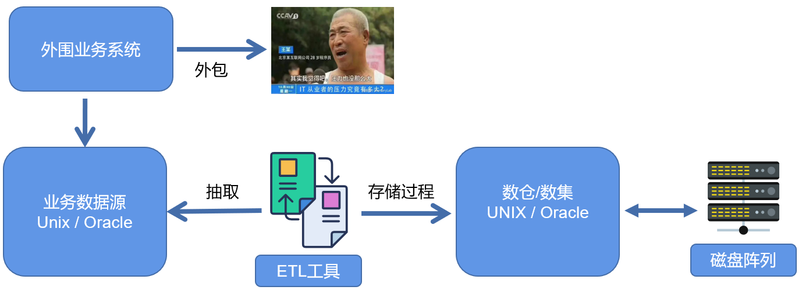
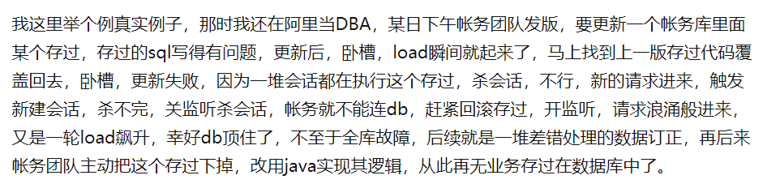
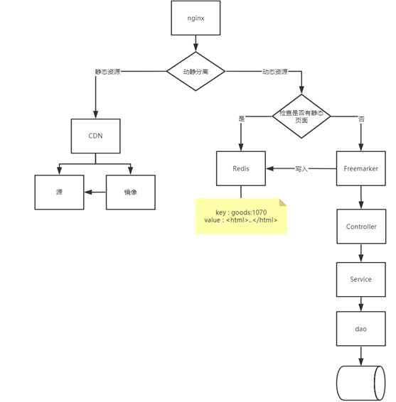

# 数据业务

## 高并发下乐观锁解决并发数据冲突

> 悲观锁性能差,用户体验差 ,且现在主流场景如电商都是读多写少

通过给表添加version字段实现, 每次修改前先查询出版本,修改数据时先判断版本并版本加一.

如果遇到冲突怎么办?

1. 前端应用提示"数据正在处理 , 请稍后再试";
2. 附加spring-retry在service上进行方法重试

```
@Transactional
//重试异常  最大重试次数  重试间隔默认1S
@Retryable(value = {VersionException.class}, maxAttempts = 3)
public void updateBal(){
    Account acc =  执行：”select id,bal,_version from acc where id = 1001”;
    acc.setBal(acc.getBal() + 400)；
    int count = 执行：“update acc set bal = ${acc.bal} , _version=_version + 1 
		where id = 1001 and _version=${acc.version}”；
    if(count == 0) { throw new VersionException(“产生并发异常”) }；
}

```

> 额外问题: 为什么不直接一条语句update即可?   尽量不要将计算放在sql语句中


## 使用代理主键而不是业务主键

为什么表的主键要使用代理主键（自增编号, 无意义），不建议使用业务主键(如身份证)?

常规上来说

1. 业务主键更浪费空间

2. 业务主键无顺序，可能会造成写入数据时需要更长组织索引

3. 业务主键如果是字符串，在分库分表时，无法直接取模运算，需要先转换为数字，处理更麻烦了。

业务架构上来说:

1. 有时难免会遇到需要修改业务主键的情况, 而如果分布式下多个模块依赖到此主键, 则带来了很麻烦的连锁反应
2. 对于目前常使用的逻辑删除情况下,  如果要再次插入已逻辑删除的数据 , 而因为使用了逻辑主键, 出现了主键冲突 .

> 这里为什么不直接修改已逻辑删除的数据 , 因为大多数业务不允许将删除前后数据关联起来 ,并且要存留删除后的信息 , 如员工在职信息

> 这里为什么不对逻辑删除字段和身份证信息进行联合主键呢? 抛开增加了主键复杂度不说 ,  假如员工需要二次离职呢? 又会出现主键冲突.  
>
> 关于逻辑删除与唯一索引的冲突 , [可见唯一索引与逻辑删除的冲突](#逻辑删除与唯一索引) 

## 逻辑删除与唯一索引

**逻辑删除:**实际业务中, 对删除的数据给它设置一个标记"已删除", 在后续正常查询中,会过滤这条数据. 

有利于排查问题与补救.

通常设置标记的字段数据类型有布尔类型(mysql中可以使用tinyint) ; 字符串类型(y/n).

而逻辑删除与唯一索引共同使用时, 比如博客系统中,标题+作者是唯一的, 用户发布了博客后不满意进行删除, 之后又发布一篇标题相同的博客,这时候就会引发唯一索引带来的冲突.

解决方案为 :  对于使用了逻辑删除的表,唯一索引上必须要加上逻辑删除的字段.

但是这样设计同样有问题 , 如果用户删除两次相同标题的博客, 同样会引发唯一索引冲突.

最终解决方案为: 使用时间戳来表示已删除, 使用0来表示未删除.

## mysq时间格式选择

1.不要选择字符串存储日期;

```
字符串占用的空间更大！
字符串存储的日期效率比较低（逐个字符进行比对），无法用日期相关的 API 进行计算和比较。
```

2.Datetime 和 Timestamp

通常选择Timestamp,因为**Timestamp 和时区有关**。Timestamp 类型字段的值会随着服务器时区的变化而变化，自动换算成相应的时间，说简单点就是在不同时区，查询到同一个条记录此字段的值会不一样。且Timestamp 只需要使用 **4 个字节**的存储空间

而**DateTime 类型是没有时区信息的（时区无关）** ，DateTime 类型保存的时间都是当前会话所设置的时区对应的时间。这样就会有什么问题呢？当你的时区更换之后，比如你的服务器更换地址或者更换客户端连接时区设置的话，就会导致你从数据库中读出的时间错误。且DateTime 需要耗费 **8 个字节**的存储空间.

> Timestamp范围只有 1970-01-01 00:00:01 ~ 2037-12-31 23:59:59

> SELECT @@session.time_zone;  # 查看当前会话时区 
>
> SET time_zone = "+00:00"; #设置当前会话时区
>
> SELECT @@global.time_zone; # 全局时区
>
> SET GLOBAL time_zone = '+8:00';

3.当需要存储比秒更小时间粒度的时间用BIGINT类型存储微妙级别的时间戳,或者使用double存储秒之后的小数部分.

时间戳不存在时区问题

# 规约

## 为什么不使用外键

> 【阿里JAVA规范】不得使用外键与级联，一切外键概念必须在应用层解决。

1.每次做DELETE 或者UPDATE都必须考虑外键约束，会导致开发的时候很痛苦,测试数据极为不方便。

2.性能问题, 在外键关联表插入数据是会带来额外的数据一致性校验查询 .

3.并发问题,外界约束会启用行级锁 ,主表写入时外键关联表会进入阻塞.

4.级联删除问题, 多层级联删除会让数据变得不可控, 触发器也严格被禁用.

5.数据耦合, 数据库层面数据关系产生耦合, 数据迁移维护困难.

## 禁止三表join

>【强制】超过三个表禁止join . 需要join的字段 , 数据类型必须绝对一致 ; 多表关联查询时, 保证被关联的字段需要有索引。
>
>说明: 即使双表join也需要注意表索引,sql性能.

产品强制要求: 阿里OceanBase(MySql改造) 只允许两表关联 , MyCat只支持两表关联.

原因:

1.Mysql自身设计缺陷, 超过三表关联时优化器做的不好 ; 

> 银行业务无此需求 , oracle无mysql的此缺陷

2.NLJ( 嵌套循环关联 )多级嵌套性能差, 贪心与动态规划算法计算量激增;

> NLJ采用小表关联大表(小表作为驱动表,大表作为匹配表)

3.依赖数据源特性获取数据, 数据迁移改造难;

比如有商品库和订单库,一条商品记录对应对条订单记录.

当订单量巨大时, 可能需要单独迁移出一个模块分开维护, 这时候商品服务需要restful|RPC调用订单服务,  此时单条join无法完成; 

或者当订单量巨大时 需要分表存储 , 此时单条join也无法完成 ,需要使用多条in语句进行查询(在商品表中查询出所有订单表的对应信息, 然后在每个订单表分片中使用in 查询) , 而使用in只适用于数据量小(最大1000),且只支持inner join.

解决方案

反范式表:将所有关联的表拼接成一个完整的大表(数据冗余) .

在数据变更时, 将数据插入反范式表中 , 但随着数据增多, 该表同样会变得臃肿.

> 为什么不使用视图 ,视图只是逻辑表 ,查询时还是需要结合多张表查询

**最终解决方案 数据集市**

通过ETL(抽取&转换&加载)每天(T+1日终处理,第二天凌晨)对数据源进行抽取 , 在数据仓库中进行加工处理生成额外的表.

> 在ETL数据集市中,通常还会使用生成倒排表的形式关联, 比如 在对订单明细表分片时, 不根据订单明细id进行分片, 而是根据订单id进行分片, 当需要获取指定订单id的订单明细时,  不需要遍历所有分片, 只需要对订单id取模获取其对应订单明细的分片.
>
> 通过每次日终额外生成倒排表提高数据提取效率 , 典型的空间换时间.

## 禁止使用存储过程

> 【强制】禁止使用存储过程,  存储过程难以调试和扩展, 更没有移植性。

1.为什么银行都在使用存储过程?

银行业务以数据为核心 , Oracle、DB2一统江湖，存储过程与语言无关 , 预算充足，好多个W采购小型机满足性能要求 ,存储过程几乎是每一个信息科技处开发员工的入职要求. 而银行被Oracle、DB2绑架 , 数据好迁移，存储过程要全部重写  ,谁来/谁敢承担核心业务的风险？



2.**存储过程在互联网分布式场景的问题**

① 分片场景下存储过程只能作用在局部数据(本分片);

② 数据库压力激增 

③ 无法保证分布式全局事务



## 禁止左模糊, 搜索引擎替代

> 【强制】页面搜索严禁左模糊或者全模糊, 如果需要请走搜索引擎来解决
>
> 说明: 索引文件具有B-Tree的最左前缀匹配特性, 如果左边的值未确定 ,那么无法使用索引

左匹配 `%xxx` 将不会使用索引 `using where`

**索引选择性(关键)**

mysql中的查询优化器 **会自动根据索引和数据分布情况决定是否走索引**

右匹配也不一定会使用索引: 如在大量数据的表下对手机字段使用 `1%`模糊匹配  或在程序员表的性别字段使用精确匹配,  这就是索引选择性差带来的全表扫描.

> 在不严谨的解释下: 命中的索引值超过总量的25% ,就可能产生索引选择性陷阱, 导致全表扫描.
>
> 当然 , 一切还是以Explain执行计划为准.

可通过组合索引提高选择性 ,  如果实在不能组合 , 对于**全文检索**就只能使用ES或Solr了(ES基于分片多线程检索, 解决查询慢的问题)

但加入ES就引发了后续架构复杂度 , 数据一致性 , 分布式.

另外, 单从mysql索引选择性差的问题上的解决方案也有:

1.强制使用索引( 以需要根据优化器以实际运行效果为准),如对选择题答案过滤时

```
explain select * from question force index(answer) where answer = 'A'
```

2.增加缓存, 提高全表扫描速度(钞能力), 更可加入redis.

```
innodb_buffer_pool_size=16G
innodb_buffer_pool_instances=2
```

# 高并发下的动静分离

动静分离是架构三大分离设计(读写分离,动静分离,前后台分离)之一

静态数据是”无个性化”数据

● 静态文件: HTML/CSS/JS/图片

● 低频变动数据: 字典数据 / 地区数据 / 组织架构 / 历史数据

动态数据就是个性化/高频写数据

● 个性化推荐 

● 高频写: 股市行情 / 5G信号数据 / 天气变化

> **有效区分页面中的动静数据是优化的关键前提**

 

> 静态缓存通常可通过CDN,Nginx,Varnish等实现, [可见](note/guide/distributed.md)

1.页面静态化技术

 将动态页面”另存为”静态页面保存到本地磁盘

 利用Nginx直接路由到磁盘文件,不再进入后端

 文件碎片化严重,文件同步管理麻烦

2.页面伪静态化技术(推荐)

 利用Redis缓存,缓存生成的页面

 没有碎片化问题,可自动过期,数据管理轻松

 需要大量内存存储信息



但是, 这种静态化不是万能的.

●静态化只适合数据集有限(百万量级)的场景

热点商品SKU

●页面集过大不适合静态化

商品全量SKU,文件碎片太多

批量同步磁盘IO瓶颈

伪静态化内存开销太大

●动态内容是静态化遇到的新挑战


**动静整合方案**

1.**服务端SSI法**

利用Nginx SSI特性实现服务端动静整合

SSI是Server Side Inclde的缩写，是一种基于服务端的网页制作技术，就是服务端包含的意思，该项目中用到了nginx中SSI模块的include命令，这个命令会包含一个页面，然后在nginx服务器中展开。

Nginx中SSI的开启:

```
在安装路径下的conf文件夹中的nginx.conf文件中添加如下三行代码,开启SSI
ssi on;
ssi_silent_errors on;
ssi_types text/html;
```

使用Nginx结合lua脚本通过判断文件路径前缀 , 分别进行动静访问.

2.Ajax异步调用法

生成静态页面,动态数据部分发起Ajax异步查询


# Nginx+keepalived+DNS实现高可用

在通常的一nginx多web服务器的架构下(反向代理+负载均衡) ,

为了实现高可用, 可以再配置一台Nginx ,并利用linux上的VIP屏蔽两台机器的实际ip  ,  外加keepalived利用VIP定时向nginx发送心跳, 如果一台挂掉, keepalived自动将VIP漂移到另一台上.

上述情况下 , 在第一台nginx没挂之前, 第二台nginx都是闲置状态 ,为了让另外一台nginx也投入使用,  可利用DNS轮询机制给一个域名绑定两个VIP ,  一个VIP指向第一台nginx ,一个VIP指向另一台nginx  . 而任一nginx挂掉, 都不影响使用.

DNS轮询缺点:

1.只负责IP轮询获取,不保证节点可用;

2.DNS IP列表更新有延迟;

3.外网IP占用严重(所以中间通过nginx转发);

4.安全性降低

# JDK序列化问题

目前springboot , springcloud下 ,都是默认使用基于HTTP的json作为序列化的首选方案.

而JDK内置的序列化却遭到抵制.

因为这是java 利用自带api生成序列化二进制流, 所以接收端只能强制使用java 开发才能识别, 失去了异构系统的跨平台性.

> JDK序列化可通过ByteArrayXXXputStream和ObjectXXXputStream实现

连java官方也说明:" 对不信任数据的反序列化 , 从本质上来说是危险的 , 应该予以避免" . 可见java序列化是不安全的.

比如在网络传输过程(网络安全由应用程序自己规定)中, 传输的序列化后的二进制流金额数据被注入攻击修改.

而基于HTTP的RESTFul风格传输的话, 数据采用json传递, 可使用https的SSL加密传输 ,可保证过程的安全.


另外, , 还有NIO的ByteBuffer序列化方式 , 在序列化执行效率上面 , 与java序列化差距不大.

但json序列化执行效率比java序列化更高(长度和速度上) , 因为java序列化需要处理对象的引用等.

> 附上其他序列化方案 Dubbbo内置的hessian 和 Google的Protocol Buffers

> 一些情况 如Spring session用Redis做session共享时 和 spring cache 用redis做缓存时  ,默认都是使用的jdk序列化
