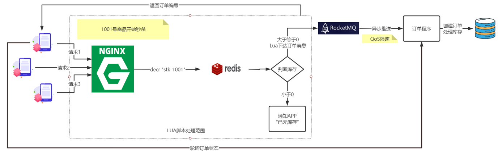

# 数据业务与场景

## 数据业务

### 秒杀下的防止超卖

特征:秒杀商品库存总量固定 , 先到先得，瞬间并发极大，但写库量有限.

利用`redis实现计数器 与 decr原子操作` +` nginx 与 lua脚本` 完成.




主要关键点:

1. 利用预减库存方式杜绝超卖

2. 利用Nginx+Lua+Redis在网关层面将无效请求阻挡

3. 利用MQ消息队列的QoS限流特性保证MySQL不会被瞬间击垮

4. APP需要额外设计轮询机制查询订单状态(类似使用银行卡转账后的转圈圈)

> TIPS: 订单创建后，用户取消订单或未支付怎么办？
> 
> 为订单设置过期时间，订单支付有效期过期或用户取消订单 . LUA执行 incr “stk-1001” 自增即可

### 乐观锁解决并发数据冲突

> 悲观锁性能差,用户体验差 ,且现在主流场景如电商都是读多写少

通过给表添加version字段实现, 每次修改前先查询出版本,修改数据时先判断版本并版本加一.

如果遇到冲突怎么办?

1. 前端应用提示"数据正在处理 , 请稍后再试";
2. 附加spring-retry在service上进行方法重试

```
@Transactional
//重试异常  最大重试次数  重试间隔默认1S
@Retryable(value = {VersionException.class}, maxAttempts = 3)
public void updateBal(){
    Account acc =  执行：”select id,bal,_version from acc where id = 1001”;
    acc.setBal(acc.getBal() + 400)；
    int count = 执行：“update acc set bal = ${acc.bal} , _version=_version + 1 
        where id = 1001 and _version=${acc.version}”；
    if(count == 0) { throw new VersionException(“产生并发异常”) }；
}
```

> 尽量不要将计算放在sql语句中直接update

### 高并发下的动静分离

动静分离是架构三大分离设计(读写分离,动静分离,前后台分离)之一

静态数据是”无个性化”数据

● 静态文件: HTML/CSS/JS/图片

● 低频变动数据: 字典数据 / 地区数据 / 组织架构 / 历史数据

动态数据就是个性化/高频写数据

● 个性化推荐 

● 高频写: 股市行情 / 5G信号数据 / 天气变化

> 有效区分页面中的动静数据是优化的关键前提, 比如淘宝商品的图片, 标题, 参数等为静态数据, 商品价格, 库存为动态数据.

> 静态缓存通常可通过CDN,Nginx,Varnish等实现, [可见](note/guide/distributed.md)

1.页面静态化技术

 将动态页面”另存为”静态页面保存到本地磁盘

 利用Nginx直接路由到磁盘文件,不再进入后端

 文件碎片化严重,文件同步管理麻烦

2.页面伪静态化技术(推荐)

 利用Redis缓存,缓存生成的页面

 没有碎片化问题,可自动过期,数据管理轻松

 需要大量内存存储信息


但是, 这种静态化不是万能的.

●静态化只适合数据集有限(百万量级)的场景

热点商品SKU

●页面集过大不适合静态化

商品全量SKU,文件碎片太多

批量同步磁盘IO瓶颈

伪静态化内存开销太大

●动态内容是静态化遇到的新挑战

**动静整合方案**

1.**服务端SSI法**

利用Nginx SSI特性实现服务端动静整合

SSI是Server Side Inclde的缩写，是一种基于服务端的网页制作技术，就是服务端包含的意思，该项目中用到了nginx中SSI模块的include命令，这个命令会包含一个页面，然后在nginx服务器中展开。

Nginx中SSI的开启:

```
在安装路径下的conf文件夹中的nginx.conf文件中添加如下三行代码,开启SSI
ssi on;
ssi_silent_errors on;
ssi_types text/html;
```

使用Nginx结合lua脚本通过判断文件路径前缀 , 分别进行动静访问.

2.Ajax异步调用法

生成静态页面,动态数据部分发起Ajax异步查询

### 使用代理主键

为什么表的主键要使用代理主键（如无意义的自增编号），不建议使用业务主键(如身份证)?

常规上来说

1. 业务主键更浪费空间

2. 业务主键无顺序，可能会造成写入数据时需要更长组织索引

3. 业务主键如果是字符串，在分库分表时，无法直接取模运算，需要先转换为数字，处理更麻烦了。

业务架构上来说:

1. 有时遇到需要修改业务主键的情况, 而如果分布式下多个模块依赖到此主键, 则带来了很麻烦的连锁反应
2. 对于目前常使用的逻辑删除情况下,  如果要再次插入已逻辑删除的数据 , 而因为使用了逻辑主键, 出现了主键冲突 .

> 不直接修改已逻辑删除的数据 , 是因为大多数业务不允许将删除前后数据关联起来 , 并且要存留删除后的信息 , 如员工信息

### 逻辑删除与唯一索引

**逻辑删除**:实际业务中, 对删除的数据给它设置一个标记"已删除", 在后续正常查询中,会过滤这条数据. 

有利于排查问题与补救.

通常设置标记的字段数据类型有布尔类型(mysql中可以使用tinyint) ; 字符串类型(y/n).

而逻辑删除与唯一索引共同使用时, 比如博客系统中,标题+作者是唯一的, 用户发布了博客后不满意进行删除, 之后又发布一篇标题相同的博客,这时候就会引发唯一索引带来的冲突.

解决方案为 :  对于使用了逻辑删除的表,唯一索引上必须要加上逻辑删除的字段.

但是这样设计同样有问题 , 如果用户删除两次相同标题的博客, 同样会引发唯一索引冲突.

最终解决方案为: 使用时间戳来表示已删除, 使用0来表示未删除.

### 海量数据下大页码查询

对于一个海量数据表, 执行下列sql

```sql
select * from table order by create_time limit 50000,10;
```

为了解决查询慢, 通常会给create_time增加索引,  但是实际并未生效, 因为没有使用where条件,   并且在create_time创建的索引下因为查询结果为*还要回表, 可能查询优化器认为走create_time执行效率比全表扫描还要慢, 所以走了全表扫描(explain的type 为ALL, Extra为Using filesort) ,在大数据量下这个执行效率是非常差的.

所以优化的主要方向为如何利用create_time索引?

A: 可利用索引覆盖特性查找第50000页的起始时间, 基于索引快速定位, 向后取10条数据:

```sql
select * from table where 
create_time >=
(
    select create_time from table 
    oreder by create_time limit 50000,1
)
order by create_time limit 10;
```

在这里, 子查询通过索引覆盖查出50000页的第一条数据, 效率是很高的(explian的type为index, extra为Using index), 接下来外层查询在order by和where下走了范围查询, 执行效率也得到了提高(explain的type为range,extra为**Using where**(也要回表))

拓展: 如果在连续翻页的情况下, 可利用上一页最后一条记录的时间, 作为下一页的查询起始时间, 可以减少一次子查询 .

这也是为什么很多地方UI只有上一页和下一页 还有移动端上拉加载下一页的原因, 没有显示总页数和总数减少获取总数和计算页数的过程.

>  高并发下不可取, 因为时间会重复, 在对后续页查询需要额外增加偏移量处理

> 另外时间采用时间戳效果会更好,不容易重复

实际上用户真的会点击10000页吗? 对于这些分页问题, 实际业务场景会有更好的策略. 而淘宝页面采用的是只支持最多查询到100页的方案. 

### 索引选择性

使用索引并不一定能降低SQL执行时间.

MySQL用到了索引和执行时间没有必然关系, 确定查询执行效率的是`扫描行数`与`回表次数`.

```sql
create table t (
    id int(11) not null,
    a varchar(64) default null.
    b int(11) default null,
    primary key (id)
    key a(a)
)engine-in
```

对于上面的表

```sql
explain select * from t ;
#全表扫描: type=ALL 不会使用索引

explain select * from t where id = 2;
#主键索引快速过滤 type=const key=PRIMARY rows=1

explain select a from t
#索引覆盖,无需回表 type=index key=a
```

特例

```sql
explain select * from t where id > 0;
#虽然key=PRIMARY 但是rows为实际所有行数
#基于id扫描全表, 且产生大量回表, 速度慢
```

联合索引, 假设t表有1亿条数据, 其中600万姓张:

```sql
create index t on (a,b);

explain * from t where a='张三' and b=23
#索引选择性较好

explain * from t where a like '张%' and b=23
#索引选择性较差
#如果姓张的人超过一个比例mysql可能不会走索引而全表扫描
#5.6以前基于a列对'张%'进行筛选然后回表对b列23进行筛选,速度较慢
#5.6以后基于联合索引对a筛选'张%'再对b过滤23,再将复合条件的id进行回表提取(索引下推)
```

> 索引选择性:mysql中的查询优化器 会自动根据索引和数据分布情况决定是否走索引, 可通过show index的cardinality与实际行数比较来评估

如何提高索引选择性?

1.增加多种不同规格索引提高索引选择性;

2.空间换时间, 定时任务增加时报, 日报, 月报等中间结果;

3.边缘运算数据压缩,比如物联网中对未出异常前的n条数据进行压缩, 使用时查询后解压, 异常数据不压缩(常用);

4.硬件调优, 增大innodb_buffer_pool, 多利用内存, 减少硬盘回表;

5.分库分表等

### 多个范围查询如何利用索引

对于索引(sex,country,last_login,age), 某相亲app用户如果想查询性别男, 中国, 年龄大于20小于25的最近7天登录过的用户.

```sql
where sex = '男'
and country = '中国'
and last_login > DATE_SUB(NOW(),INTERVAL 7 DAY)
and age between 20 and 25
```

因为存在两个范围查询, 所以想同时使用两个索引是不可能的, 只能寻找其他途径.

可通过新增一个列active, 用户每次登录将active设为1, 然后通过定时任务修改7天未登录过的用户active为0.

然后通过索引(sex,country,active,age)就可以进行查询啦

```sql
where sex = '男'
and country = '中国'
and active = 1
and age between 20 and 25
```

## 场景

### 12306

在数据存储与查询上面

> 读扩散: 购票扣减只需要关注该列车对于该票上起点和目标站点的票的扣减, 关注车次.
> 
> 读扩散优点: 扣减简单.   读扩散缺点: 计算余票复杂.
> 
> 写扩散: 购票扣减直接对各个相关站点进行扣减, 关注站点.
> 
> 写扩散优点: 扣减复杂.   写扩散缺点: 查询余票简单.

理论上对于读多写少的12306场景, 写扩散更加适合, 但实际上12306采用的是读扩散, 每次查询进行动态计算, 在引进了GemFire(内存数据库)之后, 巨大并发计算查询的瓶颈得到了解决, 其最大的特点为将**计算和存储都放在了内存**, 这也是其与redis(速度再快, 也只能取出来CPU计算)的区别.

GemFire基于Java开发, 将所有数据存放到内存, 聚集多台机器的内存汇成一个大节点整体管理, 并尽量保证业务运算与数据存储在同样一个节点, 避免多节点通信. 其内部通过Locator组件将请求路由到具有最新数据的Region. 并实现强一致性, 虽然用户感觉还是最终一致性, 因为有余票并不一定能买到. 

1.分时段售票、 候补抽票降低流量峰值

2.用复杂验证码解决灰色流量(抢票软件);

3.云计算弹性扩容解决读多写少的问题(实际上12306的上限已经确定, 并不需要频繁地去扩容, 不管是MQ,Redis, ES, 扩容都是相当复杂的);

4.在中间站点火爆的情况下, 需要预留两端距离更远的票;

### 西安健康码

健康码, 核酸检测报告无法打开.用户不断刷新, 增加了服务器的压力.

优化点:

1.客户端采取合并请求处理, 比如n秒内只能发出一个请求, 按钮点击以后倒计时;

2.避免实时运算, 对于与核心内容无关的静态数据, 可使用CDN+本地缓存兜底, 或友好提示;

3.因为全部用户都无法打开, 所以没有采取限流, 需要重点考虑阈值(大于需求小于极限),  在压力测试的时候需要持续测试, 因为如线程池、MQ等都是持续占用堆积的过程;

4.多级缓存(本地+集中式), 配合cache aside + 延迟双删, 为了防止缓存穿透, 可缓存null值, 不一致时间窗格为数据库数据库内容改变到缓存过期, 这个延迟是可以允许的,  因为健康码和核算检查其实晚一点获取到. 为了防止缓存击穿, 可阻塞其他线程只让一个线程去读取数据库. 为了防止缓存雪崩, 可随机设置超时时间;

5.两个功能同时无法提供服务, 可能服务没有做拆分, 通过微服务可以做故障隔离;

6.sql优化, 避免大事务;

7.实现APP无感知的后端扩容, 可使用容器技术动态扩容(有钱且有能力) 或 keepalived主从+智能DNS(可根据线路或区域等映射IP)实现互为主从保证高可用以及增加带宽; 

8.为了保持主从数据库一致性可采用半同步然后异步防止数据丢失(如果缓存设计恰当, 数据库的一致性设计不需要太复杂, 或直接使用redis持久化而丢弃数据库?);

9.增加监控系统, 系统性能预警(Prometheus, arths等),  Prometheus通过在各分布式机器上部署指标收集器exporter抽取指标信息存到本地tidb中, 再通过Grafana进行可视化分析, Prometheus还可以根据预定的规则推送警告信息通过AlertManager以各种方式发送给维护人员;

10.数据查询应用生成二维码JSON数据, 二维码图片在客户端APP动态解析生成;

11.redis集群模式通过crc16对身份证运算分配到不同的槽位,  对于redis集群模式, 不要利用其自带的转发模式, 因为转发节点压力大, 转发节点崩了就不可用了,  可以通过配置中心配置不同身份证运算后的范围应访问的redis机器ip.  另外, 如果需要动态扩容redis节点,再重新分配槽后, 可通过apollo配置中心的push模式动态修改配置文件;

> 如何估算平均QPS? 
> 
> 估算QPS = ( 1000万(预估西安人口,除去老人与小孩) * 12(预估每天12次) ) / ( 16(减去睡觉时间) * 3600(秒) )
> 
> = ( 10000000 * 12 ) / ( 16 * 3600 )  = 2085
> 
> 如何根据估算QPS选择部署的web节点或redis节点等的数量?
> 
> 可采用20倍均值原则计算需要的负载峰值能力,  并根据压测结果决定数量
> 
> 节点数 = ( 平均QPS * 20 ) / (单机压测峰值 * 80% )
> 
> 这里平均QPS * 20 表示峰值预估 , 这里为  2085 * 20  = 41700
> 
> 为什么单机压测峰值要乘0.8?  因为不能刚好踩点进行节点数选择, 且提供20%的扩容时间余地 ( 可通过Prometheus监测总体压力超过80%时进行提醒去扩容)
> 
> 假设单机服务器压测值为2000 QPS , 结果为
> 
> 节点数 = 41700 / ( 2000 * 0.8 ) = 27台

> 如何估算缓存二维码数据的redis节点的带宽和容量?
> 
> 假设一个二维码JSON为 1kb , redis节点4台
> 
> 先看一下需要的总和带宽 = 41700 * 1kb * 8 = 326MB, 无论是QPS还是带宽, 这对于机器来说压力其实不大.
> 
> redis节点内存 = 10000000人 * 1kb / 4台 = 2440mb = 2.3gb 

### 红包雨

场景: 1亿金额, 10亿个红包, TPS预计百万级.

1.TPS过大, 流量入口如果为同一个, 如nginx( Linux下一台nginx通常最大5w/s), 肯定顶不住, 可考虑LVS(十万级)、 F5(百万级)商用设备;

2.活动开始前将红包分配给不同地区的机房, 通过HTTP/DNS, 将用户的请求落到本地机房处理, 最后MQ同步到账户服务, 更新钱包(有延迟);

3.本地TPS可能还是有十万级, 本地也需要高性能, 服务器集群可根据TPS冗余部署, 以redis为例, 如果本地TPS为50W, 每台redis 8W, 需要7台, 可冗余部署到10台, 在应用层做轮询, 挂了需要剔除;

4.每个redis实例存储一个 `红包id+红包金额`的List, 抢红包时可使用Lua脚本从List中pop一个元素, 同时记录到另一个 `用户id + 红包id + 红包金额`的list, 最后通过定时任务不断从redis集群中取出用户id和金额数据, 批量插入到Mysql集群, 同时通过MQ或活动结束后同步到账户服务;

5.Mysql可通过用户id进行分库, 以支持通过用户id查询其红包列表;

6.红包拆分算法, 需要保证公平, 红包不能为0;

> 二倍均值法: 每次红包金额 = random( 0, 剩余红包金额 / 剩余人数 * 2)
> 
> 除了最后一个红包, 其他任何一个红包不会超过人均金额的两倍. 实现简单, 空间复杂度低.
> 
> 线段分割法: 红包总额为线段，而每个红包金额为这条主线段所拆分出的若干子线段。(N-1个切割点)
> 
> 实现较复杂, 红包差额可能出现较大的情况, 可通过多线程再分段优化性能处理.

7.风控防刷, 与高并发相矛盾, 因为每次请求都需要走一遍风控规则判断, 需要进行权衡. 可在同步到账户前异步进行风控规则;

8.另外需要考虑高可用, 无状态服务弹性伸缩, 压测和限流等.

### 银行交易系统隔离

场景:交易系统安全级别高, 需要独立部署. 而交易数据需要被外围系统获取, 交易系统不能直接开放接口.


1.因为银行外围系统对交易实时性要求不高, 可采用T+1数据获取. 银行通常使用oracle数据库, 在每天凌晨发起任务调度脚本, 通过oracle自带的SqlLoader数据导出工具导出为csv文件并推送到独立的FTP服务器上.

> CSV为逗号分割数据格式的文件

2.FTP服务器提供交易核心系统写权限, 外围读权限.

3.通过ETL(导出&转换加工&导入)工具读取CSV文件导入到ODS中. 并提供ETL日志, 用于错误发现,

> ODS又称数据中台或数据仓库, 用于存储分析处理后的数据.

所有外围系统只能面向ODS获取数据, 而无法接触核心系统, 保障了数据隔离

### PC扫码登录

**微信手机端登录流程**:

1.微信输入手机号+验证码发送给服务器

2.服务器校验验证码并绑定设备, 最终生成token(手机号, 设备唯一标识, 操作系统, 其他唯一标识)返回

3.手机端通过请求头携带token调用服务器API

4.服务器验证token格式, 校验token与设备(唯一标识)是否对应(防止盗用), 验证是否具有该API访问权限. 如都满足, 则放行

**微信PC端扫码登录流程**

阶段一: 二维码生成

1.用户打开PC端微信登录界面, 微信发送PC唯一标识(如设备标识、 MAC等)

2.服务器生成PC端**二维码id并与PC设备绑定**, 然后返回给PC端, 此时二维码状态为`待扫描`

3.PC端根据二维码id生成二维码显示, 并**定时轮询二维码状态**

> PC端轮询二维码状态为`待扫描`时显示二维码

阶段二: 手机扫码

1.用户通过手机微信扫描PC端二维码, 获取二维码id

2.手机微信app将**手机token**(微信手机端登录生成的)与**二维码id**发送给服务器

3.服务器将手机token与二维码id进行绑定并生成**临时token**, 然后返回给手机端, 更新二维码状态为`已扫描`

> 临时token用于保证扫码的手机和确认登录的为同一设备, 防止伪造.

> PC端轮询二维码状态为`已扫描`时显示用户简单信息(头像与昵称), 并提示`需在手机上确认登录`

阶段三: 确认登录

1.用户通过手机微信点击`确认登录`, 请求头附加临时token给服务器

2.服务器验证临时token与设备是否对对应, 然后**销毁临时token生成正式token**(与PC设备绑定), 然后响应手机端登录成功, 更新二维码状态为`确认登录`

3.手机端收到登录成功响应显示操作成功

4.此时PC端定时轮询二维码状态发现二维码状态为`确认登录`, 从服务器提取PC正式token.

5.PC端微信通过请求头访问服务器API

### 自动取消未支付订单

1.利用定时任务每隔一段时间扫描数据库, 对过时的订单删除

缺点: 时效性差

2.Redis6客户端缓存监听, 一旦订单对应的key过期, 触发监听更新数据库, 在复杂场景下value可存储其他有用信息, 如订单所在的存储实例.

缺点: 长链接, 若断开监听将失效, 需要人工补偿; 版本6依赖

3.RocketMQ延迟消息或者JDK自带的, RabbitMQ死信队列.

延迟消息好理解; 死信队列利用消息积压, 指定时间内未处理的死信队列, 死信送达到取消订单消费端处理.

缺点: MQ操作与运维; 幂等

### 秒杀

秒杀场景设计可redis缓存goods_id为key, 库存为value, 再加goods_id为key, 售出用户列表为value, 每个用户在前面需要对库存进行判断是否大于0,  在并发场景下容易出现超卖现象.

可通过Lua脚本保证三次访问redis为原子操作.

### GIS文件检索系统

```
需求:
1.公司希望开发一套文件检索系统,承载海量地理信息文件,提供多维度的数据检索,要求这个系统能提供高可用与高并发性能.
2.每一组GIS地图瓦片(分片)都是JSON文件(元数据)+若干图片+二进制地理数据文件,尺寸均小于100k.
3.这些地理数据比较稳定,不定期会产生小规模更新.
4.目前积累的数据量约为1T, 目测文件数量最少上千万.
5.应用UV(UserAccess)很低,日均100-200访问,但QPS并发了很高,因为一张地图要切分十几(百)个瓦片,在访问时并发获取.
```

核心复杂度:

JSON数据如何进行多维度检索; 上千万JSON数据查询是否存在性能瓶颈; 高并发下上千万文件磁盘IO是否扛得住; 如何保证数据库与磁盘是可靠的; 是否存在带宽等附加问题.

1.JSON的存储与解析:

MySQL8支持存储解析JSON, 但不专业; 可使用支持上亿海量数据的MongoDB(可自动解析JSON), 并基于集群分片保障数据可靠性.

2.文件存储:

数据库存储的是文件的地址, 提取还是要从硬盘, 上千万文件的随机读光寻址都要等很久, 所以选择SSD来支持随机读, 缺点成本高.

3.存储高可用:

1T存储空间不大(在UV极小的情况下, QPS在IO上也是小问题). 可采用下列方式:

Raid 10 : 存在50%冗余;

Raid 5 : 预算有限时可采用, 部分冗余

如果数据服务器本机部署, 虽然不用考虑网络带宽问题, 但所有磁盘都挂载在一台服务器上在物理上会形成单点.

可将应用服务与文件存储分开, 文件存储更是可采用分布式文件系统(建议FastDFS , Hadoop HDFS存储小文件效率比FastDFS差很多).

4.带宽

如果一块地图平均需要25个瓦片数据, 每个瓦片100KB, 如果处理时间相同情况下, 数据同时返回, 每个用户需要25 * 100KB * 8 = 20000kbps 即 20m的带宽, 这在局域网兴许可以, 但在广域网传输显然带宽占用太多,  还需要额外考虑资源压缩传输.

### 系统架构容量评估

根据业务确定评估点

- 数据量: 如银行交易流水系统
- 并发和吞吐: 如演唱会门票售卖, 双十一秒杀
- 活动带宽: 如直播平台
- 服务器CPU与GPU: AI与大数据分析系统
- 存储介质的可靠性: 如金融机构多活容灾
- 安全性与实时性: 如外贸交易系统

以最常见的商品推送为案例: 某电商网站有用户2000W,需要60分钟内完成所有的用户消息推送, 而按以往经验预估10%的用户会打开页面.

访问量: 2000W * 10% = 200W

平均QPS: 200W/ 3600 = 555 (实际上前期QPS远超于平均QPS)

>  如何评估QPS峰值?
> 
> 1. 根据运营经理或数据部门推断;
> 
> 2. 若新项目无数据支撑, 可考虑二八原则(不适用于秒杀):
>    
>    ```
>    80%的流量产生在20%的时间(这也是为什么实际QPS比平均QPS高很多)
>    ```

根据二八原则, 峰值QPS为: 555 * 4 = 2220

> 测试单机QPS可通过Jmeter, LoadRunner,Postman等

假设单点设备QPS极限为400, 生产性能基线为80%(不能以QPS极限来考虑, 随时有宕机风险, 需要冗余考虑)

服务器应准备2220/(400*80%) ≈ 6.9 = 7 台

## 数据处理

**分治法**

1.**共同URL**: 给定a、b两个文件, 各存放 50 亿个 URL, 每个 URL 各占 64B, 内存限制是 4G. 找出a、b两个文件共同的 URL.

分治策略把一个文件中的URL按照某个特征划分为多个小文件, 使得每个小文件大小不超过 4G (实际需要更小);

每个URL占64B, 那么50亿个URL占用的空间大小约为 320GB. 分别对a,b两个文件进行遍历, 对遍历到的URL进行`hash(URL)%1000`, 结果相同的存放到一个文件ai或bi(0<=i<=999).这样每个小文件大小约为300MB(若有对小文件超过了4G, 可再进行分解).

接着将ai中的URL存储到Set集合中, 然后将bi中每个URL查看是否存在于Set集合, 若存在, 表示为共同URL, 将其保存在单独的文件即可.

2.**高频数据**: 1GB大小的文件, 文件里每一行是一个词, 每个词的大小不超过16B, 内存大小限制1MB, 要求返回频数最高的100个词(Top100).

分治策略把一个大文件分解成多个小文件, 保证每个文件的大小小于1MB(实际更小).

遍历大文件, 堆遍历到的词执行hash并取模5000, 存放到ai文件(0<=i<=4999), 每个小文件大约为200KB(若超过了1MB, 继续分解); 使用Map统计每个词出现的次数, key为词, value为次数; 最后维护一个最小堆来找出TOP100, 对顶为最小出现次数的单词, 若遍历到大于堆顶词的出现次数的词, 则用新词替换堆顶词然后重新调整堆, 遍历结束后堆上的词即结果(Leetcode 215TopK).

3.**中位数**: 从 5 亿个数中找出中位数.

分治策略把5亿数字根据高位二进制分解成多个小文件.

遍历所有数, 按二进制最高位(如果是有符号数, 则为符号位)存储到a0,a1两个文件; 结果哪个文件大则代表中位数在哪个文件, 在内存中对该文件排序后找出中位数即可(若内存不够可继续对大的文件根据次高位进行分解).

4.**去重**

**位图法**

1.**去重,是否存在**
