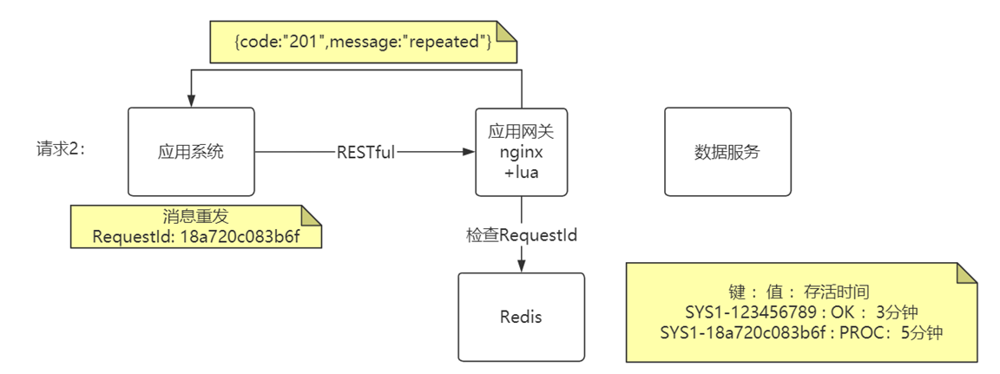
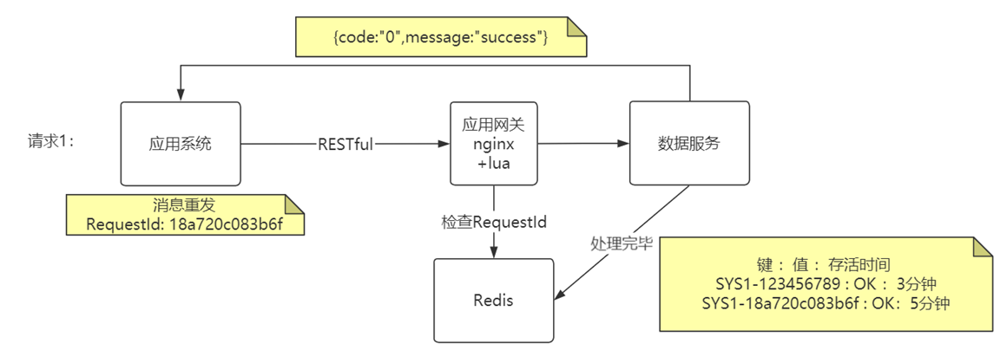

# 高并发下乐观锁解决并发数据冲突

> 悲观锁性能差,用户体验差 ,且现在主流场景如电商都是读多写少

通过给表添加version字段实现, 每次修改前先查询出版本,修改数据时先判断版本并版本加一.

如果遇到冲突怎么办?

1. 前端应用提示"数据正在处理 , 请稍后再试";
2. 附加spring-retry在service上进行方法重试

```
@Transactional
//重试异常  最大重试次数  重试间隔默认1S
@Retryable(value = {VersionException.class}, maxAttempts = 3)
public void updateBal(){
    Account acc =  执行：”select id,bal,_version from acc where id = 1001”;
    acc.setBal(acc.getBal() + 400)；
    int count = 执行：“update acc set bal = ${acc.bal} , _version=_version + 1 
		where id = 1001 and _version=${acc.version}”；
    if(count == 0) { throw new VersionException(“产生并发异常”) }；
}

```

> 额外问题: 为什么不直接一条语句update即可?   尽量不要将计算放在sql语句中

# 幂等性

**指的是发一次接口调用与发多次相同的接口消息都能得到与预期相符的结果**

在实际应用中 , 为了提高通信的可靠性,通信框架/MQ可能会向数据服务推送多条相同的信息 , 如

```
PUT https://xxxxx.com/employee/salary
{"id" : "1:,"incr_salary":500}
```

后台逻辑为

```
//典型的ORM做法
Employee employee = employeeService.selectById(1);
employee.setSalary(employee.getSalary() + incrSalary);
employeeService.update(employee)
```

问题在于每重复发送一次请求工资就会多500

解决办法:

1.代码前置判断

```
if(!员工已调薪){进行调薪}
```

缺点: 项目中需要前置判断的地方太多了，一不留神就漏了 , 这种技术问题不应该成为干扰程序员写业务代码的因素

所以大家需要一种无侵入的幂等解决方案.

2.**幂等表**

应用系统发送请求,


应用系统再次请求, redis中已经存在requestid



数据服务处理完更新,修改redis中value



> 后台接口可通过AOP修改redis.
>
> requestId可通过后端生成, 在每次访问应用中可能应发幂等性问题的页面时返回.
>
> 如果提交表单中存在唯一约束,可以将该唯一约束缓存来替代requestId, 比如用户名唯一. 操作完对缓存进行及时删除.