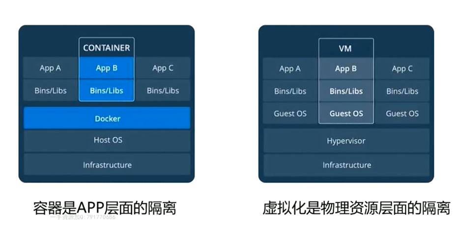
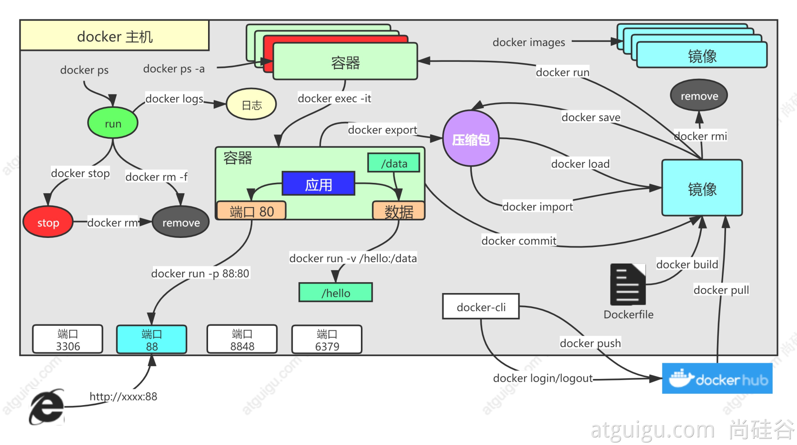
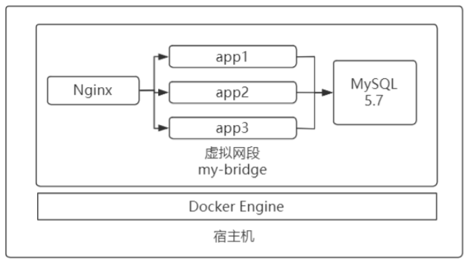
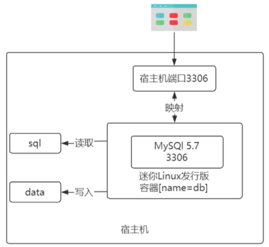
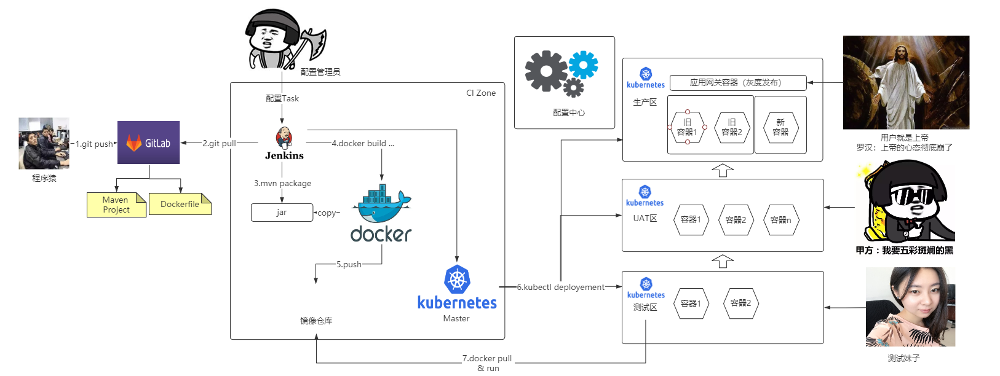

# 容器化

物理机时代 --> 虚拟机时代  -->  容器化时代(轻量级VM, 灵活)



阿里云腾讯云根据虚拟机+容器化构建云原生

镜像: 镜像是文件,是只读的,提供了运行程序完整的数据,是应用程序的"集装箱"

容器: 镜像的运行环境,迷你的"linux操作系统",由Docker负责创建,容器之间彼此隔离

## Docker


Docker_Host：安装Docker的主机

Docker Daemon：运行在Docker主机上的Docker后台进程

Client :  操作Docker主机的客户端（命令行、UI等） 

Registry：镜像仓库 Docker Hub

Images：镜像，带环境打包好的程序，可以直接启动运行

Containers：容器，由镜像启动起来正在运行中的程序

核心为资源隔离:

- cpu、memory资源隔离与限制
- 访问设备隔离与限制

- 网络隔离与限制
- 用户、用户组隔离限制

常用命令



镜像相关

```
docker pull nginx  #下载最新版
镜像名:版本名（标签）
docker pull nginx:1.20.1
docker pull redis  #下载最新
docker pull redis:6.2.4
## 下载来的镜像都在本地
docker images  #查看所有镜像
redis = redis:latest
docker rmi 镜像名:版本号/镜像id
```

启动容器

```
docker run [OPTIONS] IMAGE [COMMAND] [ARG...]
【docker run  设置项   镜像名  】 镜像启动运行的命令（镜像里面默认有的，一般不会写）
# -d：后台运行
# --restart=always: 开机自启
docker run --name=mynginx   -d  --restart=always -p  88:80   nginx
# 查看正在运行的容器
docker ps
# 查看所有
docker ps -a
# 删除停止的容器
docker rm  容器id/名字
docker rm -f mynginx   #强制删除正在运行中的
#停止容器
docker stop 容器id/名字
#再次启动
docker start 容器id/名字
#或者一次性重启
docker restart 容器id/名字
#应用开机自启
docker update 容器id/名字 --restart=always
```

修改容器内容

```
# 1. 进入容器内部的系统，修改容器内容
docker exec -it 容器id  /bin/bash
# 2. 挂载数据到外部修改  ro只读 rw读写..
docker run --name=mynginx   \
-d  --restart=always \
-p  88:80 -v /data/html:/usr/share/nginx/html:ro  \
nginx
# 修改页面只需要去 主机的 /data/html
```

提交改变:将自己修改好的镜像提交, 打包到别的机器加载(通常是通过推送到hub来实现)

```
docker commit [OPTIONS] CONTAINER [REPOSITORY[:TAG]]
docker commit -a "leifengyang"  -m "首页变化" 341d81f7504f guignginx:v1.0
# 下次可直接运行该镜像
docker images
docker run -d -p 88:80 guigninx:v1.0
# 如果想让其他docker服务器使用该镜像 可以:
# 1. 将镜像保存成压缩包
docker save -o abc.tar guignginx:v1.0
# 2. 别的机器加载这个镜像
docker load -i abc.tar
docker images
# 接下来可docker run ...
# 离线安装
```

推送到远程仓库docker hub: 需要注册, create repository 

```
# 官方提供了如下命令
docker tag local-image:tagname new-repo:tagname
docker push new-repo:tagname

# 把旧镜像的名字，添加一个仓库要求的新版名字
docker tag guignginx:v1.0 leifengyang/guignginx:v1.0
# 需要先登录到docker hub
docker login       
docker logout（推送完成镜像后退出）
# 推送
docker push leifengyang/guignginx:v1.0
# 别的机器下载
docker pull leifengyang/guignginx:v1.0
```

如果需要启动失败的情况, 无法访问启动的应用, 需要启动排错

```
#查看所有运行的容器, docker ps无法查看启动失败的容器
docker ps -a
#查看日志
docker logs 容器名/id 
```

其他常用

```
docker exec -it 容器id /bin/bash

# docker 经常修改nginx配置文件 挂载 这里宿主机/data/conf/nginx.conf需要存在,否则会被docker识别为
docker run -d -p 80:80 \
-v /data/html:/usr/share/nginx/html:ro \
-v /data/conf/nginx.conf:/etc/nginx/nginx.conf \
--name mynginx-02 \
nginx

#把容器指定位置的东西复制出来 
docker cp 5eff66eec7e1:/etc/nginx/nginx.conf  /data/conf/nginx.conf
#把外面的内容复制到容器里面
docker cp  /data/conf/nginx.conf  5eff66eec7e1:/etc/nginx/nginx.conf

do
```

指定启动命令,以redis为例, 比如要设置持久化和redis密码(追加appdendonly yes 和 requirepass 350562即可)

```
docker run -v /data/redis/redis.conf:/etc/redis/redis.conf \
-v /data/redis/data:/data \
-d --name myredis \
-p 6379:6379 \
redis:latest  redis-server /etc/redis/redis.conf
# 从docker官方得知 redis默认启动命令为:redis-server /usr/local/etc/redis/redis.conf
# 这里将默认的启动命令改为了/etc/redis/redis.conf
# 而前面也将宿主机的/data/redis/redis.conf挂载到了/etc/redis/redis.conf
```


### 基于虚拟网段

使用Centos7下Docker发布Nginx+Tomcat+MySQL项目



1.安装Docker

```
#安装底层工具
sudo yum install ‐y yum‐utils device‐mapper‐persistent‐data lvm2
#加入阿里云yum仓库提速docker下载过程
sudo yum-config-manager \
--add-repo \
http://mirrors.aliyun.com/docker-ce/linux/centos/docker-ce.repo
#更新仓库的源信息
sudo yum makecache fast
#下载docker安装
sudo yum ‐y install docker‐ce
sudo yum install -y docker-ce docker-ce-cli containerd.io
#启动docker服务
sudo systemctl start docker
systemctl enable docker --now
#显示docker客户端和服务端信息(docker引擎) ,版本对应兼容性更好
docker version
```

2.aliyun加速镜像下载

https://cr.console.aliyun.com/cn-shanghai/instances/mirrors  --> 镜像加速器

```
sudo mkdir ‐p /etc/docker
sudo tee /etc/docker/daemon.json <<-'EOF'
{
  "registry-mirrors": ["https://fskvstob.mirror.aliyuncs.com"],
  "exec-opts": ["native.cgroupdriver=systemd"],
  "log-driver": "json-file",
  "log-opts": {
    "max-size": "100m"
  },
  "storage-driver": "overlay2"
}
EOF
sudo systemctl daemon‐reload
sudo systemctl restart docker
```

3.创建虚拟网段(重要)

```
#创建名称为my-bridge的网段
docker network create ‐d bridge my‐bridge
```

4.构建mysql应用实例

> 镜像仓库 [dockerhub ](hub.docker.com) 
>
> 搜索镜像 --> tags --> 选择版本 --> 查看使用方式 
>
> 找到需要的镜像后 docker pull xxx

将数据库初始化sql文件加入宿主机器的/usr/local/lzf/sql下, 用于初始化mysql;

新建文件夹 /usr/local/lzf/data , 用于存放mysql数据.

```
docker run \
‐p 3306:3306 \
‐‐network my‐bridge \
‐‐name db \
‐v /usr/local/lzf/sql:/docker‐entrypoint‐initdb.d \
‐v /usr/local/lzf/data:/var/lib/mysql \
‐e MYSQL_ROOT_PASSWORD=root \
‐d mysql:5.7
```

命令解析:

- docker run ...mysql 5.7 代表创建并自动运行mysql 5.7 容器，如果宿主机没有 mysql 5.7镜像，则自动会从dockerhub进行下载。
- --name db是容器的名字(**重要**)
- -p 3306:3306 代表将容器内部MySQL5.7 映射到宿主机的3306端口，这样才可 以从外界进行访问(左边为宿主机端口)
- --network my-bridge 代表将db容器加入到my-bridge虚拟网段，这样才可以 和其他容器通信(**非常关键**)
- -v /usr/local/lzf/sql ... 代表将宿主机的sql目录挂载到容器内的dockerentrypoint-initdb.d，根据dockerhub 的描述，放入docker-entrypoint-initdb.d 目录下的SQL文件会在MySQL容器创建后自动执行，完成数据初始化任务。(项目需要的数据)
- -v /usr/local/lzf/data ...同样是挂载，因为容器很容易创建或迁移，如果将 MySQL数据文件保存在容器内部，容器销毁数据就会丢失，因此同样使用-v命令将 容器内产生的数据文件挂载到宿主机的data目录下，这样即使容器销毁数据也不会丢失。(**重要**)
- -e MYSQL_ROOT_PASSWORD=root ,mysql容器要求的环境参数，说明创建 容器时默认数据库root密码为root.
- -d 代表采用后台模式运行，不加-d则采用前台独占方式运行

> 执行完后可以通过与宿主机ip+映射到宿主机的端口访问mysql , 账号密码为root , 并且存在sql文件初始化后的数据.
>
> 并且随着mysql启动运行, 可以查看宿主机的 /usr/local/lzf/data 目录下已经有了mysql的相关文件 



5.构建tomcat应用 , 如springboot打包后的jar包(自带tomcat) : app.jar

> 建议打包后在本机测试是否能够通过java -jar 运行, 因为可能会提示找不到主类, 需要寻找解决方案.
>
> 本人采取的方案为在命令行执行: mvn compile  + mvn package spring-boot:repackage (不要使用idea maven)

在项目中, 配置了mysql数据源信息为:

```
spring:
  datasource:
    driver-class-name: com.mysql.jdbc.Driver
    url: jdbc:mysql://db:3306/app?useUnicode=true&useSSL=false
    username: root
    password: root
```

> 注意, 数据源url处的ip填的是mysql容器名

这里将app.jar 放在 /usr/local/lzf/app下 ,并且创建app目录下同级文件Dockerfile文件(重要)

```
FROM openjdk:11
ADD ./app /usr/local/lzf
WORKDIR /usr/local/lzf
CMD ["java","‐jar", "app.jar"]

或者
FROM openjdk:8-jdk-slim
LABEL maintainer=lzf
COPY app.jar   /usr/local/lzf/app.jar
ENTRYPOINT ["java","-jar","/app.jar"]
```

FROM: 指定该镜像基于哪个原始镜像进行扩展( 这里为jdk环境 ) ,  基准镜像

ADD: 将指定宿主机目录中的文件 复制到 镜像指定目录下 (不存在则自动创建)  ,这里为拷贝jar

WORKDIR:  在镜像内部切换工作目录 (相当于 CD)  ,这里为切换到jar所在的目录工作

CMD:  最后执行的命令.

LABEL: 创建者

COPY : 将指定宿主机文件复制为镜像目录下的指定文件

ENTRYPOINT: 与CMD功能相同

```
#切换到dockerfile所在目录
cd /usr/local/lzf
#自动读取dockerfile,并在宿主机生成镜像 ,镜像名字为lzf/app:1.0 , 最后.代表当前目录(即dockerfile所在目录)
docker build ‐t lzf/app:1.0 .
#验证
docker images
```

**创建app容器**:

```
docker run ‐‐name app1 \
‐‐network my‐bridge \
‐p 8080:8080 \
‐d lzf/app:1.0
docker run ‐‐name app2 \
‐‐network my‐bridge \
‐p 8081:8080 \
‐d lzf/app:1.0
docker run ‐‐name app3 \
‐‐network my‐bridge \
‐p 8082:8080 \
‐d lzf/app:1.0
```

> 这里给3个app指定了网段和容器名 , 而在app的配置文件中配置的url主机为db ,且mysql镜像容器的容器名为db , 3个app和db在同一网段.  
>
> 这里不用关心ip地址, 只要填写容器名即可, docker 会自动帮我们分配管理ip , 这样做的好处为在测试开发的时候只要约定指定的容器名 , 运维发布只需要关心约定的容器名.

> 执行完成后可以通过宿主ip:8080访问应用了

6.构建nginx应用 , 实现反向代理服务器 ,配置负载均衡策略

```
docker run ‐‐name nginx \
‐v /usr/local/lzf/nginx/nginx.conf:/etc/nginx/nginx.conf \
‐‐network my‐bridge \
‐p 80:80 \
‐d nginx
```

> 挂载宿主机的nginx配置文件到容器 , 指定负载均衡

> 如果下载没有指定端口 , 默认添加lastest , 下载最新版

```
#后端服务器池
upstream lzf {
		server app1:8080 ;
		server app2:8080 ;
		server app3:8080 ;
	}

	server {
		#nginx通过80端口提供服务
		listen 80;
		#使用bsbdj服务器池进行后端处理
		location /{
			proxy_pass http://lzf; 
			proxy_set_header Host $host;
			proxy_set_header X-Forwarded-For $proxy_add_x_forwarded_for;
		}
	}
```

> 注意: nginx配置里 , 映射的也是容器名 , 且端口为容器内的端口 ,而不是宿主机映射的端口.
>
> docker中容器间通信一律指定容器名+容器内部端口的方式

现在访问宿主机ip , 就能以负载均衡的方式访问应用了.


> docker命令

```
#查看当前运行的容器
docker ps
#查看当前已下载的镜像
docker images
#查看网段内容器信息
docker network inspect my‐bridge删除所有容器与镜像
```

删除所有容器与镜像

```
docker rm ‐f nginx
docker rm ‐f app1
docker rm ‐f app2
docker rm ‐f app3
docker rm ‐f db
docker rmi ‐f itlaoqi/bsbdj:1.0
docker rmi ‐f mysql:5.7
docker rmi ‐f openjdk:11
docker network rm my‐bridge
```

> 为了解决多机部署 ,可加入k8s进行分发部署

## 云平台

不能通过外网访问的端口需要配置安全组端口放行

**VPC**

VPC虚拟专用网络类似docker虚拟网段, 在一个私有网络下又可以划分多个子网.

云服务器通信可通过配置私有IP进行通信, 而免去公网的流量计费和带宽限制. 在创建实例的时候可以指定vpc与交换机

## Kubernetes

[Kubernetes : 大规模容器编排系统 , 可以理解为docker的高阶产品](https://kubernetes.io/zh/)  其官方文档有中文版并且非常简洁, 以下介绍以及更多都可通过官方查看

kubernetes具有以下特性：

- **服务发现和负载均衡**
  Kubernetes 可以使用 DNS 名称或自己的 IP 地址公开容器，如果进入容器的流量很大， Kubernetes 可以负载均衡并分配网络流量，从而使部署稳定。
- **存储编排**
  Kubernetes 允许你自动挂载你选择的存储系统，例如本地存储、公共云提供商等。

- **自动部署和回滚**
  你可以使用 Kubernetes 描述已部署容器的所需状态，它可以以受控的速率将实际状态 更改为期望状态。例如，你可以自动化 Kubernetes 来为你的部署创建新容器， 删除现有容器并将它们的所有资源用于新容器。
- **自动完成装箱计算**
  Kubernetes 允许你指定每个容器所需 CPU 和内存（RAM）。 当容器指定了资源请求时，Kubernetes 可以做出更好的决策来管理容器的资源。

- **自我修复**
  Kubernetes 重新启动失败的容器、替换容器、杀死不响应用户定义的 运行状况检查的容器，并且在准备好服务之前不将其通告给客户端。
- **密钥与配置管理**
  Kubernetes 允许你存储和管理敏感信息，例如密码、OAuth 令牌和 ssh 密钥。 你可以在不重建容器镜像的情况下部署和更新密钥和应用程序配置，也无需在堆栈配置中暴露密钥。

Kubernetes 为你提供了一个可弹性运行分布式系统的框架。 Kubernetes 会满足你的扩展要求、故障转移、部署模式等。 例如，Kubernetes 可以轻松管理系统的 Canary (灰度)部署。

K8s工作方式:

Kubernetes **Cluster** **=** N **Master** Node **+** N **Worker** Node：N主节点+N工作节点； N>=1


**1、控制平面组件（Control Plane Components）** 

控制平面的组件对集群做出全局决策(比如调度)，以及检测和响应集群事件（例如，当不满足部署的 `replicas` 字段时，启动新的 [pod](https://kubernetes.io/docs/concepts/workloads/pods/pod-overview/)）。

控制平面组件可以在集群中的任何节点上运行。 然而，为了简单起见，设置脚本通常会在同一个计算机上启动所有控制平面组件， 并且不会在此计算机上运行用户容器。 请参阅[使用 kubeadm 构建高可用性集群](https://kubernetes.io/zh/docs/setup/production-environment/tools/kubeadm/high-availability/) 中关于多 VM 控制平面设置的示例。

**kube-apiserver**

API 服务器是 Kubernetes [控制面](https://kubernetes.io/zh/docs/reference/glossary/?all=true#term-control-plane)的组件， 该组件公开了 Kubernetes API。 API 服务器是 Kubernetes 控制面的前端。

Kubernetes API 服务器的主要实现是 [kube-apiserver](https://kubernetes.io/zh/docs/reference/command-line-tools-reference/kube-apiserver/)。 kube-apiserver 设计上考虑了水平伸缩，也就是说，它可通过部署多个实例进行伸缩。 你可以运行 kube-apiserver 的多个实例，并在这些实例之间平衡流量。

**etcd**

etcd 是兼具一致性和高可用性的键值数据库，可以作为保存 Kubernetes 所有集群数据的后台数据库。

您的 Kubernetes 集群的 etcd 数据库通常需要有个备份计划。

要了解 etcd 更深层次的信息，请参考 [etcd 文档](https://etcd.io/docs/)。

**kube-scheduler**

控制平面组件，负责监视新创建的、未指定运行[节点（node）](https://kubernetes.io/zh/docs/concepts/architecture/nodes/)的 [Pods](https://kubernetes.io/docs/concepts/workloads/pods/pod-overview/)，选择节点让 Pod 在上面运行。

调度决策考虑的因素包括单个 Pod 和 Pod 集合的资源需求、硬件/软件/策略约束、亲和性和反亲和性规范、数据位置、工作负载间的干扰和最后时限。

**kube-controller-manager**

在主节点上运行 [控制器](https://kubernetes.io/zh/docs/concepts/architecture/controller/) 的组件。

从逻辑上讲，每个[控制器](https://kubernetes.io/zh/docs/concepts/architecture/controller/)都是一个单独的进程， 但是为了降低复杂性，它们都被编译到同一个可执行文件，并在一个进程中运行。

这些控制器包括:

- 节点控制器（Node Controller）: 负责在节点出现故障时进行通知和响应
- 任务控制器（Job controller）: 监测代表一次性任务的 Job 对象，然后创建 Pods 来运行这些任务直至完成

- 端点控制器（Endpoints Controller）: 填充端点(Endpoints)对象(即加入 Service 与 Pod)
- 服务帐户和令牌控制器（Service Account & Token Controllers）: 为新的命名空间创建默认帐户和 API 访问令牌

**cloud-controller-manager**

云控制器管理器是指嵌入特定云的控制逻辑的 [控制平面](https://kubernetes.io/zh/docs/reference/glossary/?all=true#term-control-plane)组件。 云控制器管理器允许您链接集群到云提供商的应用编程接口中， 并把和该云平台交互的组件与只和您的集群交互的组件分离开。

`cloud-controller-manager` 仅运行特定于云平台的控制回路。 如果你在自己的环境中运行 Kubernetes，或者在本地计算机中运行学习环境， 所部署的环境中不需要云控制器管理器。

与 `kube-controller-manager` 类似，`cloud-controller-manager` 将若干逻辑上独立的 控制回路组合到同一个可执行文件中，供你以同一进程的方式运行。 你可以对其执行水平扩容（运行不止一个副本）以提升性能或者增强容错能力。

下面的控制器都包含对云平台驱动的依赖：

- 节点控制器（Node Controller）: 用于在节点终止响应后检查云提供商以确定节点是否已被删除
- 路由控制器（Route Controller）: 用于在底层云基础架构中设置路由

- 服务控制器（Service Controller）: 用于创建、更新和删除云提供商负载均衡器

**2、Node 组件** 

节点组件在每个节点上运行，维护运行的 Pod 并提供 Kubernetes 运行环境。

**kubelet**

一个在集群中每个[节点（node）](https://kubernetes.io/zh/docs/concepts/architecture/nodes/)上运行的代理。 它保证[容器（containers）](https://kubernetes.io/zh/docs/concepts/overview/what-is-kubernetes/#why-containers)都 运行在 [Pod](https://kubernetes.io/docs/concepts/workloads/pods/pod-overview/) 中。

kubelet 接收一组通过各类机制提供给它的 PodSpecs，确保这些 PodSpecs 中描述的容器处于运行状态且健康。 kubelet 不会管理不是由 Kubernetes 创建的容器。

**kube-proxy**

[kube-proxy](https://kubernetes.io/zh/docs/reference/command-line-tools-reference/kube-proxy/) 是集群中每个节点上运行的网络代理， 实现 Kubernetes [服务（Service）](https://kubernetes.io/zh/docs/concepts/services-networking/service/) 概念的一部分。

kube-proxy 维护节点上的网络规则。这些网络规则允许从集群内部或外部的网络会话与 Pod 进行网络通信。

如果操作系统提供了数据包过滤层并可用的话，kube-proxy 会通过它来实现网络规则。否则， kube-proxy 仅转发流量本身。

### Kubeadm创建集群

> 前置要求:  所有机器能相互通信, 不同主机名

> k8s要求为了保证 kubelet 正常工作，必须禁用交换分区, 即free -m 中swap需要都为0

1.**基础环境**

```
# 将 SELinux 设置为 permissive 模式（相当于将其禁用）
sudo setenforce 0
sudo sed -i 's/^SELINUX=enforcing$/SELINUX=permissive/' /etc/selinux/config

#关闭swap
swapoff -a  
sed -ri 's/.*swap.*/#&/' /etc/fstab

#允许 iptables 检查桥接流量
cat <<EOF | sudo tee /etc/modules-load.d/k8s.conf
br_netfilter
EOF

cat <<EOF | sudo tee /etc/sysctl.d/k8s.conf
net.bridge.bridge-nf-call-ip6tables = 1
net.bridge.bridge-nf-call-iptables = 1
EOF

sudo sysctl --system
```

2.**安装kubelet、kubeadm、kubectl三大件**

```
cat <<EOF | sudo tee /etc/yum.repos.d/kubernetes.repo
[kubernetes]
name=Kubernetes
baseurl=http://mirrors.aliyun.com/kubernetes/yum/repos/kubernetes-el7-x86_64
enabled=1
gpgcheck=0
repo_gpgcheck=0
gpgkey=http://mirrors.aliyun.com/kubernetes/yum/doc/yum-key.gpg
   http://mirrors.aliyun.com/kubernetes/yum/doc/rpm-package-key.gpg
exclude=kubelet kubeadm kubectl
EOF


sudo yum install -y kubelet-1.20.9 kubeadm-1.20.9 kubectl-1.20.9 --disableexcludes=kubernetes

sudo systemctl enable --now kubelet
```

> kubelet 现在每隔几秒就会重启，因为它陷入了一个等待 kubeadm 指令的死循环
>
> 可通过systemctl status kubelet验证

3.**使用kubeadm引导集群**

下载各个机器需要的镜像

```
sudo tee ./images.sh <<-'EOF'
#!/bin/bash
images=(
kube-apiserver:v1.20.9
kube-proxy:v1.20.9
kube-controller-manager:v1.20.9
kube-scheduler:v1.20.9
coredns:1.7.0
etcd:3.4.13-0
pause:3.2
)
for imageName in ${images[@]} ; do
docker pull registry.cn-hangzhou.aliyuncs.com/lfy_k8s_images/$imageName
done
EOF
 
# 执行上面会产生images.sh
chmod +x ./images.sh && ./images.sh
```

初始化master(使用kubeadm)

```
#所有机器添加master域名映射，以下需要修改为自己的
echo "172.20.200.0  cluster-endpoint" >> /etc/hosts

#下面所有只在主节点执行  主节点初始化 注意相关值与上面对于
kubeadm init \
--apiserver-advertise-address=172.20.200.0 \
--control-plane-endpoint=cluster-endpoint \
--image-repository registry.cn-hangzhou.aliyuncs.com/lfy_k8s_images \
--kubernetes-version v1.20.9 \
--service-cidr=10.96.0.0/16 \
--pod-network-cidr=192.168.0.0/16

#所有网络范围不重叠 显示下列表示成功
Your Kubernetes control-plane has initialized successfully!

To start using your cluster, you need to run the following as a regular user:

  mkdir -p $HOME/.kube
  sudo cp -i /etc/kubernetes/admin.conf $HOME/.kube/config
  sudo chown $(id -u):$(id -g) $HOME/.kube/config

Alternatively, if you are the root user, you can run:

  export KUBECONFIG=/etc/kubernetes/admin.conf

You should now deploy a pod network to the cluster.
Run "kubectl apply -f [podnetwork].yaml" with one of the options listed at:
  https://kubernetes.io/docs/concepts/cluster-administration/addons/

You can now join any number of control-plane nodes by copying certificate authorities
and service account keys on each node and then running the following as root:

  kubeadm join cluster-endpoint:6443 --token v1itg4.iig4pa4ukxeddgrq \
    --discovery-token-ca-cert-hash sha256:feaee042731b72db702aaef3d0f75f4e6daf1234b64f4cf906e82dccf8e344e1 \
    --control-plane 

Then you can join any number of worker nodes by running the following on each as root:

kubeadm join cluster-endpoint:6443 --token v1itg4.iig4pa4ukxeddgrq \
    --discovery-token-ca-cert-hash sha256:feaee042731b72db702aaef3d0f75f4e6daf1234b64f4cf906e82dccf8e344e1
#该文字也说明了 操作步骤 比如 如果要加入主节点(control-plane) 需要使用的命令 和 要加入工作节点(worker)需要使用的命令

#执行文字中的内容
mkdir -p $HOME/.kube
sudo cp -i /etc/kubernetes/admin.conf $HOME/.kube/config
sudo chown $(id -u):$(id -g) $HOME/.kube/config

#查看索引节点 验证主节点状态-NotReady
kubectl get nodes

#按照文件要求 还需要按照网络插件, 这里选择calico
curl https://docs.projectcalico.org/manifests/calico.yaml -O

#上面命令生成了一个calico.yaml文件, 如果在顶部配置的--pod-network-cidr不是192.168.0.0/16, 需要修改该文件中对应为你的设置  # - name: CALICO_IPV4POOL_CIDR #  value "192.168.0.0/16"   -->  value "你的配置"

#应用生成的文件创建该资源
kubectl apply -f calico.yaml

#查看应用 需要所有应用都为running
kubectl get pods -A
#再查看节点 主节点状态需要变为 Ready  
kubectl get nodes
```

> 根据配置文件，给集群创建资源
>
> kubectl apply -f xxxx.yaml
>
> 查看集群部署了哪些应用？
>
> docker ps   =等价=   kubectl get pods -A
>
> 运行中的应用在docker里面叫容器，在k8s里面叫Pod
>
> kubectl get pods -A

加入node节点

```
# 其他节点上执行  复制上面文本中的内容, 令牌必须一样
kubeadm join cluster-endpoint:6443 --token x5g4uy.wpjjdbgra92s25pp \
	--discovery-token-ca-cert-hash sha256:6255797916eaee52bf9dda9429db616fcd828436708345a308f4b917d3457a22
#提示This node has joined the cluster

# 其他节点执行完后 在主节点查看node 
kubectl get nodes
# 验证集群, 再确认所有应用状态是否为running
kubectl get pods -A
```

>如果令牌失效, 创建新令牌命令 : kubeadm token create --print-join-command

4.**部署dashboard**

>kubernetes官方提供的可视化界面 https://github.com/kubernetes/dashboard

```
# 主节点执行 
kubectl apply -f https://raw.githubusercontent.com/kubernetes/dashboard/v2.3.1/aio/deploy/recommended.yaml
```

如果无法解析域名 可以查询ip做映射 或 手动复制下来作为一个文件:

```
# 比如浏览器访问网址复制文件内容到dashboard.yaml上
kubectl apply -f dashboard.yaml
```

> kubectl get pod -A  可发现多了应用

设置访问端口

```bash
kubectl edit svc kubernetes-dashboard -n kubernetes-dashboard
```

type: ClusterIP 改为 type: NodePort

```bash
kubectl get svc -A |grep kubernetes-dashboard
## 找到NodePort行443:端口，如果是云服务器需要在安全组放行
```

访问： https://集群任意IP:端口      https://172.20.200:32759 

注意!!! 一定要使用https.

> 需要通过界面中的token方式登录

创建访问账号

```yaml
#创建访问账号，准备一个yaml文件； vi dash.yaml
apiVersion: v1
kind: ServiceAccount
metadata:
  name: admin-user
  namespace: kubernetes-dashboard
---
apiVersion: rbac.authorization.k8s.io/v1
kind: ClusterRoleBinding
metadata:
  name: admin-user
roleRef:
  apiGroup: rbac.authorization.k8s.io
  kind: ClusterRole
  name: cluster-admin
subjects:
- kind: ServiceAccount
  name: admin-user
  namespace: kubernetes-dashboard

#应用 创建admin-user用户
kubectl apply -f dash.yaml
```

令牌访问

```bash
#获取访问令牌
kubectl -n kubernetes-dashboard get secret $(kubectl -n kubernetes-dashboard get sa/admin-user -o jsonpath="{.secrets[0].name}") -o go-template="{{.data.token | base64decode}}"
```

复制生成的令牌, 输入到dashboard的token完成登录, 如果失效重复此步骤

### Namespace

名称空间 用来对集群资源进行隔离划分, 默认只隔离资源, 不隔离网络.

```
kubectl get ns 
#再回过头看应用 发现他们都有自己的ns
kubectl get pods -A
#查看指定ns
kubectl get pod -n xxx
#创建删除
kubectl create ns hello
kubectl delete ns hello
```

> kubectl get pods只获取default ns

通过yaml配置命名空间:

```
apiVersion: v1
kind: Namespace
metadata:
  name: hello
  
#应用
kubectl apply -f xxx.yml
#删除应用
kubectl delete -f xxx.yml
```

> k8s资源创建方式有命令行和yaml(创建文件然后应用)两种

### Pod

k8s在容器外再封装了一层pod, pod是运行中的一组容器，**Pod是kubernetes中应用的最小单位**.

> kubectl get pod -A 的READY列表示的就是pod中所有容器的状态统计, 表示所有容器中有几个READY


创建pod

```
kubectl run mynginx --image=nginx

# 查看default名称空间的Pod (默认在该ns)
# ContainerCreating表示容器正在创建, 创建完变为Running
kubectl get pod 
# 描述 Events表格为创建流程情况, 该命令可用来排错
# 先分配给一个node, 然后那个node的kubelet拉镜像, 创建与运行容器
kubectl describe pod 你自己的Pod名字
# 为了验证上述情况 可在每个node执行,有输出的为pod所在节点
docker ps| grep mynginx
# 删除
kubectl delete pod Pod名字
# 查看Pod的运行日志
kubectl logs Pod名字

# 每个Pod - k8s都会分配一个ip
kubectl get pod -owide
# 使用Pod的ip+pod里面运行容器的端口
curl 192.168.169.136

# 集群中的任意一个机器以及任意的应用都能通过Pod分配的ip来访问这个Pod
```

以配置文件方式创建

```
apiVersion: v1
kind: Pod
metadata:
  labels:
    run: mynginx
  # pod名
  name: mynginx
#  namespace: default
spec:
  containers:
  - image: nginx
  # 容器名
    name: mynginx
```

应用

kubectl apply -f xxx.yml

删除应用

kubectl delete -f xxx.yml

**如何在可视化界面创建pod**?

右上角 "+ "

> 前提, 在上方先选择命名空间 或 在配置文件中指定namespace

有三种方式创建: 直接输入yaml文件, 导入文件创建, 从表单创建.

创建完之后在pods选项中查看, 点击pod名称相当于describe命令.

**如何访问这个nginx**?

```
# 获取pod详细信息,主要为了查看ip和所在节点
kubectl get pod -owide
# 根据上述中pod的ip地址+端口访问 ,每个节点都可访问
curl 192.168.53.195
```

>  即**k8s会为每个pod分配一个id**, 提供集群应用间的通信.
>
> 分配的ip 与 创建集群初始化主节点配置时设置的
>
> --pod-network-cidr=192.168.0.0/16 对应
>
> 注意: 此时外部还是无法访问

**如何进入pod内去修改配置信息**?

```
kubectl exec -it mynginx -- /bin/bash

ls /
cd /usr/share/nginx/html
echo "hello k8s" > index.html
exit

# 再访问
curl 192.168.53.195
```

> 另外, 可视化界面也提供了Pod控制台, 可直接点击进入


**多容器pod**

```
apiVersion: v1
kind: Pod
metadata:
  labels:
    run: myapp
  name: myapp
spec:
  containers:
  - image: nginx
    name: nginx
  - image: tomcat:8.5.68
    name: tomcat
    
vim xxx.yaml
kubectl apply -f xxx.yaml
# 通过事件查看可发现创建tomcat容器比较慢 

# 再访问
kubectl get pod -owide
curl 192.168.101.194 
curl 192.168.101.194:8080   # 404
```

**同一个pod中的容器共享网络空间**

因此在nginx容器可通过127.0.0.1:8080访问tomcat, 在tomcat容器中可通过127.0.0.1访问nginx, 这点可以通过可视化界面验证, 上面选择框可以选择容器.


同一个pod允许存在多个相同的镜像容器, 但他们端口不能相同:

```
apiVersion: v1
kind: Pod
metadata:
  labels:
    run: myapp-2
  name: myapp-2
spec:
  containers:
  - image: nginx
    name: nginx-1
  - image: nginx
    name: nginx-2
```

```
# 查看pod状态为error
kubectl describe pod

# 通过事件查看可发现在创建nginx-2容器的时候报错

# 在可视化界面查看nginx-2的日志可查看具体原因
Address already in use
```

> kubectl get pod/deploy xxx -oyaml
>
> 以yaml形式输出该pod或deploy的配置信息

### Deployment

**控制Pod，使Pod拥有多副本，自愈，扩缩容, 滚动更新, 版本回退等能力**

```
# 比较下面两个命令有何不同效果？
kubectl run mynginx --image=nginx
kubectl create deployment mytomcat --image=tomcat:8.5.68

# 查看pod名会发现deployment方式的后面多了内容
kubectl get pod

# 比较删除操作
# 该方式删了就直接没了
kubectl delete pod mynginx
kubectl get pod
# 对于deployment方式, 需要再启一个终端监控变化
watch -n 1 kubectl get pod
# 根据上面监控的pod名称进行删除
kubectl delete pod mytomcat-6f5f895f4f-wvtwz
# 删除了-wvtwz结尾的后 又多除了 -dmkm9结尾的pod (随机)
# 重复删除也是一样 这就是k8s的 自愈能力
```

如果真的要删除怎么办?

```
kubectl delete deploy mytomcat
```


**多副本**

k8s会自动在node节点分配副本, 如果有一台node挂了, 它会自动在另一台node上再启动, 自愈&故障转移

```
kubectl create deployment my-dep --image=nginx --replicas=3

# 查看3个pod
watch -n 1 kubectl get pod
# 查看deployment
watch -n 1 kubectl get deploy

#查看这每个pod的ip和节点名
kubectl get pod -owide

# 删除 或在可视化界面的Deployments选项中
kubectl delete deploy my-dep
```

可视化界面表单方式创建多副本: my-dep --> nginx --> 3  --> None

yaml方式创建多副本:

```
apiVersion: apps/v1
kind: Deployment
metadata:
  labels:
    app: my-dep
  name: my-dep
spec:
  replicas: 3
  selector:
    matchLabels:
      app: my-dep
  template:
    metadata:
      labels:
        app: my-dep
    spec:
      containers:
      - image: nginx
        name: nginx
```


**扩缩容**

在流量高峰时, 需要运行过程中增加pod ; 在流量恢复后, 需要运行过程中减少pod -->   kubectl scale;

```
kubectl scale --replicas=5 deployment/my-dep
```

或者修改其yaml配置文件:

```
kubectl edit deployment my-dep
kubectl edit deployment/my-dep
#进入配置文件 修改 replicas
```

或者直接在可视化界面缩放.


>  k8s的故障转移自愈能力可通过运行过程docker stop containerId进行模拟.  
>
> **但如果是服务器宕机, k8s默认在5分钟以后进行故障转移再创建该机器上的pod**,   如果时间间隔设的很小, 而服务器中可能存在的网络延迟和网络故障导致无法通信一段时间, 这样会使得k8s经常处于删pod,创pod的过程.
>
> 宕机等待5分钟过程可通过kubectl get pod -w查看效果, 不需要盯着看, 该命令会记录.
>
> k8s自愈保证最终总会有预先设置的n个pod副本


**滚动更新**

不停机更新, 类似[灰度发布](#增量发布)?

```
# 通过发布以前版本模拟更新 key为容器名而不是镜像名=value为镜像名:版本
# --record表示记录该次更新
kubectl set image deployment/my-dep nginx=nginx:1.16.1 --record

#执行完上面命令后 k8s会逐步新启一个pod同时删除一个旧pod, 直到所有pod被替换为新的
kubectl get pod -w
kubectl get pod
```

**版本回退**

回退的过程也是逐一替换的过程

```
#历史记录
kubectl rollout history deployment/my-dep

#查看某个历史详情
kubectl rollout history deployment/my-dep --revision=2

#回滚(回到上次)
kubectl rollout undo deployment/my-dep

#回滚(回到指定版本)
kubectl rollout undo deployment/my-dep --to-revision=2

#通过镜像版本查看是否回退到了新版本
kubectl get deploy/my-dep -oyaml |grep image
```


> 更多：
>
> 除了Deployment，k8s还有 `StatefulSet` 、`DaemonSet` 、`Job`  等 类型资源。我们都称为 `工作负载`。
>
> 有状态应用使用  `StatefulSet`  部署(如redis)， 提供稳定的存储,网络等功能;
>
> 无状态应用使用 `Deployment` 部署(如微服务),   提供多副本等功能;
>
> 守护型应用部署`DaemonSet`部署(如日志收集组件), 在每个机器上都运行一份;
>
> 定时任务部署 `Job/CronJob`部署(比如垃圾清理组件) ,可以在指定时间运行.
>
> https://kubernetes.io/zh/docs/concepts/workloads/controllers/


### Service

**Pod的服务发现与负载均衡, 将一组Pods公开为网络服务的抽象方法。**

```
# 先创建3个nginx Pod
kubectl create deployment my-dep --image=nginx --replicas=3
# 可视化界面修改每个pod nginx index为不同内容
ls /
cd /usr/share/nginx/html
echo "1111" > index.html
exit

# 根据查看到的ip 依次curl访问 看输出内容是否不同
kubectl get pod -owide
```

接下来使用service

```
#暴露Deploy  8000为暴露的端口 80为每个pod的端口
kubectl expose deployment my-dep --port=8000 --target-port=80
# 查看service
kubectl get service
# 根据my-dep服务的cluster-ip访问  ip:8000   多次访问  达到负载均衡效果
curl 10.96.8.0:8000
# 这个ip在初始化主节点时的 -- service-cidr=10.96.0.0/16中

#使用标签(服务名)检索Pod
kubectl get pod -l app=my-dep
```

配置文件形式:

```
apiVersion: v1
kind: Service
metadata:
  labels:
    app: my-dep
  name: my-dep
spec:
  selector:
    app: my-dep
  ports:
  - port: 8000
    protocol: TCP
    targetPort: 80
```

> 上面的service模式为默认的clusterIp模式 , 暴露的集群ip只能在集群内访问 

容器内部除了可以通过服务ip:端口 , 还可以通过 服务名.名称空间:端口访问 

```
# 创建一个tomcat 模拟在其他应用访问nginx服务
kubectl create deploy my-tomcat --image=tomcat
#进入tomcat可视化界面终端 访问nginx
curl my-dep.default:8000
```

>  利用这点可以实现多服务间通信

> 删除服务 kubectl delete svc my-dep

**如果想要在外网访问呢?**

可以使用NodePort方式

```
# 删除前一个service
kubectl delete svc my-dep
# nodeport模式
kubectl expose deployment my-dep --port=8000 --target-port=80 --type=NodePort
# 查看
kubectl get svc
# 根据查找到的服务 clusterid:8000访问
curl 10.96.8.51:8000
# 查看会发现8000后面还带有一个随机端口, 这个是每个pod开放的端口
kubectl get svc
# 在外网通过masterip:随机端口 或者 nodeip:随机端口 访问
http://172.20.200.0:30088/
# 同一个回话多次访问的好像是同一个pod
```

> NodePort范围在 30000-32767 之间

### Ingress

service的统一网关入口[(底层nginx实现)](https://kubernetes.github.io/ingress-nginx/)

到目前为止, 存在服务层网络 : --service-cidr=10.96.0.0/16 , 存在pod层网络 : --pod-network-cidr=192.168.0.0/16, 而外网要访问服务可通过ingress层

**安装ingress**

```
wget https://raw.githubusercontent.com/kubernetes/ingress-nginx/controller-v0.47.0/deploy/static/provider/baremetal/deploy.yaml

#修改镜像
vi deploy.yaml
#将image的值改为如下值：
registry.cn-hangzhou.aliyuncs.com/lfy_k8s_images/ingress-nginx-controller:v0.46.0

# 应用
# 检查安装的结果 ingress也是个服务, 以nodeport方式暴露端口 http对于80:后面的端口 https对于443:后面的端口
kubectl get pod -n ingress-nginx
kubectl get svc -n ingress-nginx

#使用两种方式外网浏览器访问 集群ip:生成的端口  可看到nginx提示, 说明了ingress通过nginx实现
http://172.20.200.0:30849/
https://172.20.200.0:30184/

#今后可以直接使用这两个地址访问
```

测试环境

```
apiVersion: apps/v1
kind: Deployment
metadata:
  name: hello-server
spec:
  replicas: 2
  selector:
    matchLabels:
      app: hello-server
  template:
    metadata:
      labels:
        app: hello-server
    spec:
      containers:
      - name: hello-server
        image: registry.cn-hangzhou.aliyuncs.com/lfy_k8s_images/hello-server
        ports:
        - containerPort: 9000
---
apiVersion: apps/v1
kind: Deployment
metadata:
  labels:
    app: nginx-demo
  name: nginx-demo
spec:
  replicas: 2
  selector:
    matchLabels:
      app: nginx-demo
  template:
    metadata:
      labels:
        app: nginx-demo
    spec:
      containers:
      - image: nginx
        name: nginx
---
# 两个nginx-demo pod为一个service
apiVersion: v1
kind: Service
metadata:
  labels:
    app: nginx-demo
  name: nginx-demo
spec:
  selector:
    app: nginx-demo
  ports:
  - port: 8000
    protocol: TCP
    targetPort: 80
---
# 两个hello-server pod为一个service
apiVersion: v1
kind: Service
metadata:
  labels:
    app: hello-server
  name: hello-server
spec:
  selector:
    app: hello-server
  ports:
  - port: 8000
    protocol: TCP
    targetPort: 9000
```

实现域名访问,hello.atguigu.com转发给hello-server服务,  demo-atguigu.com转发给nginx-demo服务

```
apiVersion: networking.k8s.io/v1
kind: Ingress  
metadata:
  name: ingress-host-bar
spec:
  ingressClassName: nginx
  rules:
  - host: "hello.atguigu.com"
    http:
      paths:
      - pathType: Prefix
        path: "/"
        backend:
          service:
            name: hello-server
            port:
              number: 8000
  - host: "demo.atguigu.com"
    http:
      paths:
      - pathType: Prefix
        path: "/"
        backend:
          service:
            name: nginx-demo
            port:
              number: 8000
```

应用上面文件

```
kubectl apply -f xxx.yaml
#查看ingress
kubectl get ingress
#修改ingress配置
kubectl edit ing ingress-host-bar
```

为了模拟域名访问, hosts给master设置两个域名的映射, 通过安装ingress暴露的端口在外网进行访问

172.20.200.0	hello.atguigu.com
172.20.200.0 	demo.atguigu.com

```
http://hello.atguigu.com:30849/
https://hello.atguigu.com:30184/
http://demo.atguigu.com:32401/nginx  
```

如果修改demo.atguigu.com域名配置的path

```
- host: "demo.atguigu.com"
    http:
      paths:
      - pathType: Prefix
        path: "/nginx"  # 把请求会转给下面的服务，下面的服务一定要能处理这个路径，不能处理就是404 , 可添加nginx.html
        backend:
          service:
            name: nginx-demo  ## java，比如使用路径重写，去掉前缀nginx
            port:
              number: 8000
```

[官方路径重写示例](https://kubernetes.github.io/ingress-nginx/examples/rewrite/)

```
$ echo '
apiVersion: networking.k8s.io/v1
kind: Ingress
metadata:
  annotations:
    nginx.ingress.kubernetes.io/rewrite-target: /$2
  name: rewrite
  namespace: default
spec:
  ingressClassName: nginx
  rules:
  - host: rewrite.bar.com
    http:
      paths:
      - path: /something(/|$)(.*)
        pathType: Prefix
        backend:
          service:
            name: http-svc
            port: 
              number: 80
' | kubectl create -f -
```

- `rewrite.bar.com/something` rewrites to `rewrite.bar.com/`
- `rewrite.bar.com/something/` rewrites to `rewrite.bar.com/`
- `rewrite.bar.com/something/new` rewrites to `rewrite.bar.com/new`

对于原来的内容, 修改为

```
apiVersion: networking.k8s.io/v1
kind: Ingress  
metadata:
  annotations:
    nginx.ingress.kubernetes.io/rewrite-target: /$2
  name: ingress-host-bar
spec:
  ingressClassName: nginx
  rules:
  - host: "hello.atguigu.com"
    http:
      paths:
      - pathType: Prefix
        path: "/"
        backend:
          service:
            name: hello-server
            port:
              number: 8000
  - host: "demo.atguigu.com"
    http:
      paths:
      - pathType: Prefix
        path: "/nginx(/|$)(.*)" 
        backend:
          service:
            name: nginx-demo
            port:
              number: 8000
```

现在访问http://demo.atguigu.com:32401/nginx 将被 demo.atguigu.com:32401/ 处理,

但原来的http://demo.atguigu.com:32401/ 不能被处理了?


**流量限制**

```
apiVersion: networking.k8s.io/v1
kind: Ingress
metadata:
  name: ingress-limit-rate
  annotations:
    nginx.ingress.kubernetes.io/limit-rps: "1"
spec:
  ingressClassName: nginx
  rules:
  - host: "haha.atguigu.com"
    http:
      paths:
      - pathType: Exact
        path: "/"
        backend:
          service:
            name: nginx-demo
            port:
              number: 8000
```

重复快速访问http://haha.atguigu.com:32401, 默认返回503

### 存储抽象

在使用docker时,可以使用存储映射,将宿主机上的文件应用到容器.

在k8s中文件也可以挂载到pod, 但是如果pod因为故障转移转移到了另一个node上 , 怎么办呢?

为了解决这个问题, k8s引入到存储层抽象, 具体的实现有NFS, Glusterfs, CephFS, 这里使用NFS.

> NFS是一种基于TCP/IP传输的网络文件系统协议. 通过使用NFS协议客户机可以像访问本地目录一样访问远程服务器中的共享资源

**环境准备**

```
#所有机器安装
yum install -y nfs-utils
```

**主节点**

```
#nfs主节点执行 表示在master节点暴露/nfs/data目录
echo "/nfs/data/ *(insecure,rw,sync,no_root_squash)" > /etc/exports

mkdir -p /nfs/data
systemctl enable rpcbind --now
systemctl enable nfs-server --now
#配置生效
exportfs -r
#验证
exportfs
```

**从节点**

```
#查看主节点哪些目录可以挂载
showmount -e 172.20.200.0

#挂载 nfs 服务器上的共享目录到本机路径 /nfs/data
mkdir -p /nfs/data
mount -t nfs 172.20.200.0:/nfs/data /nfs/data
# 写入一个测试文件
echo "hello nfs server" > /nfs/data/test.txt
```

**原生方式数据挂载**

```
apiVersion: apps/v1
kind: Deployment
metadata:
  labels:
    app: nginx-pv-demo
  name: nginx-pv-demo
spec:
  replicas: 2
  selector:
    matchLabels:
      app: nginx-pv-demo
  template:
    metadata:
      labels:
        app: nginx-pv-demo
    spec:
      containers:
      - image: nginx
        name: nginx
        volumeMounts:
        - name: html
          mountPath: /usr/share/nginx/html
      volumes:
        - name: html
          nfs:
            server: 172.20.200.0
            path: /nfs/data/nginx-pv
```

文件中的内容表示将所有pod中的/usr/share/nginx/html挂载到172.31.0.4:/nfs/data/nginx-pv , 挂载名和被挂载名需要一致.

```
kubectl get pod
#查看事件是否报错 比如/nfs/data/nginx-pv目录不存在
kubectl describe pod nginx-pv-demo-xxx

#可视化界面容器内终端访问/usr/share/nginx/html目录相当于访问文件系统服务器/nfs/data/nginx-pv
```

> 在默认情况下, 如果与某个挂载目录相关的所有pod都关闭了, 文件系统服务器中被挂载的目录还是会存在, 会存在文件堆积问题.

1.**PV&PVC**

PV：持久卷（Persistent Volume），将应用需要持久化的数据保存到指定位置

PVC：持久卷申明（Persistent Volume Claim），申明需要使用的持久卷规格

**创建pv池  静态供应**

```
#nfs主节点
mkdir -p /nfs/data/01
mkdir -p /nfs/data/02
mkdir -p /nfs/data/03
```

**创建pv**

```
apiVersion: v1
kind: PersistentVolume
metadata:
  name: pv01-10m
spec:
  capacity:
    storage: 10M
  accessModes:
    - ReadWriteMany
  storageClassName: nfs
  nfs:
    path: /nfs/data/01
    server: 172.20.200.0
---
apiVersion: v1
kind: PersistentVolume
metadata:
  name: pv02-1gi
spec:
  capacity:
    storage: 1Gi
  accessModes:
    - ReadWriteMany
  storageClassName: nfs
  nfs:
    path: /nfs/data/02
    server: 172.20.200.0
---
apiVersion: v1
kind: PersistentVolume
metadata:
  name: pv03-3gi
spec:
  capacity:
    storage: 3Gi
  accessModes:
    - ReadWriteMany
  storageClassName: nfs
  nfs:
    path: /nfs/data/03
    server: 172.20.200.0
```

应用上面文件

```
#查看资源
kubectl get persistentvolume
#查看pv
kubectl get pv
```


**PVC创建与绑定**

创建PVC,  storageClassName与上面的 storageClassName对应

```
kind: PersistentVolumeClaim
apiVersion: v1
metadata:
  name: nginx-pvc
spec:
  accessModes:
    - ReadWriteMany
  resources:
    requests:
      storage: 200Mi
  storageClassName: nfs
  
#应用上面文件 再查看pv
kubectl apply -f xxx.yaml
kubectl get pv
#发现1g的pv状态变为Bound, Claim为default/nginx-pvm对应上面的名称
#为什么是这个pv呢 , 因为这个pv是分配200m最小的资源

#删除pvc 再查看pv
kubectl delete -f xxx.yaml
kubectl get pv
#发现1g的pv状态变为Released, 还没完全清空, 还是不可用
#如果此时再创建pvc 会分配到其他可用pv上
kubectl apply -f xxx.yaml
kubectl get pv
```

创建Pod绑定PVC,  cliaimName处绑定pvc

```
apiVersion: apps/v1
kind: Deployment
metadata:
  labels:
    app: nginx-deploy-pvc
  name: nginx-deploy-pvc
spec:
  replicas: 2
  selector:
    matchLabels:
      app: nginx-deploy-pvc
  template:
    metadata:
      labels:
        app: nginx-deploy-pvc
    spec:
      containers:
      - image: nginx
        name: nginx
        volumeMounts:
        - name: html
          mountPath: /usr/share/nginx/html
      volumes:
        - name: html
          persistentVolumeClaim:
            claimName: nginx-pvc
            

#查看
get pvc,pv
#pvc对应的pv创建内容 这里为绑定的3gi
cd /nfs/data/03/
echo 111111 > index.html
#可视化界面nginx pod中断执行
cd /usr/share/nginx/html/
ll
cat index.html
```


**在docker中,创建容器时通常还可以指定挂载配置文件, 在k8s中如何实现?**

2.**ConfigMap**:抽取应用配置，并且可以自动更新.

以redis为例, 把之前的配置文件创建为配置集

```
# 创建配置，redis保存到k8s的etcd
vi redis.conf
kubectl create cm redis-conf --from-file=redis.conf

#查看configmap
kubectl get cm
#删除实体文件 再查看, 仍然存在, 因为k8s将数据存储到了etcd中
rm -rf redis.conf
kubectl get cm
```

上面创建配置行命令的配置文件形式为:

```
apiVersion: v1
data:    #data是所有真正的数据，key：默认是文件名   value：配置文件的内容
  redis.conf: |
    appendonly yes
kind: ConfigMap
metadata:
  name: redis-conf
  namespace: default
```

创建pod

```
apiVersion: v1
kind: Pod
metadata:
  name: redis
spec:
  containers:
  - name: redis
    image: redis
    command:
      - redis-server
      - "/redis-master/redis.conf"  #指的是redis容器内部的位置
    ports:
    - containerPort: 6379
    volumeMounts:
    - mountPath: /data
      name: data
    - mountPath: /redis-master
      name: config
  volumes:
    - name: data
      emptyDir: {}
    - name: config
      configMap:
        name: redis-conf  #名叫redis-conf的配置集 对应上面的配置
        items:
        - key: redis.conf
          path: redis.conf
          
#应用后进入redis pod  目录与上面对应
cd /redis-master
ls
cat redis.conf

#修改配置文件
kubectl get cm
kubectl edit cm redis-conf
#添加内容
requirepass 123456
#wq保存后再进入pod多次输出redis.conf查看变化    


#通过redis-cli验证配合是否更新
kubectl exec -it redis -- redis-cli

127.0.0.1:6379> CONFIG GET appendonly
127.0.0.1:6379> CONFIG GET requirepass
```

> 结论: 修改了CM。Pod里面的配置文件会跟着变, 但配置值未更改，因为需要重新启动 Pod 才能从关联的 ConfigMap 中获取更新的值。即Pod部署的中间件自己本身没有热更新能力.


3.**Secret**

Secret 对象类型用来保存敏感信息，例如密码、OAuth 令牌和 SSH 密钥。 将这些信息放在 secret 中比放在 [Pod](https://kubernetes.io/docs/concepts/workloads/pods/pod-overview/) 的定义或者 [容器镜像](https://kubernetes.io/zh/docs/reference/glossary/?all=true#term-image) 中来说更加安全和灵活。

```
kubectl create secret docker-registry leifengyang-docker \
--docker-username=leifengyang \
--docker-password=Lfy123456 \
--docker-email=534096094@qq.com

##命令格式
kubectl create secret docker-registry regcred \
  --docker-server=<你的镜像仓库服务器> \
  --docker-username=<你的用户名> \
  --docker-password=<你的密码> \
  --docker-email=<你的邮箱地址>
```

配置文件

```
apiVersion: v1
kind: Pod
metadata:
  name: private-nginx
spec:
  containers:
  - name: private-nginx
    image: leifengyang/guignginx:v1.0
  imagePullSecrets:
  - name: leifengyang-docker
```

# JVM

jvm选项规则

1. `java -version` 标准选项 ,任何版本JVM/任何平台都可使用
2. `java -Xms10m` 非标准选项, 部分版本(基本主流都)识别
3. `java -XX:+PrintGCDetails` 不稳定参数, 不同JVM有差异, 随时可能会被移除.

> PS: +代表开启/-代表关闭

## 优先G1

**调优建议**

- 大多数情况JVM生产环境考虑调整**①最大堆和最小堆大小②GC收集器③新生代大小** 三方面
- 在没有全面监控和收集性能数据之前, 调优都是扯淡
- 99%情况是代码出现了问题, 而不是JVM参数设置不对

1.jdk1.8有限使用G1收集器, 摆脱各种选项烦恼(jdk9产生 , jdk1.8内置)

```
Java -jar -XX:+UseG1GC -Xms2G -Xmx2G -Xss256k
-XX:MaxGCPauseMillis=300 -Xloggc:/logs/gc.log 
-XX:+PrintGCTimeStamps -XX:+PrintGCDetails  xxx.jar
```

解析:

1) `-Xms`与`-Xmx`配置值相同 , 当程序运行时 ,自动把空间直接分配 , **减少内存交换**(动态内存调整);
2) 而具体评估`-Xmx`值得方法为: 第一次起始设置大一点, 跟踪监控日志 , 调整为堆峰值的*2 或 *3即可;
3) `-Xloggc`配置了监控日志地址, `-XX:+PrintGCTimeStamps`表示打印GC具体时间,  `-XX:+PrintGCDetails`表示打印GC详细信息;
4) `-XX:MaxGCPauseMillis`表示最多300毫秒STW时间 ( G1独有, 设置STW时间) , 200~500区间 ,增大可减少GC次数, 提高吞吐;
5) 虚拟机栈默认采用一个线程分配1M空间, 因为局部变量表不保存对象(指针) ,多余(不涉及复杂业务运算)且内存压力大, 采用`-Xss`设置为128k/256k即可, 不建议超过256k , 如超过考虑其他优化, 特别是代码;
6) G1一般不设置新生代大小 , G1的新生代是动态调整的.


## 读写屏障

一.读写屏障在JVM中第一个应用为解决并发标记存在的问题:

在可达性分析, 采用三色标记算法进行标记.

- 白色：还未被垃圾回收器标记的对象
- 灰色：自身已经被标记，但其拥有的成员变量还未被标记
- 黑色：自身已经被标记，且对象本身所有的成员变量也已经被标记

在 GC 开始阶段，刚开始所有的对象都是白色的，在通过可达性分析时，首先会从根节点开始遍历，将 GC Roots 直接引用到的对象A和B加入灰色集合,  然后从灰色集合中取出A, 将 A 的所有引用加入灰色集合，同时把 A 本身加入黑色集合。最后灰色集合为空，意味着可达性分析结束，仍在白色集合的对象即为 GC Roots 不可达，可以进行回收了。

在标记对象是否存活的过程中，对象间的引用关系是不能改变的，这对于串行 GC 来说是可行的，因为此时应用程序处于 STW 状态。对于**并发 GC** 来说，在分析对象引用关系期间，对象间引用关系的建立和销毁是肯定存在的，如果没有其他补偿手段，并发标记期间就可能出现对象多标和漏标的情况。( 与深入理解JVM虚拟机的称呼不同但表达的意思都是相同的)

**多标**: 在一个对象被标记为灰色之后, 其父引用解除了与它的引用, 虽然他们成为了垃圾, 但是在这轮GC中不会被回收, 也是浮动垃圾. 

多标不会影响程序的正确性, 只是推迟GC的时机.

**漏标**:在一个对象被标记为灰色之后，断开了其与成员变量对象 E 之间的引用，同时这个对象的父对象(黑)又建立了和对象 E 之间的引用.

这将导致E最终会被标记为白色而被回收.

漏标会影响程序的正确性，需要引入读写屏障来解决漏标的问题。


GC 里的读屏障（Read barrier）和写屏障（Write barrier）指的是程序在从堆中**读取引用或更新堆中引用时**，GC 需要执行一些额外操作，其本质是一些同步的指令操作，在进行读/写引用时，会额外执行这些指令。(和Spring的AOP有点像?)

读写屏障是如何解决并发标记时的漏标的？总结一下发生漏标的充分必要条件是：

1. 应用线程插入了一个从黑色对象到白色对象的新引用。
2. 应用线程删除了从灰色对象到白色对象的直接或者间接引用。

要避免对象的漏标，只需要打破上述两个条件中的任何一个即可:

1.开启写屏障，**当新增引用关系后，触发写屏障，发出引用的黑色对象会被重新标记成灰色**。这种方法被称为**增量更新**（Increment Update）, 该方式破坏了条件1, 目前CMS采用此方案.

2.开启读屏障，**当检测到应用即将要访问白色对象时，触发读屏障，GC 会立刻访问该对象并将之标为灰色**。这种方法也是增量更新, 目前只有ZGC的颜色指针采用读屏障.

3.开启写屏障。当删除引用关系前，**将所有即将被删除的引用关系的旧引用记录下来，最后以这些旧引用为根重新扫描一遍**，这种方法破坏了条件2, 被称为 **原始快照** SATB（Snapshot At The Begining） , 目前G1采用此方案.


二.写屏障也用在分代算法中处理跨代引用.

**新生代对象不只会被根对象和新生代里的对象引用，也可能被老年代对象引用**，GC 算法需要做到「在不回收老年代对象的同时，安全地回收新生代里面的对象」，新生代回收时，不适合也**不可能去扫描整个老年代**（变相搜索堆中的所有对象），否则就失去了对堆空间进行分代的意义了。

解决上述引用问题的关键是引入**写屏障**：如果**一个老年代的引用指向了一个新生代的对象，就会触发写屏障**。写屏障执行过程的伪代码如下所示，其中参数 obj 的成员变量为 field，该变量将要被更新为 new_obj 所指向的对象，记录集 remembered_sets 被用于记录从老年代对象到新生代对象的引用.

```
write_barrier(obj, field, new_obj){
    if(obj.old == TRUE && new_obj.young == TRUE && obj.remembered == FALSE){
        remembered_sets[rs_index] = obj
        rs_index++
        obj.remembered = TRUE
    }
   *field = new_obj
}
```

在写入屏障里，首先会判断：

1. 发出引用的对象是不是老年代对象；
2. 目标引用标对象是不是新生代对象；
3. 发出引用的对象是否还没有加入记录集。

如果满足以上三点，则本次新建的引用关系中，老年代的对象会被加入到记录集,  **新生代 GC 时将会把记录集视为 GC Roots 的一部分**。

## 类加载隔离

在实现类加载隔离的前提下, 注意两个JVM类加载器理论:

> 双亲委派机制的具体逻辑实现在loadClass()中:先委托给父类加载  如果父类加载失败, 会调用自己的findClass()方法来完成加载, 这样既不影响用户按照自己的意愿去加载类, 又可以保证新写出来的类加载器是复合双亲委派规则的.	--深入理解Java虚拟机

> JVM 提供了一种类加载传导规则:  JVM 会选择当前类的类加载器来加载所有该类的引用的类。

定义两个类, TestA 会打印自己的类加载器，然后调用 TestB 打印它的类加载器，我们预期是让类加载器 MyClassLoaderParentFirst 能够在加载了 TestA 之后，让 TestB 也自动由 MyClassLoaderParentFirst 来进行加载

```
public class TestA {
    public static void main(String[] args) {
        TestA testA = new TestA();
        testA.hello();
    }
    public void hello() {
        System.out.println("TestA: " + this.getClass().getClassLoader());
        TestB testB = new TestB();
        testB.hello();
    }
}

public class TestB {
    public void hello() {
        System.out.println("TestB: " + this.getClass().getClassLoader());
    }
}
```

1.如果通过重写`findClass()`:

```
public class MyClassLoaderParentFirst extends ClassLoader{
    private Map<String, String> classPathMap = new HashMap<>();

    public MyClassLoaderParentFirst() {
        classPathMap.put("com.java.loader.TestA", "/Users/hansong/IdeaProjects/OhMyJava/CodeRepository/target/classes/com/java/loader/TestA.class");
        classPathMap.put("com.java.loader.TestB", "/Users/hansong/IdeaProjects/OhMyJava/CodeRepository/target/classes/com/java/loader/TestB.class");
    }

    //重写findClass 方法，这个方法先根据文件路径加载 class 文件，然后调用 defineClass 获取 Class 对象。
    @Override
    public Class<?> findClass(String name) throws ClassNotFoundException {
        String classPath = classPathMap.get(name);
        File file = new File(classPath);
        if (!file.exists()) {
            throw new ClassNotFoundException();
        }
        byte[] classBytes = getClassData(file);
        if (classBytes == null || classBytes.length == 0) {
            throw new ClassNotFoundException();
        }
        return defineClass(classBytes, 0, classBytes.length);
    }

    private byte[] getClassData(File file) {
        try (InputStream ins = new FileInputStream(file); ByteArrayOutputStream baos = new
                ByteArrayOutputStream()) {
            byte[] buffer = new byte[4096];
            int bytesNumRead = 0;
            while ((bytesNumRead = ins.read(buffer)) != -1) {
                baos.write(buffer, 0, bytesNumRead);
            }
            return baos.toByteArray();
        } catch (FileNotFoundException e) {
            e.printStackTrace();
        } catch (IOException e) {
            e.printStackTrace();
        }
        return new byte[] {};
    }
}
```

最后写一个 main 方法调用自定义的类加载器findClass方法加载 TestA，然后通过反射调用 TestA 的 main 方法打印类加载器的信息:

```
public class MyTest {
    public static void main(String[] args) throws Exception {
        MyClassLoaderParentFirst myClassLoaderParentFirst = new MyClassLoaderParentFirst();
        Class testAClass = myClassLoaderParentFirst.findClass("com.java.loader.TestA");
        Method mainMethod = testAClass.getDeclaredMethod("main", String[].class);
        mainMethod.invoke(null, new Object[]{args});
    }
}
```

输出结果为:

```
TestA: com.java.loader.MyClassLoaderParentFirst@1d44bcfa
TestB: sun.misc.Launcher$AppClassLoader@18b4aac2
```

执行的结果并没有如我们期待，TestA 确实是 MyClassLoaderParentFirst 加载的，但是 TestB 还是 AppClassLoader 加载的。这是为什么呢？

因为**JVM 在触发类加载时调用的是 ClassLoader.loadClass 方法**(先委托给父类加载, 父类查询不到则调用自己的findClass进行加载)。

所以在这里, JVM 确实使用了MyClassLoaderParentFirst 来加载 TestB，但是因为双亲委派的机制，TestB 被委托给了 MyClassLoaderParentFirst 的父加载器 AppClassLoader 进行加载。

> Q: 为什么MyClassLoaderParentFirst 的父加载器是 AppClassLoader？
>
> A: 因为我们定义的 main 方法类默认情况下都是由 JDK 自带的 AppClassLoader 加载的，根据类加载传导规则，main 类引用的 MyClassLoaderParentFirst 也是由加载了 main 类的AppClassLoader 来加载。由于 MyClassLoaderParentFirst 的父类是 ClassLoader，ClassLoader 的默认构造方法会自动设置父加载器的值为 AppClassLoader。
>
> ```
> protected ClassLoader() {
>     this(checkCreateClassLoader(), getSystemClassLoader());
> }
> ```


2.如果通过重写`loadClass()`:

由于重写 findClass 方法会受到双亲委派机制的影响导致 TestB 被 AppClassLoader 加载，不符合类隔离的目标，所以我们只能重写 loadClass 方法来破坏双亲委派机制: 

```
public class MyClassLoaderCustom extends ClassLoader {
    private ClassLoader jdkClassLoader;
    private Map<String, String> classPathMap = new HashMap<>();

    public MyClassLoaderCustom(ClassLoader jdkClassLoader) {
        this.jdkClassLoader = jdkClassLoader;
        classPathMap.put("com.java.loader.TestA", "/Users/hansong/IdeaProjects/OhMyJava/CodeRepository/target/classes/com/java/loader/TestA.class");
        classPathMap.put("com.java.loader.TestB", "/Users/hansong/IdeaProjects/OhMyJava/CodeRepository/target/classes/com/java/loader/TestB.class");
    }

    @Override
    protected Class<?> loadClass(String name, boolean resolve) throws ClassNotFoundException {
        Class result = null;
        try {
            //这里要使用 JDK 的类加载器加载 java.lang 包里面的类
            result = jdkClassLoader.loadClass(name);
        } catch (Exception e) {
            //忽略
        }
        if (result != null) {
            return result;
        }
        String classPath = classPathMap.get(name);
        File file = new File(classPath);
        if (!file.exists()) {
            throw new ClassNotFoundException();
        }

        byte[] classBytes = getClassData(file);
        if (classBytes == null || classBytes.length == 0) {
            throw new ClassNotFoundException();
        }
        return defineClass(classBytes, 0, classBytes.length);
    }

    private byte[] getClassData(File file) { //省略 }
}
```

因为重写了 loadClass 方法也就是意味着所有类包括 java.lang 包里面的类都会通过 MyClassLoaderCustom 进行加载，但类隔离的目标不包括这部分 JDK 自带的类，所以我们用 ExtClassLoader 来加载 JDK 的类( 通过调用方法传入其类的加载器的父类加载器).

```
public class MyTest {
    public static void main(String[] args) throws Exception {
        //这里取AppClassLoader的父加载器也就是ExtClassLoader作为MyClassLoaderCustom的jdkClassLoader
        MyClassLoaderCustom myClassLoaderCustom = new MyClassLoaderCustom(Thread.currentThread().getContextClassLoader().getParent());
        Class testAClass = myClassLoaderCustom.loadClass("com.java.loader.TestA");
        Method mainMethod = testAClass.getDeclaredMethod("main", String[].class);
        mainMethod.invoke(null, new Object[]{args});
    }
}
```

输出结果为:

```
TestA: com.java.loader.MyClassLoaderCustom@1d44bcfa
TestB: com.java.loader.MyClassLoaderCustom@1d44bcfa
```

通过重写了 loadClass 方法，成功让 TestB 也使用MyClassLoaderCustom 加载到了 JVM 中。

> 总结下来, 要实现类加载隔离, 可通过自定义类加载器破坏双亲委派机制，然后利用类加载传导规则实现了不同模块。


# Zookeeper

> 在读取多于写入的应用程序中具有特别高的性能，因为写入涉及同步所有服务器的状态。

> 临时节点只要创建 znode 的会话处于活动状态，这些 znode 就存在。当会话结束时，znode 被删除。临时 znode 不允许有子节点。

> 顺序节点在创建 znode 时，您还可以请求 ZooKeeper 在路径末尾附加一个单调递增的计数器。此计数器对于父 znode 是唯一的。

## Apache Curator

Apache Curator(https://curator.apache.org/)是一个比较完善的ZooKeeper客户端框架，通 过封装的一套高级API 简化了ZooKeeper的操作。

通过查看官方文档，可以发现Curator主要解决 了三类问题： 

1.封装ZooKeeper client与ZooKeeper server之间的连接处理 

2.提供了一套Fluent风格的操作API

3.提供ZooKeeper各种应用场景(recipe， 比如：分布式锁服务、集群领导选举、共享 计数器、缓存机制、分布式队列等)的抽象封装


## 安装

**centos手动安装**

```
# Zookeeper依赖JVM运行，先安装JDK
2 yum ‐y install java‐1.8.0‐openjdk
3 cd /usr/local
4 # 下载Zookeeper Tar
5 wget http://dlcdn.apache.org/zookeeper/zookeeper‐3.7.0/apache‐zookeeper‐
3.7.0‐bin.tar.gz
6 tar ‐zxvf apache‐zookeeper‐3.7.0‐bin.tar.gz
7 cd ./apache‐zookeeper‐3.7.0‐bin/
8 cd ./conf/
9 # 按实例文件复制重命名到 zoo.cfg
10 cp zoo_sample.cfg zoo.cfg
11 cd ../bin
12 # 启动Zookeeper
13 ./zkServer.sh start
14 # 防火墙放行 2181 是Zookeeper服务端口 8080是Web命令端口（可选）
15 firewall‐cmd ‐‐zone=public ‐‐add‐port=2181/tcp ‐‐permanent
16 firewall‐cmd ‐‐zone=public ‐‐add‐port=8080/tcp ‐‐permanent
17 # 重载防火墙
18 firewall‐cmd ‐‐reload
```

访问 8080/commands/stat 成功即表示安装成功

**Docker安装**

```
docker run ‐‐privileged=true ‐d ‐‐name zookeeper ‐p 2181:2181 ‐p 8080:808
0 ‐d zookeeper:latest
2 firewall‐cmd ‐‐zone=public ‐‐add‐port=2181/tcp ‐‐permanent
3 firewall‐cmd ‐‐zone=public ‐‐add‐port=8080/tcp ‐‐permanent
4 firewall‐cmd ‐‐reload
```

**IDEA插件Zoolytic**

安装完成后在View->Tool Windows->zoolytic

输入ip:2181连接zk


# 发布部署

应用发布与持续继承



## 全量发布

全量发布分为蓝绿发布和红黑发布

假设应用程序需要在运行的过程中进行升级 ,  用户通过网关(nginx ,spring cloud gateway等)进行访问服务集群. 

**蓝绿发布** 指的是在部署两个相同的集群A和B的情况下 .

升级时先断开集群A , 所有请求落到集群B , 之后集群A开始进行升级, 待升级完成后 ,网关配置接入集群A 并同时断开集群B.

**红黑发布** 指的是在已有一个集群(红)的情况下.

升级时,开辟一个全新集群部署新版本(黑) , 当部署完成后 , 网关接入新集群 , 下掉旧集群(完全释放资源).


**红黑发布的优势**:充分利用了云计算的弹性伸缩优势 ( 适合容器化&虚拟化部署 ,资源需要的时候才进行分配 )，从而获得了两个收益：一是，简化了流程(不需要频繁设置网关)；二是，避免了在升级的过程中，由于只有一半的服务器提供服务，而可能导致的系统过载问题。


## 增量发布

灰度发布属于增量发布 , 服务升级的过程中，新旧版本会同时为用户提供服务。

比如通过网关先将部分请求接入新版本集群, 可视情况逐渐提升比例最后将旧版本集群替换掉.

> 如果新旧版本无法协同工作,
>
> 1.可采用红黑发布
>
> 2.可考虑独立部署新旧版本数据源, 但数据源之间的同步等问题考验架构师和DBA水平.

**灰度发布带来的挑战**

1.考虑数据库变更对旧版本的兼容性影响

例如：某数据表有ab两个字段, 在旧应用中存在SQL： insert into t values(‘a’,’b’);

但v1.1版本中在数据表增加了c字段，就版本运行就会报错

因此在考虑未来灰度发布的情况，要求团队成员写SQL必须明确字段( 实际上都是这么做的)

insert into t(a,b) values(‘a’,’b’);

> TIPS:任何删除、更新字段信息的操作都要格外谨慎

2.灰度发布用户群的选择

不能直接采用类似于Nginx的权重Weight

会导致一个用户不同请求在新旧版本间反复横跳，出现无法预期的Bug

可通过Nginx + Lua脚本化

基于IP或者UserID等用户稳定特性然后Hash取模来决定访问新旧版本

3.什么时候才可以提升分配比例

在发布过程中，我们应该注意监测用户请求失败率、用户请求处理时长和异常出现数量这几个信息，以保证快速发现问题并及时回滚。

在灰度发布的时候，可以部署相对较小的集群，让集群保持在高压力确认新版应用的性能情况，之后再酌情进行扩容。

> TIPS: 服务监控可使用简单粗暴的SkyWalking


# VM

设置NAT网卡的网络,掩码,网关.

克隆虚拟机

1.配置静态IP

```
/etc/sysconfig/network-scripts/ifcfg-eth0    # centos7 为 ens33
DEVICE=eth0
TYPE=Ethernet
ONBOOT=yes
BOOTPROTO=static
IPADDR=192.168.5.101
PREFIX=24
GATEWAY=192.168.5.2
DNS1=192.168.5.2
NAME=eth0
```

2.修改主机名

```
#修改下面文件
/etc/sysconfig/network
#或者直接使用命令
hostnamectl set-hostname xxxx
#不重新开启中断实现更新@hostname
bash
```

3.关闭防火墙

```
chkconfig iptables off
```

4.创建用户,设置权限

```
useradd lzf 
passwd 123456
#设置权限
vim /etc/sudoers
lzf ALL=(ALL)   NOPASSWD: ALL
```

5.修改hosts文件,创建主机映射

```
#可通过脚本实现
#! bin/bash
for((i=100;i<110;i++))
do
	echo "192.168.5.$i  hadoop$i"  >> /etc/hosts
done
```


# 硬件对性能的影响

**CPU**

> mysql不支持多cpu对同一SQL并发处理 , 5.6以后版本对多核cpu进行了优化

并发比较高的场景CPU的数量比频率重要;

CPU密集性场景和复杂SQL则频率越高越好


**内存**

> innonDB会把索引和数据都缓存到内存

理想选择时服务器内存大于数据总量(不现实)

内存频率越高处理速度越快

内存总量小要合理组织热点数据, 保证内存覆盖

内存对写操作也有重要的性能影响


**硬盘**

优先SSD(服务器专业SSD比机械硬盘贵好几倍)

## RAID

RAID是磁盘冗余队列的简称. 简单来说RAID的作用就是可以把多个容量较小的磁盘组成一组容量更大的磁盘, 并提供数据冗余来保证数据完整性的技术

**RAID 0** 是最早出现的RAID模式 ,也称为数据条带 . 是组建磁盘阵列中最简单的一种形式 ,  只需要2块及以上的硬盘即可,  成本低 , 可以提高整个磁盘的性能和吞吐量.

但RAIO 0没有提供冗余(备份) 或错误修复能力 .

**RAID 1** 又称磁盘镜像, 原理是把一个磁盘的数据镜像到另一个磁盘上 , 也就是说数据在写入一块磁盘的同时 , 会在另一块闲置的磁盘上生成镜像文件, 在不影响性能的情况下最大限度的保证系统的可靠性和可修复性.

**RAID 5** 又称为分布式奇偶校验磁盘阵列

通过分布式奇偶校验块把数据分散到多个磁盘上 , 这样如果任何一盘数据失效 , 都可以奇偶校验块中重建 . 但是如果两块磁盘失效 ,则整个卷的数据都无法恢复.

**RAID 10** 又称为分片的镜像

它是对磁盘先做RAID 1 之后对两组RAID 1的磁盘再做RAID 0 , 所以读写都有良好的性能, 相对于RAID 5重建起来更简单 , 速度也更快

| 等级    | 特点             | 冗余 | 盘数 | 读   | 写             |
| ------- | ---------------- | ---- | ---- | ---- | -------------- |
| RAID 0  | 便宜,快速,危险   | 否   | N    | 快   | 慢             |
| RAID 1  | 高速度,简单,安全 | 有   | 2    | 快   | 快             |
| RAID 5  | 安全,成本折中    | 有   | N+1  | 快   | 取决于最慢的盘 |
| RAID 10 | 贵,高速,安全     | 有   | 2N   | 快   | 快             |

