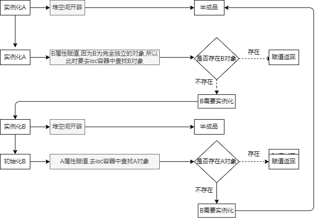
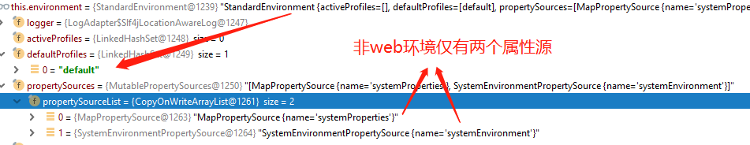
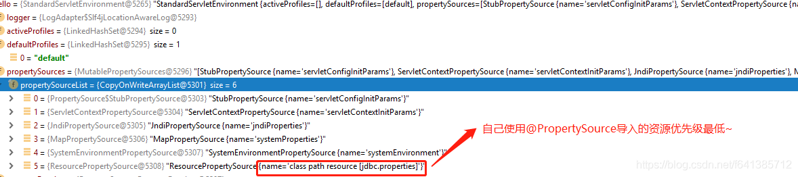
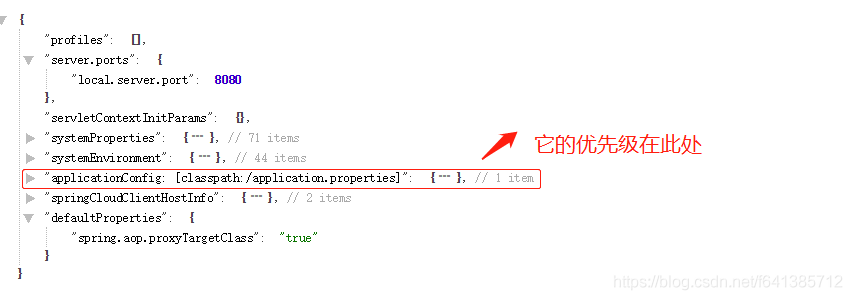

# 设计模式

**工厂设计模式** : Spring 使用工厂模式通过 `BeanFactory`、`ApplicationContext` 创建 bean 对象。

两者对比：

- `BeanFactory` ：延迟注入(使用到某个 bean 的时候才会注入),相比于`ApplicationContext` 来说会占用更少的内存，程序启动速度更快。
- `ApplicationContext` ：容器启动的时候，不管你用没用到，一次性创建所有 bean 。`BeanFactory` 仅提供了最基本的依赖注入支持，`ApplicationContext` 扩展了 `BeanFactory` ,除了有`BeanFactory`的功能还有额外更多功能，所以一般开发人员使用`ApplicationContext`会更多。


**代理设计模式** : Spring AOP 功能的实现。如果要代理的对象，实现了某个接口，那么Spring AOP会使用**JDK Proxy**，去创建代理对象，而对于没有实现接口的对象，就无法使用 JDK Proxy 去进行代理了，这时候Spring AOP会使用**Cglib** ，这时候Spring AOP会使用 **Cglib** 生成一个被代理对象的子类来作为代理.


**单例设计模式** : Spring 中的 Bean 默认都是单例的。Spring 通过 `ConcurrentHashMap` 实现单例注册表的特殊方式实现单例模式。

```
// 通过 ConcurrentHashMap（线程安全） 实现单例注册表
private final Map<String, Object> singletonObjects = new ConcurrentHashMap<String, Object>(64);

public Object getSingleton(String beanName, ObjectFactory<?> singletonFactory) {
        Assert.notNull(beanName, "'beanName' must not be null");
        synchronized (this.singletonObjects) {
            // 检查缓存中是否存在实例  
            Object singletonObject = this.singletonObjects.get(beanName);
            if (singletonObject == null) {
                //...省略了很多代码
                try {
                    singletonObject = singletonFactory.getObject();
                }
                //...省略了很多代码
                // 如果实例对象在不存在，我们注册到单例注册表中。
                addSingleton(beanName, singletonObject);
            }
            return (singletonObject != NULL_OBJECT ? singletonObject : null);
        }
    }
    //将对象添加到单例注册表
    protected void addSingleton(String beanName, Object singletonObject) {
            synchronized (this.singletonObjects) {
                this.singletonObjects.put(beanName, (singletonObject != null ? singletonObject : NULL_OBJECT));

            }
        }
}
```

**模板方法模式** : Spring 中 `jdbcTemplate`、`hibernateTemplate` 等以 Template 结尾的对数据库操作的类，它们就使用到了模板模式。一个抽象类公开定义了执行它的方法的方式/模板。它的子类可以按需要重写方法实现，但调用将以抽象类中定义的方式进行。这种类型的设计模式属于行为型模式。

```
public abstract class Game {
   abstract void initialize();
   abstract void startPlay();
   abstract void endPlay();
   //模板
   public final void play(){
      //初始化游戏
      initialize();
      //开始游戏
      startPlay();
      //结束游戏
      endPlay();
   }
}
```

**装饰者模式** : 允许向一个现有的对象添加新的功能，同时又不改变其结构。比如 `InputStream`家族.

Spring 中用到的包装器模式在类名上含有 `Wrapper`或者 `Decorator`。这些类基本上都是动态地给一个对象添加一些额外的职责

**观察者模式:** Spring 事件驱动模型就是观察者模式很经典的一个应用。

Spring事件模型中三个角色:

事件ApplicationEvent,它继承了`java.util.EventObject`并实现了 `java.io.Serializable`接口

监听者ApplicationListener,里面只定义了一个 `onApplicationEvent（）`方法来处理`ApplicationEvent`

发布者ApplicationEventPublisher,接口的`publishEvent（）`这个方法在`AbstractApplicationContext`类中被实现,通过`ApplicationEventMulticaster`来广播出去

**适配器模式** : Spring AOP 的增强或通知(Advice)使用到了适配器模式、spring MVC 中也是用到了适配器模式适配`Controller`。

在AOP中:

与'Advice'之相关的接口是`AdvisorAdapter` 。Advice 常用的类型有：`BeforeAdvice`（目标方法调用前,前置通知）、`AfterAdvice`（目标方法调用后,后置通知）、`AfterReturningAdvice`(目标方法执行结束后，return之前)等等。每个类型Advice（通知）都有对应的拦截器:`MethodBeforeAdviceInterceptor`、`AfterReturningAdviceAdapter`、`AfterReturningAdviceInterceptor`。Spring预定义的通知要通过对应的适配器，适配成 `MethodInterceptor`接口(方法拦截器)类型的对象（如：`MethodBeforeAdviceInterceptor` 负责适配 `MethodBeforeAdvice`）。

在MVC中:

`DispatcherServlet` 根据请求信息调用 `HandlerMapping`，解析请求对应的 `Handler`。解析到对应的 `Handler`（也就是我们平常说的 `Controller` 控制器）后，开始由`HandlerAdapter` 适配器处理。`HandlerAdapter` 作为期望接口，具体的适配器实现类用于对目标类进行适配，`Controller` 作为需要适配的类。


# IOC

[源码深入](https://javadoop.com/post/spring-ioc)

## Bean

声明周期

bean定义信息   -->

xml  &  注解 ... (如可以自设计json)  -->

抽象定义规范接口  BeanDefinition

Reader  -->

BeanDefinition  bean定义信息   -->  ioc容器

多个BeanFactoryPostProcessor  后置处理器

```
<bean id="xxx" class="xxx">
	<property name="xxx" value=${xxx.xxx}></property>  在后置处理器中进行替换(PlaceholderConfigurerSupport实现类)
</bean>

又比如springboot componentScan注解扫描的实现类 ConfigurationClassProcessor (多层调用后在ConfigurationClssParser中解析带有注解@Component , @PropertySource , @ComponentScan , @Import , @ImpoertSource的类 ,  @Bean的方法 ...)

可以通过实现该接口 获取beanDefinition 来设置属性值达到扩展效果
```

  -- >BeanFactory  反射生成对象 该接口的类上注释了  所有aware和声明周期接口执行顺序

```
1.实例化 : 开辟堆空间
2.初始化 : 给属性赋值   (类似python#__init__) 
 1)填充属性    populateBean方法 通过setter
 2)执行aware接口需要实现的方法 :通过spring中的bean对象来获取相应容器中的相关属性
比如bean要支持通过bean获取beanName , 可以实现BeanNameAware接口,实现方法setBeanName(String name)
 3)BeanPostProcessor#postProcessBeforeInitialization
 4)init-method
 5)BeanPostProcessor#postProcesspostProcessAfterInitialization
比如 aop代理就是在实现类AbstractAutoProxyCreator的接口方法postProcessAfterInitialization中完成代理对象并返回
```

-->  完整对象


> 在容器运行前置时 Environment -> StandardEnvironment  调用System#getenv$getProperty将属性存入Environment,方便后续调用
>
> 如mvc init-param属性

### refresh

ClassPathXmlApplicationContext.refresh

1.prepareRefresh()

前戏,做容器刷新前的准备工作

①设置容器的启动时间;

②设置活跃状态为true;

③设置关闭状态为false;

④获取Environment对象并加载当前系统的属性值到Environment对象中;

⑤准备监听器和事件的集合对象,默认为空的集合.

2.obtainFreshBeanFactory()

创建容器对象**DefaultListableBeanFactory**  完成配置文件加载和解析工作 ,转换为beanDefine,比如xml配置的bean

3.prepareBeanFactory(beanFactory)

beanFactory的准备工作, 对其各种属性进行填充.

4.**post**ProcesssBeanFactoryPostProcessors(beanFactory)

子类覆盖方法做额外的处理

5.invokeBeanFactoryPostProcessors(beanFactory)

调用各种beanFactory处理器 如beanFactoryPostProcessor

6.registerBeanPostProcessors(beanFactory)

注册bean处理器,这里仅注册,真正执行是在getBean方法

7.initMessageSource()

初始化上下文message源 , 即不同语言的消息体,国际化处理

比如mvc i18n

8.initApplicaitonEventMulticaster()

初始化事件监听多路广播器

9.onRefresh

子类实现 , 初始化其他bean

10.RegisterListeners

在所有注册的bean中查找listener bean ,注册到消息广播器中

-------------------- 目前为止所有准备工作已做完--------

11.finishBeanFactoryInitialization(beanFactory)

初始化剩下的非懒加载的单实例

```
beanFactory.preInstantiateSingletons() --> beanFactory.getBean(name)
--> doGetBean(...)  -->createBean(...)  -->createBeanInstance(...) --> instantiateBean(...) -->instantiate(...) 获取构造器  							   ->BeanUtils.instantiateClass(ctor,args) ctor.newInstance() 实例化
```

```
populateBean(..)  bean属性填充,如果依赖于其他bean的属性,则会递归初始化依赖的bean
```

```
initializeBean(...)  --> invokeAwareMethods(beanName,bean) 对特殊的bean处理Aware接口 (BeanNameAware . BeanClssLoaderAware , BeanFactoryAware) ,注意 其他bean的Aware接口方法并没有执行  如EnvironmentAware
```

```
applyBeanPostProcessorsBeforeInitialization(existingBean ,beanName)   -->
processor.postProcessBeforeInitialization(xx) 中执行其他Aware接口方法
```

```
invokeInitMethods(xxx) 调用用户自定义init方法
```

```
applyBeanPostProcessorsBeforeInitialization(existingBean ,beanName)  -->
```


### 循环依赖

ioc中

构造方法无法解决循环依赖问题,而通过settor方法可以解决循环依赖问题.

即**将实例化和初始化分开处理,提前暴露对象** ,在中间过程给其他对象赋值的时候,并不是一个完整对象

假如有A依赖B B依赖A的场景:

```
<bean id="a" class="org.example.A">
	<property name="b" ref="b">
</bean>
<bean id="b" class="org.example.B">
	<property name="a" ref="a">
</bean>
```



```
一级缓存 存放成品bean
private final Map<String, Object> singletonObjects = new ConcurrentHashMap<>(256);
三级缓存
private final Map<String, ObjectFactory<?>> singletonFactories = new HashMap<>(16);
二级缓存 存放半成品bean
private final Map<String, Object> earlySingletonObjects = new ConcurrentHashMap<>(16);
```

其中,泛型`ObjectFactory`为函数式接口,只提供了getObject方法

因为循环依赖问题存在于实例化初始化阶段,所以该问题需要在refresh方法的finishBeanFactoryInitialization(beanFactory)方法中的beanFactory.preInstantiateSingletons方法中解决


而使用第三级缓存原因在于使用aop代理问题


## Enviroment

为用户提供方便的服务接口，用于配置属性源并从中解析属性。

### PropertySource

用于存放key-value对象的抽象，子类需要实现getProperty(String name)返回对应的Value方法，其中value可以是任何类型不局限在字符串.

StandardEnvironment配置了两个PropertySource对象 - 一个表示JVM系统属性集`System.getProperties（）`，另一个表示系统环境变量集`System.getenv（）`。


如果想要集成到此搜索中的自定义属性源。为此，请实现并实例化你自己的 PropertySource，并将其添加到当前环境的 PropertySource 集合中:

```java
ConfigurableApplicationContext ctx = new GenericApplicationContext();
MutablePropertySources sources = ctx.getEnvironment().getPropertySources();
sources.addFirst(new MyPropertySource());
```

通过@PropertySource添加配置源

```
@PropertySource("classpath:/com/${my.placeholder:default/path}/app.properties")
```

并且, @PropertySource资源位置中存在的任何 ${...} 占位符都将根据已针对环境注册的属性源集进行解析. 如果my.placeholder 存在于已注册的某个属性源（例如，系统属性或环境变量）中，则该占位符将解析为相应的值。如果不是，则默认/路径用作默认值。如果未指定默认值，并且无法解析属性，则会引发非法参数异常。

## PropertyResolver

以`StringValueResolver`为引子，去剖析它的底层依赖逻辑：`PropertyResolver`和`Environment`

`org.springframework.core.env.PropertyResolver`此接口用于在**底层源**之上解析**一系列**的属性值：例如properties文件,yaml文件,甚至是一些nosql（因为nosql也是k-v形式）

接口中定义了一系列读取，解析，判断是否包含指定属性的方法。

```
// @since 3.1  出现得还是相对较晚的  毕竟SpEL也3.0之后才出来嘛~~~
public interface PropertyResolver {
	// 查看规定指定的key是否有对应的value   注意：若对应值是null的话 也是返回false
	boolean containsProperty(String key);
	// 如果没有则返回null
	@Nullable
	String getProperty(String key);
	// 如果没有则返回defaultValue
	String getProperty(String key, String defaultValue);
	// 返回指定key对应的value，会解析成指定类型。如果没有对应值则返回null（而不是抛错~）
	@Nullable
	<T> T getProperty(String key, Class<T> targetType);
	<T> T getProperty(String key, Class<T> targetType, T defaultValue);

	// 若不存在就不是返回null了  而是抛出异常~  所以不用担心返回值是null
	String getRequiredProperty(String key) throws IllegalStateException;
	<T> T getRequiredProperty(String key, Class<T> targetType) throws IllegalStateException;

	// 解析${...}这种类型的占位符，把他们替换为使用getProperty方法返回的结果，解析不了并且没有默认值的占位符会被忽略（原样输出）
	String resolvePlaceholders(String text);
	// 解析不了就抛出异常~
	String resolveRequiredPlaceholders(String text) throws IllegalArgumentException;
}
```

它的继承链可以描述如下：`PropertyResolver -> ConfigurablePropertyResolver -> AbstractPropertyResolver -> PropertySourcesPropertyResolver`

**ConfigurablePropertyResolver**

顾名思义，它是一个可配置的处理器。这个方法不仅有父接口所有功能，还扩展定义类型转换、属性校验、前缀、后缀、`分隔符`等一些列的功能，这个在具体实现类里有所体现~

```
public interface ConfigurablePropertyResolver extends PropertyResolver {
	// 返回在解析属性时使用的ConfigurableConversionService。此方法的返回值可被用户定制化set
	// 例如可以移除或者添加Converter  cs.addConverter(new FooConverter());等等
	ConfigurableConversionService getConversionService();
	// 全部替换ConfigurableConversionService的操作(不常用)  一般还是get出来操作它内部的东东
	void setConversionService(ConfigurableConversionService conversionService);
	// 设置占位符的前缀  后缀    默认是${}
	void setPlaceholderPrefix(String placeholderPrefix);
	void setPlaceholderSuffix(String placeholderSuffix);
	// 默认值的分隔符   默认为冒号:
	void setValueSeparator(@Nullable String valueSeparator);
	// 是否忽略解析不了的占位符，默认是false  表示不忽略~~~（解析不了就抛出异常）
	void setIgnoreUnresolvableNestedPlaceholders(boolean ignoreUnresolvableNestedPlaceholders);
	/**
	 * Specify which properties must be present, to be verified by
	 * {@link #validateRequiredProperties()}.
	 */
	void setRequiredProperties(String... requiredProperties);
	void validateRequiredProperties() throws MissingRequiredPropertiesException;
}
```

`ConfigurableXXX`成了Spring的一种命名规范，或者说是一种设计模式。它表示可配置的，所以都会提供大量的set方法

> Spring很多接口都是读写分离的，最顶层接口一般都只会提供只读方法，这是Spring框架设计的一般规律之一

**AbstractPropertyResolver**

它是对`ConfigurablePropertyResolver`的一个抽象实现，实现了了所有的接口方法，并且只提供一个抽象方法给子类去实现~~~

```
// @since 3.1
public abstract class AbstractPropertyResolver implements ConfigurablePropertyResolver {
	@Nullable
	private volatile ConfigurableConversionService conversionService;

	// PropertyPlaceholderHelper是一个极其独立的类，专门用来解析占位符  我们自己项目中可议拿来使用  因为它不依赖于任何其他类
	@Nullable
	private PropertyPlaceholderHelper nonStrictHelper;
	@Nullable
	private PropertyPlaceholderHelper strictHelper;
	
	private boolean ignoreUnresolvableNestedPlaceholders = false;
	private String placeholderPrefix = SystemPropertyUtils.PLACEHOLDER_PREFIX;
	private String placeholderSuffix = SystemPropertyUtils.PLACEHOLDER_SUFFIX;
	@Nullable
	private String valueSeparator = SystemPropertyUtils.VALUE_SEPARATOR;
	private final Set<String> requiredProperties = new LinkedHashSet<>();

	// 默认值使用的DefaultConversionService
	@Override
	public ConfigurableConversionService getConversionService() {
		// Need to provide an independent DefaultConversionService, not the
		// shared DefaultConversionService used by PropertySourcesPropertyResolver.
		ConfigurableConversionService cs = this.conversionService;
		if (cs == null) {
			synchronized (this) {
				cs = this.conversionService;
				if (cs == null) {
					cs = new DefaultConversionService();
					this.conversionService = cs;
				}
			}
		}
		return cs;
	}
	... // 省略get/set
	@Override
	public void setRequiredProperties(String... requiredProperties) {
		for (String key : requiredProperties) {
			this.requiredProperties.add(key);
		}
	}
	// 校验这些key~
	@Override
	public void validateRequiredProperties() {
		MissingRequiredPropertiesException ex = new MissingRequiredPropertiesException();
		for (String key : this.requiredProperties) {
			if (this.getProperty(key) == null) {
				ex.addMissingRequiredProperty(key);
			}
		}
		if (!ex.getMissingRequiredProperties().isEmpty()) {
			throw ex;
		}
	}
	... //get/set property等方法省略  直接看处理占位符的方法即可
	@Override
	public String resolvePlaceholders(String text) {
		if (this.nonStrictHelper == null) {
			this.nonStrictHelper = createPlaceholderHelper(true);
		}
		return doResolvePlaceholders(text, this.nonStrictHelper);
	}
	private PropertyPlaceholderHelper createPlaceholderHelper(boolean ignoreUnresolvablePlaceholders) {
		return new PropertyPlaceholderHelper(this.placeholderPrefix, this.placeholderSuffix, this.valueSeparator, ignoreUnresolvablePlaceholders);
	}
	// 此处：最终都是委托给PropertyPlaceholderHelper去做  而getPropertyAsRawString是抽象方法  根据key返回一个字符串即可~
	private String doResolvePlaceholders(String text, PropertyPlaceholderHelper helper) {
		return helper.replacePlaceholders(text, this::getPropertyAsRawString);
	}
}
```

最终，处理占位的核心逻辑在`PropertyPlaceholderHelper`身上，这个类不可小觑，是一个与业务无关非常强大的工具类，我们可以直接拿来主义~

**PropertyPlaceholderHelper**

将字符串里的占位符内容，用我们配置的properties里的替换。这个是一个单纯的类，没有继承没有实现，而且简单无依赖，没有依赖Spring框架其他的任何类。

```
// @since 3.0  Utility class for working with Strings that have placeholder values in them
public class PropertyPlaceholderHelper {

	// 这里保存着  通用的熟悉的 开闭的符号们~~~
	private static final Map<String, String> wellKnownSimplePrefixes = new HashMap<>(4);
	static {
		wellKnownSimplePrefixes.put("}", "{");
		wellKnownSimplePrefixes.put("]", "[");
		wellKnownSimplePrefixes.put(")", "(");
	}

	private final String placeholderPrefix;
	private final String placeholderSuffix;
	private final String simplePrefix;
	@Nullable
	private final String valueSeparator;
	private final boolean ignoreUnresolvablePlaceholders; // 是否采用严格模式~~

	// 从properties里取值  若你有就直接从Properties里取值了~~~
	public String replacePlaceholders(String value, final Properties properties)  {
		Assert.notNull(properties, "'properties' must not be null");
		return replacePlaceholders(value, properties::getProperty);
	}

	// @since 4.3.5   抽象类提供这个类型转换的方法~ 需要类型转换的会调用它
	// 显然它是委托给了ConversionService，而这个类在前面文章已经都重点分析过了~
	@Nullable
	protected <T> T convertValueIfNecessary(Object value, @Nullable Class<T> targetType) {
		if (targetType == null) {
			return (T) value;
		}
		ConversionService conversionServiceToUse = this.conversionService;
		if (conversionServiceToUse == null) {
			// Avoid initialization of shared DefaultConversionService if
			// no standard type conversion is needed in the first place...
			if (ClassUtils.isAssignableValue(targetType, value)) {
				return (T) value;
			}
			conversionServiceToUse = DefaultConversionService.getSharedInstance();
		}
		return conversionServiceToUse.convert(value, targetType);
	}

	// 这里会使用递归，根据传入的符号，默认值等来处理~~~~
	protected String parseStringValue(String value, PlaceholderResolver placeholderResolver, Set<String> visitedPlaceholders) { ... }
}
```

这个工具类不仅仅用在此处，在`ServletContextPropertyUtils`、`SystemPropertyUtils`、`PropertyPlaceholderConfigurer`里都是有使用到它的

**PropertySourcesPropertyResolver**

从上面知道`AbstractPropertyResolver`封装了解析占位符的具体实现。`PropertySourcesPropertyResolver`作为它的子类它只需要提供数据源，**所以它主要是负责提供数据源。**

```
// @since 3.1    PropertySource：就是我们所说的数据源，它是Spring一个非常重要的概念，比如可以来自Map，来自命令行、来自自定义等等~~~
public class PropertySourcesPropertyResolver extends AbstractPropertyResolver {

	// 数据源们~
	@Nullable
	private final PropertySources propertySources;

	// 唯一构造函数：必须制定数据源~
	public PropertySourcesPropertyResolver(@Nullable PropertySources propertySources) {
		this.propertySources = propertySources;
	}

	@Override
	public boolean containsProperty(String key) {
		if (this.propertySources != null) {
			for (PropertySource<?> propertySource : this.propertySources) {
				if (propertySource.containsProperty(key)) {
					return true;
				}
			}
		}
		return false;
	}
	...
	//最终依赖的都是propertySource.getProperty(key);方法拿到如果是字符串的话
	//就继续交给 value = resolveNestedPlaceholders((String) value);处理
	@Nullable
	protected <T> T getProperty(String key, Class<T> targetValueType, boolean resolveNestedPlaceholders) {
		if (this.propertySources != null) {
			for (PropertySource<?> propertySource : this.propertySources) {
				Object value = propertySource.getProperty(key);
				if (value != null) {
					// 若值是字符串，那就处理一下占位符~~~~~~  所以我们看到所有的PropertySource都是支持占位符的
					if (resolveNestedPlaceholders && value instanceof String) {
						value = resolveNestedPlaceholders((String) value);
					}
					logKeyFound(key, propertySource, value);
					return convertValueIfNecessary(value, targetValueType);
				}
			}
		}
		return null;
	}
	...
}
```

`PropertySources`和`PropertySource`属性源是Spring里一个非常重要的概念设计，涉及到Spring属性配置的非常重要的优先级关系、以及它支持的配置类型

### Environment

这个接口代表了当前应用正在运行的环境，为应用的两个重要方面建立抽象模型 【profiles】和【properties】。关于属性访问的方法通过父接口PropertyResolver暴露给客户端使用，本接口主要是扩展出访问【profiles】相关的接口。

对于他俩，我愿意这么来翻译：

profiles：配置。它代表应用在一启动时注册到context中bean definitions的命名的逻辑分组。
properties：属性。几乎在所有应用中都扮演着重要角色，他可能源自多种源头。例如属性文件，JVM系统属性，系统环境变量，JNDI，servlet上下文参数，Map等等，Environment对象和其相关的对象一起提供给用户一个方便用来配置和解析属性的服务。

```
// @since 3.1   可见Spring3.x版本是Spirng一次极其重要的跨越、升级
// 它继承自PropertyResolver，所以是对属性的一个扩展~
public interface Environment extends PropertyResolver {
	// 就算被激活  也是支持同时激活多个profiles的~
	// 设置的key是：spring.profiles.active
	String[] getActiveProfiles();
	// 默认的也可以有多个  key为：spring.profiles.default
	String[] getDefaultProfiles();

	// 看看传入的profiles是否是激活的~~~~  支持!表示不激活
	@Deprecated
	boolean acceptsProfiles(String... profiles);
	// Spring5.1后提供的  用于替代上面方法   Profiles是Spring5.1才有的一个函数式接口~
	boolean acceptsProfiles(Profiles profiles);
}
```

我们可以通过实现接口`EnvironmentAware`或者直接`@Autowired`可以很方便的得到当前应用的环境：`Environment`。

**ConfigurableEnvironment**

扩展出了`修改`和配置profiles的一系列方法，包括用户自定义的和系统相关的属性。**所有的**环境实现类也都是它的实现~

```
// @since 3.1
public interface ConfigurableEnvironment extends Environment, ConfigurablePropertyResolver {
	void setActiveProfiles(String... profiles);
	void addActiveProfile(String profile);
	void setDefaultProfiles(String... profiles);

	// 获取到所有的属性源~  	MutablePropertySources表示可变的属性源们~~~ 它是一个聚合的  持有List<PropertySource<?>>
	// 这样获取出来后，我们可以add或者remove我们自己自定义的属性源了~
	MutablePropertySources getPropertySources();

	// 这里两个哥们应该非常熟悉了吧~~~
	Map<String, Object> getSystemProperties();
	Map<String, Object> getSystemEnvironment();

	// 合并两个环境配置信息~  此方法唯一实现在AbstractEnvironment上
	void merge(ConfigurableEnvironment parent);
}
```

查看其实现会发现它有两个分支：

ConfigurableWebEnvironment：显然它和web环境有关，提供方法void initPropertySources(@Nullable ServletContext servletContext, @Nullable ServletConfig servletConfig)让web自己做资源初始化.
AbstractEnvironment：这个是重点:

**AbstractEnvironment**

它是对环境的一个抽象实现，很重要。

```
public abstract class AbstractEnvironment implements ConfigurableEnvironment {

	public static final String IGNORE_GETENV_PROPERTY_NAME = "spring.getenv.ignore";
	public static final String ACTIVE_PROFILES_PROPERTY_NAME = "spring.profiles.active";
	public static final String DEFAULT_PROFILES_PROPERTY_NAME = "spring.profiles.default";

	// 保留的默认的profile值   protected final属性，证明子类可以访问
	protected static final String RESERVED_DEFAULT_PROFILE_NAME = "default";


	private final Set<String> activeProfiles = new LinkedHashSet<>();
	// 显然这个里面的值 就是default这个profile了~~~~
	private final Set<String> defaultProfiles = new LinkedHashSet<>(getReservedDefaultProfiles());

	// 这个很关键，直接new了一个 MutablePropertySources来管理属性源们
	// 并且是用的PropertySourcesPropertyResolver来处理里面可能的占位符~~~~~
	private final MutablePropertySources propertySources = new MutablePropertySources();
	private final ConfigurablePropertyResolver propertyResolver = new PropertySourcesPropertyResolver(this.propertySources);

	// 唯一构造方法  customizePropertySources是空方法，交由子类去实现，对属性源进行定制~ 
	// Spring对属性配置分出这么多曾经，在SpringBoot中有着极其重要的意义~~~~
	public AbstractEnvironment() {
		customizePropertySources(this.propertySources);
	}
	// 该方法，StandardEnvironment实现类是有复写的~
	protected void customizePropertySources(MutablePropertySources propertySources) {
	}

	// 若你想改变默认default这个值，可以复写此方法~~~~
	protected Set<String> getReservedDefaultProfiles() {
		return Collections.singleton(RESERVED_DEFAULT_PROFILE_NAME);
	}
	
	//  下面开始实现接口的方法们~~~~~~~
	@Override
	public String[] getActiveProfiles() {
		return StringUtils.toStringArray(doGetActiveProfiles());
	}
	protected Set<String> doGetActiveProfiles() {
		synchronized (this.activeProfiles) {
			if (this.activeProfiles.isEmpty()) { 
		
				// 若目前是empty的，那就去获取：spring.profiles.active
				String profiles = getProperty(ACTIVE_PROFILES_PROPERTY_NAME);
				if (StringUtils.hasText(profiles)) {
					//支持,分隔表示多个~~~且空格啥的都无所谓
					setActiveProfiles(StringUtils.commaDelimitedListToStringArray(
							StringUtils.trimAllWhitespace(profiles)));
				}
			}
			return this.activeProfiles;
		}
	}


	@Override
	public void setActiveProfiles(String... profiles) {
		synchronized (this.activeProfiles) {
			this.activeProfiles.clear(); // 因为是set方法  所以情况已存在的吧
			for (String profile : profiles) {
				 // 简单的valid，不为空且不以!打头~~~~~~~~
				validateProfile(profile);
				this.activeProfiles.add(profile);
			}
		}
	}

	// default profiles逻辑类似，也是不能以!打头~
	@Override
	@Deprecated
	public boolean acceptsProfiles(String... profiles) {
		for (String profile : profiles) {

			// 此处：如果该profile以!开头，那就截断出来  把后半段拿出来看看   它是否在active行列里~~~ 
			// 此处稍微注意：若!表示一个相反的逻辑~~~~~请注意比如!dev表示若dev是active的，我反倒是不生效的
			if (StringUtils.hasLength(profile) && profile.charAt(0) == '!') {
				if (!isProfileActive(profile.substring(1))) {
					return true;
				}
			} else if (isProfileActive(profile)) {
				return true;
			}
		}
		return false;
	}

	// 采用函数式接口处理  就非常的优雅了~
	@Override
	public boolean acceptsProfiles(Profiles profiles) {
		Assert.notNull(profiles, "Profiles must not be null");
		return profiles.matches(this::isProfileActive);
	}

	// 简答的说要么active包含，要门是default  这个profile就被认为是激活的
	protected boolean isProfileActive(String profile) {
		validateProfile(profile);
		Set<String> currentActiveProfiles = doGetActiveProfiles();
		return (currentActiveProfiles.contains(profile) ||
				(currentActiveProfiles.isEmpty() && doGetDefaultProfiles().contains(profile)));
	}

	@Override
	public MutablePropertySources getPropertySources() {
		return this.propertySources;
	}

	public Map<String, Object> getSystemProperties() {
		return (Map) System.getProperties();
	}
	public Map<String, Object> getSystemEnvironment() {
		// 这个判断为：return SpringProperties.getFlag(IGNORE_GETENV_PROPERTY_NAME);
		// 所以我们是可以通过在`spring.properties`这个配置文件里spring.getenv.ignore=false关掉不暴露环境变量的~~~
		if (suppressGetenvAccess()) {
			return Collections.emptyMap();
		}
		return (Map) System.getenv();
	}

	// Append the given parent environment's active profiles, default profiles and property sources to this (child) environment's respective collections of each.
	// 把父环境的属性合并进来~~~~  
	// 在调用ApplicationContext.setParent方法时，会把父容器的环境合并进来  以保证父容器的属性对子容器都是可见的
	@Override
	public void merge(ConfigurableEnvironment parent) {
		for (PropertySource<?> ps : parent.getPropertySources()) {
			if (!this.propertySources.contains(ps.getName())) {
				this.propertySources.addLast(ps); // 父容器的属性都放在最末尾~~~~
			}
		}
		// 合并active
		String[] parentActiveProfiles = parent.getActiveProfiles();
		if (!ObjectUtils.isEmpty(parentActiveProfiles)) {
			synchronized (this.activeProfiles) {
				for (String profile : parentActiveProfiles) {
					this.activeProfiles.add(profile);
				}
			}
		}
		// 合并default
		String[] parentDefaultProfiles = parent.getDefaultProfiles();
		if (!ObjectUtils.isEmpty(parentDefaultProfiles)) {
			synchronized (this.defaultProfiles) {
				this.defaultProfiles.remove(RESERVED_DEFAULT_PROFILE_NAME);
				for (String profile : parentDefaultProfiles) {
					this.defaultProfiles.add(profile);
				}
			}
		}
	}

	// 其余方法全部委托给内置的propertyResolver属性，因为它就是个`PropertyResolver`
	...
}
```

该抽象类完成了对active、default等相关方法的复写处理。它内部持有一个`MutablePropertySources`引用来管理属性源。
**So，留给子类的活就不多了：只需要把你的属性源注册给我就OK了**

**StandardEnvironment**

这个是Spring应用在非web容器运行的环境。从名称上解释为：标准实现

```
public class StandardEnvironment extends AbstractEnvironment {
	// 这两个值定义着  就是在@Value注解要使用它们时的key~~~~~
	/** System environment property source name: {@value}. */
	public static final String SYSTEM_ENVIRONMENT_PROPERTY_SOURCE_NAME = "systemEnvironment";
	/** JVM system properties property source name: {@value}. */
	public static final String SYSTEM_PROPERTIES_PROPERTY_SOURCE_NAME = "systemProperties";


	// 注册MapPropertySource和SystemEnvironmentPropertySource
	// SystemEnvironmentPropertySource是MapPropertySource的子类~~~~
	@Override
	protected void customizePropertySources(MutablePropertySources propertySources) {
		propertySources.addLast(new MapPropertySource(SYSTEM_PROPERTIES_PROPERTY_SOURCE_NAME, getSystemProperties()));
		propertySources.addLast(new SystemEnvironmentPropertySource(SYSTEM_ENVIRONMENT_PROPERTY_SOURCE_NAME, getSystemEnvironment()));
	}
}
```

**StandardServletEnvironment**

这是在web容器（servlet容器）时候的应用的标准环境。

```
public class StandardServletEnvironment extends StandardEnvironment implements ConfigurableWebEnvironment {
	public static final String SERVLET_CONTEXT_PROPERTY_SOURCE_NAME = "servletContextInitParams";
	public static final String SERVLET_CONFIG_PROPERTY_SOURCE_NAME = "servletConfigInitParams";
	public static final String JNDI_PROPERTY_SOURCE_NAME = "jndiProperties";

	// 放置三个web相关的配置源~  StubPropertySource是PropertySource的一个public静态内部类~~~
	@Override
	protected void customizePropertySources(MutablePropertySources propertySources) {
		propertySources.addLast(new StubPropertySource(SERVLET_CONFIG_PROPERTY_SOURCE_NAME));
		propertySources.addLast(new StubPropertySource(SERVLET_CONTEXT_PROPERTY_SOURCE_NAME));
		
		// 可以通过spring.properties配置文件里面的spring.jndi.ignore=true关闭对jndi的暴露   默认是开启的
		if (JndiLocatorDelegate.isDefaultJndiEnvironmentAvailable()) {
			propertySources.addLast(new JndiPropertySource(JNDI_PROPERTY_SOURCE_NAME));
		}
		super.customizePropertySources(propertySources);
	}

	// 注册servletContextInitParams和servletConfigInitParams到属性配置源头里
	@Override
	public void initPropertySources(@Nullable ServletContext servletContext, @Nullable ServletConfig servletConfig) {
		WebApplicationContextUtils.initServletPropertySources(getPropertySources(), servletContext, servletConfig);
	}
}
```

注意：`这里addFirst和addLast等关系这顺序，进而都关乎着配置最终的生效的。`

对比非web环境和web环境下属性源的配置:





**可见web相关配置的属性源的优先级是高于system相关的。**

> 需要注意的是：若使用`@PropertySource`导入自定义配置，它会位于最底端（**优先级最低**）

附上SpringBoot的属性源们：
访问：`http://localhost:8080/env`得到如下



**EnvironmentCapable**、**EnvironmentAware**
实现了此接口的类都应该有一个Environment类型的环境，并且可以通过getEnvironment方法取得。
我们熟知的所有的Spring应用上下文都实现了这个接口，因为ApplictionContext就实现了这个接口，表示每个应用上下文都是有自己的运行时环境的

还有HttpServletBean、GenericFilterBean它们既实现了EnvironmentCapable也实现了EnvironmentAware用于获取到这个环境对象。

ClassPathScanningCandidateComponentProvider也实现了它如下代码：

```
public class ClassPathScanningCandidateComponentProvider implements EnvironmentCapable, ResourceLoaderAware {
	...
	@Override
	public final Environment getEnvironment() {
		if (this.environment == null) {
			this.environment = new StandardEnvironment();
		}
		return this.environment;
	}
	...
}
```

### StringValueResolver

Spring对它的定义为：一个处理字符串的简单策略接口。

```
// @since 2.5  该接口非常简单，就是个函数式接口~
@FunctionalInterface
public interface StringValueResolver {
	@Nullable
	String resolveStringValue(String strVal);
}
```

唯一`public`实现类为：`EmbeddedValueResolver`

**EmbeddedValueResolver**

帮助`ConfigurableBeanFactory`处理placeholders占位符的。`ConfigurableBeanFactory#resolveEmbeddedValue`处理占位符真正干活的间接的就是它~~

```
// @since 4.3  这个类出现得还是蛮晚的   因为之前都是用内部类的方式实现的~~~~这个实现类是最为强大的  只是SpEL
public class EmbeddedValueResolver implements StringValueResolver {

	// BeanExpressionResolver之前有非常详细的讲解，简直不要太熟悉~  它支持的是SpEL  可以说非常的强大
	// 并且它有BeanExpressionContext就能拿到BeanFactory工厂，就能使用它的`resolveEmbeddedValue`来处理占位符~~~~
	// 双重功能都有了~~~拥有了和@Value一样的能力，非常强大~~~
	private final BeanExpressionContext exprContext;
	@Nullable
	private final BeanExpressionResolver exprResolver;

	public EmbeddedValueResolver(ConfigurableBeanFactory beanFactory) {
		this.exprContext = new BeanExpressionContext(beanFactory, null);
		this.exprResolver = beanFactory.getBeanExpressionResolver();
	}
	@Override
	@Nullable
	public String resolveStringValue(String strVal) {
		
		// 先使用Bean工厂处理占位符resolveEmbeddedValue
		String value = this.exprContext.getBeanFactory().resolveEmbeddedValue(strVal);
		// 再使用el表达式参与计算~~~~
		if (this.exprResolver != null && value != null) {
			Object evaluated = this.exprResolver.evaluate(value, this.exprContext);
			value = (evaluated != null ? evaluated.toString() : null);
		}
		return value;
	}
}
```

关于Bean工厂`resolveEmbeddedValue方法`的实现，我们这里也顺带看看：

```
public abstract class AbstractBeanFactory extends FactoryBeanRegistrySupport implements ConfigurableBeanFactory {
	...
	@Override
	@Nullable
	public String resolveEmbeddedValue(@Nullable String value) {
		if (value == null) {
			return null;
		}
		String result = value;

		// embeddedValueResolvers是个复数：因为我们可以自定义处理器添加到bean工厂来，增强它的能力
		for (StringValueResolver resolver : this.embeddedValueResolvers) {
			result = resolver.resolveStringValue(result);
			// 只要处理结果不为null，所以的处理器都会执行到~~~~
			if (result == null) {
				return null;
			}
		}
		return result;
	}
	...
}
```

给bean工厂添加处理器

```
public abstract class AbstractApplicationContext extends DefaultResourceLoader
		implements ConfigurableApplicationContext {
	protected void finishBeanFactoryInitialization(ConfigurableListableBeanFactory beanFactory) {
		...
		// 如果从来没有注册过，Spring容器默认会给注册一个这样的内部类
		// 可以看到，它最终还是委托给了Environment去干这件事~~~~~~
		// 显然它最终就是调用PropertyResolver#resolvePlaceholders
		if (!beanFactory.hasEmbeddedValueResolver()) {
			beanFactory.addEmbeddedValueResolver(strVal -> getEnvironment().resolvePlaceholders(strVal));
		}
		...
	}				
}
```

由此可见，解析占位符最终都返璞归真，真正最终的处理类，处理方法方法是：AbstractPropertyResolver#resolvePlaceholders，这就是我们非常熟悉了，上面也有详细讲解，最终都是委托给了PropertyPlaceholderHelper去处理的~

由此可见，若我们通过实现感知接口EmbeddedValueResolverAware得到一个StringValueResolver来处理我们的占位符、SpEL计算。根本原因是：

```
class ApplicationContextAwareProcessor implements BeanPostProcessor {
	// 这里new的一个EmbeddedValueResolver，它持有对beanFactory的引用~~~
	// 所以调用者直接使用的是EmbeddedValueResolver：它支持解析占位符（依赖于Enviroment上面有说到）并且支持SpEL的解析  非常强的
	public ApplicationContextAwareProcessor(ConfigurableApplicationContext applicationContext) {
		this.applicationContext = applicationContext;
		this.embeddedValueResolver = new EmbeddedValueResolver(applicationContext.getBeanFactory());
	}
}
```

Spring对这个感知接口的命名也很实在，我们通过实现`EmbeddedValueResolverAware`这个接口得到的实际上是一个`EmbeddedValueResolver`，提供处理占位符和SpEL等高级功能。

另外`StringValueResolver`还有个实现类是`PropertyPlaceholderConfigurer`的private内部类实现`PlaceholderResolvingStringValueResolver`,在当初xml导入配置的时候经常看到如下配置

```
<bean id="propertyConfigurer" class="org.springframework.beans.factory.config.PropertyPlaceholderConfigurer">
   <property name="location">
   		<!-- classpath:conf/jdbc.properties  -->
       <value>conf/jdbc.properties</value>
   </property>
    <property name="fileEncoding">
        <value>UTF-8</value>
    </property>
</bean>
```

而在注解时代，一般建议使用`@PropertySource`代替~

### resolvePlaceholders和getProperty区别

```
public class Main {

    public static void main(String[] args) {
        StandardEnvironment environment = new StandardEnvironment();

        MutablePropertySources mutablePropertySources = environment.getPropertySources();
        MapPropertySource mapPropertySource = new MapPropertySource("diy", new HashMap<String, Object>() {{
            put("app.name", "fsx");
            put("app.key", "${user.home1}"); // 注意这里是user.home1 特意让系统属性里不存在的
            put("app.full", "${app.key} + ${app.name}");
        }});
        mutablePropertySources.addFirst(mapPropertySource);

        // 正常使用 输出${user.home1} + fsx
        String s = environment.resolvePlaceholders("${app.full}");
        System.out.println(s);
		//异常 IllegalArgumentException: Could not resolve placeholder 'user.home1' in value "${user.home1}"
        s = environment.getProperty("app.full");
        System.out.println(s);
    }
}
```

由此可以得出如下几点结论：

注意：他俩最终解析的都是${app.key} + ${app.name}这个字符串，只是两种方法get取值的方式不一样~

1.properties里面可以书写通配符如${app.name}，但需要注意：

properties里的内容都原封不动的被放进了PropertySource里（或者说是环境里），而是只有在需要用的时候才会解析它；

可以引用系统属性、环境变量等，设置引用被的配置文件里都是ok的（只要保证在同一Environment就成）。
2.resolvePlaceholders()它的入参是${}一起也包含进来的。它有如下特点：

若${}里面的key不存在，就原样输出，不报错。若存在就使用值替换；

key必须用${}包着，否则原样输出~~；

若是resolveRequiredPlaceholders()方法，那key不存在就会抛错~;
3，getProperty()指定的是key本身，并不需要包含${}，

若key不存在返回null，但是若key的值里还有占位符，那就就继续解析。若出现占位符里的key不存在时，就抛错；

getRequiredProperty()方法若key不存在就直接报错了~
注意：@Value注解我们一般这么使用@Value("${app.full}")来读取配置文件里的值，所以它即使出现了如上占位符不存在也原样输出不会报错（当然你的key必须存在啊），因为已经对@Value分析过多次：DefaultListableBeanFactory解析它的时候，最终会把表达式先交给StringValueResolver们去处理占位符，调用的就是resolver.resolveStringValue(result)方法。而最终执行它的见：

```
beanFactory.addEmbeddedValueResolver(strVal -> getEnvironment().resolvePlaceholders(strVal));
```

所以最终是委托给`Environment`的`resolvePlaceholders()`方法去处理的。

```
注意：最终解析都是交给了PropertyPlaceholderHelper，它默认支持{}、[]、()等占位符。而我们最为常用的就是${}，注意它的placeholderPrefix=${（而不是单单的{），后缀是}
```

占位符使用小技巧
例如一般我们的web程序的application.properties配置端口如下：

**server.port=8080**
而打包好后我们可以通过启动参数：--server.port=9090来改变此端口。但是若我们配置文件这么写：

**server.port=${port:8080}**
那我们启动参数可以变短了，这样写就成：--port=9090。相信了解了上面原理的小伙伴，理解这个小技巧是非常简单的事咯~~~

**${port:8080}表示没有port这个key，就用8080。 有这个key就用对应的值~*（冒号作分隔）*

## PropertyAccessor

博客https://blog.csdn.net/f641385712/article/details/95481552?utm_medium=distribute.pc_relevant.none-task-blog-2~default~baidujs_title~default-0.no_search_link&spm=1001.2101.3001.4242

属性访问器PropertyAccessor**接口的作用是`存/取`Bean对象的属性。

使用DirectFieldAccessor对属性赋值。

1. 若是级联属性、集合数组等复杂属性，**初始值不能为null**
2. 使用它给属性赋值无序提供get、set方法（**侧面意思是：它不会走你的get/set方法逻辑**）

```
new DirectFieldAccessor(bean).getPropertyValue("prop")
```

BeanWrapper也是继承自该接口

### BeanWrapper

```
BeanWrapper beanWrapper = PropertyAccessorFactory.forBeanPropertyAccess(bean);
for (PropertyDescriptor pd : beanWrapper.getPropertyDescriptors()) {
            //pd.getName()获取字段名
            //beanWrapper.getPropertyValue(pd.getName()) 获取字段属性值
        }
```

```
Map转对象
public static <T> T toBean(Map<String, Object> map, Class<T> beanType) {
        BeanWrapper beanWrapper = new BeanWrapperImpl(beanType);
        map.forEach((key, value) -> {
            if (beanWrapper.isWritableProperty(key)) {
                beanWrapper.setPropertyValue(key, value);
            }
        });
        return (T) beanWrapper.getWrappedInstance();
    }
```


## EnvironmentPostProcessor

EnvironmentPostProcessor为环境后置处理器,可以在**创建应用程序上下文之前**，添加或者修改环境配置。

EnvironmentPostProcessor接口实现代表：ConfigFileApplicationListener

SpringBoot支持动态的读取文件，留下的扩展接口org.springframework.boot.env.EnvironmentPostProcessor。这个接口是spring包下的，使用这个进行配置文件的集中管理，而不需要每个项目都去配置配置文件。这种方法也是springboot框架留下的一个扩展

简单使用:

1.编写自定义配置文件custom.propertis，并放到resource目录下:

```
file.size=1111
```

2.编写自定义的加载类CustomEnvironmentPostProcessor,实现EnvironmentPostProcessor接口,重写postProcessEnvironment方法

```
public class CustomEnvironmentPostProcessor implements EnvironmentPostProcessor {
    private final Properties properties = new Properties();
    /**
     * 用户自定义配置文件列表
     */
    private String[] profiles = {
            "custom.properties",
    };

    @Override
    public void postProcessEnvironment(ConfigurableEnvironment environment, SpringApplication application) {

        for (String profile : profiles) {
            Resource resource = new ClassPathResource(profile);
            //将自定义配置文件属性加入到环境
            environment.getPropertySources().addLast(loadProfiles(resource));
        }
    }
    private PropertySource<?> loadProfiles(Resource resource) {
        if (!resource.exists()) {
            throw new IllegalArgumentException("file" + resource + "not exist");
        }
        try {
            properties.load(resource.getInputStream());
            return new PropertiesPropertySource(resource.getFilename(), properties);
        } catch (IOException ex) {
            throw new IllegalStateException("load resource exception" + resource, ex);
        }
    }
}
```

3.在META-INF下创建spring.factories，并且引入CustomEnvironmentPostProcessor 类

```
org.springframework.boot.env.EnvironmentPostProcessor=\
org.yujuan.springbootlearning.processor.CustomEnvironmentPostProcessor
```

4.验证

通过@value 直接引入或者上下文调用

通常在实际使用时,会根据需求给该自定义类加上@Order或实现Ordered接口(实现getOrder方法)来指定其在所有实现其接口的类中的执行顺序.如需要让应用先加载完一些配置属性后再执行可将顺序延后.

## PropertySourceLocator

springcloud提供了PropertySourceLocator接口支持扩展自定义配置加载到spring Environment中。

即我们可以扩展PropertySourceLocator让spring读取我们自定义的配置文件，然后使用@Value注解即可读取到配置文件中的属性了.

假设需要读取classpath下的my.json文件配置加载到spring环境变量中

```
public class JsonPropertySourceLocator implements PropertySourceLocator {
    private final static String DEFAULT_LOCATION = "classpath:my.json";

    @Override
    public PropertySource<?> locate(Environment environment) {
        // TODO 微服务配置中心实现形式即可在这里远程RPC加载配置到spring环境变量中
        // 读取classpath下的my.json解析
        ResourceLoader resourceLoader = new DefaultResourceLoader(getClass().getClassLoader());
        Resource resource = resourceLoader.getResource(DEFAULT_LOCATION);
        if (resource == null) {
            return null;
        }

        return new MapPropertySource("myJson", mapPropertySource(resource));
    }

	//读取resource转换为map
	private Map<String, Object> mapPropertySource(Resource resource) {

        Map<String, Object> result = new HashMap<>();
        // 获取json格式的Map
        Map<String, Object> fileMap = JSONObject.parseObject(readFile(resource), Map.class);
        // 组装嵌套json
        processorMap("", result, fileMap);
	}
}
```

在classpath下META-INF/spring.factories文件定义 org.springframework.cloud.bootstrap.BootstrapConfiguration=自定义JsonPropertySourceLocator

**使用这种方式非常灵活，只要在locate方法最后返回一个MapPropertySource对象即可，至于我们如何获取属性，这些我们都可以自己控制，例如我们实现从数据库读取配置来组装MapPropertySource，或者可以实现远程配置中心功能**

### 数据库获取多个属性源

如果要加载数据库中单个配置文件, 可在locate方法中创建一个实现自EnumerablePropertySource< JdbcTemplate>的类作为范围值, 通过传入jdbcTemplate给EnumerablePropertySource并通过其加载数据库中的配置文件进行缓存, 实现抽象方法以提供接口.

如果要加载数据库中多个配置文件, 可在locate方法中创建一个CompositePropertySource对象作为返回值, 该对象表示多个PropertySource的组合, 提供了addPropertySource方法, 可创建多个实现自EnumerablePropertySource< JdbcTemplate>的类加入CompositePropertySource.


# AOP

`createAopProxy()` 方法 决定了是使用 JDK 还是 Cglib 来做动态代理，源码如下：

```java
public class DefaultAopProxyFactory implements AopProxyFactory, Serializable {

	@Override
	public AopProxy createAopProxy(AdvisedSupport config) throws AopConfigException {
		if (config.isOptimize() || config.isProxyTargetClass() || hasNoUserSuppliedProxyInterfaces(config)) {
			Class<?> targetClass = config.getTargetClass();
			if (targetClass == null) {
				throw new AopConfigException("TargetSource cannot determine target class: " +
						"Either an interface or a target is required for proxy creation.");
			}
			if (targetClass.isInterface() || Proxy.isProxyClass(targetClass)) {
				return new JdkDynamicAopProxy(config);
			}
			return new ObjenesisCglibAopProxy(config);
		}
		else {
			return new JdkDynamicAopProxy(config);
		}
	}
  .......
}
```


# MVC


被`DispatcherServlet`检测的bean:

**1.HanderMapping**

两个主要的 HandlerMapping 实现是 RequestMappingHandlerMapping（支持@RequestMapping带注释的方法）和 SimpleUrlHandlerMapping（它维护 URI 路径模式到处理程序的显式注册）。

编程方式注册handler方法

```
@Configuration
public class MyConfig {

    @Autowired
    public void setHandlerMapping(RequestMappingHandlerMapping mapping, UserHandler handler) 
            throws NoSuchMethodException {

        RequestMappingInfo info = RequestMappingInfo
                .paths("/user/{id}").methods(RequestMethod.GET).build(); 

        Method method = UserHandler.class.getMethod("getUser", Long.class); 

        mapping.registerMapping(info, handler, method); 
    }
}
```

**2.HanderAdapter**

帮助 DispatcherServlet 调用映射到请求的处理程序，而不管该处理程序的实际调用方式如何。例如，调用带注解的控制器需要解析注解。HandlerAdapter 的主要目的是保护 DispatcherServlet 免受此类细节的影响。

**3.HandlerExceptionResolver**

解决异常的策略，可能将其映射到处理程序、HTML 错误视图或其他目标。

**4.ViewResolver**

Resolve logical `String`-based view names returned from a handler to an actual `View` with which to render to the response. 

5.LocalResolver

6.ThemeResolver

**7.MultipartResolver**

Abstraction for parsing a multi-part request (for example, browser form file upload) with the help of some multipart parsing library

8.FlashMapManager
