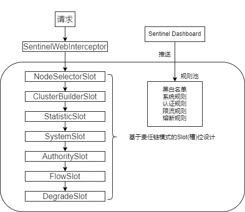

# 微服务

微服务演进过程:

1.单点架构存在的问题: 资

源利用率差(如计算密集型程序在cpu快占满的情况下但硬盘内存使用率低);

不具备分区容错性;

查询效率低.

改进方案: 部署应用集群, 分布式缓存, 实现数据库高可用/读写分离.

2.集群模式(每个应用节点都提供全部功能, 每个存储节点提供全量数据)存在的问题: 

技术驱动非业务驱动, 业务耦合严重(每一个改动都需要重新部署);

改进方案: 服务化改造, 以业务为中心; 垂直拆分业务子系统降低耦合.

3.服务化架构(SOA): 强调对业务垂直拆分形成多个服务模块独立管理独立维护

没有统一通信标准, ESB重量级, 高成本,中间产品, 跳过.

4.微服务架构模式:将单个应用程序开发为一组小型服务的方法, 每个小服务运行在自己的进程中, 并以轻量级机制(HTTP REST API)通信

## 可靠性

如果代码使用微服务与其他模块进行通信, 为了保障可靠性, 可使用的方案:

1.重试+补偿

如使用spring-retry模块便捷开发:

```
@Retryable(value = Exception.class, maxAttempts = 6,
            backoff = @Backoff(value = 1000))
public boolean xmethod(int a){
    //业务代码 和 与其他微服务模块远程通信代码
}
@Recover
public boolean doRecover(Throwable e,int a)throws ArithmeticException{
    log.error(...)
    // 补偿
    return false;
}
```

该方法表示方法抛出Exception异常时, 启用重试方案: 最多6次, 每次间隔1秒.

当超过6次重试失败后, 调用doRecover方法启用补偿方案.

2.方法调用表

数据库等持久化方法的调用状态, 并通过定时任务定期检查数据库, 对未成功的任务进行重试

## Dubbo

分布式服务框架, 工作流程为: provider 向注册中心去注册; consumer 从注册中心订阅服务，注册中心会通知 consumer 注册好的服务; consumer 调用 provider; consumer 和 provider 都异步通知监控中心.

初始化时, consumer会从注册中心将provider的地址等信息拉取到本地缓存, 因此, 注册中心挂了已缓存的服务之间可以继续通信.

Dubbo支持多种通信协议, 包括`dubbo://`、`hessian://`、`http://`等等.

默认为dobbo协议, 即`dubbo://`, 为单一长连接, 进行NIO异步通信, 使用Hessian二进制序列化. 适用于数据传输量小, 并发量高, 且consumer远大于provider的情况.

Dubbo支持多种序列化协议, 包括hession、Java二进制序列化、json等.

Dubbo支持多种负载均衡策略, 包括RandomLoadBalance(可加权重)、RoundRobinLoadBalance、LeastActiveLoadBalance(优先分发给效率高的provider)、ConsistentHashLoadBalance(根据请求参数分发到不同provider). 另外还包含多种容错策略,  如Failover Cluster模式(重试其他机器).

## SpringCloud Gateway

网关是所有微服务的门户，路由转发仅仅是最基本的功能，除此之外还有其他的一些功能，比如：**认证**、**鉴权**、**熔断**、**限流**、**日志监控**等

## Alibaba Sentinel

Sentinel Core为服务限流, 熔断提供了核心拦截器SentinelWebInterceptor , 这个拦截器默认对所有请求 /** 进行拦截 , 然后开始请求的链式处理流程, 在对于每一个处理请求的节点被称为slot (槽), 通过多个槽的连接形成处理链, 在请求的流转过程中, 如何有任何一个Slot验证未通过 , 都会产生BlockException ,请求处理链便会中断, 并返回"Blocked by sentinel"异常消息.



这些slot中, 前3个为前置处理 , 用于收集&统计&分析必要的数据; 后4个为规则校验, 从dashboard推送的新规则保存在"规则池"中 , 然后对于slot进行读取并校验当前请求是否允许放行, 允许放行则进入下一个slot直到最终被RestController进行业务处理, 不允许放行则直接抛出BlockException返回响应.

- NodeSelectorSlot负责收集资源的路径, 并将这些资源的调用路径以树状结构存储起来, 用于根据调用路径来限流降级.
- ClusterBuilderSlot用于存储资源的统计信息已经调用者信息, 例如该资源的RT( 运行时间 )&QPS&Thread Count(线程总数)等 ,这些信息用于多维度限流与降级的依据.
- StatisticSlot用于记录&统计不同维度的runtime信息.
- SystemSlot通过系统的状态, 如CPU或内存的情况 , 来控制总流量的入口.
- AuthoritySlot根据黑白名单做黑板名单控制.
- FlowSlot根据预设的限流规则, 以及前面slot统计的状态, 来进行限流.
- DegradeSlot通过统计信息, 以及限流的规则, 来做熔断降级.

### 防止系统被瞬时流量击垮

可通过Alibaba Sentinel的流控规则Warm Up解决.

当遇到突发大流量时, Warm Up**根据预热时间缓慢拉升阈值限制**(期间可给缓存预热提供足够时间), 预防系统瞬时崩溃, 超出阈值的请求直接拒接.

> Warm up冷加载因子为1/3, 即预热阈值从1/3开始上升

## Alibaba Seata

seata的设计为分布式事务设计理念中的二阶段提交.

事务管理器（TM）：决定什么时候全局提交/回滚  --> @GlobalTransactionl

事务协调者（TC）：负责通知命令的中间件            --> Seata-Server

资源管理器（RM）：做具体事的工具人                  --> @Transactional

1.通过添加seata核心注解@GlobalTransactional注解开启全局事务 , TM通知TC向下通达给RM开启本地事务


2.待本地事务都**提交**完成后,TM通过TC向RM下达全局事务处理结果.


Q:如果事务中间阶段出了问题, 而在RM处理本地子事务时,处理完成后是直接写表提交, 在TC下达分支结果时,是如何实现回滚的?

**AT模式(独有)**

Seata AT通过在所有数据库增加一张UNDO_LOG表.

> seata AT通过sql parser第三方jar包生成逆向sql , 存储在UNDO_LOG表中.  如:
> 
> insert into 订单表 values(1,...);   -->  delete from 订单表 where id = 1; 
> 
> update 会员积分表 set point = 50 where pid=1   --> update 会员积分表 set point = 40 where pid=1 

如果收到TC下达的分支提交, 则删掉UNDO_LOG中对于的记录即可;

如果收到TC下达的分支回滚, 执行UNDO_LOG中的**逆向SQL**,还原年数据.

Q: Seata如何避免并发场景的脏读与脏写?

利用**TC**自带的**分布式锁**完成:


**TCC**

通过在代码与数据表中扩展字段, 实现对数据资源的锁定. 回滚补偿逻辑需要开发自己实现.

**SAGA**

长事务(多节点、第三方)解决方案, 事务中每个参与者都提交本地事务, 当出现一个参与者失败则补偿前面已经成功的参与者, 一阶段正向服务和二阶段补偿服务都由业务开发实现.(如调用支付宝支付对应调用退款接口, 即存在正向链和反向链). 无法保证隔离性.

**XA**

基于数据库的XA协议来实现2PC, 因为是基于数据库自带特性, 实现简单.

| 模式   | 性能    | 一致性            | 要求                                        |
| ---- | ----- | -------------- | ----------------------------------------- |
| AT   | 高     | AP, 存在不一致的中间状态 | 需要拥有所有服务的数据库权限来创建UNDO_LOG表                |
| TCC  | 好     | AP             | 需要拥有所有服务的数据库权限, 回滚补偿逻辑需要开发自己实现. 但可支持异构数据库 |
| SAGA | 取决各个服 | AP             | 在当前架构下加入类似工作流的状态机机制, 提交与回滚逻辑都需要开发自己实现.    |
| XA   | 低     | CP, 强一致性       | 数据库需要支持XA方案                               |
