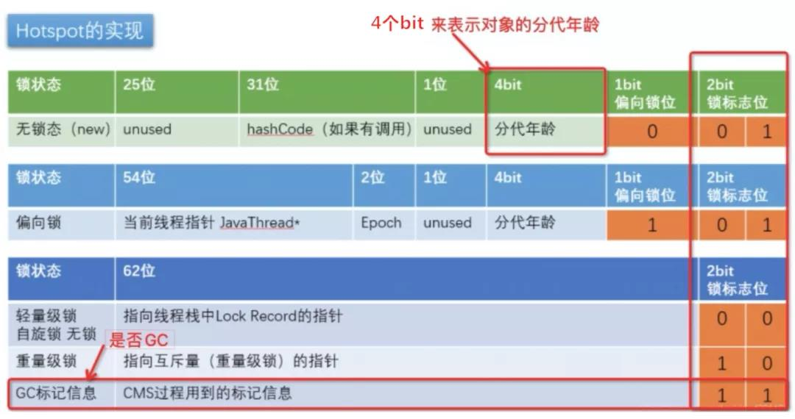

# 多线程

## JMM

|                  | 通信                                                         | 同步                                                       |
| ---------------- | ------------------------------------------------------------ | ---------------------------------------------------------- |
| 消息传递并发模型 | 线程之间没有公共状态, 线程间通信必须通过发送消息来显式进行通信 | 因为发送消息总是在接收消息之前, 因此为隐式同步             |
| 共享内存并发模型 | 线程之间共享程序的公共状态, 通过读-写内存中的公共状态进行隐式通信 | 必须显式指定某段代码需要在线程之间互斥执行, 因此为显式同步 |

Java使用的是共享内存并发模型, 堆中的变量就是共享变量.

> 内存可见性，指的是线程之间的可见性，当一个线程修改了共享变量时，另一个线程可以读取到这个修改后的值。

虽然Java堆共享, 但因为每个线程都保存了一份该线程使用到的共享变量的副本在其本地内存（比如机器的寄存器,高速缓存）中, 且规定线程对共享变量的所有操作都必须在自己的本地内存中进行. 如果线程A与线程B之间要通信的话:必须经历下面2个步骤：

1. 线程A将本地内存A中更新过的共享变量刷新到主内存中去;
2. 线程B到主内存中去读取线程A之前已经更新过的共享变量.

### 对象内存布局

Hotspot Java对象由以下组成:

- markword: 64bit, 加锁的核心, 还包含对象生命信息, 如是否GC,经过了几次Young GC还存活,锁信息;
- klass pointer: 32bit, 指向对象的class文件指针 java6以前未采用指针压缩为64bit, 之后默认开启);
- instance data: 对象实例数据
- padding: 对齐使用, 在64位server版本规定对象内存必须被8字节整除.

其中markword和klass pointer组合为Object Header, 大小为96bit即12字节. 若为数组, 则Object Header需要额外空间进行记录.

Markword:



> 第三方包 JOL  = Java Object Layout 可查看对象内存布局
>
> System.out.println(ClassLayout.parseInstance(o).toPrintable());

### volatile

**内存可见性**:

当一个线程对`volatile`修饰的变量进行**写操作**时，JMM会立即把该线程对应的本地内存中的共享变量的值刷新到主内存；

当一个线程对`volatile`修饰的变量进行**读操作**时，JMM会把立即该线程对应的本地内存置为无效，从主内存中读取共享变量的值。

> volatile关键字能保证数据的可见性，但不能保证数据的原子性, `synchronized` 关键字两者都能保证

**禁止重排序**

通过**内存屏障**严格限制编译器和处理器对volatile变量与普通变量的重排序

内存屏障有两个作用：

1. 阻止屏障两侧的指令重排序;
2. 强制把写本地内存中的脏数据等写回主内存, 或者让本地内存中相应的数据失效.

编译器在生成字节码时，会在指令序列中插入内存屏障来禁止特定类型的处理器重排序:

- 在每个volatile写操作前插入一个StoreStore屏障, 保证写操作执行前, 前面的其他写操作已经完毕并强制刷新到共享内存;
- 在每个volatile写操作后插入一个StoreLoad屏障, 保证该写操作对其后面的读操作可见;
- 在每个volatile读操作后插入一个LoadLoad屏障, 保证后续读操作执行前, 该读操作已经完毕;
- 在每个volatile读操作后再插入一个LoadStore屏障, 保证后续写操作被刷出前, 该读操作已经完毕.

## synchronized

通过 JDK 自带的 `javap` 命令查看类的相关字节码信息:

对于同步语句块, 通过 `monitorenter` 和 `monitorexit` 指令控制monitor的持有权;

对于同步方法, 通过`ACC_SYNCHRONIZED`表示, 本质也是对`monitor`对象控制.

### 锁升级

Java6以前无锁升级概念, 只有重量级锁. 为了减少获得锁和释放锁带来的性能消耗, 引入了偏向锁和轻量级锁, 几种锁会随着竞争情况逐渐升级.

> 锁的升级很容易发生, 但是锁降级发生的条件较苛刻, 仅发生在Stop The World期间, 当JVM进入安全点的时候, 会检查是否有闲置的锁, 然后进行降级

**偏向锁**

偏向于第一个访问锁的线程, 如果在接下来的运行过程中, 该锁没有被其他的线程访问, 则持有偏向锁的线程将永远不需要触发同步. 即偏向锁在资源无竞争情况下消除了同步语句, 连CAS操作都不做了, 提高了程序的运行性能.

> 偏向锁与无锁状态共用01锁标志位

一个线程在第一次进入同步块时, 会在对象头和栈帧中的锁记录里存储锁的偏向的线程ID. 以后该线程进入和退出同步块时, 不需要花费CAS操作来加锁和解锁, 只需要检查锁的Mark Word里面是不是放的自己的线程ID.

如果是, 则表明该线程已经获得了锁; 如果不是, 则代表有另一个线程来竞争这个偏向锁. 这个时候会尝试使用CAS来替换Mark Word里面的线程ID, 这个时候要分两种情况：

- 若替换成功, 则表示之前的线程不存在了, 锁不会升级, 仍然为偏向锁；
- 若替换失败, 则表示之前的线程仍然存在, 那么暂停之前的线程, 升级为轻量级锁.

因为偏向锁在升级轻量级锁的过程中, 需要寻找一个安全点暂停拥有偏向锁的线程; 然后遍历线程栈, 若存在锁记录, 则修复锁记录和重置Mark Work, 使其变为无锁; 最后唤醒被暂停的线程对锁进行升级( 如设置偏向锁标识为0, 并设置锁标志位为00)

因为升级过程消耗资源, 如果应用程序从一开始, 锁就处于竞争状态, 那么偏向锁就会是一种累赘. 因此, 可以关闭偏向锁使用:

```java
-XX:UseBiasedLocking=false。
```

> 为了解决多竞争下偏向锁升级的消耗, jdk1.6默认4s以后才激活

**轻量级锁**

执行同步块之前, JVM会为每个线程在当前线程的栈帧中创建用于存储锁记录的空间, 并将对象头中的Mark Word复制到锁记录中, 这个过程为Displaced Mark Word.

然后线程尝试用CAS将锁的Mark Word替换为指向锁记录的指针. 如果成功, 当前线程获得锁; 否则, 表示Mark Word已经被其他线程替换了锁记录的指针, 存在锁竞争, 当前线程尝试使用自旋来获取锁。

自旋是需要消耗CPU的, JVM采用适应性自旋: 线程如果自旋成功了, 则下次自旋的次数会更多; 如果自旋失败了, 则自旋的次数就会减少.

如果自旋到一定程度(和JVM、操作系统相关), 依然没有获取到锁, 则这个线程会阻塞, 并升级为重量级锁.

**重量级锁**

重量级锁依赖于操作系统的互斥量(mutex)实现的, 因为操作系统中线程间状态的转换需要相对比较长的时间, 所以重量级锁效率很低, 但被阻塞的线程不会消耗CPU.

Java对重量级锁的实现好像与ReentrantLock的AQS类似.

> 当调用一个锁对象的`wait`或`notify`方法时, 若当前锁的状态是偏向锁或轻量级锁, 则会先膨胀成重量级锁

### 偏向锁测试

对4s后才开启偏向锁进行测试

JOL输出的第一个字节的最后两位为锁标志位, jdk8下:

查看下列代码输出:

```java
public class JOLDemo {
    private static Object  o;
    public static void main(String[] args) {
        o = new Object();
        System.out.println(ClassLayout.parseInstance(o).toPrintable());
        synchronized (o){
            System.out.println(ClassLayout.parseInstance(o).toPrintable());
        }
    }
}
```

第一次输出的锁标志位为01, 锁偏向位为0, 表示无锁状态;

第二次输出的锁标志位为00, 表示轻量级锁状态.

在锁前加入延迟5s, 再查看下列代码输出:

```java
public class JOLDemo {
    private static Object  o;
    public static void main(String[] args) {
      try { Thread.sleep(5000); } catch (InterruptedException e) { e.printStackTrace(); }
        o = new Object();
        synchronized (o){
            System.out.println(ClassLayout.parseInstance(o).toPrintable());
        }
    }
}
```

输出的锁标志位为10 和 锁偏向位为1, 即偏向锁.

## ThreadLocal

ThreadLocal初始化方式

```java
private static final ThreadLocal<SimpleDateFormat> formatter = new ThreadLocal<SimpleDateFormat>(){
    @Override
    protected SimpleDateFormat initialValue(){
        return new SimpleDateFormat("yyyyMMdd HHmm");
    }
};
```

可以转换为lambda形式

```java
private static final ThreadLocal<SimpleDateFormat> formatter = ThreadLocal.withInitial(() -> new SimpleDateFormat("yyyyMMdd HHmm"));
```

**原理**

ThreadLocalMap实际上为一个以ThreadLocal为key, Object为value的Map, 每个Thread包含一个ThreadLocalMap

默认情况下为null, 只有当前线程调用ThreadLocal的 set或get方法时才进行创建, 并且实际上对应调用的方法为ThreadLocalMap类的 get()和set()方法, 以Thread.set为例 :

```java
public void set(T value) {
    Thread t = Thread.currentThread();
    ThreadLocalMap map = getMap(t);
    if (map != null)
        map.set(this, value);
    else
        createMap(t, value);
}
ThreadLocalMap getMap(Thread t) {
    return t.threadLocals;
}
```

**内存泄漏问题**

ThreadLocalMap中的key为ThreadLocal的弱引用, 但value为强引用. 如果key对应的ThreadLocal对象未被外部强引用, 在GC的时候就会被清理掉, 但value不会被清理掉.  这样会导致ThreadLocalMap中出现key为null的Entry, 并且value永远也不会被GC掉:

```java
static class Entry extends WeakReference<ThreadLocal<?>> {
    /** The value associated with this ThreadLocal. */
    Object value;

    Entry(ThreadLocal<?> k, Object v) {
        super(k);
        value = v;
    }
}
```

ThreadLocalMap为了解决该问题, 在调用 set、get、remove的时候会清理掉key为null的记录. 但最好还是使用完ThreadLocal方法后手动调用remove方法.

## 线程池

> 真正能代表线程池意义的是ThreadPoolExecutor类, 而不是Executor接口和以Executor结尾的类. Executor它的职责并不是提供一个线程池的接口, 而是提供一个“将来执行命令”的接口.

1. 创建/销毁线程需要消耗系统资源, 线程池可以复用已创建的线程;
2. 控制并发的数量, 并发数量过多, 可能会导致资源消耗过多, 从而造成服务器崩溃;
3. 可以对线程做统一管理.

Java中的线程池顶层接口是`Executor`接口, `ThreadPoolExecutor`是这个接口的实现类。

ThreadPoolExecutor的3个最重要的参数：

- corePoolSize: 核心线程最大数;
- maximumPoolSize: 总线程最大数. 总线程数=核心线程数量 + 非核心线程数量;
- workQueue: 阻塞队列, 用于维护等待执行的Runnable. 若线程数大于核心线程数, 则任务添加到该队列;
- keepAliveTime: 非核心线程闲置超时时长；
- unit: keepAliveTime参数的时间单位;
- threadFactory: 创建线程的工厂, 可选参数;
- handler: 饱和策略(拒绝策略), 当线程数达到maximumPoolSize且workQueue已满时对新任务的策略, 可选参数.

```
ThreadPoolExecutor.AbortPolicy： 抛出 RejectedExecutionException来拒绝新任务的处理。 这是默认的拒绝策略
ThreadPoolExecutor.CallerRunsPolicy： 由调用线程处理该任务,如果执行程序已关闭，则会丢弃该任务。
ThreadPoolExecutor.DiscardPolicy： 不处理新任务，直接丢弃掉。 ThreadPoolExecutor.DiscardOldestPolicy： 此策略将丢弃最早的未处理的任务请求(队列头部)。
```

**线程池状态**

ThreadPoolExecutor类中使用了一些`final int`常量变量来表示线程池的状态, 分别为RUNNING、SHUTDOWN、STOP、TIDYING 、TERMINATED:

- 线程池创建后处于RUNNING状态;
- 调用shutdown()后处于SHUTDOWN状态, 线程池不能接受新的任务, 清除一些空闲worker, 会等待阻塞队列的任务完成;
- 调用shutdownNow()后处于STOP状态, 线程池不能接受新的任务, 中断所有线程, 阻塞队列中没有被执行的任务全部丢弃;
- 当所有的任务已终止, ctl记录的”任务数量”为0, 线程池会变为TIDYING状态;

> ThreadPoolExecutor中有一个控制状态的属性叫`ctl`，它是一个AtomicInteger类型的变量。线程池状态就是通过AtomicInteger类型的成员变量`ctl`来获取的。

> 获取的`ctl`值传入`runStateOf`方法，与`~CAPACITY`位与运算(`CAPACITY`是低29位全1的int变量)。

> `~CAPACITY`在这里相当于掩码，用来获取ctl的高3位，表示线程池状态；而另外的低29位用于表示工作线程数

- 线程池处在TIDYING状态时, 执行完terminated()方法之后, 线程池被设置为TERMINATED状态。

### ThreadPoolExecutor问题

> 该部分内容摘自阿里技术微信公众号文章

**1.corePoolSize=0时会怎么样?**

在jdk6以前, ThreadPoolExecutor的流程是:

- 提交任务后，先判断当前池中线程数是否小于corePoolSize，如果小于，则创建新线程执行这个任务。

- 否则，判断等待队列是否已满，如果没有满，则添加到等待队列。

- 否则，判断当前池中线程数是否大于maximumPoolSize，如果大于则拒绝。

- 否则，创建一个新的线程执行这个任务。

在jdk6以后, ThreadPoolExecutor的流程是:

- 线程池提交任务后，首先判断当前池中线程数是否小于corePoolSize。如果小于则尝试创建新的线程执行该任务；否则尝试添加到等待队列。

- 如果添加队列成功，判断当前池内线程数是否为0，如果是则创建一个firstTask为null的worker，这个worker会从等待队列中获取任务并执行。

- 如果添加到等待队列失败，一般是队列已满，才会再尝试创建新的线程。但在创建之前需要与maximumPoolSize比较，如果小于则创建成功。

- 否则执行拒绝策略。

具体流程区别于代码

```java
int c = ctl.get();
if (workerCountOf(c) < corePoolSize) {
    if (addWorker(command, true))
         return;
    c = ctl.get();
}if (isRunning(c) && workQueue.offer(command)) {
    int recheck = ctl.get();
    if (! isRunning(recheck) && remove(command))
        reject(command);
    // 注意这一行代码，添加到等待队列成功后，判断当前池内线程数是否为0，如果是则创建一个firstTask为null的worker，这个worker会从等待队列中获取任务并执行。
    else if (workerCountOf(recheck) == 0)
        addWorker(null, false);
}else if (!addWorker(command, false))
    reject(command);
```

所以, 在1.6版本之后，如果corePoolSize=0，提交任务时如果线程池为空，则会**立即创建一个线程**来执行任务（先排队再获取）；如果提交任务的时候，线程池不为空，则先在等待队列中排队，只有队列满了才会创建新线程。

 **2.线程池创建之后，会立即创建核心线程么?**

不会。从上面的源码可以看出，在刚刚创建ThreadPoolExecutor的时候，线程并不会立即启动，而是要等到有任务提交时才会启动，除非调用了`prestartCoreThread/prestartAllCoreThreads`事先启动核心线程。

**3.核心线程会不会销毁?**

在JDK1.6之前，线程池会尽量保持corePoolSize个核心线程，即使这些线程闲置了很长时间。这一点曾被开发者诟病，所以从JDK1.6开始，提供了方法`allowsCoreThreadTimeOut`，如果传参为true，则允许闲置的核心线程被终止。

> 请注意这种策略和corePoolSize=0的区别:
>
> - corePoolSize=0：在一般情况下只使用一个线程消费任务，只有当并发请求特别多、等待队列都满了之后，才开始用多线程。
>
> - allowsCoreThreadTimeOut=true && corePoolSize>1：在一般情况下就开始使用多线程（corePoolSize个），当并发请求特别多，等待队列都满了之后，继续加大线程数。但是当请求没有的时候，允许核心线程也终止。
>
> 所以corePoolSize=0(非核心线程, 可销毁)的效果，基本等同于allowsCoreThreadTimeOut=true && corePoolSize=1 (1个核心线程, 可销毁)，但实现细节其实不同。

**4.如何保证线程不被销毁?**

`ThreadPoolExecutor`有个内部类Worker，它实现了Runnable接口, 它表示线程池中的线程; 而等待队列中的元素，是我们提交的Runnable任务。

每一个Worker在创建出来的时候，会调用它本身的run()方法，实现是runWorker(this)，这个实现的核心是一个**while循环**，这个循环不结束，Worker线程就不会终止:

```java
final void runWorker(Worker w) {
        Thread wt = Thread.currentThread();
        Runnable task = w.firstTask;
        w.firstTask = null;
        w.unlock(); // allow interrupts
        boolean completedAbruptly = true;
        try {
            // 核心逻辑
            while (task != null || (task = getTask()) != null) {
                w.lock();
                // If pool is stopping, ensure thread is interrupted;
                // if not, ensure thread is not interrupted.  This
                // requires a recheck in second case to deal with
                // shutdownNow race while clearing interrupt
                if ((runStateAtLeast(ctl.get(), STOP) ||
                     (Thread.interrupted() &&
                      runStateAtLeast(ctl.get(), STOP))) &&
                    !wt.isInterrupted())
                    wt.interrupt();
                try {
                    beforeExecute(wt, task);
                    Throwable thrown = null;
                    try {
                        task.run();
                    } catch (RuntimeException x) {
                        thrown = x; throw x;
                    } catch (Error x) {
                        thrown = x; throw x;
                    } catch (Throwable x) {
                        thrown = x; throw new Error(x);
                    } finally {
                        afterExecute(task, thrown);
                    }
                } finally {
                    task = null;
                    w.completedTasks++;
                    w.unlock();
                }
            }
            completedAbruptly = false;
        } finally {
            processWorkerExit(w, completedAbruptly);
        }
    }
```

在该方法中 `getTask()` 就是从等待队列中取出任务来执行：

```java
  private Runnable getTask() {
        boolean timedOut = false; // Did the last poll() time out?

        for (;;) {
            int c = ctl.get();
            int rs = runStateOf(c);

            // Check if queue empty only if necessary.
            if (rs >= SHUTDOWN && (rs >= STOP || workQueue.isEmpty())) {
                decrementWorkerCount();
                return null;
            }

            int wc = workerCountOf(c);

            // Are workers subject to culling?
            boolean timed = allowCoreThreadTimeOut || wc > corePoolSize;

            if ((wc > maximumPoolSize || (timed && timedOut))
                && (wc > 1 || workQueue.isEmpty())) {
                if (compareAndDecrementWorkerCount(c))
                    return null;
                continue;
            }

            try {
                // 注意，核心中的核心在这里
                Runnable r = timed ?
                    workQueue.poll(keepAliveTime, TimeUnit.NANOSECONDS) :
                    workQueue.take();
                if (r != null)
                    return r;
                timedOut = true;
            } catch (InterruptedException retry) {
                timedOut = false;
            }
        }
    }
```

- 如果线程数没有达到corePoolSize，则创建的Worker在执行完它承接的任务后，会用workQueue.take()取任务、注意，这个接口是阻塞接口，如果取不到任务，Worker线程一直阻塞。

- 如果线程数超过了corePoolSize ( 超过的线程允许销毁 )，或者allowCoreThreadTimeOut ( 允许核心线程销毁 )，一个Worker在空闲了之后，会用workQueue.poll(keepAliveTime, TimeUnit.NANOSECONDS)取任务。注意，这个接口只阻塞等待keepAliveTime时间，超过这个时间返回null，则Worker的while循环执行结束，则被终止了。

**5.空闲线程过多会有什么问题?**

在空闲线程(即线程池中阻塞在队列的take方法中的线程)过多的情况下:

- 如果使用了`ThreadLocal`, 会导致缓存的数据过大又不清理;
- 对于局部变量, 因为线程处于阻塞状态，肯定还有栈帧没有出栈，栈帧中有局部变量表，凡是被局部变量表引用的内存都不能回收。所以如果这个线程创建了比较大的局部变量，那么这一部分内存无法GC。
- 对于TLAB机制：如果线程数过多，那么新的线程初始化可能因为Eden没有足够的空间分配TLAB而触发YoungGC。

 **6.keepAliveTime=0会怎么样?**

在JDK1.8中，keepAliveTime=0表示非核心线程执行完立刻终止。

默认情况下，keepAliveTime小于0，初始化的时候会报错；但如果allowsCoreThreadTimeOut，keepAliveTime必须大于0，不然初始化报错。

**7.如何处理异常?**

对于execute和submit不同场景的异常处理

submit实现在`ThreadPoolExecutor`的父类`AbstractExecutorService`中:

```java
  public Future<?> submit(Runnable task) {
        if (task == null) throw new NullPointerException();
        RunnableFuture<Void> ftask = newTaskFor(task, null);
        execute(ftask);
        return ftask;
    }
    public <T> Future<T> submit(Runnable task, T result) {
        if (task == null) throw new NullPointerException();
        RunnableFuture<T> ftask = newTaskFor(task, result);
        execute(ftask);
        return ftask;
    }
    public <T> Future<T> submit(Callable<T> task) {
        if (task == null) throw new NullPointerException();
        RunnableFuture<T> ftask = newTaskFor(task);
        execute(ftask);
        return ftask;
    }
```

方法创建了一个FutureTask，FutureTask实现RunnableFuture接口，RunnableFuture接口继承Runnable接口和Future接口。而Callable只是FutureTask的一个成员变量。

FutureTask的核心代码就是实现了Future接口，也就是get方法的实现:

```java
    public V get() throws InterruptedException, ExecutionException {
        int s = state;
        if (s <= COMPLETING)
            // 核心代码
            s = awaitDone(false, 0L);
        return report(s);
    }

    private int awaitDone(boolean timed, long nanos) throws InterruptedException {
        final long deadline = timed ? System.nanoTime() + nanos : 0L;
        WaitNode q = null;
        boolean queued = false;
        // 死循环
        for (;;) {
            if (Thread.interrupted()) {
                removeWaiter(q);
                throw new InterruptedException();
            }

            int s = state;
            // 只有任务的状态是’已完成‘，才会跳出死循环
            if (s > COMPLETING) {
                if (q != null)
                    q.thread = null;
                return s;
            }
            else if (s == COMPLETING) // cannot time out yet
                Thread.yield();
            else if (q == null)
                q = new WaitNode();
            else if (!queued)
                queued = UNSAFE.compareAndSwapObject(this, waitersOffset,
                                                     q.next = waiters, q);
            else if (timed) {
                nanos = deadline - System.nanoTime();
                if (nanos <= 0L) {
                    removeWaiter(q);
                    return state;
                }
                LockSupport.parkNanos(this, nanos);
            }
            else
                LockSupport.park(this);
        }
    }
```

get的核心实现是有个awaitDone方法，这是一个死循环，只有任务的状态是“已完成”，才会跳出死循环；否则会依赖UNSAFE包下的LockSupport.park原语进行阻塞，等待LockSupport.unpark信号量。而这个信号量只有当运行结束获得结果、或者出现异常的情况下，才会发出来。分别对应方法set和setException。这就是异步执行、阻塞获取的原理(扯得有点深了) .

回到最初我们的疑问，为什么submit之后，通过get方法可以获取到异常？原因是FutureTask有一个Object类型的outcome成员变量，用来记录执行结果。这个结果可以是传入的泛型，也可以是Throwable异常：

```
public void run() {
        if (state != NEW ||
            !UNSAFE.compareAndSwapObject(this, runnerOffset,
                                         null, Thread.currentThread()))
            return;
        try {
            Callable<V> c = callable;
            if (c != null && state == NEW) {
                V result;
                boolean ran;
                try {
                    result = c.call();
                    ran = true;
                } catch (Throwable ex) {
                    result = null;
                    ran = false;
                    setException(ex);
                }
                if (ran)
                    set(result);
            }
        } finally {
            // runner must be non-null until state is settled to
            // prevent concurrent calls to run()
            runner = null;
            // state must be re-read after nulling runner to prevent
            // leaked interrupts
            int s = state;
            if (s >= INTERRUPTING)
                handlePossibleCancellationInterrupt(s);
        }
    }

  // get方法中依赖的，报告执行结果
    private V report(int s) throws ExecutionException {
        Object x = outcome;
        if (s == NORMAL)
            return (V)x;
        if (s >= CANCELLED)
            throw new CancellationException();
        throw new ExecutionException((Throwable)x);
    }
```

FutureTask的另一个巧妙的地方就是借用RunnableAdapter内部类，将submit的Runnable封装成Callable。所以就算你submit的是Runnable，一样可以用get获取到异常。

所以, 对于处理异常:

1. 不论是用execute还是submit，都可以自己在业务代码上加try-catch进行异常处理。
2. 如果是execute，还可以自定义线程池，继承ThreadPoolExecutor并复写其afterExecute(Runnable r, Throwable t)方法。
3. 或者实现Thread.UncaughtExceptionHandler接口，实现void uncaughtException(Thread t, Throwable e);方法，并将该handler传递给线程池的ThreadFactory。
4. 但afterExecute和UncaughtExceptionHandler都不适用submit。因为通过上面的FutureTask.run()不难发现，它自己对Throwable进行了try-catch，封装到了outcome属性，所以底层方法execute的Worker是拿不到异常信息的。

**8.shutdown和shutdownNow的区别**

- shutdown => 平缓关闭，等待所有已添加到线程池中的任务执行完再关闭。

- shutdownNow => 立刻关闭，停止正在执行的任务，并返回队列中未执行的任务。

## CAS

**悲观锁：**

悲观锁就是我们常说的锁。对于悲观锁来说，它总是认为每次访问共享资源时会发生冲突，所以必须对每次数据操作加上锁，以保证临界区的程序同一时间只能有一个线程在执行。

**乐观锁：**

乐观锁又称为“无锁”，顾名思义，它是乐观派。乐观锁总是假设对共享资源的访问没有冲突，线程可以不停地执行，无需加锁也无需等待。而一旦多个线程发生冲突，乐观锁通常是使用一种称为CAS的技术来保证线程执行的安全性。

由于无锁操作中没有锁的存在，因此不可能出现死锁的情况，也就是说**乐观锁天生免疫死锁**。

乐观锁多用于“读多写少“的环境，避免频繁加锁影响性能；而悲观锁多用于”写多读少“的环境，避免频繁失败和重试影响性能。

**CAS**的全称是：比较并交换（Compare And Swap）。在CAS中，有这样三个值：

- V：要更新的变量(var)
- E：预期值(expected)
- N：新值(new)

比较并交换的过程如下：

判断V是否等于E，如果等于，将V的值设置为N；如果不等，说明已经有其它线程更新了V，则当前线程放弃更新，什么都不做。

所以这里的**预期值E本质上指的是“旧值”**。

那有没有可能我在判断了`i`为5之后，正准备更新它的新值的时候，被其它线程更改了`i`的值呢？

不会的。因为CAS是一种原子操作，它是一种系统原语，是一条CPU的原子指令，从CPU层面保证它的原子性

**当多个线程同时使用CAS操作一个变量时，只有一个会胜出，并成功更新，其余均会失败，但失败的线程并不会被挂起，仅是被告知失败，并且允许再次尝试，当然也允许失败的线程放弃操作。**

**JAVA实现CAS原理 - Unsafe类**

在Java中，如果一个方法是native的，那Java就不负责具体实现它，而是交给底层的JVM使用c或者c++去实现

sun.misc.Unsafe关于CAS的

```
boolean compareAndSwapObject(Object o, long offset,Object expected, Object x);
boolean compareAndSwapInt(Object o, long offset,int expected,int x);
boolean compareAndSwapLong(Object o, long offset,long expected,long x);
```

Unsafe中对CAS的实现是C++写的，它的具体实现和操作系统、CPU都有关系。

Linux的X86下主要是通过`cmpxchgl`这个指令在CPU级完成CAS操作的，但在多处理器情况下必须使用`lock`指令加锁来完成。当然不同的操作系统和处理器的实现会有所不同，大家可以自行了解。

当然，Unsafe类里面还有其它方法用于不同的用途。比如支持线程挂起和恢复的`park`和`unpark`， LockSupport类底层就是调用了这两个方法。还有支持反射操作的`allocateInstance()`方法。


**原子操作**

JAVA使用CAS三个方法来实现具体的原子操作为java.util.concurrent.atomic下的原子类

以`AtomicInteger`类的`getAndAdd(int delta)`方法为例

```java
private static final jdk.internal.misc.Unsafe U = jdk.internal.misc.Unsafe.getUnsafe();

private static final long VALUE = U.objectFieldOffset(AtomicInteger.class, "value");

public final int getAndAdd(int delta) {
    return U.getAndAddInt(this, VALUE, delta);
}
```

`AtomicInteger`类的`getAndAdd(int delta)`方法是调用`Unsafe`类的`getAndAddInt`的方法来实现的.

对象`o`是`this`，也就是一个`AtomicInteger`对象. 

`offset`是一个常量`VALUE`, 这个常量是通过调用`Unsafe`类的`objectFieldOffset`方法获取的, 传入一个类对象和一个该类对象的字段名, **用于获取某个字段相对Java对象的“起始地址”的偏移量**。

>一个java对象可以看成是一段内存，各个字段都得按照一定的顺序放在这段内存里，同时考虑到对齐要求，可能这些字段不是连续放置的，

`delta` 为相加的参数

```java
//Unsafe#getAndAddInt
@HotSpotIntrinsicCandidate
public final int getAndAddInt(Object o, long offset, int delta) {
    int v;
    do {
        v = getIntVolatile(o, offset);
    } while (!weakCompareAndSetInt(o, offset, v, v + delta));
    return v;
}
```

CAS是“无锁”的基础，它允许更新失败。所以经常会与while循环搭配，在失败后不断去重试。

从方法名为`getAndAddInt` ,这个方法应该返回原来的值, 所以这里用v来接收原来的值. 新的值为`v+delta`

**do-while循环**不多见，它的目的是**保证循环体内的语句至少会被执行一遍**。这样才能保证return 的值`v`是我们期望的值.

循环体的条件是一个CAS方法:

```java
public final boolean weakCompareAndSetInt(Object o, long offset,
                                          int expected,
                                          int x) {
    return compareAndSetInt(o, offset, expected, x);
}

public final native boolean compareAndSetInt(Object o, long offset,
                                             int expected,
                                             int x);
```

再回到循环条件上来，可以看到它是在不断尝试去用CAS更新。如果更新失败，就继续重试。那为什么要把获取“旧值”v的操作放到循环体内呢？其实这也很好理解。前面我们说了，CAS如果旧值V不等于预期值E，它就会更新失败。说明旧的值发生了变化。那我们当然需要返回的是被其他线程改变之后的旧值了，因此放在了do循环体内。	


**CAS实现原子操作三大问题**

**1.ABA问题**

所谓ABA问题，就是一个值原来是A，变成了B，又变回了A。这个时候使用CAS是检查不出变化的，但实际上却被更新了两次。

ABA问题的解决思路是在变量前面追加上**版本号或者时间戳**。从JDK 1.5开始，JDK的atomic包里提供了一个类`AtomicStampedReference`类来解决ABA问题。

这个类的`compareAndSet`方法的作用是首先检查当前引用是否等于预期引用，并且检查当前标志是否等于预期标志，如果二者都相等，才使用CAS设置为新的值和标志。

```java
public boolean compareAndSet(V   expectedReference,
                             V   newReference,
                             int expectedStamp,
                             int newStamp) {
    Pair<V> current = pair;
    return
        expectedReference == current.reference &&
        expectedStamp == current.stamp &&
        ((newReference == current.reference &&
          newStamp == current.stamp) ||
         casPair(current, Pair.of(newReference, newStamp)));
}
```

**2.循环时间长 开销大**

CAS多与自旋结合。如果自旋CAS长时间不成功，会占用大量的CPU资源。

解决思路是让JVM支持处理器提供的**pause指令**。

pause指令能让自旋失败时cpu睡眠一小段时间再继续自旋，从而使得读操作的频率低很多,为解决内存顺序冲突而导致的CPU流水线重排的代价也会小很多。

**3.只能保证一个共享变量的原子操作**

这个问题你可能已经知道怎么解决了。有两种解决方案：

1. 使用JDK 1.5开始就提供的`AtomicReference`类保证对象之间的原子性，把多个变量放到一个对象里面进行CAS操作；
2. 使用锁。锁内的临界区代码可以保证只有当前线程能操作。

## AQS

通过同步状态标志+双向队列(链表)实现

链表的第一个node自旋获取状态, 后继node阻塞, 等待前一个node的唤醒( 通过LockSupport实现) 

**AQS的主要方法解析**

AQS的设计是基于**模板方法模式**的，它有一些方法必须要子类去实现的，它们主要有：

- isHeldExclusively()：该线程是否正在独占资源。只有用到condition才需要去实现它。
- tryAcquire(int)：独占方式。尝试获取资源，成功则返回true，失败则返回false。
- tryRelease(int)：独占方式。尝试释放资源，成功则返回true，失败则返回false。
- tryAcquireShared(int)：共享方式。尝试获取资源。负数表示失败；0表示成功，但没有剩余可用资源；正数表示成功，且有剩余资源。
- tryReleaseShared(int)：共享方式。尝试释放资源，如果释放后允许唤醒后续等待结点返回true，否则返回false。

这些方法虽然都是`protected`方法，但是它们并没有在AQS具体实现，而是直接抛出异常（这里不使用抽象方法的目的是：避免强迫子类中把所有的抽象方法都实现一遍，减少无用功，这样子类只需要实现自己关心的抽象方法即可，比如 Semaphore 只需要实现 tryAcquire 方法而不用实现其余不需要用到的模版方法）：

```java
protected boolean tryAcquire(int arg) {
    throw new UnsupportedOperationException();
}
```

具体见《Java并发编程的艺术5.2》

### **ReentrantLock**

**重入锁** , 属于排他锁

与synchronized区别:

1.两者都是可重入锁;

2.synchronized 依赖于 JVM 而 ReentrantLock 依赖于 API;

3.ReentrantLock 比 synchronized 增加了一些高级功能;

**等待可中断** : `ReentrantLock`提供了一种能够中断等待锁的线程的机制，通过 `lock.lockInterruptibly()` 来实现这个机制。也就是说正在等待的线程可以选择放弃等待，改为处理其他事情。

**可实现公平锁** : `ReentrantLock`可以指定是公平锁还是非公平锁。而`synchronized`只能是非公平锁。所谓的公平锁就是先等待的线程先获得锁。`ReentrantLock`默认情况是非公平的，可以通过 `ReentrantLock`类的`ReentrantLock(boolean fair)`构造方法来制定是否是公平的。

**可实现选择性通知（锁可以绑定多个条件）**: `synchronized`关键字与`wait()`和`notify()`/`notifyAll()`方法相结合可以实现等待/通知机制。`ReentrantLock`类当然也可以实现，但是需要借助于`Condition`接口与`newCondition()`方法。

具体见《Java并发编程的艺术5.3》

### ReentrantReadWriteLock

是ReadWriteLock接口的JDK默认实现。它与ReentrantLock的功能类似，同样是可重入的，支持非公平锁和公平锁。不同的是，它还支持”读写锁“。

两个锁, 读锁为共享锁, 写锁为独占锁, 在一个state上维护16位读+16位写两个状态.

具体见《Java并发编程的艺术5.4》

## JUC

JDK并没有提供线程安全的List类，因为对List来说，**很难去开发一个通用并且没有并发瓶颈的线程安全的List**。因为即使简单的读操作，拿contains() 这样一个操作来说，很难想到搜索的时候如何避免锁住整个list。

### Map

**ConcurrentHashMap**

> HashMap在并发put时会引起死循环, 导致Entry链表形成环形数据结构, next节点永远不为空. 从而在get的时候死循环获取.
>
> HashTable锁整个结构效率低下

通过Segment+HashEntry实现, 一个ConcurrentHashMap中包含一个Segment数组, 一个Segment里包含一个HashEntry数组.

Segment是一种可重入锁, 结构与HashMap类似, 是一种数组+链表结构.

HashEntry用于存储键值对数据.

因为要使得元素能均匀的分布在不同的Segment下, 在插入和获取元素的时候, 必须通过再散列(对元素的hashCode再进行一次散列)的方式定位到Segment.

**对于get操作**:

不加锁, 通过将get方法要使用的共享变量都定义成volatile类型, 如HashEntry的value, 因为get不需要对共享变量进行写, 所以可以不用加锁, 即使多个线程进行put也能get到最新的值. **这是使用volatile替换锁的经典使用场景**.

**对于put操作**:

必须要对Segment加锁, **在插入前**, 先会判断Segment里的HashEntry数组是否超过容量(threshold), 如果超过, 则进行二倍扩容.

> HashMap是在插入元素后判断是否需要扩容后再扩容的, 很有可能扩容之后没有新元素插入, 那么这次扩容就是无效的扩容.
>
> 所以Segment的扩容判断比HashMap更恰当.

**对于size操作**:

因为分段, 所以需要统计所有Segment里元素的大小后求和. 即使Segment里的count是一个volatile变量, 在相加时可以获取到最新值, 但在累加统计前count如果发生变化, 则统计结果就不准了.

但是ConcurrentHashMap并没有在size的时候把所有Segemtn的put、remove和clean方法锁住. 因为在累加count的过程中, 之前累加过的count发生变化的几率非常小, 所以先尝试2次不锁住Segment的方式来统计各个Segment大小. 如果在统计过程中, count发生了变化再采用加锁的方式来统计.

> 如何判断在统计时Segment的count发生了变化?
>
> 使用`modCount`变量: 在每次put、remove和clean方法里操作元素前都会将modCount加1, 在统计size前后比较modCount是否发生了变化从而得知Segment的count是否发生变化.


在JDK 1.8中，对ConcurrentHashMap主要做了两个优化：

- 同HashMap一样，链表也会在长度达到8的时候转化为红黑树，这样可以提升大量冲突时候的查询效率；
- 以某个位置的头结点（链表的头结点或红黑树的root结点）为锁，配合自旋+CAS避免不必要的锁开销，进一步提升并发性能。只要 hash 不冲突，就不会产生并发，


**ConcurrentNavigableMap接口与ConcurrentSkipListMap类**

>跳表的本质是同时维护了多个链表，并且链表是分层的
>
>跳表是一种利用空间换时间的算法。

ConcurrentNavigableMap接口继承了NavigableMap接口，这个接口提供了针对给定搜索目标返回最接近匹配项的导航方法。

ConcurrentNavigableMap接口的主要实现类是ConcurrentSkipListMap类。从名字上来看，它的底层使用的是跳表（SkipList）的数据结构。关于跳表的数据结构这里不做太多介绍，它是一种”空间换时间“的数据结构，可以使用CAS来保证并发安全性。


**Set**

JDK提供了ConcurrentSkipListSet，是线程安全的有序的集合。底层是使用ConcurrentSkipListMap实现。

谷歌的guava框架实现了一个线程安全的ConcurrentHashSet：

```java
Set<String> s = Sets.newConcurrentHashSet();
```

### Queue

Java 提供的线程安全的 `Queue` 可以分为**阻塞队列**和**非阻塞队列**，其中阻塞队列的典型例子是 `BlockingQueue`，非阻塞队列的典型例子是 `ConcurrentLinkedQueue`，在实际应用中要根据实际需要选用阻塞队列或者非阻塞队列。 **阻塞队列可以通过加锁来实现，非阻塞队列可以通过 CAS 操作实现。** 


**非阻塞队列**

ConcurrentLinkedQueue是一个基于链表节点的无界线程安全队列. 由head节点和tail节点组成.

具体见《Java并发编程的艺术6.2》


**阻塞队列**

阻塞队列来源于生产者-消费者模式.

BlockingQueue一般用于生产者-消费者模式和线程池，生产者是往队列里添加元素的线程，消费者是从队列里拿元素的线程。**BlockingQueue就是存放元素的容器**。

阻塞队列提供了四组不同的方法用于插入、移除、检查元素：

| 方法\处理方式 | 抛出异常  | 返回特殊值 |  一直阻塞  |      超时退出      |
| :-----------: | :-------: | :--------: | :--------: | :----------------: |
|   插入方法    |  add(e)   |  offer(e)  | **put(e)** | offer(e,time,unit) |
|   移除方法    | remove()  |   poll()   | **take()** |  poll(time,unit)   |
|   检查方法    | element() |   peek()   |     -      |         -          |

> 不能往阻塞队列中插入null,会抛出空指针异常。

> 可以访问阻塞队列中的任意元素，调用remove(o)可以将队列之中的特定对象移除，但并不高效，尽量避免使用。

1.**ArrayBlockingQueue**

由**数组**结构组成的**有界**阻塞队列。内部结构是数组，故具有数组的特性。

可以初始化队列大小， 且一旦初始化不能改变。构造方法中的fair表示控制对象的内部锁是否采用公平锁，默认是**非公平锁**。

访问者额公平性是通过ReentrantLock实现的.

2.**LinkedBlockingQueue**

由**链表**结构组成的**有界**阻塞队列。内部结构是链表，具有链表的特性。默认队列的大小是`Integer.MAX_VALUE`，也可以指定大小。此队列按照**先进先出**的原则对元素进行排序。

3.**DelayQueue**

该队列中的元素只有当其指定的延迟时间到了，才能够从队列中获取到该元素 。注入其中的元素必须实现 java.util.concurrent.Delayed 接口来指定多久才能从队列中获取当前元素。 

DelayQueue是一个没有大小限制的队列，因此往队列中插入数据的操作（生产者）永远不会被阻塞，而只有获取数据的操作（消费者）才会被阻塞。 

4.**PriorityBlockingQueue**

基于优先级的无界阻塞队列（优先级的判断通过构造函数传入的Compator对象来决定），内部控制线程同步的锁采用的是非公平锁。

```java
public PriorityBlockingQueue(int initialCapacity,
                                  Comparator<? super E> comparator) {
         this.lock = new ReentrantLock(); //默认构造方法-非公平锁
         ...//其余代码略
     }
```

**注意**

**PriorityBlockingQueue**不会阻塞数据生产者（因为队列是无界的），而只会在没有可消费的数据时，阻塞数据的消费者。因此使用的时候要特别注意，**生产者生产数据的速度绝对不能快于消费者消费数据的速度，否则时间一长，会最终耗尽所有的可用堆内存空间。**对于使用默认大小的**LinkedBlockingQueue**也是一样的。

5.**SynchronousQueue**

这个队列比较特殊，**没有任何内部容量**，甚至连一个队列的容量都没有。并且每个 put 必须等待一个 take，反之亦然。

> 需要区别容量为1的ArrayBlockingQueue、LinkedBlockingQueue。

以下方法的返回值，可以帮助理解这个队列：

- iterator() 永远返回空，因为里面没有东西
- peek() 永远返回null
- put() 往queue放进去一个element以后就一直wait直到有其他thread进来把这个element取走。
- offer() 往queue里放一个element后立即返回，如果碰巧这个element被另一个thread取走了，offer方法返回true，认为offer成功；否则返回false。
- take() 取出并且remove掉queue里的element，取不到东西他会一直等。
- poll() 取出并且remove掉queue里的element，只有到碰巧另外一个线程正在往queue里offer数据或者put数据的时候，该方法才会取到东西。否则立即返回null。
- isEmpty() 永远返回true
- remove()&removeAll() 永远返回false


### CopyOnWrite

CopyOnWrite是计算机设计领域中的一种优化策略，也是一种在并发场景下常用的设计思想——写入时复制思想。

CopyOnWrite容器即**写时复制的容器**,当我们往一个容器中添加元素的时候，不直接往容器中添加，而是将当前容器进行copy，复制出来一个新的容器，然后向新容器中添加我们需要的元素，最后将原容器的引用指向新容器。

这样做的好处在于，我们可以在并发的场景下对容器进行"读操作"而不需要"加锁"，从而达到读写分离的目的。从JDK 1.5 开始Java并发包里提供了两个使用CopyOnWrite机制实现的并发容器 ，分别是CopyOnWriteArrayList和CopyOnWriteArraySet 。

**CopyOnWriteArrayList**

**优点**： 

CopyOnWriteArrayList经常被用于“读多写少”的并发场景，是因为CopyOnWriteArrayList无需任何同步措施，大大增强了读的性能。在Java中遍历线程非安全的List(如：ArrayList和 LinkedList)的时候，若中途有别的线程对List容器进行修改，那么会抛出ConcurrentModificationException异常。CopyOnWriteArrayList由于其"读写分离"，遍历和修改操作分别作用在不同的List容器，所以在使用迭代器遍历的时候，则不会抛出异常。

**缺点**： 

第一个缺点是CopyOnWriteArrayList每次执行写操作都会将原容器进行拷贝一份，数据量大的时候，内存会存在较大的压力，可能会引起频繁Full GC（ZGC没有使用Full GC）。

第二个缺点是CopyOnWriteArrayList由于实现的原因，写和读分别作用在不同新老容器上，在写操作执行过程中，读不会阻塞，但读取到的却是老容器的数据。


与 `ReentrantReadWriteLock` 读写锁的思想读读共享、写写互斥、读写互斥、写读互斥相比。JUC中提供了 `CopyOnWriteArrayList` 类比相比于在读写锁的思想又更进一步。为了将读取的性能发挥到极致，`CopyOnWriteArrayList` 读取是完全不用加锁的，并且更厉害的是：写入也不会阻塞读取操作。只有写入和写入之间需要进行同步等待。这样一来，读操作的性能就会大幅度提升。****( 像 mysql 快照读)

**写操作:**

add逻辑很清晰，就是先把原容器进行copy，然后在新的副本上进行“写操作”，最后再切换引用，在此过程中是加了锁的。

```java
public boolean add(E e) {

    // ReentrantLock加锁，保证线程安全
    final ReentrantLock lock = this.lock;
    lock.lock();
    try {
        Object[] elements = getArray();
        int len = elements.length;
        // 拷贝原容器，长度为原容器长度加一
        Object[] newElements = Arrays.copyOf(elements, len + 1);
        // 在新副本上执行添加操作
        newElements[len] = e;
        // 将原容器引用指向新副本
        setArray(newElements);
        return true;
    } finally {
        // 解锁
        lock.unlock();
    }
}
```

remove的逻辑是将要remove元素之外的其他元素拷贝到新的副本中，然后再将原容器的引用指向新的副本中，因为remove操作也是“写操作”所以也是要加锁的。

```java
public E remove(int index) {

        // 加锁
        final ReentrantLock lock = this.lock;
        lock.lock();
        try {
            Object[] elements = getArray();
            int len = elements.length;
            E oldValue = get(elements, index);
            int numMoved = len - index - 1;
            if (numMoved == 0)
                // 如果要删除的是列表末端数据，拷贝前len-1个数据到新副本上，再切换引用
                setArray(Arrays.copyOf(elements, len - 1));
            else {
                // 否则，将要删除元素之外的其他元素拷贝到新副本中，并切换引用
                Object[] newElements = new Object[len - 1];
                System.arraycopy(elements, 0, newElements, 0, index);
                System.arraycopy(elements, index + 1, newElements, index,
                                 numMoved);
                setArray(newElements);
            }
            return oldValue;
        } finally {
            // 解锁
            lock.unlock();
        }
    }
```

再来看看CopyOnWriteArrayList效率最高的读操作的源码:没有加锁，直接读取

```java
public E get(int index) {
    return get(getArray(), index);
}
 private E get(Object[] a, int index) {
     return (E) a[index];
 }
```


**自己实现CopyOnWriteMap**

**场景：**假如我们有一个搜索的网站需要屏蔽一些“关键字”，“黑名单”**每晚**定时更新，每当用户搜索的时候，“黑名单”中的关键字不会出现在搜索结果当中，并且提示用户敏感字。满足读多写少,且对一致性要求不高.

```java
public class CopyOnWriteMap<K, V> implements Map<K, V>, Cloneable {
    private volatile Map<K, V> internalMap;

    public CopyOnWriteMap() {
        internalMap = new HashMap<K, V>();
    }

    public V put(K key, V value) {
        synchronized (this) {
            Map<K, V> newMap = new HashMap<K, V>(internalMap);
            V val = newMap.put(key, value);
            internalMap = newMap;
            return val;
        }
    }

    public V get(Object key) {
        return internalMap.get(key);
    }

    public void putAll(Map<? extends K, ? extends V> newData) {
        synchronized (this) {
            Map<K, V> newMap = new HashMap<K, V>(internalMap);
            newMap.putAll(newData);
            internalMap = newMap;
        }
    }
}
```


## 通信工具类

| 类             | 作用                                       |
| -------------- | ------------------------------------------ |
| Semaphore      | 限制线程的数量                             |
| Exchanger      | 两个线程交换数据                           |
| CountDownLatch | 线程等待直到计数器减为0时开始工作          |
| CyclicBarrier  | 作用跟CountDownLatch类似，但是可以重复使用 |
| Phaser         | 增强的CyclicBarrier                        |

**Semaphore**

`synchronized` 和 `ReentrantLock` 都是一次只允许一个线程访问某个资源，`Semaphore`(信号量)可以指定多个线程同时访问某个资源。

> Semaphore翻译过来是信号的意思。顾名思义，这个工具类提供的功能就是多个线程彼此“打信号”。而这个“信号”是一个`int`类型的数据，也可以看成是一种“资源”。

可以在构造函数中传入初始资源总数，以及是否使用“公平”的同步器。默认情况下，是非公平的。

```java
// 默认情况下使用非公平
public Semaphore(int permits) {
    sync = new NonfairSync(permits);
}

public Semaphore(int permits, boolean fair) {
    sync = fair ? new FairSync(permits) : new NonfairSync(permits);
}
```

最主要的方法是acquire方法和release方法。acquire()方法会申请一个permit，而release方法会释放一个permit。当然，你也可以申请多个acquire(int permits)或者释放多个release(int permits)。

每次acquire，permits就会减少一个或者多个。如果减少到了0，再有其他线程来acquire，那就要阻塞这个线程直到有其它线程release permit为止。

```java
public class SemaphoreExample1 {
  // 请求的数量
  private static final int threadCount = 550;

  public static void main(String[] args) throws InterruptedException {
    // 创建一个具有固定线程数量的线程池对象（如果这里线程池的线程数量给太少的话你会发现执行的很慢）
    ExecutorService threadPool = Executors.newFixedThreadPool(300);
    // 一次只能允许执行的线程数量。
    final Semaphore semaphore = new Semaphore(20);

    for (int i = 0; i < threadCount; i++) {
      final int threadnum = i;
      threadPool.execute(() -> {// Lambda 表达式的运用
        try {
          semaphore.acquire();// 获取一个许可，所以可运行线程数量为20/1=20
          test(threadnum);
          semaphore.release();// 释放一个许可
        } catch (InterruptedException e) {
          // TODO Auto-generated catch block
          e.printStackTrace();
        }

      });
    }
    threadPool.shutdown();
    System.out.println("finish");
  }

  public static void test(int threadnum) throws InterruptedException {
    Thread.sleep(1000);// 模拟请求的耗时操作
    System.out.println("threadnum:" + threadnum);
    Thread.sleep(1000);// 模拟请求的耗时操作
  }
}
```

 `Semaphore` 经常用于限制获取某种资源的线程数量。

当然，Semaphore默认的acquire方法是会让线程进入等待队列，且会抛出中断异常。但它还有一些方法可以忽略中断或不进入阻塞队列：

```java
// 忽略中断
public void acquireUninterruptibly()
public void acquireUninterruptibly(int permits)

// 不进入等待队列，底层使用CAS
public boolean tryAcquire
public boolean tryAcquire(int permits)
public boolean tryAcquire(int permits, long timeout, TimeUnit unit)
        throws InterruptedException
public boolean tryAcquire(long timeout, TimeUnit unit)
```

**Semaphore原理**

Semaphore内部有一个继承了AQS的同步器Sync，重写了`tryAcquireShared`方法。在这个方法里，会去尝试获取资源。

如果获取失败（想要的资源数量小于目前已有的资源数量），就会返回一个负数（代表尝试获取资源失败）。然后当前线程就会进入AQS的等待队列。


**Exchanger**

Exchanger类用于两个线程交换数据。它支持泛型，也就是说你可以在两个线程之间传送任何数据。

比如两个线程之间想要传送字符串：

```java
public class ExchangerDemo {
    public static void main(String[] args) throws InterruptedException {
        Exchanger<String> exchanger = new Exchanger<>();

        new Thread(() -> {
            try {
                System.out.println("这是线程A，得到了另一个线程的数据："
                        + exchanger.exchange("这是来自线程A的数据"));
            } catch (InterruptedException e) {
                e.printStackTrace();
            }
        }).start();

        System.out.println("这个时候线程A是阻塞的，在等待线程B的数据");
        Thread.sleep(1000);

        new Thread(() -> {
            try {
                System.out.println("这是线程B，得到了另一个线程的数据："
                        + exchanger.exchange("这是来自线程B的数据"));
            } catch (InterruptedException e) {
                e.printStackTrace();
            }
        }).start();
    }
}
```

输出：

> 这个时候线程A是阻塞的，在等待线程B的数据
> 这是线程B，得到了另一个线程的数据：这是来自线程A的数据
> 这是线程A，得到了另一个线程的数据：这是来自线程B的数据

可以看到，当一个线程调用exchange方法后，它是处于阻塞状态的，只有当另一个线程也调用了exchange方法，它才会继续向下执行。看源码可以发现它是使用park/unpark来实现等待状态的切换的，但是在使用park/unpark方法之前，使用了CAS检查，估计是为了提高性能。

Exchanger一般用于两个线程之间更方便地在内存中交换数据，因为其支持泛型，所以我们可以传输任何的数据，比如IO流或者IO缓存。根据JDK里面的注释的说法，可以总结为一下特性：

- 此类提供对外的操作是同步的；
- 用于成对出现的线程之间交换数据；
- 可以视作双向的同步队列；
- 可应用于基因算法、流水线设计等场景。

Exchanger类还有一个有超时参数的方法，如果在指定时间内没有另一个线程调用exchange，就会抛出一个超时异常。

```java
public V exchange(V x, long timeout, TimeUnit unit)
```

那么问题来了，Exchanger只能是两个线程交换数据吗？那三个调用同一个实例的exchange方法会发生什么呢？答案是只有前两个线程会交换数据，第三个线程会进入阻塞状态。

需要注意的是，exchange是可以重复使用的。也就是说。两个线程可以使用Exchanger在内存中不断地再交换数据。


**CountDownLatch**

CountDownLatch这个类的作用很贴合这个名字的意义，假设某个线程在执行任务之前，需要等待其它线程完成一些前置任务，必须等所有的前置任务都完成，才能开始执行本线程的任务。

CountDownLatch的方法也很简单，如下：

```java
// 构造方法：
public CountDownLatch(int count)

public void await() // 等待
public boolean await(long timeout, TimeUnit unit) // 超时等待
public void countDown() // count - 1
public long getCount() // 获取当前还有多少count
```

场景:玩游戏的时候，在游戏真正开始之前，一般会等待一些前置任务完成，比如“加载地图数据”，“加载人物模型”，“加载背景音乐”等等。只有当所有的东西都加载完成后，玩家才能真正进入游戏。

CountDownLatch类的原理内部同样是一个继承了AQS的实现类Sync，且实现起来还很简单，可能是JDK里面AQS的子类中最简单的实现了，

需要注意的是构造器中的**计数值（count）实际上就是闭锁需要等待的线程数量**。这个值只能被设置一次，而且CountDownLatch**没有提供任何机制去重新设置这个计数值**。

> 适用在多线程 `分-总`处理任务情况 , 如将超大for循环切分为若干子线程, 计算后再汇总


**CyclicBarrier**

CyclicBarrier拥有CountDownLatch的所有功能，还可以使用`reset()`方法重置屏障。

CyclicBarrier内部使用的是Lock + Condition实现的等待/通知模式。详情可以查看这个方法的源码：

```java
private int dowait(boolean timed, long nanos)
```

另外，`CyclicBarrier` 还提供一个更高级的构造函数 `CyclicBarrier(int parties, Runnable barrierAction)`，用于在线程到达屏障时，优先执行 `barrierAction`，再执行`await()`方法之后内容 , 方便处理更复杂的业务场景.

场景:使用CyclicBarrier来实现每个关卡的数据加载等待功能(重复利用)。

```java
public class CyclicBarrierDemo {
    static class PreTaskThread implements Runnable {

        private String task;
        private CyclicBarrier cyclicBarrier;

        public PreTaskThread(String task, CyclicBarrier cyclicBarrier) {
            this.task = task;
            this.cyclicBarrier = cyclicBarrier;
        }

        @Override
        public void run() {
            // 假设总共三个关卡
            for (int i = 1; i < 4; i++) {
                try {
                    Random random = new Random();
                    Thread.sleep(random.nextInt(1000));
                    System.out.println(String.format("关卡%d的任务%s完成", i, task));
                    cyclicBarrier.await();
                } catch (InterruptedException | BrokenBarrierException e) {
                    e.printStackTrace();
                }
                cyclicBarrier.reset(); // 重置屏障
            }
        }
    }

    public static void main(String[] args) {
        CyclicBarrier cyclicBarrier = new CyclicBarrier(3, () -> {
            System.out.println("本关卡所有前置任务完成，开始游戏...");
        });

        new Thread(new PreTaskThread("加载地图数据", cyclicBarrier)).start();
        new Thread(new PreTaskThread("加载人物模型", cyclicBarrier)).start();
        new Thread(new PreTaskThread("加载背景音乐", cyclicBarrier)).start();
    }
}
```


> CountDownLatch和CyclicBarrier区别
>
> `CountDownLatch` 是计数器，只能使用一次，而 `CyclicBarrier` 的计数器提供 `reset` 功能，可以多次使用。但是我不那么认为它们之间的区别仅仅就是这么简单的一点
>
> 对于 `CountDownLatch` 来说，重点是“一个线程（多个线程）等待”，而其他的 N 个线程在完成“某件事情”之后，可以终止，也可以等待。而对于 `CyclicBarrier`，重点是多个线程，在任意一个线程没有完成，所有的线程都必须等待.


**Phaser**

Phaser这个单词是“移相器，相位器”的意思。这个类是从JDK 1.7 中出现的。

Phaser类有点复杂，这里只介绍一些基本的用法和知识点。详情可以查看JDK文档，文档里有这个类非常详尽的介绍。

CyclicBarrier在构造方法里传入“任务总量”`parties`之后就不能修改这个值了，并且每次调用`await()`方法也只能消耗一个`parties`计数。但Phaser可以动态地调整任务总量！

名词解释:

- party：对应一个线程，数量可以通过register或者构造参数传入;
- arrive：对应一个party的状态，初始时是unarrived，当调用`arriveAndAwaitAdvance()`或者 `arriveAndDeregister()`进入arrive状态，可以通过`getUnarrivedParties()`获取当前未到达的数量;
- register：注册一个party，每一阶段必须所有注册的party都到达才能进入下一阶段;
- deRegister：减少一个party。
- phase：阶段，当所有注册的party都arrive之后，将会调用Phaser的`onAdvance()`方法来判断是否要进入下一阶段。

Phaser终止的两种途径，Phaser维护的线程执行完毕或者`onAdvance()`返回`true` 此外Phaser还能维护一个树状的层级关系，构造的时候new Phaser(parentPhaser)，对于Task执行时间短的场景（竞争激烈），也就是说有大量的**party**, 那可以把每个Phaser的任务量设置较小，多个Phaser共同继承一个父Phaser。

> 如果有大量的party，那许多线程可能同步的竞争成本比较高。所以可以拆分成多个子Phaser共享一个共同的父Phaser。这可能会大大增加吞吐量，即使它会带来更多的每次操作开销。

场景:假设我们游戏有三个关卡，但只有第一个关卡有新手教程，需要加载新手教程模块。但后面的第二个关卡和第三个关卡都不需要。

```java
public class PhaserDemo {
    static class PreTaskThread implements Runnable {

        private String task;
        private Phaser phaser;

        public PreTaskThread(String task, Phaser phaser) {
            this.task = task;
            this.phaser = phaser;
        }

        @Override
        public void run() {
            for (int i = 1; i < 4; i++) {
                try {
                    // 第二次关卡起不加载NPC，跳过
                    if (i >= 2 && "加载新手教程".equals(task)) {
                        continue;
                    }
                    Random random = new Random();
                    Thread.sleep(random.nextInt(1000));
                    System.out.println(String.format("关卡%d，需要加载%d个模块，当前模块【%s】",
                            i, phaser.getRegisteredParties(), task));

                    // 从第二个关卡起，不加载NPC
                    if (i == 1 && "加载新手教程".equals(task)) {
                        System.out.println("下次关卡移除加载【新手教程】模块");
                        phaser.arriveAndDeregister(); // 移除一个模块
                    } else {
                        phaser.arriveAndAwaitAdvance();
                    }
                } catch (InterruptedException e) {
                    e.printStackTrace();
                }
            }
        }
    }

    public static void main(String[] args) {
        Phaser phaser = new Phaser(4) {
            @Override
            protected boolean onAdvance(int phase, int registeredParties) {
                System.out.println(String.format("第%d次关卡准备完成", phase + 1));
                return phase == 3 || registeredParties == 0;
            }
        };

        new Thread(new PreTaskThread("加载地图数据", phaser)).start();
        new Thread(new PreTaskThread("加载人物模型", phaser)).start();
        new Thread(new PreTaskThread("加载背景音乐", phaser)).start();
        new Thread(new PreTaskThread("加载新手教程", phaser)).start();
    }
}
```

> 关卡1，需要加载4个模块，当前模块【加载背景音乐】
> 关卡1，需要加载4个模块，当前模块【加载新手教程】
> 下次关卡移除加载【新手教程】模块
> 关卡1，需要加载3个模块，当前模块【加载地图数据】
> 关卡1，需要加载3个模块，当前模块【加载人物模型】
> 第1次关卡准备完成
> 关卡2，需要加载3个模块，当前模块【加载地图数据】
> 关卡2，需要加载3个模块，当前模块【加载背景音乐】
> 关卡2，需要加载3个模块，当前模块【加载人物模型】
> 第2次关卡准备完成
> 关卡3，需要加载3个模块，当前模块【加载人物模型】
> 关卡3，需要加载3个模块，当前模块【加载地图数据】
> 关卡3，需要加载3个模块，当前模块【加载背景音乐】
> 第3次关卡准备完成

这里要注意关卡1的输出，在“加载新手教程”线程中调用了`arriveAndDeregister()`减少一个party之后，后面的线程使用`getRegisteredParties()`得到的是已经被修改后的parties了。但是当前这个阶段(phase)，仍然是需要4个parties都arrive才触发屏障的。从下一个阶段开始，才需要3个parties都arrive就触发屏障。

另外Phaser类用来控制某个阶段的线程数量很有用，但它并在意这个阶段具体有哪些线程arrive，只要达到它当前阶段的parties值，就触发屏障。所以我这里的案例虽然制定了特定的线程（加载新手教程）来更直观地表述Phaser的功能，但是其实Phaser是没有分辨具体是哪个线程的功能的，它在意的只是数量，这一点需要读者注意。

Phaser类的原理相比起来要复杂得多。它内部使用了两个基于Fork-Join框架的原子类辅助：

```java
private final AtomicReference<QNode> evenQ;
private final AtomicReference<QNode> oddQ;

static final class QNode implements ForkJoinPool.ManagedBlocker {
    // 实现代码
}
```

[Java7:理解Phaser](https://www.jianshu.com/p/a9a713cba61a)


## Fork/Join

Fork/Join框架是一个实现了ExecutorService接口的多线程处理器，它专为那些可以通过递归分解成更细小的任务而设计，最大化的利用多核处理器来提高应用程序的性能。

与其他ExecutorService相关的实现相同的是，Fork/Join框架会将任务分配给线程池中的线程。而与之不同的是，Fork/Join框架在执行任务时使用了**工作窃取算法**。

**fork**在英文里有分叉的意思，**join**在英文里连接、结合的意思。顾名思义，fork就是要使一个大任务分解成若干个小任务，而join就是最后将各个小任务的结果结合起来得到大任务的结果。

**工作窃取算法**指的是在多线程执行不同任务队列的过程中，某个线程执行完自己队列的任务后从其他线程的任务队列里窃取任务来执行。

值得注意的是，当一个线程窃取另一个线程的时候，为了减少两个任务线程之间的竞争，我们通常使用**双端队列**来存储任务。被窃取的任务线程都从双端队列的**头部**拿任务执行，而窃取其他任务的线程从双端队列的**尾部**执行任务。

另外，当一个线程在窃取任务时要是没有其他可用的任务了，这个线程会进入**阻塞状态**以等待再次“工作”。

简单来讲就是对任务的分割与子任务的合并，所以要实现这个框架，先得有**任务**。在Fork/Join框架里提供了抽象类`ForkJoinTask`来实现任务。

 **ForkJoinTask**

ForkJoinPool由ForkJoinTask数组和ForkJoinWorkerThread数组组成, ForkJoinTask数组负责将存放程序提交给ForkJoinPool的任务, 而ForkJoinWorkThread数组负责执行这些任务.

**fork()方法**:使用线程池中的空闲线程异步提交任务

```java
public final ForkJoinTask<V> fork() {
    Thread t;
    // ForkJoinWorkerThread是执行ForkJoinTask的专有线程，由ForkJoinPool管理
    // 先判断当前线程是否是ForkJoin专有线程，如果是，则将任务push到当前线程所负责的队列里去
    if ((t = Thread.currentThread()) instanceof ForkJoinWorkerThread)
        ((ForkJoinWorkerThread)t).workQueue.push(this);
    else
         // 如果不是则将线程加入队列
        // 没有显式创建ForkJoinPool的时候走这里，提交任务到默认的common线程池中
        ForkJoinPool.common.externalPush(this);
    return this;
}
```

其实fork()只做了一件事，那就是**把任务推入当前工作线程的工作队列里**。

**join()方法**：等待处理任务的线程处理完毕，获得返回值。

```java
public final V join() {
    int s;
    // doJoin()方法来获取当前任务的执行状态
    if ((s = doJoin() & DONE_MASK) != NORMAL)
        // 任务异常，抛出异常
        reportException(s);
    // 任务正常完成，获取返回值
    return getRawResult();
}

/**
 * doJoin()方法用来返回当前任务的执行状态
 **/
private int doJoin() {
    int s; Thread t; ForkJoinWorkerThread wt; ForkJoinPool.WorkQueue w;
    // 先判断任务是否执行完毕，执行完毕直接返回结果（执行状态）
    return (s = status) < 0 ? s :
    // 如果没有执行完毕，先判断是否是ForkJoinWorkThread线程
    ((t = Thread.currentThread()) instanceof ForkJoinWorkerThread) ?
        // 如果是，先判断任务是否处于工作队列顶端（意味着下一个就执行它）
        // tryUnpush()方法判断任务是否处于当前工作队列顶端，是返回true
        // doExec()方法执行任务
        (w = (wt = (ForkJoinWorkerThread)t).workQueue).
        // 如果是处于顶端并且任务执行完毕，返回结果
        tryUnpush(this) && (s = doExec()) < 0 ? s :
        // 如果不在顶端或者在顶端却没未执行完毕，那就调用awitJoin()执行任务
        // awaitJoin()：使用自旋使任务执行完成，返回结果
        wt.pool.awaitJoin(w, this, 0L) :
    // 如果不是ForkJoinWorkThread线程，执行externalAwaitDone()返回任务结果
    externalAwaitDone();
}
```

**RecursiveAction和RecursiveTask**

通常情况下，在创建任务的时候我们一般不直接继承ForkJoinTask，而是继承它的子类**RecursiveAction**和**RecursiveTask**。

两个都是ForkJoinTask的子类，**RecursiveAction可以看做是无返回值的ForkJoinTask，RecursiveTask是有返回值的ForkJoinTask**。

此外，两个子类都有执行主要计算的方法compute()，当然，RecursiveAction的compute()返回void，RecursiveTask的compute()有具体的返回值。


**ForkJoinPool**

ForkJoinPool是用于执行ForkJoinTask任务的执行（线程）池。

ForkJoinPool管理着执行池中的线程和任务队列，此外，执行池是否还接受任务，显示线程的运行状态也是在这里处理。

```java
@sun.misc.Contended
public class ForkJoinPool extends AbstractExecutorService {
    // 任务队列
    volatile WorkQueue[] workQueues;   

    // 线程的运行状态
    volatile int runState;  

    // 创建ForkJoinWorkerThread的默认工厂，可以通过构造函数重写
    public static final ForkJoinWorkerThreadFactory defaultForkJoinWorkerThreadFactory;

    // 公用的线程池，其运行状态不受shutdown()和shutdownNow()的影响
    static final ForkJoinPool common;

    // 私有构造方法，没有任何安全检查和参数校验，由makeCommonPool直接调用
    // 其他构造方法都是源自于此方法
    // parallelism: 并行度，
    // 默认调用java.lang.Runtime.availableProcessors() 方法返回可用处理器的数量
    private ForkJoinPool(int parallelism,
                         ForkJoinWorkerThreadFactory factory, // 工作线程工厂
                         UncaughtExceptionHandler handler, // 拒绝任务的handler
                         int mode, // 同步模式
                         String workerNamePrefix) { // 线程名prefix
        this.workerNamePrefix = workerNamePrefix;
        this.factory = factory;
        this.ueh = handler;
        this.config = (parallelism & SMASK) | mode;
        long np = (long)(-parallelism); // offset ctl counts
        this.ctl = ((np << AC_SHIFT) & AC_MASK) | ((np << TC_SHIFT) & TC_MASK);
    }

}
```

WorkQueue:

双端队列，ForkJoinTask存放在这里。

当工作线程在处理自己的工作队列时，会从队列首取任务来执行（FIFO）；如果是窃取其他队列的任务时，窃取的任务位于所属任务队列的队尾（LIFO）。

ForkJoinPool与传统线程池最显著的区别就是它维护了一个**工作队列数组**（volatile WorkQueue[] workQueues，ForkJoinPool中的**每个工作线程都维护着一个工作队列**）。

runState:

ForkJoinPool的运行状态。**SHUTDOWN**状态用负数表示，其他用2的幂次表示。


 **Fork/Join的使用**

说ForkJoinPool负责管理线程和任务，ForkJoinTask实现fork和join操作，所以要使用Fork/Join框架就离不开这两个类了，只是在实际开发中我们常用ForkJoinTask的子类RecursiveTask 和RecursiveAction来替代ForkJoinTask。

案例:计算斐波那契数列

```java
public class FibonacciTest {
    class Fibonacci extends RecursiveTask<Integer> {
        int n;
        public Fibonacci(int n) {
            this.n = n;
        }

        // 主要的实现逻辑都在compute()里
        @Override
        protected Integer compute() {
            // 这里先假设 n >= 0
            if (n <= 1) {
                return n;
            } else {
                // f(n-1)
                Fibonacci f1 = new Fibonacci(n - 1);
                f1.fork();
                // f(n-2)
                Fibonacci f2 = new Fibonacci(n - 2);
                f2.fork();
                // f(n) = f(n-1) + f(n-2)
                return f1.join() + f2.join();
            }
        }
    }

    @Test
    public void testFib() throws ExecutionException, InterruptedException {
        ForkJoinPool forkJoinPool = new ForkJoinPool();
        System.out.println("CPU核数：" + Runtime.getRuntime().availableProcessors());
        long start = System.currentTimeMillis();
        Fibonacci fibonacci = new Fibonacci(40);
        Future<Integer> future = forkJoinPool.submit(fibonacci);
        System.out.println(future.get());
        long end = System.currentTimeMillis();
        System.out.println(String.format("耗时：%d millis", end - start));
    }
}
```

上面例子在本机的输出：

```
CPU核数：4
计算结果：102334155
耗时：9490 millis
```

需要注意的是，上述计算时间复杂度为`O(2^n)`，随着n的增长计算效率会越来越低，这也是上面的例子中n不敢取太大的原因。

此外，也并不是所有的任务都适合Fork/Join框架，比如上面的例子任务划分过于细小反而体现不出效率,使用普通递归的效率要比使用Fork/Join框架要高很多。

另外，Java 8 Stream的并行操作底层就是用到了Fork/Join框架.

### Stream并行计算

单线程的stream

```java
public class StreamDemo {
    public static void main(String[] args) {
        Stream.of(1, 2, 3, 4, 5, 6, 7, 8, 9)
                .reduce((a, b) -> {
                    System.out.println(String.format("%s: %d + %d = %d",
                            Thread.currentThread().getName(), a, b, a + b));
                    return a + b;
                })
                .ifPresent(System.out::println);
    }
}
```

>main: 1 + 2 = 3
>main: 3 + 3 = 6
>main: 6 + 4 = 10
>main: 10 + 5 = 15
>main: 15 + 6 = 21
>main: 21 + 7 = 28
>main: 28 + 8 = 36
>main: 36 + 9 = 45
>45

`reduce`方法这里做的是：从前两个元素开始，进行某种操作（我这里进行的是加法操作）后，返回一个结果，然后再拿这个结果跟第三个元素执行同样的操作，以此类推，直到最后的一个元素。

多线程Stream

```java
public class StreamParallelDemo {
    public static void main(String[] args) {
        Stream.of(1, 2, 3, 4, 5, 6, 7, 8, 9)
                .parallel()
                .reduce((a, b) -> {
                    System.out.println(String.format("%s: %d + %d = %d",
                            Thread.currentThread().getName(), a, b, a + b));
                    return a + b;
                })
                .ifPresent(System.out::println);
    }
}
```

>ForkJoinPool.commonPool-worker-1: 3 + 4 = 7
>ForkJoinPool.commonPool-worker-4: 8 + 9 = 17
>ForkJoinPool.commonPool-worker-2: 5 + 6 = 11
>ForkJoinPool.commonPool-worker-3: 1 + 2 = 3
>ForkJoinPool.commonPool-worker-4: 7 + 17 = 24
>ForkJoinPool.commonPool-worker-4: 11 + 24 = 35
>ForkJoinPool.commonPool-worker-3: 3 + 7 = 10
>ForkJoinPool.commonPool-worker-3: 10 + 35 = 45
>45

可以很明显地看到，它使用的线程是`ForkJoinPool`里面的`commonPool`里面的**worker**线程。并且它们是并行计算的，并不是串行计算的。但由于Fork/Join框架的作用，它最终能很好的协调计算结果，使得计算结果完全正确。

如果我们用Fork/Join代码去实现这样一个功能，那无疑是非常复杂的。但Java8提供了并行式的流式计算，大大简化了我们的代码量，使得我们只需要写很少很简单的代码就可以利用计算机底层的多核资源。

**原理**

`Stream.of`方法就不说了，它只是生成一个简单的Stream。先来看看`parallel()`方法的源码。这里由于我的数据是`int`类型的，所以它其实是使用的`BaseStream`接口的`parallel()`方法。而`BaseStream`接口的JDK唯一实现类是一个叫`AbstractPipeline`的类。下面我们来看看这个类的`parallel()`方法的代码：

```java
public final S parallel() {
    sourceStage.parallel = true;
    return (S) this;
}
```

这个方法很简单，就是把一个标识`sourceStage.parallel`设置为`true`。然后返回实例本身。

接着我们再来看`reduce`这个方法的内部实现。

Stream.reduce()方法的具体实现是交给了`ReferencePipeline`这个抽象类，它是继承了`AbstractPipeline`这个类的:

```java
// ReferencePipeline抽象类的reduce方法
@Override
public final Optional<P_OUT> reduce(BinaryOperator<P_OUT> accumulator) {
    // 调用evaluate方法
    return evaluate(ReduceOps.makeRef(accumulator));
}

final <R> R evaluate(TerminalOp<E_OUT, R> terminalOp) {
    assert getOutputShape() == terminalOp.inputShape();
    if (linkedOrConsumed)
        throw new IllegalStateException(MSG_STREAM_LINKED);
    linkedOrConsumed = true;

    return isParallel() // 调用isParallel()判断是否使用并行模式
        ? terminalOp.evaluateParallel(this, sourceSpliterator(terminalOp.getOpFlags()))
        : terminalOp.evaluateSequential(this, sourceSpliterator(terminalOp.getOpFlags()));
}

@Override
public final boolean isParallel() {
    // 根据之前在parallel()方法设置的那个flag来判断。
    return sourceStage.parallel;
}
```

从它的源码可以知道，reduce方法调用了evaluate方法，而evaluate方法会先去检查当前的flag，是否使用并行模式，如果是则会调用`evaluateParallel`方法执行并行计算，否则，会调用`evaluateSequential`方法执行串行计算。

这里我们再看看`TerminalOp`（注意这里是字母l O，而不是数字1 0）接口的`evaluateParallel`方法。`TerminalOp`接口的实现类有这样几个内部类：

- java.util.stream.FindOps.FindOp
- java.util.stream.ForEachOps.ForEachOp
- java.util.stream.MatchOps.MatchOp
- java.util.stream.ReduceOps.ReduceOp

可以看到，对应的是Stream的几种主要的计算操作。我们这里的示例代码使用的是reduce计算，那我们就看看ReduceOp类的这个方法的源码：

```java
// java.util.stream.ReduceOps.ReduceOp.evaluateParallel
@Override
public <P_IN> R evaluateParallel(PipelineHelper<T> helper,
                                 Spliterator<P_IN> spliterator) {
    return new ReduceTask<>(this, helper, spliterator).invoke().get();
}
```

evaluateParallel方法创建了一个新的ReduceTask实例，并且调用了invoke()方法后再调用get()方法，然后返回这个结果。那这个ReduceTask是什么呢？它的invoke方法内部又是什么呢？

追溯源码我们可以发现，ReduceTask类是ReduceOps类的一个内部类，它继承了AbstractTask类，而AbstractTask类又继承了CountedCompleter类，而CountedCompleter类又继承了ForkJoinTask类！

它们的继承关系如下：

> ReduceTask -> AbstractTask -> CountedCompleter -> ForkJoinTask

这里的ReduceTask的invoke方法，其实是调用的ForkJoinTask的invoke方法，中间三层继承并没有覆盖这个方法的实现。

所以这就从源码层面解释了Stream并行的底层原理是使用了Fork/Join框架。

需要注意的是，一个Java进程的Stream并行计算任务默认共享同一个线程池，如果随意的使用并行特性可能会导致方法的吞吐量下降。我们可以通过下面这种方式来让你的某个并行Stream使用自定义的ForkJoin线程池：

```java
ForkJoinPool customThreadPool = new ForkJoinPool(4);
long actualTotal = customThreadPool
  .submit(() -> roster.parallelStream().reduce(0, Integer::sum)).get();
```

- [Java8 Stream 并行计算实现的原理](https://blog.csdn.net/u013898617/article/details/79146389)


## StampedLock

`StampedLock`类是在Java 8 才发布的，也是Doug Lea大神所写，有人号称它为锁的性能之王。它没有实现Lock接口和ReadWriteLock接口，但它其实是实现了“读写锁”的功能，并且性能比ReentrantReadWriteLock更高。StampedLock还把读锁分为了“乐观读锁”和“悲观读锁”两种。

前面提到了ReentrantReadWriteLock会发生“写饥饿”的现象，但StampedLock不会。它是怎么做到的呢？它的核心思想在于，**在读的时候如果发生了写，应该通过重试的方式来获取新的值，而不应该阻塞写操作。这种模式也就是典型的无锁编程思想，和CAS自旋的思想一样**。这种操作方式决定了StampedLock在读线程非常多而写线程非常少的场景下非常适用，同时还避免了写饥饿情况的发生。

这里篇幅有限，就不介绍StampedLock的源码了，只是分析一下官方提供的用法（在JDK源码类声明的上方或Javadoc里可以找到）。

```java
class Point {
   private double x, y;
   private final StampedLock sl = new StampedLock();

   // 写锁的使用
   void move(double deltaX, double deltaY) {
     long stamp = sl.writeLock(); // 获取写锁
     try {
       x += deltaX;
       y += deltaY;
     } finally {
       sl.unlockWrite(stamp); // 释放写锁
     }
   }

   // 乐观读锁的使用
   double distanceFromOrigin() {
     long stamp = sl.tryOptimisticRead(); // 获取乐观读锁
     double currentX = x, currentY = y;
     if (!sl.validate(stamp)) { // //检查乐观读锁后是否有其他写锁发生，有则返回false
        stamp = sl.readLock(); // 获取一个悲观读锁
        try {
          currentX = x;
          currentY = y;
        } finally {
           sl.unlockRead(stamp); // 释放悲观读锁
        }
     }
     return Math.sqrt(currentX * currentX + currentY * currentY);
   }

   // 悲观读锁以及读锁升级写锁的使用
   void moveIfAtOrigin(double newX, double newY) {
     long stamp = sl.readLock(); // 悲观读锁
     try {
       while (x == 0.0 && y == 0.0) {
         // 读锁尝试转换为写锁：转换成功后相当于获取了写锁，转换失败相当于有写锁被占用
         long ws = sl.tryConvertToWriteLock(stamp); 

         if (ws != 0L) { // 如果转换成功
           stamp = ws; // 读锁的票据更新为写锁的
           x = newX;
           y = newY;
           break;
         }
         else { // 如果转换失败
           sl.unlockRead(stamp); // 释放读锁
           stamp = sl.writeLock(); // 强制获取写锁
         }
       }
     } finally {
       sl.unlock(stamp); // 释放所有锁
     }
   }
}
```

> 乐观读锁的意思就是先假定在这个锁获取期间，共享变量不会被改变，既然假定不会被改变，那就不需要上锁。在获取乐观读锁之后进行了一些操作，然后又调用了validate方法，这个方法就是用来验证tryOptimisticRead之后，是否有写操作执行过，如果有，则获取一个悲观读锁，这里的悲观读锁和ReentrantReadWriteLock中的读锁类似，也是个共享锁。

可以看到，StampedLock获取锁会返回一个`long`类型的变量，释放锁的时候再把这个变量传进去。简单看看源码：

```java
// 用于操作state后获取stamp的值
private static final int LG_READERS = 7;
private static final long RUNIT = 1L;               //0000 0000 0001
private static final long WBIT  = 1L << LG_READERS; //0000 1000 0000
private static final long RBITS = WBIT - 1L;        //0000 0111 1111
private static final long RFULL = RBITS - 1L;       //0000 0111 1110
private static final long ABITS = RBITS | WBIT;     //0000 1111 1111
private static final long SBITS = ~RBITS;           //1111 1000 0000

// 初始化时state的值
private static final long ORIGIN = WBIT << 1;       //0001 0000 0000

// 锁共享变量state
private transient volatile long state;
// 读锁溢出时用来存储多出的读锁
private transient int readerOverflow;
```

StampedLock用这个long类型的变量的前7位（LG_READERS）来表示读锁，每获取一个悲观读锁，就加1（RUNIT），每释放一个悲观读锁，就减1。而悲观读锁最多只能装128个（7位限制），很容易溢出，所以用一个int类型的变量来存储溢出的悲观读锁。

写锁用state变量剩下的位来表示，每次获取一个写锁，就加0000 1000 0000（WBIT）。需要注意的是，**写锁在释放的时候，并不是减WBIT，而是再加WBIT**。这是为了**让每次写锁都留下痕迹**，解决CAS中的ABA问题，也为**乐观锁检查变化**validate方法提供基础。

乐观读锁就比较简单了，并没有真正改变state的值，而是在获取锁的时候记录state的写状态，在操作完成后去检查state的写状态部分是否发生变化，上文提到了，每次写锁都会留下痕迹，也是为了这里乐观锁检查变化提供方便。

总的来说，StampedLock的性能是非常优异的，基本上可以取代ReentrantReadWriteLock的作用。

## CompletableFuture

jdk8引入,  用于非阻塞的异步的多线程的回调处理

`CompletableFuture`可完成`CountDownLatch`相同功能

```java
CompletableFuture<Void> task1 =
    CompletableFuture.supplyAsync(()->{
    //自定义业务操作
    });
......
CompletableFuture<Void> task6 =
    CompletableFuture.supplyAsync(()->{
    //自定义业务操作
    });
......
CompletableFuture<Void> headerFuture=CompletableFuture.allOf(task1,.....,task6);

try {
    headerFuture.join();
} catch (Exception ex) {
    //......
}
```

> CompletableFuture同样支持返回值.

如果存在一个异步调用依赖另一个异步调用的结果, 在多个异步调用嵌套依赖的情况下, CompletableFuture可以解决回调地狱问题, 通过thenCompose和whenComplete方法


