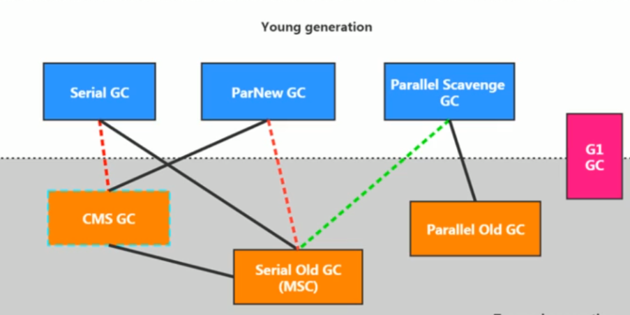
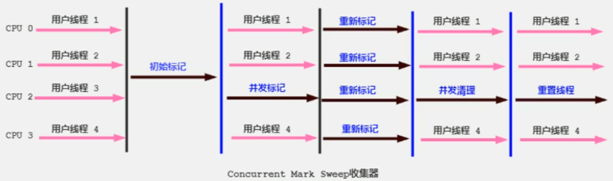

# 垃圾回收概述

jvm中垃圾回收针对于堆和方法区

其中, 堆是垃圾收集器工作的重点.

从次数上来讲:

频繁收集Young区; 较少收集Old区; 基本不动Perm区.

## 垃圾回收相关算法

### 标记阶段：引用计数算法

引用计数算法(Reference Counting)比较简单，对每个对象保存一个整型的**引用计数器属性。用于记录对象被引用的情况**。

对于一个对象A，只要有任何一个对象引用了A，则A的引用计数器就加1；当引用失效时，引用计数器就减1。只要对象A的引用计数器的值为0，即表示对象A不可能再被使用，可进行回收。

优点：
实现简单，垃圾对象便于辨识；判定效率高，回收没有延迟性。

缺点：

它需要单独的字段存储计数器，这样的做法增加了存储空间的开销。
每次赋值都需要更新计数器，伴随着加法和减法操作，这增加了时间开销。
引用计数器有一个严重的问题，即无法处理循环引用的情况。这是一条致命缺陷，
导致在Java的垃圾回收器中没有使用这类算法。

>  致命缺陷-无法处理循环引用 所以jvm没有采用此算法


### 标记阶段：可达性分析算法

目对于引用计数算法而言，可达性分析算法不仅同样具备实现简单和执收等特点，更重要的是该算法可以有效地解决在引用计数算法中循环的问题，防止内存泄漏的发生。

目较于引用计数算法，这里的可达性分析就是Java、C#选择的。这种类型的垃圾收集通常也叫作追踪性垃圾收集（Tracing Garbage
ollection）

所谓"GC Roots"根集合就是一组必须活跃的引用。

基本思路：

- 可达性分析算法是以根对象集合(GC Roots)为起始点，按照从上至下的方式搜索被根对象集合所连接的目标对象是否可达。
- 使用可达性分析算法后，内存中的存活对象都会被根对象集合直接或间接连接着，搜索所走过的路径称为引用链(Reference（
  Chain)
- 如果目标对象没有任何引用链相连，则是不可达的，就意味着该对象己经死亡，可以标记为垃圾对象。
- 在可达性分析算法中，，只有能够被根对象集合直接或者间接连接的对象才是存活对象。

### GC Roots

**因为在进行可达性分析必须在一个能保证一致性的快照中进行, 所以判断时需要STW(CMS和G1分别采用了增量更新和原始快照的方式在二次标记时才STW)**

GC Roots包括以下:

- 虚拟机栈中引用的对象. 比如：各个线程被调用的方法中使用到的参数、局部变量等。
- 本地方法栈内JNI(通常说的本地方法)引用的对象
- 方法区中类静态属性引用的对象. 比如：Java类的引用类型静态变量
- 方法区中常量引用的对象. 比如：字符串常量池（String Table）里的引用
- 所有被同步锁synchronized持有的对象
- Java虚拟机内部的引用。比如:  基本数据类型对应的Class对象，一些常驻的异常对象（如：NullPointerException、OutOfMemoryError），系统类加载器。
- 反映java虚拟机内部情况的JMXBean、JVMTI中注册的回调、本地代码缓存等。

简单理解：

**如果一个指针保存了堆内存里面的对象，但自己又不在堆中，它就是个root.**

### 对象终止（finalization）机制

Java语言提供了对象终止（finalization)机制允许开发人员提供对象被销毁之前的自定义处理逻辑。

当垃圾回收器发现没有引用指向一个对象，即：垃圾回收此对象之前，总会先调用这个对象的finalize()方法。

finalize()方法允许在子类中被重写，用于在对象被回收时进行资源释放。**通常在这个方法中进行一些资源释放和清理的工作**，比如关闭文件、套接字和数据库连接等。

永远不要主动调用某个对象的finalize()方法，应该交给垃圾回收机制调用。理由包括下面三点：
1.在finalize（）时可能会导致对象复活。
2.finalize（） 方法的执行时间是没有保障的，它完全由GC线程决定，极端情况下，若不发生GC，则finalize（）方法将没有执行机会。
3.一个糟糕的finalize()会严重影响GC的性能。

从功能上来说，finalize（）方法与C++中的析构函数比较相似，但是Java采用的是基于垃圾回收器的自动内存管理机制，所以finalize()方法在本质上不同于C++中的析构函数。

由于finalize()方法的存在，虚拟机中的对象一般处于三种可能的状态:

如果从所有的根节点都无法访问到某个对象，说明对象己经不再使用了。一般来说，此对象需要被回收。但事实上，也并非是“非死不可”的，这时候它们暂时处于“缓刑”阶段。一个无法触及的对象有可能在某个条件下"复活"自己，如果这样，那么对它的回收就是不合理的，为此，定义虚拟机中的对象可能的三种状态。如下：

- 可触及的：从根节点开始，可以到达这个对象。
- 可复活的：对象的所有引用都被释放，但是对象有可能在finalize()中复活。
- 不可触及的：对象的finalize()被调用，并且没有复活，那么就会进入不可触及状态。不可触及的对象不可能被复活，因为finalize(）只会被调用一次。


以上3种状态中，是由于finalize（）方法的存在，进行的区分。只有在对象不可触及时才可以被回收。

判定一个对象objA是否可回收，至少要经历两次标记过程：

1．如果对象objA到 GC Roots没有引用链，则进行第一次标记。

2．进行筛选，判断此对象是否有必要执行finalize（）方法
① 如果对象objA没有重写finalize()方法，或者finalize()方法已经被虚拟机调用过，则虚拟机视为“没有必要执行”，objA被判定为不可触及的。
② 如果对象objA重写了finalize(）方法，且还未执行过，那么objA会被插入到F-Queue队列中，由一个虚拟机自动创建的、低优先级的Finalizer线程触发其finalize（）方法执行。
③finalize(）方法是对象逃脱死亡的最后机会，稍后GC会对F-Queue队列中的对象进行第二次标记。如果objA在finalize(）方法中与引用链上的任何一个对象建立了联系，那么在第二次标记时，objA会被移出“即将回收”集合。之后，对象会再次出现没有引用存在的情况。在这个情况下，finalize方法不会被再次调用，对象会直接变成不可触及的状态，也就是说，一个对象的finalize方法只会被调用一次。

### 清除阶段：标记-清除算法

标记：利用GC Roots遍历, 通过设置对象的header标记记录为可达;

清除：清除header中没有标记可达的对象。

缺点:

效率不算高
在进行GC的时候，需要停止整个应用程序，导致用户体验差
这种方式清理出来的空闲内存是不连续的，产生内存碎片。需要维护一个空闲列表

> 注意：何为清除？
> 这里所谓的清除并不是真的置空，而是把需要清除的对象地址保存在空闲的地址列表里。下次有新对象需要加载时，判断垃圾的位置空间是否够，如果够，就存放。

### 清除阶段：复制算法

将内存空间分为两块，每次只使用其中一块，在垃圾回收时将正在使用的内存中的存活对象复制到未被使用的内存块中，之后清除正在使用的内存块中的所有对象，交换两个内存的角色，最后完成垃圾回收。

**适合于存活对象少，垃圾对象多的场景（新生代）**

优点：

没有标记和清除过程，实现简单，运行高效
复制过去以后保证空间的连续性，不会出现“碎片”问题。

缺点：

此算法的缺点也是很明显的，就是需要两倍的内存空间。
对于G1这种分拆成为大量region的GC，复制而不是移动，意味着**GC需要维护region之间对象引用关系**，不管是内存占用或者时间开销也不小。

特别的：

如果系统中的垃圾对象很多，复制算法需要复制的存活对象数量并不会太大，或者说非常低才行。


对于访问对象的两种方式：

1.句柄访问：局部变量表的引用指向句柄池里的到对象实例数据的指针，**复制算法中要改变句柄池**

2.直接访问：局部变量表的引用直接指向堆中对象实例数据，**复制算法要改变引用**

### 清除阶段：标记-整理算法

**过程**

第一阶段和标记清除算法一样，从根节点开始标记所有被引用对象

第二阶段将所有的存活对象压缩到内存的一端，按顺序排放。之后，清理边界外所有的空间

> 标记-压缩算法的最终效果等同于标记-清除算法执行完成后，再进行一次内存碎片整理，因此，也可以把它称为标记-清除-压缩(Mark-Sweep-Compact)算法。
>
> 二者的本质差异在于标记-清除算法是一种非移动式的回收算法，标记-压缩是移动式的。是否移动回收后的存活对象是一项优缺点并存的风险决策。
>
> 可以看到，标记的存活对象将会被整理，按照内存地址依次排列，而未被标记的内存会被清理掉。如此一来，当我们需要给新对象分配内存时，JVM只需要持有一个内存的起始地址即可(**指针碰撞**)，这比维护一个空闲列表显然少了许多开销。

优点：

消除了标记-清除算法当中，内存区域分散的缺点，我们需要给新对象分配内存时，JVM只需要持有一个内存的起始地址即可。

消除了复制算法当中，内存减半的高额代价。

缺点：

从效率上来说，标记-整理算法要低于复制算法。

移动对象的同时，如果对象被其他对象引用，则还需要调整引用的地址。

移动过程中，需要全程暂停用户应用程序。即：STW


### 分代收集算法

前面所有这些算法中，并没有一种算法可以完全替代其他算法，它们都具有自己独特的优势和特点。分代收集算法应运而生。

分代收集算法，是基于这样一个事实：不同的对象的生命周期是不一样的。因此，不同生命周期的对象可以采取不同的收集方式，以便提高回收效率。一般是把Java堆分为新生代和老年代，这样就可以根据各个年代的特点使用不同的
回收算法，以提高垃圾回收的效率。

在Java程序运行的过程中，会产生大量的对象，其中有些对象是与业务信息相关，比如Http请求中的Session对象、线程、Socket连接，这类对象跟业务直接挂钩，因此生命周期比较长。但是还有一些对象，主要是程序运行过程中生成的临时变量，这些对象生命周期会比较短，比如：String对象，由于其不变类的特性，系统会产生大量的这些对象，有些对象甚至只用一次即可回收。

**目前几乎所有的GC都是采用分代收集（Generational Collecting）算法执行垃圾回收的。**

在HotSpot中，基于分代的概念，GC所使用的内存回收算法必须结合年轻代和老年代各自的特
点:

**年轻代**(Young Gen)

年轻代特点：区域相对老年代较小，对象生命周期短、存活率低，回收频繁。

这种情况复制算法的回收整理，速度是最快的。**复制算法的效率只和当前存活对象大小有关**，因此很适用于年轻代的回收。而复制算法内存利用率不高的问题，通过hotspot中的两个survivor的设计得到缓解。

**老年代**(Tenured Gen)

老年代特点：区域较大，对象生命周期长、存活率高，回收不及年轻代频繁。

这种情况存在大量存活率高的对象，复制算法明显变得不合适。一般是由标记-清除或者是标记-清除与标记-整理的混合实现。


## 垃圾回收

在默认情况下，通过System.gc()或者Runtime.getRuntime().gc()的调用，会显式触发Full GC，同时对老年代和新生代进行回收，尝试释放被丢弃对象占用的内存。

然而System.gc()调用附带一个免责声明，无法保证对垃圾收集器的调用。

JVM实现者可以通过System.gc()调用来决定JVM的GC行为。而一般情况下，垃圾回收应该是自动进行的，无须手动触发，否则就太过于麻烦了。在一些特殊情况下，如我们正在编写一个性能基准，我们可以在运行之间调用System.gc()。

> System.runFinalization(); 可以强制调用失去引用的对象的finalize()方法

### 内存泄漏

内存泄漏指的是对象不会再被程序用到了，但是GC又不能回收他们的情况.

内存泄漏并不会立刻引起程序崩溃，但是一旦发生内存泄漏，程序中的可用内存就会被逐步蚕食，直至耗尽所有内存，最终出现OutOfMemory异常，导致程序崩溃。

**内存泄漏举例**

1、单例模式

单例的生命周期和应用程序是一样长的，所以单例程序中，如果持有对外部对象的引用的话，那么这个外部对象是不能被回收的，则会导致内存泄漏的产生。

2、一些提供close的资源未关闭导致内存泄漏

数据库连接（dataSourse.getConnection(）），网络连接(socket)和io连接必须手动close，否则是不能被回收的。

### Stop The World

Stop-the-World ，简称STW，指的是GC事件发生过程中，会产生应用程序的停顿。停顿产生时整个应用程序线程都会被暂停，没有任何响应，有点像卡死的感觉，这个停顿称为STW。

可达性分析算法中枚举根节点（GC Roots）会导致所有Java执行线程停顿。因为分析工作必须在一个能确保一致性的快照中进行, 如果出现分析过程中对象引用关系还在不断变化，则分析结果的准确性
无法保证
被STW中断的应用程序线程会在完成GC之后恢复，频繁中断会让用户感觉
像是网速不快造成电影卡带一样，所以我们需要减少STW的发生。

STW事件和采用哪款GC无关，所有的GC都有这个事件。

哪怕是Gl也不能完全避免Stop-the-world 情况发生，只能说垃圾回收器越来越优秀，回收效率越来越高，尽可能地缩短了暂停时间。

STW是JVM在后台自动发起和自动完成的。在用户不可见的情况下，把用户正常的工作线程全部停掉。

开发中不要用System.gc(）;会导致Stop-the-world的发生。

### 安全点和安全区域

**安全点**

程序执行时并非在所有地方都能停顿下来开始 GC，只有在特定的位置才能停顿下来开始GC，这些位置称为“安全点（Safepoint）

Safe Point的选择很重要，如果太少可能导致GC等待的时间太长，如果太频繁可能导致运行时的性能问题。大部分指令的执行时间都非常短暂，通常会根据“是否具有让程序长时间执行的特征”为标准。比如：选择些执行时间较长的指令作为Safe Point，如方法调用、循环跳转和异常跳转等。

如何在GC发生时，检查所有线程都跑到最近的安全点停顿下来呢？

**抢先式中断**：（目前没有虚拟机采用了）
首先中断所有线程。如果还有线程不在安全点，就恢复线程，让线程跑到安全点。

**主动式中断**：
设置一个中断标志，各个线程运行到Safe Point的时候主动轮询这个标志，如果中断标志为真，则将自己进行中断挂起。


**安全区域**

Safe point 机制保证了程序执行时，在不太长的时间内就会遇到可进入 GC的 Safe point
t 。但是，程序“不执行”的时候呢？例如线程处于 Sleep 状态或 Blocked 状态，这时候线程无法响应 JVM 的中断请求，
“走”到安全点去中断挂起，JVM 也不太可能等待线程被唤醒。对于这种情况，就需要安全区域（Safe Region）来解决。

安全区域是**指在一段代码片段中，对象的引用关系不会发生变化**，在这个区域中的任何位置开始GC都是安全的。我们也可以把 Safe Region 看做是被扩展了的 Safepoint。

实际执行时：
1、当线程运行到Safe Region的代码时，首先标识已经进入了Safe Region，如果这段时间内发生GC，JVM会忽略标识为Safe Region状态的线程；

2、当线程即将离开Safe Region时，会检查JVM是否已经完成GC，如果完成了，则继续运行，否则线程必须等待直到收到可以安全离开Safe Region的信号为止；

### 引用

Reference子类中只有终结器引用是包内可见的，其他3种引用类型均为public，可以在应用程序中直接使用

**强引用**（StrongReference） ：最传统的“引用”的定义，是指在程序代码之中普遍存在的引用赋值，即类似“Object obj=new Object(）"这种引用关系。无论任何情况下，只要强引用关系还存在，垃圾收集器就永远不会回收掉被引用的对象。

**软引用**（SoftReference）：在系统将要发生内存溢出之前，将会把这些对象列入回收范围之中进行第二次回收。如果这次回收后还没有足够的内存，才会抛出内存溢出异常。(通常用来实现内存敏感的缓存, 比如高速缓存)

**弱引用**（WeakReference）：被弱引用关联的对象只能生存到下一次垃圾收集之前。当垃圾收集器工作时，无论内存空间是否足够，都会回收掉被弱引用关联的对象。(可有可无的对象)

**虚引用**（PhantomReference）：一个对象是否有虚引用的存在，完全不会对其生存时间构成影响，也无法通过虚引用来获得一个对象的实例。为一个对象设置虚引用关联的唯一目的就是能在这个对象被收集器回收时收到一个系统通知。

> WeakHashMap:Entry继承自WeakReference，内存不足即回收，可用于缓存

# 垃圾回收器

**GC主要性能指标**

**吞吐量**：运行用户代码的时间占总运行时间的比例（总运行时间：程序的运行时间十内存回收的时间）

**暂停时间**：执行垃圾收集时, 程序的工作线程被暂停的时间。



```java
*  -XX:+PrintCommandLineFlags 查看命令行相关参数，包含使用的垃圾收集器
*
*  -XX:+UseSerialGC:表明新生代使用Serial GC ，同时老年代使用Serial Old GC
*
*  -XX:+UseParNewGC：标明新生代使用ParNew GC
*
*  jdk8默认
*  -XX:+UseParallelGC:表明新生代使用Parallel GC
*  -XX:+UseParallelOldGC : 表明老年代使用 Parallel Old GC
*  说明：二者可以相互激活
*
*  -XX:+UseConcMarkSweepGC：表明老年代使用CMS GC。同时，年轻代会触发对ParNew 的使用
*
*  jdk9默认 ,jdk8也提供了
*  -XX:+UseG1GC
```

## Serial回收器：串行回收

**新生代：复制算法**

**老年代：标记-压缩**


只在单个cpu的环境中存在优势, 因为没有线程交互的开销

## ParNew回收器：并行回收

**新生代：复制算法**

Serial GC的多线程版本

该收集器目前只配备了CMS老年代收集器

## **Parallel回收器：吞吐量优先**

**新生代：复制算法**

**老年代：标记-压缩**

HotSpot的年轻代中除了拥有ParNew收集器是基于并行回收的以外，Parallel Scavenge收集器同样也采用了复制算法、并行回收和"Stop
the World"机制。那么Parallel收集器的出现是否多此一举？

和ParNew收集器不同，**Parallel Scavenge收集器的目标则是达到一个可控制的吞吐量（Throughput）**，它也被称为吞吐量优先的垃圾收集器。

**自适应调节策略也是Parallel Scavenge与ParNew一个重要区别。**在该策略(默认开启)下，年轻代的大小、Eden和Survivor的比例、晋升老年代的对象年龄等参数会被自动调整，以达到在堆大小、吞吐量和停顿时间之间的平衡点。

> 高吞吐量可以高效率地利用 CPU 时间，尽快完成程序的运算任务，主要适合在后台运算而不需要太多交互的任务。因此，常见在服务器环境中使用。例如，那些执行批量处理、订单处理、工资支付、科学计算的应用程序。


## CMS回收器：低延迟

第一款并发收集器

**老年代：标记-清除**

CMS收集器的关注点是尽可能缩短垃圾收集时用户线程的停顿时间。停顿时间越短（低延迟）就越适合与用户交互的程序，良好的响应速度能提升用户体验。

目前很大一部分的Java应用集中在互联网站或者B/S系统的服务端上，这类应用尤其重视服务的响应速度，希望系统停顿时间最短，以给用户带来较好的体验, CMS收集器就非常符合这类应用的需求。



**初始标记**（Initial-Mark）阶段：在这个阶段中，程序中所有的工作线程都将会因为“Stop-the-World”机制而出现短暂的暂停，这个阶段的主要任务**仅仅只是标记出GC Roots能直接关联到的对象**。由于直接关联对象比较小，所以这里的速度非常快。

**并发标记**（Concurrent-Mark）阶段：从GC Roots的直接关联对象开始遍历整个对象图的过程，这个过程耗时较长但是不需要停顿用户线程，可以与垃圾收集线程一起并发运行。

**重新标记**（Remark）阶段：由于在并发标记阶段中，**程序的工作线程会和垃圾收集线程同时运行或者交叉运行，因此为了修正并发标记期间，因用户程序继续运作而导致标记产生变动的那一部分对象的标记记录**(CMS采用增量更新)，这个阶段的停顿时间通常会比初始标记阶段稍长一些，但也远比并发标记阶段的时间短。

**并发清除**（Concurrent-Sweep）阶段：此阶段清理删除掉标记阶段判断的已经死亡的对象，释放内存空间。由于不需要移动存活对象，所以这个阶段也是可以与用户线程同时并发的

> 由于最耗时间的并发标记与并发清除阶段都不需要暂停工作, 所以整体的回收是低停顿的

由于在垃圾收集阶段用户线程没有中断，所以在CMS回收过程中，还应该确保应用程序用户线程有足够的内存可用。因此，CMS收集器**不能像其他收集器那样等到老年代几乎完全被填满了再进行收集**，而是当堆内存使用率达到某一阈值时，便开始进行回收，以确保应用程序在CMS工作过程中依然有足够的空间支持应用程序运行。要是CMS运行期间**预留的内存无法满足程序需要**，就会出现一次“Concurrent Mode Failure失败，这时虚拟机将启动后备预案：**临时启用 Serial Old 收集器来重新进行老年代**的垃圾收集，这样停顿时间就很长了。

> 因为其采用的标记-清除算法会产生内存水平, 所以在分配新对象内存空间时, 只能选择**空闲列表**

## G1回收器：区域化分代式

G1的目标为**在延迟可控的情况下获得尽可能高的吞吐量**.

把堆内存分割为很多不相关的区域（Region）（物理上不连续的）。使用不同的Region来表示Eden、幸存者0区，幸存者1区，老年代等。
G1有计划地避免在整个Java 堆中进行全区域的垃圾收集。G1 跟踪各个 Region里面的垃圾堆积的价值大小（回收所获得的空间大小以及回收所需时间的经验值），在后台维护一个优先列表，每次根据允许的收集时间，优先回收价值最大的Region。

由于这种方式的侧重点在于回收垃圾最大量的区间（Region），所以我们给G1一个名字：垃圾优先（Garbage First）

> Region之间为**复制算法**, 而整体上可看做**标记-整理算法** , 都可以有效避免内存碎片过多而大对象无法找到连续空间分配而进行的GC, 有利于程序长时间运行.

**如何避免回收跨代引用对象**(其他分代收集器也需要考虑, 只是面向Region的G1更突出)?

解决方法：

- 无论G1还是其他分代收集器，JVM都是使用Remembered Set来避免全局扫描：
- 每个Region都有一个对应的Remembered Set；
- 每次Reference类型数据写操作时，都会产生一个Write Barrier暂时中断操作；
- 然后**检查将要写入的引用指向的对象是否和该Reference类型数据在不同的Region**（其他收集器：检查老年代对象是否引用了新生代对象）；
- 如果不同，通过CardTable(记忆集的实现)**把相关引用信息记录到引用指向对象的所在Region对应的Remembered Set中**；
- 当进行垃圾收集时，**在GC根节点的枚举范围加入Remembered Set**；就可以保证不进行全局扫描，也不会有遗漏。


