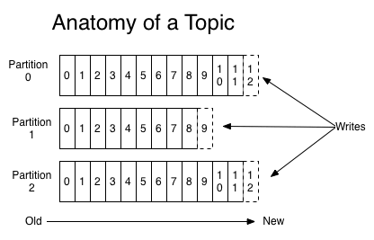
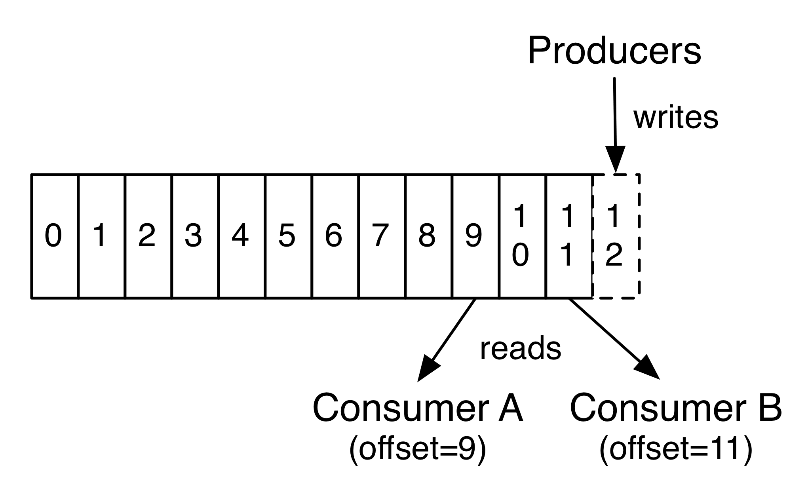
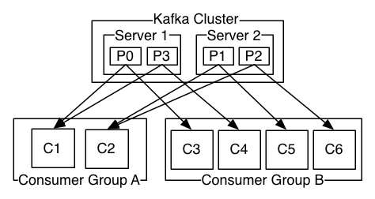

MQ全称为Message Queue，消息队列是应用程序和应用程序之间的通信方法。

**为什么使用MQ ？**

在项目中，可将一些无需即时返回且耗时的操作提取出来，进行异步处理，而这种异步处理的方式大大的节省 了服务器的请求响应时间，从而提高了系统的吞吐量。 

**开发中消息队列通常有如下应用场景**： 

1、任务异步处理 将不需要同步处理的并且耗时长的操作由消息队列通知消息接收方进行异步处理。提高了应用程序的响应时 间。 

2、应用程序解耦合 MQ相当于一个中介，生产方通过MQ与消费方交互，它将应用程序进行解耦合

MQ是消息通信的模型；

实现MQ的大致有两种主流方式：

AMQP:AMQP是一种协议，更准确的说是一种binary wire-level protocol（链接协议）。这是其和JMS的本质差别，AMQP 不从API层进行限定，而是直接定义网络交换的数据格式。

JMS:JMS即Java消息服务（JavaMessage Service）应用程序接口，是一个Java平台中关于面向消息中间件（MOM）的 API，用于在两个应用程序之间，或分布式系统中发送消息，进行异步通信。

区别:

1.JMS是定义了统一的接口，来对消息操作进行统一；AMQP是通过规定协议来统一数据交互的格式

2.JMS限定了必须使用Java语言；AMQP只是协议，不规定实现方式，因此是跨语言的。

3.JMS规定了两种消息模式；而AMQP的消息模式更加丰富

```
ActiveMQ：基于JMS
ZeroMQ：基于C语言开发
RabbitMQ：基于AMQP协议，erlang语言开发，稳定性好
RocketMQ：基于JMS，阿里巴巴产品
Kafka：类似MQ的产品；分布式消息系统，高吞吐量
```


# RabbitMQ

```
<dependency>
        <groupId>org.springframework.boot</groupId>
        <artifactId>spring-boot-starter-amqp</artifactId>
    </dependency>
```


```
spring.rabbitmq.host=localhost
spring.rabbitmq.port=5672
spring.rabbitmq.username=spring
spring.rabbitmq.password=123456
```

## win安装

https://www.erlang.org/downloads

配置erlang环境变量

https://www.rabbitmq.com/install-windows.html

注意erlang和rabbitmq版本对应。

安装完erlang服务设置手动启动。

插件安装：
在rabbitmq安装目录的sbin下管理员执行：

```
 rabbitmq-plugins.bat enable rabbitmq_management
```

打开浏览器访问网站http://localhost:15672进入登录页面，默认账号和密码都为guest

##  Virtual Hosts

像mysql拥有数据库的概念并且可以指定用户对库和表等操作的权限。RabbitMQ也有类似的权限管理；在RabbitMQ 中可以虚拟消息服务器Virtual Host，每个Virtual Hosts相当于一个相对独立的RabbitMQ服务器，每个VirtualHost 之间是相互隔离的。exchange、queue、message不能互通。

 **相当于mysql的db。Virtual Name一般以/开头**。

设置步骤:


## 工作模式

https://www.rabbitmq.com/getstarted.html


## 简单使用

**Sender**

```
@Component
public class Sender {

    @Autowired
    private AmqpTemplate rabbitTemplate;

    public void send() {
        String context = "hello " + new Date();
        System.out.println("Sender : " + context);
        this.rabbitTemplate.convertAndSend("hello", context);
    }
}
```

**Receiver**

```
@Component
@RabbitListener(queues = "hello")
public class Receiver {

    @RabbitHandler
    public void process(String hello) {
        System.out.println("Receiver : " + hello);
    }
}
```

**config**

```
@Configuration
public class RabbitConfig {

    @Bean
    public Queue helloQueue() {
        return new Queue("hello");
    }

}
```

**测试**

```
@SpringBootApplication
public class HelloApplication {

    public static void main(String[] args) {
        SpringApplication.run(HelloApplication.class, args);
    }

}

@RunWith(SpringJUnit4ClassRunner.class)
@SpringApplicationConfiguration(classes = HelloApplication.class)
public class HelloApplicationTests {

    @Autowired
    private Sender sender;

    @Test
    public void hello() throws Exception {
        sender.send();
    }

}
```

## 交换机模式

```
@Configuration
public class RabbitConfig {
    @Bean
    public Queue updateDbQueue() {
        return new Queue("UPDATE-DB-QUEUE", true);
    }

    @Bean
    public Queue updateEsQueue() {
        return new Queue("UPDATE-ES-QUEUE", true);
    }

    @Bean
    public FanoutExchange addVisitExchange() {
        return new FanoutExchange("ADD-BOOK-VISIT-EXCHANGE");
    }


    @Bean
    public Binding updateEsBinding() {
        return BindingBuilder.bind(updateEsQueue()).to(addVisitExchange());
    }

    @Bean
    public Binding updateDbBinding() {
        return BindingBuilder.bind(updateDbQueue()).to(addVisitExchange());
    }

}
```

```
@Component
@Slf4j
@RequiredArgsConstructor
public class BookVisitAddListener {

    @RabbitListener(queues = {"UPDATE-DB-QUEUE"})
    public void updateDb(Long bookId, Channel channel, Message message) {
    }

    @RabbitListener(queues = {"UPDATE-ES-QUEUE"})
    public void updateEs(Long bookId, Channel channel, Message message) {
		//...
    }
}
```

```
@Autowired
private final RabbitTemplate rabbitTemplate;

rabbitTemplate.convertAndSend("ADD-BOOK-VISIT-EXCHANGE", null, bookId);
```


# RocketMQ

```
<dependency>
    <groupId>org.apache.rocketmq</groupId>
    <artifactId>rocketmq-spring-boot-starter</artifactId>
    <version>${rocketmq.version}</version>
</dependency>
```

## 简单使用

### producer

```
import com.baeldung.rocketmq.event.CartItemEvent;
import org.apache.rocketmq.spring.core.RocketMQTemplate;
import org.springframework.beans.factory.annotation.Autowired;
import org.springframework.boot.CommandLineRunner;
import org.springframework.boot.SpringApplication;
import org.springframework.boot.autoconfigure.SpringBootApplication;

@SpringBootApplication
public class CartEventProducer implements CommandLineRunner {
    @Autowired
    private RocketMQTemplate rocketMQTemplate;

    public static void main(String[] args) {
        SpringApplication.run(CartEventProducer.class, args);
    }

    public void run(String... args) throws Exception {
        rocketMQTemplate.convertAndSend("cart-item-add-topic", new CartItemEvent("bike", 1));
        rocketMQTemplate.convertAndSend("cart-item-add-topic", new CartItemEvent("computer", 2));
        rocketMQTemplate.convertAndSend("cart-item-removed-topic", new CartItemEvent("bike", 1));
    }
}
```

### comsumer

```
@SpringBootApplication
public class CartEventConsumer {

    public static void main(String[] args) {
        SpringApplication.run(CartEventConsumer.class, args);
    }

    @Service
    @RocketMQMessageListener(topic = "cart-item-add-topic", consumerGroup = "cart-consumer_cart-item-add-topic")
    public class CardItemAddConsumer implements RocketMQListener<CartItemEvent> {
        public void onMessage(CartItemEvent addItemEvent) {
            System.out.println("Adding item: " + addItemEvent);
            // logic
        }
    }

    @Service
    @RocketMQMessageListener(topic = "cart-item-removed-topic", consumerGroup = "cart-consumer_cart-item-removed-topic")
    public class CardItemRemoveConsumer implements RocketMQListener<CartItemEvent> {
        public void onMessage(CartItemEvent removeItemEvent) {
            System.out.println("Removing item: " + removeItemEvent);
            // logic
        }
    }
}
```

### RocketMQLocalTransactionListener

```
@RocketMQTransactionListener(txProducerGroup = "test-transaction")
class TransactionListenerImpl implements RocketMQLocalTransactionListener {
    @Override
    public RocketMQLocalTransactionState executeLocalTransaction(Message msg, Object arg) {
        // ... local transaction process, return ROLLBACK, COMMIT or UNKNOWN
        return RocketMQLocalTransactionState.UNKNOWN;
    }

    @Override
    public RocketMQLocalTransactionState checkLocalTransaction(Message msg) {
        // ... check transaction status and return ROLLBACK, COMMIT or UNKNOWN
        return RocketMQLocalTransactionState.COMMIT;
    }
}
```

# Kafka

Kafka是一个分布式的、可分区的、可复制的消息系统，下面是Kafka的几个基本术语：

1. Kafka将消息以**topic**为单位进行归纳；
2. 将向Kafka topic发布消息的程序成为**producers**；
3. 将预订topics并消费消息的程序成为**consumer**；
4. Kafka以集群的方式运行，可以由一个或多个服务组成，每个服务叫做一个**broker**。

producers通过网络将消息发送到Kafka集群，集群向消费者提供消息.

创建一个topic时，可以指定**partitions**（分区）数目，partitions数越多，其吞吐量也越大，但是需要的资源也越多，同时也会导致更高的不可用性，kafka在接收到producers发送的消息之后，会根据均衡策略将消息存储到不同的partitions中：



在每个partitions中，消息以顺序存储，最晚接收的的消息会最后被消费。

producers在向kafka集群发送消息的时候，可以通过指定partitions来发送到指定的partitions中。也可以通过指定均衡策略来将消息发送到不同的partitions中。如果不指定，就会采用默认的随机均衡策略，将消息随机的存储到不同的partitions中。

在consumer消费消息时，kafka使用offset来记录当前消费的位置：



在kafka的设计中，可以有多个不同的group来同时消费同一个topic下的消息，如图，我们有两个不同的group同时消费，他们的的消费的记录位置offset各不项目，不互相干扰。

对于一个group而言，consumer的数量不应该多于partitions的数量，因为在一个group中，每个partitions至多只能绑定到一个consumer上，即一个consumer可以消费多个partitions，一个partitions只能给一个consumer消费。因此，若一个group中的consumer数量大于partitions数量的话，多余的consumer将不会收到任何消息。



## Kafka安装使用

这里演示在Windows下Kafka安装与使用。Kafka下载地址：http://kafka.apache.org/downloads，选择二进制文件下载（Binary downloads），然后解压即可。

Kafka的配置文件位于config目录下，因为Kafka集成了Zookeeper（Kafka存储消息的地方），所以config目录下除了有Kafka的配置文件server.properties外，还可以看到一个Zookeeper配置文件zookeeper.properties.

打开server.properties，将`broker.id`的值修改为1，每个broker的id都必须设置为Integer类型，且不能重复。Zookeeper的配置保持默认即可。

**启动Zookeeper**

在Windows下执行下面这些命令可能会出现找不到或无法加载主类的问题，解决方案可参考：https://blog.csdn.net/cx2932350/article/details/78870135。

在Kafka根目录下使用cmd执行下面这条命令，启动ZK：

```
bin\windows\zookeeper-server-start.bat config\zookeeper.properties
```

在Linux下，可以使用后台进程的方式启动ZK：

```
bin/zookeeper-server-start.sh -daemon config/zookeeper.properties
```

**启动Kafka**

执行下面这条命令启动Kafka：

```
bin\windows\kafka-server-start.bat config\server.properties
```

Linux对应命令：

```
bin/kafka-server-start.sh config/server.properties
```

**创建Topic**

执行下面这条命令创建一个Topic

```
bin\windows\kafka-topics.bat --create --zookeeper localhost:2181 --replication-factor 1 --partitions 1 --topic test
```

这条命令的意思是，创建一个Topic到ZK（指定ZK的地址），副本个数为1，分区数为1，Topic的名称为test。

Linux对应的命令为:

```
bin/kafka-topics.sh --create --zookeeper localhost:2181 --replication-factor 1 --partitions 1 --topic test
```

创建好后我们可以查看Kafka里的Topic列表：

```
bin\windows\kafka-topics.bat --list --zookeeper localhost:2181
```

可看到目前只包含一个我们刚创建的test Topic。

Linux对应的命令为：

```
bin/kafka-topics.sh --list --zookeeper localhost:2181
```

**查看Topic的具体信息：**

```
bin\windows\kafka-topics.bat --describe --zookeeper localhost:2181 --topic test
```

Linux对应的命令为：

```
bin/kafka-topics.sh --describe --zookeeper localhost:2181 --topic test
```

**启动Producers**

```
bin\windows\kafka-console-producer.bat --broker-list localhost:9092 --topic test
```

9092为生产者的默认端口号。这里启动了生产者，准备往test Topic里发送数据。

Linux下对应的命令为：

```
bin/kafka-console-producer.sh --broker-list localhost:9092 --topic test
```

**启动Consumers**

接着启动一个消费者用于消费生产者生产的数据，新建一个cmd窗口，输入下面这条命令：

```
bin\windows\kafka-console-consumer.bat --bootstrap-server localhost:9092 --topic test --from-beginning
```

`from-beginning`表示从头开始读取数据。

Linux下对应的命令为：

```
bin/kafka-console-consumer.sh --bootstrap-server localhost:9092 --topic test --from-beginning
```

## 简单使用

```
<dependency>
    <groupId>org.springframework.kafka</groupId>
    <artifactId>spring-kafka</artifactId>
</dependency>
```

### 生产者配置

```
@Configuration
public class KafkaProducerConfig {
    @Value("${spring.kafka.bootstrap-servers}")
    private String bootstrapServers;
    @Bean
    public ProducerFactory<String, String> producerFactory() {
        Map<String, Object> configProps = new HashMap<>();
        configProps.put(
                ProducerConfig.BOOTSTRAP_SERVERS_CONFIG,
                bootstrapServers);
        configProps.put(
                ProducerConfig.KEY_SERIALIZER_CLASS_CONFIG,
                StringSerializer.class);
        configProps.put(
                ProducerConfig.VALUE_SERIALIZER_CLASS_CONFIG,
                StringSerializer.class);
        return new DefaultKafkaProducerFactory<>(configProps);
    }
    @Bean
    public KafkaTemplate<String, String> kafkaTemplate() {
        return new KafkaTemplate<>(producerFactory());
    }
}
```

首先我们配置了一个`producerFactory`，方法里配置了Kafka Producer实例的策略。`bootstrapServers`为Kafka生产者的地址，我们在配置文件application.yml里配置它：

```
spring:
  kafka:
    bootstrap-servers: localhost:9092
```

`ProducerConfig.KEY_SERIALIZER_CLASS_CONFIG`和`ProducerConfig.VALUE_SERIALIZER_CLASS_CONFIG`指定了key，value序列化策略，这里指定为Kafka提供的`StringSerializer`，因为我们暂时只发送简单的String类型的消息。

接着我们使用`producerFactory`配置了`kafkaTemplate`，其包含了发送消息的便捷方法，后面我们就用这个对象来发送消息。

**发布消息**

```
@RestController
public class SendMessageController {
    @Autowired
    private KafkaTemplate<String, String> kafkaTemplate;
    @GetMapping("send/{message}")
    public void send(@PathVariable String message) {
        this.kafkaTemplate.send("test", message);  //test为Topic的名称,需要先创建topic
    }
}
```

`send`方法是一个异步方法，我们可以通过回调的方式来确定消息是否发送成功,我们改造`SendMessageController`：

```
@RestController
public class SendMessageController {
    private Logger logger = LoggerFactory.getLogger(this.getClass());
    @Autowired
    private KafkaTemplate<String, String> kafkaTemplate;
    @GetMapping("send/{message}")
    public void send(@PathVariable String message) {
        ListenableFuture<SendResult<String, String>> future = this.kafkaTemplate.send("test", message);
        future.addCallback(new ListenableFutureCallback<SendResult<String, String>>() {
            @Override
            public void onSuccess(SendResult<String, String> result) {
                logger.info("成功发送消息：{}，offset=[{}]", message, result.getRecordMetadata().offset());
            }

            @Override
            public void onFailure(Throwable ex) {
                logger.error("消息：{} 发送失败，原因：{}", message, ex.getMessage());
            }
        });
    }
}
```

### 消费者配置

```
@EnableKafka
@Configuration
public class KafkaConsumerConfig {

    @Value("${spring.kafka.bootstrap-servers}")
    private String bootstrapServers;

    @Value("${spring.kafka.consumer.group-id}")
    private String consumerGroupId;

    @Value("${spring.kafka.consumer.auto-offset-reset}")
    private String autoOffsetReset;

    @Bean
    public ConsumerFactory<String, String> consumerFactory() {
        Map<String, Object> props = new HashMap<>();
        props.put(
                ConsumerConfig.BOOTSTRAP_SERVERS_CONFIG,
                bootstrapServers);
        props.put(
                ConsumerConfig.GROUP_ID_CONFIG,
                consumerGroupId);
        props.put(
                ConsumerConfig.AUTO_OFFSET_RESET_CONFIG,
                autoOffsetReset);
        props.put(
                ConsumerConfig.KEY_DESERIALIZER_CLASS_CONFIG,
                StringDeserializer.class);
        props.put(
                ConsumerConfig.VALUE_DESERIALIZER_CLASS_CONFIG,
                StringDeserializer.class);
        return new DefaultKafkaConsumerFactory<>(props);
    }

    @Bean
    public ConcurrentKafkaListenerContainerFactory<String, String> kafkaListenerContainerFactory() {
        ConcurrentKafkaListenerContainerFactory<String, String> factory
                = new ConcurrentKafkaListenerContainerFactory<>();
        factory.setConsumerFactory(consumerFactory());
        return factory;
    }
}
```

```
spring:
  kafka:
    consumer:
      group-id: test-consumer
      auto-offset-reset: latest
```

其中`group-id`将消费者进行分组（也可以不进行分组），组名为`test-consumer`，并指定了消息读取策略，包含四个可选值：

- earliest:当各分区下有已提交的offset时，从提交的offset开始消费；无提交的offset时，从头开始消费
- latest:当各分区下有已提交的offset时，从提交的offset开始消费；无提交的offset时，消费新产生的该分区下的数据
- none:topic各分区都存在已提交的offset时，从offset后开始消费；只要有一个分区不存在已提交的offset，则抛出异常
- exception:直接抛出异常

在`KafkaConsumerConfig`中配置了`ConsumerFactory`和`KafkaListenerContainerFactory`后，我们便可以使用`@KafkaListener`注解来监听消息了。

配置类上需要`@EnableKafka`注释才能在Spring托管Bean上检测`@KafkaListener`注解。

```
@Component
public class KafkaMessageListener {
    private Logger logger = LoggerFactory.getLogger(this.getClass());
    @KafkaListener(topics = "test", groupId = "test-consumer")
    public void listen(String message) {
        logger.info("接收消息: {}", message);
    }
}
```

## @KafkaListener

`@KafkaListener`除了可以指定Topic名称和分组id外，我们还可以同时监听来自多个Topic的消息:

```
@KafkaListener(topics = "topic1, topic2")
```

我们还可以通过`@Header`注解来获取当前消息来自哪个分区（partitions）:

```
@KafkaListener(topics = "test", groupId = "test-consumer")
public void listen(@Payload String message,
                   @Header(KafkaHeaders.RECEIVED_PARTITION_ID) int partition) {
    logger.info("接收消息: {}，partition：{}", message, partition);
}
```

当没有进行分区时,kafka只有一个区，下标为0。

指定只接收来自特定分区的消息：

```
@KafkaListener(groupId = "test-consumer",
        topicPartitions = @TopicPartition(topic = "test",
                partitionOffsets = {
                        @PartitionOffset(partition = "0", initialOffset = "0")
            }))
public void listen(@Payload String message,
                   @Header(KafkaHeaders.RECEIVED_PARTITION_ID) int partition) {
    logger.info("接收消息: {}，partition：{}", message, partition);
}
```

如果不需要指定`initialOffset`，上面代码可以简化为：

```
@KafkaListener(groupId = "test-consumer", 
	topicPartitions = @TopicPartition(topic = "test", partitions = { "0", "1" }))
```

## 消息过滤器

添加过滤器,配置过滤规则来过滤一些特定的信息.

在消费者配置类`KafkaConsumerConfig`的`kafkaListenerContainerFactory`方法里配置

```
@Bean
public ConcurrentKafkaListenerContainerFactory<String, String> kafkaListenerContainerFactory() {
    ConcurrentKafkaListenerContainerFactory<String, String> factory
            = new ConcurrentKafkaListenerContainerFactory<>();
    factory.setConsumerFactory(consumerFactory());
    // ------- 过滤配置 --------
    factory.setRecordFilterStrategy(
            r -> r.value().contains("fuck")
    );
    return factory;
}
```

如果消息内容包含`fuck`这个粗鄙之语的时候，则不接受消息。

## 消息转换器

自定义消息转换器来发送复杂的消息

**定义消息实体**

创建一个Message类：

```
public class Message implements Serializable {
    private static final long serialVersionUID = 6678420965611108427L;
    private String from;
    private String message;
    public Message() {
    	
    }
    public Message(String from, String message) {
        this.from = from;
        this.message = message;
    }
    @Override
    public String toString() {
        return "Message{" +
                "from='" + from + '\'' +
                ", message='" + message + '\'' +
                '}';
    }
    // get set 略
}
```

**生产者配置**

将value序列化策略指定为了Kafka提供的`JsonSerializer`，并且kafkaTemplate返回类型为`KafkaTemplate<String, Message>`。

```
@Configuration
public class KafkaProducerConfig {
    @Value("${spring.kafka.bootstrap-servers}")
    private String bootstrapServers;
    @Bean
    public ProducerFactory<String, Message> producerFactory() {
        Map<String, Object> configProps = new HashMap<>();
        configProps.put(
                ProducerConfig.BOOTSTRAP_SERVERS_CONFIG,
                bootstrapServers);
        configProps.put(
                ProducerConfig.KEY_SERIALIZER_CLASS_CONFIG,
                StringSerializer.class);
        configProps.put(
                ProducerConfig.VALUE_SERIALIZER_CLASS_CONFIG,
                JsonSerializer.class);
        return new DefaultKafkaProducerFactory<>(configProps);
    }
    @Bean
    public KafkaTemplate<String, Message> kafkaTemplate() {
        return new KafkaTemplate<>(producerFactory());
    }
}
```

```
@Autowired
private KafkaTemplate<String, Message> kafkaTemplate;
@GetMapping("send/{message}")
public void sendMessage(@PathVariable String message) {
    this.kafkaTemplate.send("test", new Message("mrbird", message));
}
```

**消费者配置**

```
@EnableKafka
@Configuration
public class KafkaConsumerConfig {

    @Value("${spring.kafka.bootstrap-servers}")
    private String bootstrapServers;

    @Value("${spring.kafka.consumer.group-id}")
    private String consumerGroupId;

    @Value("${spring.kafka.consumer.auto-offset-reset}")
    private String autoOffsetReset;

    @Bean
    public ConsumerFactory<String, Message> consumerFactory() {
        Map<String, Object> props = new HashMap<>();
        props.put(
                ConsumerConfig.BOOTSTRAP_SERVERS_CONFIG,
                bootstrapServers);
        props.put(
                ConsumerConfig.GROUP_ID_CONFIG,
                consumerGroupId);
        props.put(
                ConsumerConfig.AUTO_OFFSET_RESET_CONFIG,
                autoOffsetReset);
        return new DefaultKafkaConsumerFactory<>(
                props,
                new StringDeserializer(),
                new JsonDeserializer<>(Message.class));
    }

    @Bean
    public ConcurrentKafkaListenerContainerFactory<String, Message> kafkaListenerContainerFactory() {
        ConcurrentKafkaListenerContainerFactory<String, Message> factory
                = new ConcurrentKafkaListenerContainerFactory<>();
        factory.setConsumerFactory(consumerFactory());
        return factory;
    }
}
```

```
@KafkaListener(topics = "test", groupId = "test-consumer")
public void listen(Message message) {
    logger.info("接收消息: {}", message);
}
```

## Kafka所有配置选项

```
spring.kafka.admin.client-id= # ID to pass to the server when making requests. Used for server-side logging.
spring.kafka.admin.fail-fast=false # Whether to fail fast if the broker is not available on startup.
spring.kafka.admin.properties.*= # Additional admin-specific properties used to configure the client.
spring.kafka.admin.ssl.key-password= # Password of the private key in the key store file.
spring.kafka.admin.ssl.key-store-location= # Location of the key store file.
spring.kafka.admin.ssl.key-store-password= # Store password for the key store file.
spring.kafka.admin.ssl.key-store-type= # Type of the key store.
spring.kafka.admin.ssl.protocol= # SSL protocol to use.
spring.kafka.admin.ssl.trust-store-location= # Location of the trust store file.
spring.kafka.admin.ssl.trust-store-password= # Store password for the trust store file.
spring.kafka.admin.ssl.trust-store-type= # Type of the trust store.
spring.kafka.bootstrap-servers= # Comma-delimited list of host:port pairs to use for establishing the initial connections to the Kafka cluster. Applies to all components unless overridden.
spring.kafka.client-id= # ID to pass to the server when making requests. Used for server-side logging.
spring.kafka.consumer.auto-commit-interval= # Frequency with which the consumer offsets are auto-committed to Kafka if 'enable.auto.commit' is set to true.
spring.kafka.consumer.auto-offset-reset= # What to do when there is no initial offset in Kafka or if the current offset no longer exists on the server.
spring.kafka.consumer.bootstrap-servers= # Comma-delimited list of host:port pairs to use for establishing the initial connections to the Kafka cluster. Overrides the global property, for consumers.
spring.kafka.consumer.client-id= # ID to pass to the server when making requests. Used for server-side logging.
spring.kafka.consumer.enable-auto-commit= # Whether the consumer's offset is periodically committed in the background.
spring.kafka.consumer.fetch-max-wait= # Maximum amount of time the server blocks before answering the fetch request if there isn't sufficient data to immediately satisfy the requirement given by "fetch-min-size".
spring.kafka.consumer.fetch-min-size= # Minimum amount of data the server should return for a fetch request.
spring.kafka.consumer.group-id= # Unique string that identifies the consumer group to which this consumer belongs.
spring.kafka.consumer.heartbeat-interval= # Expected time between heartbeats to the consumer coordinator.
spring.kafka.consumer.key-deserializer= # Deserializer class for keys.
spring.kafka.consumer.max-poll-records= # Maximum number of records returned in a single call to poll().
spring.kafka.consumer.properties.*= # Additional consumer-specific properties used to configure the client.
spring.kafka.consumer.ssl.key-password= # Password of the private key in the key store file.
spring.kafka.consumer.ssl.key-store-location= # Location of the key store file.
spring.kafka.consumer.ssl.key-store-password= # Store password for the key store file.
spring.kafka.consumer.ssl.key-store-type= # Type of the key store.
spring.kafka.consumer.ssl.protocol= # SSL protocol to use.
spring.kafka.consumer.ssl.trust-store-location= # Location of the trust store file.
spring.kafka.consumer.ssl.trust-store-password= # Store password for the trust store file.
spring.kafka.consumer.ssl.trust-store-type= # Type of the trust store.
spring.kafka.consumer.value-deserializer= # Deserializer class for values.
spring.kafka.jaas.control-flag=required # Control flag for login configuration.
spring.kafka.jaas.enabled=false # Whether to enable JAAS configuration.
spring.kafka.jaas.login-module=com.sun.security.auth.module.Krb5LoginModule # Login module.
spring.kafka.jaas.options= # Additional JAAS options.
spring.kafka.listener.ack-count= # Number of records between offset commits when ackMode is "COUNT" or "COUNT_TIME".
spring.kafka.listener.ack-mode= # Listener AckMode. See the spring-kafka documentation.
spring.kafka.listener.ack-time= # Time between offset commits when ackMode is "TIME" or "COUNT_TIME".
spring.kafka.listener.client-id= # Prefix for the listener's consumer client.id property.
spring.kafka.listener.concurrency= # Number of threads to run in the listener containers.
spring.kafka.listener.idle-event-interval= # Time between publishing idle consumer events (no data received).
spring.kafka.listener.log-container-config= # Whether to log the container configuration during initialization (INFO level).
spring.kafka.listener.monitor-interval= # Time between checks for non-responsive consumers. If a duration suffix is not specified, seconds will be used.
spring.kafka.listener.no-poll-threshold= # Multiplier applied to "pollTimeout" to determine if a consumer is non-responsive.
spring.kafka.listener.poll-timeout= # Timeout to use when polling the consumer.
spring.kafka.listener.type=single # Listener type.
spring.kafka.producer.acks= # Number of acknowledgments the producer requires the leader to have received before considering a request complete.
spring.kafka.producer.batch-size= # Default batch size.
spring.kafka.producer.bootstrap-servers= # Comma-delimited list of host:port pairs to use for establishing the initial connections to the Kafka cluster. Overrides the global property, for producers.
spring.kafka.producer.buffer-memory= # Total memory size the producer can use to buffer records waiting to be sent to the server.
spring.kafka.producer.client-id= # ID to pass to the server when making requests. Used for server-side logging.
spring.kafka.producer.compression-type= # Compression type for all data generated by the producer.
spring.kafka.producer.key-serializer= # Serializer class for keys.
spring.kafka.producer.properties.*= # Additional producer-specific properties used to configure the client.
spring.kafka.producer.retries= # When greater than zero, enables retrying of failed sends.
spring.kafka.producer.ssl.key-password= # Password of the private key in the key store file.
spring.kafka.producer.ssl.key-store-location= # Location of the key store file.
spring.kafka.producer.ssl.key-store-password= # Store password for the key store file.
spring.kafka.producer.ssl.key-store-type= # Type of the key store.
spring.kafka.producer.ssl.protocol= # SSL protocol to use.
spring.kafka.producer.ssl.trust-store-location= # Location of the trust store file.
spring.kafka.producer.ssl.trust-store-password= # Store password for the trust store file.
spring.kafka.producer.ssl.trust-store-type= # Type of the trust store.
spring.kafka.producer.transaction-id-prefix= # When non empty, enables transaction support for producer.
spring.kafka.producer.value-serializer= # Serializer class for values.
spring.kafka.properties.*= # Additional properties, common to producers and consumers, used to configure the client.
spring.kafka.ssl.key-password= # Password of the private key in the key store file.
spring.kafka.ssl.key-store-location= # Location of the key store file.
spring.kafka.ssl.key-store-password= # Store password for the key store file.
spring.kafka.ssl.key-store-type= # Type of the key store.
spring.kafka.ssl.protocol= # SSL protocol to use.
spring.kafka.ssl.trust-store-location= # Location of the trust store file.
spring.kafka.ssl.trust-store-password= # Store password for the trust store file.
spring.kafka.ssl.trust-store-type= # Type of the trust store.
spring.kafka.streams.application-id= # Kafka streams application.id property; default spring.application.name.
spring.kafka.streams.auto-startup=true # Whether or not to auto-start the streams factory bean.
spring.kafka.streams.bootstrap-servers= # Comma-delimited list of host:port pairs to use for establishing the initial connections to the Kafka cluster. Overrides the global property, for streams.
spring.kafka.streams.cache-max-size-buffering= # Maximum memory size to be used for buffering across all threads.
spring.kafka.streams.client-id= # ID to pass to the server when making requests. Used for server-side logging.
spring.kafka.streams.properties.*= # Additional Kafka properties used to configure the streams.
spring.kafka.streams.replication-factor= # The replication factor for change log topics and repartition topics created by the stream processing application.
spring.kafka.streams.ssl.key-password= # Password of the private key in the key store file.
spring.kafka.streams.ssl.key-store-location= # Location of the key store file.
spring.kafka.streams.ssl.key-store-password= # Store password for the key store file.
spring.kafka.streams.ssl.key-store-type= # Type of the key store.
spring.kafka.streams.ssl.protocol= # SSL protocol to use.
spring.kafka.streams.ssl.trust-store-location= # Location of the trust store file.
spring.kafka.streams.ssl.trust-store-password= # Store password for the trust store file.
spring.kafka.streams.ssl.trust-store-type= # Type of the trust store.
spring.kafka.streams.state-dir= # Directory location for the state store.
spring.kafka.template.default-topic= # Default topic to which messages are sent.
```

