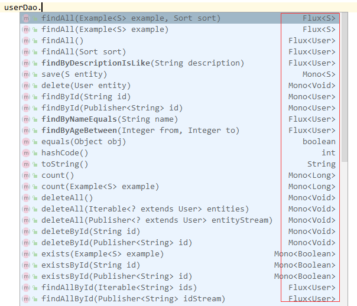

# 请求参数校验

Bean Validation是Java定义的一套基于注解的数据校验规范，目前已经从JSR 303的1.0版本升级到JSR 349的1.1版本，再到JSR 380的2.0版本（2.0完成于2017.08），已经经历了三个版本 。需要注意的是，JSR只是一项标准，它规定了一些校验注解的规范，但没有实现，比如@Null、@NotNull、@Pattern等，它们位于 javax.validation.constraints这个包下。而hibernate validator是对这个规范的实现，并增加了一些其他校验注解，如 @NotBlank、@NotEmpty、@Length等，它们位于org.hibernate.validator.constraints这个包下。

```
spring-boot 项目已经集成在starter-web中
<dependency>
    <groupId>org.hibernate.validator</groupId>
    <artifactId>hibernate-validator</artifactId>
    <version>6.0.8.Final</version>
</dependency>
```

1.单参数校验

单参数校验就是controller接口按照单参数接收前端传值，没有封装对象进行接收，如果有封装对象那就是对象参数校验。

单参数校验只需要在参数前添加注解即可

```
public Result deleteUser(@NotNull(message = "id不能为空") Long id) {
  // do something
}
```

**注意，如果使用单参数校验，controller类上必须添加@Validated注解**

2.对象参数校验

对象参数校验使用时，需要先在对象的校验属性(或gettor)上添加注解，然后在Controller方法的对象参数前添加@Validated 注解

```
@PostMapping
public AjaxResult add(@Validated @RequestBody SysDept dept)
{
	//....
}
```

```
public class SysDept
{
	@NotBlank(message = "部门名称不能为空")
    @Size(min = 0, max = 30, message = "部门名称长度不能超过30个字符")
    private String deptName;
	//或者
	@NotBlank(message = "部门名称不能为空")
    @Size(min = 0, max = 30, message = "部门名称长度不能超过30个字符")
    public String getDeptName()
    {
        return deptName;
    }
	//...
}
```

| 注解名称                   | 功能                                                         |
| -------------------------- | ------------------------------------------------------------ |
| @Null                      | 检查该字段为空                                               |
| @NotNull                   | 不能为null                                                   |
| @NotBlank                  | 不能为空，常用于检查空字符串                                 |
| @NotEmpty                  | 不能为空，多用于检测list是否size是0                          |
| @Max                       | 该字段的值只能小于或等于该值                                 |
| @Min                       | 该字段的值只能大于或等于该值                                 |
| @Past                      | 检查该字段的日期是在过去                                     |
| @Future                    | 检查该字段的日期是否是属于将来的日期                         |
| @Email                     | 检查是否是一个有效的email地址                                |
| @Pattern(regex=,flag=)     | 被注释的元素必须符合指定的正则表达式                         |
| @Range(min=,max=,message=) | 被注释的元素必须在合适的范围内                               |
| @Size(min=, max=)          | 检查该字段的size是否在min和max之间，可以是字符串、数组、集合、Map等 |
| @Length(min=,max=)         | 检查所属的字段的长度是否在min和max之间,只能用于字符串        |
| @AssertTrue                | 用于boolean字段，该字段只能为true                            |
| @AssertFalse               | 该字段的值只能为false                                        |
| @Future                    | 该字段的值必须时一个将来的日期                               |

而后，当输入不能满足条件是，就会抛出异常，通常由统一由异常中心处理.


## 高级

### 注解分组

在对象参数校验场景下，有一种特殊场景，同一个参数对象在不同的场景下有不同的校验规则。

比如，在创建对象时不需要传入id字段（id字段是主键，由系统生成，不由用户指定），但是在修改对象时就必须要传入id字段。在这样的场景下就需要对注解进行分组。

1）组件有个默认分组Default.class, 所以我们可以再创建一个分组UpdateAction.class，如下所示：

```
public interface UpdateAction {
}
```

2）在参数类中需要校验的属性上，在注解中添加groups属性：

```
public class UserAO {
    @NotNull(groups = UpdateAction.class, message = "id不能为空")
    private Long id;
    
    @NotBlank
    private String name;
    @NotNull
    private Integer age;
    ……
}
```

如上所示，就表示只在UpdateAction分组下校验id字段，在默认情况下就会校验name字段和age字段。

然后在controller的方法中，在@Validated注解里指定哪种场景即可，没有指定就代表采用Default.class，采用其他分组就需要显示指定,可同时指定多个分组

```
public Result addUser(@Validated UserAO userAo) {
  // do something
}
public Result updateUser(@Validated({Default.class, UpdateAction.class}) UserAO userAo) {
  // do something
}
```

### 对象嵌套

如果需要校验的参数对象中还嵌套有一个对象属性，而该嵌套的对象属性也需要校验，那么就需要在该对象属性上增加@Valid注解。

```
public class UserAO {
    @NotNull(groups = UpdateAction.class, message = "id不能为空")
    private Long id;  
    @NotBlank
    private String name;
    @NotNull
    private Integer age;
    
    @Valid
    private Phone phone;
}

public class Phone {
    @NotBlank
    private String operatorType;
    @NotBlank
    private String phoneNum;
}
```


## 统一处理参数校验异常


单参数校验失败 ConstraintViolationException:对应校验注解写在方法参数上面(方法所在类需要加@Validated)的情况:

```
@RestControllerAdvice
@Order(value = Ordered.HIGHEST_PRECEDENCE)
public class GlobalExceptionHandler {
    @ExceptionHandler(value = ConstraintViolationException.class)
    @ResponseStatus(HttpStatus.BAD_REQUEST)
    public String handleConstraintViolationException(ConstraintViolationException e) {
        StringBuilder message = new StringBuilder();
        Set<ConstraintViolation<?>> violations = e.getConstraintViolations();
        for (ConstraintViolation<?> violation : violations) {
            Path path = violation.getPropertyPath();
            //获取校验不通过的参数名称
            String[] pathArr = StringUtils.splitByWholeSeparatorPreserveAllTokens(path.toString(), ".");
            //拼接上提示信息
            message.append(pathArr[1]).append(violation.getMessage()).append(",");
        }
        message = new StringBuilder(message.substring(0, message.length() - 1));
        return message.toString();
    }
```

2

```

if(e instanceof ConstraintViolationException){
  // 单个参数校验异常
  Result result = Result.buildErrorResult(ErrorCodeEnum.PARAM_ILLEGAL);
  Set<ConstraintViolation<?>> sets = ((ConstraintViolationException) e).getConstraintViolations();
  if(CollectionUtils.isNotEmpty(sets)){
    StringBuilder sb = new StringBuilder();
    sets.forEach(error -> {
                    if (error instanceof FieldError) {
                        sb.append(((FieldError)error).getField()).append(":");
                    }
                    sb.append(error.getMessage()).append(";");
                });
    String msg = sb.toString();
    msg = StringUtils.substring(msg, 0, msg.length() -1);
    result.setMessage(msg);
  }
  return result;
}
```

get请求的对象参数校验失败后抛出的异常是BindException

```
@ExceptionHandler(BindException.class)
@ResponseStatus(HttpStatus.BAD_REQUEST)
public String validExceptionHandler(BindException e) {
    StringBuilder message = new StringBuilder();
    List<FieldError> fieldErrors = e.getBindingResult().getFieldErrors();
    for (FieldError error : fieldErrors) {
        message.append(error.getField()).append(error.getDefaultMessage()).append(",");
    }
    message = new StringBuilder(message.substring(0, message.length() - 1));
    return message.toString();

}
```

post请求的对象参数校验失败后抛出的异常是MethodArgumentNotValidException

```
if (e instanceof MethodArgumentNotValidException){
      // post请求的对象参数校验异常
      Result result = Result.buildErrorResult(ErrorCodeEnum.PARAM_ILLEGAL);
      List<ObjectError> errors = ((MethodArgumentNotValidException) e).getBindingResult().getAllErrors();
      String msg = getValidExceptionMsg(errors);
      if (StringUtils.isNotBlank(msg)){
        result.setMessage(msg);
      }
      return result;
}
```

缺少参数抛出的异常是MissingServletRequestParameterException

```
e.getParameterName()  //获取缺少的参数名
```

## 校验新世界

```
@NotBlank String username = user.getUsername();
```

# 单元测试

## MockMvc

MockMvc是由spring-test包提供，实现了对Http请求的模拟，能够直接使用网络的形式，转换到Controller的调用，使得测试速度快、不依赖网络环境。同时提供了一套验证的工具，结果的验证十分方便。

接口MockMvcBuilder，提供一个唯一的build方法，用来构造MockMvc。主要有两个实现：StandaloneMockMvcBuilder和DefaultMockMvcBuilder，分别对应两种测试方式，即独立安装和集成Web环境测试（并不会集成真正的web环境，而是通过相应的Mock API进行模拟测试，无须启动服务器）。MockMvcBuilders提供了对应的创建方法standaloneSetup方法和webAppContextSetup方法，在使用时直接调用即可。

```
//SpringBoot1.4版本之前用的是SpringJUnit4ClassRunner.class
@RunWith(SpringRunner.class)
//SpringBoot1.4版本之前用的是@SpringApplicationConfiguration(classes = Application.class)
@SpringBootTest
//测试环境使用，用来表示测试环境使用的ApplicationContext将是WebApplicationContext类型的
@WebAppConfiguration
public class HelloWorldTest {

	private MockMvc mockMvc;

	@Autowired
	private WebApplicationContext webApplicationContext;

	@Before
	public void setup() {
		// 实例化方式一
		mockMvc = MockMvcBuilders.standaloneSetup(new HelloWorldController()).build();
		// 实例化方式二 全局webApplicationContext方式  s
//		mockMvc = MockMvcBuilders.webAppContextSetup(webApplicationContext).build();
	}
```

```
@Test
public void testHello() throws Exception {

	/*
	 * 1、mockMvc.perform执行一个请求。
	 * 2、MockMvcRequestBuilders.get("XXX")构造一个请求。
	 * 3、ResultActions.param添加请求传值
	 * 4、ResultActions.accept(MediaType.TEXT_HTML_VALUE))设置返回类型
	 * 5、ResultActions.andExpect添加执行完成后的断言。
	 * 6、ResultActions.andDo添加一个结果处理器，表示要对结果做点什么事情
	 *   比如此处使用MockMvcResultHandlers.print()输出整个响应结果信息。
	 * 7、ResultActions.andReturn表示执行完成后返回相应的结果。
	 */
	mockMvc.perform(MockMvcRequestBuilders
			.get("/hello")
			// 设置返回值类型为utf-8，否则默认为ISO-8859-1
			.accept(MediaType.APPLICATION_JSON_UTF8_VALUE)
			.param("name", "Tom"))
			.andExpect(MockMvcResultMatchers.status().isOk())
			.andExpect(MockMvcResultMatchers.content().string("Hello Tom!"))
			.andDo(MockMvcResultHandlers.print());
}
```


```
import static org.hamcrest.Matchers.equalTo;
import static org.springframework.test.web.servlet.request.MockMvcRequestBuilders.*;
import static org.springframework.test.web.servlet.result.MockMvcResultMatchers.content;
import static org.springframework.test.web.servlet.result.MockMvcResultMatchers.status;

@RunWith(SpringRunner.class)
@SpringBootTest
public class Chapter21ApplicationTests {
    private MockMvc mvc;
    @Before
    public void setUp() {
        mvc = MockMvcBuilders.standaloneSetup(new UserController()).build();
    }
    @Test
    public void testUserController() throws Exception {
        // 测试UserController
        RequestBuilder request;
        // 1、get查一下user列表，应该为空
        request = get("/users/");
        mvc.perform(request)
                .andExpect(status().isOk())
                .andExpect(content().string(equalTo("[]")));
        // 2、post提交一个user
        request = post("/users/")
                .contentType(MediaType.APPLICATION_JSON)
                .content("{\"id\":1,\"name\":\"测试大师\",\"age\":20}");
        mvc.perform(request)
                .andExpect(content().string(equalTo("success")));
        // 3、get获取user列表，应该有刚才插入的数据
        request = get("/users/");
        mvc.perform(request)
                .andExpect(status().isOk())
                .andExpect(content().string(equalTo("[{\"id\":1,\"name\":\"测试大师\",\"age\":20}]")));
        // 4、put修改id为1的user
        request = put("/users/1")
                .contentType(MediaType.APPLICATION_JSON)
                .content("{\"name\":\"测试终极大师\",\"age\":30}");
        mvc.perform(request)
                .andExpect(content().string(equalTo("success")));
        // 5、get一个id为1的user
        request = get("/users/1");
        mvc.perform(request)
                .andExpect(content().string(equalTo("{\"id\":1,\"name\":\"测试终极大师\",\"age\":30}")));
        // 6、del删除id为1的user
        request = delete("/users/1");
        mvc.perform(request)
                .andExpect(content().string(equalTo("success")));
        // 7、get查一下user列表，应该为空
        request = get("/users/");
        mvc.perform(request)
                .andExpect(status().isOk())
                .andExpect(content().string(equalTo("[]")));
    }
}
```

### Session携带

在创建MockMvc时指定session

```
private MockMvc mockMvc;
private MockHttpSession session;
	
@Autowired
private WebApplicationContext wac;
@Before
public void setupMockMvc(){
	mockMvc = MockMvcBuilders.webAppContextSetup(wac).build();
   session = new MockHttpSession();
   User user =new User();
   user.setUsername("Dopa");
   user.setPasswd("ac3af72d9f95161a502fd326865c2f15");
    session.setAttribute("user",user); 
}
```

### (多)文件上传和单元测试

```
#用于限制了上传请求和上传文件的大小
spring.servlet.multipart.max-file-size=2MB
spring.servlet.multipart.max-request-size=2MB

file.upload.path=/Users/didi/
```

以Thymeleaf为例

upload.html

```
<!DOCTYPE html>
<html>
<head lang="en">
    <meta charset="UTF-8" />
    <title>文件上传页面</title>
</head>
<body>
<h1>文件上传页面</h1>
<form method="post" action="/upload" enctype="multipart/form-data">
    选择要上传的文件：<input type="file" name="file"><br>
    <hr>
    <input type="submit" value="提交">
</form>
</body>
</html>
```

```
@Controller
@Slf4j
public class UploadController {

    @Value("${file.upload.path}")
    private String path;

    @GetMapping("/")
    public String uploadPage() {
        return "upload";
    }

    @PostMapping("/upload")
    @ResponseBody
    public String create(@RequestPart MultipartFile file) throws IOException {
        String fileName = file.getOriginalFilename();
        String filePath = path + fileName;

        File dest = new File(filePath);
        Files.copy(file.getInputStream(), dest.toPath());
        return "Upload file success : " + dest.getAbsolutePath();
    }
}
```

注意：这里主要演示文件上传的主要流程，真实应用还有更多内容要考虑，比如：文件上传后的文件名处理（防止重名）、分布式情况下文件上传后如何共享访问等.


**多文件上传**

```
<!DOCTYPE html>
<html>
<head lang="en">
    <meta charset="UTF-8" />
    <title>文件上传页面 - didispace.com</title>
</head>
<body>
<h1>文件上传页面</h1>
<form method="post" action="/upload" enctype="multipart/form-data">
    文件1：<input type="file" name="files"><br>
    文件2：<input type="file" name="files"><br>
    <hr>
    <input type="submit" value="提交">
</form>
</body>
</html>
```

可以看到这里多增加一个input文件输入框，同时文件输入框的名称修改为了files，因为是多个文件，所以用了复数。注意：这几个输入框的name是一样的，这样才能在后端处理文件的时候组织到一个数组中。

```
@PostMapping("/upload")
@ResponseBody
//MultipartFile使用数组，参数名称files对应html页面中input的name，一定要对应。
public String create(@RequestPart MultipartFile[] files) throws IOException {
    StringBuffer message = new StringBuffer();

    for (MultipartFile file : files) {
        String fileName = file.getOriginalFilename();
        String filePath = path + fileName;

        File dest = new File(filePath);
        Files.copy(file.getInputStream(), dest.toPath());
        message.append("Upload file success : " + dest.getAbsolutePath()).append("<br>");
    }
    return message.toString();
}
```

**单元测试**

```
@SpringBootTest(classes = Chapter43Application.class)
public class FileTest {

    @Autowired
    protected WebApplicationContext context;
    protected MockMvc mvc;

    @BeforeEach
    public void setUp() {
        mvc = MockMvcBuilders.webAppContextSetup(context).build();
    }

    @Test
    public void uploadFile() throws Exception {
    	//MockMvc m
        MockMultipartFile file = new MockMultipartFile(
                "file",
                "hello.txt",
                MediaType.TEXT_PLAIN_VALUE,
                "Hello, World!".getBytes()
        );

        final MvcResult result = mvc.perform(
                MockMvcRequestBuilders
                        .multipart("/upload")
                        .file(file))
                .andDo(print())
                .andExpect(status().isOk())
                .andReturn();
    }
}
```

## 注解

**@ActiveProfiles,一般作用于测试类上， 用于声明生效的 Spring 配置文件。**

```
@SpringBootTest(webEnvironment = RANDOM_PORT)
@ActiveProfiles("test")
@Slf4j
public abstract class TestBase {
  ......
}
```

**`@WithMockUser` Spring Security 提供的，用来模拟一个真实用户，并且可以赋予权限。**

```
  @Test
    @Transactional
    @WithMockUser(username = "user-id-18163138155", authorities = "ROLE_TEACHER")
    void should_import_student_success() throws Exception {
        ......
    }
```


# JavaMailSender

```
<dependency>
    <groupId>org.springframework.boot</groupId>
    <artifactId>spring-boot-starter-mail</artifactId>
</dependency>
```

**qq邮箱**

```
spring.mail.host=smtp.qq.com
spring.mail.username=用户名
# 设置密码，该处的密码是QQ邮箱开启SMTP的授权码而非QQ密码
spring.mail.password=密码
# 设置是否需要认证，如果为true,那么用户名和密码就必须的，
# 如果设置false，可以不设置用户名和密码，当然也得看你的对接的平台是否支持无密码进行访问的。
spring.mail.properties.mail.smtp.auth=true
# STARTTLS[1]  是对纯文本通信协议的扩展。它提供一种方式将纯文本连接升级为加密连接（TLS或SSL），而不是另外使用一个端口作加密通信。
spring.mail.properties.mail.smtp.starttls.enable=true
spring.mail.properties.mail.smtp.starttls.required=true
```

由于Spring Boot的starter模块提供了自动化配置，所以在引入了`spring-boot-starter-mail`依赖之后，会根据配置文件中的内容去创建`JavaMailSender`实例，因此我们可以直接在需要使用的地方直接`@Autowired`来引入邮件发送对象。

```
@RunWith(SpringJUnit4ClassRunner.class)
@SpringApplicationConfiguration(classes = Application.class)
public class ApplicationTests {
	@Autowired
	private JavaMailSender mailSender;
	@Value("${spring.mail.username}")
	private String from;
	
	@Test
	public void sendSimpleMail() throws Exception {
		SimpleMailMessage message = new SimpleMailMessage();
		message.setFrom(from);
		message.setTo("dyc87112@qq.com");
		message.setSubject("主题：简单邮件");
		message.setText("测试邮件内容");
		mailSender.send(message);
	}
}
```

## 附件与嵌入静态资源

```
@Test
public void sendAttachmentsMail() throws Exception {
	MimeMessage mimeMessage = mailSender.createMimeMessage();
	MimeMessageHelper helper = new MimeMessageHelper(mimeMessage, true);
	helper.setFrom(f);
	helper.setTo("dyc87112@qq.com");
	helper.setSubject("主题：有附件");
	helper.setText("有附件的邮件");
	//注意 此文件再项目路径下  与src同级
	FileSystemResource file = new FileSystemResource(new File("weixin.jpg"));
	helper.addAttachment("附件-1.jpg", file);
	helper.addAttachment("附件-2.jpg", file);
	mailSender.send(mimeMessage);
}
```


除了发送附件之外，我们在邮件内容中可能希望通过嵌入图片等静态资源，让邮件获得更好的阅读体验，而不是从附件中查看具体图片，下面的测试用例演示了如何通过`MimeMessageHelper`实现在邮件正文中嵌入静态资源。

```
@Test
public void sendInlineMail() throws Exception {
	MimeMessage mimeMessage = mailSender.createMimeMessage();
	MimeMessageHelper helper = new MimeMessageHelper(mimeMessage, true);
	helper.setFrom("dyc87112@qq.com");
	helper.setTo("dyc87112@qq.com");
	helper.setSubject("主题：嵌入静态资源");
	helper.setText("<html><body></body></html>", true);
	FileSystemResource file = new FileSystemResource(new File("weixin.jpg"));
	helper.addInline("weixin", file);

	mailSender.send(mimeMessage);
}
```

**这里需要注意的是`addInline`函数中资源名称`weixin`需要与正文中`cid:weixin`对应起来**

## 模板邮件(velocity)

通常我们使用邮件发送服务的时候，都会有一些固定的场景，比如重置密码、注册确认等，给每个用户发送的内容可能只有小部分是变化的。所以，很多时候我们会使用模板引擎来为各类邮件设置成模板，这样我们只需要在发送时去替换变化部分的参数即可。

在Spring Boot中使用模板引擎来实现模板化的邮件发送也是非常容易的，下面我们以velocity为例实现一下。

```
<dependency>
    <groupId>org.springframework.boot</groupId>
    <artifactId>spring-boot-starter-velocity</artifactId>
</dependency>
```

**之前在Spring Boot中开发Web应用时，提到过在Spring Boot的自动化配置下，模板默认位于`resources/templates/`目录下**

在`resources/templates/`下，创建一个模板页面`template.vm`：

```
<html>
<body>
    <h3>你好， ${username}, 这是一封模板邮件!</h3>
</body>
</html>
```

测试

```
@Test
public void sendTemplateMail() throws Exception {
	MimeMessage mimeMessage = mailSender.createMimeMessage();
	MimeMessageHelper helper = new MimeMessageHelper(mimeMessage, true);
	helper.setFrom("dyc87112@qq.com");
	helper.setTo("dyc87112@qq.com");
	helper.setSubject("主题：模板邮件");
	Map<String, Object> model = new HashedMap();
	model.put("username", "didi");
	String text = VelocityEngineUtils.mergeTemplateIntoString(
			velocityEngine, "template.vm", "UTF-8", model);
	helper.setText(text, true);

	mailSender.send(mimeMessage);
}
```

# 系统属性

```
Properties props = System.getProperties();
//系统名称 如Windows 10
props.getProperty("os.name");
//系统架构 如amd64
props.getProperty("os.arch");
//项目根路径
props.getProperty("user.dir");
//javahome
props.getProperty("java.home");
//java版本
props.getProperty("java.version");

//jvm名称
ManagementFactory.getRuntimeMXBean().getVmName();
//启动
ManagementFactory.getRuntimeMXBean().getStartTime()

//jvm运行内存情况  可与oshi内容结合比较
//jvm内存总量
Runtime.getRuntime().totalMemory();
//jvm可用内存
Runtime.getRuntime().freeMemory();
Runtime.getRuntime().maxMemory()
```


# Actuator监控端点

在Spring Boot的众多Starter POMs中有一个特殊的模块，它不同于其他模块那样大多用于开发业务功能或是连接一些其他外部资源。它完全是一个用于暴露自身信息的模块，所以很明显，它的主要作用是用于监控与管理，它就是：`spring-boot-starter-actuator`。

`spring-boot-starter-actuator`模块的实现对于实施微服务的中小团队来说，可以有效地减少监控系统在采集应用指标时的开发量。当然，它也并不是万能的，有时候我们也需要对其做一些简单的扩展来帮助我们实现自身系统个性化的监控需求。下面，在本文中，我们将详解的介绍一些关于`spring-boot-starter-actuator`模块的内容，包括它的原生提供的端点以及一些常用的扩展和配置方式。

其中，`/health`端点能够全面检查应用的健康状态，该端点也被Spring Cloud中的服务治理（Eureka、Consul）用来检查应用的健康状态。

```
<dependency>
  <groupId>org.springframework.boot</groupId>
  <artifactId>spring-boot-starter-actuator</artifactId>
</dependency
```

增加actuator依赖后启动项目,控制台会输出一批端点定义,这些端点并非我们自己在程序中创建，而是由`spring-boot-starter-actuator`模块根据应用依赖和配置自动创建出来的监控和管理端点。通过这些端点，我们可以实时的获取应用的各项监控指标，比如：访问`/health`端点，我们可以获得如下返回的应用健康信息：

```
{
    "status": "UP",
    "diskSpace": {
        "status": "UP",
        "total": 491270434816,
        "free": 383870214144,
        "threshold": 10485760
    }
}
```

原生端点分为三类

- 应用配置类：获取应用程序中加载的应用配置、环境变量、自动化配置报告等与Spring Boot应用密切相关的配置类信息。
- 度量指标类：获取应用程序运行过程中用于监控的度量指标，比如：内存信息、线程池信息、HTTP请求统计等。
- 操作控制类：提供了对应用的关闭等操作类功能。

可加配置:

```
management:
  security:
    enabled: false #关掉安全认证 配置中关闭了安全认证的功能，如果需要开启这个功能的话还需引入spring-boot-starter-security依赖。除了使用Spring Security来开启监控路径安全认证外，还可以使用Shiro对监控路径进行权限控制。
  port: 80
  context-path: /monitor #actuator的访问路径 配置context-path为/monitor，这样可以避免和自己应用的路径映射地址重复。
endpoints:
  shutdown:
    enabled: true #提供了使用post请求来关闭Spring Boot应用的功能
  beans:
    id: instances
```

## 应用配置类

由于Spring Boot为了改善传统Spring应用繁杂的配置内容，采用了包扫描和自动化配置的机制来加载原本集中于xml文件中的各项内容。虽然这样的做法，让我们的代码变得非常简洁，但是整个应用的实例创建和依赖关系等信息都被离散到了各个配置类的注解上，这使得我们分析整个应用中资源和实例的各种关系变得非常的困难。而这类端点就可以帮助我们轻松的获取一系列关于Spring 应用配置内容的详细报告，比如：自动化配置的报告、Bean创建的报告、环境属性的报告等。

/autoconfig：该端点用来获取应用的自动化配置报告，其中包括所有自动化配置的候选项。同时还列出了每个候选项自动化配置的各个先决条件是否满足。所以，该端点可以帮助我们方便的找到一些自动化配置为什么没有生效的具体原因。该报告内容将自动化配置内容分为两部分：

- `positiveMatches`中返回的是条件匹配成功的自动化配置
- `negativeMatches`中返回的是条件匹配不成功的自动化配置

```
{
    "positiveMatches": { // 条件匹配成功的
        "EndpointWebMvcAutoConfiguration": [
            {
                "condition": "OnClassCondition",
                "message": "@ConditionalOnClass classes found: javax.servlet.Servlet,org.springframework.web.servlet.DispatcherServlet"
            },
            {
                "condition": "OnWebApplicationCondition",
                "message": "found web application StandardServletEnvironment"
            }
        ],
        ...
    },
    "negativeMatches": {  // 条件不匹配成功的
        "HealthIndicatorAutoConfiguration.DataSourcesHealthIndicatorConfiguration": [
            {
                "condition": "OnClassCondition",
                "message": "required @ConditionalOnClass classes not found: org.springframework.jdbc.core.JdbcTemplate"
            }
        ],
        ...
    }
}
```

从如上示例中我们可以看到，每个自动化配置候选项中都有一系列的条件，比如上面没有成功匹配的`HealthIndicatorAutoConfiguration.DataSourcesHealthIndicatorConfiguration`配置，它的先决条件就是需要在工程中包含`org.springframework.jdbc.core.JdbcTemplate`类，由于我们没有引入相关的依赖，它就不会执行自动化配置内容。所以，当我们发现有一些期望的配置没有生效时，就可以通过该端点来查看没有生效的具体原因。

/beans：该端点用来获取应用上下文中创建的所有Bean。

```
[
    {
        "context": "hello:dev:8881",
        "parent": null,
        "beans": [
            {
                "bean": "org.springframework.boot.autoconfigure.web.DispatcherServletAutoConfiguration$DispatcherServletConfiguration",
                "scope": "singleton",
                "type": "org.springframework.boot.autoconfigure.web.DispatcherServletAutoConfiguration$DispatcherServletConfiguration$$EnhancerBySpringCGLIB$$3440282b",
                "resource": "null",
                "dependencies": [
                    "serverProperties",
                    "spring.mvc.CONFIGURATION_PROPERTIES",
                    "multipartConfigElement"
                ]
            },
            {
                "bean": "dispatcherServlet",
                "scope": "singleton",
                "type": "org.springframework.web.servlet.DispatcherServlet",
                "resource": "class path resource [org/springframework/boot/autoconfigure/web/DispatcherServletAutoConfiguration$DispatcherServletConfiguration.class]",
                "dependencies": []
            }
        ]
    }
]
```

/configprops：该端点用来获取应用中配置的属性信息报告。从下面该端点返回示例的片段中，我们看到返回了关于该短信的配置信息，`prefix`属性代表了属性的配置前缀，`properties`代表了各个属性的名称和值。所以，我们可以通过该报告来看到各个属性的配置路径，比如我们要关闭该端点，就可以通过使用`endpoints.configprops.enabled=false`来完成设置。

```
{
    "configurationPropertiesReportEndpoint": {
        "prefix": "endpoints.configprops",
        "properties": {
            "id": "configprops",
            "sensitive": true,
            "enabled": true
        }
    },
    ...
}
```

/env：该端点与`/configprops`不同，它用来获取应用所有可用的环境属性报告。包括：环境变量、JVM属性、应用的配置配置、命令行中的参数。从下面该端点返回的示例片段中，我们可以看到它不仅返回了应用的配置属性，还返回了系统属性、环境变量等丰富的配置信息，其中也包括了应用还没有没有使用的配置。所以它可以帮助我们方便地看到当前应用可以加载的配置信息，并配合`@ConfigurationProperties`注解将它们引入到我们的应用程序中来进行使用。另外，为了配置属性的安全，对于一些类似密码等敏感信息，该端点都会进行隐私保护，但是我们需要让属性名中包含：password、secret、key这些关键词，这样该端点在返回它们的时候会使用`*`来替代实际的属性值。

```
{
    "profiles": [
        "dev"
    ],
    "server.ports": {
        "local.server.port": 8881
    },
    "servletContextInitParams": {
        
    },
    "systemProperties": {
        "idea.version": "2016.1.3",
        "java.runtime.name": "Java(TM) SE Runtime Environment",
        "sun.boot.library.path": "C:\\Program Files\\Java\\jdk1.8.0_91\\jre\\bin",
        "java.vm.version": "25.91-b15",
        "java.vm.vendor": "Oracle Corporation",
        ...
    },
    "systemEnvironment": {
        "configsetroot": "C:\\WINDOWS\\ConfigSetRoot",
        "RABBITMQ_BASE": "E:\\tools\\rabbitmq",
        ...
    },
    "applicationConfig: [classpath:/application-dev.properties]": {
        "server.port": "8881"
    },
    "applicationConfig: [classpath:/application.properties]": {
        "server.port": "8885",
        "spring.profiles.active": "dev",
        "info.app.name": "spring-boot-hello",
        "info.app.version": "v1.0.0",
        "spring.application.name": "hello"
    }
}
```

/mappings：该端点用来返回所有Spring MVC的控制器映射关系报告。从下面的示例片段中，我们可以看该报告的信息与我们在启用Spring MVC的Web应用时输出的日志信息类似，其中`bean`属性标识了该映射关系的请求处理器，`method`属性标识了该映射关系的具体处理类和处理函数。

```
{
    "/webjars/**": {
        "bean": "resourceHandlerMapping"
    },
    "/**": {
        "bean": "resourceHandlerMapping"
    },
    "/**/favicon.ico": {
        "bean": "faviconHandlerMapping"
    },
    "{[/hello]}": {
        "bean": "requestMappingHandlerMapping",
        "method": "public java.lang.String com.didispace.web.HelloController.index()"
    },
    "{[/mappings || /mappings.json],methods=[GET],produces=[application/json]}": {
        "bean": "endpointHandlerMapping",
        "method": "public java.lang.Object org.springframework.boot.actuate.endpoint.mvc.EndpointMvcAdapter.invoke()"
    },
    ...
}
```

/info：该端点用来返回一些应用自定义的信息。默认情况下，该端点只会返回一个空的json内容。我们可以在`application.properties`配置文件中通过`info`前缀来设置一些属性，比如下面这样：

```
info.app.name=spring-boot-hello
info.app.version=v1.0.0
```

访问结果

```
{
    "app": {
        "name": "spring-boot-hello",
        "version": "v1.0.0"
    }
}
```

## 度量指标类

上面我们所介绍的应用配置类端点所提供的信息报告在应用启动的时候都已经基本确定了其返回内容，可以说是一个静态报告。而度量指标类端点提供的报告内容则是动态变化的，这些端点提供了应用程序在运行过程中的一些快照信息，比如：内存使用情况、HTTP请求统计、外部资源指标等。这些端点对于我们构建微服务架构中的监控系统非常有帮助，由于Spring Boot应用自身实现了这些端点，所以我们可以很方便地利用它们来收集我们想要的信息，以制定出各种自动化策略。下面，我们就来分别看看这些强大的端点功能。

- /metrics：该端点用来返回当前应用的各类重要度量指标，比如：内存信息、线程信息、垃圾回收信息等。

```
{
  "mem": 541305,
  "mem.free": 317864,
  "processors": 8,
  "instance.uptime": 33376471,
  "uptime": 33385352,
  "systemload.average": -1,
  "heap.committed": 476672,
  "heap.init": 262144,
  "heap.used": 158807,
  "heap": 3701248,
  "nonheap.committed": 65856,
  "nonheap.init": 2496,
  "nonheap.used": 64633,
  "nonheap": 0,
  "threads.peak": 22,
  "threads.daemon": 20,
  "threads.totalStarted": 26,
  "threads": 22,
  "classes": 7669,
  "classes.loaded": 7669,
  "classes.unloaded": 0,
  "gc.ps_scavenge.count": 7,
  "gc.ps_scavenge.time": 118,
  "gc.ps_marksweep.count": 2,
  "gc.ps_marksweep.time": 234,
  "httpsessions.max": -1,
  "httpsessions.active": 0,
  "gauge.response.beans": 55,
  "gauge.response.env": 10,
  "gauge.response.hello": 5,
  "gauge.response.metrics": 4,
  "gauge.response.configprops": 153,
  "gauge.response.star-star": 5,
  "counter.status.200.beans": 1,
  "counter.status.200.metrics": 3,
  "counter.status.200.configprops": 1,
  "counter.status.404.star-star": 2,
  "counter.status.200.hello": 11,
  "counter.status.200.env": 1
}
```

从上面的示例中，我们看到有这些重要的度量值：

- 系统信息：包括处理器数量`processors`、运行时间`uptime`和`instance.uptime`、系统平均负载`systemload.average`。
- `mem.*`：内存概要信息，包括分配给应用的总内存数量以及当前空闲的内存数量。这些信息来自`java.lang.Runtime`。
- `heap.*`：堆内存使用情况。这些信息来自`java.lang.management.MemoryMXBean`接口中`getHeapMemoryUsage`方法获取的`java.lang.management.MemoryUsage`。
- `nonheap.*`：非堆内存使用情况。这些信息来自`java.lang.management.MemoryMXBean`接口中`getNonHeapMemoryUsage`方法获取的`java.lang.management.MemoryUsage`。
- `threads.*`：线程使用情况，包括线程数、守护线程数（daemon）、线程峰值（peak）等，这些数据均来自`java.lang.management.ThreadMXBean`。
- `classes.*`：应用加载和卸载的类统计。这些数据均来自`java.lang.management.ClassLoadingMXBean`。
- `gc.*`：垃圾收集器的详细信息，包括垃圾回收次数`gc.ps_scavenge.count`、垃圾回收消耗时间`gc.ps_scavenge.time`、标记-清除算法的次数`gc.ps_marksweep.count`、标记-清除算法的消耗时间`gc.ps_marksweep.time`。这些数据均来自`java.lang.management.GarbageCollectorMXBean`。
- `httpsessions.*`：Tomcat容器的会话使用情况。包括最大会话数`httpsessions.max`和活跃会话数`httpsessions.active`。该度量指标信息仅在引入了嵌入式Tomcat作为应用容器的时候才会提供。
- `gauge.*`：HTTP请求的性能指标之一，它主要用来反映一个绝对数值。比如上面示例中的`gauge.response.hello: 5`，它表示上一次`hello`请求的延迟时间为5毫秒。
- `counter.*`：HTTP请求的性能指标之一，它主要作为计数器来使用，记录了增加量和减少量。如上示例中`counter.status.200.hello: 11`，它代表了`hello`请求返回`200`状态的次数为11。

对于`gauge.*`和`counter.*`的统计，这里有一个特殊的内容请求`star-star`，它代表了对静态资源的访问。这两类度量指标非常有用，我们不仅可以使用它默认的统计指标，还可以在程序中轻松的增加自定义统计值。只需要通过注入`org.springframework.boot.actuate.metrics.CounterService`和`org.springframework.boot.actuate.metrics.GaugeService`来实现自定义的统计指标信息。比如：我们可以像下面这样自定义实现对`hello`接口的访问次数统计。

```
@RestController
public class HelloController {
    @Autowired
    private CounterService counterService;
    @RequestMapping("/hello")
    public String greet() {
        counterService.increment("didispace.hello.count");
        return "";
    }
}
```

`/metrics`端点可以提供应用运行状态的完整度量指标报告，这项功能非常的实用，但是对于监控系统中的各项监控功能，它们的监控内容、数据收集频率都有所不同，如果我们每次都通过全量获取报告的方式来收集，略显粗暴。所以，我们还可以通过`/metrics/{name}`接口来更细粒度的获取度量信息，比如我们可以通过访问`/metrics/mem.free`来获取当前可用内存数量。

/health：该端点在一开始的示例中我们已经使用过了，它用来获取应用的各类健康指标信息。在`spring-boot-starter-actuator`模块中自带实现了一些常用资源的健康指标检测器。这些检测器都通过`HealthIndicator`接口实现，并且会根据依赖关系的引入实现自动化装配，比如用于检测磁盘的`DiskSpaceHealthIndicator`、检测DataSource连接是否可用的`DataSourceHealthIndicator`等。有时候，我们可能还会用到一些Spring Boot的Starter POMs中还没有封装的产品来进行开发，比如：当使用RocketMQ作为消息代理时，由于没有自动化配置的检测器，所以我们需要自己来实现一个用来采集健康信息的检测器。比如，我们可以在Spring Boot的应用中，为`org.springframework.boot.actuate.health.HealthIndicator`接口实现一个对RocketMQ的检测器类：

```
@Component
public class RocketMQHealthIndicator implements HealthIndicator {
    @Override
    public Health health() {
        int errorCode = check();
        if (errorCode != 0) {
          return Health.down().withDetail("Error Code", errorCode).build();
        }
        return Health.up().build();
    }
  	private int check() {
     	// 对监控对象的检测操作
  	}
}
```

通过重写`health()`函数来实现健康检查，返回的`Heath`对象中，共有两项内容，一个是状态信息，除了该示例中的`UP`与`DOWN`之外，还有`UNKNOWN`和`OUT_OF_SERVICE`，可以根据需要来实现返回；还有一个详细信息，采用Map的方式存储，在这里通过`withDetail`函数，注入了一个Error Code信息，我们也可以填入一下其他信息，比如，检测对象的IP地址、端口等。重新启动应用，并访问`/health`接口，我们在返回的JSON字符串中，将会包含了如下信息

```
"rocketMQ": {
  "status": "UP"
}
```

/dump：该端点用来暴露程序运行中的线程信息。它使用`java.lang.management.ThreadMXBean`的`dumpAllThreads`方法来返回所有含有同步信息的活动线程详情。

/trace：该端点用来返回基本的HTTP跟踪信息。默认情况下，跟踪信息的存储采用`org.springframework.boot.actuate.trace.InMemoryTraceRepository`实现的内存方式，始终保留最近的100条请求记录。它记录的内容格式如下

```
[
    {
        "timestamp": 1482570022463,
        "info": {
            "method": "GET",
            "path": "/metrics/mem",
            "headers": {
                "request": {
                    "host": "localhost:8881",
                    "connection": "keep-alive",
                    "cache-control": "no-cache",
                    "user-agent": "Mozilla/5.0 (Windows NT 10.0; WOW64) AppleWebKit/537.36 (KHTML, like Gecko) Chrome/53.0.2785.143 Safari/537.36",
                    "postman-token": "9817ea4d-ad9d-b2fc-7685-9dff1a1bc193",
                    "accept": "*/*",
                    "accept-encoding": "gzip, deflate, sdch",
                    "accept-language": "zh-CN,zh;q=0.8"
                },
                "response": {
                    "X-Application-Context": "hello:dev:8881",
                    "Content-Type": "application/json;charset=UTF-8",
                    "Transfer-Encoding": "chunked",
                    "Date": "Sat, 24 Dec 2016 09:00:22 GMT",
                    "status": "200"
                }
            }
        }
    },
    ...
]
```

## 操作控制类

仔细的读者可能会发现，我们在“初识Actuator”时运行示例的控制台中输出的所有监控端点，已经在介绍应用配置类端点和度量指标类端点时都讲解完了。那么还有哪些是操作控制类端点呢？实际上，由于之前介绍的所有端点都是用来反映应用自身的属性或是运行中的状态，相对于操作控制类端点没有那么敏感，所以他们默认都是启用的。而操作控制类端点拥有更强大的控制能力，如果要使用它们的话，需要通过属性来配置开启。

在原生端点中，只提供了一个用来关闭应用的端点：`/shutdown`。我们可以通过如下配置开启它：

```
endpoints.shutdown.enabled=true
```

在配置了上述属性之后，只需要访问该应用的`/shutdown`端点就能实现关闭该应用的远程操作。由于开放关闭应用的操作本身是一件非常危险的事，所以真正在线上使用的时候，我们需要对其加入一定的保护机制，比如：定制Actuator的端点路径、整合Spring Security进行安全校验等。

## /info端点输出Git信息

添加`git-commit-id-plugin`插件，该插件用来产生git的版本信息

```
<plugin>
    <groupId>pl.project13.maven</groupId>
    <artifactId>git-commit-id-plugin</artifactId>
    <version>2.1.15</version>
    <executions>
        <execution>
            <goals>
                <goal>revision</goal>
            </goals>
        </execution>
    </executions>
    <configuration>
        <dotGitDirectory>${project.basedir}/.git</dotGitDirectory>
    </configuration>
</plugin>
```

执行`git-commit-id-plugin`插件,可以在控台中看到git信息.

同时，在`target/classes`目录下，产生`git.properties`配置信息.

启动项目 访问端点如:curl localhost:8080/info,输出如下:

```
{
  "git": {
    "commit": {
      "time": 1496311030000,
      "id": "e0540b3"
    },
    "branch": "master"
  }
}
```

其中包含了关于branch和commit的基础信息。而这个信息格式是最简模式，我们也可以通过配置下面的参数来获取更全面的git信息：

```
management.info.git.mode=full
```

再访问:

```
{
  "git": {
    "build": {
      "host": "Lenovo-zhaiyc",
      "version": "1.0.0",
      "time": 1496311073000,
      "user": {
        "name": "didi",
        "email": "dyc87112@qq.com"
      }
    },
    "branch": "master",
    "commit": {
      "message": {
        "short": "update",
        "full": "update"
      },
      "id": "e0540b3524378de9b5d938668a0f75ec016fa5e5",
      "id.describe-short": "e0540b3-dirty",
      "id.abbrev": "e0540b3",
      "id.describe": "e0540b3-dirty",
      "time": 1496311030000,
      "user": {
        "email": "dyc87112@qq.com",
        "name": "didi"
      }
    },
    "closest": {
      "tag": {
        "name": "chapter1",
        "commit": {
          "count": "240"
        }
      }
    },
    "dirty": "true",
    "remote": {
      "origin": {
        "url": "https://git.oschina.net/didispace/SpringBoot-Learning.git"
      }
    },
    "tags": ""
  }
}
```

## 传统spring配置

在Spring Boot应用中，我们只需要简单的引入`spring-boot-starter-actuator`依赖就能为应用添加各种有用的监控端点。所以，在使用Spring Cloud构建微服务架构的时候，如果还存在一些遗留的传统Spring应用时，我们就需要为这些应用也加入`/health`端点。

```
<dependency>
    <groupId>org.springframework.boot</groupId>
    <artifactId>spring-boot-actuator</artifactId>
    <version>1.4.3.RELEASE</version>
    <type>jar</type>
</dependency>
<dependency>
    <groupId>org.hibernate</groupId>
    <artifactId>hibernate-validator</artifactId>
    <version>4.3.2.Final</version>
</dependency>
```

引入配置,创建一个实现/health端点的配置

```
@Configuration
@Import({ EndpointAutoConfiguration.class,
        HealthIndicatorAutoConfiguration.class})
public class MyAppSpringConfig {
    @Bean
    public EndpointHandlerMapping endpointHandlerMapping(
            Collection<? extends MvcEndpoint> endpoints) {
        return new EndpointHandlerMapping(endpoints);
    }
    @Bean
    public HealthMvcEndpoint healthMvcEndpoint(HealthEndpoint delegate) {
        return new HealthMvcEndpoint(delegate, false);
    }
}
```

其中，`@Import`中引入的`org.springframework.boot.actuate.autoconfigure.EndpointAutoConfiguration`类是Spring Boot Actuator的基础配置类。`org.springframework.boot.actuate.autoconfigure.HealthIndicatorAutoConfiguration`类是`/health`端点的基础配置.

还创建了两个Bean，其中`EndpointHandlerMapping`是`org.springframework.web.servlet.mvc.method.annotation.RequestMappingHandlerMapping`的子类，它用来加载所有的监控端点；而`HealthMvcEndpoint`是具体的`/health`端点实现。

除了在传统应用中可以加载`/health`端点之外，我们也可以如法炮制地创建其他端点，比如：获取各个度量指标的`/metrics`端点，可以通过如下配置实现：

```
@Configuration
@Import({ EndpointAutoConfiguration.class,
        PublicMetricsAutoConfiguration.class,
        HealthIndicatorAutoConfiguration.class})
public class MyAppSpringConfig {
    @Bean
    public EndpointHandlerMapping endpointHandlerMapping(
            Collection<? extends MvcEndpoint> endpoints) {
        return new EndpointHandlerMapping(endpoints);
    }
    @Bean
    public HealthMvcEndpoint healthMvcEndpoint(HealthEndpoint delegate) {
        return new HealthMvcEndpoint(delegate, false);
    }
    @Bean
    public EndpointMvcAdapter metricsEndPoint(MetricsEndpoint delegate) {
        return new EndpointMvcAdapter(delegate);
    }
}
```

## Spring-Boot-Admin

原生的actuator太复杂.

Spring Boot Admin（SBA）是一款基于Actuator开发的开源软件：https://github.com/codecentric/spring-boot-admin，以图形化界面的方式展示Spring Boot应用的配置信息、Beans信息、环境属性、线程信息、JVM状况等。

其还可以用来监控微服务系统中所有服务实例， 见novel-cloud项目

**服务端**

```
<dependency>
    <groupId>de.codecentric</groupId>
    <artifactId>spring-boot-admin-server</artifactId>
    <version>1.5.7</version>
</dependency>
新版本貌似不需要引入ui
<dependency>
    <groupId>de.codecentric</groupId>
    <artifactId>spring-boot-admin-server-ui</artifactId>
    <version>1.5.7</version>·
</dependency>
```

在Spring Boot入口类中加入`@EnableAdminServer`注解开启监控功能

配置文件:

```
server:
  port: 8080
  context-path: /admin-server
```

可访问启动项目，访问http://localhost:8080/admin-server 查看注册了的应用监控信息

**客户端注册**

```
<dependency>
    <groupId>de.codecentric</groupId>
    <artifactId>spring-boot-admin-starter-client</artifactId>
    <version>1.5.7</version>
</dependency>
```

```
management:
  security:
    enabled: false
    
server:
  port: 8081
  
spring:
  boot:
    admin:
      url: http://localhost:8080/admin-server
```

还可以配置应用详细信息

```
info: 
  app:  
    name: "@project.name@"
    description: "@project.description@"  
    version: "@project.version@"  
    spring-boot-version: "@project.parent.version@"
```

```
spring:
  mail:
    host: smtp.163.com
    username: xxx@163.com
    password: xxx
    properties:
      mail:
        smtp:
          auth: true
          starttls:
            enable: true
            required: true

  boot:
    admin:
      notify:
        mail:
          from: xxx@163.com
          to: xxx@qq.com
```

### 邮件预警

SBA服务端也可以配置邮件预警服务，默认情况下对于被检测的应用启动或者停止的时候会触发预警。

```
<dependency>
    <groupId>org.springframework.boot</groupId>
    <artifactId>spring-boot-starter-mail</artifactId>
</dependency>
```


# Spring StateMachine

快速入门案例

假设我们需要实现一个订单的相关流程，其中包括订单创建、订单支付、订单收货三个动作。

创建一个Spring Boot的基础工程，并在`pom.xml`中加入`spring-statemachine-core`的依赖，具体如下

```
<dependency>
		<groupId>org.springframework.statemachine</groupId>
		<artifactId>spring-statemachine-core</artifactId>
		<version>1.2.0.RELEASE</version>
	</dependency>
```

根据上面所述的订单需求场景定义状态和事件枚举，具体如下：

```
public enum States {
    UNPAID,                 // 待支付
    WAITING_FOR_RECEIVE,    // 待收货
    DONE                    // 结束
}

public enum Events {
    PAY,        // 支付
    RECEIVE     // 收货
}
```

其中共有三个状态（待支付、待收货、结束）以及两个引起状态迁移的事件（支付、收货），其中支付事件`PAY`会触发状态从待支付`UNPAID`状态到待收货`WAITING_FOR_RECEIVE`状态的迁移，而收货事件`RECEIVE`会触发状态从待收货`WAITING_FOR_RECEIVE`状态到结束`DONE`状态的迁移

创建状态机配置类：

```
@Configuration
@EnableStateMachine  //启用Spring StateMachine状态机功能
public class StateMachineConfig extends EnumStateMachineConfigurerAdapter<States, Events> {
    private Logger logger = LoggerFactory.getLogger(getClass());
    //初始化当前状态机拥有哪些状态，其中initial(States.UNPAID)定义了初始状态为UNPAID，states(EnumSet.allOf(States.class))则指定了使用上一步中定义的所有状态作为该状态机的状态定义。
    @Override
    public void configure(StateMachineStateConfigurer<States, Events> states)
            throws Exception {
        states
            .withStates()
                .initial(States.UNPAID)	
                .states(EnumSet.allOf(States.class));
    }
    //初始化当前状态机有哪些状态迁移动作，其中命名中我们很容易理解每一个迁移动作，都有来源状态source，目标状态target以及触发事件event。
    @Override
    public void configure(StateMachineTransitionConfigurer<States, Events> transitions)
            throws Exception {
        transitions
            .withExternal()
                .source(States.UNPAID).target(States.WAITING_FOR_RECEIVE) // 指定状态来源和目标
                .event(Events.PAY)  //// 指定触发事件
                .and()
            .withExternal()
                .source(States.WAITING_FOR_RECEIVE).target(States.DONE)
                .event(Events.RECEIVE);
    }
    //当前的状态机指定了状态监听器，其中listener()则是调用了下一个内容创建的监听器实例，用来处理各个各个发生的状态迁移事件
    @Override
    public void configure(StateMachineConfigurationConfigurer<States, Events> config)
            throws Exception {
        config
            .withConfiguration()
                .listener(listener());
    }
    //创建StateMachineListener状态监听器的实例，在该实例中会定义具体的状态迁移处理逻辑，上面的实现中只是做了一些输出，实际业务场景会有更复杂的逻辑，所以通常情况下，我们可以将该实例的定义放到独立的类定义中，并用注入的方式加载进来。
    @Bean
    public StateMachineListener<States, Events> listener() {
        return new StateMachineListenerAdapter<States, Events>() {
            @Override
            public void transition(Transition<States, Events> transition) {
                if(transition.getTarget().getId() == States.UNPAID) {
                    logger.info("订单创建，待支付");
                    return;
                }
                if(transition.getSource().getId() == States.UNPAID
                        && transition.getTarget().getId() == States.WAITING_FOR_RECEIVE) {
                    logger.info("用户完成支付，待收货");
                    return;
                }
                if(transition.getSource().getId() == States.WAITING_FOR_RECEIVE
                        && transition.getTarget().getId() == States.DONE) {
                    logger.info("用户已收货，订单完成");
                    return;
                }
            }
        };
    }
}
```

创建应用主类来完成整个流程

```
@SpringBootApplication
public class Application implements CommandLineRunner {
	public static void main(String[] args) {
		SpringApplication.run(Application.class, args);
	}
	@Autowired
	private StateMachine<States, Events> stateMachine;
	@Override
	public void run(String... args) throws Exception {
		stateMachine.start();
		stateMachine.sendEvent(Events.PAY);
		stateMachine.sendEvent(Events.RECEIVE);
	}
}
```

在`run`函数中，我们定义了整个流程的处理过程，其中`start()`就是创建这个订单流程，根据之前的定义，该订单会处于待支付状态，然后通过调用`sendEvent(Events.PAY)`执行支付操作，最后通过掉用`sendEvent(Events.RECEIVE)`来完成收货操作。在运行了上述程序之后，我们可以在控制台中获得类似下面的输出内容

```
INFO 2312 --- [           main] eConfig$$EnhancerBySpringCGLIB$$a05acb3d : 订单创建，待支付
INFO 2312 --- [           main] o.s.s.support.LifecycleObjectSupport     : started org.springframework.statemachine.support.DefaultStateMachineExecutor@1d2290ce
INFO 2312 --- [           main] o.s.s.support.LifecycleObjectSupport     : started DONE UNPAID WAITING_FOR_RECEIVE  / UNPAID / uuid=c65ec0aa-59f9-4ffb-a1eb-88ec902369b2 / id=null
INFO 2312 --- [           main] eConfig$$EnhancerBySpringCGLIB$$a05acb3d : 用户完成支付，待收货
INFO 2312 --- [           main] eConfig$$EnhancerBySpringCGLIB$$a05acb3d : 用户已收货，订单完成
```

总结步骤:

- 定义状态和事件枚举
- 为状态机定义使用的所有状态以及初始状态
- 为状态机定义状态的迁移动作
- 为状态机指定监听处理器

## 状态监听器

使用Spring StateMachine来实现状态机的时候，代码逻辑变得非常简单并且具有层次化。整个状态的调度逻辑主要依靠配置方式的定义，而所有的业务逻辑操作都被定义在了状态监听器中，其实状态监听器可以实现的功能远不止上面我们所述的内容，它还有更多的事件捕获，我们可以通过查看`StateMachineListener`接口来了解它所有的事件定义：

```
public interface StateMachineListener<S,E> {
	void stateChanged(State<S,E> from, State<S,E> to);
	void stateEntered(State<S,E> state);
	void stateExited(State<S,E> state);
	void eventNotAccepted(Message<E> event);
	void transition(Transition<S, E> transition);
	void transitionStarted(Transition<S, E> transition);
	void transitionEnded(Transition<S, E> transition);
	void stateMachineStarted(StateMachine<S, E> stateMachine);
	void stateMachineStopped(StateMachine<S, E> stateMachine);
	void stateMachineError(StateMachine<S, E> stateMachine, Exception exception);
	void extendedStateChanged(Object key, Object value);
	void stateContext(StateContext<S, E> stateContext);
}
```

## 注解监听器

对于状态监听器，Spring StateMachine还提供了优雅的注解配置实现方式，所有`StateMachineListener`接口中定义的事件都能通过注解的方式来进行配置实现。比如，我们可以将之前实现的状态监听器用注解配置来做进一步的简化：

```
@WithStateMachine
public class EventConfig {
    private Logger logger = LoggerFactory.getLogger(getClass());
    @OnTransition(target = "UNPAID")
    public void create() {
        logger.info("订单创建，待支付");
    }
    @OnTransition(source = "UNPAID", target = "WAITING_FOR_RECEIVE")
    public void pay() {
        logger.info("用户完成支付，待收货");
    }
    @OnTransition(source = "WAITING_FOR_RECEIVE", target = "DONE")
    public void receive() {
        logger.info("用户已收货，订单完成");
    }
}
```

实现了与快速入门中定义的`listener()`方法创建的监听器相同的功能，但是由于通过注解的方式配置，省去了原来事件监听器中各种if的判断，使得代码显得更为简洁，拥有了更好的可读性。

# 非阻塞WebFlux

官方https://docs.spring.io/spring-framework/docs/current/reference/html/web-reactive.html#spring-webflux

可以先了解异步servlet

[Reactor](https://github.com/reactor/reactor) 是Spring WebFlux所使用的响应式库，其提供了两个特殊的类Mono和Flux。

Mono和Flux在发布订阅模式中都属于发布者,查看源码会发现它们都实现了Publisher接口。

```
<dependency>
    <groupId>org.springframework.boot</groupId>
    <artifactId>spring-boot-starter-webflux</artifactId>
</dependency>
```

Mono表示0 ~ 1个元素的数据发布者，Flux表示 0 ~ N个元素的数据发布者。

```
public class MonoFluxTest {
    public static void main(String[] args) {
        Subscriber<Integer> subscriber = new Subscriber<Integer>() {
            private Subscription subscription;
            @Override
            public void onSubscribe(Subscription subscription) {
                this.subscription = subscription;
                this.subscription.request(1);
            }
            @Override
            public void onNext(Integer item) {
                System.out.println("接受到数据: " + item);
                try {
                    TimeUnit.SECONDS.sleep(3);
                } catch (InterruptedException e) {
                    e.printStackTrace();
                }
                this.subscription.request(1);
            }
            @Override
            public void onError(Throwable throwable) {
                throwable.printStackTrace();
                this.subscription.cancel();
            }
            @Override
            public void onComplete() {
                System.out.println("处理完了!");
            }
        };     
        String[] strs = {"1", "2", "3"};
        Flux.fromArray(strs).map(Integer::parseInt).subscribe(subscriber);
        Mono.fromSupplier(() -> 1).map(s -> s + 1).subscribe(subscriber);
    }
}
```

首先创建了一个订阅者,使用`Flux.fromArray`和`Mono.fromSupplier`构造了`Flux`类型发布者和`Mono`类型发布者，并和订阅者保持订阅关系。

输出

```
接收到数据:1
接收到数据:2
接收到数据:3
处理完了!
接收到数据:1
处理完了!
```

## Mono和Flux

```
@RestController
public class TestController {
    // Mono 表示 0-1 个元素，Flux 0-N 个元素
    private Logger logger = LoggerFactory.getLogger(this.getClass());
	//日志输出间隔2s  ,访问结果等待2s
    @GetMapping("sync")
    public String sync() {
        logger.info("sync method start");
        String result = this.execute();
        logger.info("sync method end");
        return result;
    }
	//日志输出间隔0s  ,访问结果等待2s
    @GetMapping("async/mono")
    public Mono<String> asyncMono() {
        logger.info("async method start");
        //异步非阻塞
        Mono<String> result = Mono.fromSupplier(this::execute);
        logger.info("async method end");
        return result;
    }
    //日志输出间隔0s  ,访问结果间隔一秒返回1 2 3 4
    @GetMapping(value = "async/flux", produces = MediaType.TEXT_EVENT_STREAM_VALUE)
    public Flux<String> asyncFlux() {
        logger.info("async method start");
        Flux<String> result = Flux.fromStream(IntStream.range(1, 5).mapToObj(i -> {
            try {
                TimeUnit.SECONDS.sleep(1);
            } catch (InterruptedException e) {
                e.printStackTrace();
            }
            return "int value：" + i;
        }));
        logger.info("async method end");
        return result;
    }
    //execute方法返回一个值hello，所以可以使用Mono来处理返回值，使它成为一个异步方法
    private String execute() {
        try {
            TimeUnit.SECONDS.sleep(2);
        } catch (InterruptedException e) {
            e.printStackTrace();
        }
        return "hello";
    }
}
```

启动项目,WebFlux默认使用的是Netty服务器.

`asyncMono`方法返回`Mono<String>`类型，也就是一个String类型的数据发布者，我们不用去手动处理订阅关系，Spring会帮我们处理，我们直接返回即可。

返回值类型为`Flux`的时候，它是一个数据流，不是一次性数据包，服务端会不断地（假如Flux数据长度大于1）往客户端发送数据。这时，客户端不会关闭连接，会一直等着服务器发过来的新的数据流。这种模式称为**Server-Sent Events**。其中@GetMapping`必须通过`produces`指定数据类型为`text/event-stream

前端可以通过H5的`EventSource`来接收。

```
var es = new EventSource("async/flux");
    es.onmessage = function (evt) {
        console.log(evt.data);
        if (evt.data === "int value：4") {
            es.close();
        }
    };
```

需要调用`es.close()`来关闭事件流，不然`EventSource`会在数据传输完毕会自动重连，这样就会不间断的调用请求.

### 生成操作

**Flux生成**

可以通过Flux类的静态方法来生成：

1. `just()`：可以指定序列中包含的全部元素。创建出来的 Flux 序列在发布这些元素之后会自动结束。
2. `fromArray()`，`fromIterable()`和 `fromStream()`：可以从一个数组、Iterable 对象或 Stream 对象中创建 Flux 对象。
3. `empty()`：创建一个不包含任何元素，只发布结束消息的序列。
4. `error(Throwable error)`：创建一个只包含错误消息的序列。
5. `never()`：创建一个不包含任何消息通知的序列。
6. `range(int start, int count)`：创建包含从 start 起始的 count 个数量的 Integer 对象的序列。
7. `interval(Duration period)`和 `interval(Duration delay, Duration period)`：创建一个包含了从 0 开始递增的 Long 对象的序列。其中包含的元素按照指定的间隔来发布。除了间隔时间之外，还可以指定起始元素发布之前的延迟时间。

```
Flux.just("Hello", "World").subscribe(System.out::println);
Flux.fromArray(new Integer[] {1, 2, 3}).subscribe(System.out::println);
Flux.empty().subscribe(System.out::println);
Flux.range(1, 4).subscribe(System.out::println);
Flux.interval(Duration.of(1, ChronoUnit.SECONDS)).subscribe(System.out::println);
// 线程延迟关闭，不然最后一个例子木有输出
Thread.currentThread().join(10000);
```

当序列的生成需要复杂的逻辑时，则应该使用`generate()`或`create()`方法。

**generate**()方法通过同步和逐一的方式来产生 Flux 序列。序列的产生是通过调用所提供的 SynchronousSink 对象的 next()，complete()和 error(Throwable)方法来完成的, 如果不调用 complete()方法，所产生的是一个无限序列。

```
Flux.generate(sink -> {
    sink.next("Hello");
    sink.complete();
}).subscribe(System.out::println);

final Random random = new Random();
Flux.generate(ArrayList::new, (list, sink) -> {
    int value = random.nextInt(100);
    list.add(value);
    sink.next(value);
    if (list.size() == 10) {
        sink.complete();
    }
    return list;
}).subscribe(System.out::println);
```

**create**()方法与 generate()方法的不同之处在于所使用的是 FluxSink 对象。FluxSink 支持同步和异步的消息产生，并且可以在一次调用中产生多个元素

```
Flux.create(sink -> {
    for (int i = 0; i < 10; i++) {
        sink.next(i);
    }
    sink.complete();
}).subscribe(System.out::println);
```

**Mono生成**

Mono 的创建方式与之前介绍的 Flux 比较相似。Mono 类中也包含了一些与 Flux 类中相同的静态方法。这些方法包括 just()，empty()，error()和 never()等。除了这些方法之外，Mono 还有一些独有的静态方法：

1. `fromCallable()`、`fromCompletionStage()`、`fromFuture()`、`fromRunnable(`)和 `fromSupplier()`：分别从 Callable、CompletionStage、CompletableFuture、Runnable 和 Supplier 中创建 Mono。
2. `delay(Duration duration)`：创建一个 Mono 序列，在指定的延迟时间之后，产生数字 0 作为唯一值。
3. `ignoreElements(Publisher<T> source)`：创建一个 Mono 序列，忽略作为源的 Publisher 中的所有元素，只产生结束消息。
4. `justOrEmpty(Optional<? extends T> data)`和 `justOrEmpty(T data)`：从一个 Optional 对象或可能为 null 的对象中创建 Mono。只有 Optional 对象中包含值或对象不为 null 时，Mono 序列才产生对应的元素。

```
Mono.just("are").subscribe(System.out::println);
Mono.empty().subscribe(System.out::println);
Mono.fromSupplier(() -> "you").subscribe(System.out::println);
Mono.justOrEmpty(Optional.of("ok")).subscribe(System.out::println);
```

还可以通过 create()方法来使用 MonoSink 来创建 Mono：

```
Mono.create(sink -> sink.success("Hello")).subscribe(System.out::println);
```

### 中间操作

**filter**

对流中包含的元素进行过滤，只留下满足 Predicate 指定条件的元素：

```
Flux.range(1, 10).filter(i -> i % 2 == 0).subscribe(System.out::println);
```

输出前10偶数。

**take**

take 系列操作符用来从当前流中提取元素。提取的方式可以有很多种。

1. `take(long n)`：按照指定的数量来提取。
2. `takeLast(long n)`：提取流中的最后 N 个元素。
3. `takeUntil(Predicate<? super T> predicate)`：提取元素直到 Predicate 返回 true。

4 `takeWhile(Predicate<? super T> continuePredicate)`： 当 Predicate 返回 true 时才进行提取。

```
Flux.range(1, 20).take(10).subscribe(System.out::println);
Flux.range(1, 20).takeLast(10).subscribe(System.out::println);
Flux.range(1, 20).takeWhile(i -> i < 10).subscribe(System.out::println);
Flux.range(1, 20).takeUntil(i -> i == 10).subscribe(System.out::println);
```

**reduce 和 reduceWith**

reduce 和 reduceWith 操作符对流中包含的所有元素进行累积操作，得到一个包含计算结果的 Mono 序列。累积操作是通过一个 BiFunction 来表示的。在操作时可以指定一个初始值。如果没有初始值，则序列的第一个元素作为初始值。

```
Flux.range(1, 10).reduce((x, y) -> x + y).subscribe(System.out::println);
Flux.range(1, 10).reduceWith(() -> 10, (x, y) -> x + y).subscribe(System.out::println);
```

第一行语句对流中的元素进行相加操作，结果为 55；第二行语句同样也是进行相加操作，不过通过一个 Supplier 给出了初始值为 10，所以结果为 65。

**merge**

`merge`操作符用来把多个流合并成一个 Flux 序列：

```
Flux.merge(
        Flux.interval(Duration.of(500, ChronoUnit.MILLIS)).take(2),
        Flux.interval(Duration.of(500, ChronoUnit.MILLIS)).take(2)
).toStream().forEach(System.out::println);
```

输出 0 0 1 1。

**buffer**

类似数据流分区

```
//每次输出20个
Flux.range(1, 100).buffer(20).subscribe(System.out::println);
//[1,2] [3,4] [5,6] [7,8] [9,10]
Flux.range(1, 10).bufferUntil(i -> i % 2 == 0).subscribe(System.out::println);
//[2] [4] [6] [8] [10]
Flux.range(1, 10).bufferWhile(i -> i % 2 == 0).subscribe(System.out::println);
```

**zipWith**

将两个流的元素按照元素位置一一组合：

```
Flux.just("a", "b", "c", "d")
    .zipWith(Flux.just("e", "f", "g", "h", "i"))
    .subscribe(System.out::println);
```

[a,e]  [b,f]  [c,g]  [d,g] 

没有配对上的被丢弃。

```
Flux.just("a", "b", "c", "d")
    .zipWith(Flux.just("e", "f", "g", "h", "i"), (s1, s2) -> String.format("%s-%s", s1, s2))
    .subscribe(System.out::println);
```

a-e   b-f   c-g   d-g 

**flatMap**

**把流中的每个元素转换成一个流，再把所有流中的元素进行合并。**

比如：

```
Flux.just(5, 10).flatMap(
            x -> Flux.range(1, x).take(x)
    ).subscribe(System.out::println);
```

1 2 3 4 5 1 2 3 4 5 6 7 8 9 10

### 终端处理

通过`subscribe()`方法处理正常和错误消息：

```
Flux.just(1, 2)
    .concatWith(Mono.error(new IllegalStateException()))
    .subscribe(System.out::println, System.err::println);
```

输出:

```
1
2
java.lang.IllegalStateException
```


出现错误时返回默认值：

```
Flux.just(1, 2)
    .concatWith(Mono.error(new IllegalStateException()))
    .onErrorReturn(0)
    .subscribe(System.out::println);
```


输出：

```
1
2
0
```


出现错误时使用另外的流：

```
Flux.just(1, 2)
    .concatWith(Mono.error(new IllegalArgumentException()))
    .onErrorResume(e -> {
        if (e instanceof IllegalStateException) {
            return Mono.just(0);
        } else if (e instanceof IllegalArgumentException) {
            return Mono.just(-1);
        }
        return Mono.empty();
    }).subscribe(System.out::println);
```

输出如下:

```
1
2
-1
```

## +CRUD

结合Mongo DB在WebFlux的架构下实现增删改查样例。和Spring Boot整合Mongo DB 不同的是，我们使用的是Reactive Mongo DB依赖，所有增删改查方法返回值类型为Flux或者Mono。

```
<dependency>
    <groupId>org.springframework.boot</groupId>
    <artifactId>spring-boot-starter-webflux</artifactId>
</dependency>
<dependency>
    <groupId>org.springframework.boot</groupId>
    <artifactId>spring-boot-starter-data-mongodb-reactive</artifactId>
</dependency>
```

要开启`Reactive Mongo DB`的相关配置，需要在Spring Boot启动类上添加`@EnableReactiveMongoRepositories`注解：

```
@SpringBootApplication
@EnableReactiveMongoRepositories
public class WebfluxApplication {
    public static void main(String[] args) {
        SpringApplication.run(WebfluxApplication.class, args);
    }
}
```

接着在配置文件application.yml里配置Mongo DB连接：

```
spring:
  data:
    mongodb:
      host: localhost
      port: 27017
      database: webflux
```

使用的是`webflux`数据库，所以需要在Mongo DB里新建一个`webflux`数据库（并创建user文档/表，以供待会使用）.创建`User`实体类:

```
@Document(collection = "user")
public class User {

    @Id
    private String id;
    private String name;
    private Integer age;
    private String description;

    // get set 略
}
```

## 简单增删改查

创建`UserDao`接口，继承自`ReactiveMongoRepository`：

```
@Repository
public interface UserDao extends ReactiveMongoRepository<User, String> {
}
```

和 Spring Boot整合Mongo DB不同的是，我们继承的是`ReactiveMongoRepository`而非`MongoRepository`，它所提供的方法都是响应式非阻塞的:



```
@Service
public class UserService {
    @Autowired
    private UserDao userDao;
    public Flux<User> getUsers() {
        return userDao.findAll();
    }
    public Mono<User> getUser(String id) {
        return this.userDao.findById(id);
    }
    public Mono<User> createUser(User user) {
        return userDao.save(user);
    }
    public Mono<Void> deleteUser(String id) {
        return this.userDao.findById(id)
                .flatMap(user -> this.userDao.delete(user));
    }

    public Mono<User> updateUser(String id, User user) {
        return this.userDao.findById(id)
            .flatMap(u -> {
                u.setName(user.getName());
                u.setAge(user.getAge());
                u.setDescription(user.getDescription());
                return this.userDao.save(u);
            });
    }
}
```

```
@RestController
@RequestMapping("user")
public class UserController {
    @Autowired
    private UserService userService;
    /**
     * 以数组的形式一次性返回所有数据
     */
    @GetMapping
    public Flux<User> getUsers() {
        return userService.getUsers();
    }
    /**
     * 以 Server sent events形式多次返回数据
     */
    @GetMapping(value = "/stream", produces = MediaType.TEXT_EVENT_STREAM_VALUE)
    public Flux<User> getUsersStream() {
        return userService.getUsers();
    }
    @PostMapping
    public Mono<User> createUser(User user) {
        return userService.createUser(user);
    }
    /**
     * 存在返回 200，不存在返回 404
     */
    @DeleteMapping("/{id}")
    public Mono<ResponseEntity<Void>> deleteUser(@PathVariable String id) {
        return userService.deleteUser(id)
                .then(Mono.just(new ResponseEntity<Void>(HttpStatus.OK)))
                .defaultIfEmpty(new ResponseEntity<>(HttpStatus.NOT_FOUND));
    }
    /**
     * 存在返回修改后的 User
     * 不存在返回 404
     */
    @PutMapping("/{id}")
    public Mono<ResponseEntity<User>> updateUser(@PathVariable String id, User user) {
        return userService.updateUser(id, user)
                .map(u -> new ResponseEntity<>(u, HttpStatus.OK))
                .defaultIfEmpty(new ResponseEntity<>(HttpStatus.NOT_FOUND));
    }
    /**
     * 根据用户 id查找
     * 存在返回，不存在返回 404
     */
    @GetMapping("/{id}")
    public Mono<ResponseEntity<User>> getUser(@PathVariable String id) {
        return userService.getUser(id)
                .map(user -> new ResponseEntity<>(user, HttpStatus.OK))
                .defaultIfEmpty(new ResponseEntity<>(HttpStatus.NOT_FOUND));
    }
}
```

对于返回值为`Flux<T>`类型的方法，推荐定义两个一样的方法，一个以普通形式返回，一个以Server Sent Event的形式返回。对于修改和删除，如果需要修改和删除的用户不存在，我们返回404。

### 排序分页

在Spring Boot整合Mongo DB 中，是通过MongoTemplate`实现了排序与分页。与`MongoTemplate`对于的响应式的对象为`ReactiveMongoTemplate`，所以我们照葫芦画瓢，仿照`MongoTemplate`的写法来实现：

```
/**
 * 分页查询，只返回分页后的数据，count值需要通过 getUserByConditionCount
 * 方法获取
 */
public Flux<User> getUserByCondition(int size, int page, User user) {
    Query query = getQuery(user);
    Sort sort = new Sort(Sort.Direction.DESC, "age");
    Pageable pageable = PageRequest.of(page, size, sort);

    return template.find(query.with(pageable), User.class);
}

/**
 * 返回 count，配合 getUserByCondition使用
 */
public Mono<Long> getUserByConditionCount(User user) {
    Query query = getQuery(user);
    return template.count(query, User.class);
}

private Query getQuery(User user) {
    Query query = new Query();
    Criteria criteria = new Criteria();

    if (!StringUtils.isEmpty(user.getName())) {
        criteria.and("name").is(user.getName());
    }
    if (!StringUtils.isEmpty(user.getDescription())) {
        criteria.and("description").regex(user.getDescription());
    }
    query.addCriteria(criteria);
    return query;
}
```

之所以拆分是因为没找到与`PageableExecutionUtils`类的`getPage`方法类似的方法，如果是响应式的话，返回值类型应该是`Mono<Page<User>>`，不知道有没别的更好的实现方法？

# WebSocket长连接

实现简单的客户端与服务端建立长连接并互发送文本消息

```
<dependency>
            <groupId>org.springframework.boot</groupId>
            <artifactId>spring-boot-starter-web</artifactId>
        </dependency>
<dependency>
      <groupId>org.springframework.boot</groupId>
      <artifactId>spring-boot-starter-websocket</artifactId>
</dependency>
```

**服务端**

因为我们的目的是实现和客户端的通信，并且内容为文本内容，所以我们继承的是`TextWebSocketHandler`；如果传输的是二进制内容，则可以继承`BinaryWebSocketHandler`，更多信息可以自行查看`WebSocketHandler`的子类。

```
@Component
public class MyStringWebSocketHandler extends TextWebSocketHandler {
    private Logger log = LoggerFactory.getLogger(this.getClass());
    @Override
    public void afterConnectionEstablished(WebSocketSession session) {
        log.info("和客户端建立连接");
    }
    @Override
    public void handleTransportError(WebSocketSession session, Throwable exception) throws Exception {
        session.close(CloseStatus.SERVER_ERROR);
        log.error("连接异常", exception);
    }
    @Override
    public void afterConnectionClosed(WebSocketSession session, CloseStatus status) throws Exception {
        super.afterConnectionClosed(session, status);
        log.info("和客户端断开连接");
    }
    @Override
    protected void handleTextMessage(WebSocketSession session, TextMessage message) throws Exception {
        // 获取到客户端发送过来的消息
        String receiveMessage = message.getPayload();
        log.info(receiveMessage);
        // 发送消息给客户端
        session.sendMessage(new TextMessage(fakeAi(receiveMessage)));
        // 关闭连接
        // session.close(CloseStatus.NORMAL);
    }

    private static String fakeAi(String input) {
        if (input == null || "".equals(input)) {
            return "你说什么？没听清︎";
        }
        return input.replace('你', '我')
                .replace("吗", "")
                .replace('?', '!')
                .replace('？', '！');
    }
}
```

重写了父类`AbstractWebSocketHandler`的四个方法：

- afterConnectionEstablished，和客户端链接成功的时候触发该方法；
- handleTransportError，和客户端连接失败的时候触发该方法；
- afterConnectionClosed，和客户端断开连接的时候触发该方法；
- handleTextMessage，和客户端建立连接后，处理客户端发送的请求。

`WebSocketSession`对象代表每个客户端会话

```
@Configuration
@EnableWebSocket
public class WebSocketServerConfigure implements WebSocketConfigurer {

    @Autowired
    private MyStringWebSocketHandler myStringWebSocketHandler;

    @Override
    public void registerWebSocketHandlers(WebSocketHandlerRegistry registry) {
        registry.addHandler(myStringWebSocketHandler, "/connect").withSockJS();
    }
}
```

`@EnableWebSocket`用于开启WebSocket相关功能，我们注入了上面创建的MyStringWebSocketHandler，并将其注册到了`WebSocketHandlerRegistry`。

上面代码的含义是，当客户端通过`/connect`url和服务端连接通信时，使用`MyStringWebSocketHandler`处理会话。`withSockJS`的含义是，通信的客户端是通过SockJS实现的

**构建客户端**

[SockJS](https://github.com/sockjs/sockjs-client)是一个JS插件，用于构建WebSocket，兼容性好。

在resources目录下新建static包，然后在该包下新建client.html：

```
<!DOCTYPE html>
<html lang="en">
<head>
    <meta charset="UTF-8">
    <title>WebSocket客户端</title>
    <script src="https://cdn.bootcss.com/sockjs-client/0.3.4/sockjs.min.js"></script>
    <link href="https://cdn.bootcss.com/twitter-bootstrap/4.4.1/css/bootstrap.min.css" rel="stylesheet">
</head>
<body>
<style>
    .jumbotron {
        width: 100%;
    }

    #text {
        height: 3rem;
        font-size: 1rem;
        line-height: 3rem;
        margin: 1rem;
    }

    .btn {
        margin-right: 5px;
    }

    #connect {
        margin-left: 1rem;
    }

    #log {
        margin: 1rem 0 0 1rem;
    }

</style>
<div class="container">
    <div class="row">
        <div class="jumbotron">
            <input type="text" placeholder="请输入你想传输的内容" id="text" class="col-lg-12"/>
            <input type="button" value="连接" class="btn btn-info" id="connect" onclick="connect()"/>
            <input type="button" value="发送" class="btn btn-success" id="sent" disabled="disabled" onclick="sent()"/>
            <input type="button" value="断开" class="btn btn-danger" id="disconnect" disabled="disabled"
                   onclick="disconnect()"/>

            <div id="log">
                <p>聊天记录:</p>
            </div>
        </div>
    </div>
</div>
<script type="text/javascript">
    let text = document.querySelector('#text');
    let connectBtn = document.querySelector("#connect");
    let sentBtn = document.querySelector("#sent");
    let disconnectBtn = document.querySelector("#disconnect");
    let logDiv = document.querySelector("#log");

    let ws = null;

    function connect() {
        let targetUri = "/connect";
        ws = new SockJS(targetUri);
        ws.onopen = function () {
            setConnected(true);
            log('和服务端连接成功！');
        };
        ws.onmessage = function (event) {
            log('服务端说：' + event.data);
        };
        ws.onclose = function () {
            setConnected(false);
            log('和服务端断开连接！')
        }
    }

    function sent() {
        if (ws != null) {
            ws.send(text.value);
            log('客户端说：' + text.value);
        } else {
            log('请先建立连接！')
        }
    }

    function disconnect() {
        if (ws != null) {
            ws.close();
            ws = null;
        }
        setConnected(false);
    }

    function log(value) {
        let content = document.createElement('p');
        content.innerHTML = value;
        logDiv.appendChild(content);
        text.value = '';
    }

    function setConnected(connected) {
        connectBtn.disabled = connected;
        disconnectBtn.disabled = !connected;
        sentBtn.disabled = !connected;
    }
</script>
</body>
</html>
```

在`connect()`方法中，我们通过`new SockJS(/connect)`和上面的服务端建立了Socket通信。`SockJS`对象包含几个常用的实用方法：

- `onopen`，和服务端讲了连接后的回调方法；
- `onmessage`，服务端返回消息时的回调方法；
- `onclose`，和服务端断开连接的回调方法；
- `send`，发送消息给服务端；
- `close`，断开和服务端的连接。

启动项目，浏览器访问：http://localhost:8080/client.html：