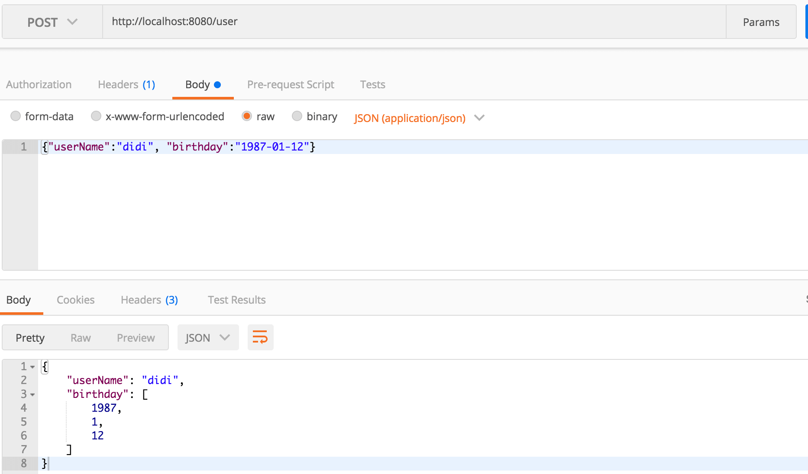

# 循环依赖问题

Spring通过提前曝光机制，利用三级缓存解决循环依赖问题

https://mrbird.cc/%E6%B7%B1%E5%85%A5%E7%90%86%E8%A7%A3Spring%E5%BE%AA%E7%8E%AF%E4%BE%9D%E8%B5%96.html

**注意:Spring将办法解决构造器注入情况下的循环依赖**

# MVC

## Request各种路径

```
request.getRequestURL() http://localhost:8080/jqueryLearn/resources/request.jsp 
request.getRequestURI() /jqueryLearn/resources/request.jsp
request.getContextPath()/jqueryLearn 
request.getServletPath()/resources/request.jsp 
```

### 获取请求完整路径

```
//包括：域名，端口，上下文访问路径
ServletRequestAttributes attributes = (ServletRequestAttributes)RequestContextHolder.getRequestAttributes();
HttpServletRequest request = attributes.getRequest();
StringBuffer url = request.getRequestURL();
String contextPath = request.getServletContext().getContextPath();
url.delete(url.length() - request.getRequestURI().length(), url.length())
.append(contextPath).toString();
```

## 获取IP

```
/**
	 * 获取IP地址
	 * 
	 * 使用Nginx等反向代理软件， 则不能通过request.getRemoteAddr()获取IP地址
	 * 如果使用了多级反向代理的话，X-Forwarded-For的值并不止一个，而是一串IP地址，X-Forwarded-For中第一个非unknown的有效IP字符串，则为真实IP地址
	 */
public static String getIpAddr(HttpServletRequest request) {
		String ip = request.getHeader("x-forwarded-for");
		if (ip == null || ip.length() == 0 || "unknown".equalsIgnoreCase(ip)) {
			ip = request.getHeader("Proxy-Client-IP");
		}
		if (ip == null || ip.length() == 0 || "unknown".equalsIgnoreCase(ip)) {
			ip = request.getHeader("WL-Proxy-Client-IP");
		}
		if (ip == null || ip.length() == 0 || "unknown".equalsIgnoreCase(ip)) {
			ip = request.getRemoteAddr();
		}
		return "0:0:0:0:0:0:0:1".equals(ip) ? "127.0.0.1" : ip;
	}
```

## 是否为ajax请求

```
/**
     * 是否是Ajax异步请求
     * 
     * @param request
     */
    public static boolean isAjaxRequest(HttpServletRequest request)
    {
        String accept = request.getHeader("accept");
        if (accept != null && accept.indexOf("application/json") != -1)
        {
            return true;
        }

        String xRequestedWith = request.getHeader("X-Requested-With");
        if (xRequestedWith != null && xRequestedWith.indexOf("XMLHttpRequest") != -1)
        {
            return true;
        }

        String uri = request.getRequestURI();
        if (StringUtils.inStringIgnoreCase(uri, ".json", ".xml"))
        {
            return true;
        }

        String ajax = request.getParameter("__ajax");
        if (StringUtils.inStringIgnoreCase(ajax, "json", "xml"))
        {
            return true;
        }
        return false;
    }
```


## 上传文件大小限制

```
#spring:
  servlet:
    multipart:
      max-file-size: 1048576        
```

## 静态资源目录位置

在我们开发Web应用的时候，需要引用大量的js、css、图片等静态资源。Spring Boot默认提供静态资源目录位置需置于classpath下，目录名需符合如下规则：

```
classpath:/META-INF/resources/
classpath:/resources/ 
classpath:/static/
classpath:/public/
```

举例：我们可以在`src/main/resources/`目录下创建`static`，在该位置放置一个图片文件。启动程序后，尝试访问`http://localhost:8080/D.jpg`。如能显示图片，配置成功。

模板文件在

```
classpath:/resources/template/
```


## 模板引擎

### Thymeleaf

```
<dependency>
	<groupId>org.springframework.boot</groupId>
	<artifactId>spring-boot-starter-thymeleaf</artifactId>
</dependency>
```

模板:src/main/resources/templates`下新建模板文件`index.html

```
<!DOCTYPE html>
<html>
<head lang="en">
    <meta charset="UTF-8" />
    <title></title>
</head>
<body>
<h1 th:text="${host}">Hello World</h1>
</body>
</html>
```

```
@Controller
public class HelloController {

    @GetMapping("/")
    public String index(ModelMap map) {
        map.addAttribute("host", "http://blog.didispace.com");
        return "index";
    }

}
```

**配置参数**

```
# Enable template caching.
spring.thymeleaf.cache=true 
# Check that the templates location exists.
spring.thymeleaf.check-template-location=true 
# Content-Type value.
spring.thymeleaf.content-type=text/html 
# Enable MVC Thymeleaf view resolution.
spring.thymeleaf.enabled=true 
# Template encoding.
spring.thymeleaf.encoding=UTF-8 
# Comma-separated list of view names that should be excluded from resolution.
spring.thymeleaf.excluded-view-names= 
# Template mode to be applied to templates. See also StandardTemplateModeHandlers.
spring.thymeleaf.mode=HTML5 
# Prefix that gets prepended to view names when building a URL.
spring.thymeleaf.prefix=classpath:/templates/ 
# Suffix that gets appended to view names when building a URL.
spring.thymeleaf.suffix=.html  spring.thymeleaf.template-resolver-order= # Order of the template resolver in the chain. spring.thymeleaf.view-names= # Comma-separated list of view names that can be resolved.
```

举几个我们常用的配置内容：

**Q：不想每次修改页面都重启**

A：修改`spring.thymeleaf.cache`参数，设置为`false`

**Q：不想使用template目录存放模板文件**

A：修改`spring.thymeleaf.prefix`参数，设置为你想放置模板文件的目录

**Q：不想使用index作为模板文件的扩展名**

A：修改`spring.thymeleaf.suffix`参数，设置为你想用的扩展名

**Q：HTML5的严格校验很烦人**

A：修改`spring.thymeleaf.mode`参数，设置为`LEGACYHTML5`

## Request header is too large

### 如何解决

解决方法主要两个方向：

**方向一： 配置应用服务器使其允许的最大值 > 你实用实用的请求头数据大小**

如果用Spring Boot的话，只需要在配置文件里配置这个参数即可：

```
server.max-http-header-size=
```

**方向二：规避请求头过大的情况**

虽然上面的配置可以在解决，但是如果无节制的使用header部分，那么这个参数就会变得不可控。

对于请求头部分的数据其实本身并不建议放太大的数据，所以，还是建议把这些数据放到body里更为合理。

## 错误页面ErrorPageRegistrar

```
public class ErrorPageConfig implements ErrorPageRegistrar {

    @Override
    public void registerErrorPages(ErrorPageRegistry registry) {
        /*1.错误类型为404，默认显示404.html网页*/
        ErrorPage e404 = new ErrorPage(HttpStatus.NOT_FOUND, "/404.html");
        /**
        TODO 2.错误类型为500，表示服务器响应错误，默认显示/500.html网页
        */
        registry.addErrorPages(e404);
    }
}
```


# 多环境配置

在命令行方式启动Spring Boot应用时，连续的两个减号`--`就是对`application.properties`中的属性值进行赋值的标识。(不常用,通常只用来指定spring环境)

多环境配置:

在Spring Boot中多环境配置文件名需要满足`application-{profile}.properties`的格式，其中`{profile}`对应你的环境标识，比如：

- `application-dev.properties`：开发环境
- `application-test.properties`：测试环境
- `application-prod.properties`：生产环境

至于哪个具体的配置文件会被加载，需要在`application.properties`文件中通过`spring.profiles.active`属性来设置，其值对应配置文件中的`{profile}`值

加入在单个文件中配置多环境:

2.4之前:

```
spring:
  profiles: "dev"
---
spring:
  profiles: "test"
---
spring:
  profiles: "prod"
```

2.4之后:`spring.profiles`配置用`spring.config.activate.on-profile`替代

```
spring:
  config:
    activate:
      on-profile: "dev"
---
spring:
  config:
    activate:
      on-profile: "test"
spring:
  config:
    activate:
      on-profile: "prod"
```

**分组配置:**  适合分别配置不同中间件

2.4之前:

```
spring:
  profiles:
    active: "dev"
---
spring.profiles: "dev"
spring.profiles.include: "dev-db,dev-mq"
---
spring.profiles: "dev-db"
db: dev-db.didispace.com
---
spring.profiles: "dev-mq"
mq: dev-mq.didispace.com
```

2.4之后

```
spring:
  profiles:
    active: "dev"
    group:
      "dev": "dev-db,dev-mq"
      "prod": "prod-db,prod-mq"
---
spring:
  config:
    activate:
      on-profile: "dev-db"

db: dev-db.didispace.com
---
spring:
  config:
    activate:
      on-profile: "dev-mq"

mq: dev-mq.didispace.com
---
spring:
  config:
    activate:
      on-profile: "prod-db"

db: prod-db.didispace.com
---
spring:
  config:
    activate:
      on-profile: "prod-mq"
mq: prod-mq.didispace.com
```

**激活当前配置的其他方式**(允许多个同时激活)

1.

```
AnnotationConfigApplicationContext ctx = new AnnotationConfigApplicationContext();
ctx.getEnvironment().setActiveProfiles("development");
```

2.

```
-Dspring.profiles.active="profile1,profile2"
```


## @Profile

@Profile注释允许您指示当一个或多个指定的配置文件处于活动状态时，组件符合注册条件。

```
@Configuration
@Profile("development")
```

```
@Bean
@Profile("development")
```

> xml文件可在beans标签中指定profile属性

**获取当前激活的配置文件**

```
AnnotationConfigApplicationContext ctx = new AnnotationConfigApplicationContext();
ctx.getEnvironment().setActiveProfiles("development");
```

**指定默认激活配置**

```
@Profile("default")
```

如果没有配置文件处于活动状态，则此配置项激活。如果启用了任何配置文件，则默认配置文件不适用。

# 异常处理机制

Spring Boot对异常的处理有一套默认的机制：当应用中产生异常时，Spring Boot根据发送请求头中的`accept`是否包含`text/html`来分别返回不同的响应信息。当从浏览器地址栏中访问应用接口时，请求头中的`accept`便会包含`text/html`信息，产生异常时，Spring Boot通过`org.springframework.web.servlet.ModelAndView`对象来装载异常信息，并以HTML的格式返回；而当从客户端访问应用接口产生异常时（客户端访问时，请求头中的`accept`不包含`text/html`），Spring Boot则以JSON的格式返回异常信息。

这一默认机制实现在Springboot的BasicErrorController中:

```
@Controller
@RequestMapping({"${server.error.path:${error.path:/error}}"})
public class BasicErrorController extends AbstractErrorController {
   //...
    @RequestMapping(produces = {"text/html"})
    public ModelAndView errorHtml(HttpServletRequest request, HttpServletResponse response) {
        HttpStatus status = this.getStatus(request);
        Map<String, Object> model = Collections.unmodifiableMap(this.getErrorAttributes(request, this.isIncludeStackTrace(request, MediaType.TEXT_HTML)));
        response.setStatus(status.value());
        ModelAndView modelAndView = this.resolveErrorView(request, response, status, model);
        return modelAndView != null ? modelAndView : new ModelAndView("error", model);
    }

    @RequestMapping
    @ResponseBody
    public ResponseEntity<Map<String, Object>> error(HttpServletRequest request) {
        Map<String, Object> body = this.getErrorAttributes(request, this.isIncludeStackTrace(request, MediaType.ALL));
        HttpStatus status = this.getStatus(request);
        return new ResponseEntity(body, status);
    }
     //...
}
```

可看到`errorHtml`和`error`方法的请求地址和方法是一样的，唯一的区别就是`errorHtml`通过`produces = {"text/html"}`判断请求头的`accpet`属性中是否包含`text/html`，如果包含，便走该方法。

可以分别通过浏览器和postman来访问测试:

```
@RestController
@RequestMapping("user")
public class UserController {
    @GetMapping("/{id:\\d+}")
    public void get(@PathVariable String id) {
    	//为自定义的运行时异常
        throw new UserNotExistException(id);
    }
}
```

可以改变要返回的两者信息:

在resource/template下添加500.html文件

创建异常处理类

```
@ControllerAdvice
public class ControllerExceptionHandler {
    @ExceptionHandler(UserNotExistException.class)
    @ResponseBody
    @ResponseStatus(HttpStatus.INTERNAL_SERVER_ERROR)
    public Map<String, Object> handleUserNotExistsException(UserNotExistException e) {
        Map<String, Object> map = new HashMap<>();
        map.put("id", e.getId());
        map.put("message", e.getMessage());
        return map;
    }
}
```

此时通过浏览器访问返回500.html页面,通过postman访问范围map内容json.

# 跨域

**1.注解驱动**

Spring 4.2后提供了`@CrossOrigin`注解，该注解可以标注于方法或者类上，包含了以下属性:

| 属性             | 含义                                                         |
| :--------------- | :----------------------------------------------------------- |
| value            | 指定所支持域的集合，`*`表示所有域都支持，默认值为`*`。这些值对应HTTP请求头中的`Access-Control-Allow-Origin` |
| origins          | 同value                                                      |
| allowedHeaders   | 允许请求头中的header，默认都支持                             |
| exposedHeaders   | 响应头中允许访问的header，默认为空                           |
| methods          | 支持请求的方法，比如`GET`，`POST`，`PUT`等，默认和Controller中的方法上标注的一致。 |
| allowCredentials | 是否允许cookie随请求发送，使用时必须指定具体的域             |
| maxAge           | 预请求的结果的有效期，默认30分钟                             |

**2.接口编程**

```
@Configuration
public class WebConfigurer implements WebMvcConfigurer {

    @Override
    public void addCorsMappings(CorsRegistry registry) {
        registry.addMapping("/**")
                .allowedOrigins("*")
                .allowedMethods("GET"); 
    }
}
```

```
 @Override    public void addCorsMappings(CorsRegistry registry) {        registry.addMapping("/**").allowedOrigins("*")                .allowedMethods("GET", "HEAD", "POST", "PUT", "DELETE", "OPTIONS")                .allowCredentials(true).maxAge(3600);    }
```

**3.过滤器实现**

```
	@Bean
	public FilterRegistrationBean corsFilter() {    
	UrlBasedCorsConfigurationSource source = new UrlBasedCorsConfigurationSource();    
	CorsConfiguration config = new CorsConfiguration();    
	config.setAllowCredentials(true);    
	config.addAllowedOrigin("*");    
	source.registerCorsConfiguration("/**", config);    
	FilterRegistrationBean bean = new FilterRegistrationBean(new CorsFilter(source));   
    bean.setOrder(0);    
    return bean;
}
或
@Bean
    public CorsFilter corsFilter()
    {
        UrlBasedCorsConfigurationSource source = new UrlBasedCorsConfigurationSource();
        CorsConfiguration config = new CorsConfiguration();
        config.setAllowCredentials(true);
        // 设置访问源地址
        config.addAllowedOrigin("*");
        // 设置访问源请求头
        config.addAllowedHeader("*");
        // 设置访问源请求方法
        config.addAllowedMethod("*");
        // 对接口配置跨域设置
        source.registerCorsConfiguration("/**", config);
        return new CorsFilter(source);
    }
	
```

**4.Actuator跨域**

如果项目里集成了`Actuator`相关功能，其暴露的接口也支持跨域，只需要在配置文件中添加如下配置即可：

ENDPOINTS CORS CONFIGURATION ([CorsEndpointProperties](https://github.com/spring-projects/spring-boot/blob/v2.1.0.RELEASE/spring-boot-project/spring-boot-actuator-autoconfigure/src/main/java/org/springframework/boot/actuate/autoconfigure/endpoint/web/CorsEndpointProperties.java))

```
management.endpoints.web.cors.allow-credentials= # Whether credentials are supported. When not set, credentials are not supported.management.endpoints.web.cors.allowed-headers= # Comma-separated list of headers to allow in a request. '*' allows all headers.management.endpoints.web.cors.allowed-methods= # Comma-separated list of methods to allow. '*' allows all methods. When not set, defaults to GET.management.endpoints.web.cors.allowed-origins= # Comma-separated list of origins to allow. '*' allows all origins. When not set, CORS support is disabled.management.endpoints.web.cors.exposed-headers= # Comma-separated list of headers to include in a response.management.endpoints.web.cors.max-age=1800s # How long the response from a pre-flight request can be cached by clients. If a duration suffix is not specified, seconds will be used.
```

## CorsFilter与SpringSecurity的Fillter冲突

若依采用的方案，在springSecurity中将corsFilter注册到所有security的功能Filter之前

```
httpSecurity.addFilterBefore(authenticationTokenFilter, UsernamePasswordAuthenticationFilter.class);
// 添加CORS filter
httpSecurity.addFilterBefore(corsFilter, JwtAuthenticationTokenFilter.class);
httpSecurity.addFilterBefore(corsFilter, LogoutFilter.class);
```

网上还有类似的解决方案：扩展corsFilter，其主要也是通过提升该filter的优先级。

# 自动化配置存在的问题

场景:

- 项目依赖复杂的情况下，由于依赖方的依赖组织不够严格，可能引入了一些实际我们不需要的依赖，从而导致我们的项目满足一些特定的自动化配置。
- 传统Spring项目转换为Spring Boot项目的过程中，由于不同的组织方式问题，引发自动化配置加载的错误，比如：通过xml手工组织的多数据源配置等

上面这些原因都会导致不必要的自动化配置加载而导致应用无法启动或触发/health的健康检查不通过等问题。比如，我们在改造传统Spring项目到Spring Boot项目中碰到的一些错误：

```
六月 21, 2017 6:23:47 下午 org.apache.catalina.loader.WebappClassLoaderBase clearReferencesThreads
警告: The web application [ROOT] appears to have started a thread named [Abandoned connection cleanup thread] but has failed to stop it. This is very likely to create a memory leak. Stack trace of thread:
 java.lang.Object.wait(Native Method)
 java.lang.ref.ReferenceQueue.remove(ReferenceQueue.java:143)
 com.mysql.jdbc.AbandonedConnectionCleanupThread.run(AbandonedConnectionCleanupThread.java:43)
2017-06-21 18:23:47,230 INFO  [main] org.springframework.boot.autoconfigure.logging.AutoConfigurationReportLoggingInitializer - 

Error starting ApplicationContext. To display the auto-configuration report re-run your application with 'debug' enabled.
2017-06-21 18:23:47,237 ERROR [main] org.springframework.boot.diagnostics.LoggingFailureAnalysisReporter - 

***************************
APPLICATION FAILED TO START
***************************

Description:

Cannot determine embedded database driver class for database type NONE

Action:

If you want an embedded database please put a supported one on the classpath. If you have database settings to be loaded from a particular profile you may need to active it (no profiles are currently active).
```

从报错信息中，我们就可以分析出错误原因是触发了数据源的自动化配置，然而当前项目其实并不需要数据源。查其根源是依赖方提供的API依赖中引用了一些多余的依赖触发了该自动化配置的加载。

解决方式:

- 通过外部依赖的修改来解决：通过与依赖方沟通，在对方提供的API依赖中去掉不必要的依赖
- 通过禁用指定的自动化配置来避免加载不必要的自动化配置，下面列举了禁用的方法：


**使用了`@EnableAutoConfiguration`的时候**

```
@EnableAutoConfiguration(exclude={DataSourceAutoConfiguration.class})
```

**使用了`@SpringBootApplication`的时候**

```
@SpringBootApplication(exclude = {DataSourceAutoConfiguration.class})
```

**使用了`@SpringCloudApplication`的时候**

```
@EnableAutoConfiguration(exclude={DataSourceAutoConfiguration.class})
@SpringCloudApplication
```

**通过配置文件来设置**

```
spring.autoconfigure.exclude=org.springframework.boot.autoconfigure.jdbc.DataSourceAutoConfiguration
```

# 不占用端口启动

```
@SpringBootApplication
public class SpringBootDisableWebEnvironmentApplication {

    public static void main(String[] args) {
        new SpringApplicationBuilder(SpringBootDisableWebEnvironmentApplication .class)
            .web(WebApplicationType.NONE) // .REACTIVE, .SERVLET
            .run(args);
   }
}
```


# LocalDateTime序列化问题

`LocalDate`、`LocalTime`、`LocalDateTime`是Java 8开始提供的时间日期API，主要用来优化Java 8以前对于时间日期的处理操作。然而，我们在使用Spring Boot或使用Spring Cloud Feign的时候，往往会发现使用请求参数或返回结果中有`LocalDate`、`LocalTime`、`LocalDateTime`的时候会发生各种问题。

```
@SpringBootApplication
public class Application {
    public static void main(String[] args) {
        SpringApplication.run(Application.class, args);
    }
    @RestController
    class HelloController {

        @PostMapping("/user")
        public UserDto user(@RequestBody UserDto userDto) throws Exception {
            return userDto;
        }
    }
    
    @Data
    @NoArgsConstructor
    @AllArgsConstructor
    static class UserDto {
        private String userName;
        private LocalDate birthday;
    }
}
```

使用Feign来调用这个接口的时候,会报错

```
2018-03-13 09:22:58,445 WARN  [http-nio-9988-exec-3] org.springframework.web.servlet.mvc.support.DefaultHandlerExceptionResolver - Failed to read HTTP message: org.springframework.http.converter.HttpMessageNotReadableException: JSON parse error: Can not construct instance of java.time.LocalDate: no suitable constructor found, can not deserialize from Object value (missing default constructor or creator, or perhaps need to add/enable type information?); nested exception is com.fasterxml.jackson.databind.JsonMappingException: Can not construct instance of java.time.LocalDate: no suitable constructor found, can not deserialize from Object value (missing default constructor or creator, or perhaps need to add/enable type information?)
 at [Source: java.io.PushbackInputStream@67064c65; line: 1, column: 63] (through reference chain: java.util.ArrayList[0]->com.didispace.UserDto["birthday"])
```

熟悉Spring MVC的童鞋应该马上就能定位错误与`LocalDate`的反序列化有关。但是，依然会有很多读者会被这段错误信息`java.util.ArrayList[0]->com.didispace.UserDto["birthday"]`所困惑。我们命名提交的`UserDto["birthday"]`是个`LocalDate`对象嘛，跟`ArrayList`列表对象有啥关系呢？

请求测试:



实际上默认情况下Spring MVC对于`LocalDate`序列化成了一个数组类型，而Feign在调用的时候，还是按照`ArrayList`来处理，所以自然无法反序列化为`LocalDate`对象了。

**解决办法**

jackson为此提供了一整套的序列化方案

```
<dependency>
    <groupId>com.fasterxml.jackson.datatype</groupId>
    <artifactId>jackson-datatype-jsr310</artifactId>
</dependency>
```

在该模块中封装对Java 8的时间日期API序列化的实现，其具体实现在这个类中：`com.fasterxml.jackson.datatype.jsr310.JavaTimeModule`（注意：一些较早版本封装在这个类中“`com.fasterxml.jackson.datatype.jsr310.JSR310Module`）。在配置了依赖之后，我们只需要在上面的应用主类中增加这个序列化模块，并禁用对日期以时间戳方式输出的特性：

```
@Bean
public ObjectMapper serializingObjectMapper() {
    ObjectMapper objectMapper = new ObjectMapper();
    objectMapper.disable(SerializationFeature.WRITE_DATES_AS_TIMESTAMPS);
    objectMapper.registerModule(new JavaTimeModule());
    return objectMapper;
}
```

# @Autowired警告

但是当我们使用IDEA写代码的时候，经常会发现`@Autowired`注解下面是有小黄线的，我们把小鼠标悬停在上面，可以看到这个如下图所示的警告信息：

Field injection is not recommended

**Spring中的三种依赖注入方式**

1.Field Injection

如使用@Autowired

这种注入方式通过Java的反射机制实现，所以private的成员也可以被注入具体的对象。

2.Constructor Injection

`Constructor Injection`是构造器注入，是我们日常最为推荐的一种使用方式。

```
@Controller
public class UserController {
    private final UserService userService;

    public UserController(UserService userService){
        this.userService = userService;
    }
}
```

这种注入方式很直接，通过对象构建的时候建立关系，所以这种方式对对象创建的顺序会有要求，当然Spring会为你搞定这样的先后顺序，除非你出现循环依赖，然后就会抛出异常。

3.Setter Injection

`Setter Injection`也会用到`@Autowired`注解，但使用方式与`Field Injection`有所不同，`Field Injection`是用在成员变量上，而`Setter Injection`的时候，是用在成员变量的Setter函数上。

```
@Controller
public class UserController {
    private UserService userService;

    @Autowired
    public void setUserService(UserService userService){
        this.userService = userService;
    }
}
```

这种注入方式也很好理解，就是通过调用成员变量的set方法来注入想要使用的依赖对象。

**三种依赖注入的对比**


# 2.1.x找回请求路径列表日志

在Spring Boot 1.x中,对于Spring构建的Web应用在启动的时候，都会输出当前应用创建的HTTP接口列表.

这些日志接口信息是由`org.springframework.web.servlet.mvc.method.annotation.RequestMappingHandlerMapping`类在启动的时候，通过扫描Spring MVC的`@Controller`、`@RequestMapping`等注解去发现应用提供的所有接口信息。然后在日志中打印，以方便开发者排查关于接口相关的启动是否正确。

从Spring Boot 2.1.0版本开始，就不再打印这些信息了，完整的启动日志变的非常少.

主要是由于从该版本开始，将这些日志的打印级别做了调整：从原来的`INFO`调整为`TRACE`。

增加对`RequestMappingHandlerMapping`类的打印级别设置

```
logging.level.org.springframework.web.servlet.mvc.method.annotation.RequestMappingHandlerMapping=trace
```

在2.1.x版本之后，除了调整了日志级别之外，对于打印内容也做了调整。现在的打印内容根据接口创建的Controller类做了分类打印，这样更有助于开发者根据自己编写的Controller来查找初始化了那些HTTP接口

# SpringBoot应用后台运行配置

Spring Boot应用的几种运行方式：

- 运行Spring Boot的应用主类
- 使用Maven的Spring Boot插件`mvn spring-boot:run`来运行
- 打成jar包后，使用`java -jar`运行

在开发的时候，通常会使用前两种，而在部署的时候往往会使用第三种。但是，我们在使用`java -jar`来运行的时候，并非后台运行。下面我们分别针对Windows和Linux/Unix两种环境，整理一下如何配置后台运行的方法。

windows:

使用软件AlwaysUp,把Spring Boot应用通过`mvn install`打成jar包，然后编写一个`java -jar yourapp.jar`的bat文件。再打开`AlwaysUp`，点击工具栏的第一个按钮，选择上面编写的bat文件，并填写服务名称。完成了创建之后，在列表中可以看到我们配置的服务，通过右键选择`Start xxx`就能在后台将该应用启动起来了。

linux:

nohup方式;只需要使用`nohup java -jar yourapp.jar &`命令，就能让`yourapp.jar`在后台运行了。但是，为了方便管理，我们还可以通过Shell来编写一些用于启动应用的脚本，比如下面几个：

- 关闭应用的脚本：`stop.sh`

```
#!/bin/bash
PID=$(ps -ef | grep yourapp.jar | grep -v grep | awk '{ print $2 }')
if [ -z "$PID" ]
then
    echo Application is already stopped
else
    echo kill $PID
    kill $PID
fi
```

- 启动应用的脚本：`start.sh`

```
#!/bin/bash
nohup java -jar yourapp.jar --server.port=8888 &
```

- 整合了关闭和启动的脚本：`run.sh`，由于会先执行关闭应用，然后再启动应用，这样不会引起端口冲突等问题，适合在持续集成系统中进行反复调用。

```
#!/bin/bash
echo stop application
source stop.sh
echo start application
source start.sh
```

系统服务方式:

- 在`pom.xml`中添加Spring Boot的插件，并注意设置`executable`配置

```
<build> 
  <plugins> 
    <plugin> 
      <groupId>org.springframework.boot</groupId>  
      <artifactId>spring-boot-maven-plugin</artifactId>  
      <configuration> 
        <executable>true</executable> 
      </configuration> 
    </plugin> 
  </plugins> 
</build>
```

- 在完成上述配置后，使用`mvn install`进行打包，构建一个可执行的jar包
- 创建软连接到`/etc/init.d/`目录下

```
sudo ln -s /var/yourapp/yourapp.jar /etc/init.d/yourapp
```

- 在完成软连接创建之后，我们就可以通过如下命令对`yourapp.jar`应用来控制启动、停止、重启操作了

```
/etc/init.d/yourapp start|stop|restart
```

# 懒初始化

关于Spring Boot的性能问题是我们经常在内容平台上看到吐槽的关键词。这次在Spring Boot 2.2中，针对性能这一点，做了大幅的优化。应用程序的启动速度将变得更快，内存占用也会变得更少。

同时，为了加快应用的启动，还增加一个全局延迟初始化的配置参数`spring.main.lazy-initialization`，这可以让我们的应用更快的完成启动动作，但是值得注意的是，延迟启动也会有下面这些副作用：

- 应用在进行延迟初始化的时候，HTTP请求的处理会需要更长的时间
- 原本可能在启动期出现的错误，将延迟到启动的运行期间出现

> 还可以使用 SpringApplicationBuilder 上的 lazyInitialization 方法或 SpringApplication 上的 setLazyInitialization 方法以编程方式启用惰性初始化。

> 如果要禁用某些 Bean 的延迟初始化，同时对应用程序的其余部分使用延迟初始化，则可以使用 @Lazy（false） 注释将其 lazy 属性显式设置为 false。

# 冷门

>  @Inject 可代替 @Autowired,  `@Named` or `@ManagedBean`可代替@Component , 这三个注解均来自于JSR-330的**javax.inject**包

>依赖注入配置时,通过required=false属性 , @Nullable 和 java8的Optional方式, 可以达到不必须依赖的效果.
>
>同样,  这三种方式也使用与MVC, required=false可与 @RequestParam、@RequestHeader等结合使用。

> JSR-330的@Singleton 相当于 @Scope("singleton") , 因为是默认, 所以无用

> 在spring配置类中, 可以用@ImportResource注解导入xml文件配置

>通过@ComponentScan的nameGenerator指定BeanNameGenerator可实现自定义 Bean 命名策略

> 手动注册组件

```java
AnnotationConfigApplicationContext ctx = new AnnotationConfigApplicationContext();
ctx.register(SomeConfig.class, StandaloneDataConfig.class, JndiDataConfig.class);
ctx.refresh();
```

> HttpEntity< T > 与@RequestBody功能相同:
>
> ```
> @PostMapping("/accounts")
> public void handle(HttpEntity<Account> entity) 
> 
> 等价于
> @PostMapping("/accounts")
> public void handle(@RequestBody Account account)
> ```
>
> 
