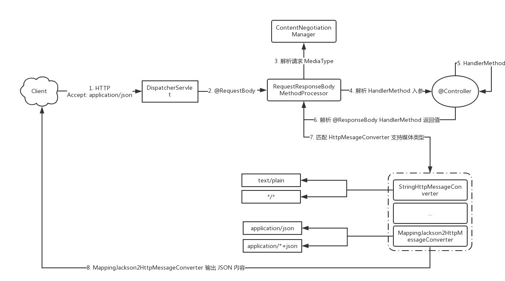

# WebMvcConfigurer实现通用配置

或者继承WebMvcConfigurerAdapter抽象类

**跨域**

```
@Configuration
public class CorsConfig implements WebMvcConfigurer {
	@Override
	public void addCorsMappings(CorsRegistry registry) {
		registry.addMapping("/**")
				.allowedOrigins("*")
				.allowedMethods("GET", "HEAD", "POST", "PUT", "DELETE", "OPTIONS")
				.allowCredentials(true)
				.maxAge(3600)
				.allowedHeaders("*");
	}
}
```

**资源处理器**

```
public void addResourceHandlers(ResourceHandlerRegistry registry) {
        registry.addResourceHandler("/upload/**").addResourceLocations("file:" + Constants.FILE_UPLOAD_DIC).setCachePeriod(31556926);;
        registry.addResourceHandler("/goods-img/**").addResourceLocations("file:" + Constants.FILE_UPLOAD_DIC);
    }
```

**HttpMessageConverter**

```
@Configuration
public class WebConfigurer implements WebMvcConfigurer {
    public void extendMessageConverters(List<HttpMessageConverter<?>> converters) {
        converters.add(new PropertiesHttpMessageConverter());
    }
}
```


## 拦截器+session判断例

session存储用户登录信息，包括购物车信息，在拦截器中判断session，更新购物车信息，

```
public void addInterceptors(InterceptorRegistry registry) {
    // 购物车中的数量统一处理
    registry.addInterceptor(newBeeMallCartNumberInterceptor)
            .excludePathPatterns("/register")
            .excludePathPatterns("/login")
            .excludePathPatterns("/logout");
    // 商城页面登陆拦截
    registry.addInterceptor(newBeeMallLoginInterceptor)
            .excludePathPatterns("/register")
            .excludePathPatterns("/login")
            .excludePathPatterns("/logout")
            .addPathPatterns("/goods/detail/**")
            .addPathPatterns("/shop-cart")
            .addPathPatterns("/shop-cart/**")
            .addPathPatterns("/saveOrder")
            .addPathPatterns("/orders")
            .addPathPatterns("/orders/**")            
            .addPathPatterns("/personal")
            .addPathPatterns("/personal/updateInfo")
            .addPathPatterns("/selectPayType")
            .addPathPatterns("/payPage");
}
```

```
@Component
public class NewBeeMallCartNumberInterceptor implements HandlerInterceptor {
    @Autowired
    private NewBeeMallShoppingCartItemMapper newBeeMallShoppingCartItemMapper;
    @Override
    public boolean preHandle(HttpServletRequest request, HttpServletResponse response, Object o) throws Exception {
        //购物车中的数量会更改，但是在这些接口中并没有对session中的数据做修改，这里统一处理一下
        if (null != request.getSession() && null != request.getSession().getAttribute(Constants.MALL_USER_SESSION_KEY)) {
            //如果当前为登陆状态，就查询数据库并设置购物车中的数量值
            NewBeeMallUserVO newBeeMallUserVO = (NewBeeMallUserVO) request.getSession().getAttribute(Constants.MALL_USER_SESSION_KEY);
            //设置购物车中的数量
            newBeeMallUserVO.setShopCartItemCount(newBeeMallShoppingCartItemMapper.selectCountByUserId(newBeeMallUserVO.getUserId()));
            request.getSession().setAttribute(Constants.MALL_USER_SESSION_KEY, newBeeMallUserVO);
        }
        return true;
    }
    @Override
    public void postHandle(HttpServletRequest httpServletRequest, HttpServletResponse httpServletResponse, Object o, ModelAndView modelAndView) throws Exception {
    }
    @Override
    public void afterCompletion(HttpServletRequest httpServletRequest, HttpServletResponse httpServletResponse, Object o, Exception e) throws Exception {
    }
}
```

```
@Component
public class NewBeeMallLoginInterceptor implements HandlerInterceptor {
    @Override
    public boolean preHandle(HttpServletRequest request, HttpServletResponse response, Object o) throws Exception {
        if (null == request.getSession().getAttribute(Constants.MALL_USER_SESSION_KEY)) {
            response.sendRedirect(request.getContextPath() + "/login");
            return false;
        } else {
            return true;
        }
    }
    @Override
    public void postHandle(HttpServletRequest httpServletRequest, HttpServletResponse httpServletResponse, Object o, ModelAndView modelAndView) throws Exception {
    }
    @Override
    public void afterCompletion(HttpServletRequest httpServletRequest, HttpServletResponse httpServletResponse, Object o, Exception e) throws Exception {
    }
}
```

## ArgumentResolver+根据token设置用户

需求：对于`@RequestMapping`方法中加了@TokenToMallUser参数，需要根据header中的token获取MallUser对象并传给参数

```
@Component
public class TokenToMallUserMethodArgumentResolver implements HandlerMethodArgumentResolver {

    @Autowired
    private MallUserMapper mallUserMapper;
    @Autowired
    private NewBeeMallUserTokenMapper newBeeMallUserTokenMapper;

    public TokenToMallUserMethodArgumentResolver() {
    }
    //支持的参数筛选
    @Override
    public boolean supportsParameter(MethodParameter parameter) {
        if (parameter.hasParameterAnnotation(TokenToMallUser.class)) {
            return true;
        }
        return false;
    }
    //解析参数
    @Override
    public Object resolveArgument(MethodParameter parameter, ModelAndViewContainer mavContainer, NativeWebRequest webRequest, WebDataBinderFactory binderFactory) {
        if (parameter.getParameterAnnotation(TokenToMallUser.class) instanceof TokenToMallUser) {
            MallUser mallUser = null;
            String token = webRequest.getHeader("token");
            //根据token获取用户
            if (null != token && !"".equals(token) && token.length() == Constants.TOKEN_LENGTH) {
                MallUserToken mallUserToken = newBeeMallUserTokenMapper.selectByToken(token);
                if (mallUserToken == null || mallUserToken.getExpireTime().getTime() <= System.currentTimeMillis()) {
                    NewBeeMallException.fail(ServiceResultEnum.TOKEN_EXPIRE_ERROR.getResult());
                }
                mallUser = mallUserMapper.selectByPrimaryKey(mallUserToken.getUserId());
                //用户不存在
                if (mallUser == null) {
                    NewBeeMallException.fail(ServiceResultEnum.USER_NULL_ERROR.getResult());
                }
                //用户被锁定
                if (mallUser.getLockedFlag().intValue() == 1) {
                    NewBeeMallException.fail(ServiceResultEnum.LOGIN_USER_LOCKED_ERROR.getResult());
                }
                return mallUser;
            } else {
                NewBeeMallException.fail(ServiceResultEnum.NOT_LOGIN_ERROR.getResult());
            }
        }
        return null;
    }
}
```

注册ArgumentResolver

```
@Configuration
public class NeeBeeMallWebMvcConfigurer implements WebMvcConfigurer {
    @Autowired
    private TokenToMallUserMethodArgumentResolver tokenToMallUserMethodArgumentResolver;

    public void addArgumentResolvers(List<HandlerMethodArgumentResolver> argumentResolvers) {
        argumentResolvers.add(tokenToMallUserMethodArgumentResolver);
        argumentResolvers.add(tokenToAdminUserMethodArgumentResolver);
    }
}
```


# WebServerFactoryCustomizer

Spring boot 使用嵌入式应用服务器时，如果希望对 WebServer 进行某些个性化配置，可以通过创建 WebServerFactoryCustomizer子类的 实例并注册为 Bean 的方式实现。

WebServerFactory 对象创建完毕后， WebServerFactoryCustomizerBeanPostProcessor 会从 BeanFactory 中查询所有 WebServerFactoryCustomizer 的Bean生成列表、排序，然后逐一调用 WebServerFactoryCustomizer 的 customize 方法。

```
//泛型也可以为TomcatServletWebServerFactory
//可实现动态修改端口,通过改变配置文件的端口然后重启app(close方法关闭,SpringApplication.run),加载配置文件获取端口达到动态修改端口效果
@Component
public class WebServerFactoryCustomizationBean implements WebServerFactoryCustomizer<ConfigurableServletWebServerFactory> {

    @Override
    public void customize(ConfigurableServletWebServerFactory server) {
    	//这里可以从配置文件获取端口
        server.setPort(8081);
    }

}
```


# RequestContextHolder获取请求属性

```
public class ServletUtils
{

    public static HttpServletRequest getRequest()
    {
        return getRequestAttributes().getRequest();
    }

    public static HttpServletResponse getResponse()
    {
        return getRequestAttributes().getResponse();
    }

    public static HttpSession getSession()
    {
        return getRequest().getSession();
    }

    public static ServletRequestAttributes getRequestAttributes()
    {
        RequestAttributes attributes = RequestContextHolder.getRequestAttributes();
        return (ServletRequestAttributes) attributes;
    }
}
```

也可以使用@Autowired自动注入HttpServletRequest, 因为request随请求变化, 所以当前Bean的初始化不能直接注入Request, 而是注入了一个代理request, 当调用其方法时实际调用的是RequestObjectFactory工厂生成的对象的方法, 底层一样同RequestContextHolder实现, 生成的RequestAttributes为线程ThreadLocal变量.

# @ServletComponentScan

在SpringBootApplication上使用@ServletComponentScan注解后，Servlet、Filter、Listener可以直接通过@WebServlet、@WebFilter、@WebListener注解自动注册，无需其他代码。

# 类型转换

默认情况下，支持简单类型（整数、长整型、日期等）。可以通过 WebDataBinder或通过将Formatters(Converter)注册来自定义类型转换。

## WebDataBinder

### ConfigurableWebBindingInitializer

通过`PropertyEditorRegistrar`(函数式接口)注册自定义属性编辑器(PropertyEditor) .

```
public class StringEditor extends PropertyEditorSupport {
    @Override
    public void setAsText(String text) throws IllegalArgumentException {
        if (text == null) {
            setValue(null);
        }  else {
            setValue(HtmlUtils.htmlEscape(text));
        }
    }
}
```

```
public class DateEditor extends PropertyEditorSupport {
    private final String[] datePatterns;

    public DateEditor() {
        this(new String[]{"yyyy", "yyyy-MM", "yyyyMM", "yyyy/MM", "yyyy-MM-dd", "yyyyMMdd", "yyyy/MM/dd", "yyyy-MM-dd HH:mm:ss", "yyyyMMddHHmmss", "yyyy/MM/dd HH:mm:ss"});
    }

    public DateEditor(String[] datePatterns) {
        this.datePatterns = datePatterns;
    }
    @Override
    public void setAsText(String text) {
        if (text == null) {
            setValue(null);
        } else {
            try {
                setValue(DateUtils.parseDate(text.trim(), datePatterns));
            } catch (ParseException e) {
                setValue(null);
            }
        }
    }
}
```

注册

```
@Configuration
public class WebBindingInitializerConfiguration {

    @Bean
    public ConfigurableWebBindingInitializer configurableWebBindingInitializer(FormattingConversionService mvcConversionService, Validator mvcValidator) {
        ConfigurableWebBindingInitializer initializer = new ConfigurableWebBindingInitializer();
        initializer.setConversionService(mvcConversionService);
        initializer.setValidator(mvcValidator);
        initializer.setPropertyEditorRegistrar(propertyEditorRegistry -> {
            propertyEditorRegistry.registerCustomEditor(String.class, new StringEditor());
            propertyEditorRegistry.registerCustomEditor(Date.class, new DateEditor());
        });
        return initializer;
    }
}
```


### @InitBinder

作用：

　　1、从字面意思可以看出这个的作用是给Binder做初始化的，被此注解的方法可以对WebDataBinder初始化。webDataBinder是用于表单到方法的数据绑定的！

　　2、InitBinder只在@Controller中注解方法来为这个控制器注册一个绑定器初始化方法，方法只对本控制器有效

```
@InitBinder
    public void initBinder(WebDataBinder binder){
        binder.setDisallowedFields("id");
    }
```

```
/**
 * 将前台传递过来的日期格式的字符串，自动转化为Date类型
 */
@InitBinder
public void initBinder(WebDataBinder binder)
{
    // Date 类型转换
    binder.registerCustomEditor(Date.class, new PropertyEditorSupport()
    {
        @Override
        public void setAsText(String text)
        {
        	//parsePatterns为日期格式字符串数组
        	//根据格式匹配来转换为D
            setValue(DateUtils.parseDate(text,parsePatterns));
        }
    });
}
```

## Converter与ConverterFactory

类型转换器,spring自带了很多消息转换器,也可以自定义, 将转换器注册到ioc容器中即可生效,不需要WebMvcConfigurer.

在WebMvcAutoConfiguration自动配置类中有一个WebMvcConfigurer的实现类：WebMvcAutoConfigurationAdapter。 重写了addFormatters这个方法，也就是ApplicationConversionService.addBeans(registry, this.beanFactory)这一行代码。 1.可以发现就是获取容器中所有的Converter对象

比如时间类型转换器,声明的该转换器之后前端传来的指定格式内的时间字符串会自动转换为Date对象:

```
public class DateConverter implements Converter<String, Date> {

    private static final List<String> formats = new ArrayList<>(4);

    static {
        formats.add("yyyy-MM");
        formats.add("yyyy-MM-dd");
        formats.add("yyyy-MM-dd HH:mm");
        formats.add("yyyy-MM-dd HH:mm:ss");
    }

    @Override
    public Date convert(String source) {
        String value = source.trim();
        if ("".equals(value)) {
            return null;
        }
        if (source.matches("^\\d{4}-\\d{1,2}$")) {
            return parseDate(source, formats.get(0));
        } else if (source.matches("^\\d{4}-\\d{1,2}-\\d{1,2}$")) {
            return parseDate(source, formats.get(1));
        } else if (source.matches("^\\d{4}-\\d{1,2}-\\d{1,2} {1}\\d{1,2}:\\d{1,2}$")) {
            return parseDate(source, formats.get(2));
        } else if (source.matches("^\\d{4}-\\d{1,2}-\\d{1,2} {1}\\d{1,2}:\\d{1,2}:\\d{1,2}$")) {
            return parseDate(source, formats.get(3));
        } else {
            throw new IllegalArgumentException("Invalid boolean value '" + source + "'");
        }
    }
    /**
     * 格式化日期
     *
     * @param dateStr String 字符型日期
     * @param format  String 格式
     * @return Date 日期
     */
    private Date parseDate(String dateStr, String format) {
        Date date = null;
        try {
            DateFormat dateFormat = new SimpleDateFormat(format);
            date = dateFormat.parse(dateStr);
        } catch (Exception e) {
            e.printStackTrace();
        }
        return date;
    }
}
```

也可以实现ConverterFactory接口

```
public interface ConverterFactory<S, R> {
	<T extends R> Converter<S, T> getConverter(Class<T> targetType);
}
```


# 内容协商

**内容协商**机制是指客户端和服务器端就响应的资源内容进行交涉，然后提供给客户端最为适合的资源。内容协商会以响应资源的语言、字符集、编码方式等作为判断的基准。HTTP请求头中Content-Type，Accept等内容就是内容协商判断的标准。在Spring Boot中，一个完整的内容协商过程如下图所示：



> @RequestBody和@ResponseBody都是通过HttpMessageConverter对请求体转换(序列化)和转换为响应体(反序列化)的.

核心组件:

| 组件                            | 名称                 | 说明                                                |
| :------------------------------ | :------------------- | :-------------------------------------------------- |
| ContentNegotiationManager       | 内容协商管理器       | ContentNegotiationStrategy 控制策略                 |
| MediaType                       | 媒体类型             | HTTP 消息媒体类型，如 text/html                     |
| @RequestMapping#consumes        | 消费媒体类型         | 请求头 Content-Type 媒体类型映射                    |
| @RequestMapping#produces        | 生产媒体类型         | 响应头 Content-Type 媒体类型映射                    |
| HttpMessageConverter            | HTTP消息转换器接口   | HTTP 消息转换器，用于反序列化 HTTP 请求或序列化响应 |
| WebMvcConfigurer                | Web MVC 配置器       | 配置 REST 相关的组件                                |
| HandlerMethod                   | 处理方法             | @RequestMapping 标注的方法                          |
| HandlerMethodArgumentResolver   | 处理方法参数解析器   | 用于 HTTP 请求中解析 HandlerMethod 参数内容         |
| HandlerMethodReturnValueHandler | 处理方法返回值解析器 | 用于 HandlerMethod 返回值解析为 HTTP 响应内容       |

## HttpMessageConverter

`HttpMessageConverter`为HTTP消息转换接口，Spring根据不同的媒体类型进行了相应的实现。比如上图中Accept为application/json，所以在第7步中，会选择使用`HttpMessageConverter`的实现类`MappingJackson2HttpMessageConverter`来处理返回值。

使用Fastjson

```
@Override
    public void configureMessageConverters(List<HttpMessageConverter<?>> converters) {
        // 使用 fastjson 序列化，会导致 @JsonIgnore 失效，可以使用 @JSONField(serialize = false) 替换
        FastJsonHttpMessageConverter converter = new FastJsonHttpMessageConverter();
        List<MediaType> supportMediaTypeList = new ArrayList<>();
        supportMediaTypeList.add(MediaType.APPLICATION_JSON_UTF8);
        FastJsonConfig config = new FastJsonConfig();
        config.setDateFormat("yyyy-MM-dd HH:mm:ss");
        config.setSerializerFeatures(SerializerFeature.DisableCircularReferenceDetect);
        converter.setFastJsonConfig(config);
        converter.setSupportedMediaTypes(supportMediaTypeList);
        converter.setDefaultCharset(StandardCharsets.UTF_8);
        converters.add(converter);
    }
```

官方案例

```
@Configuration
@EnableWebMvc
public class WebConfiguration implements WebMvcConfigurer {

    @Override
    public void configureMessageConverters(List<HttpMessageConverter<?>> converters) {
        Jackson2ObjectMapperBuilder builder = new Jackson2ObjectMapperBuilder()
                .indentOutput(true)
                .dateFormat(new SimpleDateFormat("yyyy-MM-dd"))
                .modulesToInstall(new ParameterNamesModule());
        converters.add(new MappingJackson2HttpMessageConverter(builder.build()));
        converters.add(new MappingJackson2XmlHttpMessageConverter(builder.createXmlMapper(true).build()));
    }
}
```

> 如果需要覆盖磨人的converter,  可直接注入HttpMessageConverters

### xml内容协商

```
<dependency>
    <groupId>com.fasterxml.jackson.dataformat</groupId>
    <artifactId>jackson-dataformat-xml</artifactId>
</dependency>
```

传统spring应用需要引入

```
@Configuration
public class MessageConverterConfig1 extends WebMvcConfigurerAdapter {
    @Override
    public void configureMessageConverters(List<HttpMessageConverter<?>> converters) {
        Jackson2ObjectMapperBuilder builder = Jackson2ObjectMapperBuilder.xml();
        builder.indentOutput(true);
        converters.add(new MappingJackson2XmlHttpMessageConverter(builder.build()));
    }
}
```

在Spring Boot应用不用像上面这么麻烦，只需要加入`jackson-dataformat-xml`依赖，Spring Boot就会自动引入`MappingJackson2XmlHttpMessageConverter`的实现：

案例 xml消息转换器

```
//定义对象与xml的关系
@Data
@NoArgsConstructor
@AllArgsConstructor
@JacksonXmlRootElement(localName = "User")
public class User {
    @JacksonXmlProperty(localName = "name")
    private String name;
    @JacksonXmlProperty(localName = "age")
    private Integer age;

}
```

```
其对应的xml的样例为
<User>
	<name>aaaa</name>
	<age>10</age>
</User>
```

使用(发送xml,返回xml  postman body-row)

```
@RestController 
public class UserController {
    @PostMapping(value = "/user", 
        consumes = MediaType.APPLICATION_XML_VALUE, 
        produces = MediaType.APPLICATION_XML_VALUE)
    public User create(@RequestBody User user) {
        user.setName("didispace.com : " + user.getName());
        user.setAge(user.getAge() + 100);
        return user;
    }
}
```

### 自定义内容协商

除了Spring给我们提供的`HttpMessageConverter`实现外，我们也可以自定义`HttpMessageConverter`的实现，来处理一些实际业务需求。

假如现在要实现一个用于处理 Content-Type 为 text/properties 媒体类型的 HttpMessageConverter 实现类PropertiesHttpMessageConverter，当我们在请求体中传输下面内容时：

```
name:mrbrid
age:18
```

能够自动转换为Properties对象。

参照*MappingJackson2HttpMessageConverter的*实现方式继承`AbstractGenericHttpMessageConverter`的方式来实现`HttpMessageConverter`接口,

其中`readInternal`为反序列化过程，即将HTTP请求反序列化为参数的过程；`writeInternal`为序列化过程，将响应序列化。构造函数也是必须的.

```
public class PropertiesHttpMessageConverter extends AbstractGenericHttpMessageConverter<Properties> {
	//在构造函数中指定它能处理的媒体类型(content-type)
	public PropertiesHttpMessageConverter() {
    	super(new MediaType("text", "properties"));
	}
    @Override
    protected void writeInternal(Properties properties, Type type, HttpOutputMessage outputMessage) throws IOException, HttpMessageNotWritableException {
    	// 获取请求头
        HttpHeaders headers = outputMessage.getHeaders();
        // 获取 content-type
        MediaType contentType = headers.getContentType();
        // 获取编码
        Charset charset = null;
        if (contentType != null) {
            charset = contentType.getCharset();
        }
        charset = charset == null ? Charset.forName("UTF-8") : charset;
        // 获取请求体
        OutputStream body = outputMessage.getBody();
        OutputStreamWriter outputStreamWriter = new OutputStreamWriter(body, charset);

        properties.store(outputStreamWriter, "Serialized by PropertiesHttpMessageConverter#writeInternal");
    }
     @Override
    protected Properties readInternal(Class<? extends Properties> clazz, HttpInputMessage inputMessage) throws IOException, HttpMessageNotReadableException {
        Properties properties = new Properties();
        // 获取请求头
        HttpHeaders headers = inputMessage.getHeaders();
        // 获取 content-type
        MediaType contentType = headers.getContentType();
        // 获取编码
        Charset charset = null;
        if (contentType != null) {
            charset = contentType.getCharset();
        }
        charset = charset == null ? Charset.forName("UTF-8") : charset;
        // 获取请求体输入流
        InputStream body = inputMessage.getBody();
        InputStreamReader inputStreamReader = new InputStreamReader(body, charset);
        // 加载
        properties.load(inputStreamReader);
        return properties;
    }

    @Override
    public Properties read(Type type, Class<?> contextClass, HttpInputMessage inputMessage) throws IOException, HttpMessageNotReadableException {
        return readInternal(null, inputMessage);
    }
}
```

```
@Configuration
public class WebConfigurer implements WebMvcConfigurer {
	@Override
    public void extendMessageConverters(List<HttpMessageConverter<?>> converters) {
        // converters.add(new PropertiesHttpMessageConverter());
        // 指定顺序，这里为第一个,否则会被排在前面的MappingJackson2HttpMessageConverter优先处理
        // 因为需要@定义的是REST接口，所以响应默认会被序列化为JSON格式
        converters.add(0, new PropertiesHttpMessageConverter());
    }
}
```

controller

```
@RestController
public class TestController {
	//指定接收的Content-Type为text/properties
    @GetMapping(value = "test", consumes = "text/properties")
    public Properties test(@RequestBody Properties properties) {
        return properties;
    }
}
```

上面这种方式必须依赖于`@RequestBody`和`@ResponseBody`注解，除此之外我们还可以通过自定义`HandlerMethodArgumentResolver`和`HandlerMethodReturnValueHandler`实现类的方式来处理内容协商。

## HandlerMethodArgumentResolver

`HandlerMethodArgumentResolver`俗称方法参数解析器，用于解析由`@RequestMapping`注解（或其派生的注解）所标注的方法的参数。

测试通过实现`HandlerMethodArgumentResolver`的方式来将HTTP请求体的内容自动解析为Properties对象。

```
public class PropertiesHandlerMethodArgumentResolver implements HandlerMethodArgumentResolver {
	//用于指定支持解析的参数类型，这里为Properties类型
    @Override
    public boolean supportsParameter(MethodParameter parameter) {
        return Properties.class.equals(parameter.getParameterType());
    }
	//用于实现解析逻辑，解析过程和PropertiesHttpMessageConverter的readInternal方法类似。
    @Override
    public Object resolveArgument(MethodParameter parameter, ModelAndViewContainer mavContainer, NativeWebRequest webRequest, WebDataBinderFactory binderFactory) throws Exception {
        ServletWebRequest servletWebRequest = (ServletWebRequest) webRequest;
        HttpServletRequest request = servletWebRequest.getRequest();
        String contentType = request.getHeader("Content-Type");

        MediaType mediaType = MediaType.parseMediaType(contentType);
        // 获取编码
        Charset charset = mediaType.getCharset() == null ? Charset.forName("UTF-8") : mediaType.getCharset();
        // 获取输入流
        InputStream inputStream = request.getInputStream();
        InputStreamReader inputStreamReader = new InputStreamReader(inputStream, charset);

        // 输入流转换为 Properties
        Properties properties = new Properties();
        properties.load(inputStreamReader);
        return properties;
    }
}
```

接着，我们还需将`PropertiesHandlerMethodArgumentResolver`添加到Spring自带的`HandlerMethodArgumentResolver`实现类集合中.

但是我们不能在配置类`WebMvcConfigurer`中通过重写`addArgumentResolvers`的方式来添加，查看该方法源码上注释着:   通过这个方法来添加的方法参数解析器不会覆盖Spring内置的方法参数解析器(**添加到最后**)，如果需要这么做的话，可以直接通过修改RequestMappingHandlerAdapter来实现。

```
@Configuration
public class WebConfigurer implements WebMvcConfigurer {
    @Autowired
    private RequestMappingHandlerAdapter requestMappingHandlerAdapter;

    @PostConstruct  //WebConfigurer配置类装配完毕的时候执行
    public void init() {
        // 获取当前 RequestMappingHandlerAdapter 所有的 ArgumentResolver对象
        List<HandlerMethodArgumentResolver> argumentResolvers = requestMappingHandlerAdapter.getArgumentResolvers();
        List<HandlerMethodArgumentResolver> newArgumentResolvers = new ArrayList<>(argumentResolvers.size() + 1);
        // 添加 PropertiesHandlerMethodArgumentResolver 到集合第一个位置
        newArgumentResolvers.add(0, new PropertiesHandlerMethodArgumentResolver());
        // 将原 ArgumentResolver 添加到集合中
        newArgumentResolvers.addAll(argumentResolvers);
        // 重新设置 ArgumentResolver对象集合
        requestMappingHandlerAdapter.setArgumentResolvers(newArgumentResolvers);
    }
}
```

通过`requestMappingHandlerAdapter`对象的`setArgumentResolvers`方法来重新设置方法解析器集合，将`PropertiesHandlerMethodArgumentResolver`添加到集合的第一个位置。

之所以要将`PropertiesHandlerMethodArgumentResolver`添加到第一个位置是因为Properties本质也是一个Map对象，而Spring内置的`MapMethodProcessor`就是用于处理Map参数类型的，如果不将`PropertiesHandlerMethodArgumentResolver`优先级提高，那么Properties类型参数会被`MapMethodProcessor`解析，从而出错.

测试:

```
@RestController
public class TestController {
    @GetMapping(value = "test1", consumes = "text/properties")
    public Properties test1(Properties properties) {  //参数没有被@RequestBody标注
        return properties;
    }
}
```

成功执行，并且返回了正确的内容.

但是返回的序列化工作还是通过PropertiesHttpMessageConverter`的`writeInternal+@ResponseBody实现的.

接着我们开始实现自定义方法返回值解析器，并且不依赖于`@ResponseBody`注解。

> newbee mall 通过该接口 ,  对带指定注解的接口参数使用请求头里的token从dao获取登录用户对象解析赋值	
>
> ```
> @Component
> public class TokenToAdminUserMethodArgumentResolver implements HandlerMethodArgumentResolver {
>     @Autowired
>     private NewBeeAdminUserTokenMapper newBeeAdminUserTokenMapper;
>     public TokenToAdminUserMethodArgumentResolver() {
>     }
> 
>     public boolean supportsParameter(MethodParameter parameter) {
>         if (parameter.hasParameterAnnotation(TokenToAdminUser.class)) {
>             return true;
>         }
>         return false;
>     }
> 
>     public Object resolveArgument(MethodParameter parameter, ModelAndViewContainer mavContainer, NativeWebRequest webRequest, WebDataBinderFactory binderFactory) {
>         if (parameter.getParameterAnnotation(TokenToAdminUser.class) instanceof TokenToAdminUser) {
>             String token = webRequest.getHeader("token");
>             if (null != token && !"".equals(token) && token.length() == Constants.TOKEN_LENGTH) {
>                 AdminUserToken adminUserToken = newBeeAdminUserTokenMapper.selectByToken(token);
>                 if (adminUserToken == null) {
>                     NewBeeMallException.fail(ServiceResultEnum.ADMIN_NOT_LOGIN_ERROR.getResult());
>                 } else if (adminUserToken.getExpireTime().getTime() <= System.currentTimeMillis()) {
>                     NewBeeMallException.fail(ServiceResultEnum.ADMIN_TOKEN_EXPIRE_ERROR.getResult());
>                 }
>                 return adminUserToken;
>             } else {
>                 NewBeeMallException.fail(ServiceResultEnum.ADMIN_NOT_LOGIN_ERROR.getResult());
>             }
>         }
>         return null;
>     }
> 
> }
> ```
>
> 并且该项目是通过WebMvcConfigurer接口的addArgumentResolver方法添加该解析器的,即不覆盖spring自带的解析器链路
>
> ```
> public void addArgumentResolvers(List<HandlerMethodArgumentResolver> argumentResolvers) {
>     argumentResolvers.add(tokenToMallUserMethodArgumentResolver);
>     argumentResolvers.add(tokenToAdminUserMethodArgumentResolver);
> }
> ```

## HandlerMethodReturnValueHandler

`HandlerMethodArgumentResolver`俗称方法返回值解析器，用于解析由`@RequestMapping`注解（或其派生的注解）所标注的方法的返回值。

测试通过实现`HandlerMethodReturnValueHandler`的方式来自定义一个用于处理返回值类型为Properties类型的解析器。

```
public class PropertiesHandlerMethodReturnValueHandler implements HandlerMethodReturnValueHandler {
    @Override
    public boolean supportsReturnType(MethodParameter returnType) {
        return Properties.class.equals(returnType.getMethod().getReturnType());
    }
    @Override
    public void handleReturnValue(Object returnValue, MethodParameter returnType, ModelAndViewContainer mavContainer, NativeWebRequest webRequest) throws Exception {
        Properties properties = (Properties) returnValue;

        ServletWebRequest servletWebRequest = (ServletWebRequest) webRequest;

        HttpServletResponse response = servletWebRequest.getResponse();
        ServletServerHttpResponse servletServerHttpResponse = new ServletServerHttpResponse(response);

        // 获取请求头
        HttpHeaders headers = servletServerHttpResponse.getHeaders();

        MediaType contentType = headers.getContentType();
        // 获取编码
        Charset charset = null;
        if (contentType != null) {
            charset = contentType.getCharset();
        }

        charset = charset == null ? Charset.forName("UTF-8") : charset;

        // 获取请求体
        OutputStream body = servletServerHttpResponse.getBody();
        OutputStreamWriter outputStreamWriter = new OutputStreamWriter(body, charset);

        properties.store(outputStreamWriter, "Serialized by PropertiesHandlerMethodReturnValueHandler#handleReturnValue");
        
		// 告诉 Spring MVC 请求已经处理完毕
        //	mavContainer.setRequestHandled(true);
    }
}
```

`supportsReturnType`方法指定了处理返回值的类型，`handleReturnValue`方法用于处理返回值

接着将`PropertiesHandlerMethodReturnValueHandler`添加到到Spring自带的`HandlerMethodReturnValueHandler`实现类集合中，添加方式和自定义`HandlerMethodArgumentResolver`一致：

```
@Configuration
public class WebConfigurer implements WebMvcConfigurer {
    @Autowired
    private RequestMappingHandlerAdapter requestMappingHandlerAdapter;
    @PostConstruct
    public void init() {
        // 获取当前 RequestMappingHandlerAdapter 所有的 ArgumentResolver对象
        List<HandlerMethodArgumentResolver> argumentResolvers = requestMappingHandlerAdapter.getArgumentResolvers();
        List<HandlerMethodArgumentResolver> newArgumentResolvers = new ArrayList<>(argumentResolvers.size() + 1);
        // 添加 PropertiesHandlerMethodArgumentResolver 到集合第一个位置
        newArgumentResolvers.add(0, new PropertiesHandlerMethodArgumentResolver());
        // 将原 ArgumentResolver 添加到集合中
        newArgumentResolvers.addAll(argumentResolvers);
        // 重新设置 ArgumentResolver对象集合
        requestMappingHandlerAdapter.setArgumentResolvers(newArgumentResolvers);

        // 获取当前 RequestMappingHandlerAdapter 所有的 returnValueHandlers对象
        List<HandlerMethodReturnValueHandler> returnValueHandlers = requestMappingHandlerAdapter.getReturnValueHandlers();
        List<HandlerMethodReturnValueHandler> newReturnValueHandlers = new ArrayList<>(returnValueHandlers.size() + 1);
        // 添加 PropertiesHandlerMethodReturnValueHandler 到集合第一个位置
        newReturnValueHandlers.add(0, new PropertiesHandlerMethodReturnValueHandler());
        // 将原 returnValueHandlers 添加到集合中
        newReturnValueHandlers.addAll(returnValueHandlers);
        // 重新设置 ReturnValueHandlers对象集合
        requestMappingHandlerAdapter.setReturnValueHandlers(newReturnValueHandlers);
    }
}
```

现在,在controller中就可以完全去掉@RequestBody和@ResponseBody了.

```
@Controller
public class TestController {
    @GetMapping(value = "test1", consumes = "text/properties")
    public Properties test1(Properties properties) {  
        return properties;
    }
}
```

注意:测试虽然返回结果没有问题,但是控制台还是显示了异常信息:

```
javax.servlet.ServletException: Circular view path [test1]: would dispatch back to the current handler URL [/test1] again. Check your ViewResolver setup! (Hint: This may be the result of an unspecified view, due to default view name generation.)
```

在Spring中如果Controller中的方法没有被`@ResponseBody`标注的话，默认会把返回值当成视图的名称.而这里我们并不希望解析的Properties值被当成视图名称，所以我们需要在`PropertiesHandlerMethodReturnValueHandler`的`handleReturnValue`方法最后一行添加如下代码：

```
// 告诉 Spring MVC 请求已经处理完毕
mavContainer.setRequestHandled(true);
```

# ServletContextListener

监听 ServletContext 对象的生命周期，实际上就是监听 Web 应用的生命周期。

　　当Servlet 容器启动或终止Web 应用时，会触发ServletContextEvent 事件，该事件由ServletContextListener 来处理。在 ServletContextListener 接口中定义了处理ServletContextEvent 事件的两个方法。

通常用来在context中设置参数(可以从配置文件中读取).

使用时可以通过ServletContext的getAttribute获取,

也可以在模板中直接使用,如thymeleaf:  ${application.website.xxx} ,可以用来设置网站的固定页尾内容.

```
@WebListener
public class StarterListener implements ServletContextListener {
    @Override
    public void contextInitialized(ServletContextEvent sce) {
        sce.getServletContext().setAttribute("website",xxx);
    }
    @Override
    public void contextDestroyed(ServletContextEvent sce) {
    //...
    }
}
```

# PostConstruct和PreDestroy

该注解是javaee注解

在spring中,@PostConstruct注释的方法为bean的初始化方法(在bean的依赖注入后执行);

在servlet中 ,被@PostConstruct修饰的方法会在服务器加载Servlet的时候运行，并且只会被服务器执行一次。PostConstruct在构造函数之后执行，init（）方法之前执行。PreDestroy（）方法在destroy（）方法执行之后执行

# RequestMappingHandlerMapping

获取所有请求方法

```
RequestMappingHandlerMapping requestMappingHandlerMapping = (RequestMappingHandlerMapping) applicationContext.getBean("requestMappingHandlerMapping");
Map<RequestMappingInfo, HandlerMethod> handlerMethodMap = requestMappingHandlerMapping.getHandlerMethods()
```


# Filter与Intercepter

## Filter配置

Filter常与`HttpServletRequestWrapper`搭配使用过滤参数

方式一

```
@Component
@WebFilter(urlPatterns = {"/*"})
public class TimeFilter implements Filter{
    @Override
    public void init(FilterConfig filterConfig) throws ServletException {
        System.out.println("过滤器初始化");
    }

    @Override
    public void doFilter(ServletRequest servletRequest, ServletResponse servletResponse, FilterChain filterChain) throws IOException, ServletException {
        System.out.println("开始执行过滤器");
        Long start = new Date().getTime();
        filterChain.doFilter(servletRequest, servletResponse);
        System.out.println("【过滤器】耗时 " + (new Date().getTime() - start));
        System.out.println("结束执行过滤器");
    }

    @Override
    public void destroy() {
        System.out.println("过滤器销毁");
    }
}
```

`@Component`注解让`TimeFilter`成为Spring上下文中的一个Bean，`@WebFilter`注解的`urlPatterns`属性配置了哪些请求可以进入该过滤器，`/*`表示所有请求

方式二

通过`FilterRegistrationBean`来注册过滤器。`FilterRegistrationBean`也可以指定过滤器类为泛型,

多个过滤器需要多个FilterRegistrationBean

```
@Configuration
public class WebConfig {
    @Bean
    public FilterRegistrationBean timeFilter() {
        FilterRegistrationBean filterRegistrationBean = new FilterRegistrationBean();
        TimeFilter timeFilter = new TimeFilter();
        filterRegistrationBean.setFilter(timeFilter);

        List<String> urlList = new ArrayList<>();
        urlList.add("/*");
		//配置了URL匹配规则
        filterRegistrationBean.setUrlPatterns(urlList);
        filterRegistrationBean.setO
        return filterRegistrationBean;
    }
}
```

### 其他配置

**initParameter**

两种使用注册器的方式都可以给filter设置初始化参数:

配置类方式注入可通过FilterRegistrationBean的addInitParameter添加;

注解方式可通过@WebInitParam注解加入

在Filter的init方法中FilterConfig类型的参数方法getInitParameter获取

**order**

指定过滤器顺序

如果该过滤器需要加到最前,设置为1

如果该过来过滤器放到最后,设置为Integer.MAX_VALUE

**dispatcherType**

1.REQUEST
只要发起的操作是一次HTTP请求，比如请求某个URL、发起了一个GET请求、表单提交方式为POST的POST请求、表单提交方式为GET的GET请求。一次重定向则前后相当于发起了两次请求，这些情况下有几次请求就会走几次指定过滤器。
2.FOWARD
只有当当前页面是通过请求转发转发过来的情形时，才会走指定的过滤器
3.INCLUDE
只要是通过<jsp:include page="xxx.jsp" />，嵌入进来的页面，每嵌入的一个页面，都会走一次指定的过滤器。
4.ASYNC

5.ERROR

### 实现类

`OncePerRequestFilter`

**确保在一次请求中只通过一次filter，而需要重复的执行**

## Intercepter配置

```
public class TimeInterceptor implements HandlerInterceptor {
	//方法在处理拦截之前执行
    @Override
    public boolean preHandle(HttpServletRequest httpServletRequest, HttpServletResponse httpServletResponse, Object o) throws Exception {
        System.out.println("处理拦截之前");
        httpServletRequest.setAttribute("startTime", new Date().getTime());
        //获取处理该请求的controller
        System.out.println(((HandlerMethod) o).getBean().getClass().getName());
        //获取处理该请求的方法
        System.out.println(((HandlerMethod) o).getMethod().getName());
        return true;
    }
	//当被拦截的方法没有抛出异常成功时才会处理
    @Override
    public void postHandle(HttpServletRequest httpServletRequest, HttpServletResponse httpServletResponse, Object o, ModelAndView modelAndView) throws Exception {
        System.out.println("开始处理拦截");
        Long start = (Long) httpServletRequest.getAttribute("startTime");
        System.out.println("【拦截器】耗时 " + (new Date().getTime() - start));
    }
	//方法无论被拦截的方法抛出异常与否都会执行
    @Override
    public void afterCompletion(HttpServletRequest httpServletRequest, HttpServletResponse httpServletResponse, Object o, Exception e) throws Exception {
        System.out.println("处理拦截之后");
        Long start = (Long) httpServletRequest.getAttribute("startTime");
        System.out.println("【拦截器】耗时 " + (new Date().getTime() - start));
        System.out.println("异常信息 " + e);
    }
}
```

要使拦截器在Spring Boot中生效，还需要如下两步配置：

1.在拦截器类上加入`@Component`注解；

2.在`WebConfig`中通过`InterceptorRegistry`注册过滤器:

```
@Configuration
public class WebConfig extends WebMvcConfigurerAdapter {
    @Autowired
    private TimeInterceptor timeInterceptor;
    @Override
    public void addInterceptors(InterceptorRegistry registry) {
        registry.addInterceptor(timeInterceptor).addPathPatterns("/**").excludePathPatterns("/admin/**");
    }
```

相较于过滤器，拦截器多了Object和Exception对象，所以可以获取的信息比过滤器要多的多。但过滤器仍无法获取到方法的参数等信息，我们可以通过切面编程来实现这个目的.

### 若依防重复请求

若依的防重复请求的依据为请求的参数或请求体在指定时间内唯一.

这里使用的是`HandlerInterceptor`的抽象继承类 `HandlerInterceptorAdapter` ,它已经实现了所有方法(空),但现在`HandlerInterceptor`也提供了默认实现

```
/**
 * 自定义注解防止表单重复提交
 */
@Inherited
@Target(ElementType.METHOD)
@Retention(RetentionPolicy.RUNTIME)
@Documented
public @interface RepeatSubmit
{
   /**
    * 间隔时间(ms)，小于此时间视为重复提交
    */
   public int interval() default 5000;

   /**
    * 提示消息
    */
   public String message() default "不允许重复提交，请稍后再试";
}
```

```
/**
 * 防止重复提交拦截器
 *
 * @author ruoyi
 */
@Component
public abstract class RepeatSubmitInterceptor extends HandlerInterceptorAdapter
{
    @Override
    public boolean preHandle(HttpServletRequest request, HttpServletResponse response, Object handler) throws Exception
    {
        if (handler instanceof HandlerMethod)
        {
            //获取controller方法
            HandlerMethod handlerMethod = (HandlerMethod) handler;
            Method method = handlerMethod.getMethod();
            RepeatSubmit annotation = method.getAnnotation(RepeatSubmit.class);
            if (annotation != null)
            {
                //判断是否重复提交
                if (this.isRepeatSubmit(request, annotation))
                {
                    AjaxResult ajaxResult = AjaxResult.error(annotation.message());
                    ServletUtils.renderString(response, JSONObject.toJSONString(ajaxResult));
                    return false;
                }
            }
            return true;
        }
        else
        {
            return super.preHandle(request, response, handler);
        }
    }

    /**
     * 验证是否重复提交由子类实现具体的防重复提交的规则
     *
     * @param request
     * @return
     * @throws Exception
     */
    public abstract boolean isRepeatSubmit(HttpServletRequest request, RepeatSubmit annotation);
}
```

```
/**
 * 判断请求url和数据是否和上一次相同，
 * 如果和上次相同，则是重复提交表单。 有效时间为5秒内。
 * 
 * @author ruoyi
 */
@Component
public class SameUrlDataInterceptor extends RepeatSubmitInterceptor
{
    public final String REPEAT_PARAMS = "repeatParams";

    public final String REPEAT_TIME = "repeatTime";

    // 令牌自定义标识
    @Value("${token.header}")
    private String header;

    @Autowired
    private RedisCache redisCache;

    @SuppressWarnings("unchecked")
    @Override
    public boolean isRepeatSubmit(HttpServletRequest request, RepeatSubmit annotation)
    {
        //将请求体或者请求参数和时间戳以map的形式作为防止重复提交检验的value
        String nowParams = "";
        if (request instanceof RepeatedlyRequestWrapper)
        {
            RepeatedlyRequestWrapper repeatedlyRequest = (RepeatedlyRequestWrapper) request;
            nowParams = HttpHelper.getBodyString(repeatedlyRequest);
        }

        // body参数为空，获取Parameter的数据
        if (StringUtils.isEmpty(nowParams))
        {
            nowParams = JSONObject.toJSONString(request.getParameterMap());
        }
        Map<String, Object> nowDataMap = new HashMap<String, Object>();
        nowDataMap.put(REPEAT_PARAMS, nowParams);
        nowDataMap.put(REPEAT_TIME, System.currentTimeMillis());

        // 请求地址（作为存放cache的key值）
        String url = request.getRequestURI();

        // 唯一值（没有消息头则使用请求地址）  这里为token
        String submitKey = request.getHeader(header);
        if (StringUtils.isEmpty(submitKey))
        {
            submitKey = url;
        }

        // 唯一标识（指定key + 消息头）
        String cacheRepeatKey = Constants.REPEAT_SUBMIT_KEY + submitKey;

        Object sessionObj = redisCache.getCacheObject(cacheRepeatKey);
        if (sessionObj != null) //不重复
        {
            Map<String, Object> sessionMap = (Map<String, Object>) sessionObj;
            if (sessionMap.containsKey(url))
            {
                Map<String, Object> preDataMap = (Map<String, Object>) sessionMap.get(url);
                //是否小于指定重复提交间隔时间
                if (compareParams(nowDataMap, preDataMap) && compareTime(nowDataMap, preDataMap, annotation.interval()))
                {
                    return true;
                }
            }
        }
        //首次提交 或者 重复 --> 重新生成
        Map<String, Object> cacheMap = new HashMap<String, Object>();
        //再包装一层
        cacheMap.put(url, nowDataMap);
        redisCache.setCacheObject(cacheRepeatKey, cacheMap, annotation.interval(), TimeUnit.MILLISECONDS);
        return false;
    }

    /**
     * 判断参数是否相同
     */
    private boolean compareParams(Map<String, Object> nowMap, Map<String, Object> preMap)
    {
        String nowParams = (String) nowMap.get(REPEAT_PARAMS);
        String preParams = (String) preMap.get(REPEAT_PARAMS);
        return nowParams.equals(preParams);
    }

    /**
     * 判断两次间隔时间
     */
    private boolean compareTime(Map<String, Object> nowMap, Map<String, Object> preMap, int interval)
    {
        long time1 = (Long) nowMap.get(REPEAT_TIME);
        long time2 = (Long) preMap.get(REPEAT_TIME);
        if ((time1 - time2) < interval)
        {
            return true;
        }
        return false;
    }
}
```

```
/**
 * 通用配置
 * WebMvcConfigurer为springmvc基本配置实现接口
 * 
 * @author ruoyi
 */
@Configuration
public class ResourcesConfig implements WebMvcConfigurer
{
    @Autowired
    private RepeatSubmitInterceptor repeatSubmitInterceptor;

    /**
     * 自定义拦截规则
     */
    @Override
    public void addInterceptors(InterceptorRegistry registry)
    {
        registry.addInterceptor(repeatSubmitInterceptor).addPathPatterns("/**");
    }
}
```


## 比较

当同时加上Filter与Intercepter

输出内容

```
开始执行过滤器
处理拦截之前
cc.mrbird.controller.UserController
get
1
开始处理拦截
【拦截器】耗时 25
处理拦截之后
【拦截器】耗时 25
异常信息 null
【过滤器】耗时 34
结束执行过滤器
```

可看到过滤器要先于拦截器执行，晚于拦截器结束。


# HttpServletRequestWrapper

该类继承与HttpServletRequest,可用于对request重构, 如参数过滤,参数重写等

## 可重复读的request

将请求体缓存

```
public class RepeatedlyRequestWrapper extends HttpServletRequestWrapper {
    private final byte[] body;

    public RepeatedlyRequestWrapper(HttpServletRequest request, ServletResponse response) throws IOException {
        super(request);
        request.setCharacterEncoding("UTF-8");
        response.setCharacterEncoding("UTF-8");

        body = HttpHelper.getBodyString(request).getBytes("UTF-8");
    }

    @Override
    public BufferedReader getReader() throws IOException {
        return new BufferedReader(new InputStreamReader(getInputStream()));
    }

    @Override
    public ServletInputStream getInputStream() throws IOException {
        final ByteArrayInputStream bais = new ByteArrayInputStream(body);
        return new ServletInputStream() {
            @Override
            public int read() throws IOException {
                return bais.read();
            }

            @Override
            public int available() throws IOException {
                return body.length;
            }

            @Override
            public boolean isFinished() {
                return false;
            }

            @Override
            public boolean isReady() {
                return false;
            }

            @Override
            public void setReadListener(ReadListener readListener) {

            }
        };
    }
}
```

并在Filter中使用

```
 @Override
    public void doFilter(ServletRequest request, ServletResponse response, FilterChain chain)
            throws IOException, ServletException {
        ServletRequest requestWrapper = null;
        if (request instanceof HttpServletRequest
                && StringUtils.startsWithIgnoreCase(request.getContentType(), MediaType.APPLICATION_JSON_VALUE)) {
            requestWrapper = new RepeatedlyRequestWrapper((HttpServletRequest) request, response);
        }
        if (null == requestWrapper) {
            chain.doFilter(request, response);
        } else {
            chain.doFilter(requestWrapper, response);
        }
    }
```

## XSS

前后端分离的项目中,xss过滤一般是在后端进行过滤增删改操作

### HttpServletRequestWrapper参数过滤

```
public class XssHttpServletRequestWrapper extends HttpServletRequestWrapper {

    /**
     * @param request
     */
    public XssHttpServletRequestWrapper(HttpServletRequest request) {
        super(request);
    }
	//要获取参数需要调用父类的该方法
    @Override
    public String[] getParameterValues(String name) {
        String[] values = super.getParameterValues(name);
        if (values != null) {
            int length = values.length;
            String[] escapeValues = new String[length];
            for (int i = 0; i < length; i++) {
                escapeValues[i] = values[i].replaceAll("<", "&lt;").replaceAll(">", "&gt;");
            }
            return escapeValues;
        }
        return null;
    }
}
```

```
public class XssFilter implements Filter {
    /**
     * 排除链接
     */
    public List<String> excludes = new ArrayList<>();

    /**
     * xss过滤开关
     */
    public boolean enabled = false;

    @SneakyThrows
    @Override    //filterConfig配置在注册filtler的时候设置
    public void init(FilterConfig filterConfig){
        String tempExcludes = filterConfig.getInitParameter("excludes");
        String tempEnabled = filterConfig.getInitParameter("enabled");
        if (StringUtils.isNotBlank(tempExcludes)) {
            String[] url = tempExcludes.split(",");
            excludes.addAll(Arrays.asList(url));
        }
        if (StringUtils.isNotEmpty(tempEnabled)) {
            enabled = Boolean.parseBoolean(tempEnabled);
        }
    }

    @SneakyThrows
    @Override
    public void doFilter(ServletRequest request, ServletResponse response, FilterChain chain)
            {
        HttpServletRequest req = (HttpServletRequest) request;
                if (handleExcludeURL(req)) {
            chain.doFilter(request, response);
            return;
        }
        XssHttpServletRequestWrapper xssRequest = new XssHttpServletRequestWrapper((HttpServletRequest) request);
        chain.doFilter(xssRequest, response);
    }

    private boolean handleExcludeURL(HttpServletRequest request) {
        if (!enabled) {
            return true;
        }
        if (excludes == null || excludes.isEmpty()) {
            return false;
        }
        String url = request.getServletPath();
        for (String pattern : excludes) {
            Pattern p = Pattern.compile("^" + pattern);
            Matcher m = p.matcher(url);
            if (m.find()) {
                return true;
            }
        }
        return false;
    }

    @Override
    public void destroy() {
    }
}
```

```
@Bean
    public FilterRegistrationBean<XssFilter> xssFilterRegistration()
    {
        FilterRegistrationBean<XssFilter> registration = new FilterRegistrationBean<>();
        registration.setDispatcherTypes(DispatcherType.REQUEST);
        registration.setFilter(new XssFilter());
        registration.addUrlPatterns(StringUtils.split(urlPatterns, ","));
        registration.setName("xssFilter");
        registration.setOrder(Integer.MAX_VALUE);
        Map<String, String> initParameters = new HashMap<>(2);
        initParameters.put("excludes", excludes);   //排除的路径 
        initParameters.put("enabled", enabled);		//开关
        registration.setInitParameters(initParameters);
        return registration;
    }
```


### Jsoup防御XSS攻击

跨站脚本攻击(Cross Site Scripting)，为了不和层叠样式表(Cascading Style Sheets, CSS)的缩写混淆，故将跨站脚本攻击缩写为XSS。恶意攻击者往Web页面里插入恶意Script代码，当用户浏览该页之时，嵌入其中Web里面的Script代码会被执行，从而达到恶意攻击用户的目的。

使用[Jsoup](https://jsoup.org/)可以有效的过滤不安全的代码。Jsoup使用白名单的机制来预防XSS攻击，比如白名单中规定只允许`<span>`标签的存在，那么其他标签都会被过滤掉。

```
<dependency>
    <groupId>org.jsoup</groupId>
    <artifactId>jsoup</artifactId>
    <version>1.9.2</version>
</dependency>
```

创建一个JsoupUtil工具类：

```
import java.io.FileNotFoundException;
import java.io.IOException;

import org.jsoup.Jsoup;
import org.jsoup.nodes.Document;
import org.jsoup.safety.Whitelist;

/**
 * Xss过滤工具
 *
 */
public class JsoupUtil {

    private static final Whitelist whitelist = Whitelist.basicWithImages();
    /*
    * 配置过滤化参数,不对代码进行格式化
    */
    private static final Document.OutputSettings outputSettings = new Document.OutputSettings().prettyPrint(false);
    static {
        /*
         * 富文本编辑时一些样式是使用style来进行实现的 比如红色字体 style="color:red;" 所以需要给所有标签添加style属性
         */
        whitelist.addAttributes(":all", "style");
    }

    public static String clean(String content) {
        return Jsoup.clean(content, "", whitelist, outputSettings);
    }
}
```

这里采用的白名单为`basicWithImages`，Jsoup内置了几种常见的白名单供我们选择，如下表所示：

| 白名单对象      | 标签                                                         | 说明                                              |
| :-------------- | :----------------------------------------------------------- | :------------------------------------------------ |
| none            | 无                                                           | 只保留标签内文本内容                              |
| simpleText      | b,em,i,strong,u                                              | 简单的文本标签                                    |
| basic           | a,b,blockquote,br,cite,code,dd, dl,dt,em,i,li,ol,p,pre,q,small,span, strike,strong,sub,sup,u,ul | 基本使用的标签                                    |
| basicWithImages | basic 的基础上添加了 img 标签 及 img 标签的 src,align,alt,height,width,title 属性 | 基本使用的加上 img 标签                           |
| relaxed         | a,b,blockquote,br,caption,cite, code,col,colgroup,dd,div,dl,dt, em,h1,h2,h3,h4,h5,h6,i,img,li, ol,p,pre,q,small,span,strike,strong, sub,sup,table,tbody,td,tfoot,th,thead,tr,u,ul | 在 basicWithImages 的基础上又增加了一部分部分标签 |

创建一个XssHttpServletRequestWrapper，同过重写`getParameter()`，`getParameterValues()`和`getHeader()`方法来过滤HTTP请求中参数包含的恶意字符：

```
import javax.servlet.http.HttpServletRequest;
import javax.servlet.http.HttpServletRequestWrapper;

import org.apache.commons.lang.StringUtils;

import cc.mrbird.common.util.JsoupUtil;

/**
 * Jsoup过滤http请求，防止Xss攻击
 *
 */
public class XssHttpServletRequestWrapper extends HttpServletRequestWrapper {

    HttpServletRequest orgRequest = null;
    
    private boolean isIncludeRichText = false;
    
    public XssHttpServletRequestWrapper(HttpServletRequest request, boolean isIncludeRichText) {
        super(request);
        orgRequest = request;
        this.isIncludeRichText = isIncludeRichText;
    }

    /**
    * 覆盖getParameter方法，将参数名和参数值都做xss过滤如果需要获得原始的值，则通过super.getParameterValues(name)来获取
    * getParameterNames,getParameterValues和getParameterMap也可能需要覆盖
    */
    @Override
    public String getParameter(String name) {
        if (("content".equals(name) || name.endsWith("WithHtml")) && !isIncludeRichText) {
            return super.getParameter(name);
        }
        name = JsoupUtil.clean(name);
        String value = super.getParameter(name);
        if (StringUtils.isNotBlank(value)) {
            value = JsoupUtil.clean(value);
        }
        return value;
    }

    @Override
    public String[] getParameterValues(String name) {
        String[] arr = super.getParameterValues(name);
        if (arr != null) {
            for (int i = 0; i < arr.length; i++) {
                arr[i] = JsoupUtil.clean(arr[i]);
            }
        }
        return arr;
    }

    /**
    * 覆盖getHeader方法，将参数名和参数值都做xss过滤如果需要获得原始的值，则通过super.getHeaders(name)来获取
    * getHeaderNames 也可能需要覆盖
    */
    @Override
    public String getHeader(String name) {
        name = JsoupUtil.clean(name);
        String value = super.getHeader(name);
        if (StringUtils.isNotBlank(value)) {
            value = JsoupUtil.clean(value);
        }
        return value;
    }

    /**
    * 获取原始的request
    */
    public HttpServletRequest getOrgRequest() {
        return orgRequest;
    }

    /**
    * 获取原始的request的静态方法
    */
    public static HttpServletRequest getOrgRequest(HttpServletRequest req) {
        if (req instanceof XssHttpServletRequestWrapper) {
            return ((XssHttpServletRequestWrapper) req).getOrgRequest();
        }
        return req;
    }

}
```

创建XssFilter，同过使用上面定义的XssHttpServletRequestWrapper类中的`getParameter()`等方法来保证参数得到了过滤：

```
import java.io.IOException;
import java.util.ArrayList;
import java.util.List;
import java.util.regex.Matcher;
import java.util.regex.Pattern;

import javax.servlet.Filter;
import javax.servlet.FilterChain;
import javax.servlet.FilterConfig;
import javax.servlet.ServletException;
import javax.servlet.ServletRequest;
import javax.servlet.ServletResponse;
import javax.servlet.http.HttpServletRequest;
import javax.servlet.http.HttpServletResponse;

import org.apache.commons.lang.BooleanUtils;
import org.apache.commons.lang.StringUtils;
import org.slf4j.Logger;
import org.slf4j.LoggerFactory;

/**
 * Xss攻击拦截器
 *
 */
public class XssFilter implements Filter {

    private static Logger logger = LoggerFactory.getLogger(XssFilter.class);
    // 是否过滤富文本内容
    private static boolean IS_INCLUDE_RICH_TEXT = false;
    
    public List<String> excludes = new ArrayList<String>();

    @Override
    public void init(FilterConfig filterConfig) throws ServletException {
        logger.info("------------ xss filter init ------------");
        String isIncludeRichText = filterConfig.getInitParameter("isIncludeRichText");
        if (StringUtils.isNotBlank(isIncludeRichText)) {
            IS_INCLUDE_RICH_TEXT = BooleanUtils.toBoolean(isIncludeRichText);
        }
        String temp = filterConfig.getInitParameter("excludes");
        if (temp != null) {
            String[] url = temp.split(",");
            for (int i = 0; url != null && i < url.length; i++) {
                excludes.add(url[i]);
            }
        }
    }

    @Override
    public void doFilter(ServletRequest request, ServletResponse response, FilterChain chain)
            throws IOException, ServletException {
        HttpServletRequest req = (HttpServletRequest) request;
        HttpServletResponse resp = (HttpServletResponse) response;
        if (handleExcludeURL(req, resp)) {
            chain.doFilter(request, response);
            return;
        }
        XssHttpServletRequestWrapper xssRequest = new XssHttpServletRequestWrapper((HttpServletRequest) request,
        	IS_INCLUDE_RICH_TEXT);
        chain.doFilter(xssRequest, response);
    }

    @Override
    public void destroy() {
    
    }

    private boolean handleExcludeURL(HttpServletRequest request, HttpServletResponse response) {
        if (excludes == null || excludes.isEmpty()) {
            return false;
        }
        String url = request.getServletPath();
        for (String pattern : excludes) {
            Pattern p = Pattern.compile("^" + pattern);
            Matcher m = p.matcher(url);
            if (m.find())
            return true;
        }
        return false;
    }
}
```

Springboot中配置-使用JavaConfig的形式配置：

```
@Bean
public FilterRegistrationBean xssFilterRegistrationBean() {
    FilterRegistrationBean filterRegistrationBean = new FilterRegistrationBean();
    filterRegistrationBean.setFilter(new XssFilter());
    filterRegistrationBean.setOrder(1);
    filterRegistrationBean.setEnabled(true);
    filterRegistrationBean.addUrlPatterns("/*");
    Map<String, String> initParameters = new HashMap<String, String>();
    initParameters.put("excludes", "/favicon.ico,/img/*,/js/*,/css/*");
    initParameters.put("isIncludeRichText", "true");
    filterRegistrationBean.setInitParameters(initParameters);
    return filterRegistrationBean;
}
```


# spring-session-data-redis

https://docs.spring.io/spring-session/docs/current/reference/html5/guides/boot-redis.html

        <dependency>
            <groupId>org.springframework.boot</groupId>
            <artifactId>spring-boot-starter-data-redis</artifactId>
        </dependency>
        <dependency>
            <groupId>org.springframework.session</groupId>
            <artifactId>spring-session-data-redis</artifactId>
        </dependency>

分布式session共享整合框架

在项目启动类上添加如下注解,新版本可以不加了

```
@EnableRedisHttpSession
```

注解的主要作用是注册一个SessionRepositoryFilter，这个Filter会拦截到所有的请求，对Session进行操作，注入SessionRepositoryFilter的代码在RedisHttpSessionConfiguration类的父类SpringHttpSessionConfiguration中。注册SessionRepositoryFilter时需要一个SessionRepository参数，这个参数是在RedisHttpSessionConfiguration中被注入进入的。

请求进来的时候拦截器会先将request和response拦截住，然后将这两个对象转换成Spring内部的包装类SessionRepositoryRequestWrapper和SessionRepositoryResponseWrapper对象。SessionRepositoryRequestWrapper类重写了原生的getSession方法。

查看getSession方法可以看到,当调用SessionRepositoryRequestWrapper对象的getSession方法拿Session的时候，会先从当前请求的属性中查找.CURRENT_SESSION属性，如果能拿到直接返回，这样操作能减少Redis操作，提升性能。

最后SessionRepositoryFilter的doFilterInternal方法最后有一个finally代码块，这个代码块 `wrappedRequest.commitSession();`的功能就是将Session同步到Redis。

总结

当请求进来的时候，SessionRepositoryFilter会先拦截到请求，将request和Response对象转换成SessionRepositoryRequestWrapper和SessionRepositoryResponseWrapper。后续当第一次调用request的getSession方法时，会调用到SessionRepositoryRequestWrapper的getSession方法。这个方法的逻辑是先从request的属性中查找，如果找不到；再查找一个key值是"SESSION"的cookie，通过这个cookie拿到sessionId去redis中查找，如果查不到，就直接创建一个RedisSession对象，同步到Redis中（同步的时机根据配置来）。


# 
