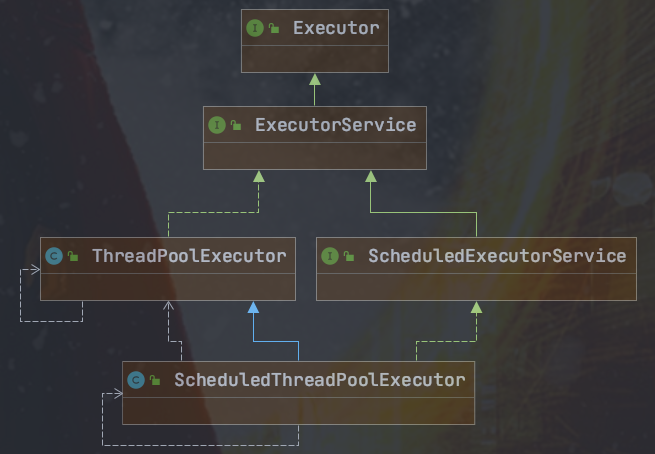
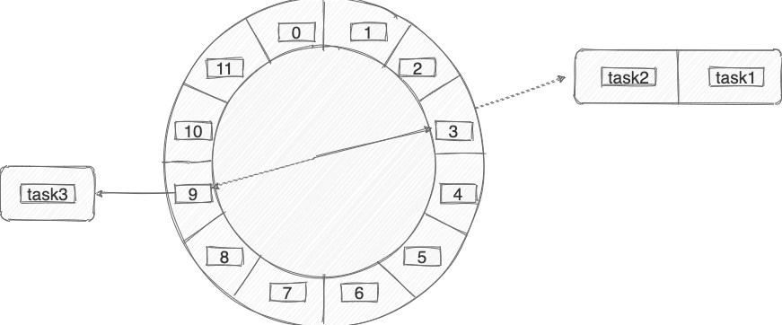
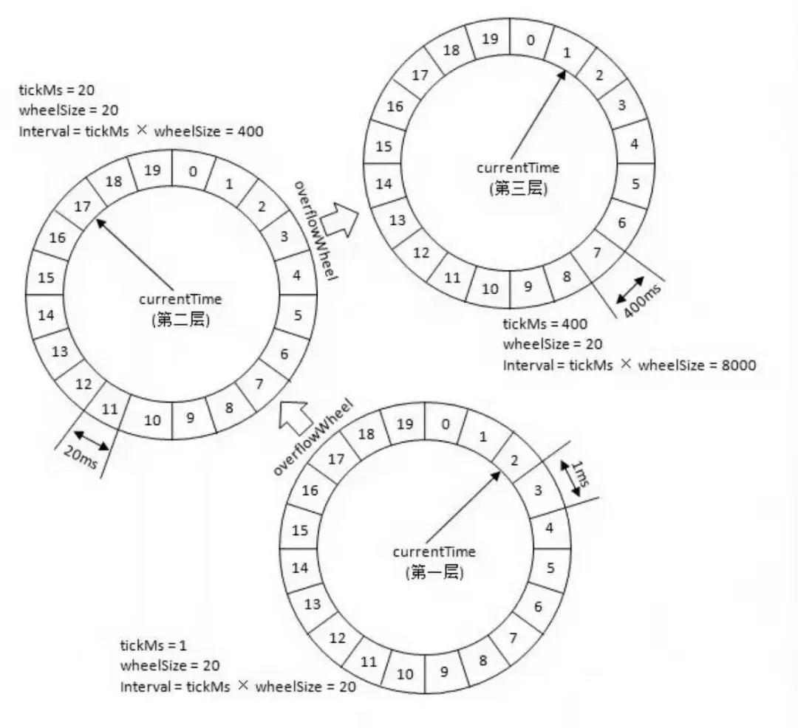
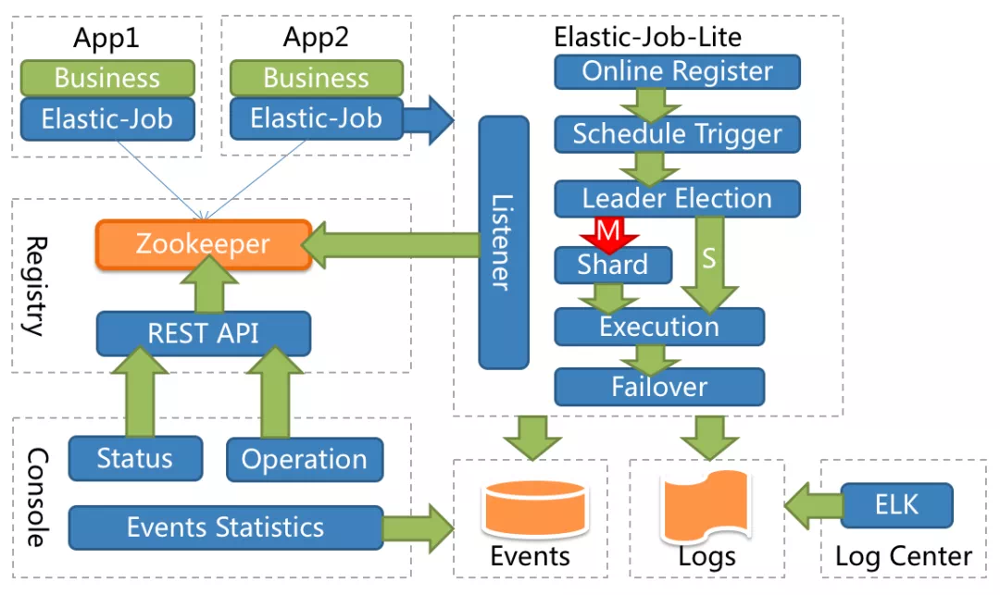
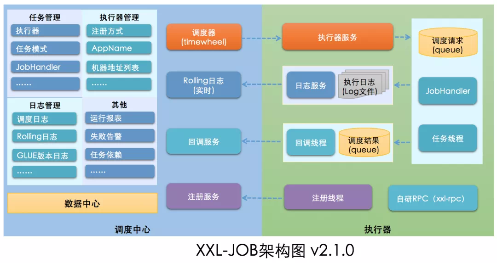
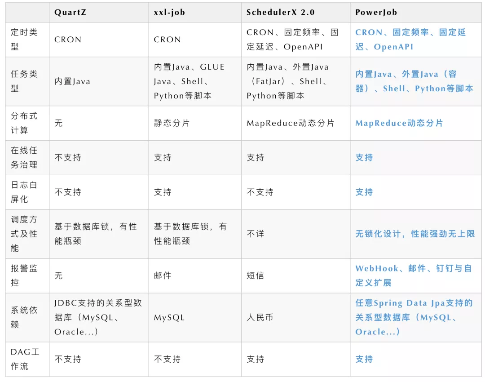

# 


# File

下载远程图片

```
 public static File downloadFile(String remoteUrl) throws IOException {
        // 构造URL
        URL url = new URL(remoteUrl);
        // 打开连接
        URLConnection con = url.openConnection();
        con.addRequestProperty("User-Agent", "Mozilla/5.0 (Macintosh; Intel Mac OS X 10_11_6) AppleWebKit/537.36 (KHTML, like Gecko) Chrome/53.0.2785.143 Safari/537.36");
        con.setConnectTimeout(50000);
        con.setReadTimeout(50000);
        // 输入流
        InputStream is = con.getInputStream();
        // 1K的数据缓冲
        byte[] bs = new byte[1024];
        // 读取到的数据长度
        int len;
        // 输出的文件流
        String fileSuffix = getFileSuffix(remoteUrl);
        File file = File.createTempFile("fatherTmpFile", fileSuffix);
        try (FileOutputStream os = new FileOutputStream(file, true)) {
            // 开始读取
            while ((len = is.read(bs)) != -1) {
                os.write(bs, 0, len);
            }
        }
        is.close();
        return file;
    }
    
public static String getFileSuffix(String filePath) {
        if (StringUtils.isBlank(filePath)) {
            return "";
        }
        return filePath.substring(filePath.lastIndexOf("."));
    }
```


## itextpdf

**图片转**pdf

```
<dependency>
            <groupId>com.itextpdf</groupId>
            <artifactId>itextpdf</artifactId>
            <version>5.4.2</version>
        </dependency>
```

```
/**
     * 等比压缩，获取压缩百分比
     *
     * @param height 图片的高度
     * @param weight 图片的宽度
     * @return 压缩百分比
     */
    private static int getPercent(float height, float weight) {
        float percent = 0.0F;
        if (height > weight) {
            percent = PageSize.A4.getHeight() / height * 100;
        } else {
            percent = PageSize.A4.getWidth() / weight * 100;
        }
        return Math.round(percent);
    }
```

```
 InputStream input4 = PDFController.class.getClassLoader().getResourceAsStream(source);
            ByteArrayOutputStream buffer = new ByteArrayOutputStream();
            int nRead;
            byte[] data = new byte[16384];
            while ((nRead = input4.read(data, 0, data.length)) != -1) {
                buffer.write(data, 0, nRead);
            }
            String pdfFileName = target;
            com.itextpdf.text.Document doc = new com.itextpdf.text.Document(PageSize.A4, 20, 20, 20, 20);
            PdfWriter.getInstance(doc, new FileOutputStream(pdfFileName));
            doc.open();
            doc.newPage();
            Image image = Image.getInstance(buffer.toByteArray());
            float height = image.getHeight();
            float width = image.getWidth();
            int percent = getPercent(height, width);
            image.setAlignment(Image.MIDDLE);
            image.scalePercent(percent);
            doc.add(image);
            doc.close();
```

## pdfbox-app

pdf分页

# poi

## poi原生

```
/**
 * 03版的maven坐标为poi           HSSFWorkbook
 * 07版的maven坐标为poi-ooxml     XSSFWorkbook
 * 共同接口 Workbook
 * @author lzf
 * @Date 2021/9/20
 */
public class POITest {
   //写
   @Test
   public void testA() throws IOException {
      //工作簿
      Workbook workbook = new XSSFWorkbook();
      //工作表
      Sheet sheet1 = workbook.createSheet("sheet1");
      //行
      Row row0 = sheet1.createRow(0);
      //列
      Cell cell01 = row0.createCell(0);
      cell01.setCellValue("aaaaa");
      Cell cell02 = row0.createCell(1);
      cell02.setCellValue("bbbbb");

      //行
      Row row1 = sheet1.createRow(1);
      //列
      Cell cell11 = row1.createCell(0);
      cell11.setCellValue("ccccc");
      Cell cell12 = row1.createCell(1);
      cell12.setCellValue("eeeee");

      //写入文件
      FileOutputStream fileOutputStream = new FileOutputStream("e:/testpoi.xlsx");
      workbook.write(fileOutputStream);
      fileOutputStream.close();
   }
   //读
   @Test
   public void testB() throws IOException {
      FileInputStream fileInputStream = new FileInputStream("e:/testpoi.xlsx");
      XSSFWorkbook workbook = new XSSFWorkbook(fileInputStream);
      XSSFSheet sheet = workbook.getSheetAt(0);
//    XSSFSheet xxx = workbook.getSheet("xxx");//根据名称获取sheet
      XSSFRow row0 = sheet.getRow(0);
      XSSFCell cell0 = row0.getCell(0);
      //根据类型读取
      System.out.println("cell0 = " + cell0.getStringCellValue());
      //获取style
      System.out.println("style = " + cell0.getCellStyle());
      fileInputStream.close();
   }
}
```

## easyexcel

https://github.com/alibaba/easyexcel/

```
<dependency>
    <groupId>com.alibaba</groupId>
    <artifactId>easyexcel</artifactId>
    <version>2.1.1</version>
</dependency>
```

本质是对poi进行封装 所以还需要引入poi

```
<dependency>
    <groupId>org.apache.poi</groupId>
    <artifactId>poi</artifactId>
</dependency>

<dependency>
    <groupId>org.apache.poi</groupId>
    <artifactId>poi-ooxml</artifactId>
</dependency>
```

创建实体类,与excel表格数据对应.

```
@Data
public class DemoData {
	//value设置excel表头名称 用于写 ,  index表示列数索引 用于读
	@ExcelProperty(value="学生编号",index = 0)
	private  Integer sno;
	@ExcelProperty(value="学生姓名",index = 1)
	private  String sname;
}
```

**写**

```java
//实现excel写操作
//1、设置写入文件地址和excel文件名称
String filename = "E:/Others Demo/guli_otherfile/excel/01.xlsx";

//2、调用easyexcel里面的方法实现写操作
//write方法两个参数:第一个参数文件路径名，第二个参数实体类class
EasyExcel.write(filename, DemoData.class).sheet("学生列表").doWrite(getData());
```

官方还有第二种更麻烦的写法,不推荐

**读**

这里使用的是监听器的方式读，好处：处理一行释放内存，不全部加载到内存。

```
public class ExcelListener extends AnalysisEventListener<DemoData> {
    //读取表头内容
    @Override
    public void invokeHeadMap(Map<Integer, String> headMap, AnalysisContext context) {
        System.out.println("表头： " + headMap);
    }
    //一行一行读取excel内容 从表头后开始
    @Override
    public void invoke(DemoData data, AnalysisContext analysisContext) {
        System.out.println("****"+data);
    }
    //读取完成之后
    @Override
    public void doAfterAllAnalysed(AnalysisContext analysisContext) {
    }
}
```

配置

```
//实现excel读操作
String filename = "E:/Others Demo/guli_otherfile/excel/01.xlsx";
EasyExcel.read(filename,DemoData.class,new ExcelListener()).sheet().doRead();
```

# AsposeSlides

##  转pdf

```
 <dependency>
            <groupId>org.springframework.boot</groupId>
            <artifactId>spring-boot-starter-web</artifactId>
        </dependency>
        <dependency>
            <groupId>aspose.slides</groupId>
            <artifactId>slides</artifactId>
            <version>19.3</version>
            <scope>system</scope>
            <systemPath>${basedir}/lib/aspose.slides-19.3.jar</systemPath>
        </dependency>
        <dependency>
            <groupId>com.aspose</groupId>
            <artifactId>aspose-cells</artifactId>
            <version>8.5.2</version>
            <scope>system</scope>
            <systemPath>${basedir}/lib/aspose-cells-8.5.2.jar</systemPath>
        </dependency>
        <dependency>
            <groupId>com.aspose</groupId>
            <artifactId>aspose-words</artifactId>
            <version>16.8.0</version>
            <scope>system</scope>
            <systemPath>${basedir}/lib/aspose-words-16.8.0-jdk16.jar</systemPath>
        </dependency>
```

license.xml

```
<License>
  <Data>
    <Products>
      <Product>Aspose.Total for Java</Product>      
    </Products>
    <EditionType>Enterprise</EditionType>
    <SubscriptionExpiry>20991231</SubscriptionExpiry>
    <LicenseExpiry>20991231</LicenseExpiry>
    <SerialNumber>8bfe198c-7f0c-4ef8-8ff0-acc3237bf0d7</SerialNumber>
  </Data>
  <Signature>sNLLKGMUdF0r8O1kKilWAGdgfs2BvJb/2Xp8p5iuDVfZXmhppo+d0Ran1P9TKdjV4ABwAgKXxJ3jcQTqE/2IRfqwnPf8itN8aFZlV3TJPYeD3yWE7IT55Gz6EijUpC7aKeoohTb4w2fpox58wWoF3SNp6sK6jDfiAUGEHYJ9pjU=</Signature>
</License>
```

```
private static InputStream license;

    /**
     * 获取license
     *
     * @return
     */
    public static boolean getLicense(int i) {
        boolean result = false;
        license = PDFController.class.getClassLoader().getResourceAsStream("license.xml");
        if (license != null) {
            try{
                if(i==3){
                    License asposeLic = new License();
                    asposeLic.setLicense(license);
                    result = true;
                } else if (i == 2) {
                    com.aspose.cells.License asposeLic = new com.aspose.cells.License();
                    asposeLic.setLicense(license);
                    result = true;
                } else{
                    com.aspose.words.License asposeLic = new com.aspose.words.License();
                    asposeLic.setLicense(license);
                    result = true;
                }
            }catch (Exception e){
                e.getStackTrace();
                return false;
            }
        }
        return result;
    }

    /**
     * 转PDF
     *
     * @return
     */
    public static void main(String[] args) {
        try {
            if(getLicense(1)){
                InputStream input1 = PDFController.class.getClassLoader().getResourceAsStream("test.docx");
                Document doc = new Document(input1);
                FileOutputStream out1 = new FileOutputStream("test1.pdf");
                doc.save(out1, com.aspose.words.SaveFormat.PDF);
                input1.close();
                out1.close();
            }

            if(getLicense(2)){
                InputStream input2 = PDFController.class.getClassLoader().getResourceAsStream("test.xlsx");
                Workbook workbook = new Workbook(input2);
                FileOutputStream out2 = new FileOutputStream("test2.pdf");
                PdfSaveOptions saveOptions = new PdfSaveOptions();
                //重点，设置所有列放在一页里，会自动适应宽度
                saveOptions.setAllColumnsInOnePagePerSheet(true);
                addBorder(workbook);
                workbook.save(out2,saveOptions);
            }

            if(getLicense(3)){
                InputStream input3 = PDFController.class.getClassLoader().getResourceAsStream("test.pptx");
                Presentation pres = new Presentation(input3);
                FileOutputStream out3 = new FileOutputStream("test3.pdf");
                pres.save(out3, SaveFormat.Pdf);
                input3.close();
                out3.close();
            }

        } catch (Exception e) {
            e.getStackTrace();
            return e.getMessage();
        }
        return "http://localhost:8080/test.pdf";
    }

    //给表格添加边框
    private void addBorder(Workbook excel){
        ////获取sheet集合
        WorksheetCollection worksheets = excel.getWorksheets();
        //Aspose.Cells.Style style = hg.GetStyle();
        Style style = excel.getStyles().get(excel.getStyles().add());
        //Setting the line style of the top border
        style.getBorders().getByBorderType(BorderType.TOP_BORDER).setLineStyle(CellBorderType.THIN);

        //Setting the color of the top border
        style.getBorders().getByBorderType(BorderType.TOP_BORDER).setColor(Color.getBlack());

        //Setting the line style of the bottom border
        style.getBorders().getByBorderType(BorderType.BOTTOM_BORDER).setLineStyle(CellBorderType.THIN);

        //Setting the color of the bottom border
        style.getBorders().getByBorderType(BorderType.BOTTOM_BORDER).setColor(Color.getBlack());


        //Setting the line style of the left border
        style.getBorders().getByBorderType(BorderType.LEFT_BORDER).setLineStyle(CellBorderType.THIN);

        //Setting the color of the left border
        style.getBorders().getByBorderType(BorderType.LEFT_BORDER).setColor(Color.getBlack());

        //Setting the line style of the right border
        style.getBorders().getByBorderType(BorderType.RIGHT_BORDER).setLineStyle(CellBorderType.THIN);

        //Setting the color of the right border
        style.getBorders().getByBorderType(BorderType.RIGHT_BORDER).setColor(Color.getBlack());

        style.setHorizontalAlignment(TextAlignmentType.CENTER);//文字居中

        for (int i = 0; i < worksheets.getCount(); i++)     //每一sheet
        {
            //worksheets[i].Cells.SetColumnWidth(1, 30);//设置列宽
            for (int j = 0; j < worksheets.get(i).getCells().getCount(); j++)  //sheet中的每一个单元格都采用这种风格
            {
                worksheets.get(i).getCells().setRowHeight(j, 20);//设置行高

                Cell hg = worksheets.get(i).getCells().get(j);
                hg.setStyle(style);
            }
        }
    }
```


### 转jpg

```
import com.aspose.slides.ISlide;
import com.aspose.slides.License;
import com.aspose.slides.Presentation;
import org.springframework.web.bind.annotation.*;

import javax.imageio.ImageIO;
import java.awt.image.BufferedImage;
import java.io.File;
import java.io.FileInputStream;
import java.io.InputStream;

@RestController
@RequestMapping("/api")
public class TestOperation {

    private static InputStream license;
    /**
     * 获取license
     *
     * @return
     */
    public static boolean getLicense() {

        boolean result = false;
        license = TestOperation.class.getClassLoader().getResourceAsStream("license.xml");
        if (license != null) {
            License aposeLic = new License();
            aposeLic.setLicense(license);
            result = true;
        }
        return result;
    }

    /**
     * 转Image
     *
     * @return
     */
    @PostMapping("/convertImage")
    public String convertImage() {
        // 验证License
        if (!getLicense()) {
            return "验证License失败";
        }
        String fileName = "data/CoreThink.pptx";
        File file = new File(fileName);
        if (!file.exists()) {
            return "转换文件不存在";
        }
        String filePath = file.getParent()+File.separator;
        String dest = filePath + getFileNameNoEx(file.getName())+"_JPG";
        File destPath = new File(dest);
        if (!destPath.exists()) {
            destPath.mkdir();
        }
        try {
            FileInputStream fileInput = new FileInputStream(fileName);
            Presentation pres = new Presentation(fileInput);
            int i;
            for (i = 0; i < pres.getSlides().size(); i++) {
                ISlide slide = pres.getSlides().get_Item(i);
                int height = (int)(pres.getSlideSize().getSize().getHeight()-150);
                int width = (int)(pres.getSlideSize().getSize().getWidth()-150);
                BufferedImage image = slide.getThumbnail(new java.awt.Dimension(width, height));
                //每一页输出一张图片
                File outImage = new File(dest+File.separator + (i+1) + ".JPG");
                ImageIO.write(image, "JPG", outImage);
            }
        } catch (Exception e) {
            return e.getMessage();
        }
        return "转换成功";
    }
    /**
     * 获取文件名，去除扩展名的
     *
     * @param filename
     * @return
     */
    private String getFileNameNoEx(String filename) {
        if ((filename != null) && (filename.length() > 0)) {
            int dot = filename.lastIndexOf('.');
            if ((dot > -1) && (dot < (filename.length()))) {
                return filename.substring(0, dot);
            }
        }
        return filename;
    }

}
```


# captcha

awt原生1:

```
public class RandomValidateCodeUtil {
    public static final String RANDOMCODEKEY = "RANDOMVALIDATECODEKEY";//放到session中的key
    private String randString = "0123456789";//随机产生只有数字的字符串 private String
    //private String randString = "ABCDEFGHIJKLMNOPQRSTUVWXYZ";//随机产生只有字母的字符串
    //private String randString = "0123456789ABCDEFGHIJKLMNOPQRSTUVWXYZ";//随机产生数字与字母组合的字符串
    private int width = 95;// 图片宽
    private int height = 25;// 图片高
    private int lineSize = 40;// 干扰线数量
    private int stringNum = 4;// 随机产生字符数量

    private static final Logger logger = LoggerFactory.getLogger(RandomValidateCodeUtil.class);

    private Random random = new Random();

    /**
     * 获得字体
     */
    private Font getFont() {
        return new Font("Fixedsys", Font.CENTER_BASELINE, 18);
    }

    /**
     * 获得颜色
     */
    private Color getRandColor(int fc, int bc) {
        if (fc > 255) {
            fc = 255;
        }
        if (bc > 255) {
            bc = 255;
        }
        int r = fc + random.nextInt(bc - fc - 16);
        int g = fc + random.nextInt(bc - fc - 14);
        int b = fc + random.nextInt(bc - fc - 18);
        return new Color(r, g, b);
    }

    /**
     * 生成随机图片
     */
    public void getRandcode(HttpServletRequest request, HttpServletResponse response) {
        HttpSession session = request.getSession();
        // BufferedImage类是具有缓冲区的Image类,Image类是用于描述图像信息的类
        BufferedImage image = new BufferedImage(width, height, BufferedImage.TYPE_INT_BGR);
        Graphics g = image.getGraphics();// 产生Image对象的Graphics对象,改对象可以在图像上进行各种绘制操作
        g.fillRect(0, 0, width, height);//图片大小
        g.setFont(new Font("Default", Font.ROMAN_BASELINE, 18));//字体大小
        g.setColor(getRandColor(110, 133));//字体颜色
        // 绘制干扰线
        for (int i = 0; i <= lineSize; i++) {
            drowLine(g);
        }
        // 绘制随机字符
        String randomString = "";
        for (int i = 1; i <= stringNum; i++) {
            randomString = drowString(g, randomString, i);
        }
        logger.info(randomString);
        //将生成的随机字符串保存到session中
        session.removeAttribute(RANDOMCODEKEY);
        session.setAttribute(RANDOMCODEKEY, randomString);
        g.dispose();
        try {
            // 将内存中的图片通过流动形式输出到客户端
            ImageIO.write(image, "JPEG", response.getOutputStream());
        } catch (Exception e) {
            logger.error("将内存中的图片通过流动形式输出到客户端失败>>>> ", e);
        }

    }

    /**
     * 绘制字符串
     */
    private String drowString(Graphics g, String randomString, int i) {
        g.setFont(getFont());
        g.setColor(new Color(random.nextInt(101), random.nextInt(111), random
                .nextInt(121)));
        String rand = String.valueOf(getRandomString(random.nextInt(randString
                .length())));
        randomString += rand;
        g.translate(random.nextInt(3), random.nextInt(3));
        g.drawString(rand, 13 * i, 16);
        return randomString;
    }

    /**
     * 绘制干扰线
     */
    private void drowLine(Graphics g) {
        int x = random.nextInt(width);
        int y = random.nextInt(height);
        int xl = random.nextInt(13);
        int yl = random.nextInt(15);
        g.drawLine(x, y, x + xl, y + yl);
    }

    /**
     * 获取随机的字符
     */
    public String getRandomString(int num) {
        return String.valueOf(randString.charAt(num));
    }
```

awt原生2:

```
public static void outputImage(int w, int h, OutputStream os, String code) throws IOException{  
        int verifySize = code.length();  
        BufferedImage image = new BufferedImage(w, h, BufferedImage.TYPE_INT_RGB);  
        Random rand = new Random();  
        Graphics2D g2 = image.createGraphics();  
        g2.setRenderingHint(RenderingHints.KEY_ANTIALIASING,RenderingHints.VALUE_ANTIALIAS_ON);  
        Color[] colors = new Color[5];  
        Color[] colorSpaces = new Color[] { Color.WHITE, Color.CYAN,  
                Color.GRAY, Color.LIGHT_GRAY, Color.MAGENTA, Color.ORANGE,  
                Color.PINK, Color.YELLOW };  
        float[] fractions = new float[colors.length];  
        for(int i = 0; i < colors.length; i++){  
            colors[i] = colorSpaces[rand.nextInt(colorSpaces.length)];  
            fractions[i] = rand.nextFloat();  
        }  
        Arrays.sort(fractions);  
          
        g2.setColor(Color.GRAY);// 设置边框色  
        g2.fillRect(0, 0, w, h);  
          
        Color c = getRandColor(200, 250);  
        g2.setColor(c);// 设置背景色  
        g2.fillRect(0, 2, w, h-4);  
          
        //绘制干扰线  
        Random random = new Random();  
        g2.setColor(getRandColor(160, 200));// 设置线条的颜色  
        for (int i = 0; i < 20; i++) {  
            int x = random.nextInt(w - 1);  
            int y = random.nextInt(h - 1);  
            int xl = random.nextInt(6) + 1;  
            int yl = random.nextInt(12) + 1;  
            g2.drawLine(x, y, x + xl + 40, y + yl + 20);  
        }  
          
        // 添加噪点  
        float yawpRate = 0.05f;// 噪声率  
        int area = (int) (yawpRate * w * h);  
        for (int i = 0; i < area; i++) {  
            int x = random.nextInt(w);  
            int y = random.nextInt(h);  
            int rgb = getRandomIntColor();  
            image.setRGB(x, y, rgb);  
        }  
          
        shear(g2, w, h, c);// 使图片扭曲  
  
        g2.setColor(getRandColor(100, 160));  
        int fontSize = h-4;  
        Font font = new Font("Algerian", Font.ITALIC, fontSize);  
        g2.setFont(font);  
        char[] chars = code.toCharArray();  
        for(int i = 0; i < verifySize; i++){  
            AffineTransform affine = new AffineTransform();  
            affine.setToRotation(Math.PI / 4 * rand.nextDouble() * (rand.nextBoolean() ? 1 : -1), (w / verifySize) * i + fontSize/2, h/2);  
            g2.setTransform(affine);  
            g2.drawChars(chars, i, 1, ((w-10) / verifySize) * i + 5, h/2 + fontSize/2 - 10);  
        }  
          
        g2.dispose();  
        ImageIO.write(image, "jpg", os);  
    }  
```


## kaptcha

```
<dependency>
    <groupId>com.github.penggle</groupId>
    <artifactId>kaptcha</artifactId>
    <version>${kaptcha.version}</version>
</dependency>
```

```
@Configuration
public class CaptchaConfig
{
//字符
    @Bean(name = "captchaProducer")
    public DefaultKaptcha getKaptchaBean()
    {
        DefaultKaptcha defaultKaptcha = new DefaultKaptcha();
        Properties properties = new Properties();
        // 是否有边框 默认为true 我们可以自己设置yes，no
        properties.setProperty(KAPTCHA_BORDER, "yes");
        // 验证码文本字符颜色 默认为Color.BLACK
        properties.setProperty(KAPTCHA_TEXTPRODUCER_FONT_COLOR, "black");
        // 验证码图片宽度 默认为200
        properties.setProperty(KAPTCHA_IMAGE_WIDTH, "160");
        // 验证码图片高度 默认为50
        properties.setProperty(KAPTCHA_IMAGE_HEIGHT, "60");
        // 验证码文本字符大小 默认为40
        properties.setProperty(KAPTCHA_TEXTPRODUCER_FONT_SIZE, "38");
        // KAPTCHA_SESSION_KEY
        properties.setProperty(KAPTCHA_SESSION_CONFIG_KEY, "kaptchaCode");
        // 验证码文本字符长度 默认为5
        properties.setProperty(KAPTCHA_TEXTPRODUCER_CHAR_LENGTH, "4");
        // 验证码文本字体样式 默认为new Font("Arial", 1, fontSize), new Font("Courier", 1, fontSize)
        properties.setProperty(KAPTCHA_TEXTPRODUCER_FONT_NAMES, "Arial,Courier");
        // 图片样式 水纹com.google.code.kaptcha.impl.WaterRipple 鱼眼com.google.code.kaptcha.impl.FishEyeGimpy 阴影com.google.code.kaptcha.impl.ShadowGimpy
        properties.setProperty(KAPTCHA_OBSCURIFICATOR_IMPL, "com.google.code.kaptcha.impl.ShadowGimpy");
        Config config = new Config(properties);
        defaultKaptcha.setConfig(config);
        return defaultKaptcha;
    }
//计算
    @Bean(name = "captchaProducerMath")
    public DefaultKaptcha getKaptchaBeanMath()
    {
        DefaultKaptcha defaultKaptcha = new DefaultKaptcha();
        Properties properties = new Properties();
        // 是否有边框 默认为true 我们可以自己设置yes，no
        properties.setProperty(KAPTCHA_BORDER, "yes");
        // 边框颜色 默认为Color.BLACK
        properties.setProperty(KAPTCHA_BORDER_COLOR, "105,179,90");
        // 验证码文本字符颜色 默认为Color.BLACK
        properties.setProperty(KAPTCHA_TEXTPRODUCER_FONT_COLOR, "blue");
        // 验证码图片宽度 默认为200
        properties.setProperty(KAPTCHA_IMAGE_WIDTH, "160");
        // 验证码图片高度 默认为50
        properties.setProperty(KAPTCHA_IMAGE_HEIGHT, "60");
        // 验证码文本字符大小 默认为40
        properties.setProperty(KAPTCHA_TEXTPRODUCER_FONT_SIZE, "35");
        // KAPTCHA_SESSION_KEY
        properties.setProperty(KAPTCHA_SESSION_CONFIG_KEY, "kaptchaCodeMath");
        // 验证码文本生成器
        properties.setProperty(KAPTCHA_TEXTPRODUCER_IMPL, "com.ruoyi.framework.config.KaptchaTextCreator");
        // 验证码文本字符间距 默认为2
        properties.setProperty(KAPTCHA_TEXTPRODUCER_CHAR_SPACE, "3");
        // 验证码文本字符长度 默认为5
        properties.setProperty(KAPTCHA_TEXTPRODUCER_CHAR_LENGTH, "6");
        // 验证码文本字体样式 默认为new Font("Arial", 1, fontSize), new Font("Courier", 1, fontSize)
        properties.setProperty(KAPTCHA_TEXTPRODUCER_FONT_NAMES, "Arial,Courier");
        // 验证码噪点颜色 默认为Color.BLACK
        properties.setProperty(KAPTCHA_NOISE_COLOR, "white");
        // 干扰实现类
        properties.setProperty(KAPTCHA_NOISE_IMPL, "com.google.code.kaptcha.impl.NoNoise");
        // 图片样式 水纹com.google.code.kaptcha.impl.WaterRipple 鱼眼com.google.code.kaptcha.impl.FishEyeGimpy 阴影com.google.code.kaptcha.impl.ShadowGimpy
        properties.setProperty(KAPTCHA_OBSCURIFICATOR_IMPL, "com.google.code.kaptcha.impl.ShadowGimpy");
        Config config = new Config(properties);
        defaultKaptcha.setConfig(config);
        return defaultKaptcha;
    }
}
```

```
/**
 * 验证码文本生成器
 * 
 * @author ruoyi
 */
public class KaptchaTextCreator extends DefaultTextCreator
{
    private static final String[] CNUMBERS = "0,1,2,3,4,5,6,7,8,9,10".split(",");

    @Override
    public String getText()
    {
        Integer result = 0;
        Random random = new Random();
        int x = random.nextInt(10);
        int y = random.nextInt(10);
        StringBuilder suChinese = new StringBuilder();
        int randomoperands = (int) Math.round(Math.random() * 2);
        if (randomoperands == 0)
        {
            result = x * y;
            suChinese.append(CNUMBERS[x]);
            suChinese.append("*");
            suChinese.append(CNUMBERS[y]);
        }
        else if (randomoperands == 1)
        {
            if (!(x == 0) && y % x == 0)
            {
                result = y / x;
                suChinese.append(CNUMBERS[y]);
                suChinese.append("/");
                suChinese.append(CNUMBERS[x]);
            }
            else
            {
                result = x + y;
                suChinese.append(CNUMBERS[x]);
                suChinese.append("+");
                suChinese.append(CNUMBERS[y]);
            }
        }
        else if (randomoperands == 2)
        {
            if (x >= y)
            {
                result = x - y;
                suChinese.append(CNUMBERS[x]);
                suChinese.append("-");
                suChinese.append(CNUMBERS[y]);
            }
            else
            {
                result = y - x;
                suChinese.append(CNUMBERS[y]);
                suChinese.append("-");
                suChinese.append(CNUMBERS[x]);
            }
        }
        else
        {
            result = x + y;
            suChinese.append(CNUMBERS[x]);
            suChinese.append("+");
            suChinese.append(CNUMBERS[y]);
        }
        suChinese.append("=?@" + result);
        return suChinese.toString();
    }
}
```

使用方式

```
String capText = captchaProducerMath.createText();
 //算术字符串
capStr = capText.substring(0, capText.lastIndexOf("@"));
            //结果
code = capText.substring(capText.lastIndexOf("@") + 1);
BufferedImage image = captchaProducerMath.createImage(capStr)

String capStr = captchaProducer.createText();
BufferedImage image = captchaProducer.createImage(capStr)
```

返回给前端的输出流

```
// 转换流信息写出
        FastByteArrayOutputStream os = new FastByteArrayOutputStream();
        try
        {
            ImageIO.write(image, "jpg", os);
        }
        catch (IOException e)
        {
          	//...
        }
       return Base64.encode(os.toByteArray());
```

前端图片路径前面加`data:image/gif;base64,`

## easy-captcha

```
<dependency>
    <groupId>com.github.whvcse</groupId>
    <artifactId>easy-captcha</artifactId>
    <version>1.6.2</version>
</dependency>
```

```
// 三个参数分别为宽、高、位数
SpecCaptcha captcha = new SpecCaptcha(150, 40, 4);
// 设置类型 数字和字母混合
captcha.setCharType(Captcha.TYPE_DEFAULT);
//设置字体
captcha.setCharType(Captcha.FONT_9);
 //获取验证码内容，将其存入session
 httpServletRequest.getSession().setAttribute("verifyCode", captcha.text().toLowerCase());
 // 输出图片流
       captcha.out(httpServletResponse.getOutputStream());
```

## Hutool

    @RequestMapping("/getCode")
    public void getCode(HttpServletResponse response) {
        // 随机生成 4 位验证码
        RandomGenerator randomGenerator = new RandomGenerator("0123456789", 4);
        // 定义图片的显示大小
        LineCaptcha lineCaptcha = CaptchaUtil.createLineCaptcha(110, 36);
        response.setContentType("image/jpeg");
        response.setHeader("Pragma", "No-cache");
        try {
            // 调用父类的 setGenerator() 方法，设置验证码的类型
            lineCaptcha.setGenerator(randomGenerator);
            // 输出到页面
            lineCaptcha.write(response.getOutputStream());
            // 关闭流
            response.getOutputStream().close();
        } catch (IOException e) {
            e.printStackTrace();
        }
    }
# Lombok

**RequiredArgsConstructor**

在我们写controller或者Service层的时候，需要注入很多的mapper接口或者另外的service接口，这时候就会写很多的@Autowired注解，代码看起来很乱.

写在类上可以代替@Autowired注解，需要注意的是在注入时需要用final定义，或者使用@notnull注解

**Builder**

使用Builder模式来构建对象

```
/** 请求类 */
@Builder
public class SampleRequest {
    private String paramOne;
    private int paramTwo;
    private boolean paramThree;
}

/** 响应类 */
@Builder
public class SampleResponse {
    private boolean success;
}

/** 服务接口 */
public interface SampleFacade {
    Result<SampleResponse> rpcOne(RequestParam<SampleRequest>);
}

/** 调用 */
public void testRpcOne() {
    SampleRequest request =
          SampleRequest.builder().paramOne("one").paramTwo(2).paramThree(true).build();
    Result<SampleResponse> response = sampleFacade.rpcOne(request);
}
```


**SneakyThrows**

自动捕获异常转换为RuntimeException再次抛出

```
@Target({ElementType.METHOD, ElementType.CONSTRUCTOR})
@Retention(RetentionPolicy.SOURCE)
public @interface SneakyThrows {
    Class<? extends Throwable>[] value() default {Throwable.class};
    |
```

如

```
public class SneakyThrowsExample implements Runnable {
  @SneakyThrows(UnsupportedEncodingException.class)
  public String utf8ToString(byte[] bytes) {
    return new String(bytes, "UTF-8");
  }
  
  @SneakyThrows
  public void run() {
    throw new Throwable();
  }
}
```

编译后生成的代码为

```
public class SneakyThrowsExample implements Runnable {
  public String utf8ToString(byte[] bytes) {
    try {
      return new String(bytes, "UTF-8");
    } catch (UnsupportedEncodingException e) {
      throw Lombok.sneakyThrow(e);
    }
  }
  
  public void run() {
    try {
      throw new Throwable();
    } catch (Throwable t) {
      throw Lombok.sneakyThrow(t);
    }
  }
}
```

可以看出整个方法其实最核心的逻辑是`throw (T)t;`，利用泛型将我们传入的Throwable强转为RuntimeException。虽然事实上我们不是RuntimeException。但是没关系。因为JVM并不关心这个。泛型最后存储为字节码时并没有泛型的信息。这样写只是为了骗过javac编译器。源码中注释有解释。

# Scheduled

## Timer和ScheduledExecutorService

`java.util.Timer`是 JDK 1.3 开始就已经支持的一种定时任务的实现方式。

`Timer` 内部使用一个叫做 `TaskQueue` 的类存放定时任务，它是一个基于最小堆实现的优先级队列。`TaskQueue` 会按照任务距离下一次执行时间的大小将任务排序，保证在堆顶的任务最先执行。这样在需要执行任务时，每次只需要取出堆顶的任务运行即可！

`Timer` 使用起来比较简单，通过下面的方式我们就能创建一个 1s 之后执行的定时任务。

```java
// 示例代码：
TimerTask task = new TimerTask() {
    public void run() {
        System.out.println("当前时间: " + new Date() + "n" +
                "线程名称: " + Thread.currentThread().getName());
    }
};
System.out.println("当前时间: " + new Date() + "n" +
        "线程名称: " + Thread.currentThread().getName());
Timer timer = new Timer("Timer");
long delay = 1000L;
timer.schedule(task, delay);


//输出：
当前时间: Fri May 28 15:18:47 CST 2021n线程名称: main
当前时间: Fri May 28 15:18:48 CST 2021n线程名称: Timer
```

不过其缺陷较多，比如一个 `Timer` 一个线程，这就导致 `Timer` 的任务的执行只能串行执行，一个任务执行时间过长的话会影响其他任务（性能非常差），再比如发生异常时任务直接停止（`Timer` 只捕获了 `InterruptedException` ）。

`Timer` 类上的有一段注释是这样写的：


```java
 * This class does not offer real-time guarantees: it schedules
 * tasks using the <tt>Object.wait(long)</tt> method.
 *Java 5.0 introduced the {@code java.util.concurrent} package and
 * one of the concurrency utilities therein is the {@link
 * java.util.concurrent.ScheduledThreadPoolExecutor
 * ScheduledThreadPoolExecutor} which is a thread pool for repeatedly
 * executing tasks at a given rate or delay.  It is effectively a more
 * versatile replacement for the {@code Timer}/{@code TimerTask}
 * combination, as it allows multiple service threads, accepts various
 * time units, and doesn't require subclassing {@code TimerTask} (just
 * implement {@code Runnable}).  Configuring {@code
 * ScheduledThreadPoolExecutor} with one thread makes it equivalent to
 * {@code Timer}.
```

大概的意思就是： `ScheduledThreadPoolExecutor` 支持多线程执行定时任务并且功能更强大，是 `Timer` 的替代品。

**ScheduledExecutorService**

`ScheduledExecutorService` 是一个接口，有多个实现类，比较常用的是 `ScheduledThreadPoolExecutor` 。



`ScheduledThreadPoolExecutor` 本身就是一个线程池，支持任务并发执行。并且，其内部使用 `DelayQueue` 作为任务队列。

```
// 示例代码：
TimerTask repeatedTask = new TimerTask() {
    @SneakyThrows
    public void run() {
        System.out.println("当前时间: " + new Date() + "n" +
                "线程名称: " + Thread.currentThread().getName());
    }
};
System.out.println("当前时间: " + new Date() + "n" +
        "线程名称: " + Thread.currentThread().getName());
ScheduledExecutorService executor = Executors.newScheduledThreadPool(3);
long delay  = 1000L;
long period = 1000L;
executor.scheduleAtFixedRate(repeatedTask, delay, period, TimeUnit.MILLISECONDS);
Thread.sleep(delay + period * 5);
executor.shutdown();
//输出：
当前时间: Fri May 28 15:40:46 CST 2021n线程名称: main
当前时间: Fri May 28 15:40:47 CST 2021n线程名称: pool-1-thread-1
当前时间: Fri May 28 15:40:48 CST 2021n线程名称: pool-1-thread-1
当前时间: Fri May 28 15:40:49 CST 2021n线程名称: pool-1-thread-2
当前时间: Fri May 28 15:40:50 CST 2021n线程名称: pool-1-thread-2
当前时间: Fri May 28 15:40:51 CST 2021n线程名称: pool-1-thread-2
当前时间: Fri May 28 15:40:52 CST 2021n线程名称: pool-1-thread-2
```

不论是使用 `Timer` 还是 `ScheduledExecutorService` 都无法使用 Cron 表达式指定任务执行的具体时间。


## Spring Task

Spring Task :在Spring Boot的主类中加入`@EnableScheduling`注解，启用定时任务的配置.

底层基于JDK的ScheduledThreadPoolExecutor线程池来实现的.

创建定时任务实现类:

```
@Component
public class ScheduledTasks {

    private static final SimpleDateFormat dateFormat = new SimpleDateFormat("HH:mm:ss");

    @Scheduled(fixedRate = 5000)
    public void reportCurrentTime() {
        System.out.println("现在时间：" + dateFormat.format(new Date()));
    }

}
```

- `@Scheduled(fixedRate = 5000)` ：上一次开始执行时间点之后5秒再执行
- `@Scheduled(fixedDelay = 5000)` ：上一次执行完毕时间点之后5秒再执行
- `@Scheduled(initialDelay=1000, fixedRate=5000)` ：第一次延迟1秒后执行，之后按fixedRate的规则每5秒执行一次
- `@Scheduled(cron="*/5 * * * * *")` ：通过cron表达式定义规则

该注解的所有属性如下:

- cron：通过cron表达式来配置执行规则
- zone：cron表达式解析时使用的时区
- fixedDelay：上一次执行结束到下一次执行开始的间隔时间（单位：ms）
- fixedDelayString：上一次任务执行结束到下一次执行开始的间隔时间，使用java.time.Duration#parse解析
- fixedRate：以固定间隔执行任务，即上一次任务执行开始到下一次执行开始的间隔时间（单位：ms），若在调度任务执行时，上一次任务还未执行完毕，会加入worker队列，等待上一次执行完成后立即执行下一次任务
- fixedRateString：与fixedRate逻辑一致，只是使用java.time.Duration#parse解析
- initialDelay：首次任务执行的延迟时间
- initialDelayString：首次任务执行的延迟时间，使用java.time.Duration#parse解析

`@Scheduled`注解更偏向于使用在单实例自身维护相关的一些定时任务上会更为合理一些，比如：定时清理服务实例某个目录下的文件、定时上传本实例的一些统计数据等。

**问题:**

这种模式实现的定时任务缺少在集群环境下的协调机制。

假设，我们要实现一个定时任务，用来每天网上统计某个数据然后累加到原始数据上。我们开发测试的时候不会有问题，因为都是单进程在运行的。但是，当我们把这样的定时任务部署到生产环境时，为了更高的可用性，启动多个实例是必须的。此时，时间一到，所有启动的实例就会同时开始执行这个任务。那么问题也就出现了，因为有累加操作，最终我们的结果就会出现问题。

即在集群环境下的时候，如果任务的执行或操作依赖一些共享资源的话，就会存在竞争关系。如果不引入分布式锁等机制来做调度的话，就可能出现预料之外的执行结果。

解决这样问题的方式很多种，比较通用的就是采用分布式锁的方式，让同类任务之前的时候以分布式锁的方式来控制执行顺序，比如：使用Redis、Zookeeper等具备分布式锁功能的中间件配合就能很好的帮助我们来协调这类任务在集群模式下的执行规则。

可以自己指定线程池

```
@Bean
    public TaskScheduler taskScheduler() {
        ThreadPoolTaskScheduler taskScheduler = new ThreadPoolTaskScheduler();
        taskScheduler.setPoolSize(5);
        return taskScheduler;
    }
```

## 时间轮

时间轮简单来说就是一个环形的队列（底层一般基于数组实现），队列中的每一个元素（时间格）都可以存放一个定时任务列表。

时间轮中的每个时间格代表了时间轮的基本时间跨度或者说时间精度，加入时间一秒走一个时间格的话，那么这个时间轮的最高精度就是 1 秒（也就是说 3 s 和 3.9s 会在同一个时间格中）。

下图是一个有 12 个时间格的时间轮，转完一圈需要 12 s。当我们需要新建一个 3s 后执行的定时任务，只需要将定时任务放在下标为 3 的时间格中即可。当我们需要新建一个 9s 后执行的定时任务，只需要将定时任务放在下标为 9 的时间格中即可。



那当我们需要创建一个 13s 后执行的定时任务怎么办呢？这个时候可以引入一叫做 **圈数/轮数** 的概念，也就是说这个任务还是放在下标为 3 的时间格中， 不过它的圈数为 2 。

除了增加圈数这种方法之外，还有一种 **多层次时间轮** （类似手表），Kafka 采用的就是这种方案。



上图的时间轮，第 1 层的时间精度为 1 ，第 2 层的时间精度为 20 ，第 3 层的时间精度为 400。假如我们需要添加一个 350s 后执行的任务 A 的话（当前时间是 0s），这个任务会被放在第 2 层（因为第二层的时间跨度为 20*20=400>350）的第 350/20=17 个时间格子。

当第一层转了 17 圈之后，时间过去了 340s ，第 2 层的指针此时来到第 17 个时间格子。此时，第 2 层第 17 个格子的任务会被移动到第 1 层。

任务 A 当前是 10s 之后执行，因此它会被移动到第 1 层的第 10 个时间格子。

这里在层与层之间的移动也叫做时间轮的升降级。参考手表来理解就好！

**时间轮比较适合任务数量比较多的定时任务场景，它的任务写入和执行的时间复杂度都是 0（1）**

## quartz

https://www.w3cschool.cn/quartz_doc/

```
<dependency>
    <groupId>org.quartz-scheduler</groupId>
    <artifactId>quartz</artifactId>
</dependency>
```

> 若依(搭配mysql使用)

## Elastic Job

Elastic Job的前生是当当开源的一款基于Quartz开发的分布式任务调度框架，而目前已经加入到了Apache基金会。

该项目下有两个分支：ElasticJob-Lite和ElasticJob-Cloud。 ElasticJob-Lite是一个轻量级的任务管理方案，而 ElasticJob-Cloud则相对重一些，因为它使用容器来管理任务和隔离资源。

```
<dependency>
        <groupId>org.apache.shardingsphere.elasticjob</groupId>
        <artifactId>elasticjob-lite-spring-boot-starter</artifactId>
        <version>3.0.0</version>
    </dependency>
```

创建任务

```
@Slf4j
@Service
public class MySimpleJob implements SimpleJob {
    @Override
    public void execute(ShardingContext context) {
        log.info("MySimpleJob start : didispace.com {}", System.currentTimeMillis());
    }
}
```

配置文件

```
elasticjob.reg-center.server-lists=localhost:2181
elasticjob.reg-center.namespace=didispace

elasticjob.jobs.my-simple-job.elastic-job-class=com.didispace.chapter72.MySimpleJob
elasticjob.jobs.my-simple-job.cron=0/5 * * * * ?
elasticjob.jobs.my-simple-job.sharding-total-count=1
```

第一部分：`elasticjob.reg-center`开头的，主要配置elastic job的注册中心和namespace.  因为这里需要用到ZooKeeper来协调分布式环境下的任务调度。所以，你需要先在本地安装ZooKeeper，然后启动它

第二部分：任务配置，以`elasticjob.jobs`开头，这里的`my-simple-job`是任务的名称，根据你的喜好命名即可，但不要重复。任务的下的配置`elastic-job-class`是任务的实现类，`cron`是执行规则表达式，`sharding-total-count`是任务分片的总数。我们可以通过这个参数来把任务切分，实现并行处理。这里先设置为1，后面我们另外讲分片的使用。

通过 **-Dserver.port=8081** 改变端口的方式启动多个应用.

此时，在回头看看之前第一个启动的应用，日志输出停止了。由于我们设置了分片总数为1，所以这个任务启动之后，只会有一个实例接管执行。这样就避免了多个进行同时重复的执行相同逻辑而产生问题的情况。同时，这样也支持了任务执行的高可用。比如：可以尝试把第二个启动的应用（正在打印日志的）终止掉。可以发现，第一个启动的应用（之前已经停止输出日志）继续开始打印任务日志了。

在整个实现过程中，我们并没有自己手工的去编写任何的分布式锁等代码去实现任务调度逻辑，只需要关注任务逻辑本身，然后通过配置分片的方式来控制任务的分割，就可以轻松的实现分布式集群环境下的定时任务管理了。是不是在复杂场景下，这种方式实现起来要比`@Scheduled`更方便呢？

**无配置文件方式:**

```
@Component@ElasticJobConf(name = "dayJob", cron = "0/10 * * * * ?", shardingTotalCount = 2,        shardingItemParameters = "0=AAAA,1=BBBB", description = "简单任务", failover = true)public class TestJob implements SimpleJob {    @Override    public void execute(ShardingContext shardingContext) {        log.info("TestJob任务名：【{}】, 片数：【{}】, param=【{}】", shardingContext.getJobName(), shardingContext.getShardingTotalCount(),                shardingContext.getShardingParameter());    }}
```


**分片配置**

分布式任务解决了使用`@Scheduled`来实现时候存在的竞争问题，同时也实现了定时任务的高可用执行。

然而，还有一类问题是我们在做定时任务时候容易出现的，就是任务执行速度时间过长；同时，为了实现定时任务的高可用，还启动了很多任务实例，但每个任务执行时候就一个实例在跑，资源利用率不高。

使用Elastic Job的分片配置，来为任务执行加加速，资源利用抬抬高的目标

创建分片执行任务

```
@Slf4j@Servicepublic class MyShardingJob implements SimpleJob {    @Override    public void execute(ShardingContext context) {        switch (context.getShardingItem()) {            case 0:                log.info("分片1：执行任务");                break;            case 1:                log.info("分片2：执行任务");                break;            case 2:                log.info("分片3：执行任务");                break;        }    }}
```

这里通过`switch`来判断当前任务上下文的sharding-item值来执行不同的分片任务。sharding-item的值取决于后面将要配置的分片总数，但注意是从0开始计数的。 这里仅采用了日志打印的方式，来展示分片效果，真正实现业务逻辑的时候，一定记得根据分片数量对执行任务也要做分片操作的设计。比如：你可以根据批量任务的id求摩的方式来区分不同分片处理不同的数据，以避免重复执行而出现问题。

配置文件:

```
elasticjob.jobs.my-sharding-job.elastic-job-class=com.didispace.chapter73.MyShardingJobelasticjob.jobs.my-sharding-job.cron=0/5 * * * * ?elasticjob.jobs.my-sharding-job.sharding-total-count=3
```

在启动一个实例时,轮询输出.

当启动两个实例时,每个间隔的分片个(3)任务随机由不同实例处理.


**namespace防止任务名冲突**

```
org.apache.shardingsphere.elasticjob.infra.exception.JobConfigurationException: Job conflict with register center. The job 'my-simple-job' in register center's class is 'com.didispace.chapter72.MySimpleJob', your job class is 'com.didispace.chapter74.MySimpleJob'
```

根据错误消息`Job conflict with register center. The job 'my-simple-job' in register center's`，初步判断是ZooKeeper中存储的任务配置出现冲突：任务名一样，但实现类不同。

经过一番交流，原来他是使用公司测试环境的ZooKeeper来写的例子做测试，同时之前有同事（也是DD的读者）也写过类似的任务，因为配置的任务名称是拷贝的，所以出现了任务名称相对，但实现类不同的情况。

实际上，如果我们在一个大一些的团队做开发的时候，只要存在多系统的话，那么定时任务的重名其实是很有可能发生。比如：很多应用都可能存在一些定时清理某些资源的任务，就很可能起一样的名字，然后注册到同一个ZooKeeper，最后出现冲突。 那么有什么好办法来解决这个问题吗？

**方法一：任务创建的统一管理**

最原始的处理方法，就是集中的管理任务创建流程，比如：可以开一个Wiki页面，所有任务在这个页面上登记，每个人登记的时候，可以查一下想起的名字是否已经存在。如果存在了就再想一个名字，并做好登记。

这种方法很简单，也很好理解。但存在的问题是，当任务非常非常多的时候，这个页面内容就很大，维护起来也是非常麻烦的。

**方法二：巧用Elastic Job的namespace属性来隔离任务名称**

回忆一下之前第一篇写定时任务的时候，关于注册中心的配置是不是有下面两项：

```
elasticjob.reg-center.server-lists=localhost:2181
elasticjob.reg-center.namespace=didispace
```

第一个`elasticjob.reg-center.server-lists`不多说，就是ZooKeeper的访问地址。这里要重点讲的就是第二个参数`elasticjob.reg-center.namespace`。

其实在ZooKeeper中注册任务的时候，真正冲突的并不纯粹是因为任务名称，而是namespace + 任务名称，全部一样，才会出现问题。

所以，我们只需要把每个应用创建的任务都隔离在自己独立的namespace里，那么是不是就不会和其他应用出现冲突了呢？

最后，我给出了下面这样的建议：

```
spring.application.name=chapter74

elasticjob.reg-center.server-lists=localhost:2181
elasticjob.reg-center.namespace=${spring.application.name}
```

即：将定时任务服务的`elasticjob.reg-center.namespace`设置为当前Spring Boot应用的名称一致`spring.application.name`。

通常，我们在规划各个Spring Boot应用的时候，都会做好唯一性的规划，这样未来注册到Eureka、Nacos等注册中心的时候，也可以保证唯一。

利用好这个唯一参数，也可以方便的帮我们把各个应用的定时任务也都隔离出来，也就解决了文章开头，我们所说的场景了。


**详细**

https://shardingsphere.apache.org/elasticjob/index_zh.html

上述功能只是elastic job的简单功能.

它还具有:

弹性调度,资源分配,作业治理,作业依赖,作业开放生态,可视化管控端等功能.

Elastic-Job没有调度中心概念,而是使用zk作为注册中心,负责协调分配任务到不同节点上




## XXL-JOB



https://www.xuxueli.com/xxl-job/

**简单使用**

从上图可以看出，XXL-JOB 由 调度中心 和 执行器 两大部分组成。调度中心主要负责任务管理、执行器管理以及日志管理。执行器主要是接收调度信号并处理。另外，调度中心进行任务调度时，是通过自研 RPC 来实现的。

不同于 Elastic-Job 的去中心化设计， XXL-JOB 的这种设计也被称为中心化设计（调度中心调度多个执行器执行任务）。

和 Quzrtz 类似 XXL-JOB 也是基于数据库锁调度任务，存在性能瓶颈。不过，一般在任务量不是特别大的情况下，没有什么影响的，可以满足绝大部分公司的要求。

不要被 XXL-JOB 的架构图给吓着了，实际上，我们要用 XXL-JOB 的话，只需要重写 IJobHandler 自定义任务执行逻辑就可以了，非常易用！

```
@JobHandler(value="myApiJobHandler")
@Component
public class MyApiJobHandler extends IJobHandler {

    @Override
    public ReturnT<String> execute(String param) throws Exception {
        //......
        return ReturnT.SUCCESS;
    }
}
```

还可以直接基于注解定义任务

```
@XxlJob("myAnnotationJobHandler")
public ReturnT<String> myAnnotationJobHandler(String param)throws Exception {
        //......
        return ReturnT.SUCCESS;
    }
```

还可以使用其内置的UI管理控制台


## PowerJob


## 分布式定时任务和技术选型



定时任务的技术选型 ：XXL-JOB 2015 年推出，已经经过了很多年的考验。XXL-JOB 轻量级，并且使用起来非常简单。虽然存在性能瓶颈，但是，在绝大多数情况下，对于企业的基本需求来说是没有影响的。PowerJob 属于分布式任务调度领域里的新星，其稳定性还有待继续考察。ElasticJob 由于在架构设计上是基于 Zookeeper ，而 XXL-JOB 是基于数据库，性能方面的话，ElasticJob 略胜一筹。

# Bean

## MapStruct

实体映射工具类

https://mapstruct.org/

`@Mapper` 注解的 `componentModel` 属性用于指定自动生成的接口实现类的组件类型:

- default: 这是默认的情况，mapstruct 不使用任何组件类型, 可以通过Mappers.getMapper(Class)方式获取自动生成的实例对象。
- cdi: the generated mapper is an application-scoped CDI bean and can be retrieved via @Inject
- spring: 生成的实现类上面会自动添加一个@Component注解，可以通过Spring的 @Autowired方式进行注入
- jsr330: 生成的实现类上会添加@javax.inject.Named 和@Singleton注解，可以通过 @Inject注解获取

**当映射的类型不一致时**

,可以在mapper的方法上指定处理该类型映射的方法(静态)

```
@Mappings({
            @Mapping(target = "createTime", expression = "java(com.java.mmzsblog.util.DateTransform.strToDate(source.getCreateTime()))"),
    })
UserVO3 toConvertVO3(User source);

public class DateTransform {
    public static LocalDateTime strToDate(String str){
        DateTimeFormatter df = DateTimeFormatter.ofPattern("yyy-MM-dd HH:mm:ss");
        return LocalDateTime.parse("2018-01-12 17:07:05",df);
    }

}
```

**当字段名不一致时**

```
@Mappings({
            @Mapping(source = "id", target = "userId"),
            @Mapping(source = "name", target = "userName")
    })
```


# oshi软硬件监控

```
@Bean
public SystemInfo systemInfo()
{
    return new SystemInfo();
}
```

```
//获取处理器
CentralProcessor centralProcessor = systemInfo.getHardware().getProcessor();
//获取处理器名称 以@分隔频率
String name = centralProcessor.getProcessorIdentifier().getName();
//获取核心数
int coreCount = centralProcessor.getLogicalProcessorCount();
//获取时钟频率 是Long数组   
Long[] clockSpeed = centralProcessor.getCurrentFreq();
//是否64位
Boolean isCpu64bit = centralProcessor.getProcessorIdentifier().isCpu64bit();
```

解析时钟频率方法  相当于使用处理器名称@后面的内容

```
private String getConvertedFrequency(long[] hertzArray)
{
    long totalFrequency = Arrays.stream(hertzArray).sum();
    long hertz = totalFrequency / hertzArray.length;

    if ((hertz / 1E+6) > 999)
    {
        return (Math.round((hertz / 1E+9) * 10.0) / 10.0) + " GHz";
    }
    else
    {
        return Math.round(hertz / 1E+6) + " MHz";
    }
}
```

```
//获取系统信息
OperatingSystem operatingSystem = systemInfo.getOperatingSystem();
OperatingSystem.OSVersionInfo osVersionInfo = systemInfo.getOperatingSystem().getVersionInfo();
//系统完整名字 系统+版本数字+旗舰版本
operatingSystem.getFamily() + " " + osVersionInfo.getVersion() + ", " + osVersionInfo.getCodeName()
//操作系统位数
operatingSystem.getBitness()

//文件系统
FileSystem fileSystem = operatingSystem.getFileSystem();
// 相当于分盘列表
List<OSFileStore> fsArray = fileSystem.getFileStores();
```

```
//获取内存信息
GlobalMemory globalMemory = systemInfo.getHardware().getMemory();
//获取内容容量
long memoryTotal = globalMemory.getTotal();
//获取内存信息  List  多少条内存
List<PhysicalMemory>  physicalMemory = globalMemory.getPhysicalMemory();
//获取该内存条类型  DDR4
physicalMemory.get(0).getMemoryType()
```

内存容量转换

```
private String getConvertedCapacity(long bits)
{
    if ((bits / 1.049E+6) > 999)
    {
        if ((bits / 1.074E+9) > 999)
        {
            return (Math.round((bits / 1.1E+12) * 10.0) / 10.0) + " TiB";
        }
        else
        {
            return Math.round(bits / 1.074E+9) + " GiB";
        }
    }
    else
    {
        return Math.round(bits / 1.049E+6) + " MiB";
    }
}
```

```
//获取硬盘信息
List<HWDiskStore> hwDiskStores = systemInfo.getHardware().getDiskStores();
//获取磁盘名
hwDiskStores.get(0).getModel()
//磁盘总容量
hwDiskStores.stream().mapToLong(HWDiskStore::getSize).sum();
```

```
获取系统时间以及系统时间计算方式
long uptimeInSeconds = systemInfo.getOperatingSystem().getSystemUptime();

uptimeDto.setDays(String.format("%02d", (int) Math.floor(uptimeInSeconds / 86400)));
uptimeDto.setHours(String.format("%02d", (int) Math.floor((uptimeInSeconds % 86400) / 3600)));
uptimeDto.setMinutes(String.format("%02d", (int) Math.floor((uptimeInSeconds / 60) % 60)));
uptimeDto.setSeconds(String.format("%02d", (int) Math.floor(uptimeInSeconds % 60)));
```

//获取使用率

```
/**
     * 获取cpul
     *
     * @return int that display processor usage
     */
private int getProcessor()
{
    CentralProcessor centralProcessor = systemInfo.getHardware().getProcessor();

    long[] prevTicksArray = centralProcessor.getSystemCpuLoadTicks();
    long prevTotalTicks = Arrays.stream(prevTicksArray).sum();
    long prevIdleTicks = prevTicksArray[CentralProcessor.TickType.IDLE.getIndex()];

    Util.sleep(1000);

    long[] currTicksArray = centralProcessor.getSystemCpuLoadTicks();
    long currTotalTicks = Arrays.stream(currTicksArray).sum();
    long currIdleTicks = currTicksArray[CentralProcessor.TickType.IDLE.getIndex()];

    return (int) Math.round((1 - ((double) (currIdleTicks - prevIdleTicks)) / ((double) (currTotalTicks - prevTotalTicks))) * 100);
}

/**
 * 获取内存使用率
 *
 * @return int that display ram usage
 */
private int getRam()
{
    GlobalMemory globalMemory = systemInfo.getHardware().getMemory();

    long totalMemory = globalMemory.getTotal();
    long availableMemory = globalMemory.getAvailable();

    return (int) Math.round(100 - (((double) availableMemory / totalMemory) * 100));
}

/**
 * 获取硬盘使用率
 *
 * @return int that display storage usage
 */
private int getStorage()
{
    FileSystem fileSystem = systemInfo.getOperatingSystem().getFileSystem();

    long totalStorage = fileSystem.getFileStores().stream().mapToLong(OSFileStore::getTotalSpace).sum();
    long freeStorage = fileSystem.getFileStores().stream().mapToLong(OSFileStore::getFreeSpace).sum();

    return (int) Math.round(((double) (totalStorage - freeStorage) / totalStorage) * 100);
}
```